# ReelStudio — Project Roadmap

> Last updated: 2026-03-28

---

## Phase Overview

```mermaid
timeline
    title ReelStudio Build Phases

    section Phase 1 - Foundation
        Infrastructure : Firebase Auth
                       : PostgreSQL + Drizzle ORM
                       : Hono + Bun backend
                       : Redis caching + rate limiting
                       : Cloudflare R2 storage
                       : CSRF + security middleware
        Billing        : Stripe subscription system
                       : Firebase Stripe extension
                       : Stripe Customer Portal

    section Phase 2 - Core Product
        Marketing   : Public pages (home, pricing, features)
                    : Contact, FAQ, legal pages
        Auth        : Sign-in / Sign-up flows
                    : Firebase token to JWT claim pipeline
        Admin Panel : Customers, orders, subscriptions
                    : Niche + music catalog management
                    : System config and feature flags
        Discovery   : Reel browser + viral scoring
                    : AI reel analysis (hooks, patterns)
        Generation  : Hook / caption / script generator
                    : Usage limits per subscription tier
        Queue       : Scheduled post queue
                    : Queue management UI

    section Phase 3 - Editor
        Multi-track core : Video, audio, text, caption tracks
                      : Clip trim convention
                      : Local-first edits + 800ms autosave
                      : Conflict detection (version 409)
                      : Undo / redo (in-memory stack)
        Media         : Asset registry (R2-backed)
                      : Media upload + streaming endpoint
                      : Clip normalization pipeline
        Audio         : Audio clip processing
                      : Voiceover text composition
                      : Trending audio catalog
        Captions      : Whisper word-level transcription
                      : Caption track on timeline
                      : Caption style reducer actions
        Export        : Render pipeline (ffmpeg)
                      : Redis lock (dedup render jobs)
                      : Export job tracking

    section Phase 4 - Intelligence Layer
        AI Chat       : Chat sessions per project
                      : Message attachments (reels + assets)
                      : AI provider configuration
        Cost Tracking : ai_cost_ledger table
                      : Per-user AI spend visibility

    section Phase 5 - Polish and Growth
        Editor Polish : Wire effects + color filter presets
                      : Clip transitions (fade, slide, dissolve)
                      : Generation to editor pipeline handoff
                      : AI chat button inside editor
        Publishing    : Instagram direct publish
                      : Multi-account support
        Analytics     : Usage analytics dashboard
                      : Content performance tracking
        Onboarding    : First-run experience
                      : Empty states across studio
        Platform      : Mobile responsiveness
                      : API documentation page
        Collaboration : Project sharing
                      : Team workspaces
```

---

## Feature Status

### Infrastructure & Auth
| Feature | Status |
|---|---|
| Firebase Auth (email + OAuth) | ✅ Done |
| JWT → `stripeRole` custom claim | ✅ Done |
| CSRF middleware | ✅ Done |
| Redis rate limiting | ✅ Done |
| Cloudflare R2 storage | ✅ Done |
| Security headers | ✅ Done |
| PostgreSQL + Drizzle ORM | ✅ Done |
| Drizzle migrations | ✅ Done |

### Billing
| Feature | Status |
|---|---|
| Stripe subscriptions via Firebase extension | ✅ Done |
| Stripe Customer Portal (plan changes) | ✅ Done |
| One-time orders (PostgreSQL) | ✅ Done |
| Feature usage limits (enforced server-side) | ✅ Done |
| AI cost ledger (`ai_cost_ledger`) | ✅ Done |

### Marketing & Auth Pages
| Feature | Status |
|---|---|
| Home, pricing, features, about | ✅ Done |
| Contact, FAQ, support | ✅ Done |
| Privacy, terms, cookies, accessibility | ✅ Done |
| Sign-in / Sign-up | ✅ Done |
| Payment success / cancel | ✅ Done |

### Admin Panel
| Feature | Status |
|---|---|
| Customer management | ✅ Done |
| Order management | ✅ Done |
| Subscription management | ✅ Done |
| Niche CRUD | ✅ Done |
| Music catalog management | ✅ Done |
| System config / feature flags | ✅ Done |
| Contact messages viewer | ✅ Done |
| Developer tools | ✅ Done |

### Reel Discovery
| Feature | Status |
|---|---|
| Reel browser UI (`/studio/discover`) | ✅ Done |
| Viral score + metadata storage | ✅ Done |
| AI reel analysis (hooks, patterns, emotional triggers) | ✅ Done |
| Niche filtering | ✅ Done |

### Content Generation
| Feature | Status |
|---|---|
| Hook generator | ✅ Done |
| Caption generator | ✅ Done |
| Script generator | ✅ Done |
| Generation UI (`/studio/generate`) | ✅ Done |
| Per-tier usage enforcement | ✅ Done |

### Publishing Queue
| Feature | Status |
|---|---|
| Queue data model (`queue_item`) | ✅ Done |
| Queue management UI (`/studio/queue`) | ✅ Done |
| Scheduled post logic | ✅ Done |
| Instagram direct publish | ⬜ Not started |
| Multi-account Instagram support | ⬜ Not started |

### Video Editor
| Feature | Status |
|---|---|
| Timeline composition (video / audio / text / caption tracks) | ✅ Done |
| Clip trim convention + normalization | ✅ Done |
| Local-first edits + debounced autosave | ✅ Done |
| Version conflict detection (409) | ✅ Done |
| Undo / redo (in-memory stack) | ✅ Done |
| Media upload + R2 asset registry | ✅ Done |
| Media streaming endpoint | ✅ Done |
| Audio clip processing | ✅ Done |
| Voiceover text composition | ✅ Done |
| Trending audio catalog | ✅ Done |
| Whisper caption transcription (word-level) | ✅ Done |
| Caption track on timeline | ✅ Done |
| Export / render pipeline (ffmpeg) | ✅ Done |
| Redis render job deduplication | ✅ Done |
| Resolution picker | 🔄 In progress |
| Preview area improvements | 🔄 In progress |
| Effects & color filter presets (actions exist, not wired) | ⬜ Not started |
| Clip transitions (fade, slide, dissolve, wipe) | ⬜ Not started |
| Generation → editor pipeline handoff | ⬜ Not started |
| AI chat button inside editor | ⬜ Not started |

### AI Chat
| Feature | Status |
|---|---|
| Chat sessions per project | ✅ Done |
| Message attachments (reels + assets) | ✅ Done |
| AI provider configuration (per user) | ✅ Done |
| Chat UI (`/studio`) | ✅ Done |

### Analytics & Observability
| Feature | Status |
|---|---|
| AI cost ledger (backend) | ✅ Done |
| Usage analytics endpoint | ✅ Done |
| Analytics dashboard (frontend) | ⬜ Not started |
| Content performance tracking | ⬜ Not started |

### Platform & Growth
| Feature | Status |
|---|---|
| i18n (react-i18next) | ✅ Done |
| API documentation page (route exists) | 🔄 In progress |
| Onboarding / first-run experience | ⬜ Not started |
| Empty states across studio | ⬜ Not started |
| Mobile responsiveness | ⬜ Not started |
| Project collaboration / sharing | ⬜ Not started |
| Team workspaces | ⬜ Not started |

---

## Legend
| Symbol | Meaning |
|---|---|
| ✅ Done | Shipped and working |
| 🔄 In progress | Active development |
| ⬜ Not started | Planned but not begun |

---

## Current Focus (as of 2026-03-28)

Active development is in **Phase 5 — Editor Polish**. The editor core is built; the remaining work is connecting it end-to-end:

1. **Wire effects / color filter presets** — reducer actions and UI sliders exist, they just need to be connected to actual CSS/ffmpeg transforms.
2. **Clip transitions** — five types (fade, slide-left, slide-up, dissolve, wipe-right). CSS preview + `xfade` filter on export.
3. **Generation → editor handoff** — generated content should land in the correct timeline tracks automatically on editor open.
4. **AI chat in editor** — the chat button inside the editor currently does nothing; needs to open the chat panel bound to the current project.
5. **Instagram direct publish** — queue items are scheduled but never actually sent; needs the Instagram Graph API publishing integration.
