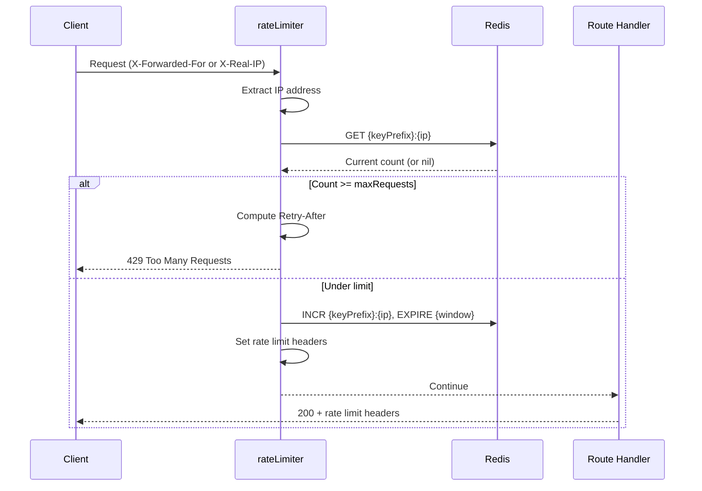

# API Architecture

## Overview

RESTful API built with **Hono** running on the **Bun** runtime. All routes mount at `/api/<resource>` and share a layered middleware system for rate limiting, CSRF protection, authentication, and input validation.

---

## Table of Contents

1. [Route Structure](#route-structure)
2. [Middleware Stack](#middleware-stack)
3. [Rate Limiting](#rate-limiting)
4. [Request & Response Patterns](#request--response-patterns)
5. [Client-Side Fetch Utilities](#client-side-fetch-utilities)
6. [Best Practices](#best-practices)

---

## Route Structure

**Location:** `backend/src/routes/`

```
backend/src/routes/
├── auth/index.ts          → /api/auth        (user registration/sync)
├── customer/index.ts      → /api/customer    (profile, orders)
├── subscriptions/index.ts → /api/subscriptions (checkout, portal, status)
├── reels/index.ts         → /api/reels       (discovery, analysis, export)
├── generation/index.ts    → /api/generation  (AI content generation)
├── queue/index.ts         → /api/queue       (scheduling)
├── admin/index.ts         → /api/admin       (admin dashboard, niches, analytics)
├── users/index.ts         → /api/users       (user management, admin-only)
├── analytics/index.ts     → /api/analytics   (business metrics)
├── public/index.ts        → /api/shared      (contact form, public endpoints)
├── csrf.ts                → /api/csrf        (CSRF token generation)
└── health.ts              → /api/health      (health, liveness, readiness)
```

Routes are registered in `backend/src/index.ts`:
```typescript
app.route("/api/auth", authRoutes);
app.route("/api/customer", customerRoutes);
app.route("/api/subscriptions", subscriptionRoutes);
app.route("/api/reels", reelsRoutes);
app.route("/api/generation", generationRoutes);
app.route("/api/queue", queueRoutes);
app.route("/api/admin", adminRoutes);
app.route("/api/users", userRoutes);
app.route("/api/analytics", analyticsRoutes);
app.route("/api/shared", publicRoutes);
app.route("/api/csrf", csrfRoutes);
app.route("/api/health", healthRoutes);
// Standalone:
app.get("/api/live", (c) => c.json({ status: "ok" }));
app.get("/api/ready", (c) => c.json({ status: "ready" }));
app.get("/api/metrics", ...); // Prometheus, bearer-token protected
```

### Route File Template

```typescript
import { Hono } from "hono";
import type { HonoEnv } from "../../middleware/protection";
import {
  authMiddleware,
  csrfMiddleware,
  rateLimiter,
  validateBody,
  validateQuery,
} from "../../middleware/protection";
import { db } from "../../services/db/db";
import { generatedContent } from "../../infrastructure/database/drizzle/schema";
import { eq } from "drizzle-orm";
import { z } from "zod";

const app = new Hono<HonoEnv>();

// GET — no CSRF needed
app.get(
  "/",
  rateLimiter("customer"),
  authMiddleware("user"),
  validateQuery(querySchema),
  async (c) => {
    const { user } = c.get("auth");
    const query = c.get("validatedQuery") as QueryType;
    const data = await db.select().from(generatedContent).where(eq(generatedContent.userId, user.id));
    return c.json({ data });
  }
);

// POST — requires CSRF
app.post(
  "/",
  rateLimiter("customer"),
  csrfMiddleware(),
  authMiddleware("user"),
  validateBody(bodySchema),
  async (c) => {
    const { user } = c.get("auth");
    const body = c.get("validatedBody") as BodyType;
    const [created] = await db.insert(generatedContent).values({ ...body, userId: user.id }).returning();
    return c.json({ data: created }, 201);
  }
);

// Admin-only
app.delete(
  "/:id",
  rateLimiter("admin"),
  csrfMiddleware(),
  authMiddleware("admin"),
  async (c) => {
    const id = Number(c.req.param("id"));
    await db.delete(generatedContent).where(eq(generatedContent.id, id));
    return c.json({ success: true });
  }
);

export default app;
```

---

## Middleware Stack

### Global (applied to all routes via `app.use("*", ...)`)

| Middleware | Purpose |
|-----------|---------|
| `logger()` | Request/response logging |
| `cors()` | Dynamic origin validation against `CORS_ALLOWED_ORIGINS` |
| `secureHeaders()` | Security response headers (CSP, HSTS, X-Frame-Options, etc.) |

### Per-Route (composed explicitly on each handler)

| Middleware | When to use |
|-----------|------------|
| `rateLimiter("public"\|"customer"\|"admin"\|"payment"\|"auth"\|"health")` | Always — first in chain |
| `csrfMiddleware()` | On all authenticated mutation routes (POST/PUT/PATCH/DELETE) |
| `authMiddleware("user"\|"admin")` | On any route requiring authentication |
| `validateBody(schema)` | On routes that accept a JSON body |
| `validateQuery(schema)` | On routes that accept query parameters |

### API Request Flow

```mermaid
sequenceDiagram
    participant Client
    participant Global Middleware
    participant rateLimiter
    participant csrfMiddleware
    participant authMiddleware
    participant validateBody
    participant Route Handler
    participant PostgreSQL

    Client->>Global Middleware: HTTP Request
    Global Middleware->>Global Middleware: logger() — log request
    Global Middleware->>Global Middleware: cors() — validate origin
    alt Origin not allowed
        Global Middleware-->>Client: 403 Forbidden (CORS)
    end
    Global Middleware->>Global Middleware: secureHeaders() — set response headers

    Global Middleware->>rateLimiter: Check rate limit (by IP)
    alt Limit exceeded
        rateLimiter-->>Client: 429 Too Many Requests
    end

    rateLimiter->>csrfMiddleware: (mutations only)
    alt CSRF invalid
        csrfMiddleware-->>Client: 403 CSRF_TOKEN_INVALID
    end

    csrfMiddleware->>authMiddleware: Verify Bearer token
    alt Token missing/invalid
        authMiddleware-->>Client: 401 INVALID_TOKEN
    end
    alt Role insufficient
        authMiddleware-->>Client: 403 ADMIN_REQUIRED
    end

    authMiddleware->>validateBody: Parse + validate JSON body
    alt Validation failed
        validateBody-->>Client: 422 VALIDATION_ERROR
    end

    validateBody->>Route Handler: Execute (auth + validatedBody available)
    Route Handler->>PostgreSQL: Query / mutation
    PostgreSQL-->>Route Handler: Data
    Route Handler-->>Client: JSON response
```



---

## Rate Limiting

**Location:** `backend/src/constants/rate-limit.config.ts`

All rate limiting is IP-based via Redis. Keys are scoped by type prefix.

| Type | Max Requests | Window | Used For |
|------|-------------|--------|---------|
| `public` | 30 | 60s | Unauthenticated endpoints |
| `customer` | 60 | 60s | Authenticated user endpoints |
| `admin` | 100 | 60s | Admin endpoints |
| `auth` | 10 | 60s | Auth/registration endpoints |
| `payment` | 5 | 60s | Stripe checkout endpoints |
| `health` | 1000 | 60s | Health check endpoints |

**Response headers on all requests:**
```
X-Rate-Limit-Limit: 60
X-Rate-Limit-Remaining: 41
X-Rate-Limit-Reset: 1741700000
Retry-After: 45       ← Only on 429
```

### Rate Limiter Flow



---

## Request & Response Patterns

### HTTP Methods

| Method | Purpose | Body | Success Status |
|--------|---------|------|----------------|
| `GET` | Read resource(s) | No | 200 |
| `POST` | Create resource | Yes | 200 or 201 |
| `PUT` | Replace resource | Yes | 200 |
| `PATCH` | Partial update | Yes | 200 |
| `DELETE` | Remove resource | No | 200 |

### Status Codes

```
200 OK                    — Successful GET/PUT/PATCH/DELETE
201 Created               — Successful POST (new resource)
400 Bad Request           — Invalid input, missing fields
401 Unauthorized          — Missing/invalid/expired token
403 Forbidden             — Insufficient permissions, CSRF failure
404 Not Found             — Resource doesn't exist
422 Unprocessable Entity  — Zod validation failed
429 Too Many Requests     — Rate limit exceeded
500 Internal Server Error — Unhandled server error
503 Service Unavailable   — Dependency down (AI, DB, Redis)
```

### Error Response Format

All errors follow this shape:
```json
{
  "error": "Human-readable description",
  "code": "MACHINE_READABLE_CODE",
  "details": { }   ← optional, Zod errors for 422
}
```

**Error codes:**
| Code | HTTP | Meaning |
|------|------|---------|
| `AUTH_REQUIRED` | 401 | No Authorization header |
| `INVALID_TOKEN` | 401 | Token verification failed |
| `ADMIN_REQUIRED` | 403 | User authenticated but not admin |
| `CSRF_TOKEN_INVALID` | 403 | CSRF header missing or invalid |
| `RATE_LIMIT_EXCEEDED` | 429 | IP rate limit hit |
| `VALIDATION_ERROR` | 422 | Zod schema rejected input |
| `INVALID_JSON` | 400 | Body is not valid JSON |
| `NOT_FOUND` | 404 | Resource not found |
| `INTERNAL_ERROR` | 500 | Unhandled error |
| `SERVICE_UNAVAILABLE` | 503 | Redis/AI/DB unavailable |

### Response Helpers

**Location:** `backend/src/middleware/protection.ts`

```typescript
// Standard helpers used in route handlers
return jsonSuccess(c, { data });         // 200 with data
return jsonError(c, "message", 400);     // Error response
return jsonNotFound(c, "Reel not found");
return jsonBadRequest(c, "Invalid ID");
return jsonForbidden(c, "Access denied");
return jsonInternalError(c, "Failed to process");
```

### Pagination Pattern

```
GET /api/reels?limit=20&offset=0&nicheId=3&sort=views
```

Response:
```json
{
  "items": [...],
  "total": 142,
  "limit": 20,
  "offset": 0
}
```

---

## Client-Side Fetch Utilities

### Rule: Never use `fetch` directly

Always use the established fetch utilities which automatically attach Firebase tokens and CSRF headers.

**Location:** `frontend/src/shared/`

### For GET Requests with Caching

```typescript
import { useQuery } from "@tanstack/react-query";
import { useQueryFetcher } from "@/shared/hooks/use-query-fetcher";
import { queryKeys } from "@/shared/lib/query-keys";

const fetcher = useQueryFetcher();

const { data, isLoading } = useQuery({
  queryKey: queryKeys.api.reels(nicheId),
  queryFn: () => fetcher(`/api/reels?nicheId=${nicheId}`),
  enabled: !!nicheId,
});
```

`useQueryFetcher` automatically attaches `Authorization: Bearer {token}` and `X-Timezone` headers.

### For Authenticated Mutations (POST/PUT/DELETE)

```typescript
import { useAuthenticatedFetch } from "@/shared/hooks/use-authenticated-fetch";

const { authenticatedFetchJson } = useAuthenticatedFetch();

// Automatically attaches Authorization + X-CSRF-Token headers
const result = await authenticatedFetchJson<GeneratedContent>("/api/generation", {
  method: "POST",
  body: JSON.stringify({ sourceReelId, prompt, outputType }),
});
```

### For Public (Unauthenticated) Requests

```typescript
import { publicFetchJson } from "@/shared/services/api/safe-fetch";

const result = await publicFetchJson("/api/shared/contact-messages", {
  method: "POST",
  body: JSON.stringify({ name, email, message }),
});
```

### React Query Cache Invalidation

```typescript
import { useQueryClient } from "@tanstack/react-query";
import { queryKeys } from "@/shared/lib/query-keys";

const queryClient = useQueryClient();

// After a mutation, invalidate the affected query
await queryClient.invalidateQueries({ queryKey: queryKeys.api.generation() });

// On logout, clear all user data
queryClient.removeQueries({ predicate: (q) => q.queryKey[0] === "api" });
```

---

## Best Practices

### Security
- ✅ Apply `rateLimiter()` to every route
- ✅ Apply `csrfMiddleware()` to every authenticated mutation
- ✅ Apply `authMiddleware("user")` or `("admin")` to every protected route
- ✅ Validate all inputs with `validateBody()` or `validateQuery()` before using them
- ✅ Scope DB queries by `user.id` — never query across users
- ✅ Use `jsonInternalError(c, message, error)` — never expose stack traces

### Performance
- ✅ Paginate all list endpoints (`limit`, `offset`)
- ✅ Return only needed fields — avoid `select *`
- ✅ Use database indexes on filtered columns

### API Design
- ✅ Use `HonoEnv` type on every route file for typed context variables
- ✅ Use Zod schemas defined at the top of the file, not inline
- ✅ Use `c.get("validatedBody")` — never `await c.req.json()` directly in handlers
- ✅ Keep route handlers thin — delegate business logic to service files

---

## Related Documentation

- [Authentication](./authentication.md) — Auth middleware details
- [Database](./database.md) — Drizzle query patterns
- [Generation System](../domain/generation-system.md) — AI generation API specifics
- [Studio System](../domain/studio-system.md) — Studio workspace API flows

---

*Last updated: March 2026*
