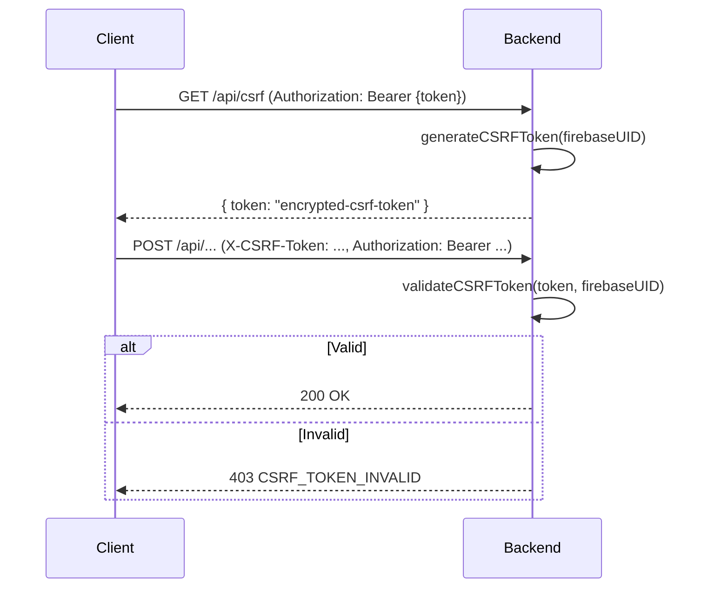
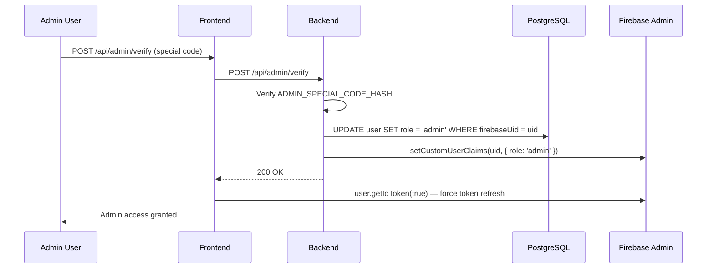
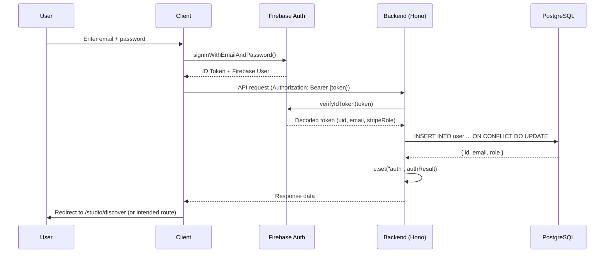
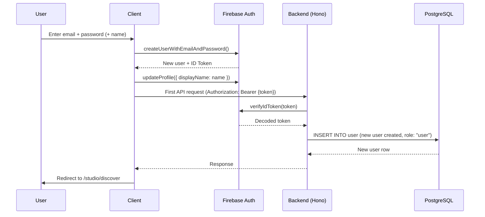
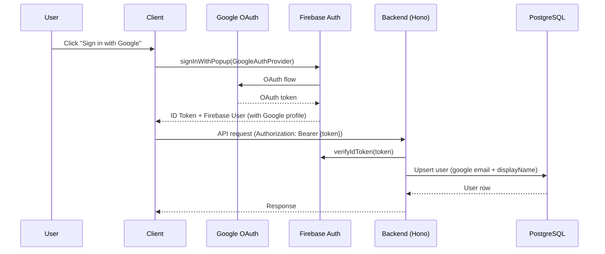

# Authentication & Authorization

## Overview

ReelStudio uses Firebase Authentication for identity management with server-side verification via Firebase Admin SDK. User data and roles are stored in PostgreSQL (Drizzle ORM) as the single source of truth.

**Components:**
- **Client**: Firebase Auth SDK — sign-in, token management
- **Server**: Firebase Admin SDK — token verification (`authMiddleware`)
- **Database**: PostgreSQL (Drizzle) — user rows, role
- **Cache**: Firebase custom claim `stripeRole` — fast subscription tier reads

---

## Table of Contents

1. [Architecture Overview](#architecture-overview)
2. [Middleware Stack](#middleware-stack)
3. [Auth Middleware (Hono)](#auth-middleware-hono)
4. [CSRF Middleware](#csrf-middleware)
5. [Role-Based Access Control](#role-based-access-control)
6. [Route Protection (Frontend)](#route-protection-frontend)
7. [Authentication Flows](#authentication-flows)
8. [Best Practices](#best-practices)

---

## Architecture Overview

```
┌──────────────────────────────────────────────────────────────┐
│                        Client Side                           │
│  SignIn/Up → Firebase Auth SDK → ID Token (JWT)              │
│  AppContext (useApp) → user, profile, isAdmin                │
│  AuthGuard → redirects to /sign-in if unauthenticated        │
└────────────────────────────┬─────────────────────────────────┘
                             │ Authorization: Bearer {token}
                             │ X-CSRF-Token  X-Timezone
┌────────────────────────────▼─────────────────────────────────┐
│                        Server Side (Hono)                    │
│  rateLimiter() → csrfMiddleware() → authMiddleware("user")   │
│                                          │                   │
│                              adminAuth.verifyIdToken()       │
│                                          │                   │
│                           db.insert(users).onConflictDoUpdate│
│                           (upsert — creates or refreshes)    │
│                                          │                   │
│                           c.set("auth", authResult)          │
│                           → route handler                    │
└──────────────────────────────────────────────────────────────┘
```

---

## Middleware Stack

Route handlers compose middleware in this order:

```typescript
// Typical user-protected route
app.post(
  "/some-endpoint",
  rateLimiter("customer"),
  csrfMiddleware(),
  authMiddleware("user"),
  validateBody(schema),
  async (c) => { /* handler */ }
);

// Admin-only route
app.get(
  "/admin-endpoint",
  rateLimiter("admin"),
  authMiddleware("admin"),
  async (c) => { /* handler */ }
);
```

| Middleware | Purpose |
|-----------|---------|
| `rateLimiter(type)` | Redis-backed IP rate limiting |
| `csrfMiddleware()` | Validates `X-CSRF-Token` header on mutations |
| `authMiddleware("user"\|"admin")` | Verifies Firebase JWT, upserts user in DB |
| `validateBody(schema)` | Zod body validation → `c.get("validatedBody")` |
| `validateQuery(schema)` | Zod query param validation → `c.get("validatedQuery")` |

---

## Auth Middleware (Hono)

**Location:** `backend/src/middleware/protection.ts`

```typescript
export function authMiddleware(
  level: "user" | "admin" = "user",
): MiddlewareHandler<HonoEnv> {
  return async (c, next) => {
    const authHeader = c.req.header("Authorization");

    if (!authHeader?.startsWith("Bearer ")) {
      return c.json({ error: "Authentication required", code: "AUTH_REQUIRED" }, 401);
    }

    const token = authHeader.substring(7);
    const decodedToken = await adminAuth.verifyIdToken(token, true);

    // Upsert user — creates on first visit, updates lastLogin on subsequent requests
    const [user] = await db
      .insert(users)
      .values({
        firebaseUid: decodedToken.uid,
        email: decodedToken.email,
        name: decodedToken.name || email.split("@")[0],
        role: "user",
        isActive: true,
        timezone: "UTC",
      })
      .onConflictDoUpdate({
        target: users.firebaseUid,
        set: { email, name, lastLogin: new Date() },
      })
      .returning({ id: users.id, email: users.email, role: users.role });

    if (level === "admin" && user.role !== "admin") {
      return c.json({ error: "Admin access required", code: "ADMIN_REQUIRED" }, 403);
    }

    c.set("auth", {
      user: { id: user.id, email: user.email, role: user.role },
      firebaseUser: {
        uid: decodedToken.uid,
        email: decodedToken.email || user.email,
        stripeRole: decodedToken.stripeRole as string | undefined,
      },
    });

    await next();
  };
}
```

**Context variables set:**
- `c.get("auth").user` — `{ id, email, role }` from PostgreSQL
- `c.get("auth").firebaseUser` — `{ uid, email, stripeRole }` from decoded JWT

**Usage in route handlers:**
```typescript
app.get("/profile", authMiddleware("user"), async (c) => {
  const { user } = c.get("auth");
  // user.id = PostgreSQL UUID
  // user.role = "user" | "admin"
  const data = await db.select().from(profiles).where(eq(profiles.userId, user.id));
  return c.json({ data });
});
```

---

## CSRF Middleware

**Location:** `backend/src/middleware/protection.ts`

CSRF protection is required on all authenticated mutations. The client obtains a token from `GET /api/csrf` and sends it in the `X-CSRF-Token` header.

```typescript
export function csrfMiddleware(): MiddlewareHandler<HonoEnv> {
  return async (c, next) => {
    // Skip GET requests and the /csrf endpoint itself
    if (c.req.method === "GET" || c.req.path.endsWith("/csrf")) {
      await next();
      return;
    }

    // Verify Firebase token to get uid
    const token = c.req.header("Authorization")?.substring(7);
    const decodedToken = await adminAuth.verifyIdToken(token, true);

    // Validate CSRF token against uid
    const csrfHeader = c.req.header("X-CSRF-Token") || "";
    const isValid = csrfHeader ? validateCSRFToken(csrfHeader, decodedToken.uid) : false;

    if (!isValid) {
      return c.json({ error: "CSRF token validation failed", code: "CSRF_TOKEN_INVALID" }, 403);
    }

    await next();
  };
}
```

**CSRF token lifecycle:**



The token is AES-256-GCM encrypted and bound to the user's Firebase UID.

---

## Role-Based Access Control

### Role Values

| Role | Description |
|------|-------------|
| `"user"` | Default — authenticated customer |
| `"admin"` | Full system access — set via `POST /api/admin/verify` |

**Source of truth:** PostgreSQL `user.role` column. Firebase custom claims (`role`) are a performance cache, synced from the database.

### Subscription Tiers (separate from roles)

The `stripeRole` Firebase custom claim tracks the paid subscription tier:

| Claim Value | Meaning |
|-------------|---------|
| `undefined` | Free tier (no active subscription) |
| `"basic"` | Basic subscription |
| `"pro"` | Pro subscription |
| `"enterprise"` | Enterprise subscription |

This claim is set and maintained automatically by the Firebase Stripe Extension.

### Admin Promotion Flow



---

## Route Protection (Frontend)

### AuthGuard Component

**Location:** `frontend/src/features/auth/components/auth-guard.tsx`

Wraps routes at layout level to enforce authentication before rendering children.

```typescript
// studio/_layout.tsx or admin/_layout.tsx
<AuthGuard authType="user">
  {children}
</AuthGuard>

<AuthGuard authType="admin">
  {children}
</AuthGuard>
```

**Behavior:**
- `authType="user"` — redirects to `/sign-in` if not authenticated
- `authType="admin"` — checks Firebase custom claim `role === "admin"`, redirects to `/` if not

### AppContext (useApp Hook)

**Location:** `frontend/src/shared/contexts/app-context.tsx`

Unified auth + profile state:

```typescript
const { user, profile, isAdmin, isAuthenticated, signIn, logout } = useApp();
```

| Field | Type | Description |
|-------|------|-------------|
| `user` | `User \| null` | Firebase Auth user object |
| `profile` | `UserProfile \| null` | Profile from `/api/customer/profile` |
| `isAuthenticated` | `boolean` | `user !== null` |
| `isAdmin` | `boolean` | `profile.role === "admin"` |
| `authLoading` | `boolean` | Auth state still loading |

---

## Authentication Flows

### Sign-In (Email/Password)



### Sign-Up (New Account)



### Google OAuth Sign-In



### Token Refresh

Firebase tokens expire after 1 hour. The client refreshes them automatically:

```typescript
// Force refresh to pick up new claims (e.g., after admin promotion or plan change)
const token = await user.getIdToken(true);
```

The `authMiddleware` passes `checkRevoked: true` to `verifyIdToken` so revoked tokens are rejected immediately.

---

## Best Practices

### Security
- ✅ Tokens verified server-side on every request (never trust client claims)
- ✅ `checkRevoked: true` in `verifyIdToken` — catches revoked tokens
- ✅ CSRF tokens bound to Firebase UID (AES-256-GCM encrypted)
- ✅ Role checked from PostgreSQL (source of truth), not only from Firebase claims
- ✅ Firebase Admin SDK never exposed to client (server-only)

### Performance
- ✅ User upserted in a single `INSERT … ON CONFLICT DO UPDATE` — no separate SELECT
- ✅ `stripeRole` read from JWT claim (no DB query for subscription tier checks)
- ✅ Admin role cached in Firebase custom claim for fast reads

### Error Codes

| Code | HTTP | Meaning |
|------|------|---------|
| `AUTH_REQUIRED` | 401 | Missing or malformed Authorization header |
| `INVALID_TOKEN` | 401 | Token verification failed (expired, revoked, invalid) |
| `ADMIN_REQUIRED` | 403 | User is authenticated but not an admin |
| `CSRF_TOKEN_INVALID` | 403 | CSRF token missing or doesn't match UID |

---

## Related Documentation

- [Security](./security.md) — CSRF, CORS, rate limiting, PII sanitization
- [API Architecture](./api.md) — Middleware composition, route patterns
- [Subscription System](../domain/subscription-system.md) — stripeRole claims
- [Admin Dashboard](../domain/admin-dashboard.md) — Admin role management

---

*Last updated: March 2026*
