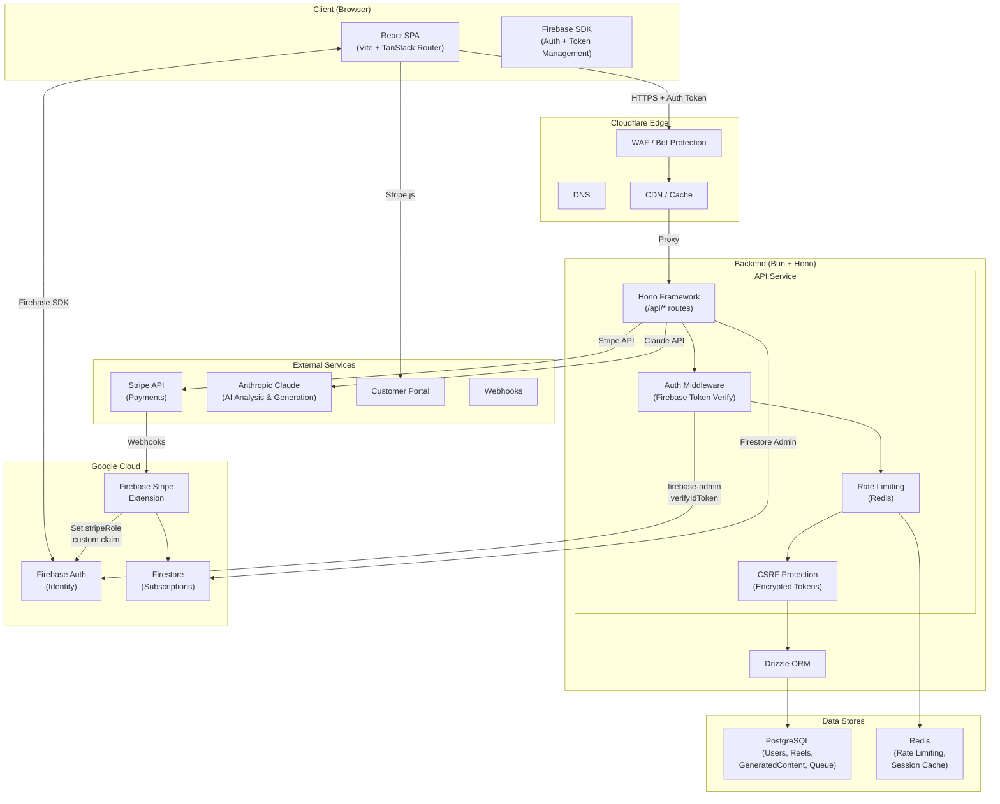
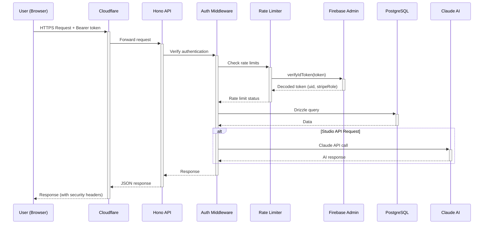
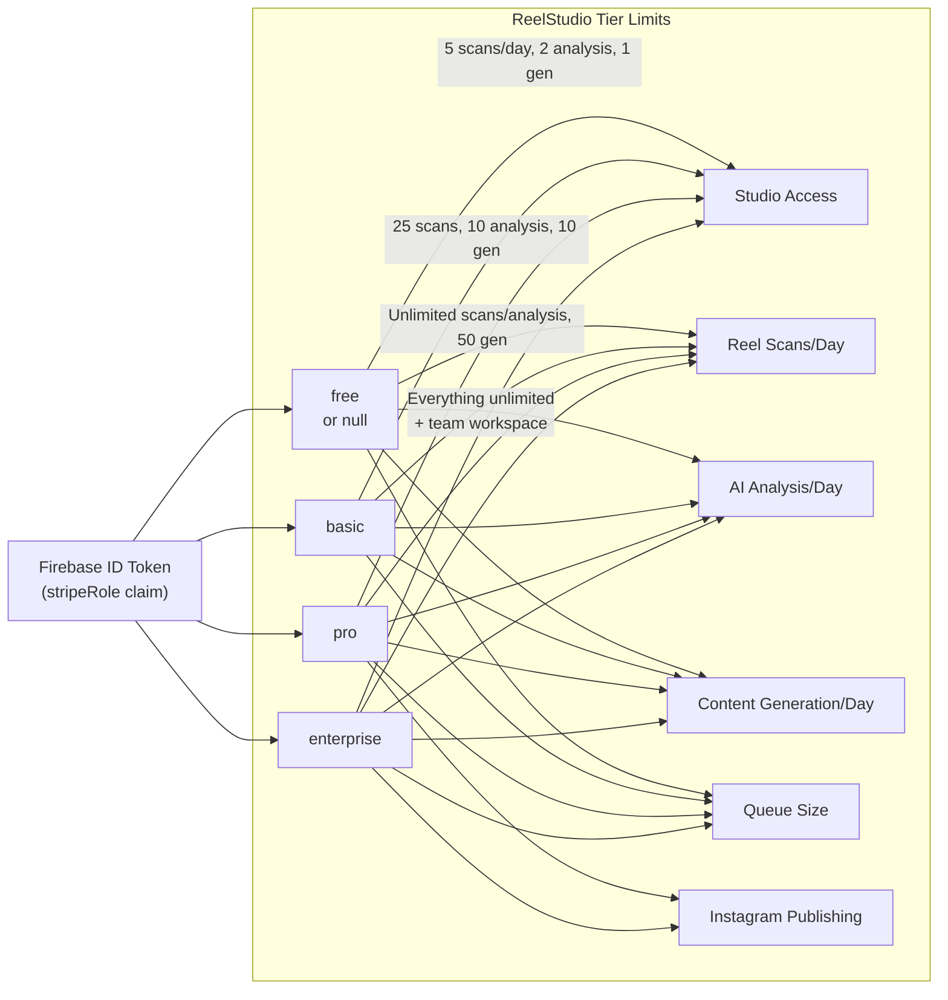
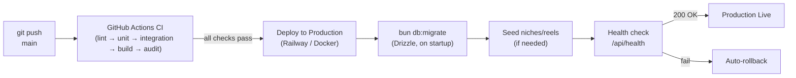

# Architecture & Data Flow Diagrams

---

## System Architecture Diagram

---

## Authentication & Request Flow

---

## Data Flow Diagram

```mermaid
flowchart TD
    subgraph UserActions["User Actions"]
        Signup["Sign Up"]
        Login["Log In"]
        DiscoverReels["Discover Reels"]
        AnalyzeReel["Analyze Reel"]
        GenerateContent["Generate Content"]
        ManageQueue["Manage Queue"]
        Subscribe["Subscribe"]
        CancelSub["Cancel Subscription"]
        DeleteAccount["Delete Account"]
        ExportData["Export Data (GDPR)"]
    end

    subgraph DataStores["Data Stores"]
        PG_Users["PostgreSQL\nusers table"]
        PG_Reels["PostgreSQL\nreels table"]
        PG_Analysis["PostgreSQL\nreel_analyses table"]
        PG_Generated["PostgreSQL\ngenerated_content table"]
        PG_Queue["PostgreSQL\nqueue_items table"]
        PG_Usage["PostgreSQL\nfeature_usage table"]
        PG_Orders["PostgreSQL\norders table"]
        FS_Subs["Firestore\nsubscriptions"]
        FB_Auth["Firebase Auth\n(tokens + claims)"]
        Stripe_DB["Stripe\n(billing data)"]
        Redis_Rate["Redis\n(rate limits)"]
    end

    subgraph Processing["Processing"]
        Auth["Firebase Auth"]
        StripeExt["Firebase Stripe Extension"]
        ClaudeAI["Claude AI\n(Analysis & Generation)"]
    end

    Signup -->|create user| PG_Users
    Signup -->|create account| FB_Auth
    Login -->|verify token| FB_Auth
    Login -->|update lastLogin| PG_Users

    DiscoverReels -->|query by niche| PG_Reels
    DiscoverReels -->|check rate limit| Redis_Rate
    
    AnalyzeReel -->|call Claude AI| ClaudeAI
    AnalyzeReel -->|store analysis| PG_Analysis
    AnalyzeReel -->|check usage| PG_Usage
    
    GenerateContent -->|call Claude AI| ClaudeAI
    GenerateContent -->|store content| PG_Generated
    GenerateContent -->|check tier limits| FB_Auth
    GenerateContent -->|update usage| PG_Usage
    
    ManageQueue -->|CRUD operations| PG_Queue
    ManageQueue -->|link content| PG_Generated

    Subscribe -->|checkout session| Stripe_DB
    Subscribe -->|webhook| StripeExt
    StripeExt -->|sync subscription| FS_Subs
    StripeExt -->|set stripeRole claim| FB_Auth

    CancelSub -->|via Stripe Portal| Stripe_DB
    CancelSub -->|webhook update| FS_Subs

    DeleteAccount -->|soft delete| PG_Users
    DeleteAccount -->|cascade delete| PG_Generated
    DeleteAccount -->|cascade delete| PG_Queue
    DeleteAccount -->|revoke tokens| FB_Auth
    DeleteAccount -->|hard delete after 30d| PG_Users

    ExportData -->|read all| PG_Users
    ExportData -->|read all| PG_Generated
    ExportData -->|read all| PG_Queue
    ExportData -->|read all| PG_Orders
    ExportData -->|return JSON| UserActions
```

---

## Subscription Tier Access Control

---

## Deployment Pipeline

