# Caption System — Architecture Design Document

> **Last updated:** 2026-04-08
> **Scope:** The end-to-end caption system covering timeline subtitle overlays (transcription → storage → rendering) and AI-generated Instagram post captions. Does not cover the broader editor save/load cycle or the reel analysis pipeline except where they intersect.
> **Audience:** Engineers onboarding to the editor, reviewers, future maintainers

---

## 1. Executive Summary

The caption system encompasses two independent subsystems that share the word "caption" but serve completely different purposes. **Timeline Captions** are word-level subtitle overlays rendered directly onto the video editor canvas — they originate from OpenAI Whisper transcription or manual user input, are stored as token arrays with millisecond timestamps, and are drawn onto an HTML5 canvas using a multi-layer rendering engine with animation support. **AI Post Captions** are Instagram post copy (hook + caption + script notes) produced by LLMs from reel analysis data, stored as plain text in `generated_content`, and surfaced in the content queue UI — they have no connection to the video canvas. The key architectural decision in the timeline caption subsystem is the separation between the `CaptionDoc` (the immutable transcript owned by a user) and the `CaptionClip` (a windowed, styled reference to that doc placed on the timeline) — this allows one transcript to be reused across multiple timeline clips.

---

## 2. System Context Diagram

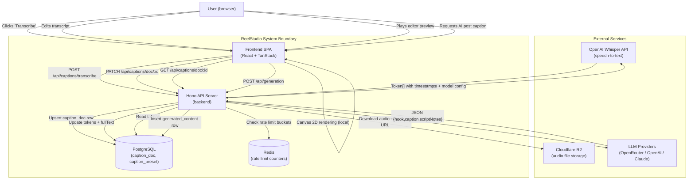

**Actors and their roles:**

- **User** — interacts via the browser. Triggers transcription, edits captions in the inspector, and plays back the editor preview.
- **Frontend SPA** — owns all canvas rendering logic. Fetches caption docs and presets from the API, runs the rendering pipeline entirely client-side on each animation frame.
- **Hono API Server** — thin orchestration layer. Validates requests, enforces auth and rate limits, delegates to `CaptionsService`, and calls external APIs.
- **OpenAI Whisper** — external speech-to-text model. Receives raw audio bytes; returns a transcript with per-word `start`/`end` timestamps in seconds.
- **Cloudflare R2** — object storage for audio assets. The API downloads from R2 (via signed URL) before sending to Whisper; it never proxies audio through the frontend.
- **PostgreSQL** — persistent store for `caption_doc` rows (tokens + fullText) and `caption_preset` rows (style definitions).
- **Redis** — used exclusively for rate-limiting transcription requests; not used for caption data caching.
- **LLM Providers** — for AI-generated post captions only. Receives a structured prompt built from reel analysis; returns JSON text.

---

## 3. Core Concepts & Glossary

| Term | Definition |
|------|-----------|
| **Token** | A single word with millisecond start/end timestamps: `{ text, startMs, endMs }`. The atomic unit of a caption transcript. |
| **CaptionDoc** | A PostgreSQL row (`caption_doc`) storing a full transcript for one audio asset. Contains the `tokens` array (JSONB) and `fullText` string. Can be produced by Whisper, manually entered, or imported. |
| **CaptionClip** | A clip object on the editor timeline that references a `CaptionDoc` by ID. Defines a time window into the doc (`sourceStartMs`/`sourceEndMs`), a style preset, and per-clip overrides. Multiple clips can reference the same doc. |
| **CaptionPage** | A group of tokens that appear together on screen at one time. Built by `buildPages()` based on timing gaps and a max span (`groupingMs`). The "page" flips when there is a long enough silence or the span limit is reached. |
| **CaptionPreset** | A named style definition stored in `caption_preset`. Defines typography, render layers, layout, animations, and the `groupingMs` default. 10 presets are seeded on startup. |
| **TextPreset** | The TypeScript shape of a `CaptionPreset`'s `definition` field. Includes `typography`, `layers`, `layout`, `entryAnimation`, `exitAnimation`, `wordActivation`, `groupingMs`, `exportMode`. |
| **StyleLayer** | One visual effect applied per token during rendering. Types: `fill`, `stroke`, `shadow`, `background`, `glow`. Layers are applied in order — background first, then stroke, fill, shadow, glow. |
| **wordActivation** | A per-word visual state system. Each token at any frame is `upcoming`, `active`, or `past`. Presets can define different colors or a scale pulse for the `active` state. |
| **groupingMs** | Maximum span (in ms) for a single page of tokens. When exceeded (or when a gap > 800ms is detected), a new page is started. Per-clip overrides take precedence over the preset default. |
| **exportMode** | Controls what happens during video export: `"full"` = full animated rendering, `"approximate"` = simplified rendering, `"static"` = single static frame. |
| **sliceTokensToRange** | A pure function that filters and re-zeros a token array to a clip's source window. Re-zeroing means time 0 within the slice = `sourceStartMs` in the original doc. |
| **CaptionLayout** | The output of `computeLayout()`. Contains pixel-positioned tokens, block dimensions, and line metadata — ready to be drawn by `renderFrame()`. |
| **AI Post Caption** | Text content produced by an LLM: a hook, Instagram caption body, and optional script notes. Stored in `generated_content`. Completely independent of the timeline caption system. |
| **orphan cleanup** | When a timeline project is saved or deleted, the editor service compares which `captionDocId` values were removed and deletes any that are no longer referenced in any of the user's projects. |

---

## 4. High-Level Architecture

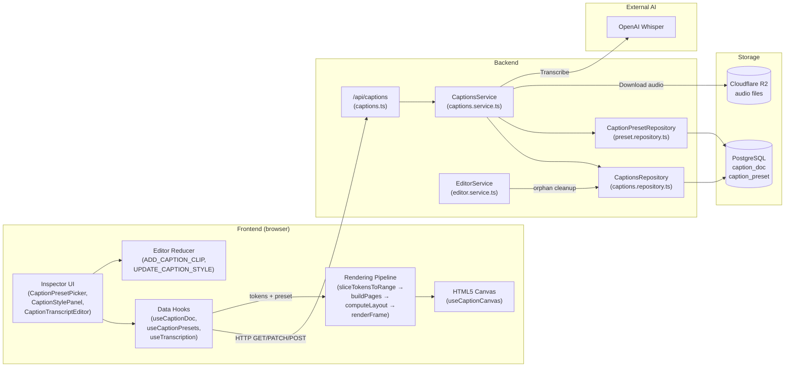

**Component descriptions:**

- **Inspector UI** (`frontend/src/features/editor/caption/components/`) — React components mounted in the editor's right panel when a caption clip is selected. Lets users pick a style preset, adjust overrides (position, font size, text transform), and edit the transcript text. Each component reads from TanStack Query cache and writes through mutations.

- **Data Hooks** (`frontend/src/features/editor/caption/hooks/`) — TanStack Query wrappers. `useCaptionDoc` fetches tokens by doc ID. `useCaptionPresets` fetches all style presets. `useTranscription` is a mutation that POSTs to `/api/captions/transcribe`. `useUpdateCaptionDoc` is a mutation that PATCHes the transcript. Cache keys live in `shared/lib/query-keys.ts`.

- **Editor Reducer** (`frontend/src/features/editor/model/editor-reducer-clip-ops.ts`) — Manages clip-level state changes within the local timeline. `ADD_CAPTION_CLIP` inserts a new clip; `UPDATE_CAPTION_STYLE` merges preset and override changes. These actions mutate local React state; autosave then persists the timeline to the server.

- **Rendering Pipeline** (`frontend/src/features/editor/caption/`) — Pure functions called on every animation frame tick. No side effects. Operates entirely in the browser using the Canvas 2D API.

- **HTML5 Canvas** — The `useCaptionCanvas` hook owns a `<canvas>` element ref and rerenders it whenever `currentTimeMs`, the clip, doc, or preset changes. A render-key deduplication check (`lastRenderedKeyRef`) prevents redundant redraws.

- **`/api/captions` Route** (`backend/src/routes/editor/captions.ts`) — Hono router with 6 endpoints. Applies middleware (rate limiter → CSRF → auth) before every mutating endpoint. Delegates immediately to `CaptionsService`.

- **`CaptionsService`** (`backend/src/domain/editor/captions.service.ts`) — All business logic: validation, R2 download, Whisper call, size enforcement, token normalization, upsert logic. No direct DB access — delegates to repositories.

- **`CaptionsRepository`** (`backend/src/domain/editor/captions.repository.ts`) — Thin Drizzle ORM wrapper. Owns `caption_doc` CRUD. All queries are scoped by `userId` to enforce ownership.

- **`CaptionPresetRepository`** (`backend/src/domain/editor/captions/preset.repository.ts`) — Reads from `caption_preset`. Maintains an in-memory cache (a `Map` + list cache) to avoid repeated DB reads for preset data that changes rarely.

- **`EditorService`** (`backend/src/domain/editor/editor.service.ts`) — Owns the project save and delete flows. After any project save, it calls `cleanupCaptionDocsIfUnreferenced()` to GC orphaned caption docs.

---

## 5. Data Model

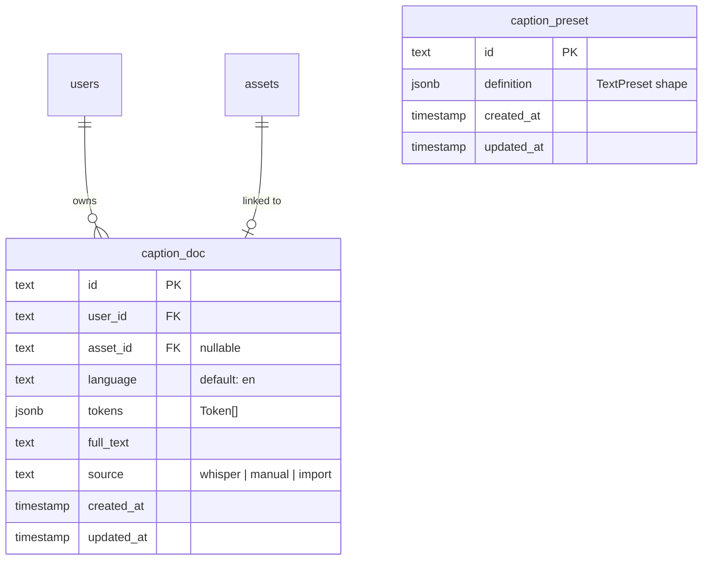

### `caption_doc`

Stores a single transcript — the word-level token array from Whisper or a user's manual input.

- **`tokens`** (JSONB): `Array<{ text: string, startMs: number, endMs: number }>`. Word-level timing from Whisper (converted from seconds to milliseconds by the service layer).
- **`full_text`**: The full transcript as a plain string. Derived from Whisper's top-level text field or provided directly for manual docs.
- **`source`**: `"whisper"` | `"manual"` | `"import"`. Indicates how the doc was created. Affects UI affordances (e.g., the transcript editor is always editable regardless of source).
- **`asset_id`**: Nullable FK to the `assets` table. When set, enforced unique per `(user_id, asset_id)` — one transcription per audio asset per user. `ON DELETE CASCADE` means deleting the asset also deletes its caption doc.
- **`user_id`**: FK to `users`. `ON DELETE CASCADE`. All queries are filtered by `userId` — users can only access their own docs.

**Indexes:**
- `caption_doc_asset_idx` on `asset_id`
- `caption_doc_user_idx` on `user_id`
- `caption_doc_user_asset_unique` partial unique on `(user_id, asset_id) WHERE asset_id IS NOT NULL`

### `caption_preset`

Stores style definitions for caption rendering. All 10 built-in presets are seeded on server startup via `seedPresetsIfEmpty()` (idempotent — skips if rows exist).

- **`id`**: Slug string (e.g. `"hormozi"`, `"karaoke"`), not a UUID. Used as `stylePresetId` on `CaptionClip`.
- **`definition`**: JSONB storing the full `TextPreset` shape — typography, layers, layout, animations, grouping config, and export mode.

**Seeded preset IDs:** `hormozi`, `clean-minimal`, `dark-box`, `karaoke`, `bold-outline`, `pop-scale`, `slide-up`, `fade-scale`, `glitch`, `word-highlight-box`.

### CaptionClip (in-memory / timeline JSON)

`CaptionClip` is not a standalone table — it lives inside the `tracks` JSONB column of the `edit_projects` table (part of the editor composition). Its shape:

```typescript
interface CaptionClip {
  id: string               // UUID, generated client-side
  type: "caption"
  startMs: number          // clip's position on the timeline
  durationMs: number       // clip's duration on the timeline
  captionDocId: string     // FK to caption_doc.id
  originVoiceoverClipId: string | null  // which voiceover this was built from
  sourceStartMs: number    // window start into the caption doc tokens
  sourceEndMs: number      // window end into the caption doc tokens
  stylePresetId: string    // FK to caption_preset.id
  styleOverrides: {
    positionY?: number
    fontSize?: number
    textTransform?: "none" | "uppercase" | "lowercase"
  }
  groupingMs: number       // overrides preset's groupingMs
}
```

The `sourceStartMs`/`sourceEndMs` window allows a single `CaptionDoc` to serve multiple clips that each show a different portion of the same transcript.

---

## 6. Key Flows

### 6.1 Transcription Flow (Whisper)

**Trigger:** User selects a voiceover/audio asset in the editor and clicks "Transcribe."
**Outcome:** A `caption_doc` row is created (or updated) in PostgreSQL; the frontend receives the token array and caches it.

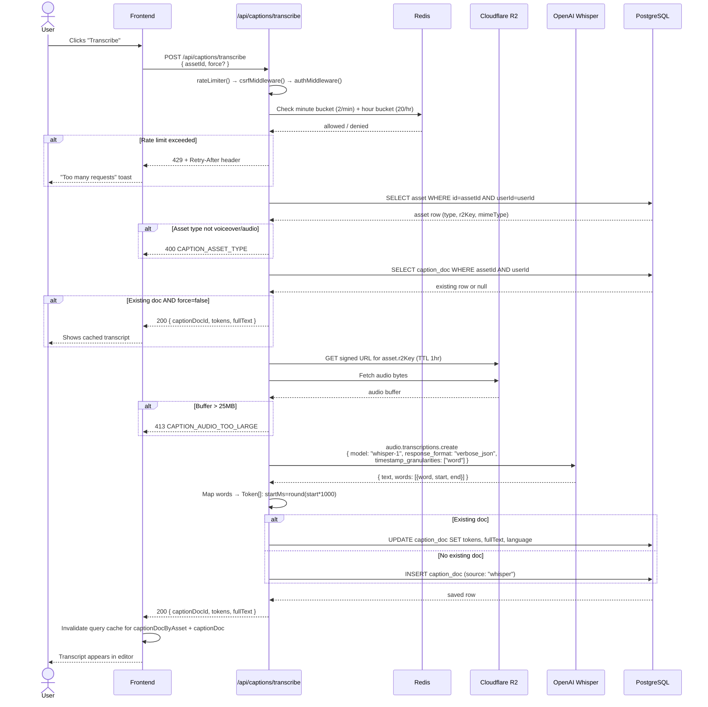

**Step-by-step walkthrough:**

1. **User action** — User clicks a transcribe button in the caption inspector or asset panel. The `useTranscription()` mutation fires.
2. **Frontend handling** — `authenticatedFetch` adds `Authorization: Bearer <token>` and the CSRF header, then POSTs `{ assetId, force? }`.
3. **API layer** — Three middleware layers run in order: `rateLimiter()` (global customer rate limit via Redis), `csrfMiddleware()` (validates CSRF token), `authMiddleware("user")` (verifies Firebase JWT, upserts DB user record, sets `c.get("auth")`). Then a second custom `transcriptionRateLimiter` middleware checks per-user buckets: 2 requests/minute and 20 requests/hour. In development mode this second limiter is bypassed.
4. **Service logic** — `CaptionsService.transcribeAsset()` validates the asset type (must be `voiceover` or `audio`), checks for an existing doc (returns early if found and `force=false`), downloads the audio from R2 via a signed URL, enforces the 25MB size limit, calls Whisper, converts word timestamps from seconds to milliseconds, then upserts the caption doc.
5. **Data layer** — Uses `ON CONFLICT` logic via Drizzle: if a doc exists for `(userId, assetId)`, it updates; otherwise it inserts. The unique partial index on `(user_id, asset_id) WHERE asset_id IS NOT NULL` prevents duplicate transcriptions at the DB level.
6. **Response path** — Returns `{ captionDocId, tokens, fullText }`. Frontend invalidates both the by-asset and by-ID query cache keys, causing any mounted `useCaptionDoc` hooks to refetch.

**Error scenarios:**
- **Asset not found** → 404 `NOT_FOUND`.
- **Wrong asset type** → 400 `CAPTION_ASSET_TYPE`.
- **Asset has no file** → 400 `CAPTION_NO_FILE`.
- **R2 download fails** → 500 `INTERNAL_ERROR` (logged with full context).
- **Audio > 25MB** → 413 `CAPTION_AUDIO_TOO_LARGE`.
- **Whisper rejects audio** (too short/long/bad format) → 422 `WHISPER_REJECTED` or `WHISPER_FORMAT`.
- **Whisper fails for other reason** → 502 `WHISPER_FAILED`.
- **Rate limit hit** → 429 with `Retry-After` header set to 60s (minute bucket) or 3600s (hour bucket).

---

### 6.2 Manual Caption Doc Creation

**Trigger:** User provides tokens and full text directly (e.g. imports a transcript).
**Outcome:** A `caption_doc` row is created in PostgreSQL with `source: "manual"`.

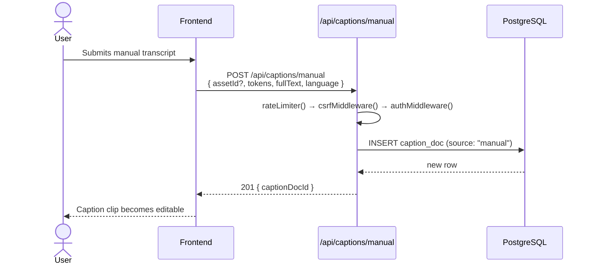

Unlike transcription, this endpoint has no Whisper call, no R2 download, and no special rate limiter — only the standard customer-tier rate limiter applies.

---

### 6.3 Adding a Caption Clip to the Timeline

**Trigger:** User adds a voiceover clip that already has a transcription, triggering auto-attach of a caption clip.
**Outcome:** A `CaptionClip` is added to the editor's local state; autosave persists it.

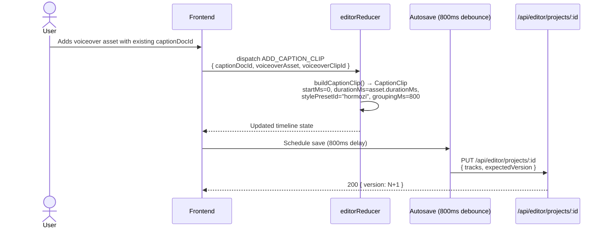

`buildCaptionClip()` (`backend/src/domain/editor/timeline/build-caption-clip.ts`) sets the default preset to `"hormozi"` and `groupingMs` to 800ms. The `sourceStartMs=0` and `sourceEndMs=durationMs` means the entire transcript is shown.

---

### 6.4 Real-Time Canvas Rendering

**Trigger:** Editor playhead moves (every animation frame during playback, or on scrub).
**Outcome:** The canvas element is repainted to show the correct caption page at `currentTimeMs`.

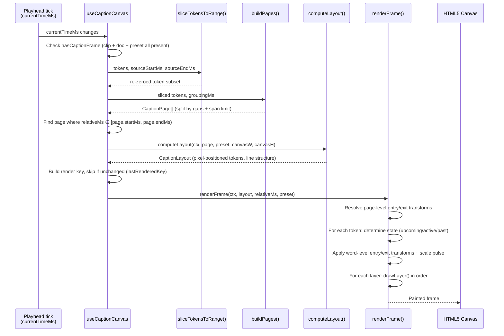

**Rendering pipeline detail:**

1. **`sliceTokensToRange()`** (`frontend/src/features/editor/caption/slice-tokens.ts`) — Filters the doc's token array to the clip's source window. Clips tokens that partially overlap the boundary. Re-zeros timing so that `sourceStartMs` in the original doc becomes time 0 in the slice.

2. **`buildPages()`** (`frontend/src/features/editor/caption/page-builder.ts`) — Groups tokens into pages. A new page starts when either: (a) the gap between two consecutive tokens exceeds `gapThresholdMs` (default 800ms), or (b) the span from the first token of the current page to the current token exceeds `groupingMs`. The result is an array of `CaptionPage` objects with their own token lists and time ranges.

3. **`computeLayout()`** (`frontend/src/features/editor/caption/layout-engine.ts`) — Uses the Canvas 2D `measureText()` API to determine word widths, wraps tokens into lines within `maxWidthPercent`, computes absolute pixel coordinates for each token, and calculates the block's bounding box anchored at `positionY` percent of canvas height. Font scaling is relative to a 1080×1920 reference frame: `scale = min(canvasW / 1080, canvasH / 1920)`.

4. **`renderFrame()`** (`frontend/src/features/editor/caption/renderer.ts`) — The draw loop. Applies page-level entry/exit animation transforms to the entire block (opacity, scale, translate, rotation). For each token: determines its visual state (`upcoming` / `active` / `past`), applies word-level animation transforms with stagger, applies a `scalePulse` if the token is active and the preset defines one, then draws each `StyleLayer` in order:
   - `background` — filled rectangle behind the text (word or line mode)
   - `stroke` — outlined text using `strokeText()`
   - `fill` — filled text using `fillText()`
   - `shadow` — text with `shadowColor`/`shadowBlur` set
   - `glow` — text drawn with `shadowBlur` for a bloom effect

**Render key deduplication** (`lastRenderedKeyRef`) — The hook builds a key string `"clipId:pageStart:pageEnd:canvasW:canvasH:roundedMs"`. If it matches the last rendered key, the draw is skipped. This avoids redundant canvas operations when the playhead hasn't moved enough to change the displayed content.

---

### 6.5 Editing the Transcript

**Trigger:** User edits the text in `CaptionTranscriptEditor` and saves.
**Outcome:** `caption_doc.tokens` and `caption_doc.full_text` are updated in PostgreSQL; the canvas re-renders on the next frame.

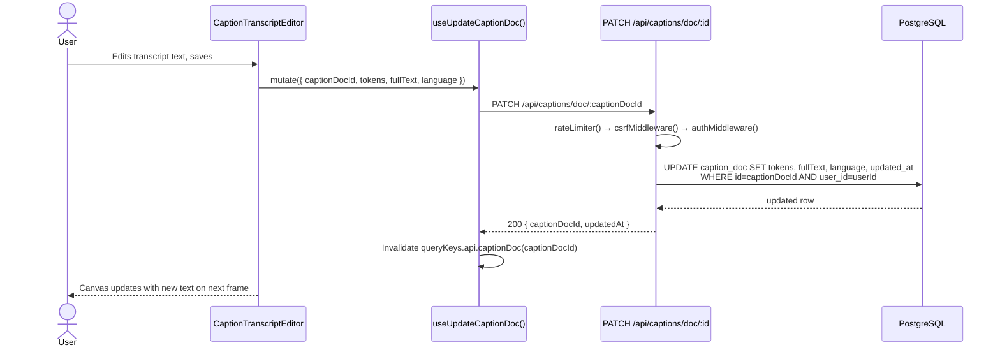

The update is always scoped to `(captionDocId, userId)` — users cannot update other users' docs.

---

### 6.6 Orphan Caption Doc Cleanup

**Trigger:** The editor autosave completes, or the user deletes a project.
**Outcome:** Any `caption_doc` rows no longer referenced by any of the user's projects are deleted.

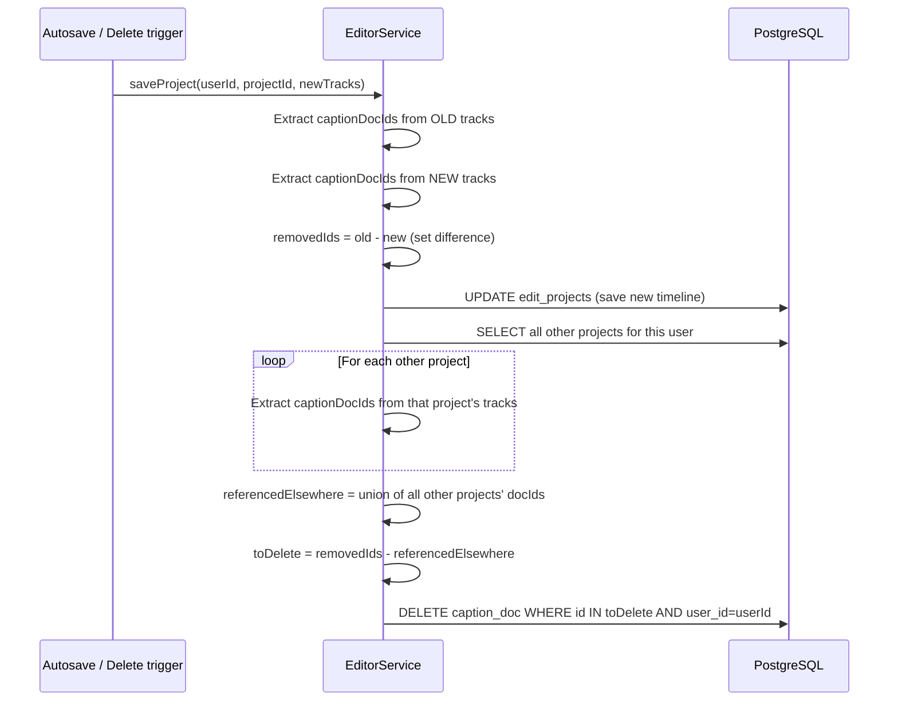

This runs inline after every project save (not in a background job). Errors in cleanup are logged as warnings but do not fail the save — the cleanup is non-fatal. This means there can be transient orphans if cleanup fails, but they will be collected on the next save or project deletion.

---

### 6.7 Caption Preset Seeding (Startup)

**Trigger:** Server startup (`src/index.ts` calls `seedCaptionPresets()`).
**Outcome:** `caption_preset` table contains the 10 built-in presets if it was empty.

`CaptionPresetRepository.seedPresetsIfEmpty()` reads the count of existing rows first. If any rows exist, it returns immediately — the seed is fully idempotent. If empty, it bulk-inserts the 10 presets from `backend/src/domain/editor/captions/preset-seed.ts` using `ON CONFLICT DO NOTHING`. Startup failures here are non-fatal — the server continues.

---

### 6.8 AI Post Caption Generation

**Trigger:** User selects a source reel and clicks "Generate" in the content studio.
**Outcome:** A `generated_content` row is created with hook, caption, and optional script notes.

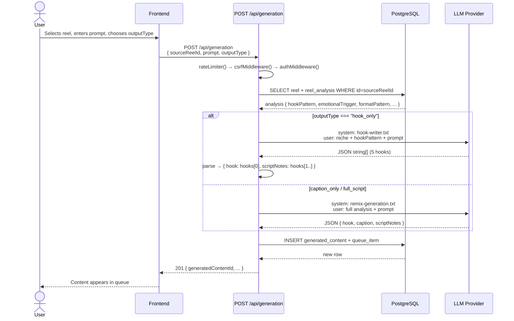

The LLM call goes through `callAi()` → `callAiWithFallback()` in `backend/src/lib/aiClient.ts`. Provider priority defaults to `[openrouter, openai, claude]` but is overridable via the `system_config` DB table at `ai.provider_priority`. This system is completely separate from the timeline caption system.

---

## 7. API Surface

### Caption Endpoints (`/api/captions`)

All endpoints require a valid Firebase auth token (`Authorization: Bearer <token>`) and pass through `rateLimiter("customer")` and `authMiddleware("user")`.

| Method | Path | Auth | CSRF | Description |
|--------|------|------|------|-------------|
| `POST` | `/api/captions/transcribe` | User | Yes | Transcribe an audio asset via Whisper |
| `POST` | `/api/captions/manual` | User | Yes | Create a caption doc from provided tokens |
| `GET` | `/api/captions/presets` | User | No | List all caption style presets |
| `GET` | `/api/captions/doc/:captionDocId` | User | No | Fetch a single caption doc by ID |
| `PATCH` | `/api/captions/doc/:captionDocId` | User | Yes | Update tokens and fullText of a caption doc |
| `GET` | `/api/captions/:assetId` | User | No | Fetch the caption doc linked to an asset |

**`POST /api/captions/transcribe`**

```typescript
// Request body (transcribeCaptionsSchema)
{ assetId: string, force?: boolean }

// Response 200
{ captionDocId: string, tokens: Token[], fullText: string }

// Errors
// 400 CAPTION_ASSET_TYPE — asset is not voiceover or audio
// 400 CAPTION_NO_FILE   — asset has no r2Key
// 404 NOT_FOUND         — asset not found for this user
// 413 CAPTION_AUDIO_TOO_LARGE — audio exceeds 25MB
// 422 WHISPER_REJECTED  — Whisper rejected the audio content
// 422 WHISPER_FORMAT    — unsupported audio format
// 429 RATE_LIMIT_EXCEEDED — 2/min or 20/hr exceeded
// 502 WHISPER_FAILED    — Whisper API error
```

Rate limits (production only): 2 requests/minute per user, 20 requests/hour per user. `Retry-After` header is set on 429 responses.

**`POST /api/captions/manual`**

```typescript
// Request body (manualCaptionDocSchema)
{ assetId: string | null, tokens: Token[], fullText: string, language: "en" }

// Response 201
{ captionDocId: string }
```

**`GET /api/captions/presets`**

```typescript
// Response 200 — array of CaptionPresetRecord
Array<{
  id: string
  name: string
  typography: Typography
  layers: StyleLayer[]
  layout: PresetLayout
  entryAnimation: AnimationDef[] | null
  exitAnimation: AnimationDef[] | null
  wordActivation: WordActivationEffect | null
  groupingMs: number
  exportMode: ExportMode
  createdAt: string
  updatedAt: string
}>
```

**`PATCH /api/captions/doc/:captionDocId`**

```typescript
// Request body (patchCaptionDocSchema)
{ tokens: Token[], fullText: string, language: "en" }

// Response 200
{ captionDocId: string, updatedAt: string }

// Errors
// 404 NOT_FOUND — doc not found or not owned by this user
```

---

## 8. State Management

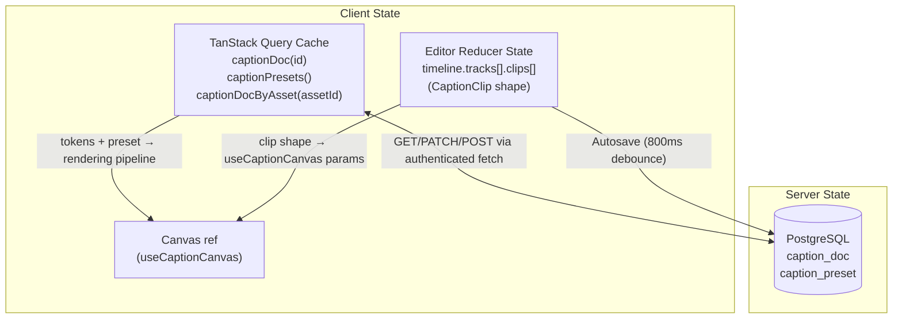

**What lives where:**

- **`caption_doc` row** — PostgreSQL. The single source of truth for a transcript. The frontend treats this as server state and always fetches via TanStack Query.
- **`caption_preset` rows** — PostgreSQL, but practically immutable after seeding. The `CaptionPresetRepository` caches them in-memory on the server side. The frontend also caches them in TanStack Query with no explicit `staleTime` — refetches happen on window focus.
- **`CaptionClip` shape** — Lives inside the editor reducer state (in-memory React state). Persisted to PostgreSQL via the autosave flow (inside `edit_projects.tracks`). Not independently queryable — always retrieved as part of the full project.
- **Canvas** — Ephemeral. Recomputed from current time + clip + doc + preset on every animation frame. No persistence.

**Cache invalidation strategy:**
- After transcription: invalidates `captionDocByAsset(assetId)` and `captionDoc(captionDocId)` — any mounted inspector that is showing this doc will refetch.
- After a manual update (`PATCH`): invalidates `captionDoc(captionDocId)`.
- After transcription: also invalidates `captionPresets()` (belt-and-suspenders; presets don't change on transcription but the invalidation is cheap).

**Multi-tab consistency:** The editor uses a version-based conflict detection (`expectedVersion`) for project saves. If two tabs save concurrently, the second gets a 409 and is told to refresh. Caption docs themselves have no conflict detection — a `PATCH` always wins (last write wins). In practice, caption docs are only edited in one inspector panel at a time.

---

## 9. Authentication & Security Model

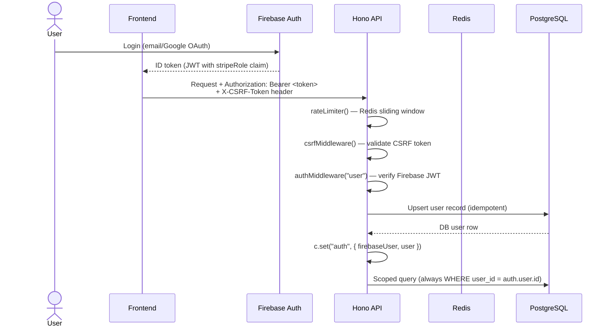

**Identity:** Firebase Authentication. The frontend calls `getIdToken()` on the Firebase SDK and sends the token as `Authorization: Bearer <token>`. The `authMiddleware` on the backend verifies the token signature with Firebase Admin SDK on every request — there is no token caching.

**Authorization model:** All caption endpoints are user-scoped. Every query includes `WHERE user_id = auth.user.id`. There is no admin-level access to caption data. A user can only read, write, and delete their own docs.

**Middleware chain order** (mutating endpoints): `rateLimiter()` → `csrfMiddleware()` → `authMiddleware()` → (optional) custom rate limiter → Zod validator → handler. Read endpoints skip `csrfMiddleware()`.

**CSRF protection:** `csrfMiddleware()` validates a token sent in the `X-CSRF-Token` header on all mutating requests. The frontend's `useAuthenticatedFetch` hook attaches this header automatically.

**Transcription-specific rate limiting:** In addition to the standard customer rate limiter, a custom `transcriptionRateLimiter` middleware checks two Redis buckets per user: `caption_transcribe_minute` (2/min) and `caption_transcribe_hour` (20/hr). This is bypassed in development (`IS_DEVELOPMENT === true`).

**Data isolation:** The `(user_id, asset_id) WHERE asset_id IS NOT NULL` unique index prevents one user from overwriting another user's transcription. All repository methods accept `userId` and filter by it — there is no global `findById()` without user scoping.

---

## 10. Design Decisions & Trade-offs

| Decision | Chosen Approach | Alternatives Considered | Rationale |
|----------|----------------|------------------------|-----------|
| **Token storage format** | JSONB array in PostgreSQL | Separate `caption_tokens` table with one row per word | Transcripts are always read/written as a whole — row-per-word adds join overhead with no benefit. JSONB allows atomic upsert of the full array. |
| **Client-side rendering** | Canvas 2D in the browser | Server-side frame rendering, SVG overlays | Eliminates server round-trips on every playhead tick. The rendering pipeline is pure and fast. Server-side rendering would require job queuing for interactive preview. |
| **Preset storage in DB** | `caption_preset` table seeded on startup | Hardcoded in source, config file | Allows future admin UI to add/edit presets without a deploy. `seedPresetsIfEmpty()` makes startup safe. In-memory cache avoids repeated reads. |
| **Separate CaptionDoc / CaptionClip** | Doc is the transcript; clip is the viewport | Embedding tokens directly in the clip | One audio file → one doc. Multiple clips can reference the same doc. Editing the transcript in one clip updates all clips referencing that doc. |
| **Orphan cleanup on save** | Inline cleanup after project save | Scheduled background job, no cleanup | Simple to implement and reason about. No additional infra. Risk: if cleanup throws, tokens are orphaned until next save — accepted because data is small and cleanup is non-fatal. |
| **Whisper word-level timestamps** | `timestamp_granularities: ["word"]` in the API call | Sentence-level, no timestamps | Word-level timestamps are required for the `wordActivation` highlight effect. Sentence-level would only support page-flip captions. |
| **English-only** | `language: "en"` hardcoded | Multi-language support | Whisper supports many languages. The language field exists in the schema for future expansion. The `CaptionLanguageScopeNotice` component surfaces this limitation in the UI. |
| **Two separate caption systems** | Timeline captions and AI post captions are fully independent | Shared data model or automatic bridging | They serve different purposes (video overlay vs. text copy) with different data shapes (tokens vs. text strings). Coupling them would add complexity with no benefit in current scope. |

---

## 11. Known Limitations & Future Considerations

- **English only.** The `language` field in `caption_doc` exists for future multi-language support, but Whisper is currently always called without a `language` parameter override and `language: "en"` is hardcoded in all insertion paths.

- **Orphan cleanup is synchronous and non-atomic.** If the server crashes after saving the project but before running cleanup, caption docs can be permanently orphaned. A scheduled GC job scanning for unreferenced docs would be more robust at scale.

- **No export pipeline.** `exportMode` (`"full" | "approximate" | "static"`) is stored on presets and surfaced in the `CaptionPresetPicker` UI, but there is no video export implementation yet. The field exists to prepare for a future renderer.

- **In-memory preset cache is process-local.** If multiple API server instances run, each has its own `CaptionPresetRepository` cache. If a preset is updated in the DB, the other processes won't see it until restart. Acceptable now (one process), but will need invalidation logic (e.g., Redis pub/sub) for multi-instance deployments.

- **Transcript editing is all-or-nothing.** `PATCH /api/captions/doc/:id` replaces the entire token array. There is no partial token update, undo history on the server, or conflict detection for concurrent edits from multiple sessions.

- **No import source support.** The `source: "import"` enum value exists in the schema but no import endpoint is implemented.

- **Font loading is fire-and-forget.** `FontLoader.load()` is called inside the async render loop but errors are not surfaced to the user. If a custom font URL is unreachable, rendering falls back to the system font silently.
