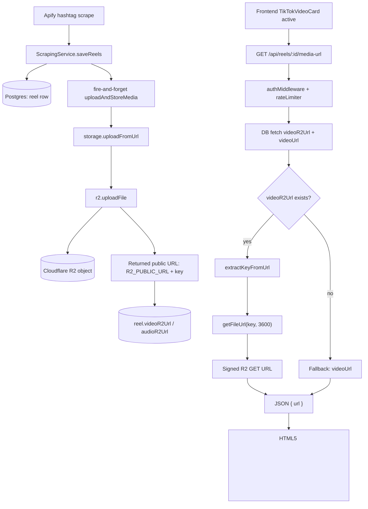
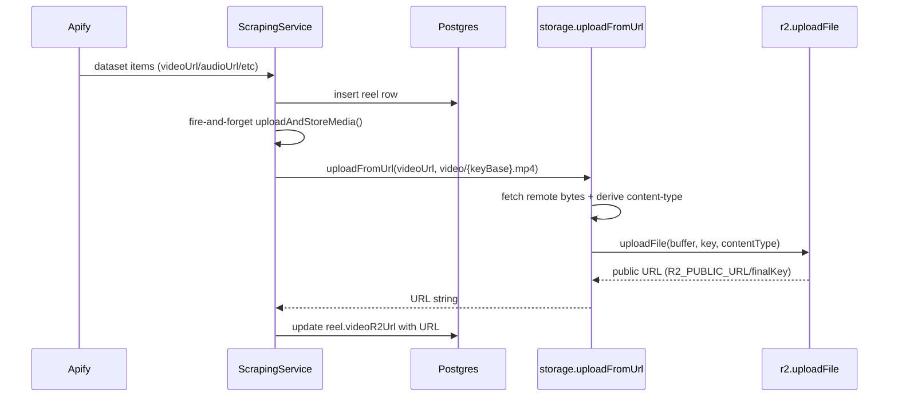
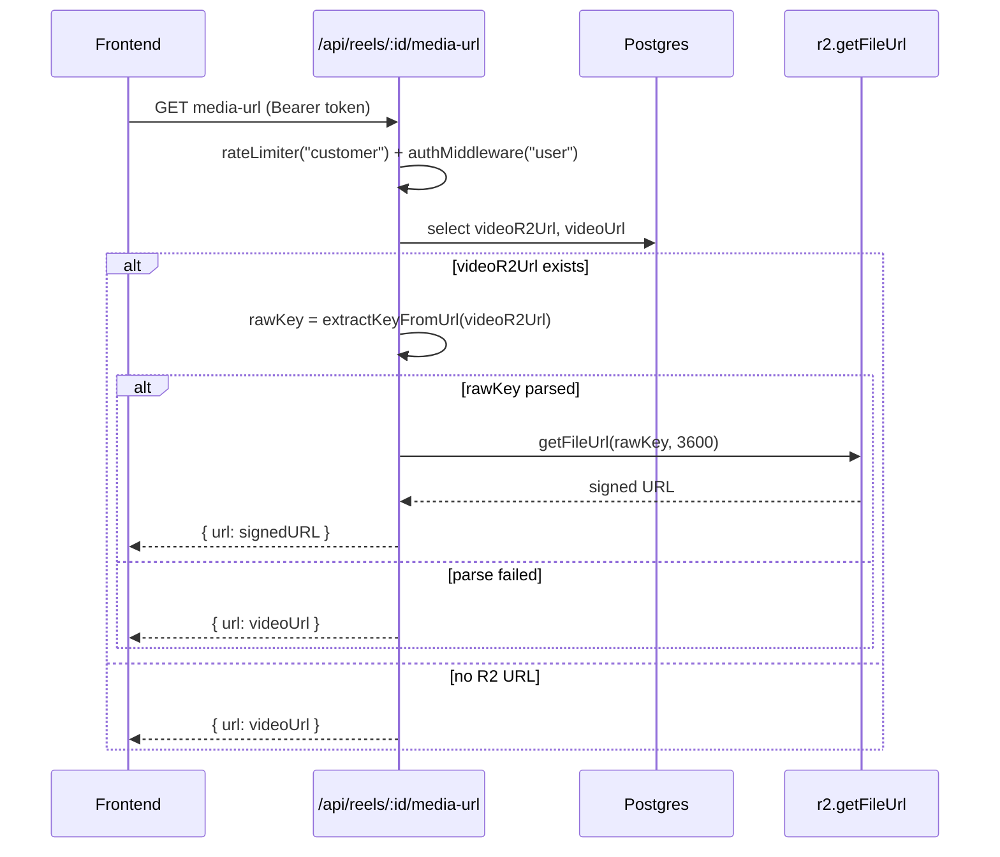

# ContentAI Reel Video Playback: Technical Deep Dive (Code-Accurate)

> This document reflects the **current implementation** in the repository, not a hypothetical architecture.

## 1) What this system currently does

At a high level, your app:

1. Scrapes reel metadata/media URLs from Apify.
2. Stores reel rows in Postgres (`reel` table).
3. Asynchronously mirrors video/audio files into Cloudflare R2.
4. Stores the returned R2 public URL in `videoR2Url` / `audioR2Url` columns.
5. At playback time, generates a short-lived signed R2 GET URL (1 hour) and returns it to the frontend.
6. Falls back to original `videoUrl` if signing fails or no R2 URL exists.

---

## 2) End-to-end architecture (actual)



---

## 3) Data model relevant to playback

`reel` table fields used in playback pipeline:

- `videoUrl`: original scraped video URL.
- `videoR2Url`: R2 storage URL for mirrored video.
- `audioR2Url`: R2 storage URL for mirrored audio.
- `thumbnailUrl`: image fallback in UI.

Source: `backend/src/infrastructure/database/drizzle/schema.ts`.

### Important schema caveat

The column naming has been corrected to properly reflect that these fields store URLs:
- `videoR2Url`: R2 storage URL for mirrored video
- `audioR2Url`: R2 storage URL for mirrored audio

---

## 4) Ingestion + R2 mirror pipeline

The ingestion path is implemented in `ScrapingService`.



### Key implementation details

- Upload is **non-blocking** relative to reel insert (`fire-and-forget`).
- Uploading uses `Promise.allSettled` for video and audio.
- Remote media fetch sets custom UA: `ContentAI-Scraper/1.0`.
- Dev environment prefixes object keys with `testing/`.

---

## 5) R2 service internals

Implemented in `backend/src/services/storage/r2.ts`.

### 5.1 Client setup

- Uses AWS S3 SDK against R2 endpoint:
  - `endpoint = https://${R2_ACCOUNT_ID}.r2.cloudflarestorage.com`
  - `region = "auto"`

### 5.2 Upload behavior

`uploadFile(file, key, contentType)`:

- Prefixes key with `testing/` when `APP_ENV === "development"`.
- Uploads via `@aws-sdk/lib-storage` `Upload` helper.
- Returns a **public URL string** built from `R2_PUBLIC_URL` + `finalKey`.

### 5.3 Signed playback URL behavior

`getFileUrl(key, expiresIn = 3600)`:

- Applies dev prefix the same way (`testing/` in development).
- Generates a presigned **GET** URL via `getSignedUrl(GetObjectCommand, { expiresIn })`.
- Default TTL = `3600` seconds (1 hour).

### 5.4 URL -> key conversion

`extractKeyFromUrl(url)`:

- Parses pathname and decodes URI components.
- Removes `testing/` prefix in development so signing does not double-prefix.

---

## 6) Playback URL API endpoint

Implemented at `GET /api/reels/:id/media-url` in `backend/src/routes/reels/index.ts`.



### Fallback semantics

- If R2 signing throws: fallback to `videoUrl`.
- If neither signed URL nor fallback exists: `404 { error: "No video available" }`.

---

## 7) Frontend playback flow

Frontend files:

- `frontend/src/features/reels/hooks/use-reels.ts`
- `frontend/src/features/reels/components/TikTokVideoCard.tsx`

### 7.1 Query behavior

`useReelMediaUrl(reelId, hasVideo)`:

- Calls `/api/reels/:id/media-url`.
- Enabled only when user exists, reel is known, and reel has media.
- Uses `staleTime = 30 minutes` while signed URL TTL is 1 hour.

### 7.2 Player behavior

`TikTokVideoCard`:

- Determines `hasVideo = !!(reel.videoUrl || reel.videoR2Url)`.
- Fetches media URL only for active reel card.
- Uses native HTML5 `<video>` with:
  - `loop`
  - `playsInline`
  - mute sync
  - click-to-toggle pause/play
  - buffering indicators (`onWaiting`, `onCanPlay`)
- If no video source:
  - fallback to `thumbnailUrl` image
  - else emoji gradient placeholder.

### 7.3 What is NOT currently in the player

- No HLS manifest pipeline.
- No DASH player.
- No adaptive bitrate controller.
- No transcoding quality ladder in this repo path.

Playback is currently **single source URL + native HTML5 video**.

---

## 8) Auth, protection, and request gating

For reels endpoints, route wiring includes:

- `rateLimiter("customer")`
- `authMiddleware("user")`

`authMiddleware` verifies Firebase ID token (`Bearer ...`) and attaches auth context.
If missing/invalid token: `401`.

So signed playback URL retrieval is authenticated API access, not a fully public endpoint.

---

## 9) Environment configuration required for R2

From `backend/src/utils/config/envUtil.ts`:

- `R2_ACCOUNT_ID`
- `R2_ACCESS_KEY_ID`
- `R2_SECRET_ACCESS_KEY`
- `R2_BUCKET_NAME`
- `R2_PUBLIC_URL`
- `APP_ENV` (affects `testing/` prefix behavior)

If core R2 vars are missing, R2 module logs warning and upload/sign operations will fail when invoked.

---

## 10) Lifecycle and expiration characteristics

- Signed media URL TTL: **1 hour** (`3600s`).
- Frontend cache staleness: **30 minutes**.
- Practical effect: frontend typically reuses URL during scroll sessions and refreshes before expiration under normal usage.

---

## 11) Failure modes and current behavior

```mermaid
flowchart TD
    A[Request media-url] --> B{Reel exists?}
    B -->|no| C[404 Reel not found]
    B -->|yes| D{videoR2Url present?}
    D -->|no| E[Return videoUrl]
    D -->|yes| F[extractKeyFromUrl]
    F -->|null/invalid| E
    F -->|ok| G[getFileUrl signed R2]
    G -->|success| H[Return signed URL]
    G -->|error| E
    E --> I{url present?}
    I -->|yes| J[200 {url}]
    I -->|no| K[404 No video available]
```

Current strategy prefers availability (fallback) over hard failure when signing path has issues.

---

## 12) Known technical debt / TODOs in code

1. ~~Column naming has been corrected (`videoR2Url` / `audioR2Url` storing URLs).~~ ✅ **RESOLVED**
2. Playback endpoint must parse URL back into key because of naming/storage mismatch.
3. No dedicated media service abstraction for playback URL logic yet (logic lives in route handler).
4. Ingestion upload is async fire-and-forget; reel can appear before R2 mirror finishes.

---

## 13) Practical summary

The core playback "magic" is simple:

- Backend signs a short-lived R2 URL.
- Client feeds that signed URL into the native HTML5 `<video>` tag.

Everything else (auth, caching, fallback) supports that flow.

Your current playback stack is:

- **Backend API (Hono)** for authenticated media URL retrieval.
- **Cloudflare R2** for mirrored media storage.
- **S3-compatible presigned GET URL** signing for playback.
- **Frontend React + native HTML5 video** for rendering/interaction.
- **Fallback to original scraped URL** for resilience.

This is a pragmatic architecture: simple playback path, signed access when R2 copy exists, and graceful degradation when it does not.

---

## Appendix A: Code map

- R2 core: `backend/src/services/storage/r2.ts`
- Storage wrapper: `backend/src/services/storage/index.ts`
- Scrape + async media mirror: `backend/src/services/scraping.service.ts`
- Playback endpoint: `backend/src/routes/reels/index.ts`
- Reel schema: `backend/src/infrastructure/database/drizzle/schema.ts`
- Frontend media query: `frontend/src/features/reels/hooks/use-reels.ts`
- Frontend card player: `frontend/src/features/reels/components/TikTokVideoCard.tsx`
