# Editor Preview Engine — Architecture Design Document

> **Last updated:** 2026-04-12
> **Scope:** Browser-side editor preview runtime for timeline playback, frame decode, compositing, audio scheduling, and caption/text overlays. This doc does not cover server-side export, autosave, or project persistence except where they feed preview state.
> **Audience:** Engineers onboarding, reviewers, future maintainers

## 1. Executive Summary

The editor preview engine is the browser-side runtime that turns timeline state into a live audiovisual preview. It replaces the older DOM-media-element preview path with an engine-centered pipeline: `AudioMixer` owns time, `DecoderPool` owns video decode workers, `PreviewEngine` derives frame descriptors from timeline state, and `CompositorWorker` draws the final frame onto a transferred canvas. The key architectural decision is that React no longer renders video frames; React configures and observes the engine, while decoding and compositing happen imperatively. Today, video decode runs in dedicated workers, audio scheduling runs through `AudioContext` on the main thread with a Safari `HTMLAudioElement` fallback, and captions are pre-rendered on a hidden canvas and injected into the compositor as `ImageBitmap`s.

## 2. System Context Diagram

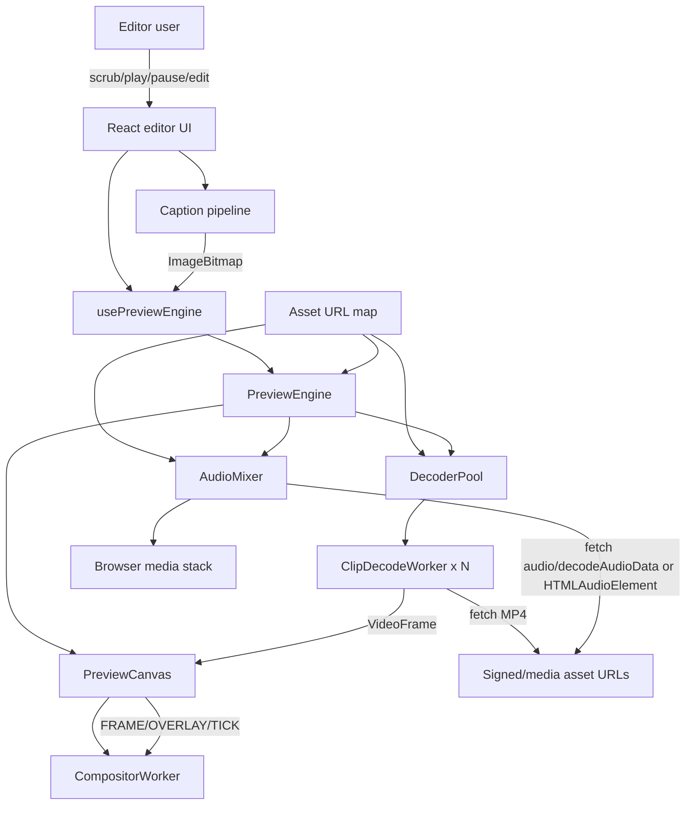

The user only interacts with React UI, but React is not the playback engine. `usePreviewEngine` translates editor state into imperative engine calls. `PreviewEngine` then coordinates three lower-level subsystems: audio scheduling (`AudioMixer`), video decode (`DecoderPool` + `ClipDecodeWorker`), and final drawing (`PreviewCanvas` + `CompositorWorker`). Media bytes come from resolved asset URLs supplied by the editor asset map.

## 3. Core Concepts & Glossary

| Term | Definition |
|------|-----------|
| Timeline time | Time in the editor composition, measured in milliseconds from the start of the edit. |
| Source time | Time inside a clip’s source asset after trim and speed are applied. |
| Playhead | Current timeline position the user sees in the editor. |
| Engine playhead | The `PreviewEngine`’s internal notion of current preview time. During playback it follows the audio clock; during pause/scrub it follows explicit seeks. |
| Audio clock | `AudioContext.currentTime` adjusted by `baseLatency`; this is the authoritative playback clock while playing. |
| Decode worker | One `ClipDecodeWorker` instance that demuxes and decodes exactly one video clip asset. |
| Decoder pool | `DecoderPool`, which decides which clips deserve active decode workers near the playhead. |
| GOP | Group of pictures. A seek to a non-keyframe must decode forward from the preceding keyframe. |
| Keyframe index | Per-asset list of sync samples built in `ClipDecodeWorker` so seeks can restart from the correct GOP boundary. |
| Compositor descriptor | Lightweight object derived from timeline state that tells the compositor which clip frame to draw, where, and with what transforms/effects. |
| Caption bitmap | An `ImageBitmap` created from a hidden caption canvas and sent to the compositor as an overlay. |
| Effect preview | Temporary, uncommitted clip property overrides from the inspector hover/preview path. |
| Render tick | One compositor update for one playhead time. It is driven by the audio clock while playing. |
| React publish interval | Low-frequency UI time update from engine to React (`250ms`) so the rest of the editor UI is not rerendered every frame. |

## 4. High-Level Architecture

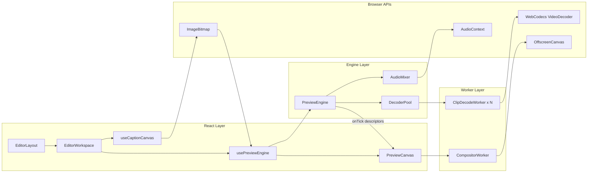

### React Layer

- **`EditorLayout`**
  What it does: Top-level editor shell that wires runtime state into toolbar, workspace, and timeline.
  What it owns: The editor reducer state and `playheadMs` mirror exposed by `useEditorLayoutRuntime`.
  What it depends on: `EditorWorkspace`, transport hooks, asset URL map, and editor store.

- **`EditorWorkspace`**
  What it does: Bridges editor state to the preview engine and caption pipeline.
  What it owns: Hidden caption canvas lifecycle, current active caption clip identity, and preview ref.
  What it depends on: `usePreviewEngine`, `useCaptionCanvas`, editor context, asset URL map.

- **`usePreviewEngine`**
  What it does: Lifecycle adapter between React and `PreviewEngine`.
  What it owns: Engine instance creation/destruction, callback ref freshness, and translation from React updates into `play()`, `pause()`, `seek()`, `update()`, and caption-frame injection.
  What it depends on: `PreviewEngine`, `PreviewCanvasHandle`, external editor state.

- **`PreviewCanvas`**
  What it does: Owns the visible `<canvas>` element and the compositor worker channel.
  What it owns: Worker creation, one-time `transferControlToOffscreen()`, frame relay, overlay relay, and canvas resize messages.
  What it depends on: `CompositorWorker`, browser canvas APIs, engine callbacks.

- **`useCaptionCanvas`**
  What it does: Imperatively renders caption clips onto a hidden canvas and converts the result to `ImageBitmap`.
  What it owns: Font loading, stale-render cancellation token, page selection, and last rendered key.
  What it depends on: Caption doc/preset data, caption layout/render helpers, hidden `<canvas>`.

### Engine Layer

- **`PreviewEngine`**
  What it does: Central coordinator for preview playback, pause, seek, timeline updates, metrics, text serialization, and compositor ticks.
  What it owns: Engine playhead, playback session state, tick loop, metrics, current tracks, and the current pending caption frame.
  What it depends on: `AudioMixer`, `DecoderPool`, timeline composition helpers, and React-supplied callbacks.

- **`AudioMixer`**
  What it does: Schedules and controls audio for all audio-producing clips.
  What it owns: `AudioContext`, master gain node, per-track gain nodes, scheduled sources, and decoded buffer cache.
  What it depends on: Web Audio APIs, asset URLs, clip timing math.

- **`DecoderPool`**
  What it does: Decides which video clips get active decode workers near the playhead and routes worker output upward.
  What it owns: Worker registry, play/pause state for workers, failure cooldown map, and seek token bookkeeping.
  What it depends on: `ClipDecodeWorker`, decode guard heuristics, clip source-time math.

### Worker Layer

- **`ClipDecodeWorker`**
  What it does: For one clip asset, fetches MP4 bytes, demuxes video samples with `mp4box`, builds keyframe index, performs GOP-aware seeks, and emits decoded `VideoFrame`s.
  What it owns: `VideoDecoder`, sample list, keyframe index, playback pump, and seek-state buffers.
  What it depends on: WebCodecs, `mp4box`, browser fetch, decode guard limits.

- **`CompositorWorker`**
  What it does: Draws the final preview frame on an `OffscreenCanvas`.
  What it owns: Per-clip frame queues, active overlay payloads, canvas dimensions, and clip transform/filter application.
  What it depends on: `OffscreenCanvas`, `ImageBitmap`, `VideoFrame`, compositor descriptors from `PreviewEngine`.

## 5. Data Model

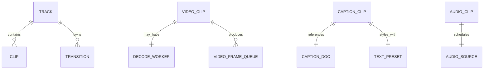

The preview runtime does not introduce a database schema. Its data model is in-memory and derived from the editor state types in `frontend/src/features/editor/types/editor.ts`.

### Core entities

- **`Track`**
  Purpose: Top-level lane in the timeline.
  Key fields: `id`, `type`, `muted`, `locked`, `clips`, `transitions`.
  Storage: Editor reducer state in memory.

- **`VideoClip` / `AudioClip` / `MusicClip`**
  Purpose: Media-bearing clips.
  Key fields: `startMs`, `durationMs`, `trimStartMs`, `sourceMaxDurationMs`, `speed`, `volume`, `assetId`, visual transform properties.
  Storage: Editor reducer state in memory; actual media bytes live behind asset URLs.

- **`TextClip`**
  Purpose: Text overlay rendered directly by the compositor.
  Key fields: `textContent`, `textAutoChunk`, `textStyle`, visual transform fields.
  Storage: Editor reducer state in memory.

- **`CaptionClip`**
  Purpose: Timed caption overlay that references a caption transcript document and style preset.
  Key fields: `captionDocId`, `sourceStartMs`, `sourceEndMs`, `stylePresetId`, `groupingMs`, `styleOverrides`.
  Storage: Clip metadata in reducer state; caption docs/presets are fetched over editor APIs and cached via React Query.

- **`Transition`**
  Purpose: Transition metadata attached to a track.
  Key fields: `type`, `durationMs`, `clipAId`, `clipBId`.
  Storage: Editor reducer state in memory.

- **`CompositorClipDescriptor`**
  Purpose: Runtime-only drawing instruction for a single video clip at one playhead time.
  Key fields: `clipId`, `zIndex`, `sourceTimeUs`, `opacity`, `clipPath`, `filter`, `transform`, `enabled`.
  Storage: Ephemeral object built on each compositor tick.

- **`AudioClipDescriptor`**
  Purpose: Runtime-only scheduling record used by `AudioMixer`.
  Key fields: `assetUrl`, `startMs`, `durationMs`, `trimStartMs`, `speed`, `trackId`, `trackMuted`.
  Storage: Ephemeral object built from tracks and asset URL map.

- **`VideoFrame` queues**
  Purpose: Short sliding buffers of decoded frames keyed by clip ID inside `CompositorWorker`.
  Key fields: implicit `timestamp`, `displayWidth`, `displayHeight` on each `VideoFrame`.
  Storage: Worker memory only.

### Relationship semantics

- A `Track` owns clips and transitions outright because timeline edits mutate them together.
- A `VideoClip` may have one live decode worker only when it is inside the decode window and is permitted by worker-budget guards.
- A `CaptionClip` does not decode media. It references an external caption doc plus a preset, which are rendered onto a hidden canvas and then transferred as pixels.
- `CompositorClipDescriptor` and `AudioClipDescriptor` are projections, not sources of truth. They should always be treated as derived values from reducer state plus asset URLs.

### Where data lives

- Timeline state: React reducer memory.
- Caption docs and caption presets: remote API + React Query cache.
- Asset URLs: `useEditorAssetMap` / `AssetUrlMapContext`.
- Video samples and keyframe index: `ClipDecodeWorker` memory.
- Decoded audio buffers: `AudioMixer.decodedBufferCache`.
- Decoded video frames awaiting draw: `CompositorWorker.frameQueues`.

## 6. Key Flows

### 6.1 Engine Mount and Wiring

**Trigger:** Editor workspace mounts.
**Outcome:** One `PreviewEngine` instance, one compositor worker, and one transferred preview canvas are ready to receive timeline updates.

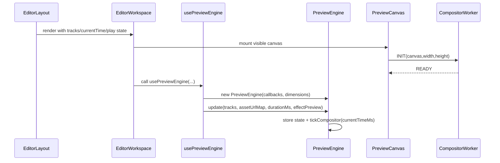

**Step-by-step walkthrough:**

1. **User action** — User opens or remains on the editor page; React mounts `EditorLayout`.
2. **Frontend handling** — `EditorLayout` creates `EditorWorkspace` and passes timeline state plus `runtime.playheadMs`.
3. **Canvas bootstrap** — `PreviewCanvas` mounts, creates `CompositorWorker`, and transfers the visible canvas via `transferControlToOffscreen()`. This transfer happens exactly once for that DOM node.
4. **Engine bootstrap** — `usePreviewEngine` constructs a single `PreviewEngine` and stores it in a ref.
5. **Initial sync** — `engine.update(...)` copies tracks, asset URLs, dimensions, and duration into the engine, muting tracks as needed and warming decode workers near the current playhead.
6. **First frame path** — `PreviewEngine.tickCompositor(currentTimeMs)` derives clip descriptors immediately so the paused frame can be drawn before playback begins.

**Error scenarios:**

- If the compositor worker fails to initialize, `PreviewCanvas` has no fallback path today; preview simply does not become ready.
- If dimensions change, the canvas is not retransferred; instead a `RESIZE` message is sent to the compositor worker.

### 6.2 Play / Continuous Playback

**Trigger:** User presses play or keyboard transport toggles `isPlaying` to `true`.
**Outcome:** Audio starts, active decode workers seek to the current source times, the compositor ticks every animation frame, and React receives low-frequency playhead updates.

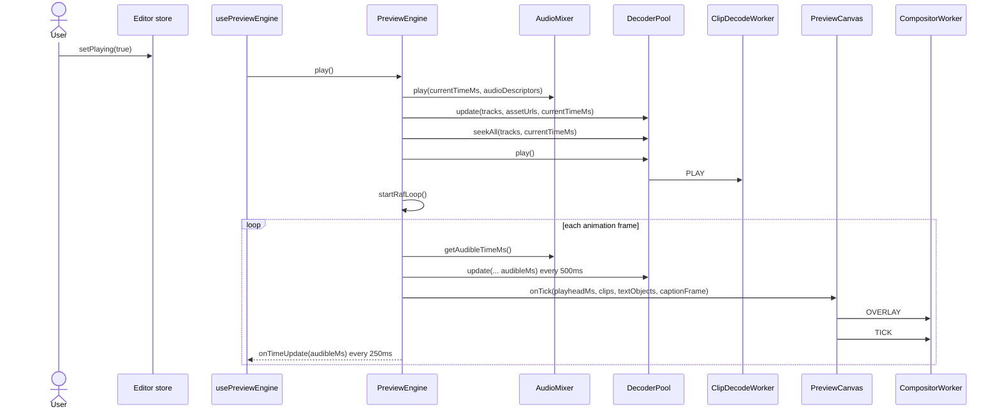

**Step-by-step walkthrough:**

1. **User action** — User presses play.
2. **Frontend handling** — Editor store flips `isPlaying`; `usePreviewEngine` observes the change and calls `engine.play()`.
3. **Audio scheduling** — `AudioMixer.play()` resumes the audio context if necessary, stops old sources, records the start context time, and schedules audio-producing clips.
4. **Video realignment** — `PreviewEngine` tells `DecoderPool` to ensure active clip workers exist, then seeks all of them to the source times corresponding to the current timeline time.
5. **Worker playback** — Each ready `ClipDecodeWorker` receives `PLAY`, which starts its decode pump.
6. **Clock loop** — `PreviewEngine.startRafLoop()` becomes the orchestration loop. Importantly, rAF is only the polling cadence; the reported playhead comes from `AudioMixer.getAudibleTimeMs()`, not from `performance.now()` directly.
7. **Compositor tick** — On each tick the engine computes video descriptors, serializes active text clips, consumes the current pending caption bitmap if one exists, and tells `PreviewCanvas` to send `OVERLAY` then `TICK` to the compositor worker.
8. **React publish** — Only every `250ms` does `PreviewEngine` call `onTimeUpdate`, which updates editor store/UI state such as toolbar timecode and timeline playhead mirror.

**Error scenarios:**

- If `AudioMixer` cannot decode one audio asset, it logs a warning and skips that clip; playback continues.
- If a worker is still seeking or not ready, `DecoderPool` delays `PLAY` until seek completion so old frames do not leak into steady-state playback.

### 6.3 GOP-Aware Seek / Scrub

**Trigger:** User drags the playhead or some editor action changes `currentTimeMs` while paused or playing.
**Outcome:** Audio stops or relocates, video frame queues are cleared, decode workers seek from a preceding keyframe, and the compositor redraws the target frame.

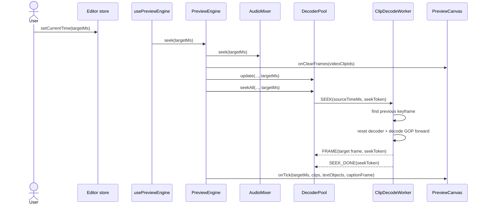

**Step-by-step walkthrough:**

1. **User action** — User scrubs timeline or another control sets a new current time.
2. **React handling** — `usePreviewEngine` compares the external `currentTimeMs` against the last engine-published one. If the change did not originate from the engine, it calls `engine.seek(...)`.
3. **Audio stop/reposition** — `AudioMixer.seek()` pauses active playback and records the new starting timeline time.
4. **Frame invalidation** — `PreviewEngine` clears all compositor frame queues via `onClearFrames(videoClipIds)`. This prevents stale pre-seek frames from being drawn.
5. **Source-time conversion** — `DecoderPool.seekAll()` uses `getClipSourceTimeSecondsAtTimelineTime()` for each active video clip. This is the key translation from timeline time to source media time.
6. **Worker seek** — Inside `ClipDecodeWorker.seekTo()`, the worker looks up the last keyframe with DTS less than or equal to the target, resets the decoder, and feeds samples from that GOP forward until it crosses the requested presentation timestamp.
7. **Target frame rule** — During seek the worker suppresses frames before the target. The first frame at or beyond the target is emitted with the active `seekToken`, and extra decoded frames are temporarily buffered so playback can resume smoothly.
8. **Redraw** — The engine immediately issues a compositor tick for the target time. If playback was active before the seek, audio and worker playback resume after the seek completes.

**Error scenarios:**

- If no keyframes exist, seek fails and the pool destroys the worker.
- If seek exceeds `MAX_SEEK_DECODE_SAMPLES`, the worker throws to avoid pathological decode storms.
- If stale seek results arrive after a newer seek, `DecoderPool` drops them using seek tokens.

### 6.4 Video Decode and Frame Delivery

**Trigger:** A clip is near the playhead or playback pump needs more frames.
**Outcome:** Decoded `VideoFrame`s travel from a clip worker to the compositor worker with minimal main-thread work.

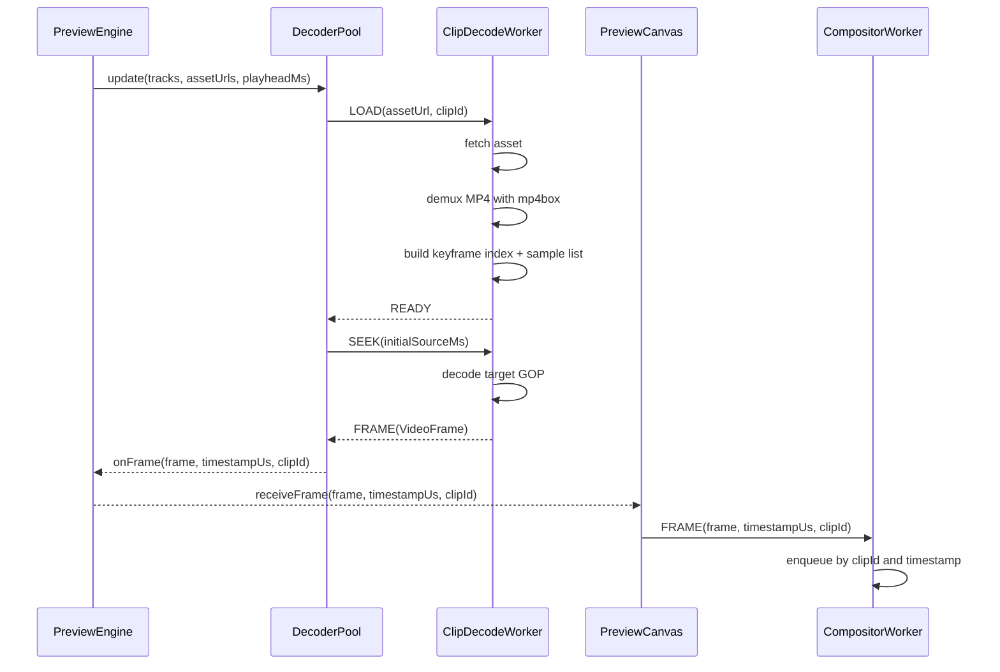

**Step-by-step walkthrough:**

1. **Pool admission** — `DecoderPool.update()` walks all video clips and chooses candidates inside a `5s` decode window around the playhead.
2. **Budget enforcement** — Candidates are sorted by distance from the playhead. The pool enforces `MAX_ACTIVE_VIDEO_WORKERS = 4` and `MAX_WORKERS_PER_ASSET_URL = 1`.
3. **Asset load** — For each admitted clip, `createWorker()` spawns a module worker and sends `LOAD(assetUrl, clipId)`.
4. **Demux** — `ClipDecodeWorker` fetches the full MP4, feeds it into `mp4box`, extracts video samples, and records every sync sample in `keyframeIndex`.
5. **Decode** — When the worker is ready it begins servicing seeks and, later, continuous playback. Output frames are posted as transferable `VideoFrame`s.
6. **Relay step** — The main thread does not inspect pixel content. `PreviewEngine` receives the frame callback and immediately relays it through `PreviewCanvas.receiveFrame(...)` to the compositor worker.
7. **Compositor buffering** — `CompositorWorker` keeps a short sorted queue per clip and prunes older frames to cap memory use.

**Error scenarios:**

- On worker error, `DecoderPool` logs, destroys the worker, and sets a `DECODE_FAILURE_COOLDOWN_MS` block for that asset URL.
- Oversized assets, too many samples, or invalid dimensions are rejected early by `decode-guard.ts`.

### 6.5 Compositor Tick and Final Draw

**Trigger:** `PreviewEngine` decides to render one visual frame.
**Outcome:** The compositor worker selects the best decoded frame for each active clip, applies transforms/effects, draws text and captions, and updates the visible preview canvas.

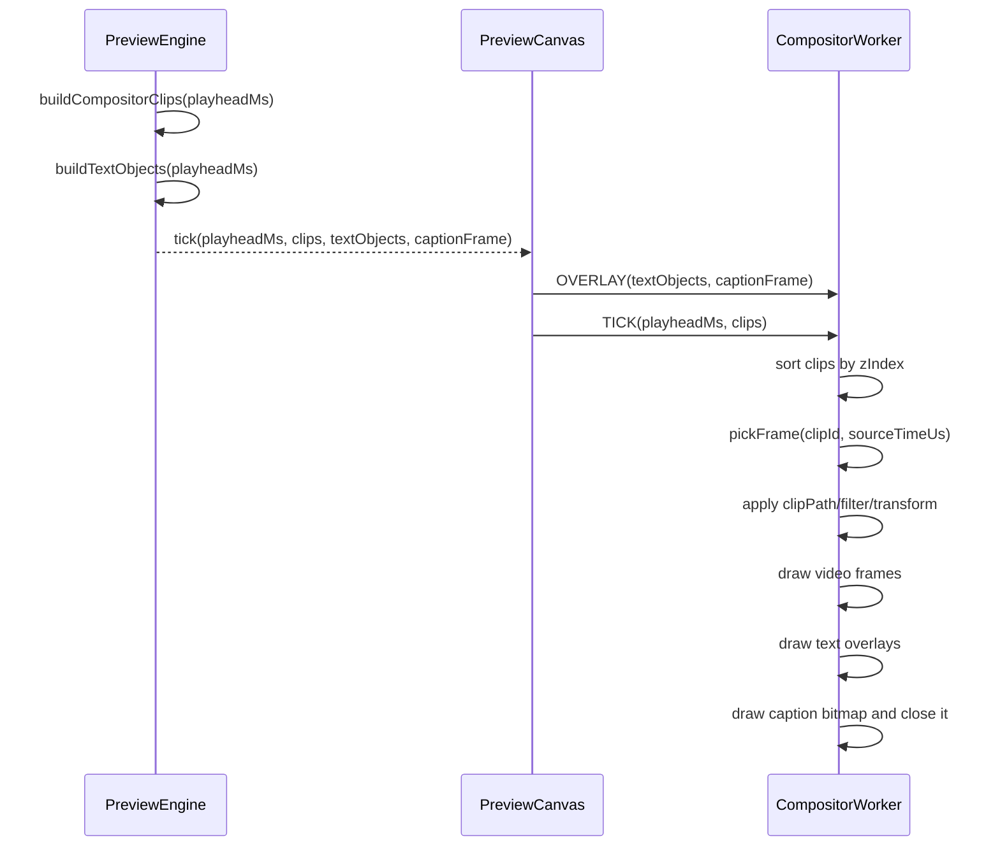

**Step-by-step walkthrough:**

1. **Descriptor generation** — `buildCompositorClips()` walks only video tracks. For each clip it computes source time, z-order, opacity, filter string, clip path, and transform string.
2. **Source-time correctness** — `sourceTimeUs` is computed by `getClipSourceTimeSecondsAtTimelineTime()`, which applies clip trim and speed before converting to microseconds.
3. **Overlay generation** — Text clips are serialized directly by the engine. Caption overlays arrive separately as a pre-rendered bitmap.
4. **Worker selection** — `CompositorWorker.pickFrame()` chooses the frame with largest timestamp less than or equal to `sourceTimeUs`, or the earliest frame if everything is ahead.
5. **Canvas transforms** — The compositor applies clip transforms, optional clip paths, and filter strings before drawing each frame.
6. **Overlay pass** — Text overlays are drawn after video. Caption bitmap is drawn last and closed immediately after use.
7. **Persistent output** — Because the worker owns the transferred visible canvas, there is no extra bitmap round-trip to the main thread.

**Error scenarios:**

- If a clip has no suitable frame in queue, that layer is skipped for that tick.
- If a stale caption bitmap is superseded before draw, the previous bitmap is closed before replacement.

### 6.6 Caption Update Path

**Trigger:** Playhead moves, caption clip changes, caption doc/preset loads, or the user scrubs while paused.
**Outcome:** A new caption bitmap is rendered on a hidden canvas and injected into the next compositor tick.

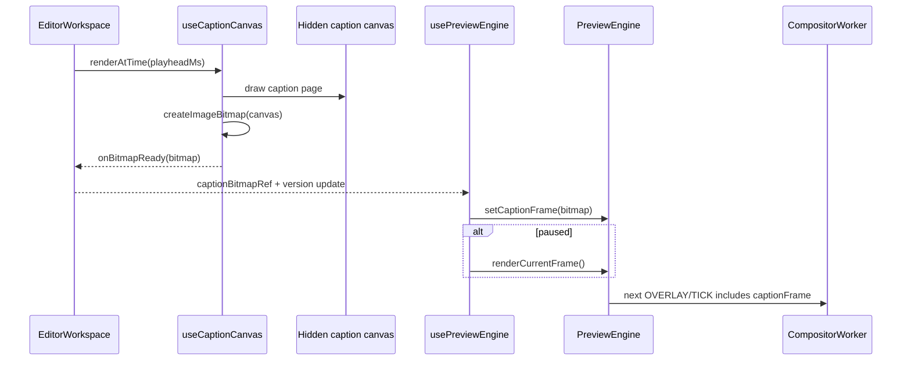

**Step-by-step walkthrough:**

1. **Clip selection** — `EditorWorkspace` determines which caption clip is active at the current playhead.
2. **Imperative render** — `useCaptionCanvas.renderAtTime(ms)` renders without using React state as a frame clock.
3. **Page selection** — The hook slices transcript tokens to the clip source range, builds pages, finds the active page for the requested relative time, computes layout, and renders onto the hidden canvas.
4. **Bitmap creation** — The hidden canvas is converted into `ImageBitmap`.
5. **Stale work cancellation** — A render token stored in `renderTokenRef` invalidates asynchronous font loading or bitmap creation that completes after a newer render request.
6. **Engine handoff** — `usePreviewEngine` injects the bitmap into `PreviewEngine.setCaptionFrame(...)`.
7. **Paused correctness** — If playback is paused, `usePreviewEngine` calls `engine.renderCurrentFrame()` immediately so caption changes appear without waiting for the next seek or play.

**Error scenarios:**

- If no caption clip or page is active, the hook publishes `null`, clearing caption overlay.
- If async font loading finishes after a newer request, the created bitmap is closed and ignored.

### 6.7 Failure Isolation and Recovery

**Trigger:** Worker crash, fetch failure, decode failure, or oversized asset.
**Outcome:** The failing decode path is destroyed and temporarily cooled down without crashing the entire preview engine.

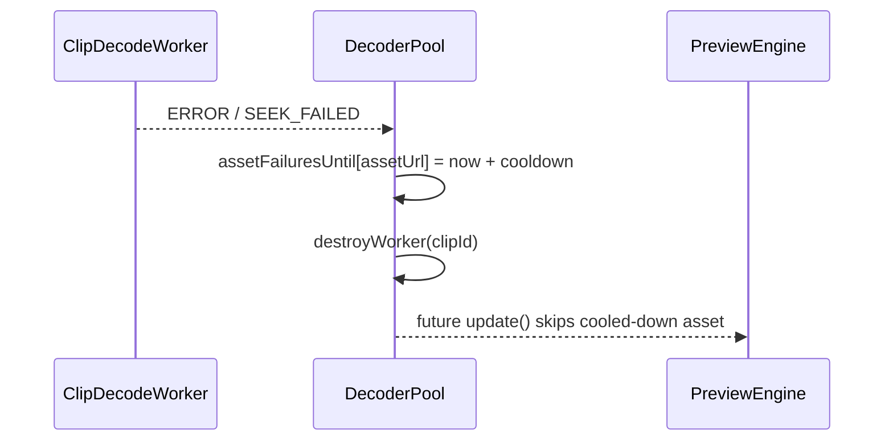

**Step-by-step walkthrough:**

1. Worker surfaces `ERROR` or `SEEK_FAILED`.
2. `DecoderPool.handleWorkerFailure()` records a cooldown keyed by asset URL.
3. The failing worker is destroyed immediately.
4. Later `update()` calls skip that asset until the cooldown expires.

**Error scenarios:**

- This isolates failures to specific assets but does not yet expose user-facing diagnostics inside the editor UI.

## 7. API Surface

This subsystem has no standalone HTTP API. Its real contract is the internal runtime surface between React, the engine, and workers.

### React-to-Engine Surface

| Method | Owner | Description |
|--------|------|-------------|
| `update(tracks, assetUrlMap, durationMs, effectPreview, dimensions)` | `PreviewEngine` | Replace engine inputs after timeline edits or dimension changes. |
| `play()` | `PreviewEngine` | Start playback session from current engine time. |
| `pause()` | `PreviewEngine` | Stop playback and publish final playhead. |
| `seek(ms)` | `PreviewEngine` | Realign audio and video to a new timeline time. |
| `setCurrentTime(ms)` | `PreviewEngine` | Update paused engine time without invoking a full seek. |
| `setCaptionFrame(frame|null)` | `PreviewEngine` | Supply the next caption bitmap to be consumed on a compositor tick. |
| `renderCurrentFrame()` | `PreviewEngine` | Force an immediate paused redraw. |
| `primeAudioContext()` | `PreviewEngine` | Resume audio context opportunistically on user gesture. |

### `PreviewCanvasHandle`

| Method | Description |
|--------|-------------|
| `tick(playheadMs, clips, textObjects, captionFrame)` | Sends one compositor update. |
| `receiveFrame(frame, timestampUs, clipId)` | Relays a decoded frame to the compositor worker. |
| `clearFrames(clipIds)` | Clears compositor frame queues for named clips. |

### Worker Message Protocols

#### `ClipDecodeWorker`

| Direction | Message | Purpose |
|--------|------|-------------|
| Main → worker | `LOAD(assetUrl, clipId)` | Fetch and demux asset, initialize decoder state. |
| Main → worker | `SEEK(targetMs, seekToken)` | Perform GOP-aware seek in source time. |
| Main → worker | `PLAY` | Start feeding encoded chunks. |
| Main → worker | `PAUSE` | Stop feed loop. |
| Main → worker | `DESTROY` | Tear down decoder and worker state. |
| Worker → main | `READY` | Asset load and demux complete. |
| Worker → main | `FRAME(frame, timestampUs, clipId, seekToken?)` | Emit decoded frame. |
| Worker → main | `SEEK_DONE(seekToken)` | Mark seek completion. |
| Worker → main | `SEEK_FAILED(message, clipId, seekToken)` | Report seek failure. |
| Worker → main | `ERROR(message, clipId)` | Report general worker failure. |

#### `CompositorWorker`

| Direction | Message | Purpose |
|--------|------|-------------|
| Main → worker | `INIT(canvas, width, height)` | Transfer the visible canvas and initialize the drawing context. |
| Main → worker | `RESIZE(width, height)` | Resize the offscreen canvas after resolution changes. |
| Main → worker | `FRAME(frame, timestampUs, clipId)` | Enqueue a decoded frame by clip. |
| Main → worker | `OVERLAY(textObjects, captionFrame)` | Replace current overlay payload. |
| Main → worker | `TICK(playheadMs, clips)` | Draw one frame. |
| Main → worker | `CLEAR_CLIP(clipId)` | Drop queued frames for one clip. |
| Main → worker | `DESTROY` | Close the worker. |
| Worker → main | `READY` | Drawing context ready. |

## 8. State Management

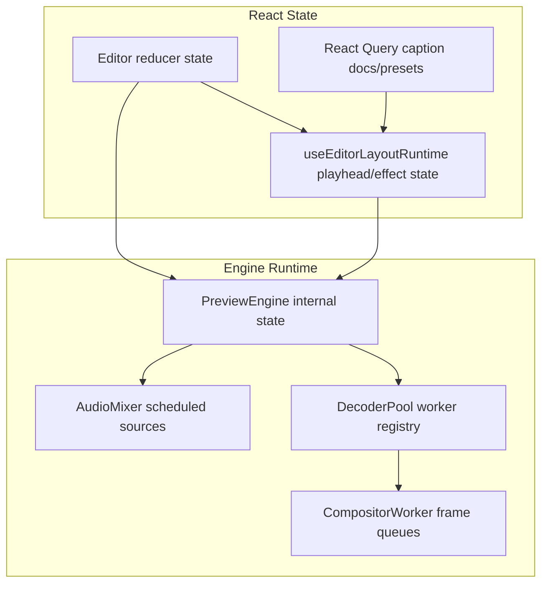

### What state lives where and why

- **Editor reducer state** holds authoritative timeline data because the editor must support undo/redo, autosave, and user edits.
- **`runtime.playheadMs`** is a UI-facing mirror of engine time for the timeline and preview labels. It intentionally updates more often than some UI state but less often than per-frame React rendering of the old system.
- **`PreviewEngine.currentTimeMs`** is the authoritative preview playhead inside the runtime.
- **`AudioMixer` state** holds scheduled sources and start times because only audio can tell the engine what “currently audible” means during playback.
- **Worker state** holds decode-specific and draw-specific data because those resources are large and should not be stored in React.

### Cache invalidation strategy

- Audio buffers are cached by `assetUrl` in `decodedBufferCache`.
- Failed audio buffer fetch/decode promises are removed from the cache on rejection so later attempts can retry.
- Decode workers are destroyed when clips leave the decode window or exceed worker budgets.
- Compositor frame queues are explicitly cleared on seek.

### Cross-session/tab consistency

This subsystem has no direct cross-tab synchronization. It consumes current editor reducer state in the active tab only. Consistency with server state is the responsibility of autosave/conflict logic outside the preview subsystem.

### Optimistic update patterns

- Timeline edits are already local-first in the editor reducer.
- `PreviewEngine.update()` immediately reflects those local edits in preview descriptors and track mute state without waiting for persistence.
- Inspector effect preview uses temporary overrides (`effectPreview`) so the compositor can show hover-preview changes without mutating the stored clip.

## 9. Authentication & Security Model

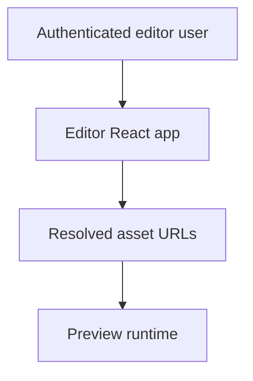

This subsystem does not establish identity itself. It trusts already-authenticated editor state and resolved asset URLs produced elsewhere in the application. There is no preview-specific auth middleware or token verification path in this runtime.

Security-relevant constraints that do exist:

- Asset fetches are limited by `MAX_DECODE_FETCH_BYTES`.
- Decode workers reject oversized sample counts and invalid video dimensions.
- Safari audio fallback uses `crossOrigin = "anonymous"` on `HTMLAudioElement`.
- The preview runtime does not execute arbitrary user code; it only interprets timeline data and media files through browser media APIs.

## 10. Timing Model

The timing model is the most important concept in this architecture.

### 10.1 Three clocks exist

1. **Timeline clock** — abstract composition time in milliseconds.
2. **Audio hardware clock** — `AudioContext.currentTime`, corrected by `baseLatency`.
3. **Display polling clock** — `requestAnimationFrame`.

### 10.2 Which clock wins

During playback, the audio clock wins. The engine reads it every rAF tick and uses that value as the authoritative `currentTimeMs`.

### 10.3 Why rAF still exists

rAF is still needed as a scheduling loop so the browser knows when to ask for another frame. But it is no longer the source of truth for playhead position. It is just the cadence at which the engine samples the audio clock and asks the compositor to draw.

### 10.4 Source-time conversion

For each media clip:

```text
sourceTimeSeconds =
  ((timelineTimeMs - clip.startMs) / 1000) * speed
  + trimStartMs / 1000
```

This conversion is performed centrally in `getClipSourceTimeSecondsAtTimelineTime()`. The same conceptual mapping is used by both audio scheduling and video frame selection.

### 10.5 Publish throttling

React receives playhead updates only every `250ms`. That means playback correctness is decoupled from React commit rate.

## 11. Memory Ownership and Resource Lifetime

### `VideoFrame`

- Produced in `ClipDecodeWorker`.
- Transferred to main thread, then immediately relayed to `CompositorWorker`.
- Stored briefly in `CompositorWorker.frameQueues`.
- Closed when pruned or when the queue is cleared.

### `ImageBitmap` for captions

- Produced by `useCaptionCanvas`.
- Stored temporarily in `captionBitmapRef` and then inside `PreviewEngine.captionFrame`.
- Transferred to `CompositorWorker` on next tick.
- Closed immediately after drawing, or earlier if superseded/cancelled.

### Audio resources

- `AudioBuffer`s are cached by URL.
- `AudioBufferSourceNode`s are one-shot and are recreated on every play/seek.
- Safari fallback `HTMLAudioElement`s are created per scheduled clip and paused/disconnected on teardown.

### Worker lifetime

- `CompositorWorker` lives for the lifetime of the preview canvas DOM node.
- `ClipDecodeWorker`s are ephemeral and tied to clip locality around the playhead.

## 12. Browser API Inventory

| API | Used for | Where |
|------|---------|------|
| `AudioContext` | Master playback clock and audio scheduling | `AudioMixer` |
| `GainNode` | Master and per-track volume control | `AudioMixer` |
| `AudioBufferSourceNode` | Scheduled audio playback on non-Safari browsers | `AudioMixer` |
| `HTMLAudioElement` + `createMediaElementSource()` | Safari fallback audio path | `AudioMixer` |
| `VideoDecoder` | Hardware-accelerated video decode | `ClipDecodeWorker` |
| `EncodedVideoChunk` | Feed compressed samples into decoder | `ClipDecodeWorker` |
| `VideoFrame` | Decoded frame transport and draw source | decode worker + compositor worker |
| `OffscreenCanvas` | Worker-owned preview drawing surface | `PreviewCanvas` + `CompositorWorker` |
| `ImageBitmap` | Caption overlay transport | `useCaptionCanvas` |
| `requestAnimationFrame` | Polling cadence for compositor ticks | `PreviewEngine` |
| `Worker` | Isolation for decode and compositing | `DecoderPool`, `PreviewCanvas` |

## 13. Current Limitations and Non-Goals

These are properties of the current implementation, not the original rewrite plan in the abstract.

- Audio decode is not in clip workers. It is handled on the main thread through `AudioContext.decodeAudioData()` or Safari `HTMLAudioElement` fallback.
- `ClipDecodeWorker` currently assumes MP4 input via `mp4box`.
- The worker currently fetches the full asset, not byte ranges.
- The compositor’s transform parser supports only the transform forms emitted by current preview code (`scale`, `translate`, `rotate`).
- Metrics such as `droppedFrameCount` are heuristic and based on audio-clock deltas, not compositor miss accounting.
- There is no preview-specific user-facing error UI yet.

## 14. Mental Model for Maintainers

The shortest correct mental model is:

1. React owns editor state and user intent.
2. `PreviewEngine` owns preview orchestration.
3. `AudioMixer` owns time during playback.
4. `DecoderPool` decides which clips are worth decoding.
5. Each `ClipDecodeWorker` turns one asset into `VideoFrame`s.
6. `CompositorWorker` turns descriptors plus frames plus overlays into pixels.
7. React is informed of time; React does not paint frames.

If you preserve those boundaries, the system stays understandable. If you let React become the frame scheduler again, or let video elements become the clock again, the architecture collapses back toward the old model this rewrite was explicitly designed to remove.
