# Editor Preview Rendering Flow — Architecture Design Document

> **Last updated:** 2026-04-23  
> **Scope:** How the editor preview renders video, text, and captions from timeline state through decode workers, compositor workers, renderer implementations, and the visible preview canvas. This does not cover server-side export rendering except where shared descriptor logic is relevant.  
> **Audience:** Engineers debugging preview playback, onboarding to the editor runtime, or reviewing compositor/decoder changes.

## 1. Executive Summary

The editor preview is a compositor-owned canvas pipeline. React owns timeline state and UI state, but video pixels are decoded in worker threads using WebCodecs and rendered in a separate compositor worker using either WebGL2 or Canvas2D. The main thread acts mostly as a bridge: it creates the preview engine, transfers `VideoFrame`s and `ImageBitmap`s between workers, and forwards compositor ticks to the worker that owns the visible `OffscreenCanvas`. Captions are not decoded from video; they are rendered into a hidden React-side canvas, converted to an `ImageBitmap`, and sent to the compositor as an overlay. The key invariant is that `clipId` and source-media time must match across decoder output, compositor descriptors, and compositor frame queues.

## 2. System Context Diagram

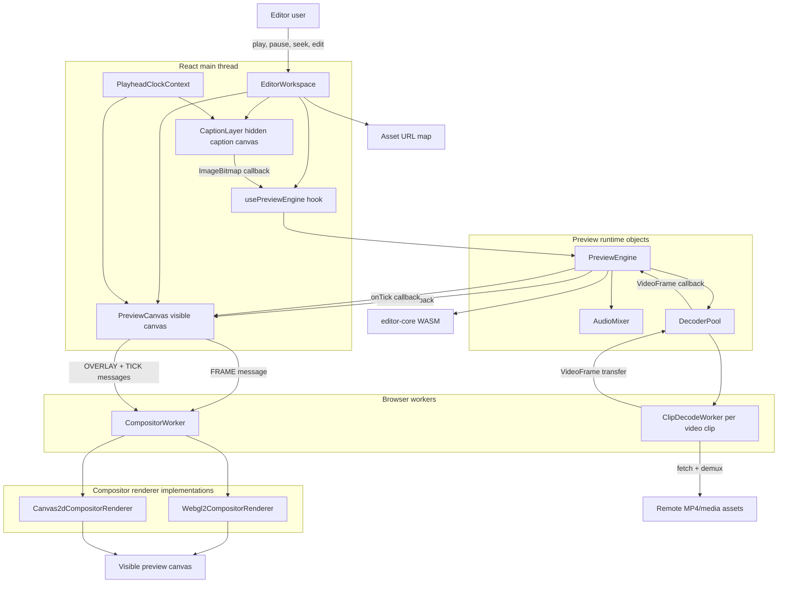


The preview runtime spans the main thread and two worker types. `ClipDecodeWorker` instances produce decoded `VideoFrame`s. `CompositorWorker` owns the visible `OffscreenCanvas` and keeps frame queues keyed by clip id. `PreviewEngine` coordinates timing, decoder warmup, audio-clock playback, descriptor generation, and the handoff into the preview canvas bridge.

## 3. Core Concepts & Glossary


| Term                       | Definition                                                                                                                                                                    |
| -------------------------- | ----------------------------------------------------------------------------------------------------------------------------------------------------------------------------- |
| Timeline time              | The editor playhead position in milliseconds. This is where the user is in the edited composition.                                                                            |
| Source time                | The timestamp inside the source media asset for a clip. It accounts for clip start, trim, speed, and source max duration.                                                     |
| `VideoFrame`               | WebCodecs decoded video frame object. Transferred between workers/main thread and eventually drawn by WebGL2 or Canvas2D.                                                     |
| `EncodedVideoChunk`        | WebCodecs encoded video packet created from mp4box samples and fed into `VideoDecoder`.                                                                                       |
| `ClipDecodeWorker`         | Worker module that fetches one media asset, demuxes MP4 samples, configures `VideoDecoder`, seeks, plays, and posts decoded frames.                                           |
| `DecoderPool`              | Main-thread manager for clip decode workers. It decides which clips need workers, tracks seek freshness, accepts or drops frames, and caches demux metadata.                  |
| `PreviewEngine`            | Main coordinator for preview playback. It owns decoder pool, audio mixer, quality state, compositor ticks, text serialization, and caption bitmap handoff.                    |
| `PreviewCanvas`            | React component with the visible `<canvas>`. It transfers that canvas to `CompositorWorker` and exposes imperative `tick`, `receiveFrame`, and `clearFrames` methods.         |
| `CompositorWorker`         | Worker that owns the visible `OffscreenCanvas`, stores `VideoFrame` queues, receives overlay updates, and calls the active renderer.                                          |
| `CompositorClipDescriptor` | Render instruction for a video clip at one timeline tick: clip id, z-index, source time, opacity, clip path, effects, transform, enabled.                                     |
| `editor-core WASM`         | Rust/WASM module that builds compositor descriptors from editor tracks and playhead time.                                                                                     |
| `rendererPreference`       | User/config preference: `auto`, `webgl2`, or `canvas2d`. `auto` tries WebGL2 first.                                                                                           |
| Overlay                    | Text objects and caption bitmap drawn above video frames. In WebGL2, overlays are first drawn into an offscreen overlay canvas, uploaded as a texture, then drawn fullscreen. |
| Caption bitmap             | `ImageBitmap` generated from a hidden caption canvas and transferred to the compositor worker.                                                                                |
| Frame queue                | Per-clip ordered list of `VideoFrame`s held by `CompositorWorker`, keyed by `clipId`.                                                                                         |
| Seek token                 | Monotonic token used by `DecoderPool` and `ClipDecodeWorker` to reject stale frames from older seeks.                                                                         |
| Decode window              | Time range around playhead in which video clips are eligible to have active decoders. Default is 5 seconds in steady state.                                                   |


## 4. High-Level Architecture

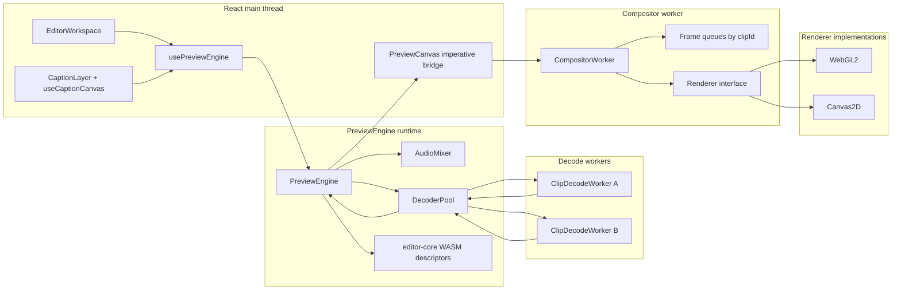


`**EditorWorkspace**`  
Owns the preview component tree. It reads editor document state, playback state, UI state, and asset URLs, then wires `usePreviewEngine`, `PreviewArea`, `PreviewCanvas`, and `CaptionLayer` together.

`**usePreviewEngine**`  
Creates and owns a `PreviewEngine` instance for the React component lifetime. It adapts engine callbacks to React refs: decoded frames go to `PreviewCanvas.receiveFrame`, compositor ticks go to `PreviewCanvas.tick`, and frame-clears go to `PreviewCanvas.clearFrames`.

`**PreviewEngine**`  
Owns timing and orchestration. It updates decoder workers, computes compositor descriptors, serializes text overlays, accepts caption bitmaps, drives audio-clock playback, and publishes metrics.

`**DecoderPool**`  
Owns active decode workers and their lifecycle. It warms clips inside the decode window, shares demux metadata by asset URL, enforces worker budgets, sends seek/play/pause messages, and forwards accepted frames to `PreviewEngine`.

`**ClipDecodeWorker**`  
Owns one `VideoDecoder` for one clip instance. It fetches the MP4, demuxes samples with mp4box, extracts decoder config, handles seek/play decode loops, and transfers `VideoFrame`s back to `DecoderPool`.

`**PreviewCanvas**`  
Owns the visible `<canvas>` element until mount, then transfers it to `CompositorWorker` as an `OffscreenCanvas`. After transfer, React does not draw into that canvas; it only posts messages to the worker.

`**CompositorWorker**`  
Owns the visible canvas after transfer. It stores decoded frame queues, tracks the latest caption bitmap and text overlay state, picks frames for each descriptor, and calls the selected renderer.

**Renderer implementations**  
`Webgl2CompositorRenderer` uploads/draws video frames and overlays as textures. `Canvas2dCompositorRenderer` uses `drawImage` and canvas 2D APIs directly. `createCompositorRenderer` picks WebGL2 unless `canvas2d` is requested or WebGL2 cannot initialize.

## 5. Data Model For Rendering

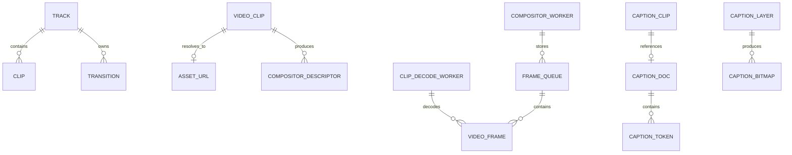


| Entity                               | Purpose                                                                                                        | Key Fields                                                                                                                 |
| ------------------------------------ | -------------------------------------------------------------------------------------------------------------- | -------------------------------------------------------------------------------------------------------------------------- |
| `Track`                              | Timeline lane. Only video tracks produce compositor video descriptors; text track contains text/caption clips. | `type`, `clips`, `transitions`, `muted`                                                                                    |
| `VideoClip`                          | Timeline segment referencing source media.                                                                     | `id`, `assetId`, `startMs`, `durationMs`, `trimStartMs`, `speed`, `opacity`, `positionX/Y`, `scale`, `rotation`, `enabled` |
| `assetUrlMap`                        | Main-thread `Map<assetId, resolved URL>` produced by `useEditorAssetMap`.                                      | `assetId -> mediaUrl/audioUrl/r2Url`                                                                                       |
| `CompositorClipDescriptor`           | Per-tick render instruction for one video clip.                                                                | `clipId`, `sourceTimeUs`, `zIndex`, `opacity`, `clipPath`, `effects`, `transform`, `enabled`                               |
| `CachedDemuxMetadata`                | Reusable demux result shared by workers using same asset URL.                                                  | `videoTrack`, `keyframeIndex`, `videoSamples`, `decoderDescription`                                                        |
| `VideoFrame`                         | Decoded pixel frame.                                                                                           | `timestamp`, `displayWidth`, `displayHeight`; ownership is transferred and must be closed                                  |
| `SerializedTextObject`               | Text overlay command generated inside `PreviewEngine`.                                                         | `text`, `x`, `y`, `fontSize`, `color`, `opacity`, `maxWidth`                                                               |
| `SerializedCaptionFrame`             | Caption bitmap transfer payload.                                                                               | `bitmap: ImageBitmap`                                                                                                      |
| `CompositorWorkerPerformanceMetrics` | Debug snapshot posted by compositor worker when debug is enabled.                                              | renderer, clip count, frame queue sizes, closed frames, canvas size                                                        |


Important ownership rule: `VideoFrame`s and caption `ImageBitmap`s are transfer-like resources. The component or worker that receives one becomes responsible for either transferring it onward or closing it.

## 6. End-To-End Flow Overview

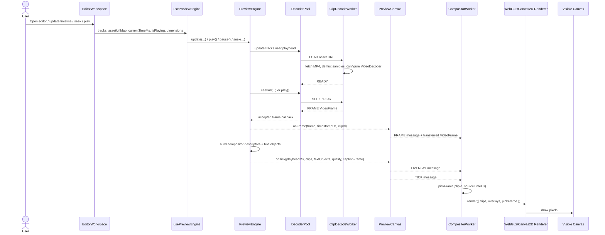


The preview is intentionally asynchronous. Decoding and ticking are decoupled: frames may arrive before or after a compositor tick, and ticks may happen when the queue is empty. The compositor therefore stores per-clip frame queues and picks the best available frame for each descriptor.

## 7. Initialization Flow

### Trigger

`EditorWorkspace` mounts.

### Outcome

A `PreviewEngine` is created, editor-core WASM is loaded, `CompositorWorker` owns the visible canvas, and decoder workers start warming eligible clips.

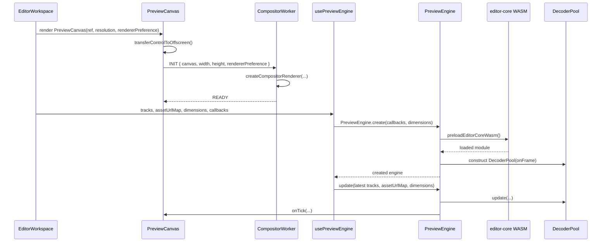


Step by step:

1. `EditorWorkspace` reads `tracks`, `resolution`, `durationMs`, `fps`, `currentTimeMs`, `isPlaying`, `effectPreview`, and `assetUrlMap`.
2. `PreviewCanvas` creates a worker from `CompositorWorker.ts`.
3. `PreviewCanvas` calls `canvas.transferControlToOffscreen()` and posts `INIT`.
4. `CompositorWorker.init()` stores dimensions and debug mode, then calls `createCompositorRenderer`.
5. `createCompositorRenderer` tries WebGL2 unless preference is `canvas2d`; otherwise it constructs `Canvas2dCompositorRenderer`.
6. `PreviewEngine.create()` preloads the Rust/WASM editor core module before constructing `PreviewEngine`.
7. `usePreviewEngine` immediately calls `engine.update(...)` with latest state after creation.

## 8. Decoder Worker Warmup Flow

### Trigger

`PreviewEngine.update(...)` or playback reconcile calls `DecoderPool.update(...)`.

### Outcome

The pool creates decode workers for video clips inside the decode window, or destroys workers outside the active/permitted set.

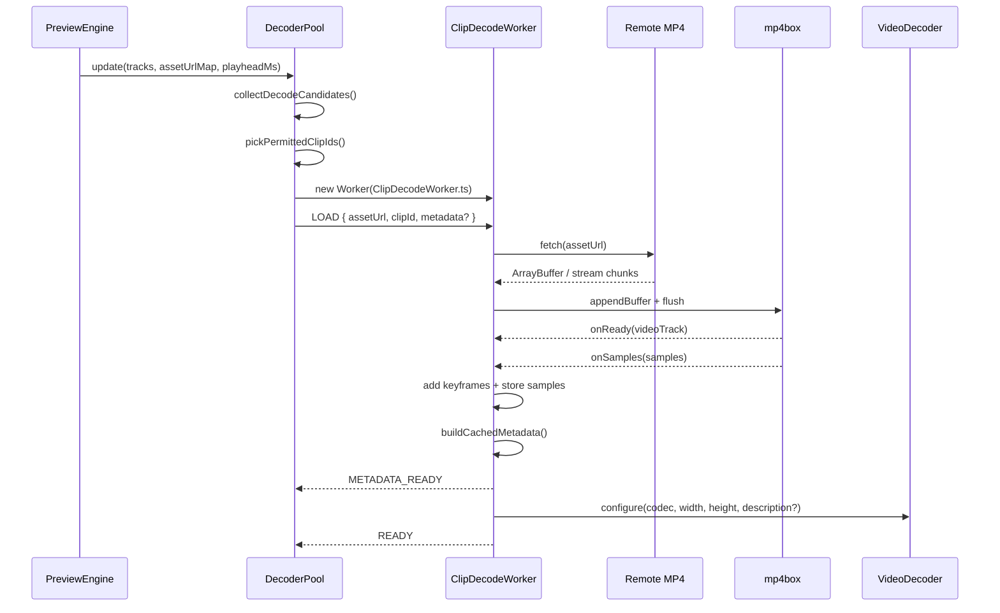


Detailed behavior:

1. `DecoderPool.collectDecodeCandidates()` iterates video clips.
2. A clip is a candidate if its range intersects the current decode window.
3. The pool resolves `clip.assetId` through `assetUrlMap`.
4. Assets in cooldown from previous decode/load failure are skipped.
5. Candidates are sorted by `getClipDecodePriority`.
6. `pickPermittedClipIds()` enforces:
  - `maxActiveDecoderCount`
  - `MAX_WORKERS_PER_ASSET_URL`
7. Each permitted clip gets exactly one `ClipDecodeWorker` entry.
8. If demux metadata exists for the asset URL, the pool sends it in `LOAD`.
9. If another worker is already demuxing the same asset URL, this worker waits in `metadataWaiters`.
10. Otherwise the worker fetches the asset and demuxes with mp4box.
11. `ClipDecodeWorker` stores:
  - `videoTrackId`
    - `videoTimescale`
    - `videoSamples`
    - `keyframeIndex`
    - decoder config bytes for H.264/H.265 where available
12. The worker configures WebCodecs `VideoDecoder`.
13. The worker posts `READY`.

Important constraints from `decode-guard.ts`:


| Limit                        | Value      | Purpose                                               |
| ---------------------------- | ---------- | ----------------------------------------------------- |
| `MAX_ACTIVE_VIDEO_WORKERS`   | 4          | Caps parallel decoder count.                          |
| `MAX_WORKERS_PER_ASSET_URL`  | 1          | Avoids duplicating decode workers for same asset URL. |
| `MAX_DECODE_FETCH_BYTES`     | 80 MB      | Prevents huge preview fetches.                        |
| `MAX_VIDEO_SAMPLES`          | 12,000     | Prevents unbounded demux sample storage.              |
| `MAX_VIDEO_DIMENSION`        | 4096 px    | Rejects too-large decode tracks.                      |
| `MAX_SEEK_DECODE_SAMPLES`    | 240        | Caps seek decode work.                                |
| `DECODE_FAILURE_COOLDOWN_MS` | 10 seconds | Temporarily blocks repeatedly failing assets.         |


## 9. Seek Flow

### Trigger

The user scrubs or external playback state changes `currentTimeMs`.

### Outcome

Active decode workers reset to a source-media time, stale frames are cleared, and the compositor ticks at the seek target.

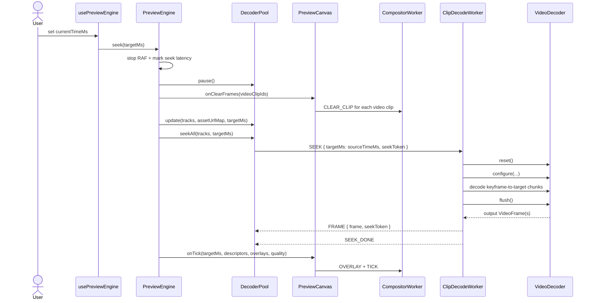


Step by step:

1. `PreviewEngine.seek(targetMs)` clamps target time.
2. It stops the RAF loop.
3. It pauses decoder workers and audio mixer.
4. It sets preview quality to `half` with reason `scrubbing`.
5. It clears all video clip frame queues through `onClearFrames(videoClipIds)`.
6. `PreviewCanvas.clearFrames` posts `CLEAR_CLIP` messages to `CompositorWorker`.
7. `DecoderPool.update` ensures workers exist around the target.
8. `DecoderPool.seekAll` computes source-media time for each active worker using `getClipSourceTimeSecondsAtTimelineTime`.
9. Each seek gets a fresh `seekToken`.
10. `ClipDecodeWorker.seekTo`:
  - finds nearest keyframe at or before target
    - clears buffered post-seek frames
    - resets and reconfigures `VideoDecoder`
    - decodes from GOP start until it crosses target
    - flushes decoder
    - posts the first output frame at or after target with the active seek token
11. `DecoderPool.shouldDropFrame` accepts only frames matching the latest token.
12. `PreviewEngine.tickCompositor(targetMs)` sends a render tick even if the decoded frame has not arrived yet.
13. If a decoded frame arrives later while paused, `PreviewEngine` sends it to the compositor and ticks again.

The last point matters: a paused seek can render black if the tick happens before frames exist. The current code mitigates that by repainting when an accepted frame arrives and playback is not running.

## 10. Playback Flow

### Trigger

The user presses play.

### Outcome

Audio starts, decoder workers seek/play, the RAF loop follows the audio clock, and each tick sends compositor descriptors to the worker.

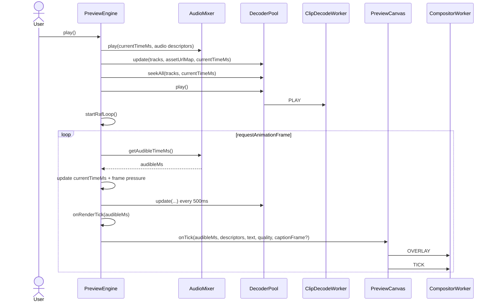


Key details:

1. `PreviewEngine.play()` resets session metrics and sets quality to `full`.
2. `AudioMixer.play()` schedules audio and establishes an audio-clock anchor.
3. After audio starts, the decoder pool is updated and all active workers seek to current source time.
4. `DecoderPool.play()` sends `PLAY` to ready workers or sets `playAfterSeek` if seek/loading is still in progress.
5. `ClipDecodeWorker.play()` starts a continuous decode loop.
6. `PreviewEngine.startRafLoop()` uses `AudioMixer.getAudibleTimeMs()` as the canonical playback clock, not raw `requestAnimationFrame` elapsed time.
7. Every RAF:
  - updates `currentTimeMs`
  - detects dropped-frame pressure from audio clock deltas
  - periodically reconciles decode workers
  - asks captions to render at the audio-clock time through `onRenderTick`
  - ticks the compositor
  - publishes React time updates only every 250ms, avoiding a React render every frame
8. At timeline end, it stops RAF, pauses decoders/audio, ticks final frame, publishes playback-end, logs metrics, and calls `onPlaybackEnd`.

## 11. Continuous Decode Loop Inside `ClipDecodeWorker`

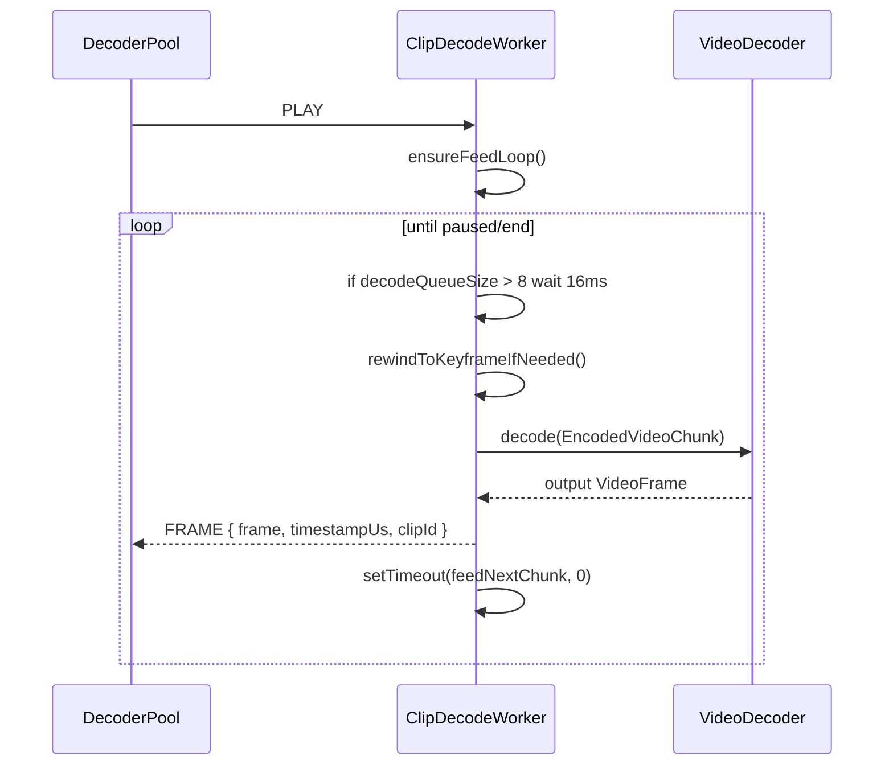


The feed loop is intentionally small and cooperative. It only feeds more encoded chunks when `decodeQueueSize` is not too high. If decoder reference state was reset or flushed, `decoderNeedsKeyFrame` causes playback to rewind to a GOP start before feeding delta frames, because delta frames require previous references.

Frame timestamps are converted from mp4box track ticks into microseconds:

```ts
Math.round((ticks * 1_000_000) / videoTimescale)
```

Those microsecond timestamps must match the `sourceTimeUs` values produced by the compositor descriptors.

## 12. Frame Transfer Flow

### Trigger

`VideoDecoder` outputs a decoded `VideoFrame`.

### Outcome

The frame is transferred to `CompositorWorker`, queued under `clipId`, and becomes eligible for the next render tick.

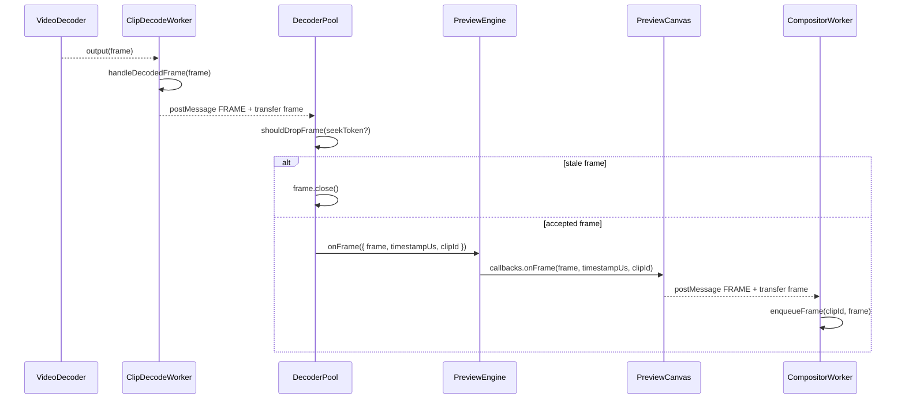


Important ownership details:

- `ClipDecodeWorker.postFrame` transfers the `VideoFrame` to the main thread.
- `DecoderPool` closes stale/destroyed frames instead of forwarding them.
- Accepted frames are transferred again from `PreviewCanvas` to `CompositorWorker`.
- `CompositorWorker.closeFrames` calls `renderer.releaseFrame(frame)` first, then `frame.close()`.
- WebGL2 caches textures in a `WeakMap<VideoFrame, TextureRecord>` and deletes those textures when frames are released.

## 13. Compositor Tick Flow

### Trigger

`PreviewEngine.tickCompositor(playheadMs)` runs on initial update, seek, pause, decoded-frame repaint while paused, quality restore, and every RAF during playback.

### Outcome

The compositor worker receives overlay state and render descriptors, picks queued frames, and draws the preview.

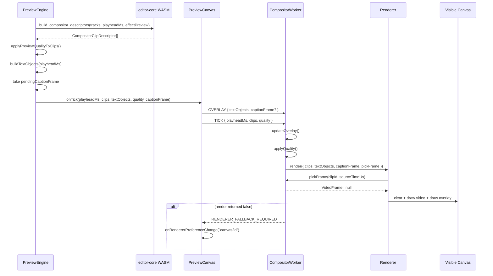


Detailed behavior:

1. `PreviewEngine.tickCompositor` starts a performance timer.
2. It calls `buildCompositorDescriptorsWithRust`.
3. It applies preview-quality changes. Low quality disables effects by replacing contrast/warmth with zero.
4. It serializes active plain text clips into `SerializedTextObject`s.
5. It consumes `pendingCaptionFrame`, setting it back to `undefined`.
6. `PreviewCanvas.tick` posts:
  - an `OVERLAY` message first
  - a `TICK` message second
7. `OVERLAY` with `captionFrame === undefined` means keep the current caption bitmap.
8. `OVERLAY` with `captionFrame === null` means clear caption bitmap.
9. `OVERLAY` with an `ImageBitmap` closes the previous caption bitmap and stores the new one.
10. `TICK` causes the worker to call `renderer.render`.
11. The renderer requests frames through the `pickFrame` callback, not by directly accessing queues.
12. Debug mode posts `PERFORMANCE` metrics back to `PreviewCanvas`.

## 14. Descriptor Generation In editor-core WASM

`PreviewEngine` does not hand raw editor clips to the compositor. It asks the Rust/WASM module for render descriptors:

```ts
buildCompositorDescriptorsWithRust(tracks, playheadMs, effectPreview)
```

The Rust core:

1. Filters tracks to `track_type == "video"`.
2. Filters clips to `clip_type == "video"`.
3. Applies an optional effect-preview patch for the currently previewed clip.
4. Computes outgoing transition data for clip A.
5. Computes incoming transition data for clip B for dissolve/wipe.
6. Computes whether the clip is active at `playheadMs`.
7. Chooses opacity:
  - `0` if disabled
  - outgoing transition opacity if present
  - incoming transition opacity if present
  - base opacity if active
  - `0` otherwise
8. Builds transform:
  - scale
  - translate X/Y
  - translate X/Y percent
  - rotation degrees
  - outgoing transition transform overlay
9. Computes `sourceTimeUs` by converting source time ms to microseconds.
10. Computes z-index as `video_tracks.len() - 1 - track_index`.

Descriptor shape:

```ts
interface CompositorClipDescriptor {
  clipId: string;
  zIndex: number;
  sourceTimeUs: number;
  opacity: number;
  clipPath: CompositorClipPath | null;
  effects: { contrast: number; warmth: number };
  transform: {
    scale: number;
    translateX: number;
    translateY: number;
    translateXPercent: number;
    translateYPercent: number;
    rotationDeg: number;
  };
  enabled: boolean;
}
```

The descriptor `clipId` must equal the `clipId` used by `DecoderPool`, `ClipDecodeWorker`, and `CompositorWorker.frameQueues`.

## 15. CompositorWorker Frame Queue Selection

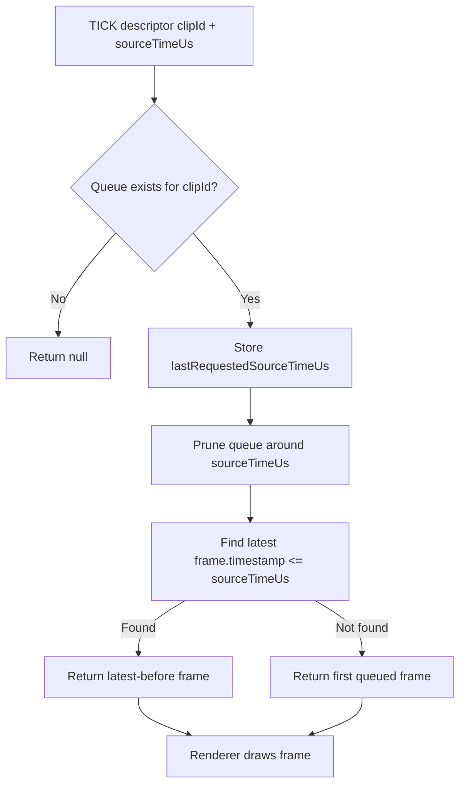


When a frame arrives:

1. `CompositorWorker.receiveFrame` calls `enqueueFrame(clipId, frame)`.
2. The queue is sorted by `frame.timestamp`.
3. If the clip has already been requested by a tick, the worker prunes the queue around the last requested source time.
4. If the queue grows past 16 before any tick has requested that clip, it evicts old frames.

When a tick requests a frame:

1. `pickFrame(clipId, sourceTimeUs)` looks up the queue.
2. It records `lastRequestedSourceTimeUs`.
3. It prunes the queue if it has more than 4 frames.
4. It returns the latest frame at or before `sourceTimeUs`.
5. If every queued frame is after `sourceTimeUs`, it returns the first queued frame.
6. If no queue exists or queue is empty, it returns `null`.

This means the compositor can render without a frame; it simply clears/draws overlays and skips that clip for the tick.

## 16. WebGL2 Render Path

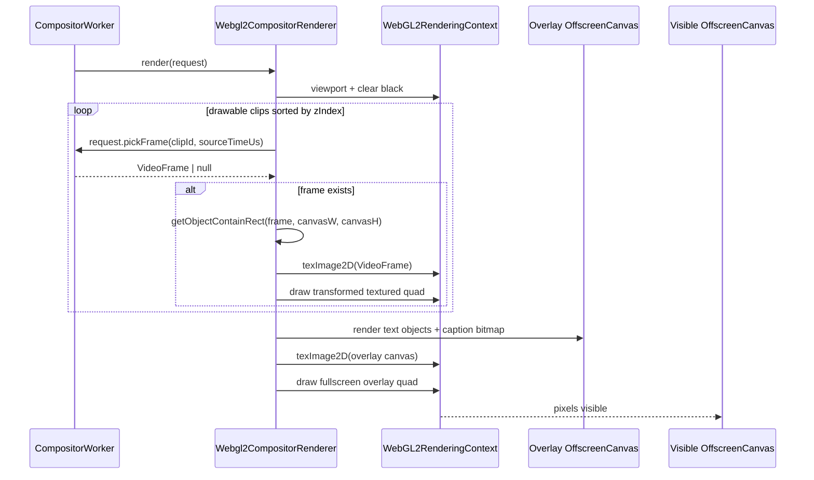


Important WebGL details:

- The canvas is requested with `{ alpha: false, antialias: false, depth: false, preserveDrawingBuffer: false, premultipliedAlpha: true }`.
- The vertex shader converts canvas-space positions into clip-space and flips Y with `vec2(1.0, -1.0)`.
- Upload no longer uses `UNPACK_FLIP_Y_WEBGL`; source row 0 maps to UV `v=0`.
- Frame textures are cached per `VideoFrame` in a `WeakMap`.
- If `gl.texImage2D(..., frame)` throws, the texture is deleted and render reports failure.
- On render failure, `CompositorWorker` asks the main thread to switch from WebGL2 to Canvas2D.
- Overlays are rendered into an internal overlay `OffscreenCanvas`, uploaded as a texture, and drawn as a fullscreen quad.

Clip transforms in WebGL:

1. `getObjectContainRect` computes object-fit-contain rectangle.
2. `buildTransformedQuad` transforms the four corners.
3. `applyTransform` applies scale around canvas center, pixel translation, percent translation, and rotation.
4. The fragment shader applies clipping and simple color effects.

## 17. Canvas2D Render Path

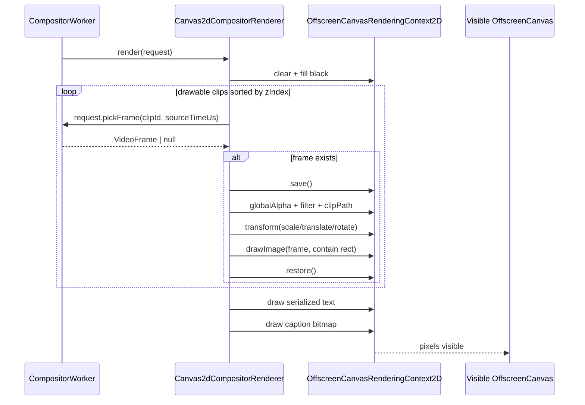


Canvas2D differs from WebGL2 in that it draws `VideoFrame`s directly with `drawImage`. It does not need texture upload, shader setup, or texture lifetime management. It still uses the same descriptors, frame queues, and overlay payloads.

Canvas2D clipping:

- `inset` becomes a rectangular clipping path.
- `polygon` becomes a path through percentage-based points.

Canvas2D effects:

- contrast maps to CSS `contrast(...)`
- warmth maps to `hue-rotate(...)` and `saturate(...)`

## 18. Caption Overlay Flow

### Trigger

Playback RAF calls `onRenderTick`, clock subscription fires, active caption clip changes, caption doc/preset changes, or a paused render needs a caption update.

### Outcome

A hidden canvas renders caption pixels into an `ImageBitmap`, and the next preview engine tick transfers that bitmap to the compositor worker.

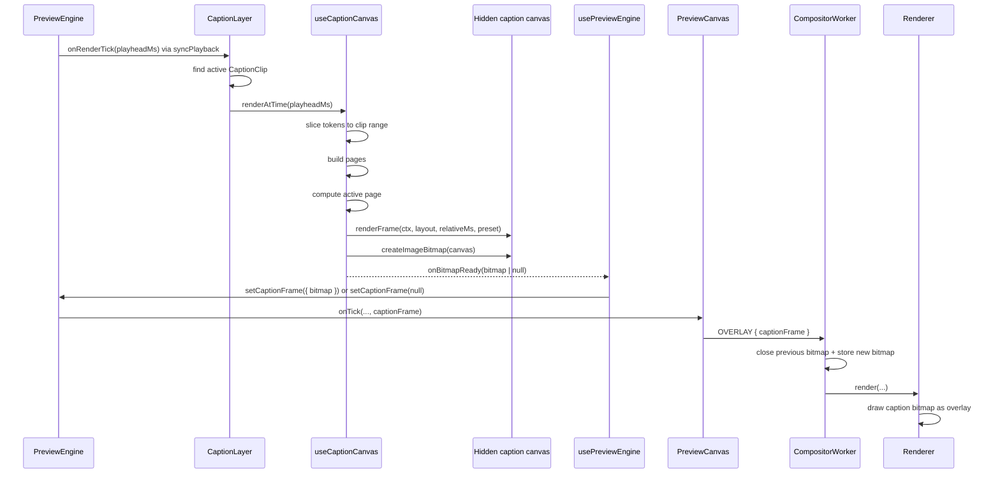


Caption details:

1. `CaptionLayer` is a hidden `<canvas>` component.
2. It finds the active caption clip from the text track.
3. It loads the caption doc and style preset.
4. It applies clip-level style overrides to the preset.
5. `useCaptionCanvas.renderAtTime` clears/resizes the canvas.
6. It loads a preset font URL if required.
7. It slices doc tokens between `sourceStartMs` and `sourceEndMs`.
8. It builds caption pages using clip grouping or preset grouping.
9. It chooses the page containing `relativeMs = currentTimeMs - clip.startMs`.
10. It computes layout and calls `renderFrame`.
11. It creates an `ImageBitmap` from the hidden canvas.
12. It calls `onBitmapReady`.
13. `usePreviewEngine` stores the bitmap in a queue and increments `captionBitmapVersion`.
14. The hook drains the queue, keeps the newest bitmap, closes superseded bitmaps, and calls `engine.setCaptionFrame`.
15. If paused, it calls `engine.renderCurrentFrame()` so the new caption appears immediately.
16. `PreviewEngine.tickCompositor` consumes the pending caption frame and sends it on the next `OVERLAY` message.

Caption frame semantics:


| Value        | Meaning                                               |
| ------------ | ----------------------------------------------------- |
| `undefined`  | Keep the compositor worker's existing caption bitmap. |
| `null`       | Clear the compositor worker's caption bitmap.         |
| `{ bitmap }` | Replace the compositor worker's caption bitmap.       |


## 19. Text Overlay Flow

Plain text clips are not rendered by `CaptionLayer`. `PreviewEngine.buildTextObjects(playheadMs)` serializes active text clips from the text track into `SerializedTextObject`s:

1. Find track where `track.type === "text"`.
2. Filter clips with `isTextClip`.
3. Keep clips active at `timelineMs`.
4. Call `serializeTextClip`.
5. Apply text chunking with `getTextClipPreviewDisplay`.
6. Position text relative to canvas center plus clip position offsets.
7. Send serialized objects through `PreviewCanvas.tick`.
8. `CompositorWorker.updateOverlay` stores them.
9. Renderer draws them as part of overlay:
  - WebGL2: text is first drawn into overlay `OffscreenCanvas`.
  - Canvas2D: text is drawn directly after video frames.

## 20. Preview Quality And Resource Budget

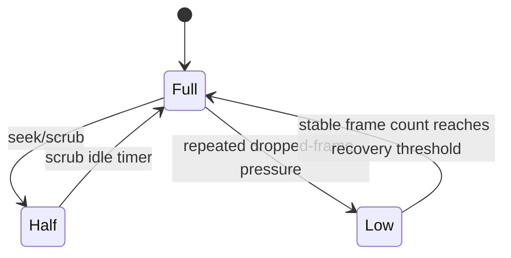


Preview quality state:


| Level  | Scale  | Effects  | Reason         |
| ------ | ------ | -------- | -------------- |
| `full` | `1`    | enabled  | steady         |
| `half` | `0.5`  | enabled  | scrubbing      |
| `low`  | `0.35` | disabled | dropped frames |


Where quality applies:

- `PreviewEngine.toCompositorQuality()` sends `{ level, scale }`.
- `CompositorWorker.applyQuality` resizes the renderer.
- Renderers resize the `OffscreenCanvas` to `canvasWidth * scale` and `canvasHeight * scale`.
- `PreviewEngine.applyPreviewQualityToClips` zeroes contrast/warmth when effects are disabled.

Decoder budget changes:

- `PreviewEngine.observeMemoryPressure()` reads `performance.memory` where available.
- At memory pressure ratio `>= 0.75`, decoder budget becomes:
  - decode window: 2 seconds
  - max active decoders: 2
- Otherwise steady budget is:
  - decode window: 5 seconds
  - max active decoders: 4

## 21. Error And Fallback Behavior

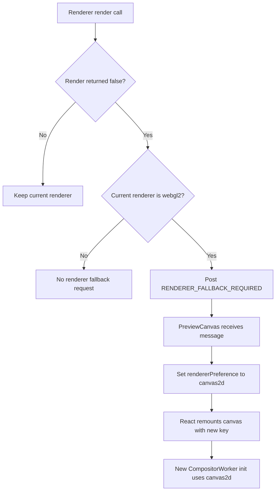


Fallback cases:

- WebGL2 cannot initialize: `createCompositorRenderer` directly constructs Canvas2D.
- WebGL context is lost: WebGL renderer returns false.
- WebGL `texImage2D(VideoFrame)` upload throws: WebGL renderer returns false.
- Compositor worker posts `RENDERER_FALLBACK_REQUIRED`.
- `PreviewCanvas` calls `onRendererPreferenceChange("canvas2d")`.
- `PreviewArea` / `EditorWorkspace` update `rendererPreference`.
- Canvas key changes, causing React to mount a new canvas/worker pair.

Decode failure behavior:

1. `ClipDecodeWorker` posts `ERROR` or `SEEK_FAILED`.
2. `DecoderPool.handleWorkerFailure` logs/fails the worker, destroys it, releases metadata ownership, and sets asset cooldown.
3. While in cooldown, `collectDecodeCandidates` skips that asset URL.
4. After cooldown, the asset can be retried by normal reconciliation.

Stale frame behavior:

- Frames from an older seek token are closed and counted as stale drops.
- Untagged playback frames are dropped while a seek is pending or active.
- Frames from destroyed workers are closed.

## 22. Timing And Units


| Quantity                    | Unit                      | Owner                                                |
| --------------------------- | ------------------------- | ---------------------------------------------------- |
| `currentTimeMs`             | timeline milliseconds     | `PreviewEngine`, editor playback state               |
| `playheadMs`                | timeline milliseconds     | compositor ticks, editor-core WASM                   |
| `sourceTimeMs`              | source media milliseconds | `DecoderPool.seek`, editor-core WASM internal helper |
| `sourceTimeUs`              | source media microseconds | `CompositorClipDescriptor`                           |
| `frame.timestamp`           | microseconds              | `VideoFrame` from WebCodecs                          |
| mp4box sample `dts` / `cts` | track ticks               | `ClipDecodeWorker`                                   |


Critical conversions:

```ts
// clip source time from timeline time
sourceSeconds = ((timelineMs - clip.startMs) / 1000) * speed + trimStartMs / 1000

// mp4box ticks to WebCodecs/compositor microseconds
timestampUs = Math.round((ticks * 1_000_000) / videoTimescale)

// Rust descriptor source time
sourceTimeUs = Math.round(clip_source_time_ms(clip, playheadMs) * 1000)
```

If `sourceTimeUs` and `VideoFrame.timestamp` are not in the same timebase, `CompositorWorker.pickFrame` can consistently choose no frame or the wrong frame.

## 23. Debug Observability

The debug runtime is installed at:

```js
window.__REEL_EDITOR_DEBUG__
```

Useful command:

```js
window.__REEL_EDITOR_DEBUG__?.snapshot()
```

Important fields:


| Field                              | Meaning                                                                           |
| ---------------------------------- | --------------------------------------------------------------------------------- |
| `debug.editorCoreWasm`             | Whether WASM descriptor module is pending/rust/fallback.                          |
| `debug.previewEngine`              | Playback state, dimensions, quality, metrics, decoder pool metrics.               |
| `debug.compositorWorker`           | Worker readiness, renderer mode, frame queue sizes, clip count, caption presence. |
| `debug.compositorRendererFallback` | Last renderer fallback request, if WebGL2 asked to fall back.                     |
| `measures`                         | Performance records including compositor ticks and caption bitmap renders.        |
| `marks`                            | Named timing marks used for seek/caption measurements.                            |


For black video with captions visible, inspect:

1. `debug.previewEngine.metrics.decodedFrameCount`
  - `0` means no accepted decoded frames reached `PreviewEngine`.
2. `debug.previewEngine.metrics.decoderPool.activeDecoderCount`
  - `0` means no workers are active near playhead.
3. `debug.previewEngine.metrics.decoderPool.readyDecoderCount`
  - `0` with active workers means workers are still loading or failing.
4. `debug.previewEngine.metrics.decoderPool.clipSeekMetrics`
  - `acceptedFrameCount` and `staleFrameDropCount` tell whether frames are accepted or discarded.
5. `debug.compositorWorker.frameQueueSizes`
  - Empty or zero means frames are not queued in compositor worker.
6. `debug.compositorWorker.clipCount`
  - `0` means descriptors are not asking renderer to draw a video clip.
7. `debug.compositorWorker.captionFramePresent`
  - `true` confirms overlay path is active even if video path is broken.

## 24. Known Fragile Boundaries

### WebCodecs support

`ClipDecodeWorker` assumes `VideoDecoder`, `EncodedVideoChunk`, and `VideoFrame` exist and support the asset codec. If the browser lacks WebCodecs support or cannot decode the codec profile, frames will not be produced.

### Asset URL availability

`DecoderPool` only creates candidates when `assetUrlMap` contains a URL for a clip's `assetId`. Missing asset URLs mean no worker and no video frames.

### Descriptor/queue `clipId` consistency

The descriptor `clipId` must match the worker entry clip id and compositor frame queue key. A mismatch means frames can be decoded but never selected.

### Timebase consistency

Decoder output timestamps and descriptor source times must both be source-media microseconds. Any mismatch breaks `pickFrame`.

### Resource closure

Frames and bitmaps must be closed when stale, evicted, superseded, or destroyed. Leaks can cause memory pressure and decoder budget reductions.

### Renderer ownership

After `transferControlToOffscreen`, React cannot draw into the visible canvas. All preview pixels must flow through `CompositorWorker`.

## 25. Quick Diagnostic Decision Tree

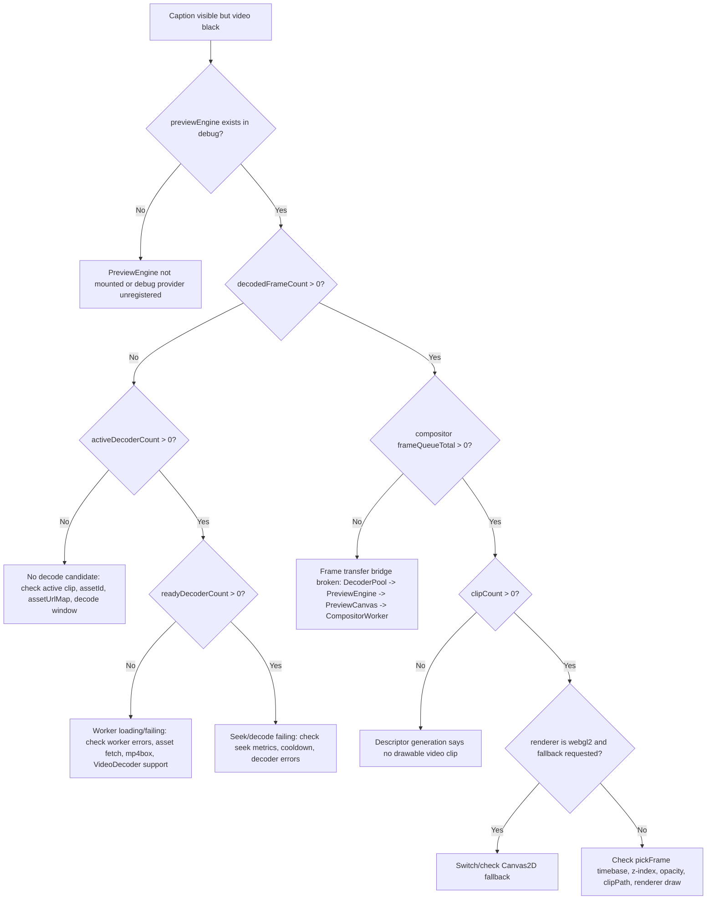


## 26. File Map


| File                                                                           | Role                                                                                          |
| ------------------------------------------------------------------------------ | --------------------------------------------------------------------------------------------- |
| `frontend/src/features/editor/components/layout/EditorWorkspace.tsx`           | Wires editor state, preview engine hook, preview canvas, and caption layer.                   |
| `frontend/src/features/editor/hooks/usePreviewEngine.ts`                       | React lifecycle wrapper around `PreviewEngine`; bridges callbacks to `PreviewCanvas`.         |
| `frontend/src/features/editor/engine/PreviewEngine.ts`                         | Preview orchestration, playback clock, decoder pool coordination, descriptor/tick generation. |
| `frontend/src/features/editor/engine/DecoderPool.ts`                           | Decode worker lifecycle, seek tokens, metadata cache, accepted/stale frame decisions.         |
| `frontend/src/features/editor/engine/ClipDecodeWorker.ts`                      | MP4 fetch/demux, `VideoDecoder` configure/seek/play, frame transfer.                          |
| `frontend/src/features/editor/engine/CompositorWorker.ts`                      | Visible canvas owner, frame queues, overlay state, renderer dispatch.                         |
| `frontend/src/features/editor/engine/compositor/types.ts`                      | Shared renderer contracts and descriptor types.                                               |
| `frontend/src/features/editor/engine/compositor/index.ts`                      | Renderer selection.                                                                           |
| `frontend/src/features/editor/engine/compositor/Webgl2CompositorRenderer.ts`   | WebGL2 renderer.                                                                              |
| `frontend/src/features/editor/engine/compositor/Canvas2dCompositorRenderer.ts` | Canvas2D renderer.                                                                            |
| `frontend/src/features/editor/engine/editor-core-wasm.ts`                      | WASM loader and TypeScript facade for Rust editor core.                                       |
| `frontend/editor-core/src/lib.rs`                                              | Rust implementation of compositor descriptor generation and source-time math.                 |
| `frontend/src/features/editor/components/preview/PreviewCanvas.tsx`            | Visible canvas bridge and worker message bridge.                                              |
| `frontend/src/features/editor/components/caption/CaptionLayer.tsx`             | Hidden caption canvas lifecycle and active caption clip selection.                            |
| `frontend/src/features/editor/caption/hooks/useCaptionCanvas.ts`               | Caption token slicing, layout, rendering, and `ImageBitmap` creation.                         |
| `frontend/src/features/editor/utils/editor-composition.ts`                     | Shared source-time and clip activity helpers.                                                 |
| `frontend/src/features/editor/hooks/useEditorAssetMap.ts`                      | Builds `assetUrlMap` from generated content assets and media library items.                   |
| `frontend/src/features/editor/engine/AudioMixer.ts`                            | Audio scheduling and audio-clock source for playback ticks.                                   |
| `frontend/src/features/editor/engine/decode-guard.ts`                          | Decode worker and asset safety limits.                                                        |


## 27. One-Screen Mental Model

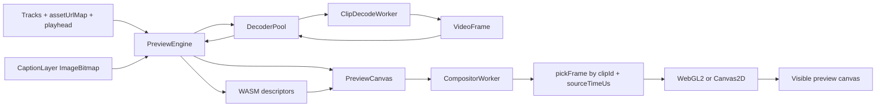


Everything has to line up:

- `assetUrlMap` must resolve clip media.
- `ClipDecodeWorker` must produce `VideoFrame`s.
- `DecoderPool` must accept those frames.
- `PreviewCanvas` must transfer them to `CompositorWorker`.
- WASM descriptors must request the same `clipId`.
- Descriptor `sourceTimeUs` must match frame timestamps.
- Renderer must successfully draw the selected frame.
- Captions are independent overlay bitmaps and can work even if any video step fails.

