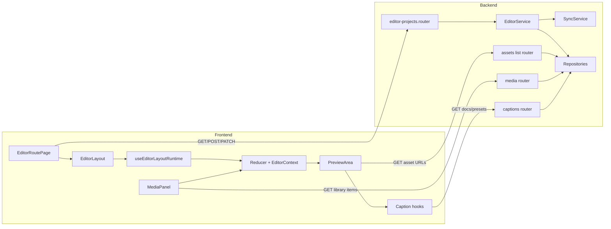
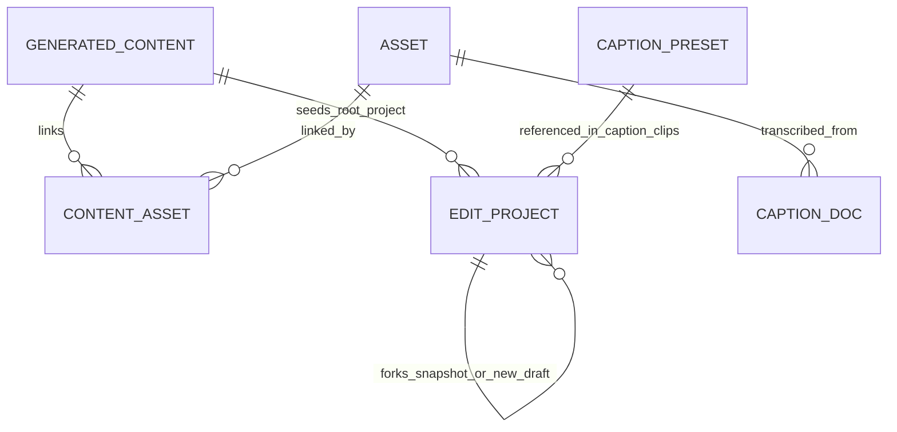
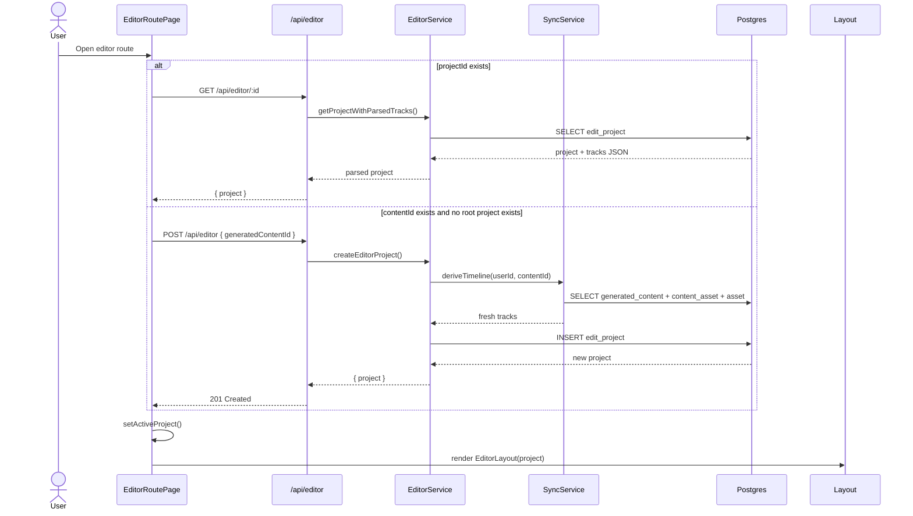
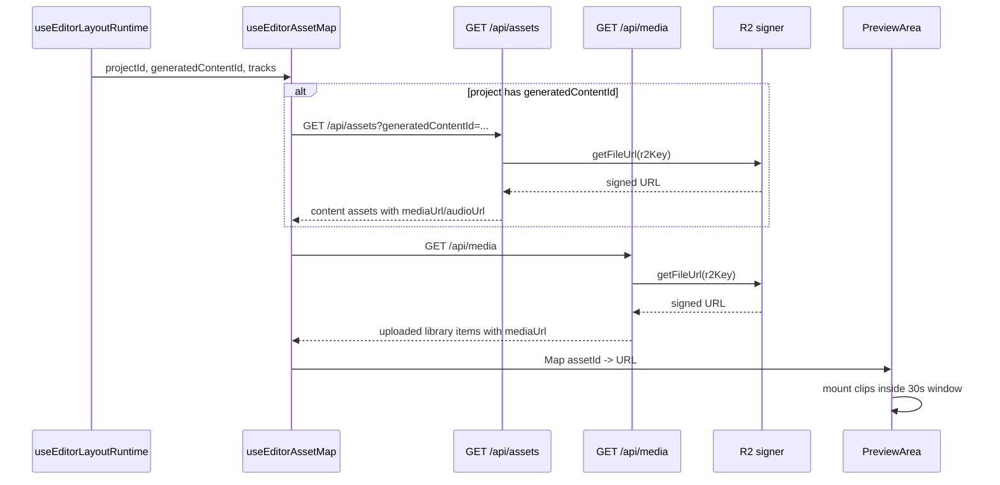
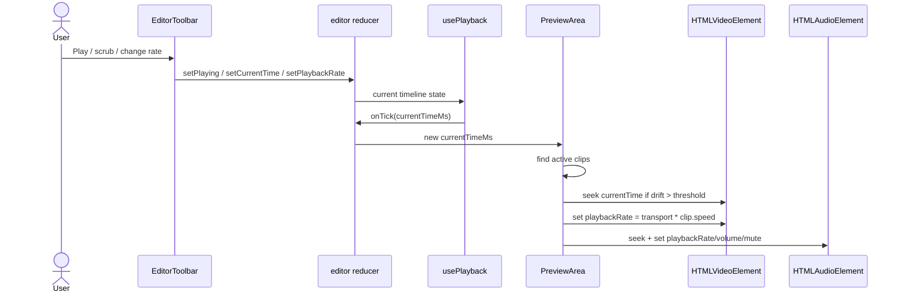
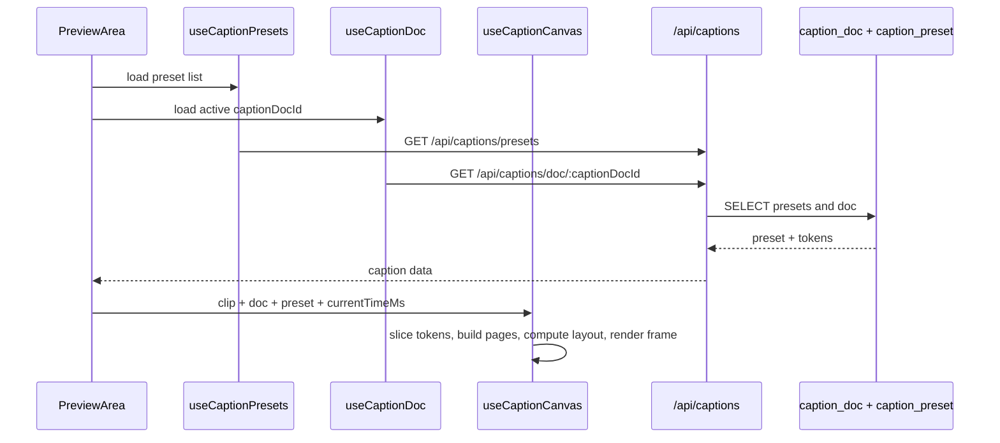
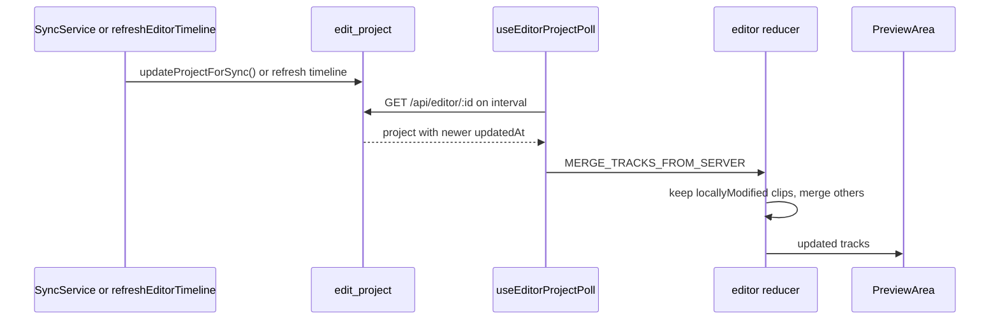
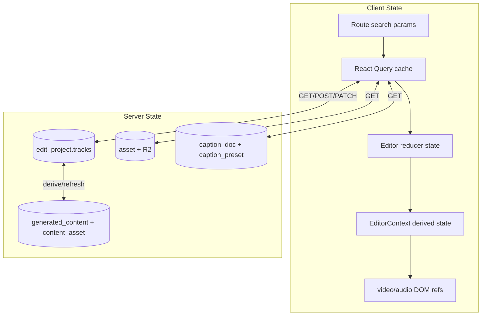
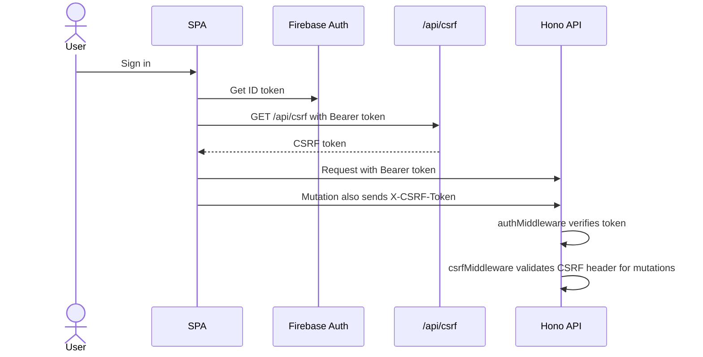
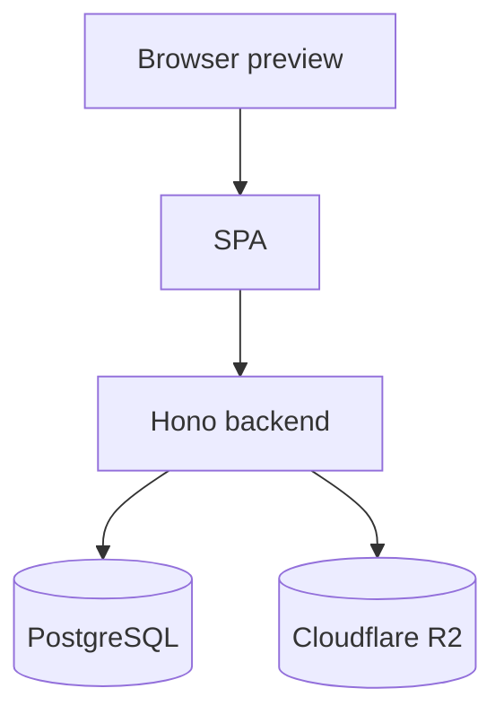

# Editor Preview System — Architecture Design Document

> **Last updated:** 2026-04-08
> **Scope:** The editor preview subsystem in Studio: how an editor project is opened, how timeline clips are derived and stored, how asset URLs are resolved, how playback is synchronized, how captions are rendered, and how server-side timeline updates reach the preview. This doc does not fully document export internals, chat generation internals, or the rest of the editor UI beyond what the preview depends on.
> **Audience:** Engineers onboarding, reviewers, future maintainers

## 1. Executive Summary

The editor preview is the runtime that turns an `edit_project.tracks` timeline into live browser playback inside Studio. The frontend opens or creates an editor project, loads timeline JSON from `/api/editor`, resolves each clip's `assetId` into a signed media URL via `/api/assets` and `/api/media`, and renders the active clips in [`frontend/src/features/editor/components/PreviewArea.tsx`](frontend/src/features/editor/components/PreviewArea.tsx). Playback is driven by a timeline playhead in [`frontend/src/features/editor/hooks/usePlayback.ts`](frontend/src/features/editor/hooks/usePlayback.ts), while the preview seek-syncs HTML media elements to the active timeline time using shared composition helpers in [`frontend/src/features/editor/utils/editor-composition.ts`](frontend/src/features/editor/utils/editor-composition.ts). On the backend, initial tracks come from `SyncService.deriveTimeline()` in [`backend/src/domain/editor/sync/sync.service.ts`](backend/src/domain/editor/sync/sync.service.ts), are persisted in `edit_project.tracks`, and can later be merged with refreshed content-derived assets or placeholder replacements without discarding user-added clips.

## 2. System Context Diagram

```mermaid
graph TB
    User[Studio user]

    subgraph "Editor Preview System"
        EditorRoute[Editor route and layout]
        Store[Editor reducer and context]
        Preview[PreviewArea]
        AssetMap[Asset URL map]
        Captions[Caption hooks and canvas]
    end

    subgraph "Backend APIs"
        EditorAPI[/api/editor]
        AssetsAPI[/api/assets]
        MediaAPI[/api/media]
        CaptionsAPI[/api/captions]
    end

    subgraph "Domain and Persistence"
        SyncService[SyncService]
        Content[(generated_content + content_asset)]
        Projects[(edit_project)]
        Assets[(asset)]
        CaptionDocs[(caption_doc + caption_preset)]
        R2[(Cloudflare R2)]
    end

    User -->|opens editor, plays timeline, adds clips| EditorRoute
    EditorRoute --> Store
    Store --> Preview
    Preview --> AssetMap
    Preview --> Captions
    AssetMap -->|GET| AssetsAPI
    AssetMap -->|GET| MediaAPI
    Captions -->|GET| CaptionsAPI
    EditorRoute -->|GET/POST/PATCH| EditorAPI
    EditorAPI --> SyncService
    SyncService --> Content
    EditorAPI --> Projects
    AssetsAPI --> Assets
    MediaAPI --> Assets
    AssetsAPI --> R2
    MediaAPI --> R2
    CaptionsAPI --> CaptionDocs
    Content --> Assets
    Projects --> Store
```

The user interacts with the editor route and transport controls. The frontend owns immediate playback state and rendering, but it depends on backend APIs for the canonical project timeline, signed asset URLs, and caption documents. The backend, in turn, builds and refreshes editor timelines from `generated_content`, `content_asset`, and `asset` records, while media binaries live in Cloudflare R2 through [`backend/src/services/storage/r2.ts`](backend/src/services/storage/r2.ts).

## 3. Core Concepts & Glossary

| Term | Definition |
|------|-----------|
| editor project | A row in `edit_project` representing one editable timeline, including `tracks`, `resolution`, `fps`, status, and optional `generatedContentId` ([`backend/src/infrastructure/database/drizzle/schema.ts`](backend/src/infrastructure/database/drizzle/schema.ts)). |
| track | A timeline lane of type `video`, `audio`, `music`, or `text`, each containing `clips` and optional `transitions` ([`frontend/src/features/editor/types/editor.ts`](frontend/src/features/editor/types/editor.ts)). |
| clip | A time-bounded item on a track. Media clips reference an `assetId`; text clips carry inline text; caption clips reference a `captionDocId`. |
| content-sourced clip | A clip with `source: "content"` or no source field, derived from generated content assets by `SyncService` and refresh flows ([`backend/src/domain/editor/sync/sync.service.ts`](backend/src/domain/editor/sync/sync.service.ts)). |
| user-sourced clip | A manually added clip with `source: "user"` that survives content re-syncs and is appended back into merged track results. |
| placeholder clip | A temporary video clip with `isPlaceholder: true` used while generated shot assets are not ready yet. It can later be replaced by a real asset in `mergePlaceholdersWithRealClips()` ([`backend/src/domain/editor/timeline/merge-placeholders-with-assets.ts`](backend/src/domain/editor/timeline/merge-placeholders-with-assets.ts)). |
| playhead | `currentTimeMs` in editor state. It is advanced by `usePlayback()` and is the single time source for preview rendering ([`frontend/src/features/editor/hooks/usePlayback.ts`](frontend/src/features/editor/hooks/usePlayback.ts)). |
| transport rate | The global timeline playback rate (`playbackRate`) controlled by the editor transport. It is separate from per-clip `speed`. |
| source time mapping | The conversion from timeline time to source media time, computed by `getClipSourceTimeSecondsAtTimelineTime()` using `startMs`, `trimStartMs`, and `speed` ([`frontend/src/features/editor/utils/editor-composition.ts`](frontend/src/features/editor/utils/editor-composition.ts)). |
| asset URL map | A frontend `Map<string, string>` that resolves `assetId` to a signed content-asset URL or uploaded media-library URL for preview playback ([`frontend/src/features/editor/hooks/useEditorAssetMap.ts`](frontend/src/features/editor/hooks/useEditorAssetMap.ts)). |
| caption doc | A tokenized transcript stored in `caption_doc`, fetched by `captionDocId`, and rendered into a `<canvas>` overlay in preview ([`backend/src/infrastructure/database/drizzle/schema.ts`](backend/src/infrastructure/database/drizzle/schema.ts), [`frontend/src/features/editor/caption/hooks/useCaptionCanvas.ts`](frontend/src/features/editor/caption/hooks/useCaptionCanvas.ts)). |

## 4. High-Level Architecture



- **`EditorRoutePage`** — Opens an existing project by `projectId`, creates one from `generatedContentId`, or shows the project gallery. It owns the route-level decision of whether the editor is in list mode or active editing mode ([`frontend/src/features/editor/components/EditorRoutePage.tsx`](frontend/src/features/editor/components/EditorRoutePage.tsx)). It depends on `/api/editor` for list, get, create, delete, and draft-fork actions.
- **`EditorLayout` and `useEditorLayoutRuntime`** — Compose the editor toolbar, workspace, timeline, autosave, polling, and playback hooks into one runtime bundle ([`frontend/src/features/editor/components/EditorLayout.tsx`](frontend/src/features/editor/components/EditorLayout.tsx), [`frontend/src/features/editor/hooks/useEditorLayoutRuntime.ts`](frontend/src/features/editor/hooks/useEditorLayoutRuntime.ts)). They own transient UI state such as the selected transition, pending asset insertion, effect preview override, and publish/export dialog state.
- **Reducer and context** — `useEditorReducer()` and `EditorProvider` own canonical client-side editor state: tracks, current time, zoom, selection, undo history, read-only mode, and export status ([`frontend/src/features/editor/hooks/useEditorStore.ts`](frontend/src/features/editor/hooks/useEditorStore.ts), [`frontend/src/features/editor/context/EditorContext.tsx`](frontend/src/features/editor/context/EditorContext.tsx)). They depend on server-loaded `EditProject` payloads and local edit actions.
- **`PreviewArea`** — Renders the live preview from current tracks and playhead time, using layered `<video>`, `<audio>`, text overlays, and a caption canvas ([`frontend/src/features/editor/components/PreviewArea.tsx`](frontend/src/features/editor/components/PreviewArea.tsx)). It owns no persistent timeline state; it depends entirely on the reducer state plus the asset URL map and caption hooks.
- **Asset and caption loaders** — `useEditorAssetMap()`, `useCaptionDoc()`, `useCaptionPresets()`, and `useCaptionCanvas()` translate project metadata into browser-usable media and caption rendering inputs ([`frontend/src/features/editor/hooks/useEditorAssetMap.ts`](frontend/src/features/editor/hooks/useEditorAssetMap.ts), [`frontend/src/features/editor/caption/hooks/useCaptionDoc.ts`](frontend/src/features/editor/caption/hooks/useCaptionDoc.ts), [`frontend/src/features/editor/caption/hooks/useCaptionPresets.ts`](frontend/src/features/editor/caption/hooks/useCaptionPresets.ts)). They own signed URL lookups, thumbnail capture, caption preset loading, and caption frame drawing.
- **Editor API layer** — Hono routers under `/api/editor`, `/api/assets`, `/api/media`, and `/api/captions` authenticate requests, validate inputs, and hand off to domain services ([`backend/src/routes/editor/editor-projects.router.ts`](backend/src/routes/editor/editor-projects.router.ts), [`backend/src/routes/assets/list.router.ts`](backend/src/routes/assets/list.router.ts), [`backend/src/routes/media/index.ts`](backend/src/routes/media/index.ts), [`backend/src/routes/editor/captions.ts`](backend/src/routes/editor/captions.ts)). They depend on Firebase-backed auth middleware, CSRF middleware for mutations, and repositories.
- **Domain services and repositories** — `EditorService` and `SyncService` build, store, refresh, and publish editor projects, while repositories map those operations to `edit_project`, `generated_content`, `content_asset`, `asset`, and caption tables ([`backend/src/domain/editor/editor.service.ts`](backend/src/domain/editor/editor.service.ts), [`backend/src/domain/editor/sync/sync.service.ts`](backend/src/domain/editor/sync/sync.service.ts), [`backend/src/domain/editor/editor.repository.ts`](backend/src/domain/editor/editor.repository.ts)). They own the canonical persisted timeline and server-side merge semantics.

## 5. Data Model



- **`generated_content`** stores the AI-authored content package: hook, script, caption, metadata, version chain, and ownership. It is the source record that `SyncService.deriveTimeline()` reads when bootstrapping a project from content ([`backend/src/infrastructure/database/drizzle/schema.ts`](backend/src/infrastructure/database/drizzle/schema.ts), [`backend/src/domain/content/content.repository.ts`](backend/src/domain/content/content.repository.ts)).
- **`asset`** stores every media file, whether uploaded, generated, platform-provided, TTS-created, or exported. Important fields for preview are `id`, `type`, `r2Key`, `r2Url`, `durationMs`, and `metadata` ([`backend/src/infrastructure/database/drizzle/schema.ts`](backend/src/infrastructure/database/drizzle/schema.ts)).
- **`content_asset`** links a generated content row to asset rows with a semantic `role` such as `video_clip`, `voiceover`, `background_music`, `assembled_video`, or `final_video`. `SyncService` filters roles to build video, audio, music, and caption tracks, and `/api/assets` excludes `assembled_video` and `final_video` by default for editor/media use ([`backend/src/domain/content/content.repository.ts`](backend/src/domain/content/content.repository.ts), [`backend/src/routes/assets/list.router.ts`](backend/src/routes/assets/list.router.ts)).
- **`edit_project`** stores the editor timeline itself as JSONB in `tracks`, plus `durationMs`, `fps`, `resolution`, status, thumbnail URL, and optional `generatedContentId` ([`backend/src/infrastructure/database/drizzle/schema.ts`](backend/src/infrastructure/database/drizzle/schema.ts)). Root projects have a partial unique constraint of one project per `(userId, generatedContentId)` when `parentProjectId IS NULL`.
- **`caption_doc`** stores transcript tokens and `fullText`, optionally keyed to a source `assetId`. Preview fetches caption docs by `captionDocId` from caption clips and renders only the token range referenced by `sourceStartMs` and `sourceEndMs` ([`backend/src/infrastructure/database/drizzle/schema.ts`](backend/src/infrastructure/database/drizzle/schema.ts), [`frontend/src/features/editor/caption/hooks/useCaptionCanvas.ts`](frontend/src/features/editor/caption/hooks/useCaptionCanvas.ts)).
- **`caption_preset`** stores caption style definitions. Preview loads all presets, picks the one referenced by the active caption clip, then applies clip-level style overrides before drawing ([`backend/src/infrastructure/database/drizzle/schema.ts`](backend/src/infrastructure/database/drizzle/schema.ts), [`frontend/src/features/editor/components/PreviewArea.tsx`](frontend/src/features/editor/components/PreviewArea.tsx)).

Relationship semantics:

- A root editor project may be linked to one generated content chain tip, but draft versions can fork away by clearing `generatedContentId` and pointing `parentProjectId` back to the published source.
- Deleting a user deletes their `edit_project` rows and caption docs through cascade relationships; deleting an `asset` cascades caption docs that reference that asset.
- Media binaries do not live in Postgres. Postgres stores metadata and R2 keys; signed or public URLs are generated on demand through [`backend/src/services/storage/r2.ts`](backend/src/services/storage/r2.ts).

## 6. Key Flows

### 6.1 Open Or Create an Editor Project

**Trigger:** The user navigates to `/studio/editor` with either `projectId` or `contentId`.
**Outcome:** The frontend loads an `EditProject` into reducer state and the preview receives tracks to render.



Step-by-step walkthrough:

1. **User action** — The user opens the editor page through a direct project link or from generated content context ([`frontend/src/routes/studio/_layout/editor.tsx`](frontend/src/routes/studio/_layout/editor.tsx)).
2. **Frontend handling** — `EditorRoutePage` decides whether to fetch by `projectId`, reuse an already-listed project for `contentId`, or create a new project from `generatedContentId` ([`frontend/src/features/editor/components/EditorRoutePage.tsx`](frontend/src/features/editor/components/EditorRoutePage.tsx)).
3. **API layer** — `/api/editor/:id` reads an existing project; `/api/editor` validates create input and requires auth plus CSRF for POST ([`backend/src/routes/editor/editor-projects.router.ts`](backend/src/routes/editor/editor-projects.router.ts)).
4. **Service logic** — `EditorService.createEditorProject()` enforces one root project per content chain, auto-titles the project from `generatedHook` when possible, and calls `SyncService.deriveTimeline()` for first-time content-backed projects ([`backend/src/domain/editor/editor.service.ts`](backend/src/domain/editor/editor.service.ts)).
5. **Data layer** — `SyncService.deriveTimeline()` reads content-linked assets, sorts video clips by `shotIndex`, creates default video/audio/music/text tracks, and optionally creates a caption clip by transcribing the voiceover asset ([`backend/src/domain/editor/sync/sync.service.ts`](backend/src/domain/editor/sync/sync.service.ts)).
6. **Response path** — `EditorLayout` receives the project, and `useEditorProjectPoll()` immediately loads it into reducer state via `LOAD_PROJECT` ([`frontend/src/features/editor/hooks/useEditorProjectPoll.ts`](frontend/src/features/editor/hooks/useEditorProjectPoll.ts), [`frontend/src/features/editor/model/editor-reducer-session-ops.ts`](frontend/src/features/editor/model/editor-reducer-session-ops.ts)).

Error scenarios:

- If a root project already exists for that content chain, `EditorService.createEditorProject()` throws `PROJECT_EXISTS` with HTTP 409 and the frontend re-fetches the existing project instead of creating a duplicate ([`backend/src/domain/editor/editor.service.ts`](backend/src/domain/editor/editor.service.ts), [`frontend/src/features/editor/components/EditorRoutePage.tsx`](frontend/src/features/editor/components/EditorRoutePage.tsx)).
- If the project ID is invalid or not owned by the user, `/api/editor/:id` returns 404 or 403 semantics through the service layer, and the route clears the invalid URL state.

### 6.2 Resolve Clip Assets Into Preview Media Elements

**Trigger:** A project is loaded or its tracks change.
**Outcome:** `PreviewArea` can mount `<video>` and `<audio>` elements with signed URLs for each playable clip.



Step-by-step walkthrough:

1. **User action** — Opening a project or editing tracks causes `useEditorLayoutRuntime()` to rebuild the preview dependencies.
2. **Frontend handling** — `useEditorAssetMap()` fetches content-linked assets through `/api/assets?generatedContentId=...` and also fetches user library items through `/api/media`, then merges them into one `Map<string, string>` ([`frontend/src/features/editor/hooks/useEditorAssetMap.ts`](frontend/src/features/editor/hooks/useEditorAssetMap.ts)).
3. **API layer** — `/api/assets` returns content assets except assembled/final outputs by default and signs `mediaUrl`/`audioUrl`; `/api/media` lists uploaded library items and signs `mediaUrl` for each ([`backend/src/routes/assets/list.router.ts`](backend/src/routes/assets/list.router.ts), [`backend/src/routes/media/index.ts`](backend/src/routes/media/index.ts)).
4. **Service logic** — Content assets come from `contentService.listContentAssetsForUser()`, while library items come from `assetsService.listUserLibrary()` via the media route. Both are scoped to the authenticated user.
5. **Data layer** — URL signing uses `getFileUrl()` against Cloudflare R2; the database only stores `r2Key` and metadata ([`backend/src/services/storage/r2.ts`](backend/src/services/storage/r2.ts)).
6. **Response path** — `PreviewArea` looks up every clip's `assetId` in the map and mounts only clips inside `PREVIEW_MEDIA_MOUNT_WINDOW_MS` (30 seconds before/after playhead) to control memory use ([`frontend/src/features/editor/components/PreviewArea.tsx`](frontend/src/features/editor/components/PreviewArea.tsx), [`frontend/src/features/editor/utils/editor-composition.ts`](frontend/src/features/editor/utils/editor-composition.ts)).

Error scenarios:

- If a signed URL cannot be generated, `/api/assets` or `/api/media` returns the asset with `mediaUrl: null`, and preview shows a pulsing placeholder instead of a playable video element.
- If a clip references an `assetId` that is missing from both content assets and library items, the preview mounts no `src` for that clip and it remains visually empty.

### 6.3 Drive Playback And Keep HTML Media In Sync

**Trigger:** The user presses play, pauses, scrubs, or changes playback speed.
**Outcome:** The playhead advances in reducer state and active media elements seek/play at the correct source time.



Step-by-step walkthrough:

1. **User action** — The user hits play or scrubs the timeline through the toolbar or playhead controls ([`frontend/src/features/editor/components/EditorLayout.tsx`](frontend/src/features/editor/components/EditorLayout.tsx)).
2. **Frontend handling** — `usePlayback()` uses `requestAnimationFrame` to advance `currentTimeMs`; it clamps at `0` and `durationMs` and supports negative transport rates for reverse playback ([`frontend/src/features/editor/hooks/usePlayback.ts`](frontend/src/features/editor/hooks/usePlayback.ts)).
3. **API layer** — No network request is needed for playback itself. This is a pure client-side flow after the project and assets are loaded.
4. **Service logic** — `PreviewArea` computes active clips per track using `isClipActiveAtTimelineTime()` and `buildActiveVideoClipIdsByTrackMap()`. It also handles incoming dissolve/wipe prerender windows and transition style computation using shared composition helpers ([`frontend/src/features/editor/utils/editor-composition.ts`](frontend/src/features/editor/utils/editor-composition.ts)).
5. **Data layer** — The active clip metadata comes from reducer state. For media clips, source time is calculated as `(timeline delta * clip.speed) + trimStartMs`, and HTML media element `playbackRate` is `transportRate * clip.speed`, clamped to browser-safe bounds.
6. **Response path** — Videos and audio either play, pause, or seek to the correct source time. Text clips render as absolutely positioned DOM overlays; caption clips render through a canvas.

Error scenarios:

- Browser media playback can disagree with extreme rates or reverse playback. The code compensates by seek-syncing when the element drifts beyond `VIDEO_SYNC_SEEK_THRESHOLD_SEC` or the incoming-transition threshold instead of trusting continuous playback alone.
- Disabled clips (`enabled === false`) still exist in track state but render at zero opacity or are treated as inactive by the preview timing helpers.

### 6.4 Render Captions On Top Of Preview

**Trigger:** The active text track contains a caption clip at the current playhead time.
**Outcome:** The preview draws the active caption page into a canvas overlay.



Step-by-step walkthrough:

1. **User action** — The playhead enters a caption clip on the text track.
2. **Frontend handling** — `PreviewArea` finds the last active caption clip, fetches its document and style preset, applies clip-level overrides, and passes the result into `useCaptionCanvas()` ([`frontend/src/features/editor/components/PreviewArea.tsx`](frontend/src/features/editor/components/PreviewArea.tsx)).
3. **API layer** — `/api/captions/presets` returns all presets; `/api/captions/doc/:captionDocId` returns the caption token document for that user ([`backend/src/routes/editor/captions.ts`](backend/src/routes/editor/captions.ts)).
4. **Service logic** — `useCaptionCanvas()` slices transcript tokens to the clip's `sourceStartMs`/`sourceEndMs`, groups them into pages, chooses the active page at `relativeMs`, lazily loads the font if the preset defines `fontUrl`, and draws the frame ([`frontend/src/features/editor/caption/hooks/useCaptionCanvas.ts`](frontend/src/features/editor/caption/hooks/useCaptionCanvas.ts)).
5. **Data layer** — Caption token data lives in `caption_doc.tokens`; style definitions live in `caption_preset.definition`.
6. **Response path** — The canvas is painted on top of the preview video layers and cleared when no caption frame is active.

Error scenarios:

- If the caption doc or preset is missing, `useCaptionCanvas()` treats the frame as absent and clears the canvas rather than crashing preview rendering.
- If caption transcription fails during initial timeline derivation, `SyncService.deriveTimeline()` logs the failure and returns the project without a caption clip.

### 6.5 Merge Server Timeline Updates Into An Open Preview

**Trigger:** The backend updates an editor project's tracks after content changes or shot placeholder replacement.
**Outcome:** The open editor merges canonical server changes without discarding locally modified clips.



Step-by-step walkthrough:

1. **User action** — The user may still be watching preview while AI content changes complete in the background.
2. **Frontend handling** — `useEditorProjectPoll()` polls `/api/editor/:id` every 15 seconds normally, or with an adaptive faster interval while placeholder clips exist ([`frontend/src/features/editor/hooks/useEditorProjectPoll.ts`](frontend/src/features/editor/hooks/useEditorProjectPoll.ts)).
3. **API layer** — `/api/editor/:id` returns the latest parsed tracks from `edit_project.tracks`.
4. **Service logic** — Server-side updates can come from `SyncService.syncLinkedProjects()` after content edits or `refreshEditorTimeline()` / `mergePlaceholdersWithRealClips()` when shot assets arrive ([`backend/src/domain/editor/sync/sync.service.ts`](backend/src/domain/editor/sync/sync.service.ts), [`backend/src/routes/editor/services/refresh-editor-timeline.ts`](backend/src/routes/editor/services/refresh-editor-timeline.ts), [`backend/src/domain/editor/timeline/merge-placeholders-with-assets.ts`](backend/src/domain/editor/timeline/merge-placeholders-with-assets.ts)).
5. **Data layer** — `EditorRepository.updateProjectForSync()` writes new `tracks`, `durationMs`, and `generatedContentId` but intentionally does not bump a separate autosave conflict version field; the only visible signal is `updatedAt` ([`backend/src/domain/editor/editor.repository.ts`](backend/src/domain/editor/editor.repository.ts)).
6. **Response path** — `MERGE_TRACKS_FROM_SERVER` updates tracks by keeping `locallyModified` local clips and replacing untouched ones with server versions, then preview re-renders from the merged result ([`frontend/src/features/editor/model/editor-reducer-track-ops.ts`](frontend/src/features/editor/model/editor-reducer-track-ops.ts)).

Error scenarios:

- If the server project resets to all placeholders while the local user already has real clips, `useEditorProjectPoll()` raises `scriptResetPending` instead of silently replacing the local timeline.
- If polling finds no changes (`updatedAt` unchanged), no merge occurs and the preview keeps local state.

## 7. API Surface

### Editor Projects

| Method | Path | Auth | Description |
|--------|------|------|-------------|
| GET | `/api/editor` | User | Lists editor projects for the authenticated user. |
| POST | `/api/editor` | User + CSRF | Creates a new project, optionally seeded from `generatedContentId`. |
| GET | `/api/editor/:id` | User | Fetches one project and parses its stored tracks. |
| PATCH | `/api/editor/:id` | User + CSRF | Autosaves title, tracks, duration, fps, or resolution. |
| DELETE | `/api/editor/:id` | User + CSRF | Deletes a project. |
| POST | `/api/editor/:id/thumbnail` | User + CSRF | Uploads a thumbnail image for the project. |
| POST | `/api/editor/:id/publish` | User + CSRF | Publishes a draft project after a successful export exists. |
| POST | `/api/editor/:id/new-draft` | User + CSRF | Forks a new draft from a published project. |

Important request/response notes:

- `POST /api/editor` accepts `{ title?: string; generatedContentId?: number }` and returns `{ project }` ([`backend/src/domain/editor/editor.schemas.ts`](backend/src/domain/editor/editor.schemas.ts)).
- `PATCH /api/editor/:id` accepts partial `title`, `tracks`, `durationMs`, `fps`, and `resolution`. `tracks` are validated with clip overlap checks and per-type clip schemas before being sanitized and persisted.
- `POST /api/editor` can return HTTP 409 with `existingProjectId` when a root project already exists for the content chain.

### Asset Delivery

| Method | Path | Auth | Description |
|--------|------|------|-------------|
| GET | `/api/assets?generatedContentId=:id` | User | Lists content-linked editor assets with signed URLs. |
| GET | `/api/media` | User | Lists uploaded media-library items with signed URLs. |
| POST | `/api/media/upload` | User + CSRF | Uploads a user library asset. |
| DELETE | `/api/media/:id` | User + CSRF | Deletes a user library asset. |
| GET | `/api/assets/:id/media-for-decode` | User | Streams the raw object body for same-origin decode use cases. |

Important request/response notes:

- `/api/assets` excludes `assembled_video` and `final_video` unless a specific type is requested ([`backend/src/routes/assets/list.router.ts`](backend/src/routes/assets/list.router.ts)).
- The preview and media panel use signed URLs, not permanent public URLs, so browser media access depends on successful URL generation from R2.

### Captions

| Method | Path | Auth | Description |
|--------|------|------|-------------|
| GET | `/api/captions/presets` | User | Returns caption style presets. |
| GET | `/api/captions/doc/:captionDocId` | User | Returns a caption document by ID. |
| PATCH | `/api/captions/doc/:captionDocId` | User + CSRF | Updates a caption document. |
| POST | `/api/captions/transcribe` | User + CSRF | Transcribes an asset into a caption doc. |

Important request/response notes:

- Caption transcription has an extra per-user rate limiter in production: 2 requests per minute and 20 per hour ([`backend/src/routes/editor/captions.ts`](backend/src/routes/editor/captions.ts)).
- Preview reads captions only through GET requests; editing captions happens elsewhere in the editor.

## 8. State Management



What state lives where and why:

- **Route state** holds `projectId` and `contentId`, which determine whether to fetch or create a project.
- **React Query** caches project payloads, content asset lists, media-library items, caption docs, and caption presets ([`frontend/src/shared/lib/query-keys.ts`](frontend/src/shared/lib/query-keys.ts)).
- **Reducer state** is the canonical in-browser editor document. Preview reads `tracks`, `currentTimeMs`, `playbackRate`, `durationMs`, `resolution`, and selection from it.
- **DOM refs** in `PreviewArea` hold the actual `HTMLVideoElement` and `HTMLAudioElement` instances for imperative seek/play/pause control.
- **Server state** stores the canonical persisted timeline, source content assets, and caption data.

Cache invalidation and consistency:

- Autosave invalidates both the project list and the active project query after a successful PATCH ([`frontend/src/features/editor/hooks/useEditorAutosave.ts`](frontend/src/features/editor/hooks/useEditorAutosave.ts)).
- Polling keeps the active project aligned with server updates while still respecting `locallyModified` local clips.
- There is no explicit cross-tab synchronization beyond polling and query invalidation. Another tab's changes become visible when this tab polls or re-fetches.

Optimistic update patterns:

- Most preview-affecting edits are immediate reducer updates first, with debounced server persistence afterward.
- Thumbnail upload uses an optimistic cache patch in `EditorRoutePage` after a successful upload response.
- Effect preview changes are intentionally non-persistent and are passed to `PreviewArea` as a temporary override without entering saved timeline state.

## 9. Authentication & Security Model



Security model details:

- Identity is established with Firebase ID tokens. `authMiddleware()` requires an `Authorization: Bearer <token>` header, verifies it with Firebase Admin, and resolves the application user session ([`backend/src/middleware/protection.ts`](backend/src/middleware/protection.ts)).
- Frontend requests go through `authenticatedFetchJson()` and `useAuthenticatedFetch()`, which attach auth headers and obtain CSRF tokens for mutations ([`frontend/src/shared/services/api/authenticated-fetch.ts`](frontend/src/shared/services/api/authenticated-fetch.ts), [`frontend/src/features/auth/hooks/use-authenticated-fetch.ts`](frontend/src/features/auth/hooks/use-authenticated-fetch.ts)).
- Mutating editor, media, and caption endpoints use `csrfMiddleware()` and reject missing or invalid `X-CSRF-Token` headers.
- Most preview-related GET routes are rate-limited as `"customer"` routes. Caption transcription has stricter production limits.
- Input validation is schema-based with Zod on both route params and request bodies, including strict clip schemas and overlap checks for persisted tracks ([`backend/src/domain/editor/editor.schemas.ts`](backend/src/domain/editor/editor.schemas.ts)).

## 10. Infrastructure & Deployment



Code-observable infrastructure for this subsystem:

- Media storage is Cloudflare R2, accessed through an S3-compatible client in [`backend/src/services/storage/r2.ts`](backend/src/services/storage/r2.ts).
- The backend signs asset URLs on demand with `getFileUrl()` and can also proxy raw media streams with `getObjectWebStream()` for same-origin decode flows.
- The preview itself is fully browser-side and uses native HTML media elements plus a `<canvas>` overlay, not a server-rendered preview service.

The repo also contains Dockerfiles and Railway configuration, but this preview subsystem does not define a separate deployment unit beyond the normal frontend and backend apps.

## 11. Design Decisions & Trade-offs

| Decision | Chosen Approach | Alternatives Considered | Rationale |
|----------|----------------|------------------------|-----------|
| Preview renderer | Native `<video>`/`<audio>` + DOM/canvas overlays | Dedicated video engine, server-rendered preview | Fast iteration in the SPA, direct use of signed URLs, and simple mapping from reducer state to browser media elements ([`frontend/src/features/editor/components/PreviewArea.tsx`](frontend/src/features/editor/components/PreviewArea.tsx)). |
| Time model | Playhead drives timeline; media elements are seek-synced to it | Let media elements be the clock | A single reducer-owned playhead makes scrub, reverse playback, and multi-track coordination predictable. |
| Source-of-truth timing helpers | Shared preview helpers in `editor-composition.ts` | Inline timing logic inside `PreviewArea` | Keeps active-clip logic, source-time mapping, preload windows, and transition styles centralized. |
| Initial project seeding | Derive tracks from `generated_content` assets on the server | Build the first timeline in the frontend | Server derivation enforces ownership, asset ordering, and caption generation before the project exists. |
| Content re-sync behavior | Replace content clips, preserve user clips and matching-asset adjustments | Full overwrite of all tracks | This keeps AI updates flowing into the project without wiping manual work ([`backend/src/domain/editor/sync/sync.service.ts`](backend/src/domain/editor/sync/sync.service.ts)). |
| Persistence cadence | Immediate local reducer updates + debounced autosave | Round-trip every edit before updating UI | The editor stays responsive while still persisting changes every 500ms debounce and every 30s heartbeat ([`frontend/src/features/editor/constants/editor.ts`](frontend/src/features/editor/constants/editor.ts)). |
| Asset lookup | Merge `/api/assets` and `/api/media` into one asset map | Separate preview-only and library-only maps | The preview does not care whether an asset came from generated content or the user's library; it only needs `assetId -> URL`. |

## 12. Known Limitations & Future Considerations

- Preview timing and export timing are only logically aligned, not code-shared across frontend and backend. [`backend/src/domain/editor/run-export-job.ts`](backend/src/domain/editor/run-export-job.ts) explicitly warns that FFmpeg semantics must stay in sync with [`frontend/src/features/editor/utils/editor-composition.ts`](frontend/src/features/editor/utils/editor-composition.ts).
- Preview mounting and preload windows are heuristic (`30_000ms` mount window, `12_000ms` preload window). Large projects or many stacked video tracks can still create significant browser memory pressure.
- Signed media URLs are generated client-side through normal API calls and are not proactively refreshed while preview is open. Long editor sessions can eventually depend on cache refreshes or re-fetches.
- The frontend defines `queryKeys.api.editorAssets()` and the backend exposes `/api/editor/assets`, but the actual preview/media loading path uses `/api/assets` and `/api/media`. That split increases the surface area engineers need to understand.
- Polling, not push delivery, propagates timeline updates into an already open preview. This keeps the model simple but means refreshes are eventual rather than immediate.
- Placeholder handling is strongest for video generation flows. Other preview dependencies, such as missing captions or missing asset URLs, still degrade by omission rather than by richer user-facing states.
