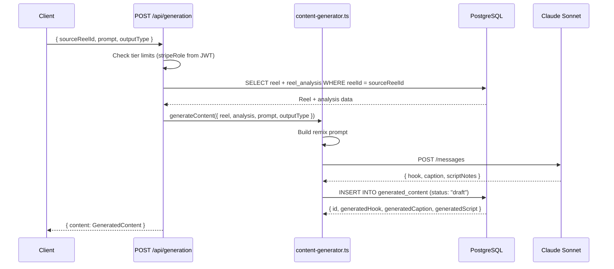
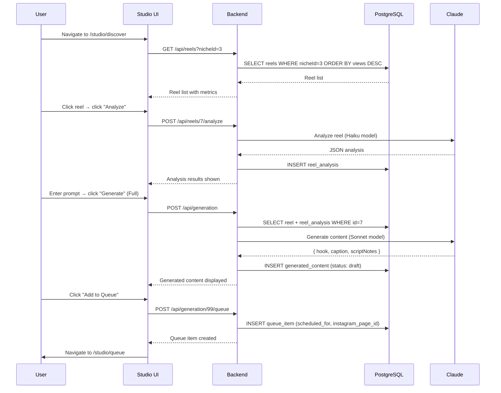

# Generation System — Domain Architecture

## Overview

The Generation System is the AI backbone of ReelStudio. It has two distinct sub-systems:

1. **Reel Analysis** — Uses Claude Haiku to break down *why* a reel is viral (hooks, emotional triggers, format patterns, CTAs)
2. **Content Generation** — Uses Claude Sonnet to generate original hooks, captions, and scripts inspired by a reel's analysis

Usage is tracked per user and gated by subscription tier.

---

## Table of Contents

1. [Architecture Overview](#architecture-overview)
2. [AI Models](#ai-models)
3. [Reel Analysis Sub-System](#reel-analysis-sub-system)
4. [Content Generation Sub-System](#content-generation-sub-system)
5. [API Endpoints](#api-endpoints)
6. [Access Control & Usage Limits](#access-control--usage-limits)
7. [Data Flow Diagrams](#data-flow-diagrams)
8. [Database Schema](#database-schema)
9. [Error Handling](#error-handling)

---

## Architecture Overview

```
Frontend (Studio Workspace)
  ├── /studio/discover  → select a reel, trigger analysis
  ├── /studio/generate  → enter prompt, choose output type, generate
  └── /studio/queue     → review history, schedule to Instagram

        ↓ HTTPS API calls

Backend (Hono Routes)
  ├── POST /api/reels/:id/analyze   → reel-analyzer.ts  → Claude Haiku
  ├── POST /api/generation          → content-generator.ts → Claude Sonnet
  ├── GET  /api/generation          → generation history
  └── POST /api/generation/:id/queue → add to queue

        ↓

Services
  ├── reel-analyzer.ts     → builds prompt, calls Claude, stores reel_analysis
  └── content-generator.ts → builds prompt, calls Claude, stores generated_content

        ↓

PostgreSQL (Drizzle)
  ├── reel_analysis     ← AI analysis results
  ├── generated_content ← generated hooks/captions/scripts
  └── queue_item        ← scheduled content
```

---

## AI Models

| Task | Model | Reason |
|------|-------|--------|
| Reel analysis | `claude-haiku-4-5-20251001` | Fast, cost-effective, structured JSON extraction |
| Content generation | `claude-sonnet-4-6` | Higher quality creative output |

Models are configured via environment variables:
```env
ANALYSIS_MODEL=claude-haiku-4-5-20251001
GENERATION_MODEL=claude-sonnet-4-6
```

**Client location:** `backend/src/lib/aiClient.ts`

---

## Reel Analysis Sub-System

### Purpose

Analyzes a stored reel and extracts the structural patterns that make it perform.

### Location

`backend/src/services/reels/reel-analyzer.ts`

### Analysis Fields Extracted

| Field | Description |
|-------|-------------|
| `hookPattern` | The specific hook structure used (e.g., "Bold claim opener") |
| `hookCategory` | Broad category (Curiosity / Controversy / How-to / Storytime) |
| `emotionalTrigger` | Primary emotion activated (Fear of missing out / Inspiration / Shock) |
| `formatPattern` | Visual/structural format (Talking head / B-roll / Text overlay / Tutorial) |
| `ctaType` | Call to action style (Follow / Comment / Save / Share) |
| `captionFramework` | Caption writing structure used |
| `curiosityGapStyle` | How information is withheld to create tension |
| `remixSuggestion` | Concrete suggestion for remixing this reel for a new audience |

### Analysis Flow

```mermaid
sequenceDiagram
    participant Client
    participant POST /api/reels/:id/analyze
    participant reel-analyzer.ts
    participant PostgreSQL
    participant Claude Haiku

    Client->>POST /api/reels/:id/analyze: (with auth token)
    POST /api/reels/:id/analyze->>reel-analyzer.ts: analyzeReel(reelId)
    reel-analyzer.ts->>PostgreSQL: SELECT reel WHERE id = reelId
    PostgreSQL-->>reel-analyzer.ts: Reel data (hook, caption, views, etc.)

    reel-analyzer.ts->>reel-analyzer.ts: Build analysis prompt with reel data
    reel-analyzer.ts->>Claude Haiku: POST /messages (structured JSON response format)
    Claude Haiku-->>reel-analyzer.ts: JSON { hookPattern, emotionalTrigger, ... }

    reel-analyzer.ts->>PostgreSQL: INSERT INTO reel_analysis ...
    PostgreSQL-->>reel-analyzer.ts: Saved analysis row

    POST /api/reels/:id/analyze-->>Client: { analysis: ReelAnalysis }
```

### Prompt Design

The analysis prompt instructs Claude to:
1. Read the reel metadata (hook text, caption, view/like counts)
2. Identify patterns from a predefined taxonomy
3. Return a structured JSON object (no prose)

The response is validated against a Zod schema before being stored. If Claude returns invalid JSON, a 500 is returned.

---

## Content Generation Sub-System

### Purpose

Generates new content (hooks, captions, script notes) inspired by an analyzed reel.

### Location

`backend/src/services/reels/content-generator.ts`

### Output Types

| Type | What is Generated |
|------|------------------|
| `"hook"` | 5 hook variations in different styles |
| `"caption"` | Full caption with hook + body + CTA |
| `"full"` | Hook variations + full caption + script notes |

### Generation Flow



### Prompt Design

The generation prompt provides Claude with:
- The source reel's hook, caption, niche, and key metrics
- The AI analysis (hook pattern, emotional trigger, format, CTA)
- The user's specific remix prompt/direction
- Clear output format requirements (JSON with specific fields)

---

## API Endpoints

### `POST /api/reels/:id/analyze`

Triggers AI analysis of a reel.

**Auth:** `authMiddleware("user")`
**Rate limit:** `rateLimiter("customer")`

**Response:**
```json
{
  "analysis": {
    "id": 42,
    "reelId": 7,
    "hookPattern": "Bold claim opener",
    "hookCategory": "Controversy",
    "emotionalTrigger": "Fear of missing out",
    "formatPattern": "Talking head",
    "ctaType": "Follow",
    "captionFramework": "Hook → Value → CTA",
    "curiosityGapStyle": "Incomplete information reveal",
    "remixSuggestion": "Apply to fitness niche: 'The 3 exercises trainers don't tell you about'",
    "analysisModel": "claude-haiku-4-5-20251001",
    "analyzedAt": "2026-03-11T14:00:00Z"
  }
}
```

---

### `POST /api/generation`

Generate content from a reel.

**Auth:** `authMiddleware("user")`
**Rate limit:** `rateLimiter("customer")`
**CSRF:** `csrfMiddleware()`
**Body validation:** `validateBody(generationSchema)`

**Request body:**
```json
{
  "sourceReelId": 7,
  "prompt": "Remix this for a personal finance niche focusing on budgeting for millennials",
  "outputType": "full"
}
```

**Response:**
```json
{
  "content": {
    "id": 99,
    "userId": "user-uuid",
    "sourceReelId": 7,
    "prompt": "Remix this for...",
    "generatedHook": "The budgeting mistake that's costing millennials $500/month...",
    "generatedCaption": "Hook → Value body → CTA...",
    "generatedScript": "Open with stat → Reveal 3 mistakes → Promise solution → Follow CTA",
    "outputType": "full",
    "model": "claude-sonnet-4-6",
    "status": "draft",
    "createdAt": "2026-03-11T14:05:00Z"
  }
}
```

---

### `GET /api/generation`

Fetch user's generation history.

**Auth:** `authMiddleware("user")`

**Query params:** `limit`, `offset`

**Response:**
```json
{
  "items": [{ "id": 99, "generatedHook": "...", "status": "draft", ... }],
  "total": 47
}
```

---

### `POST /api/generation/:id/queue`

Add generated content to the publishing queue.

**Auth:** `authMiddleware("user")`
**CSRF:** `csrfMiddleware()`

**Request body:**
```json
{
  "scheduledFor": "2026-03-15T10:00:00Z",
  "instagramPageId": "17841400000000000"
}
```

---

## Access Control & Usage Limits

Tier limits are enforced server-side in the generation route handler. The `stripeRole` is read from the Firebase JWT claim (`c.get("auth").firebaseUser.stripeRole`).

| Tier | Daily Generations | Daily Analyses |
|------|------------------|---------------|
| Free | 1 | 2 |
| Basic | 10 | 10 |
| Pro | 50 | Unlimited |
| Enterprise | Unlimited | Unlimited |

Usage tracking uses the `feature_usage` table, which records each generation request with timestamp, input data, and result.

**Enforcement pattern:**
```typescript
const stripeRole = c.get("auth").firebaseUser.stripeRole;
const limits = GENERATION_LIMITS[stripeRole ?? "free"];

const todayStart = new Date();
todayStart.setHours(0, 0, 0, 0);

const [{ count }] = await db
  .select({ count: sql<number>`count(*)::int` })
  .from(featureUsages)
  .where(and(
    eq(featureUsages.userId, user.id),
    eq(featureUsages.featureType, "generation"),
    gte(featureUsages.createdAt, todayStart),
  ));

if (limits.daily !== Infinity && count >= limits.daily) {
  return c.json({ error: "Daily generation limit reached", code: "GENERATION_LIMIT_EXCEEDED", tier: stripeRole }, 429);
}
```

---

## Data Flow Diagrams

### End-to-End: Discover → Analyze → Generate → Queue



---

## Database Schema

### `reel_analysis`
```typescript
{
  id: serial PRIMARY KEY,
  reelId: integer NOT NULL,        // FK → reel.id
  hookPattern: text,
  hookCategory: text,
  emotionalTrigger: text,
  formatPattern: text,
  ctaType: text,
  captionFramework: text,
  curiosityGapStyle: text,
  remixSuggestion: text,
  analysisModel: text,             // e.g., "claude-haiku-4-5-20251001"
  rawResponse: jsonb,              // Full Claude response stored for debugging
  analyzedAt: timestamp DEFAULT NOW()
}
```

### `generated_content`
```typescript
{
  id: serial PRIMARY KEY,
  userId: text NOT NULL,           // FK → user.id
  sourceReelId: integer,           // FK → reel.id (nullable — direct prompts allowed)
  prompt: text NOT NULL,
  generatedHook: text,
  generatedCaption: text,
  generatedScript: text,
  outputType: text DEFAULT 'full', // "hook" | "caption" | "full"
  model: text,                     // e.g., "claude-sonnet-4-6"
  status: text DEFAULT 'draft',    // "draft" | "queued" | "posted" | "failed"
  createdAt: timestamp DEFAULT NOW()
}
```

---

## Error Handling

| Scenario | Response | Code |
|----------|----------|------|
| `ANTHROPIC_API_KEY` missing | 503 | `AI_SERVICE_UNAVAILABLE` |
| Claude returns invalid JSON | 500 | `INVALID_AI_RESPONSE` |
| Reel not found | 404 | `REEL_NOT_FOUND` |
| Analysis already exists | Returns existing (idempotent) | — |
| Daily limit exceeded | 429 | `GENERATION_LIMIT_EXCEEDED` |
| Invalid output type | 422 | `VALIDATION_ERROR` |

### Graceful Degradation

If `ANTHROPIC_API_KEY` is not set, all analysis and generation endpoints return 503. This allows the rest of the platform (auth, subscriptions, admin) to function normally without AI.

---

## Related Documentation

- [Studio System](./studio-system.md) — UI architecture for Discover/Generate/Queue
- [API Architecture](../core/api.md) — Middleware patterns
- [Database](../core/database.md) — Drizzle schema and query patterns
- [Subscription System](./subscription-system.md) — Tier-based feature gating

---

*Last updated: March 2026*
