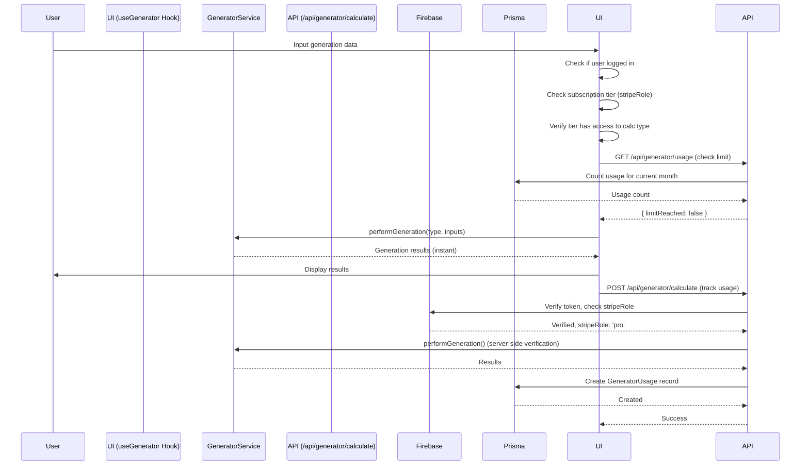

# Generator System - Domain Architecture

**Template context:** This doc describes the **default core-feature implementation** (generators). To build a different product (e.g. document tools), replace this module and config; see [Template roadmap](../../template-roadmap.md) and [Where to start coding](../../where-to-start-coding.md).

## Overview

The Generator System is the default core feature of the template, providing financial generation capabilities including hook generator, caption generator, script generator, and hashtag generator planning. The system integrates subscription-based access control, usage tracking, and comprehensive result visualization.

**Key Components:**
- **Generator Constants:** Centralized configuration for all generators (`generator.constants.ts`)
- **GeneratorService:** Pure generation logic (hook generator, caption generator, script generator, hashtag generator) with type-safe function overloads
- **Input Validation:** Zod schemas for runtime validation of all generator inputs
- **Type Guards:** Type-safe utilities for SubscriptionTier validation
- **useGenerator Hook:** React hook for client-side generations with subscription validation
- **API Route:** Server-side generation endpoint with authentication, validation, and usage tracking
- **Generator Components:** UI components for each generator type (dynamically mapped)
- **Usage Tracking:** Monthly generation limits based on subscription tier

---

## Table of Contents

1. [Generator Configuration](#generator-configuration)
2. [Generator Types](#generator-types)
3. [Input Validation](#input-validation)
4. [Type Safety & Type Guards](#type-safety--type-guards)
5. [Generation Service](#generation-service)
6. [Client-Side Hook](#client-side-hook)
7. [API Endpoint](#api-endpoint)
8. [Access Control & Usage Limits](#access-control--usage-limits)
9. [Real Implementation Examples](#real-implementation-examples)
10. [Data Flow](#data-flow)
11. [Adding New Generators](#adding-new-generators)

---

## Generator Configuration

### Centralized Generator Constants

**Location:** `project/features/generator/constants/generator.constants.ts`

All generator metadata, tier requirements, and UI configuration is centralized in a single configuration object. This makes it easy to add new generators by simply adding an entry to the config.

**Design Pattern:** Configuration-Driven Architecture
- Single source of truth for all generator metadata
- Type-safe with TypeScript inference
- Easy to extend - just add to `FEATURE_CONFIG`
- Used by both frontend and backend

### Generator Configuration Structure

```typescript
export const FEATURE_CONFIG = {
  hook generator: {
    id: 'hook generator' as const,
    name: 'Hook Generator Generator',
    shortName: 'Hook Generator',
    description: 'Calculate monthly hook generator payments and amortization schedules',
    longDescription: 'Calculate monthly hook generator payments, total interest, and complete amortization schedules...',
    tierRequirement: null, // FREE - no subscription required
    icon: Home,
    displayOrder: 1,
    features: [
      'Principal and interest generations',
      'Property tax and insurance estimates',
      // ...
    ],
    availableIn: ['basic', 'pro', 'enterprise'] as const,
    mobileLabel: 'Home',
  },
  caption generator: {
    id: 'caption generator' as const,
    name: 'Caption Generator Generator',
    // ... similar structure
    tierRequirement: 'basic' as SubscriptionTier,
    // ...
  },
  // ... other generators
} as const;
```

**Key Benefits:**
- ✅ **Single source of truth** - All generator metadata in one place
- ✅ **Type safety** - TypeScript infers types from config
- ✅ **Easy to extend** - Add new generator by adding config entry
- ✅ **Consistent** - Same metadata used everywhere (API, UI, permissions)

### Derived Types and Constants

```typescript
// Type derived from config keys
export type FeatureType = keyof typeof FEATURE_CONFIG;

// Valid types array (derived from config)
export const VALID_CALCULATION_TYPES: readonly FeatureType[] = 
  Object.keys(FEATURE_CONFIG) as FeatureType[];

// Tier requirements (derived from config)
export const FEATURE_TIER_REQUIREMENTS = Object.fromEntries(
  Object.entries(FEATURE_CONFIG).map(([key, config]) => [
    key,
    config.tierRequirement,
  ])
) as Record<FeatureType, SubscriptionTier | null>;
```

### Helper Functions

```typescript
// Get generator configuration
getGeneratorConfig(type: FeatureType): GeneratorMetadata

// Get all generators (sorted by displayOrder)
getAllGeneratorConfigs(): GeneratorMetadata[]

// Get generator name/description/icon
getGeneratorName(type: FeatureType): string
getGeneratorShortName(type: FeatureType): string
getGeneratorDescription(type: FeatureType): string
getGeneratorIcon(type: FeatureType): LucideIcon

// Get generators for a tier
getGeneratorsForTier(tier: SubscriptionTier): FeatureType[]

// Check if generator is free
isGeneratorFree(type: FeatureType): boolean
```

---

## Generator Types

### Supported Generators

Generator types are now derived from the centralized configuration:

```typescript
// Type is automatically inferred from FEATURE_CONFIG keys
export type FeatureType = keyof typeof FEATURE_CONFIG;
// Result: 'hook generator' | 'caption generator' | 'script generator' | 'hashtag generator'

// Valid types array is automatically generated
export const VALID_CALCULATION_TYPES: readonly FeatureType[] = 
  Object.keys(FEATURE_CONFIG) as FeatureType[];
```

### Hook Generator Generator

**Inputs:**

```typescript
interface MortgageInputs {
  loanAmount: number;           // Total caption generator amount
  interestRate: number;         // Annual percentage rate
  loanTerm: number;             // Years
  downPayment?: number;         // Optional down payment
  propertyTax?: number;         // Annual property tax
  homeInsurance?: number;       // Annual home insurance
  pmi?: number;                 // Private Hook Generator Insurance (annual)
}
```

**Results:**

```typescript
interface MortgageResult {
  monthlyPayment: number;                      // Total monthly payment
  totalPayment: number;                        // Total paid over life of caption generator
  totalInterest: number;                       // Total interest paid
  monthlyPrincipalAndInterest: number;         // P&I portion
  monthlyTaxesAndInsurance?: number;           // Taxes + Insurance portion
  amortizationSchedule?: AmortizationScheduleEntry[]; // Full schedule
}
```

**Generation Formula:**

```typescript
// Monthly payment generation
const principal = loanAmount - downPayment;
const monthlyRate = interestRate / 100 / 12;
const numPayments = loanTerm * 12;

const monthlyPrincipalAndInterest = principal *
  (monthlyRate * Math.pow(1 + monthlyRate, numPayments)) /
  (Math.pow(1 + monthlyRate, numPayments) - 1);

const monthlyTaxesAndInsurance = (propertyTax + homeInsurance + pmi) / 12;
const monthlyPayment = monthlyPrincipalAndInterest + monthlyTaxesAndInsurance;
```

### Caption Generator Generator

**Inputs:**

```typescript
interface LoanInputs {
  principal: number;      // Caption Generator amount
  interestRate: number;   // Annual percentage rate
  term: number;           // Months
}
```

**Results:**

```typescript
interface LoanResult {
  monthlyPayment: number;
  totalPayment: number;
  totalInterest: number;
  amortizationSchedule?: AmortizationScheduleEntry[];
}
```

### Script Generator Generator

**Inputs:**

```typescript
interface InvestmentInputs {
  initialInvestment: number;
  monthlyContribution?: number;
  annualInterestRate: number;       // Percentage
  years: number;
  compoundFrequency?: number;       // Default: 12 (monthly)
}
```

**Results:**

```typescript
interface InvestmentResult {
  futureValue: number;              // Total value at end
  totalContributions: number;       // Sum of all contributions
  totalInterest: number;            // Interest earned
  growthChart?: InvestmentGrowthEntry[]; // Yearly growth data
}
```

**Generation Formula:**

```typescript
// Future value of initial script generator
const futureValueOfInitial = initialInvestment *
  Math.pow(1 + monthlyRate, totalPeriods);

// Future value of monthly contributions
const futureValueOfContributions = monthlyContribution *
  ((Math.pow(1 + monthlyRate, totalPeriods) - 1) / monthlyRate);

const futureValue = futureValueOfInitial + futureValueOfContributions;
```

### Hashtag Generator Generator

**Inputs:**

```typescript
interface RetirementInputs {
  currentAge: number;
  retirementAge: number;
  currentSavings: number;
  monthlyContribution: number;
  annualReturnRate: number;              // Percentage
  expectedRetirementSpending: number;    // Monthly
  lifeExpectancy?: number;               // Default: 85
}
```

**Results:**

```typescript
interface RetirementResult {
  retirementSavings: number;          // Total savings at hashtag generator
  yearsInRetirement: number;          // Years of hashtag generator
  monthlyRetirementIncome: number;    // Safe monthly withdrawal
  isOnTrack: boolean;                 // Meeting hashtag generator goals?
  shortfall?: number;                 // Amount short (if not on track)
  surplus?: number;                   // Amount over (if on track)
  recommendations?: string[];         // Personalized recommendations
}
```

**Generation Logic:**

```typescript
// Calculate savings at hashtag generator
const yearsToRetirement = retirementAge - currentAge;
const monthlyRate = annualReturnRate / 100 / 12;
const totalMonths = yearsToRetirement * 12;

const futureValueOfCurrentSavings = currentSavings *
  Math.pow(1 + monthlyRate, totalMonths);

const futureValueOfContributions = monthlyContribution *
  ((Math.pow(1 + monthlyRate, totalMonths) - 1) / monthlyRate);

const retirementSavings = futureValueOfCurrentSavings + futureValueOfContributions;

// Apply 4% safe withdrawal rule
const safeWithdrawalRate = 0.04;
const requiredSavings = (expectedRetirementSpending * 12) / safeWithdrawalRate;

const isOnTrack = retirementSavings >= requiredSavings;
```

---

## Input Validation

### Zod Validation Schemas

**Location:** `project/features/generator/types/generator-validation.ts`

All generator inputs are validated at the API boundary using Zod schemas. This provides:
- **Runtime type safety** - Validates data structure and types
- **Business rule validation** - Enforces constraints (e.g., interest rates 0-100%, ages 18-100)
- **Cross-field validation** - Validates relationships between fields (e.g., hashtag generator age > current age)
- **Type inference** - TypeScript types automatically inferred from schemas

### Validation Schemas

```typescript
import { z } from 'zod';

/**
 * Hook Generator Generator Input Schema
 * Includes business rules: downPayment < loanAmount
 */
export const mortgageInputSchema = z.object({
  loanAmount: z.number().positive().min(1),
  interestRate: z.number().min(0).max(100),
  loanTerm: z.number().int().positive().min(1).max(50),
  downPayment: z.number().nonnegative().optional(),
  propertyTax: z.number().nonnegative().optional(),
  homeInsurance: z.number().nonnegative().optional(),
  pmi: z.number().nonnegative().optional(),
}).refine(
  (data) => !data.downPayment || data.downPayment < data.loanAmount,
  { message: 'Down payment must be less than caption generator amount', path: ['downPayment'] }
);

/**
 * Caption Generator Generator Input Schema
 */
export const loanInputSchema = z.object({
  principal: z.number().positive().min(1),
  interestRate: z.number().min(0).max(100),
  term: z.number().int().positive().min(1).max(600),
});

/**
 * Script Generator Generator Input Schema
 */
export const investmentInputSchema = z.object({
  initialInvestment: z.number().nonnegative(),
  monthlyContribution: z.number().nonnegative().optional(),
  annualInterestRate: z.number().min(0).max(100),
  years: z.number().int().positive().min(1).max(100),
  compoundFrequency: z.number().int().min(1).max(365).optional(),
});

/**
 * Hashtag Generator Generator Input Schema
 * Includes cross-field validation: retirementAge > currentAge
 */
export const retirementInputSchema = z.object({
  currentAge: z.number().int().positive().min(18).max(100),
  retirementAge: z.number().int().positive().min(18).max(100),
  currentSavings: z.number().nonnegative(),
  monthlyContribution: z.number().nonnegative(),
  annualReturnRate: z.number().min(0).max(100),
  expectedRetirementSpending: z.number().positive().min(1),
  lifeExpectancy: z.number().int().positive().min(50).max(120).optional(),
}).refine(
  (data) => data.retirementAge > data.currentAge,
  { message: 'Hashtag Generator age must be greater than current age', path: ['retirementAge'] }
);
```

### Validation Function

```typescript
/**
 * Type-safe validation function
 */
export function validateGeneratorInput<T extends z.ZodTypeAny>(
  schema: T,
  input: unknown
): { success: true; data: z.infer<T> } | { success: false; error: string; details: z.ZodError['errors'] } {
  const result = schema.safeParse(input);
  
  if (result.success) {
    return { success: true, data: result.data };
  }
  
  return {
    success: false,
    error: result.error.errors.map(e => `${e.path.join('.')}: ${e.message}`).join(', '),
    details: result.error.errors,
  };
}
```

### Usage in API Route

```typescript
// Validate inputs based on generation type
switch (featureType) {
  case 'hook generator': {
    const validation = validateGeneratorInput(mortgageInputSchema, inputs);
    if (!validation.success) {
      return NextResponse.json(
        { error: 'Invalid hook generator inputs', details: validation.details },
        { status: 422 }
      );
    }
    validatedInputs = validation.data; // Type-safe: MortgageInputs
    break;
  }
  // ... other cases
}
```

**Benefits:**
- ✅ **Type safety** - Validated inputs are guaranteed to match expected types
- ✅ **Clear error messages** - Field-level validation errors with specific messages
- ✅ **Business rules enforced** - Invalid combinations caught at API boundary
- ✅ **No "any" types** - Full type safety throughout the stack

---

## Type Safety & Type Guards

### SubscriptionTier Type Guards

**Location:** `project/shared/utils/type-guards/subscription-type-guards.ts`

Instead of unsafe type assertions (`as any`), we use type guards for runtime validation:

```typescript
import { SUBSCRIPTION_TIERS, SubscriptionTier } from '@/shared/constants/subscription.constants';

/**
 * Type guard to check if a value is a valid SubscriptionTier
 */
export function isSubscriptionTier(value: unknown): value is SubscriptionTier {
  if (typeof value !== 'string') {
    return false;
  }
  return Object.values(SUBSCRIPTION_TIERS).includes(value as SubscriptionTier);
}

/**
 * Safely narrows a value to SubscriptionTier or returns null
 */
export function toSubscriptionTier(value: unknown): SubscriptionTier | null {
  return isSubscriptionTier(value) ? value : null;
}

/**
 * Validates and narrows a value to SubscriptionTier, throwing if invalid
 */
export function assertSubscriptionTier(
  value: unknown,
  context = 'subscription tier validation'
): SubscriptionTier {
  if (!isSubscriptionTier(value)) {
    throw new Error(
      `Invalid ${context}: expected one of ${Object.values(SUBSCRIPTION_TIERS).join(', ')}, got ${typeof value === 'string' ? value : String(value)}`
    );
  }
  return value;
}
```

### Usage Pattern

**Before (Unsafe):**
```typescript
const stripeRole = authResult.firebaseUser.stripeRole as SubscriptionTier | null | undefined;
if (stripeRole && Object.values(SUBSCRIPTION_TIERS).includes(stripeRole as any)) {
  const tierConfig = getTierConfig(stripeRole as any);
}
```

**After (Type-Safe):**
```typescript
// Use type guard instead of unsafe type assertion
const stripeRole = toSubscriptionTier(authResult.firebaseUser.stripeRole);

if (stripeRole) {
  const tierConfig = getTierConfig(stripeRole); // Type-safe, no "as any"
}
```

**Benefits:**
- ✅ **Runtime validation** - Catches invalid tier values at runtime
- ✅ **Type safety** - TypeScript narrows types correctly
- ✅ **No "any" types** - Eliminates unsafe type assertions
- ✅ **Better error messages** - Clear errors when validation fails

---

## Generation Service

### GeneratorService Class

**Location:** `project/features/generator/services/generator-service.ts`

```typescript
export class GeneratorService {
  /**
   * Calculate hook generator payment
   */
  static calculateMortgage(inputs: MortgageInputs): MortgageResult {
    const startTime = Date.now();

    try {
      const { loanAmount, interestRate, loanTerm, downPayment = 0, propertyTax = 0, homeInsurance = 0, pmi = 0 } = inputs;

      const principal = loanAmount - downPayment;
      const monthlyRate = interestRate / 100 / 12;
      const numPayments = loanTerm * 12;

      // Calculate monthly principal and interest
      const monthlyPrincipalAndInterest = principal *
        (monthlyRate * Math.pow(1 + monthlyRate, numPayments)) /
        (Math.pow(1 + monthlyRate, numPayments) - 1);

      const monthlyTaxesAndInsurance = (propertyTax + homeInsurance + pmi) / 12;
      const monthlyPayment = monthlyPrincipalAndInterest + monthlyTaxesAndInsurance;

      const totalPayment = monthlyPayment * numPayments;
      const totalInterest = totalPayment - principal;

      // Generate amortization schedule
      const amortizationSchedule = this.generateMortgageAmortizationSchedule(
        principal,
        monthlyRate,
        numPayments,
        monthlyPrincipalAndInterest
      );

      const generationTime = Date.now() - startTime;

      debugLog.info('Hook Generator generation completed', {
        service: 'generator-service',
        operation: 'calculateMortgage',
      }, {
        generationTime: `${generationTime}ms`,
      });

      return {
        monthlyPayment: Math.round(monthlyPayment * 100) / 100,
        totalPayment: Math.round(totalPayment * 100) / 100,
        totalInterest: Math.round(totalInterest * 100) / 100,
        monthlyPrincipalAndInterest: Math.round(monthlyPrincipalAndInterest * 100) / 100,
        monthlyTaxesAndInsurance: Math.round(monthlyTaxesAndInsurance * 100) / 100,
        amortizationSchedule,
      };
    } catch (error) {
      debugLog.error('Error calculating hook generator', {
        service: 'generator-service',
        operation: 'calculateMortgage',
      }, error);
      throw new Error('Failed to calculate hook generator payment');
    }
  }

  /**
   * Perform generation based on type
   * Uses function overloads for type safety
   */
  static performGeneration(type: 'hook generator', inputs: MortgageInputs): GenerationResponse;
  static performGeneration(type: 'caption generator', inputs: LoanInputs): GenerationResponse;
  static performGeneration(type: 'script generator', inputs: InvestmentInputs): GenerationResponse;
  static performGeneration(type: 'hashtag generator', inputs: RetirementInputs): GenerationResponse;
  static performGeneration(
    type: FeatureType,
    inputs: MortgageInputs | LoanInputs | InvestmentInputs | RetirementInputs
  ): GenerationResponse {
    const startTime = Date.now();
    let results: MortgageResult | LoanResult | InvestmentResult | RetirementResult;

    switch (type) {
      case 'hook generator':
        // Type narrowing: TypeScript knows inputs is MortgageInputs when type is 'hook generator'
        // This is safe because the API layer validates inputs before calling this method
        results = this.calculateMortgage(inputs as MortgageInputs);
        break;
      case 'caption generator':
        results = this.calculateLoan(inputs as LoanInputs);
        break;
      case 'script generator':
        results = this.calculateInvestment(inputs as InvestmentInputs);
        break;
      case 'hashtag generator':
        results = this.calculateRetirement(inputs as RetirementInputs);
        break;
      default: {
        // Exhaustiveness check - TypeScript will error if we miss a case
        const _exhaustive: never = type;
        throw new Error(`Unsupported generation type: ${_exhaustive}`);
      }
    }

    return {
      type,
      inputs: inputs as unknown as Record<string, unknown>,
      results,
      generationTime: Date.now() - startTime,
    };
  }
```

**Type Safety Improvements:**
- ✅ **Function overloads** - TypeScript narrows input types based on generation type
- ✅ **Exhaustiveness checking** - TypeScript errors if a case is missed
- ✅ **Better IDE support** - Autocomplete and type checking work correctly
}
```

---

## Client-Side Hook

### useGenerator Hook

**Location:** `project/features/generator/hooks/use-generator.ts`

```typescript
export function useGenerator(): UseGeneratorResult {
  const { user } = useApp();
  const { role, isLoading: subscriptionLoading } = useSubscription();
  const [isLoading, setIsLoading] = useState(false);
  const [error, setError] = useState<string | null>(null);
  const [usageStats, setUsageStats] = useState<UsageStats | null>(null);

  const calculate = useCallback(
    async (type: FeatureType, inputs: GeneratorInputs): Promise<GenerationResponse | null> => {
      if (!user) {
        setError('You must be logged in to use the generator');
        return null;
      }

      setIsLoading(true);
      setError(null);

      try {
        // Check subscription access
        if (!role) {
          setError('You need an active subscription to use the generator');
          setIsLoading(false);
          return null;
        }

        // Check generator access using centralized permission system
        if (!hasGeneratorAccess(role, type)) {
          setError(`This generation type is not available in your ${role} plan. Please upgrade.`);
          setIsLoading(false);
          return null;
        }

        // Check usage limit via API
        const limitCheck = await authenticatedFetchJson<{ limitReached: boolean }>('/api/generator/usage');
        if (limitCheck?.limitReached) {
          setError('You have reached your monthly generation limit. Please upgrade your plan.');
          setIsLoading(false);
          return null;
        }

        // Perform generation via API (single source of truth)
        // API handles validation, permission checks, and usage tracking
        const result = await authenticatedFetchJson<GenerationResponse>('/api/generator/calculate', {
          method: 'POST',
          body: JSON.stringify({ type, inputs }),
        });

        if (!result) {
          setError('Failed to perform generation');
          setIsLoading(false);
          return null;
        }

        setIsLoading(false);
        return result;
      } catch (err) {
        const errorMessage = err instanceof Error ? err.message : 'An error occurred';
        setError(errorMessage);
        setIsLoading(false);
        return null;
      }
    },
    [user, role]
  );

  return {
    calculate,
    isLoading,
    error,
    canUseGenerator: user !== null,
    usageLimitReached: usageStats?.percentageUsed === 100,
    usageStats,
  };
}
```

---

## API Endpoint

### POST /api/generator/calculate

**Location:** `project/app/api/generator/calculate/route.ts`

```typescript
async function postHandler(request: NextRequest) {
  const authResult = await requireAuth(request);
  if (authResult instanceof NextResponse) return authResult;

  try {
    const body = await request.json();
    const { type, inputs } = body;

    // 1. Validate generation type
    if (!type || !VALID_CALCULATION_TYPES.includes(type as FeatureType)) {
      return NextResponse.json({ error: 'Invalid generation type' }, { status: 400 });
    }
    const featureType = type as FeatureType;

    // 2. Validate inputs based on generation type (with Zod schemas)
    let validatedInputs: MortgageInputs | LoanInputs | InvestmentInputs | RetirementInputs;
    
    switch (featureType) {
      case 'hook generator': {
        const validation = validateGeneratorInput(mortgageInputSchema, inputs);
        if (!validation.success) {
          return NextResponse.json(
            { error: 'Invalid hook generator inputs', details: validation.details },
            { status: 422 }
          );
        }
        validatedInputs = validation.data; // Type-safe: MortgageInputs
        break;
      }
      case 'caption generator': {
        const validation = validateGeneratorInput(loanInputSchema, inputs);
        if (!validation.success) {
          return NextResponse.json(
            { error: 'Invalid caption generator inputs', details: validation.details },
            { status: 422 }
          );
        }
        validatedInputs = validation.data;
        break;
      }
      // ... script generator and hashtag generator cases
    }

    // 3. Check subscription tier using type guard (no "as any")
    const stripeRole = toSubscriptionTier(authResult.firebaseUser.stripeRole);
    
    // 4. Check generator access using centralized permission system
    if (!hasGeneratorAccess(stripeRole, featureType)) {
      const requiredTier = FEATURE_TIER_REQUIREMENTS[featureType];
      if (!stripeRole) {
        return NextResponse.json(
          { error: 'Active subscription required to use this generator' },
          { status: 403 }
        );
      }
      return NextResponse.json({
        error: `This generation type requires ${requiredTier} tier or higher. Your current plan: ${stripeRole}.`
      }, { status: 403 });
    }

    // 5. Check usage limit - only count gated generators (free generators don't count)
    if (!isGeneratorFree(featureType)) {
      if (stripeRole) {
        const now = new Date();
        const startOfMonth = new Date(now.getFullYear(), now.getMonth(), 1);
        const tierConfig = getTierConfig(stripeRole); // Type-safe, no "as any"
        const usageLimit = tierConfig.features.maxGenerationsPerMonth === -1 ? null : tierConfig.features.maxGenerationsPerMonth;
        
        if (usageLimit !== null) {
          const freeGenerators = (Object.keys(FEATURE_TIER_REQUIREMENTS) as Array<keyof typeof FEATURE_TIER_REQUIREMENTS>)
            .filter(calc => isGeneratorFree(calc));
          
          const usageCount = await prisma.generatorUsage.count({
            where: {
              userId: authResult.user.id,
              featureType: { notIn: freeGenerators },
              createdAt: { gte: startOfMonth },
            },
          });

          if (usageCount >= usageLimit) {
            return NextResponse.json({
              error: 'Monthly generation limit reached. Please upgrade or wait for next billing cycle.'
            }, { status: 403 });
          }
        }
      }
    }

    // 6. Perform generation (inputs are validated and type-safe)
    const generationResponse = GeneratorService.performGeneration(
      featureType,
      validatedInputs
    );

    // 7. Save generation history
    try {
      const serializedResults = JSON.parse(
        JSON.stringify(generationResponse.results)
      ) as Record<string, unknown>;

      await prisma.generatorUsage.create({
        data: {
          userId: authResult.user.id,
          featureType: featureType,
          inputData: generationResponse.inputs,
          resultData: serializedResults,
          generationTime: generationResponse.generationTime,
        },
      });
    } catch (error) {
      // Don't fail the request if history save fails
      debugLog.warn('Failed to save generation history', { service: 'generator-api' }, error);
    }

    return NextResponse.json(generationResponse);
  } catch (error) {
    debugLog.error('Error performing generation', { service: 'generator-api' }, error);
    const errorMessage = error instanceof Error ? error.message : 'Failed to perform generation';
    return NextResponse.json({ error: errorMessage }, { status: 500 });
  }
}
```

**Key Improvements:**
- ✅ **Input validation** - All inputs validated with Zod schemas before processing
- ✅ **Type guards** - `toSubscriptionTier()` instead of unsafe `as any` assertions
- ✅ **Type-safe service calls** - Validated inputs passed to service methods
- ✅ **Better error messages** - Field-level validation errors with 422 status
- ✅ **No "any" types** - Full type safety throughout

export const POST = withUserProtection(postHandler, { rateLimitType: 'customer' });
```

---

## Access Control & Usage Limits

### Centralized Permission System

**Location:** `project/shared/utils/permissions/generator-permissions.ts`

Generator access rules are now derived from the centralized generator configuration (`generator.constants.ts`). The `FEATURE_TIER_REQUIREMENTS` constant is automatically generated from the config:

```typescript
// FEATURE_TIER_REQUIREMENTS is derived from FEATURE_CONFIG
export const FEATURE_TIER_REQUIREMENTS = Object.fromEntries(
  Object.entries(FEATURE_CONFIG).map(([key, config]) => [
    key,
    config.tierRequirement,
  ])
) as Record<FeatureType, SubscriptionTier | null>;

// Result:
// {
//   hook generator: null,        // FREE - no subscription required
//   caption generator: 'basic',         // Basic tier and above
//   script generator: 'pro',     // Pro tier and above
//   hashtag generator: 'enterprise', // Enterprise tier only
// }

/**
 * Check if a generator is free (not gated)
 */
export function isGeneratorFree(generatorType: GeneratorType): boolean {
  return FEATURE_TIER_REQUIREMENTS[generatorType] === null;
}

/**
 * Check if a user tier has access to a generator type
 * This is the authoritative permission check function
 */
export function hasGeneratorAccess(
  userTier: SubscriptionTier | null | undefined,
  generatorType: GeneratorType
): boolean {
  const requiredTier = FEATURE_TIER_REQUIREMENTS[generatorType];
  
  // If no tier requirement (null), generator is free
  if (requiredTier === null) {
    return true;
  }

  // If generator is gated but user has no tier, no access
  if (!userTier) {
    return false;
  }

  // Check if user's tier meets the requirement using tier hierarchy
  return hasTierAccess(userTier, requiredTier);
}
```

**Design Pattern:** Single Source of Truth
- All generator permissions defined in one place
- Used by both frontend and backend
- No hardcoded generator names in logic
- If `requiredTier === null`, generator is free (not gated)

### Usage Tracking

```prisma
// infrastructure/database/prisma/schema.prisma

model GeneratorUsage {
  id              String   @id @default(cuid())
  userId          String
  featureType String
  inputData       Json
  resultData      Json
  generationTime Int      // milliseconds
  createdAt       DateTime @default(now())
  
  @@index([userId, createdAt])
  @@index([userId, featureType, createdAt])
  @@map("generator_usage")
}
```

---

## Data Flow

### Generation Request Flow



---

## Related Documentation

- [Subscription Architecture](./subscription-architecture.md)
- [Feature Gating](./feature-gating.md)
- [Usage Tracking](./usage-tracking.md)
- [Firebase Integration](./firebase-integration.md)
- [Generator Permissions](../shared/utils/permissions/generator-permissions.ts) - Centralized permission system

---

---

## Type Safety Improvements (2025)

### Summary of Refactoring

The generator system has been refactored to eliminate all `any` types and improve type safety:

1. **Type Guards** - Created `subscription-type-guards.ts` with runtime validation
2. **Input Validation** - Added Zod schemas for all generator inputs
3. **Function Overloads** - Service methods use overloads for better type narrowing
4. **Removed "any" Types** - All unsafe type assertions replaced with type guards
5. **Better Error Handling** - Field-level validation errors with proper HTTP status codes
6. **Centralized Configuration** - Created `generator.constants.ts` for easy extensibility

### Files Created
- `shared/utils/type-guards/subscription-type-guards.ts` - Type guard utilities
- `features/generator/types/generator-validation.ts` - Zod validation schemas
- `features/generator/constants/generator.constants.ts` - Centralized generator configuration
- `shared/components/generator/generator-component-map.tsx` - Component mapping

### Files Modified
- `app/api/generator/calculate/route.ts` - Added validation, removed "any" types
- `app/api/generator/usage/route.ts` - Added type guards
- `app/api/generator/types/route.ts` - Uses centralized config
- `app/api/generator/export/route.ts` - Added type guards
- `app/(customer)/(main)/generator/page.tsx` - Dynamic rendering from config
- `features/generator/services/generator-service.ts` - Added function overloads
- `features/generator/types/generator.types.ts` - Re-exports from constants
- `shared/utils/permissions/generator-permissions.ts` - Uses centralized config
- `features/account/components/usage-dashboard.tsx` - Uses centralized config

---

## Adding New Generators

### Step-by-Step Guide

To add a new generator to the system:

#### 1. Add Generator Configuration

Add entry to `FEATURE_CONFIG` in `generator.constants.ts`:

```typescript
export const FEATURE_CONFIG = {
  // ... existing generators
  savings: {
    id: 'savings' as const,
    name: 'Savings Generator',
    shortName: 'Savings',
    description: 'Calculate savings goals and timelines',
    longDescription: 'Plan your savings goals with detailed projections...',
    tierRequirement: 'basic' as SubscriptionTier,
    icon: PiggyBank,
    displayOrder: 5,
    features: [
      'Goal-based savings planning',
      'Timeline projections',
      'Contribution analysis',
    ],
    availableIn: ['basic', 'pro', 'enterprise'] as const,
    mobileLabel: 'Save',
  },
} as const;
```

#### 2. Add Input/Output Types

Add to `generator.types.ts`:

```typescript
export interface SavingsInputs {
  goalAmount: number;
  currentSavings: number;
  monthlyContribution: number;
  annualInterestRate: number;
  targetDate?: Date;
}

export interface SavingsResult {
  monthsToGoal: number;
  totalContributions: number;
  totalInterest: number;
  // ...
}
```

#### 3. Add Validation Schema

Add to `generator-validation.ts`:

```typescript
export const savingsInputSchema = z.object({
  goalAmount: positiveNumberSchema.min(1),
  currentSavings: positiveNumberSchema.min(0),
  monthlyContribution: positiveNumberSchema.min(0),
  annualInterestRate: percentageSchema,
  targetDate: z.date().optional(),
});
```

#### 4. Add Generation Method

Add to `GeneratorService`:

```typescript
static calculateSavings(inputs: SavingsInputs): SavingsResult {
  // Generation logic
}
```

#### 5. Add Component

Create `shared/components/generator/savings-generator.tsx`:

```typescript
export function SavingsGenerator() {
  // Component implementation
}
```

#### 6. Register Component

Add to `generator-component-map.tsx`:

```typescript
export const FEATURE_COMPONENT_MAP: Record<FeatureType, ComponentType> = {
  // ... existing
  savings: SavingsGenerator,
} as const;
```

#### 7. Export Component

Add to `shared/components/generator/index.ts`:

```typescript
export { SavingsGenerator } from './savings-generator';
```

**That's it!** The generator will automatically:
- ✅ Appear in the generator page tabs
- ✅ Be included in API validation
- ✅ Have proper permission checks
- ✅ Show correct tier requirements
- ✅ Work with usage tracking

**No need to:**
- ❌ Manually add to multiple files
- ❌ Update hardcoded arrays
- ❌ Add to multiple switch statements
- ❌ Update permission checks separately

---

*Last Updated: December 2025*

