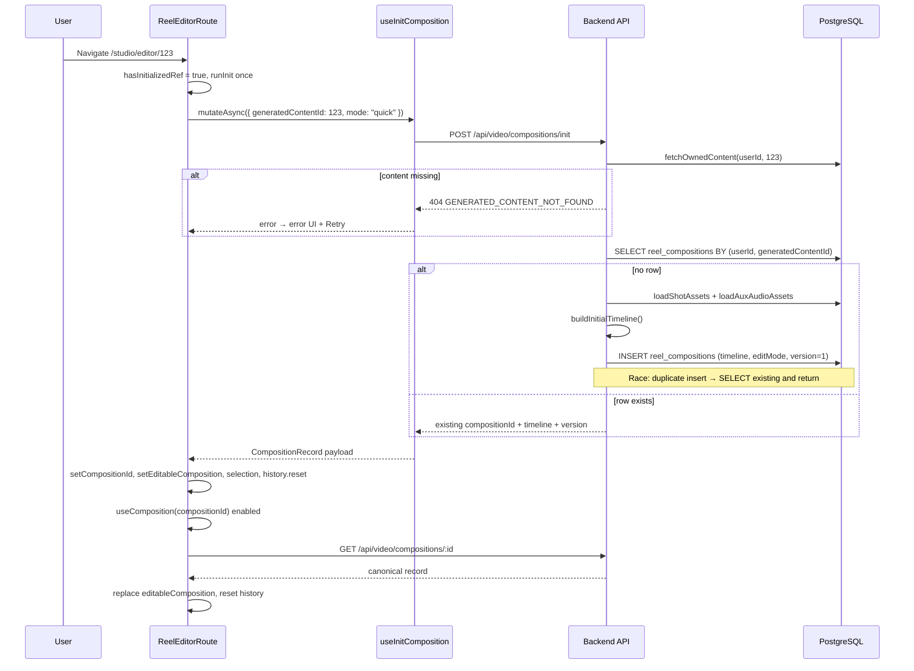
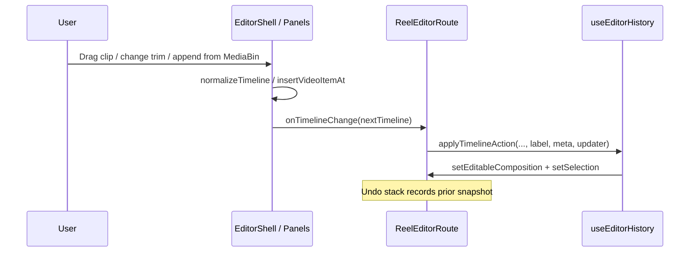
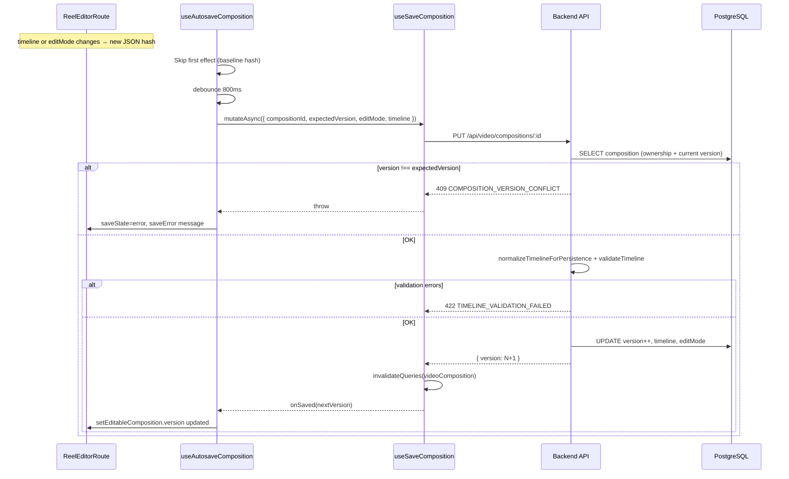
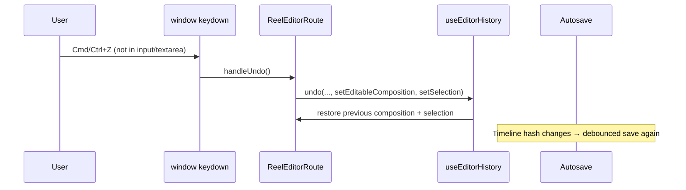
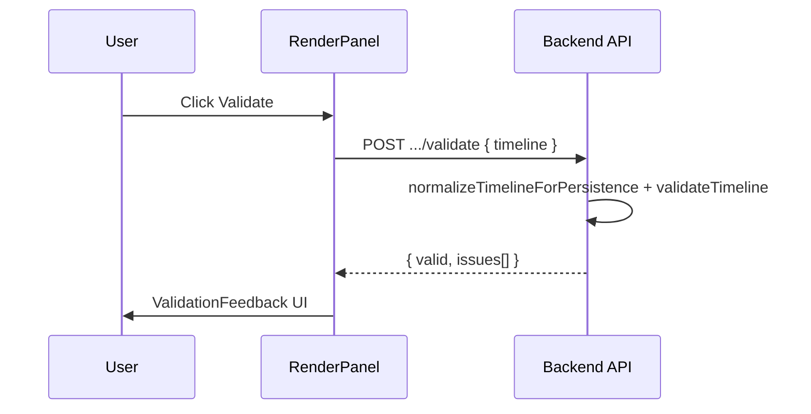
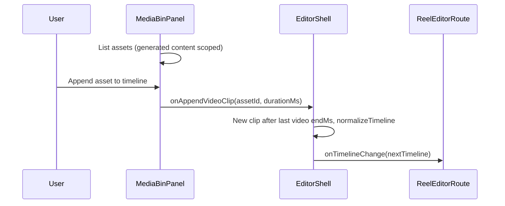

# Manual Reel Editor (Composition Editor)

## Purpose

The **manual editor** is the in-app timeline workspace where users refine a **generated content** item (reel draft) after AI video assembly: reorder/trim clips, add text overlays, adjust audio-related timeline state, validate, and **render** a new assembled video. It is **not** a separate product name in code—the implementation is centered on **compositions** (`reel_compositions` in PostgreSQL) and the route **`/studio/editor/:generatedContentId`**.

---

## How setup works (end-to-end)

### 1. Entry points

| Entry | Behavior |
|-------|----------|
| **`/studio/editor`** | Lists recent generation history; each card links to `/studio/editor/{id}`. |
| **Direct URL** | `/studio/editor/$generatedContentId` with a numeric draft ID. |
| **Auth** | Entire editor subtree uses `AuthGuard authType="user"`. |

### 2. Server-side composition record

- **One composition per `(userId, generatedContentId)`** — enforced by lookup before insert.
- **First visit:** `POST /api/video/compositions/init` verifies the user owns `generated_content`, loads **video_clip** assets (and optional voiceover/music) for that draft, builds a **timeline** (`buildInitialTimeline`), inserts **`reel_compositions`** with `editMode` from the request (default `quick`), `version: 1`.
- **Return visit:** Same init endpoint returns the **existing** row (no duplicate timeline build).

### 3. Client-side setup (`ReelEditorRoute`)

On mount (valid ID):

1. **`useInitComposition`** → `POST .../init` with `{ generatedContentId, mode: "quick" }`.
2. On success: set `compositionId`, **`editableComposition`** from payload (immediate paint), **selection** (first video clip), **`useEditorHistory().resetHistory()`**.
3. **`useComposition(compositionId)`** runs in parallel; when GET completes, **replaces** local state with server truth and **resets history again** (server is source of truth after refetch).

### 4. UI shell (`EditorShell`)

Three-column layout (desktop):

| Column | Responsibility |
|--------|----------------|
| **Left** | `MediaBinPanel` — assets for this draft; append or insert clips onto the video track. |
| **Center** | `PreviewPanel` — playback preview + timeline interactions tied to `onTimelineChange`. |
| **Right** | `QuickToolsPlaceholder` — clip/text tooling (behavior differs by **quick** vs **precision**); `RenderPanel` — validate, render, job status, version history. |

**Edit modes:** `quick` | `precision`. On **mobile**, the shell forces **quick** for tooling (`effectiveMode`) even if the user previously chose precision (precision UI is desktop-oriented).

---

## Core data model (conceptual)

- **`Timeline`**: `schemaVersion`, `fps`, `durationMs`, `tracks.video | audio | text | captions`.
- **Video items**: `id`, `assetId`, `startMs`/`endMs`, trims, optional transitions.
- **`version`**: optimistic concurrency; every successful **PUT** increments it.
- **`editMode`**: persisted with the composition; included in autosave payload.

---

**API nuance:** `POST .../init` returns the mode field as **`mode`** (same value as `editMode` in DB). `GET .../:compositionId` returns **`editMode`**. The client defaults missing `editMode` to **`quick`** until GET hydrates.

---

## API surface (manual editor)

| Method | Path | Role |
|--------|------|------|
| `POST` | `/api/video/compositions/init` | Create or return composition for a draft. |
| `GET` | `/api/video/compositions/:compositionId` | Fresh read (refetch / cache). |
| `PUT` | `/api/video/compositions/:compositionId` | Save timeline + editMode (`expectedVersion` required). |
| `POST` | `/api/video/compositions/:compositionId/validate` | Validate timeline without saving (RenderPanel “Validate”). |
| `POST` | `/api/video/compositions/:compositionId/render` | Queue **composition_render** job (expectedVersion must match DB). |
| `GET` | `/api/video/composition-jobs/:jobId` | Poll render job status/progress/result. |
| `GET` | `/api/video/compositions/:compositionId/versions` | List rendered **assembled_video** assets. |

---

## Sequence diagrams

### A. Opening the editor (first time for this draft)



### B. Opening the editor (composition already exists)

Same as above from the client’s perspective; the **init** branch skips `buildInitialTimeline` and returns the stored row immediately, then **GET** still runs to align React Query cache and local state.

### C. Editing the timeline (UI → local state → history)



### D. Autosave (debounced PUT)



**Important:** Autosave sends the **current `expectedVersion`** from `editableComposition`. After a successful save, the route bumps **local** `version` so the next autosave uses the new expected version. If two tabs fight, one gets **409** and shows **save error**.

### E. Undo / redo (keyboard)



Delete (Backspace/Delete) and split (**S**) similarly go through `applyTimelineAction` with keyboard `source` metadata.

### F. Explicit validate (no persist)



### G. Render pipeline

```mermaid
sequenceDiagram
    participant User
    participant RenderPanel
    participant API as Backend API
    participant Redis as Redis
    participant Queue as Job queue
    participant Worker as runCompositionRender
    participant Poll as useCompositionJob

    User->>RenderPanel: Click Render now
    RenderPanel->>API: POST .../render { expectedVersion, outputPreset, includeCaptions }
    API->>API: version match + validateTimeline(current DB timeline)
    Note over API: Render uses **persisted** composition; user should save first
    API->>Redis: lock key phase5_render:compositionId:version
    alt job already queued/running for that version
        API-->>RenderPanel: 202 same jobId
    else new job
        API->>Queue: createJob composition_render + enqueue
        API-->>RenderPanel: { jobId, status }
    end
    RenderPanel->>RenderPanel: setCurrentJobId(jobId)
    loop poll
        Poll->>API: GET /api/video/composition-jobs/:jobId
        API-->>Poll: status, progress, result (video URL when completed)
    end
```

**Contract detail:** Render validates the **database** timeline for that `expectedVersion`, not necessarily unsaved local edits. The UI should autosave before render; version mismatch returns **409**.

### H. Media bin: append clip



Insert-at-index uses `insertVideoItemAt` with the same downstream flow.

---

## Failure and edge cases

| Situation | Behavior |
|-----------|----------|
| Invalid draft ID (non-numeric, ≤0) | Error copy; no init. |
| Init fails | Error panel + **Retry** (resets `hasInitializedRef`, clears state, re-init). |
| Save version conflict | Autosave **error** state; user may refresh to reload server version. |
| Timeline validation on save | **422**; autosave error message from API. |
| Duplicate init (race) | Backend catches insert conflict and returns existing row. |
| Render while another job active for same lock | API returns existing **queued/running** job (202). |

---

## Key source files

| Layer | Path |
|-------|------|
| Route | `frontend/src/routes/studio/editor.tsx`, `editor.$generatedContentId.tsx` |
| Shell / panels | `frontend/src/features/video/components/editor/*.tsx` |
| Hooks | `use-init-composition`, `use-composition`, `use-autosave-composition`, `use-save-composition`, `use-editor-history`, `use-trigger-render`, `use-composition-job`, `use-validate-timeline` |
| Timeline utils | `frontend/src/features/video/utils/timeline-utils.ts` |
| API | `backend/src/routes/video/index.ts` (composition routes + `buildInitialTimeline`) |
| Persistence | `reel_compositions` in Drizzle schema |

---

## Related docs

- **[Studio system](./studio-system.md)** — broader Studio workspace (discover, generate, queue); editor is reachable from Studio nav and draft picker.
- **[ContentAI video playback deep dive](./contentai-video-playback-technical-deep-dive.md)** — playback and assets where relevant.

---

*Last updated: March 2026*
