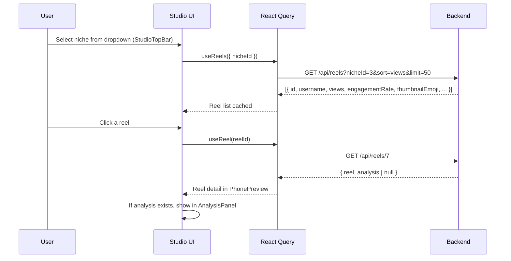
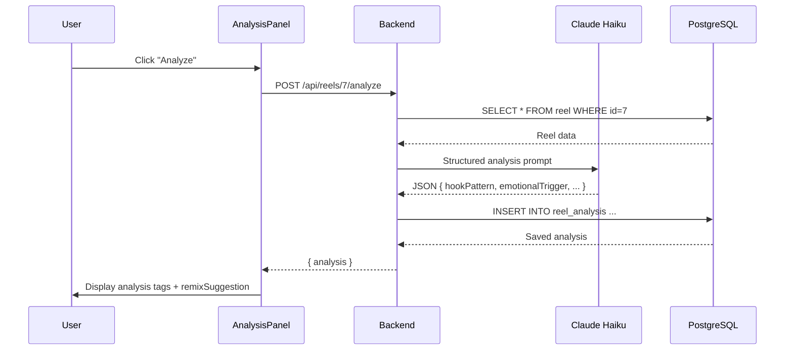
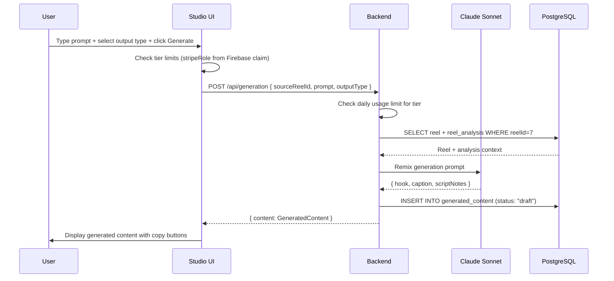
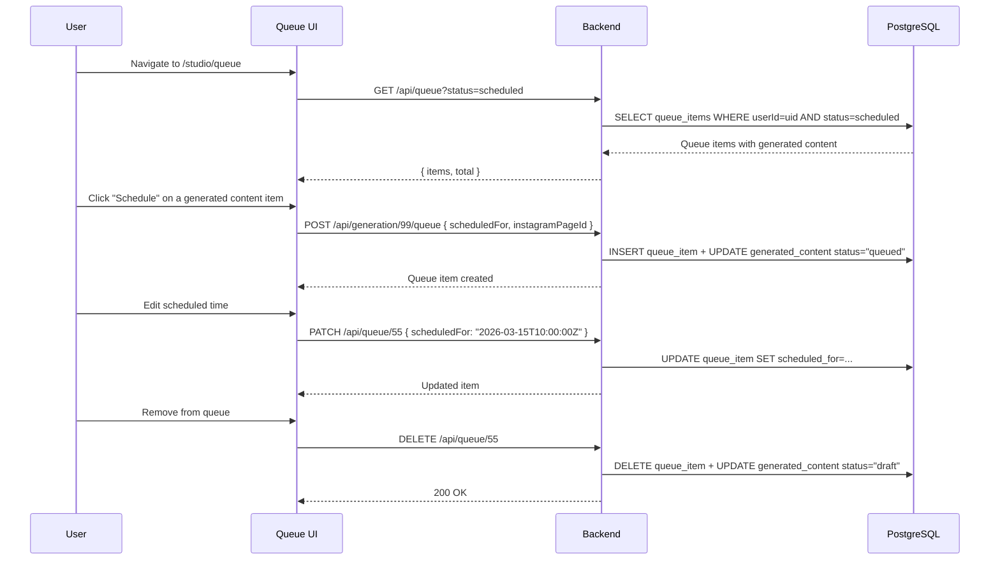
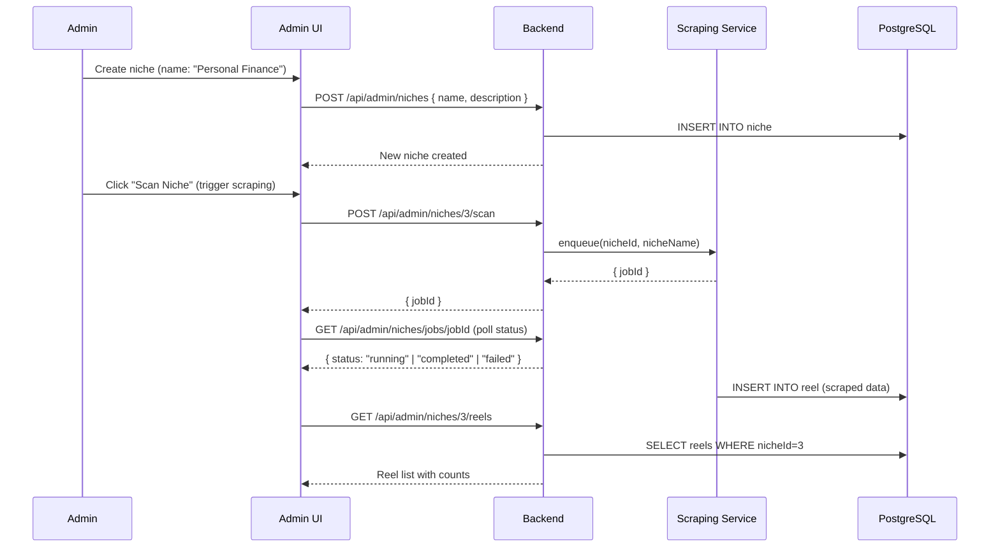

# Studio System Architecture

## Overview

The ReelStudio workspace is the core product experience. It provides four integrated workflows:

1. **Discover** — Browse viral reels filtered by niche
2. **Analyze** — AI breakdown of why a reel performs
3. **Generate** — AI remix of hooks, captions, and scripts
4. **Queue** — Schedule generated content to Instagram

The Studio runs at `/studio/*` and is a protected (authenticated) workspace with its own dark-theme shell, completely separate from the public/customer route groups.

---

## System Architecture

```
Frontend: /studio routes (TanStack Router)
  ├── /studio          → redirect to /studio/discover
  ├── /studio/discover → 3-panel workspace (ReelList + PhonePreview + AnalysisPanel)
  ├── /studio/generate → Full-screen generation workspace
  └── /studio/queue    → Content queue management

             ↓ HTTPS + Firebase Auth

Backend: Hono API
  ├── GET  /api/reels                   → Reel discovery
  ├── GET  /api/reels/:id               → Reel detail + analysis
  ├── POST /api/reels/:id/analyze       → AI analysis (Claude Haiku)
  ├── POST /api/generation              → Content generation (Claude Sonnet)
  ├── GET  /api/generation              → Generation history
  ├── POST /api/generation/:id/queue    → Add to queue
  ├── GET  /api/queue                   → Queue list
  ├── PATCH /api/queue/:id              → Update queue item
  └── DELETE /api/queue/:id            → Remove from queue

             ↓

PostgreSQL (Drizzle)
  niche → reel → reel_analysis → generated_content → queue_item

             ↓ AI

Claude Haiku  → reel analysis
Claude Sonnet → content generation
```

---

## Frontend Components

### Route Structure

```
frontend/src/routes/studio/
├── index.tsx          → redirect to discover
├── discover.tsx       → 3-panel discovery workspace
├── generate.tsx       → full-screen generation page
└── queue.tsx          → queue management page
```

All studio routes are wrapped with `<AuthGuard authType="user">`.

### Feature Structure

```
frontend/src/features/
├── reels/
│   ├── components/
│   │   ├── ReelList.tsx          → Sidebar: reel cards with metrics
│   │   ├── PhonePreview.tsx      → Center: phone mockup with stats
│   │   └── AnalysisPanel.tsx     → Right: Analysis/Generate/History tabs
│   ├── hooks/
│   │   ├── use-reels.ts          → Fetch reel list (React Query)
│   │   └── use-reel-analysis.ts  → Fetch/trigger analysis
│   └── services/
│       └── reels.service.ts      → API calls for reel endpoints
│
├── generation/
│   ├── hooks/
│   │   ├── use-generate-content.ts    → POST /api/generation mutation
│   │   └── use-generation-history.ts  → GET /api/generation query
│   └── services/
│       └── generation.service.ts
│
└── studio/
    ├── components/
    │   └── StudioTopBar.tsx      → Navigation bar (Discover/Generate/Queue)
    └── layout.tsx                → Studio shell (dark theme, no PageLayout)
```

---

## Core Components

### 1. Reel Discovery

**Purpose:** Surface top-performing reels for a given niche.

**Layout:** 3-panel interface
- **Left panel** (`ReelList`): Scrollable list of reel cards showing username, views, engagement rate, and thumbnail emoji
- **Center panel** (`PhonePreview`): Phone mockup displaying the selected reel with floating stat cards (views, likes, comments)
- **Right panel** (`AnalysisPanel`): Tabs — Analysis | Generate | History

**Data Flow:**



**Backend endpoint:**
```
GET /api/reels
  Query: nicheId, limit, offset, minViews, sort (views|engagementRate|createdAt)
  Auth: user
  Response: { items: Reel[], total: number }

GET /api/reels/:id
  Auth: user
  Response: { reel: Reel, analysis: ReelAnalysis | null }
```

---

### 2. AI Analysis System

**Purpose:** Deconstruct why a reel is viral using Claude Haiku.

**UI:** When user clicks "Analyze this reel" in `AnalysisPanel`, triggers the analysis and shows the results in tag/badge format.

**Analysis tags displayed:**
- Hook Pattern (e.g., "Bold claim opener")
- Emotional Trigger (e.g., "Fear of missing out")
- Format Pattern (e.g., "Talking head")
- CTA Type (e.g., "Follow")
- Caption Framework
- Curiosity Gap Style
- Remix Suggestion

**Data Flow:**



---

### 3. Content Generation System

**Purpose:** Generate original content inspired by a reel's AI analysis.

**UI:**
- Quick generation panel within `AnalysisPanel` (Generate tab)
- Full-screen `/studio/generate` page for detailed work

**Output types:**
- `"hook"` — 5 hook variations in different styles
- `"caption"` — Full caption (hook + body + CTA)
- `"full"` — Hook variations + caption + script notes

**Data Flow:**



**Feature gating:**

| Tier | Daily Generations |
|------|-----------------|
| Free | 1 |
| Basic | 10 |
| Pro | 50 |
| Enterprise | Unlimited |

Limit enforced server-side. Client shows `UpgradePrompt` component when `429` is returned.

---

### 4. Content Queue System

**Purpose:** Schedule generated content to Instagram pages.

**UI:** `/studio/queue` page with status-based filters and a scheduling date picker.

**Queue States:**
| State | Meaning |
|-------|---------|
| `scheduled` | Waiting to be published |
| `posted` | Successfully published |
| `failed` | Publishing failed (errorMessage stored) |

**Data Flow:**



---

## Navigation Pattern

```
StudioTopBar
├── Logo / Home
├── [Discover]   ← /studio/discover (default)
├── [✦ Generate] ← /studio/generate
└── [Queue]      ← /studio/queue
```

The Studio shell does **not** use the global `PageLayout` component. It has its own dark-themed layout with the `StudioTopBar` fixed at the top.

---

## Authentication Model

| Route | Guard | Redirect if unauthenticated |
|-------|-------|----------------------------|
| `/studio/*` | `AuthGuard authType="user"` | `/sign-in` |
| `/admin/*` | `AuthGuard authType="admin"` | `/sign-in` |

---

## Admin: Niche Management

Niches (the content categories driving discovery) are managed by admins.

**Routes:** `GET/POST/PUT/DELETE /api/admin/niches`

**Admin Niche Flow:**



**Deduplication:** `POST /api/admin/niches/:id/dedupe` removes duplicate reels by `externalId`.

---

## Performance Considerations

### Frontend
- React Query caches reel lists, analyses, and generation history
- Analysis details lazily loaded only when a reel is selected
- Niche dropdown list is cached for 5 minutes (`staleTime: 300_000`)

### Backend
- Database indexes on `reels.nicheId`, `reels.views`, `reel_analyses.reelId`, `generated_content.userId`, `queue_items.userId + status`
- Redis rate limiting prevents AI endpoint abuse
- Claude Haiku used for analysis (cheaper, fast) vs Claude Sonnet for generation (higher quality)
- `scrapedAt` timestamp allows incremental scraping jobs

---

## Security Model

- All studio endpoints require Firebase JWT (`authMiddleware("user")`)
- All mutations require CSRF token (`csrfMiddleware()`)
- All data queries scoped to `userId` — cross-user access is structurally impossible
- Rate limiting applied per IP to all endpoints
- AI prompts include safety guidelines; `ANTHROPIC_API_KEY` absence causes 503 (not 500) to distinguish configuration from runtime errors

---

## Related Documentation

- [Generation System](./generation-system.md) — AI analysis and content generation details
- [API Architecture](../core/api.md) — Middleware patterns
- [Database](../core/database.md) — Drizzle schema and query patterns
- [Authentication](../core/authentication.md) — Auth guard and token flow
- [Admin Dashboard](./admin-dashboard.md) — Niche and reel management

---

*Last updated: March 2026*
