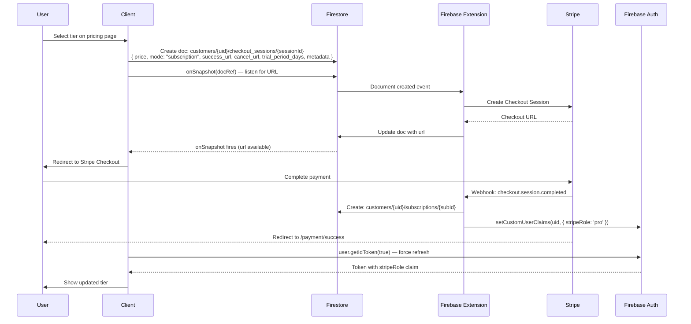
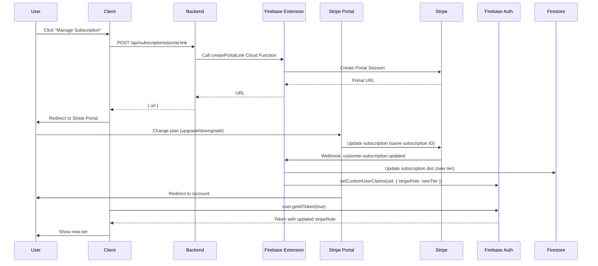
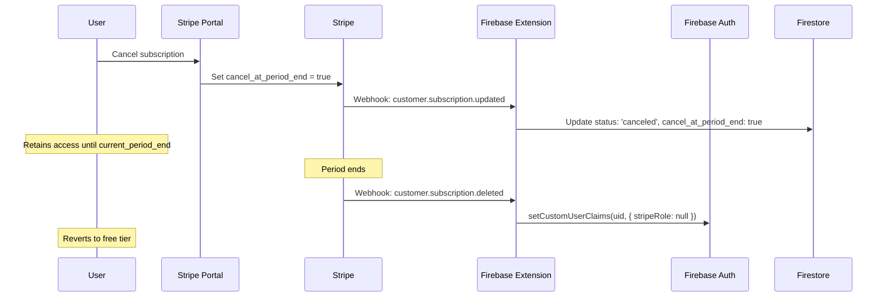

# Subscription System — Domain Architecture

## Overview

ReelStudio uses a dual-storage subscription architecture:

- **Subscriptions** → Firestore (managed by the Firebase Stripe Extension — handles all lifecycle events, webhooks, and custom claims automatically)
- **Orders** → PostgreSQL / Drizzle (one-time purchases, created manually)
- **Usage tracking** → PostgreSQL `feature_usage` table

**Key characteristics:**
- Firebase Stripe Extension processes all Stripe webhook events automatically
- Subscription tier surfaced as Firebase custom claim `stripeRole` (fast client-side reads)
- Trial eligibility tracked in PostgreSQL (`hasUsedFreeTrial` flag on `user` table)
- All plan changes go through the Stripe Customer Portal (no custom upgrade/downgrade UI)

---

## Table of Contents

1. [Architecture Overview](#architecture-overview)
2. [Subscription Tiers](#subscription-tiers)
3. [Subscription Lifecycle](#subscription-lifecycle)
4. [Firebase Stripe Extension](#firebase-stripe-extension)
5. [API Endpoints](#api-endpoints)
6. [Client-Side Integration](#client-side-integration)
7. [Access Control & Custom Claims](#access-control--custom-claims)
8. [Trial Eligibility](#trial-eligibility)
9. [Admin Management](#admin-management)
10. [Troubleshooting](#troubleshooting)

---

## Architecture Overview

```
┌──────────────────────────────────────────────────────────────┐
│                    Subscription System                        │
├──────────────────────────────────────────────────────────────┤
│                                                              │
│  FIRESTORE                                                   │
│  customers/{firebaseUid}/checkout_sessions/{sessionId}       │
│  customers/{firebaseUid}/subscriptions/{subscriptionId}      │
│                                                              │
│  FIREBASE AUTH (Custom Claims)                               │
│  stripeRole: 'basic' | 'pro' | 'enterprise'                  │
│                                                              │
│  POSTGRESQL (Drizzle)                                        │
│  user.hasUsedFreeTrial   ← trial eligibility                 │
│  feature_usage           ← generation usage counts          │
│                                                              │
└──────────────────────────────────────────────────────────────┘
```

### System Flow

```
User selects plan → Client creates Firestore checkout_session doc
    → Firebase Extension detects → Creates Stripe Checkout
    → Extension updates doc with URL → Client redirects user
    → User pays on Stripe
    → Stripe webhook → Firebase Extension
    → Extension creates Firestore subscription doc
    → Extension sets Firebase custom claim stripeRole
    → Client refreshes token → New tier visible in UI
```

---

## Subscription Tiers

### Tier Hierarchy

```
Enterprise ($100/mo or $1000/yr) — Unlimited generations, all features
    ↑
  Pro ($25/mo or $200/yr) — 50 generations/day, all content types
    ↑
 Basic ($10/mo or $100/yr) — 10 generations/day, core content types
    ↑
 Free — 1 generation/day (hook only)
```

### Stripe Price Configuration

**Location:** `backend/src/constants/stripe.constants.ts`

```typescript
export const STRIPE_MAP = {
  tiers: {
    basic: {
      productId: "prod_TWTXj1UeJcW6vz",
      prices: {
        monthly: { priceId: "price_1SZQa63qLZiOfTxsQZkBift7", amount: 10.0 },
        annual:  { priceId: "price_1SZQak3qLZiOfTxsM7kwhZwQ", amount: 100.0 },
      },
    },
    pro: {
      productId: "prod_TWTYPXmd7zh3kP",
      prices: {
        monthly: { priceId: "...", amount: 25.0 },
        annual:  { priceId: "...", amount: 200.0 },
      },
    },
    enterprise: {
      productId: "prod_TWTYPkmPHd8GF4",
      prices: {
        monthly: { priceId: "...", amount: 100.0 },
        annual:  { priceId: "...", amount: 1000.0 },
      },
    },
  },
};
```

---

## Subscription Lifecycle

### 1. New Subscription (Checkout Flow)



### 2. Plan Changes (Portal Only)

All subscription upgrades and downgrades go through the Stripe Customer Portal. The pricing page is only for creating new subscriptions.



### 3. Cancellation



---

## Firebase Stripe Extension

The `ext-firestore-stripe-payments` extension handles:

1. **Checkout creation** — Monitors `checkout_sessions`, creates Stripe sessions, writes back URL
2. **Subscription management** — Creates/updates Firestore subscription docs on webhook events
3. **Custom claims** — Sets `stripeRole` claim automatically from subscription tier metadata
4. **Webhook processing** — Processes all Stripe events (payment_intent, customer.subscription.*, invoice.*)

### Firestore Document Structure

**Checkout Session (input):**
```json
{
  "price": "price_xxx",
  "mode": "subscription",
  "success_url": "https://app.example.com/payment/success",
  "cancel_url": "https://app.example.com/payment/cancel",
  "trial_period_days": 14,
  "metadata": {
    "userId": "firebase-uid",
    "tier": "pro",
    "billingCycle": "monthly"
  }
}
```

**Subscription (written by Extension):**
```json
{
  "id": "sub_xxx",
  "status": "active",
  "current_period_start": 1741600000,
  "current_period_end": 1744192000,
  "metadata": { "tier": "pro", "billingCycle": "monthly" },
  "items": { "data": [{ "price": { "id": "price_xxx", "interval": "month" } }] }
}
```

---

## API Endpoints

### `GET /api/subscriptions/current`

Returns the user's active or trialing subscription from Firestore.

**Auth:** `authMiddleware("user")`

**Response:**
```json
{
  "subscription": {
    "id": "sub_xxx",
    "tier": "pro",
    "billingCycle": "monthly",
    "status": "active",
    "currentPeriodStart": "2026-03-01T00:00:00Z",
    "currentPeriodEnd": "2026-04-01T00:00:00Z"
  },
  "tier": "pro",
  "billingCycle": "monthly"
}
```

### `GET /api/subscriptions/trial-eligibility`

Checks if the user is eligible for a free trial.

**Logic:**
1. Check `user.hasUsedFreeTrial` in PostgreSQL
2. Check if user has an existing Firestore subscription

**Response:**
```json
{ "eligible": true }
```

### `POST /api/subscriptions/portal-link`

Creates a Stripe Customer Portal session URL for self-service subscription management.

**Auth:** `authMiddleware("user")`, `csrfMiddleware()`

**Response:**
```json
{ "url": "https://billing.stripe.com/p/session/xxx" }
```

### `GET /api/subscriptions/checkout` (or via client-side Firestore)

New subscriptions are created client-side by writing to Firestore directly, or through the backend checkout endpoint which wraps the same logic.

---

## Client-Side Integration

### `useSubscription` Hook

**Location:** `frontend/src/features/subscriptions/hooks/use-subscription.ts`

```typescript
const { role, hasBasicAccess, hasProAccess, hasEnterpriseAccess, isLoading } = useSubscription();
```

Reads `stripeRole` from Firebase JWT custom claims. Forces token refresh on mount to get latest tier.

### `FeatureGate` Component

```typescript
<FeatureGate requiredTier="pro" fallback={<UpgradePrompt />}>
  <ProFeatureComponent />
</FeatureGate>
```

Shows `fallback` (or upgrade prompt) if user's tier is below `requiredTier`.

### Subscription Status Types

```typescript
type SubscriptionStatus =
  | "active"         // Paid, billing normally
  | "trialing"       // In free trial
  | "canceled"       // Canceled, access until period end
  | "past_due"       // Payment failed, retrying
  | "incomplete"     // Initial payment failed
  | "incomplete_expired";  // Payment attempt expired
```

---

## Access Control & Custom Claims

### `stripeRole` Claim

Set automatically by Firebase Stripe Extension when subscription changes.

| Value | Meaning |
|-------|---------|
| `undefined` | Free tier |
| `"basic"` | Basic subscription |
| `"pro"` | Pro subscription |
| `"enterprise"` | Enterprise subscription |

### Reading Claims

**Client-side:**
```typescript
await user.getIdToken(true); // Force refresh
const result = await user.getIdTokenResult();
const stripeRole = result.claims.stripeRole; // "basic" | "pro" | "enterprise" | undefined
```

**Server-side (in route handler):**
```typescript
const { firebaseUser } = c.get("auth");
const stripeRole = firebaseUser.stripeRole; // From decoded JWT
```

### Tier Access Check

```typescript
const TIER_ORDER = { basic: 1, pro: 2, enterprise: 3 };

function hasTierAccess(userTier: string | undefined, requiredTier: string): boolean {
  if (!userTier) return false;
  return TIER_ORDER[userTier] >= TIER_ORDER[requiredTier];
}
```

---

## Trial Eligibility

14-day free trial is offered to first-time subscribers.

**Eligibility check logic:**
1. `user.hasUsedFreeTrial === false` in PostgreSQL
2. No existing subscription in Firestore for this user

**After trial converts:**
- Backend marks `hasUsedFreeTrial = true` on the user row
- Firebase Extension sets `stripeRole` claim

---

## Admin Management

### Admin Subscription View

**Route:** `GET /api/admin/subscriptions`

Lists all subscriptions fetched from Firestore with user data joined from PostgreSQL.

**Features:**
- Filter by status, tier, search term
- Pagination
- Usage statistics (generation count vs tier limit)
- Link to Stripe Dashboard for payment details

### Admin Order Management

One-time purchases are stored in the PostgreSQL `order` table and managed via:
- `GET /api/admin/orders` — list orders
- `POST /api/admin/orders` — create order (with optional `skipPayment`)
- `DELETE /api/admin/orders/:id` — soft delete order

---

## Troubleshooting

### `stripeRole` Claim Not Set After Payment

1. Check Firestore subscription document has `metadata.tier` field
2. Verify Firebase Extension is running (Firebase Console → Extensions)
3. Force token refresh: `user.getIdToken(true)`
4. Check Extension logs for webhook processing errors

### Subscription Not Appearing in Firestore

1. Check Stripe Dashboard for webhook delivery status
2. Verify `STRIPE_WEBHOOK_SECRET` in Firebase Extension config
3. Check Extension Cloud Function logs

### Trial Not Applied

1. Verify `trial_period_days` in checkout session data
2. Check `user.hasUsedFreeTrial` flag — if `true`, user is not eligible
3. Check Stripe product configuration supports trials

### Portal Link Creation Fails

1. Verify Firebase Extension `createPortalLink` Cloud Function is deployed
2. Check function region matches `FIREBASE_PROJECT_ID` config
3. Ensure user has an existing Stripe customer ID

---

## Related Documentation

- [Authentication](../core/authentication.md) — stripeRole claim reading
- [Generation System](./generation-system.md) — tier-based usage limits
- [Studio System](./studio-system.md) — feature gating in the UI
- [Business Model](./business-model.md) — pricing and tier features
- [Troubleshooting: Stripe Role Missing](../../troubleshooting/stripe-role-missing.md)

---

*Last updated: March 2026*
