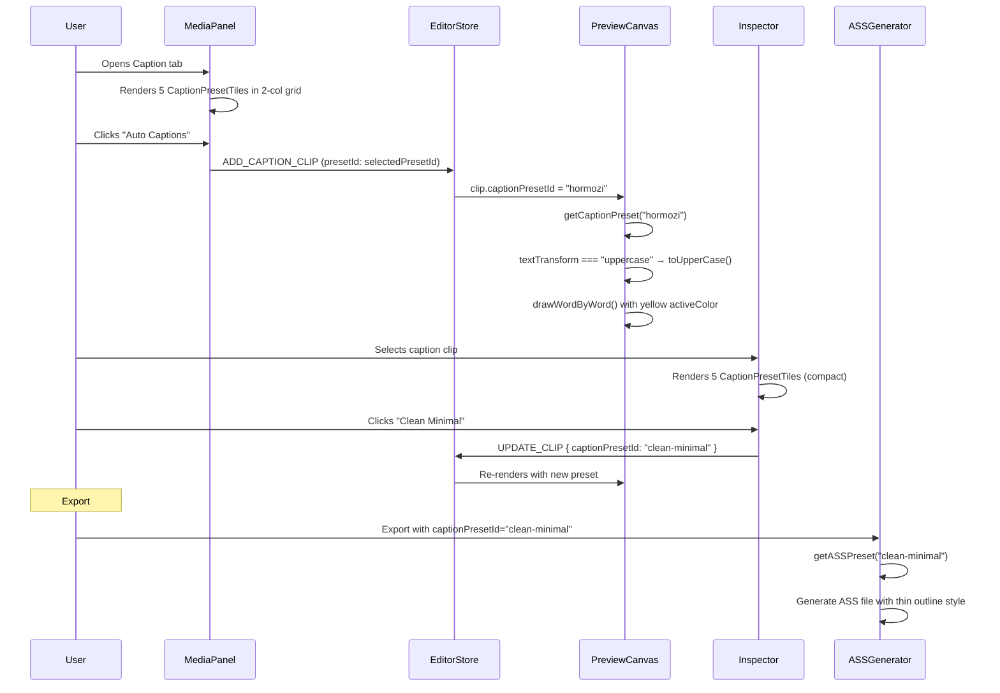

# LLD: Caption Style Themes

**Feature:** 2.2 / 2.3 — Caption System Overhaul — Style Themes
**Phase:** Single-phase (frontend-only, no schema changes)

---

## Current State & Problems

### What exists

`frontend/src/features/editor/constants/caption-presets.ts` defines six `CaptionPreset` objects:

| Current ID | Current Name | Matches Spec? |
|---|---|---|
| `clean-white` | Clean White | ≈ Clean Minimal (missing thin outline) |
| `bold-outline` | Bold Outline | ✓ Matches |
| `box-dark` | Dark Box | ✓ Matches |
| `box-accent` | Accent Box | ✗ Not in the five spec themes |
| `highlight` | Word Highlight | ≈ Hormozi (wrong name, missing all-caps) |
| `karaoke` | Karaoke | ✓ Matches |

`backend/src/routes/editor/export/ass-generator.ts` has a parallel `PRESET_TO_ASS` mapping keyed by the same preset IDs. Both the frontend presets and backend ASS presets must stay in sync.

### Problems

**1. Wrong preset roster.** The product spec calls for five creator-validated themes: **Hormozi, Clean Minimal, Dark Box, Karaoke, Bold Outline**. The codebase has six presets, none named "Hormozi," and includes "Accent Box" which is not in the spec.

**2. Hormozi theme is missing entirely.** The spec describes: bold white all-caps, yellow highlight on key words, centered bottom-third. The closest current preset (`highlight`) lacks `textTransform: uppercase` and uses the wrong name. More critically, the canvas renderer has no concept of text transform — it draws words as-is from the `captionWords` array.

**3. Clean Minimal is wrong.** The spec says "thin outline"; the current `clean-white` preset has `outlineWidth: 0` (no outline at all). It also has no outline color set.

**4. Preset names are technical, not creator-friendly.** IDs like `box-dark` and `highlight` don't communicate the style's personality. Creators scan visually — the tile should be self-evident — but the name matters in the inspector's compact grid.

**5. MediaPanel shows presets as stacked buttons.** The spec says "five theme preset tiles, each showing a live preview of how the style looks on a dark background." The current UI shows a vertical list of styled `<button>` elements with just the preset name rendered in the preset's font. No dark-background tile, no multi-word preview.

---

## No Schema Changes

Caption presets are frontend constants with a mirrored mapping in the ASS generator. No database table, no migration, no new columns.

The `Clip.captionPresetId` field stores the preset ID string (e.g., `"hormozi"`). Changing preset IDs is a **breaking change** for existing saved projects. This LLD addresses backward compatibility.

---

## Implementation

### Build sequence

1. `caption-presets.ts` — Replace the six presets with five spec-aligned themes
2. `use-caption-preview.ts` — Add `textTransform` support to canvas renderer
3. `CaptionPresetTile.tsx` — New component: dark-background preview tile
4. `MediaPanel.tsx` — Replace stacked buttons with tile grid
5. `Inspector.tsx` — Update preset picker grid with new names
6. `ass-generator.ts` — Update `PRESET_TO_ASS` mapping for new IDs
7. `en.json` — Update i18n keys
8. Backward compatibility — Migration for existing `captionPresetId` values

---

### 1. `frontend/src/features/editor/constants/caption-presets.ts` _(rewrite)_

#### Type change

Add `textTransform` to `CaptionPreset`:

```typescript
export interface CaptionPreset {
  id: string;
  name: string;                // i18n key looked up at render time
  fontFamily: string;
  fontSize: number;
  fontWeight: string;
  textTransform: "none" | "uppercase";  // NEW
  color: string;
  activeColor?: string;
  outlineColor?: string;
  outlineWidth: number;
  backgroundColor?: string;
  backgroundRadius?: number;
  backgroundPadding?: number;
  positionY: number;
  animation: "none" | "highlight" | "karaoke";
  groupSize: number;
}
```

#### New preset array

```typescript
export const CAPTION_PRESETS: readonly CaptionPreset[] = [
  {
    id: "hormozi",
    name: "Hormozi",
    fontFamily: "Inter",
    fontSize: 56,
    fontWeight: "900",
    textTransform: "uppercase",
    color: "#FFFFFF",
    activeColor: "#FACC15",
    outlineColor: "#000000",
    outlineWidth: 2,
    positionY: 80,
    animation: "highlight",
    groupSize: 3,
  },
  {
    id: "clean-minimal",
    name: "Clean Minimal",
    fontFamily: "Inter",
    fontSize: 44,
    fontWeight: "700",
    textTransform: "none",
    color: "#FFFFFF",
    outlineColor: "#000000",
    outlineWidth: 1,
    positionY: 80,
    animation: "none",
    groupSize: 4,
  },
  {
    id: "dark-box",
    name: "Dark Box",
    fontFamily: "Inter",
    fontSize: 44,
    fontWeight: "700",
    textTransform: "none",
    color: "#FFFFFF",
    outlineWidth: 0,
    backgroundColor: "rgba(0,0,0,0.6)",
    backgroundRadius: 8,
    backgroundPadding: 12,
    positionY: 80,
    animation: "none",
    groupSize: 3,
  },
  {
    id: "karaoke",
    name: "Karaoke",
    fontFamily: "Inter",
    fontSize: 48,
    fontWeight: "700",
    textTransform: "none",
    color: "rgba(255,255,255,0.4)",
    activeColor: "#FFFFFF",
    outlineColor: "#000000",
    outlineWidth: 2,
    positionY: 80,
    animation: "karaoke",
    groupSize: 5,
  },
  {
    id: "bold-outline",
    name: "Bold Outline",
    fontFamily: "Inter",
    fontSize: 56,
    fontWeight: "900",
    textTransform: "none",
    color: "#FFFFFF",
    outlineColor: "#000000",
    outlineWidth: 3,
    positionY: 80,
    animation: "none",
    groupSize: 3,
  },
] as const;
```

**Key differences from current presets:**

| Theme | What changed vs. current |
|---|---|
| **Hormozi** | New. Replaces `highlight`. `textTransform: "uppercase"`, `fontWeight: "900"`, `fontSize: 56`. |
| **Clean Minimal** | Replaces `clean-white`. Added `outlineWidth: 1`, `outlineColor: "#000000"`, `groupSize: 4` (sentence-sized groups per spec). |
| **Dark Box** | Replaces `box-dark`. ID changed. Same styling. |
| **Karaoke** | Unchanged except `textTransform: "none"` added. |
| **Bold Outline** | Replaces `bold-outline`. `textTransform: "none"` added. |
| ~~Accent Box~~ | **Removed.** Not in the five spec themes. |

#### Backward-compatible ID mapping

Add a migration lookup so existing saved projects with old preset IDs still resolve:

```typescript
/**
 * Maps legacy preset IDs (from before the theme overhaul) to current IDs.
 * Used by getCaptionPreset() to avoid breaking saved projects.
 */
const LEGACY_ID_MAP: Record<string, string> = {
  "clean-white": "clean-minimal",
  "box-dark": "dark-box",
  "box-accent": "dark-box",     // closest match — Accent Box removed
  "highlight": "hormozi",
};

export function getCaptionPreset(id: string): CaptionPreset {
  const resolvedId = LEGACY_ID_MAP[id] ?? id;
  return (
    CAPTION_PRESETS.find((p) => p.id === resolvedId) ?? CAPTION_PRESETS[0]
  );
}
```

This means:
- A project saved with `captionPresetId: "highlight"` loads as Hormozi (correct visual match)
- A project saved with `captionPresetId: "clean-white"` loads as Clean Minimal
- A project saved with `captionPresetId: "box-accent"` falls back to Dark Box (closest match)
- `karaoke` and `bold-outline` IDs are unchanged — no mapping needed

---

### 2. `frontend/src/features/editor/hooks/use-caption-preview.ts` _(modified)_

The canvas renderer must apply `textTransform: "uppercase"` for the Hormozi theme.

#### Change in `drawCaptionsOnCanvas`

After resolving the group of words (line 33), apply the transform:

```typescript
// After: const group = words.slice(groupStart, groupStart + groupSize);
// Add:
const displayGroup = preset.textTransform === "uppercase"
  ? group.map((w) => ({ ...w, word: w.word.toUpperCase() }))
  : group;
```

Then use `displayGroup` everywhere `group` is currently used (for `fullText`, `drawWordByWord`, etc.).

This keeps the original `captionWords` data untouched — uppercase is a **display-only** transform, same as CSS `text-transform`. The stored words remain in their original casing so users can switch themes without data loss.

#### Concrete diff

```typescript
// Line 33 — after computing the group:
const group = words.slice(groupStart, groupStart + groupSize);

// ADD these two lines:
const displayGroup = preset.textTransform === "uppercase"
  ? group.map((w) => ({ ...w, word: w.word.toUpperCase() }))
  : group;

// Line 42 — change `group` → `displayGroup`:
const fullText = displayGroup.map((w) => w.word).join(" ");

// Line 61 — change `group` → `displayGroup`:
drawWordByWord(ctx, displayGroup, relativeMs, preset, canvasW, y, fontSize);
```

No other renderer changes. The `drawWordByWord` and `drawSimpleText` functions work on the text they receive — uppercase words render correctly through the existing code path.

---

### 3. `frontend/src/features/editor/components/CaptionPresetTile.tsx` _(new file)_

A self-contained tile component that shows a realistic preview of a caption preset on a dark background. Used in both MediaPanel (caption tab) and Inspector (preset picker).

```tsx
import { cn } from "@/shared/utils/helpers/utils";
import type { CaptionPreset } from "../constants/caption-presets";

interface Props {
  preset: CaptionPreset;
  selected: boolean;
  onClick: () => void;
  compact?: boolean; // true in Inspector's 2-col grid
}

const PREVIEW_WORDS = ["Your", "caption", "here"];

export function CaptionPresetTile({ preset, selected, onClick, compact }: Props) {
  const words = PREVIEW_WORDS.map((w) =>
    preset.textTransform === "uppercase" ? w.toUpperCase() : w
  );

  // For highlight/karaoke, show the second word as "active"
  const activeIndex = preset.animation !== "none" ? 1 : -1;

  return (
    <button
      onClick={onClick}
      className={cn(
        "relative rounded border-0 cursor-pointer transition-all overflow-hidden",
        "bg-[#1a1a2e] flex items-center justify-center",
        compact ? "h-12 px-2" : "h-16 px-3",
        selected
          ? "ring-2 ring-studio-accent"
          : "ring-1 ring-white/10 hover:ring-white/25"
      )}
    >
      {/* Dark gradient background to simulate video */}
      <div className="absolute inset-0 bg-gradient-to-b from-[#1a1a2e] to-[#0f0f23]" />

      {/* Caption preview */}
      <div
        className="relative z-10 flex items-center justify-center gap-[0.3em] flex-wrap"
        style={{
          fontFamily: preset.fontFamily,
          fontSize: compact ? 11 : 14,
          fontWeight: preset.fontWeight,
        }}
      >
        {words.map((word, i) => {
          const isActive = i === activeIndex;
          const color = isActive && preset.activeColor
            ? preset.activeColor
            : preset.color;

          return (
            <span
              key={i}
              style={{
                color: color === "#111111" ? "#e5e7eb" : color,
                WebkitTextStroke:
                  preset.outlineWidth > 0
                    ? `${preset.outlineWidth * (compact ? 0.3 : 0.4)}px ${preset.outlineColor ?? "#000"}`
                    : undefined,
                backgroundColor:
                  preset.backgroundColor ? preset.backgroundColor : undefined,
                padding: preset.backgroundPadding
                  ? `1px ${preset.backgroundPadding / 4}px`
                  : undefined,
                borderRadius: preset.backgroundRadius
                  ? preset.backgroundRadius / 2
                  : undefined,
              }}
            >
              {word}
            </span>
          );
        })}
      </div>

      {/* Theme name label */}
      <span
        className={cn(
          "absolute bottom-0.5 left-0 right-0 text-center text-dim-4",
          compact ? "text-[8px]" : "text-[9px]"
        )}
      >
        {preset.name}
      </span>
    </button>
  );
}
```

**Why a dedicated component rather than inline JSX:**
- Used in two places (MediaPanel tab + Inspector picker) — avoids duplication
- The preview rendering logic (text transform, active word highlighting, background pills) is non-trivial
- Isolates styling concerns from the parent layout concerns

**Why CSS-rendered preview instead of canvas:**
The preview only shows 3 static words — CSS handles this perfectly. Using a canvas for the preview tile would be overkill and harder to style responsively. The real canvas renderer in `use-caption-preview.ts` handles the actual playback.

---

### 4. `frontend/src/features/editor/components/MediaPanel.tsx` _(modified)_

#### 4a. Update imports

```typescript
// Remove:
import { CAPTION_PRESETS } from "../constants/caption-presets";

// Add:
import { CAPTION_PRESETS } from "../constants/caption-presets";
import { CaptionPresetTile } from "./CaptionPresetTile";
```

(Import unchanged, but `CaptionPresetTile` is new.)

#### 4b. Replace preset list with tile grid (lines 520–568)

```tsx
{/* Style presets */}
<p className="text-[10px] uppercase tracking-widest text-dim-3 font-semibold px-0.5">
  {t("editor_captions_style")}
</p>
<div className="grid grid-cols-2 gap-1.5">
  {CAPTION_PRESETS.map((preset) => (
    <CaptionPresetTile
      key={preset.id}
      preset={preset}
      selected={selectedPresetId === preset.id}
      onClick={() => setSelectedPresetId(preset.id)}
    />
  ))}
</div>
```

**Layout change:** From a vertical stack of full-width buttons to a 2-column grid of preview tiles. Five tiles in a 2-column grid → 3 rows (last row has one tile). The tiles are ~80px tall each, so the grid is ~240px — same vertical footprint as the old 6-button list.

#### 4c. Tab label

The tab label is already driven by i18n key `editor_tab_text`. Change the translation value from "Text" to "Caption" (see step 7).

---

### 5. `frontend/src/features/editor/components/Inspector.tsx` _(modified)_

#### Replace preset picker buttons (lines 323–342)

```tsx
<div className="mb-2">
  <p className="text-[10px] text-dim-3 mb-1.5">{t("editor_captions_style")}</p>
  <div className="grid grid-cols-2 gap-1">
    {CAPTION_PRESETS.map((p) => (
      <CaptionPresetTile
        key={p.id}
        preset={p}
        selected={selectedClip.captionPresetId === p.id}
        onClick={() =>
          onUpdateClip(selectedClip!.id, { captionPresetId: p.id })
        }
        compact
      />
    ))}
  </div>
</div>
```

Add import:
```typescript
import { CaptionPresetTile } from "./CaptionPresetTile";
```

The `compact` prop reduces tile height from 64px to 48px so the inspector doesn't consume too much vertical space.

---

### 6. `backend/src/routes/editor/export/ass-generator.ts` _(modified)_

#### 6a. Update `PRESET_TO_ASS` keys

Replace the entire `PRESET_TO_ASS` object to match the new preset IDs:

```typescript
const PRESET_TO_ASS: Record<string, ASSPresetConfig> = {
  hormozi: {
    fontFamily: "Inter",
    fontSize: 56,
    bold: true,
    primaryColor: cssToASS("#FFFFFF"),
    outlineColor: cssToASS("#000000"),
    outlineWidth: 2,
    backColor: cssToASS("#000000", 128),
    borderStyle: 1,
    positionY: 80,
    animation: "highlight",
    activeColor: cssToASS("#FACC15"),
  },
  "clean-minimal": {
    fontFamily: "Inter",
    fontSize: 44,
    bold: true,
    primaryColor: cssToASS("#FFFFFF"),
    outlineColor: cssToASS("#000000"),
    outlineWidth: 1,
    backColor: cssToASS("#000000", 128),
    borderStyle: 1,
    positionY: 80,
    animation: "none",
  },
  "dark-box": {
    fontFamily: "Inter",
    fontSize: 44,
    bold: true,
    primaryColor: cssToASS("#FFFFFF"),
    outlineColor: cssToASS("#000000"),
    outlineWidth: 0,
    backColor: cssToASS("#000000", 100),
    borderStyle: 3,
    positionY: 80,
    animation: "none",
  },
  karaoke: {
    fontFamily: "Inter",
    fontSize: 48,
    bold: true,
    primaryColor: cssToASS("#FFFFFF", 153),
    outlineColor: cssToASS("#000000"),
    outlineWidth: 2,
    backColor: cssToASS("#000000", 128),
    borderStyle: 1,
    positionY: 80,
    animation: "karaoke",
    activeColor: cssToASS("#FFFFFF"),
  },
  "bold-outline": {
    fontFamily: "Inter",
    fontSize: 56,
    bold: true,
    primaryColor: cssToASS("#FFFFFF"),
    outlineColor: cssToASS("#000000"),
    outlineWidth: 3,
    backColor: cssToASS("#000000", 128),
    borderStyle: 1,
    positionY: 80,
    animation: "none",
  },
};
```

#### 6b. Add legacy ID resolution

```typescript
const LEGACY_ASS_ID_MAP: Record<string, string> = {
  "clean-white": "clean-minimal",
  "box-dark": "dark-box",
  "box-accent": "dark-box",
  "highlight": "hormozi",
};

function getASSPreset(presetId: string): ASSPresetConfig {
  const resolved = LEGACY_ASS_ID_MAP[presetId] ?? presetId;
  return PRESET_TO_ASS[resolved] ?? PRESET_TO_ASS["hormozi"];
}
```

#### 6c. Add textTransform to ASS generation

In the `generateASS` function, apply uppercase transform for the Hormozi preset:

```typescript
// After: const preset = getASSPreset(presetId);
// Add:
const isUppercase = presetId === "hormozi" || LEGACY_ASS_ID_MAP[presetId] === "hormozi";
```

Then when building `text` for each Dialogue line:

```typescript
// When joining words:
const wordText = isUppercase ? w.word.toUpperCase() : w.word;
```

This keeps ASS export visually consistent with the canvas preview — both apply the same uppercase transform.

---

### 7. `frontend/src/translations/en.json` _(modified)_

```json
{
  "editor_tab_text": "Caption",

  "editor_captions_preset_hormozi": "Hormozi",
  "editor_captions_preset_clean_minimal": "Clean Minimal",
  "editor_captions_preset_dark_box": "Dark Box",
  "editor_captions_preset_karaoke": "Karaoke",
  "editor_captions_preset_bold_outline": "Bold Outline"
}
```

Remove old keys:
```
"editor_captions_preset_clean_white"
"editor_captions_preset_box_dark"
"editor_captions_preset_box_accent"
"editor_captions_preset_highlight"
```

Note: The preset `name` field in `caption-presets.ts` stores the display string directly (not an i18n key) because preset names are brand terms that don't get translated — "Hormozi" is "Hormozi" in every language. The i18n keys above exist for the MediaPanel/Inspector labels that wrap the presets (e.g., section headers).

---

### 8. Backward Compatibility

#### Saved projects

Existing `EditProject` documents in the database store `captionPresetId` as a string on each clip. When a project is loaded:

1. Frontend's `getCaptionPreset()` resolves legacy IDs via `LEGACY_ID_MAP`
2. The preview canvas renders correctly with the resolved preset
3. If the user opens the inspector, the preset picker highlights the resolved preset
4. If the user re-saves (auto-save fires), the clip's `captionPresetId` is **not** automatically migrated — it stays as the old ID until the user explicitly picks a new preset

This means:
- **No data migration needed** — the mapping handles it at read time
- **No backend migration** — preset IDs are opaque strings to the database
- **Gradual migration** — as users edit their projects, they naturally adopt new IDs

#### Export pipeline

The ASS generator has its own `LEGACY_ASS_ID_MAP` (step 6b) that mirrors the frontend mapping. A project with `captionPresetId: "highlight"` that gets exported will generate the Hormozi ASS style correctly.

---

## Data Flow



---

## Preset Visual Reference

| Theme | Font | Weight | Size | Transform | Color | Active | Outline | Background | Animation | Groups |
|---|---|---|---|---|---|---|---|---|---|---|
| **Hormozi** | Inter | 900 | 56 | UPPERCASE | `#FFF` | `#FACC15` (yellow) | 2px `#000` | none | highlight | 3 |
| **Clean Minimal** | Inter | 700 | 44 | none | `#FFF` | — | 1px `#000` | none | none | 4 |
| **Dark Box** | Inter | 700 | 44 | none | `#FFF` | — | none | `rgba(0,0,0,0.6)` r8 p12 | none | 3 |
| **Karaoke** | Inter | 700 | 48 | none | `rgba(255,255,255,0.4)` | `#FFF` | 2px `#000` | none | karaoke | 5 |
| **Bold Outline** | Inter | 900 | 56 | none | `#FFF` | — | 3px `#000` | none | none | 3 |

---

## Edge Cases

| Case | Behaviour |
|---|---|
| Existing project with `captionPresetId: "box-accent"` | `LEGACY_ID_MAP` resolves to `"dark-box"`. Visual changes from yellow box to dark box — acceptable as Accent Box is removed. User can pick a different theme if desired. |
| Existing project with `captionPresetId: "highlight"` | Resolves to `"hormozi"`. Words now render uppercase — visual change. Acceptable because highlight was the closest match and Hormozi is the improved version. |
| User on old frontend, export on new backend | ASS generator has its own legacy map — exports correctly regardless of which frontend version saved the project. |
| Preset `name` field used in non-English locale | Preset names are brand terms ("Hormozi", "Karaoke"), not translatable phrases. They display the same in all locales. |
| `textTransform: "uppercase"` on words with accented characters | `String.toUpperCase()` handles Unicode correctly: "café" → "CAFÉ", "naïve" → "NAÏVE". No special handling needed. |
| Caption clip with no `captionPresetId` set | `getCaptionPreset()` returns `CAPTION_PRESETS[0]` (Hormozi) as default. Same fallback behavior as before (previously fell back to Clean White). |
| Very long word ("entrepreneurship") in uppercase | `toUpperCase()` makes it wider. Canvas `measureText` handles this — the word may extend beyond the canvas edge at large font sizes. This is the same behavior as the current renderer; not introduced by this change. |

---

## Files Changed

| File | Change |
|---|---|
| `frontend/src/features/editor/constants/caption-presets.ts` | **Rewritten** — 5 spec-aligned presets, `textTransform` field, legacy ID mapping |
| `frontend/src/features/editor/hooks/use-caption-preview.ts` | **Modified** — Apply `textTransform` before rendering |
| `frontend/src/features/editor/components/CaptionPresetTile.tsx` | **New** — Dark-background preview tile component |
| `frontend/src/features/editor/components/MediaPanel.tsx` | **Modified** — Replace button list with `CaptionPresetTile` grid |
| `frontend/src/features/editor/components/Inspector.tsx` | **Modified** — Replace text buttons with `CaptionPresetTile` (compact) |
| `backend/src/routes/editor/export/ass-generator.ts` | **Modified** — New preset IDs, legacy map, uppercase support |
| `frontend/src/translations/en.json` | **Modified** — New preset keys, tab rename, remove old keys |

No backend schema changes. No database migration. No new API endpoints.
