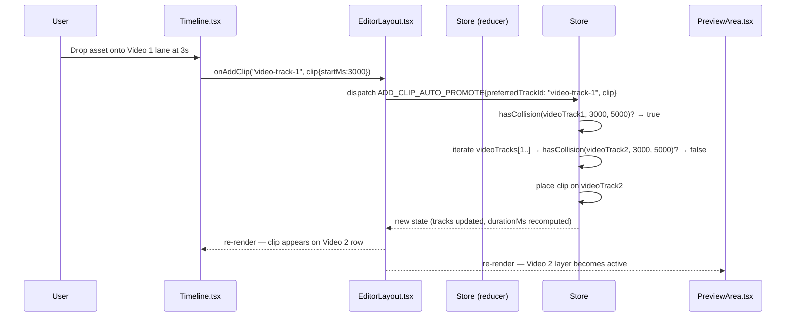

# LLD: Multiple Video Timeline Tracks

**Feature:** 1.4 — Multiple Video Timeline Tracks (Prevent Stacking, Enable Layering)
**Phase:** MVP (Phase 1 = preview + drag behaviour; Phase 2 = export compositing)

---

## Overview

The editor currently has exactly one video `Track` in its state array. Placing two clips at the same timeline position causes silent stacking with no visual feedback. This LLD introduces support for multiple named video track lanes, automatic collision-based promotion, and a layered CSS compositor in the preview.

The `Track` data model and `ADD_TRACK`/`REMOVE_TRACK` reducer actions already exist. The "Add Video Track" button already renders in `Timeline.tsx`. The gaps are: collision detection on clip insertion, multi-track preview compositing, vertical scroll when tracks overflow, and consistent naming.

---

## No Schema Changes

Tracks are stored as a single JSONB column (`edit_project.tracks`). Multiple video tracks are just additional objects in that array — no migration needed.

---

## Phase 1 Changes

### 1. `frontend/src/features/editor/utils/clip-constraints.ts`

Add a pure collision predicate. Used by the reducer and optionally by UI layers.

```typescript
/**
 * Returns true if placing a clip at [startMs, startMs+durationMs) would
 * overlap any existing clip on the track (optionally excluding one clip by id).
 */
export function hasCollision(
  track: Track,
  startMs: number,
  durationMs: number,
  excludeClipId?: string
): boolean {
  const end = startMs + durationMs;
  return track.clips.some((c) => {
    if (excludeClipId && c.id === excludeClipId) return false;
    return startMs < c.startMs + c.durationMs && end > c.startMs;
  });
}
```

---

### 2. `frontend/src/features/editor/types/editor.ts`

Add one new action variant to `EditorAction`. Place it after `ADD_CLIP`:

```typescript
| {
    type: "ADD_CLIP_AUTO_PROMOTE";
    preferredTrackId: string;
    clip: Clip;
  }
```

Rename the first video track's default name. In `DEFAULT_TRACKS` (useEditorStore.ts line 16), change `name: "Video"` → `name: "Video 1"`. The `id` stays `"video"` — no migration needed.

---

### 3. `frontend/src/features/editor/hooks/useEditorStore.ts`

#### 3a. New reducer case `ADD_CLIP_AUTO_PROMOTE`

Insert after the `ADD_CLIP` case (~line 180):

```typescript
case "ADD_CLIP_AUTO_PROMOTE": {
  const { preferredTrackId, clip } = action;
  const preferredTrack = state.tracks.find((t) => t.id === preferredTrackId);

  // Non-video tracks: delegate to a plain ADD_CLIP (no promotion concept)
  if (!preferredTrack || preferredTrack.type !== "video") {
    const newTracks = state.tracks.map((t) =>
      t.id === preferredTrackId
        ? { ...t, clips: [...t.clips, { ...clip, locallyModified: true }] }
        : t
    );
    return {
      ...state,
      past: [...state.past, state.tracks].slice(-50),
      future: [],
      tracks: newTracks,
      durationMs: computeDuration(newTracks),
    };
  }

  // Walk video tracks starting from the preferred one, then in order
  const videoTracks = state.tracks.filter((t) => t.type === "video");
  const preferredIdx = videoTracks.findIndex((t) => t.id === preferredTrackId);
  const ordered = [
    ...videoTracks.slice(preferredIdx),
    ...videoTracks.slice(0, preferredIdx),
  ];
  const targetTrack = ordered.find(
    (t) => !hasCollision(t, clip.startMs, clip.durationMs)
  );

  let newTracks: Track[];

  if (targetTrack) {
    newTracks = state.tracks.map((t) =>
      t.id === targetTrack.id
        ? { ...t, clips: [...t.clips, { ...clip, locallyModified: true }] }
        : t
    );
  } else {
    // Every existing video track collides → create a new one
    const newTrack: Track = {
      id: crypto.randomUUID(),
      type: "video",
      name: `Video ${videoTracks.length + 1}`,
      muted: false,
      locked: false,
      clips: [{ ...clip, locallyModified: true }],
      transitions: [],
    };
    // Insert immediately after the last video track in the array
    const lastVideoIdx = state.tracks.reduce(
      (last, t, i) => (t.type === "video" ? i : last),
      0
    );
    newTracks = [
      ...state.tracks.slice(0, lastVideoIdx + 1),
      newTrack,
      ...state.tracks.slice(lastVideoIdx + 1),
    ];
  }

  return {
    ...state,
    past: [...state.past, state.tracks].slice(-50),
    future: [],
    tracks: newTracks,
    durationMs: computeDuration(newTracks),
  };
}
```

#### 3b. `addVideoTrack` callback naming fix

The current callback always names new tracks `"Video"`. It needs to read how many video tracks already exist. Change the dependency array and derive the name:

```typescript
const addVideoTrack = useCallback(() => {
  const videoCount = state.tracks.filter((t) => t.type === "video").length;
  const track: Track = {
    id: crypto.randomUUID(),
    type: "video",
    name: `Video ${videoCount + 1}`,
    muted: false,
    locked: false,
    clips: [],
    transitions: [],
  };
  dispatch({ type: "ADD_TRACK", track });
}, [state.tracks]);  // add state.tracks to deps
```

#### 3c. Expose `addClipAutoPromote` callback

After `addClip` (~line 724):

```typescript
const addClipAutoPromote = useCallback(
  (preferredTrackId: string, clip: Clip) =>
    dispatch({ type: "ADD_CLIP_AUTO_PROMOTE", preferredTrackId, clip }),
  []
);
```

Add `addClipAutoPromote` to the returned object.

---

### 4. `frontend/src/features/editor/components/EditorLayout.tsx`

`handleAddClip` currently delegates to `store.addClip`. Change it to use `addClipAutoPromote` so all insertion paths benefit from collision resolution:

```typescript
// Before (line 293):
const handleAddClip = useCallback(
  (trackId: string, clip: Clip) => store.addClip(trackId, clip),
  [store.addClip]
);

// After:
const handleAddClip = useCallback(
  (trackId: string, clip: Clip) => store.addClipAutoPromote(trackId, clip),
  [store.addClipAutoPromote]
);
```

No further changes needed — `Timeline.tsx` and `MediaPanel.tsx` both receive `onAddClip` and will transparently use the new auto-promoting path.

---

### 5. `frontend/src/features/editor/components/PreviewArea.tsx`

#### 5a. Derive all video tracks instead of just the first

Replace lines 150–174:

```typescript
// BEFORE
const videoTrack = tracks.find((t) => t.type === "video");
const videoClips = videoTrack?.clips ?? [];
const videoTransitions = videoTrack?.transitions ?? [];
const activeVideoClipIds = new Set(
  videoClips
    .filter((c) => c.enabled !== false && currentTimeMs >= c.startMs && ...)
    .map((c) => c.id)
);

// AFTER
const videoTracks = tracks.filter((t) => t.type === "video");

// Per-track active clip ID sets (needed by useEffect sync + render)
const activeVideoClipIdsByTrack = new Map(
  videoTracks.map((vt) => [
    vt.id,
    new Set(
      vt.clips
        .filter(
          (c) =>
            c.enabled !== false &&
            currentTimeMs >= c.startMs &&
            currentTimeMs < c.startMs + c.durationMs
        )
        .map((c) => c.id)
    ),
  ])
);
```

Update the `hasContent` guard (line 294):
```typescript
// BEFORE
const hasContent = (videoTrack?.clips.length ?? 0) > 0;

// AFTER
const hasContent = videoTracks.some((vt) => vt.clips.length > 0);
```

#### 5b. Update video sync `useEffect`

The effect currently iterates `videoClips` from one track. Change it to iterate all tracks' clips:

```typescript
useEffect(() => {
  for (const videoTrack of videoTracks) {
    const trackTransitions = videoTrack.transitions ?? [];
    const trackClips = videoTrack.clips;
    const activeIds = activeVideoClipIdsByTrack.get(videoTrack.id) ?? new Set();

    for (const clip of trackClips) {
      const el = videoRefs.current.get(clip.id);
      if (!el) continue;

      el.muted = videoTrack.muted;

      const isActive = activeIds.has(clip.id);
      const incomingTransition = trackTransitions.find(
        (t) => t.clipBId === clip.id && (t.type === "dissolve" || t.type === "wipe-right")
      );
      let isIncomingWindow = false;
      if (incomingTransition) {
        const clipA = trackClips.find((c) => c.id === incomingTransition.clipAId);
        if (clipA) {
          const clipAEnd = clipA.startMs + clipA.durationMs;
          const windowStart = clipAEnd - incomingTransition.durationMs;
          isIncomingWindow = currentTimeMs >= windowStart && currentTimeMs < clipAEnd;
        }
      }

      // ... (identical seek/play/pause logic from the current effect body) ...
    }
  }
}, [currentTimeMs, isPlaying, videoTracks, activeVideoClipIdsByTrack]);
```

#### 5c. Render video tracks as CSS layers

Replace the flat `videoClips.map(...)` block with a per-track group. Each video track gets its own `position: absolute; inset: 0` wrapper so Video 2 clips naturally render on top of Video 1 clips via `zIndex`:

```tsx
{/* Layered video tracks — Track 0 at bottom, Track N at top */}
{videoTracks.map((videoTrack, trackIdx) => {
  const trackClips = videoTrack.clips;
  const trackTransitions = videoTrack.transitions ?? [];
  const activeIds = activeVideoClipIdsByTrack.get(videoTrack.id) ?? new Set();

  return (
    <div
      key={videoTrack.id}
      className="absolute inset-0"
      style={{ zIndex: trackIdx }}
    >
      {trackClips.map((clip) => {
        const isActive = activeIds.has(clip.id);
        const heavyPreload = videoClipNeedsHeavyPreload(
          clip,
          currentTimeMs,
          trackTransitions,
          trackClips,
          activeIds,
        );
        const isDisabled = clip.enabled === false;

        // effect preview override (unchanged)
        const preview =
          effectPreviewOverride?.clipId === clip.id
            ? effectPreviewOverride.patch
            : null;
        const contrast = preview?.contrast ?? clip.contrast;
        const warmth = preview?.warmth ?? clip.warmth;
        const baseOpacity = preview?.opacity ?? clip.opacity ?? 1;

        const outgoing = getOutgoingTransitionStyle(clip, trackTransitions, currentTimeMs);
        const incoming = getIncomingTransitionStyle(clip, trackTransitions, trackClips, currentTimeMs);

        let opacity: number;
        if (isDisabled) {
          opacity = 0;
        } else if (outgoing.opacity !== undefined) {
          opacity = outgoing.opacity as number;
        } else if (incoming?.opacity !== undefined) {
          opacity = incoming.opacity as number;
        } else {
          opacity = isActive ? baseOpacity : 0;
        }

        const clipPath = incoming?.clipPath as string | undefined;
        const transform =
          (outgoing.transform as string | undefined) ??
          `scale(${clip.scale ?? 1}) translate(${clip.positionX ?? 0}px, ${clip.positionY ?? 0}px) rotate(${clip.rotation ?? 0}deg)`;

        const filterParts: string[] = [];
        if (contrast !== 0) filterParts.push(`contrast(${1 + contrast / 100})`);
        if (warmth !== 0) filterParts.push(buildWarmthFilter(warmth));

        return (
          <video
            key={clip.id}
            ref={(el) => {
              if (el) videoRefs.current.set(clip.id, el);
              else videoRefs.current.delete(clip.id);
            }}
            src={assetUrlMap.get(clip.assetId ?? "") ?? ""}
            className="absolute inset-0 w-full h-full object-contain"
            style={{
              opacity,
              clipPath,
              filter: filterParts.join(" ") || undefined,
              transform,
            }}
            playsInline
            preload={heavyPreload ? "auto" : "metadata"}
          />
        );
      })}
    </div>
  );
})}
```

Text clips already have `zIndex: 10` and sit above all video layers — no change needed.

---

### 6. `frontend/src/features/editor/components/Timeline.tsx`

#### 6a. Vertical scroll: content area

Line 203 — change `overflow-y-hidden` to `overflow-y-auto`:

```tsx
// BEFORE
className="flex-1 overflow-x-auto overflow-y-hidden relative"

// AFTER
className="flex-1 overflow-x-auto overflow-y-auto relative"
```

#### 6b. Vertical scroll: sync track headers

When the content scrolls vertically the track headers must follow. Add a `headerScrollRef` and wire an `onScroll` handler:

```tsx
// In Timeline component, alongside scrollRef:
const headerColumnRef = useRef<HTMLDivElement>(null);

// On the track headers column div (line 169), add overflow-y-hidden + ref:
<div
  ref={headerColumnRef}
  className="flex flex-col shrink-0 border-r border-overlay-sm bg-studio-surface z-10 overflow-y-hidden"
  style={{ width: 186 }}
>

// On the scrollable content div, add onScroll:
<div
  ref={scrollRef}
  className="flex-1 overflow-x-auto overflow-y-auto relative"
  onScroll={(e) => {
    if (headerColumnRef.current) {
      headerColumnRef.current.scrollTop = (e.currentTarget as HTMLDivElement).scrollTop;
    }
  }}
>
```

#### 6c. Ruler sticky positioning

The `TimelineRuler` renders inside the absolutely-positioned content div. When the content scrolls vertically the ruler scrolls away. Add `position: sticky; top: 0; zIndex: 20` to the ruler wrapper inside the scrollable area. Check `TimelineRuler.tsx` for where to add a `sticky top-0 z-20 bg-studio-surface` className.

---

## Data Flow: Collision-Promoted Drop



---

## Phase 2 (Deferred): Export Compositing

The `ffmpeg` pipeline in `backend/src/routes/editor/index.ts` (line 1108) currently uses `tracks.find((t) => t.type === "video")` — only Video 1 is exported. Video 2+ clips are silently ignored on export.

**Phase 2 approach** (not in this LLD's scope):

For each active Video 2 clip, build an ffmpeg `overlay` filter with a `between(t,...)` `enable` expression:

```
[base][overlay_input] overlay=0:0:enable='between(t,3,8)' [out]
```

Chain multiple overlays for each Video 2 clip. This requires:
1. Collecting all clips from `tracks.filter(t => t.type === "video").slice(1)` and sorting by `startMs`
2. Building a filter graph that chains overlay nodes sequentially
3. Handle clip opacity via the `format=rgba` + `colorchannelmixer` filter

Until Phase 2 ships, add a warning to the export UI when Video 2+ tracks have clips: `"Video overlay tracks are not yet included in the exported file"`.

---

## Build Sequence

1. `clip-constraints.ts` — add `hasCollision` export
2. `editor.ts` — add `ADD_CLIP_AUTO_PROMOTE` to `EditorAction`
3. `useEditorStore.ts` — rename default track, add reducer case, add `addClipAutoPromote` callback, fix `addVideoTrack` naming
4. `EditorLayout.tsx` — swap `handleAddClip` to use `addClipAutoPromote`
5. `PreviewArea.tsx` — multi-track rendering + sync effect
6. `Timeline.tsx` — vertical scroll + ruler sticky
7. Manual smoke test: add clip to full track → verify it lands on Video 2; preview shows Video 2 on top

No backend changes needed for Phase 1. No i18n additions needed — `editor_add_video_track` key already exists.

---

## Edge Cases

| Case | Behaviour |
|---|---|
| All video tracks (1–N) have a collision at the drop position | Create `Video N+1` track automatically and place there |
| Drop on a locked video track | `Timeline.tsx` already guards: locked tracks reject drops (`if (track.locked) return`) — no change needed |
| User removes Video 1 (only possible if `videoTracks.length > 1`) | `TrackHeader.tsx` already gates `canRemove` on `videoTracks.length > 1` — clips on removed track are lost (same as current REMOVE_TRACK behaviour) |
| AI assembly fires after user has added Video 2 | `LOAD_PROJECT` replaces the entire `tracks` array — user's Video 2 clips are overwritten. This is pre-existing behaviour for all tracks and is out of scope for this feature. |
| Server-merge (`MERGE_TRACKS_FROM_SERVER`) with multiple video tracks | The existing merge strategy is per-track keyed by `id`. Multiple video tracks each have unique UUIDs, so the merge still works correctly per-track. |
| Clip moved via drag (not drop) onto another clip on same track | `clampMoveToFreeSpace` resolves this within the track (existing behaviour). Cross-track drag-and-drop is not in Phase 1 scope. |
| Export while Video 2 has clips | Show warning; export renders Video 1 only until Phase 2. |

---

## Files Changed (Phase 1)

| File | Change |
|---|---|
| `frontend/src/features/editor/utils/clip-constraints.ts` | Add `hasCollision` |
| `frontend/src/features/editor/types/editor.ts` | Add `ADD_CLIP_AUTO_PROMOTE` to `EditorAction` |
| `frontend/src/features/editor/hooks/useEditorStore.ts` | Default track rename + new reducer case + callback + `addVideoTrack` naming fix |
| `frontend/src/features/editor/components/EditorLayout.tsx` | `handleAddClip` → `addClipAutoPromote` |
| `frontend/src/features/editor/components/PreviewArea.tsx` | Multi-layer video compositor |
| `frontend/src/features/editor/components/Timeline.tsx` | Vertical scroll + ruler sticky |

No backend changes. No DB migration. No new i18n keys.
