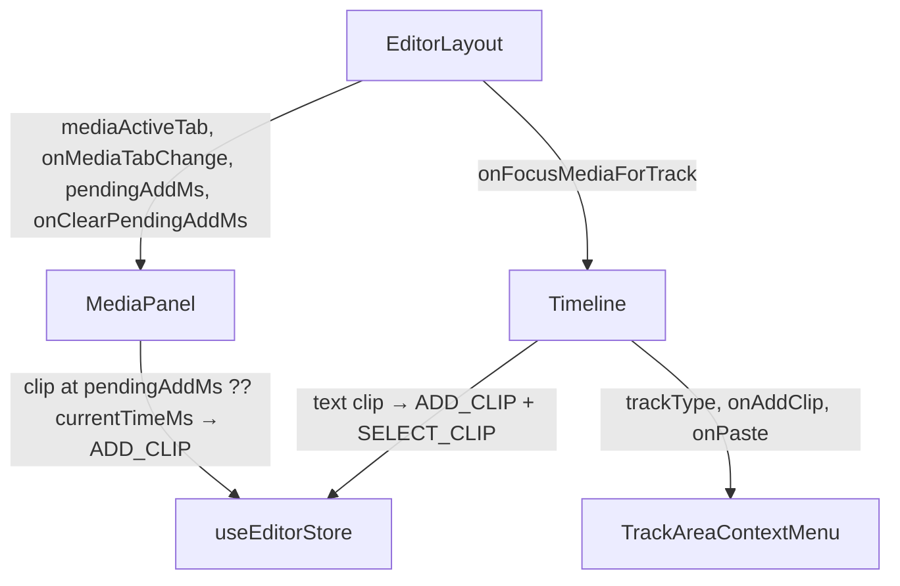

# LLD: Context-Sensitive Track Area Context Menu

## Problem

Right-clicking empty track space shows `TrackAreaContextMenu` with a single disabled "Paste Here"
when no clip is copied. Users cannot add clips from the context menu, and the paste label gives
no hint of what would be pasted.

---

## Architecture Overview



---

## The "Asset Attachment" Problem

`video`, `audio`, and `music` clips require an `assetId`. For these tracks, "Add X Clip at Position"
uses a **deferred-position flow**:

1. The right-clicked `startMs` is stored as `pendingAddMs` in `EditorLayout`.
2. `MediaPanel` is programmatically switched to the correct tab (`"media"` or `"audio"`).
3. A banner in the panel tells the user to pick an asset and shows the target position.
4. The user clicks any asset — the clip is placed at `pendingAddMs` instead of `currentTimeMs`.
5. `pendingAddMs` is cleared after the clip is added (one-shot).

For **text** tracks no asset is needed — a blank clip is created immediately.

---

## File: `frontend/src/features/editor/components/ClipContextMenu.tsx`

### Import change

```typescript
// before
import type { Clip, Track, Transition } from "../types/editor";
// after
import type { Clip, Track, TrackType, Transition } from "../types/editor";
```

### New constant (above `TrackAreaContextMenu`)

```typescript
const ADD_CLIP_LABELS: Record<TrackType, string> = {
  video: "Add Video Clip at Position",
  audio: "Add Audio Clip at Position",
  music: "Add Music Clip at Position",
  text:  "Add Text Clip at Position",
};
```

### Updated interface

```typescript
interface TrackAreaContextMenuProps {
  children: React.ReactNode;
  trackType: TrackType;       // NEW
  hasClipboard: boolean;
  onAddClip: () => void;      // NEW
  onPaste: () => void;
}
```

### Updated component

```tsx
export function TrackAreaContextMenu({
  children,
  trackType,
  hasClipboard,
  onAddClip,
  onPaste,
}: TrackAreaContextMenuProps) {
  return (
    <ContextMenu>
      <ContextMenuTrigger asChild>{children}</ContextMenuTrigger>
      <ContextMenuContent className="w-56">
        <ContextMenuItem onSelect={onAddClip}>
          {ADD_CLIP_LABELS[trackType]}
        </ContextMenuItem>

        {hasClipboard && (
          <>
            <ContextMenuSeparator />
            <ContextMenuItem onSelect={onPaste}>
              Paste Clip Here
              <ContextMenuShortcut>⌘V</ContextMenuShortcut>
            </ContextMenuItem>
          </>
        )}
      </ContextMenuContent>
    </ContextMenu>
  );
}
```

Key changes vs today:
- "Paste Clip Here" is **hidden** (not disabled) when `hasClipboard` is false.
- Separator only renders when both items are present.
- Width `w-44` → `w-56` (fits the longer labels).

---

## File: `frontend/src/features/editor/components/Timeline.tsx`

### New prop

```typescript
interface Props {
  // ... existing props unchanged ...
  onFocusMediaForTrack: (trackType: TrackType, startMs: number) => void; // NEW
}
```

### Inline handler inside `tracks.map()`

All dependencies (`track`, `pastePositionRef`, `onAddClip`, `onSelectClip`,
`onFocusMediaForTrack`) are already in scope. `TrackType` is already imported at line 8.

```tsx
const handleAddClipAtPosition = () => {
  if (track.locked) return;

  if (track.type === "text") {
    const clip: Clip = {
      id: crypto.randomUUID(),
      assetId: null,
      label: t("editor_clip_default_label"),
      startMs: pastePositionRef.current,
      durationMs: 3000,
      trimStartMs: 0,
      trimEndMs: 0,
      speed: 1,
      enabled: true,
      opacity: 1,
      warmth: 0,
      contrast: 0,
      positionX: 0,
      positionY: 0,
      scale: 1,
      rotation: 0,
      volume: 1,
      muted: false,
      textContent: "",
    };
    onAddClip(track.id, clip);
    onSelectClip(clip.id);
    return;
  }

  // video / audio / music — store pending position and switch MediaPanel to correct tab
  onFocusMediaForTrack(track.type, pastePositionRef.current);
};
```

### Updated `TrackAreaContextMenu` call site

```tsx
<TrackAreaContextMenu
  key={track.id}
  trackType={track.type}
  hasClipboard={hasClipboard}
  onAddClip={handleAddClipAtPosition}
  onPaste={() => onClipPaste(track.id, pastePositionRef.current)}
>
```

---

## File: `frontend/src/features/editor/components/MediaPanel.tsx`

### New props

```typescript
interface Props {
  // ... existing props unchanged ...
  activeTab: TabKey;                   // NEW — lifted from internal useState
  onTabChange: (tab: TabKey) => void;  // NEW
  pendingAddMs: number | null;         // NEW
  onClearPendingAddMs: () => void;     // NEW
}
```

### Remove internal `activeTab` state

```typescript
// REMOVE:
const [activeTab, setActiveTab] = useState<TabKey>("media");

// Replace every setActiveTab(x) call with onTabChange(x)
```

### Update `addVideoClip` and `addAudioClip`

```typescript
const addVideoClip = (asset: Asset) => {
  const clip = makeClip({
    assetId: asset.id,
    label: String(asset.metadata?.originalName ?? asset.type),
    startMs: pendingAddMs ?? currentTimeMs,
    durationMs: asset.durationMs ?? 5000,
  });
  onAddClip("video", clip);
  onClearPendingAddMs();
};

const addAudioClip = (asset: Asset) => {
  const trackId = asset.type === "music" ? "music" : "audio";
  const clip = makeClip({
    assetId: asset.id,
    label: String(asset.metadata?.originalName ?? asset.type),
    startMs: pendingAddMs ?? currentTimeMs,
    durationMs: asset.durationMs ?? 30000,
  });
  onAddClip(trackId, clip);
  onClearPendingAddMs();
};
```

### Pending position banner (inside the panel, above the tabs)

```tsx
{pendingAddMs !== null && (
  <div className="px-3 py-1.5 bg-studio-accent/10 border-b border-studio-accent/30 flex items-center justify-between shrink-0">
    <span className="text-[10px] text-studio-accent font-medium">
      Pick an asset — placing at {(pendingAddMs / 1000).toFixed(1)}s
    </span>
    <button
      onClick={onClearPendingAddMs}
      className="text-studio-accent/60 hover:text-studio-accent text-[10px] border-0 bg-transparent cursor-pointer"
    >
      Cancel
    </button>
  </div>
)}
```

---

## File: `frontend/src/features/editor/components/EditorLayout.tsx`

### New state

```typescript
const [mediaActiveTab, setMediaActiveTab] = useState<TabKey>("media");
const [pendingAddMs, setPendingAddMs] = useState<number | null>(null);
```

### New handler (wired to Timeline)

```typescript
const handleFocusMediaForTrack = useCallback(
  (trackType: TrackType, startMs: number) => {
    setPendingAddMs(startMs);
    setMediaActiveTab(
      trackType === "audio" || trackType === "music" ? "audio" : "media"
    );
  },
  []
);
```

### Updated `MediaPanel` call site

```tsx
<MediaPanel
  {/* ...existing props... */}
  activeTab={mediaActiveTab}
  onTabChange={setMediaActiveTab}
  pendingAddMs={pendingAddMs}
  onClearPendingAddMs={() => setPendingAddMs(null)}
/>
```

### Updated `Timeline` call site

```tsx
<Timeline
  {/* ...existing props... */}
  onFocusMediaForTrack={handleFocusMediaForTrack}
/>
```

`TabKey` is defined in `MediaPanel.tsx` — export it so `EditorLayout` can import it:

```typescript
// MediaPanel.tsx
export type TabKey = "media" | "effects" | "audio" | "text" | "shots";
```

---

## Data Flows

### "Add Text Clip at Position"
```
right-click empty text track → onContextMenu records startMs in pastePositionRef
→ TrackAreaContextMenu: "Add Text Clip at Position" selected
→ handleAddClipAtPosition (track.type === "text")
  → builds Clip { assetId: null, textContent: "", startMs, durationMs: 3000 }
  → onAddClip(track.id, clip)   → ADD_CLIP reducer
  → onSelectClip(clip.id)       → SELECT_CLIP → Inspector activates
```

### "Add Video Clip at Position"
```
right-click empty video track → onContextMenu records startMs in pastePositionRef
→ TrackAreaContextMenu: "Add Video Clip at Position" selected
→ handleAddClipAtPosition (track.type === "video")
  → onFocusMediaForTrack("video", startMs)
    → EditorLayout: setPendingAddMs(startMs), setMediaActiveTab("media")
    → MediaPanel: switches to Media tab, banner shows "placing at Xs"
→ user clicks any asset in the panel
  → addVideoClip(asset): startMs = pendingAddMs
  → onAddClip("video", clip)    → ADD_CLIP reducer
  → onClearPendingAddMs()       → banner disappears
```

---

## Edge Cases

| Case | Behaviour |
|---|---|
| Track is locked | `handleAddClipAtPosition` returns early — nothing happens |
| User cancels pending add | Clicks "Cancel" in banner → `onClearPendingAddMs()`; next asset click uses `currentTimeMs` normally |
| User switches MediaPanel tab manually while pending | `pendingAddMs` is preserved — cancel or pick an asset to clear it |
| User drags an asset while pending | Drag-drop uses `e.clientX` directly in `handleDrop`; `pendingAddMs` is unaffected |
| Clipboard empty | "Paste Clip Here" is hidden; menu shows only the "Add X Clip" item |
| Clipboard set | Both items visible with separator |

---

## Build Sequence

1. `ClipContextMenu.tsx` — add `TrackType` import, `ADD_CLIP_LABELS`, update interface + JSX
2. `MediaPanel.tsx` — export `TabKey`, add 4 new props, remove internal `activeTab` state, update `addVideoClip`/`addAudioClip`, add banner
3. `Timeline.tsx` — add `onFocusMediaForTrack` prop, add `handleAddClipAtPosition` inside `.map()`, update `TrackAreaContextMenu` usage
4. `EditorLayout.tsx` — add `mediaActiveTab` + `pendingAddMs` state, add `handleFocusMediaForTrack`, update `MediaPanel` + `Timeline` call sites
5. `bun lint` in `frontend/`
6. Smoke tests:
   - Right-click empty **text** track → clip at position, Inspector activates
   - Right-click empty **video** track → MediaPanel switches to Media tab, banner shows position, click asset → clip placed at right-click position
   - Right-click empty **audio/music** track → MediaPanel switches to Audio tab, same flow
   - No clipboard → only "Add X Clip at Position" visible (no grayed item)
   - Clipboard set → both items visible with separator

---

## Out of Scope

- Keyboard shortcut for "Add Text Clip at Position"
- Overlap detection for text clips
- Fixing the pre-existing locked-track paste bug
