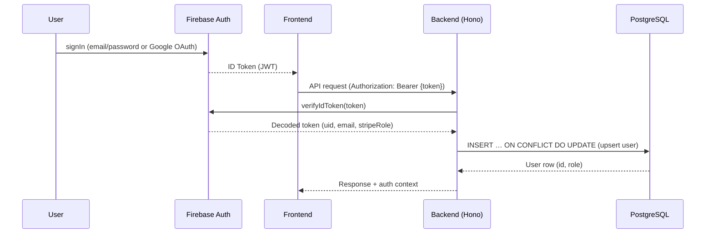

# Project Overview

**ReelStudio** is an AI-powered content intelligence platform. Users discover viral Instagram reels in any niche, receive an AI-generated breakdown of why each reel performs, then generate original hooks, captions, and scripts inspired by that analysis — and optionally schedule them to an Instagram page.

The platform is a SaaS monorepo built on a React + Hono stack with Firebase auth, Stripe subscriptions, PostgreSQL (Drizzle ORM), and Anthropic Claude for AI features.

---

## Tech Stack

### Frontend (`frontend/`)

| Concern | Library |
|---------|---------|
| Framework | React 19 |
| Build tool | Vite |
| Routing | TanStack Router (file-based, `src/routes/`) |
| Data fetching | TanStack Query (React Query v5) |
| Auth | Firebase client SDK |
| UI components | Radix UI + shadcn/ui |
| Styling | Tailwind CSS v4 |
| Forms | react-hook-form + Zod |
| Animations | Framer Motion |
| i18n | react-i18next |
| Testing | Bun test runner |

### Backend (`backend/`)

| Concern | Library |
|---------|---------|
| Runtime | Bun |
| HTTP framework | Hono |
| Database ORM | Drizzle ORM (PostgreSQL) |
| Cache / rate limiting | Redis (ioredis) |
| Auth | Firebase Admin SDK |
| Payments | Stripe |
| Email | Resend |
| Storage | Cloudflare R2 (S3-compatible) |
| AI | Anthropic Claude (Haiku + Sonnet) |
| Observability | Prometheus (`prom-client`) |
| Testing | Bun test runner |

---

## Folder Structure

```
ContentAI/
├── frontend/                  # React SPA
│   └── src/
│       ├── routes/            # File-based routes (TanStack Router)
│       │   ├── (public)/      # Unauthenticated pages (about, pricing, contact, faq…)
│       │   ├── (auth)/        # Sign-in, sign-up
│       │   ├── (customer)/    # Authenticated customer pages (account, checkout, payment/)
│       │   ├── studio/        # Studio workspace (discover, generate, queue)
│       │   └── admin/         # Admin dashboard
│       ├── features/          # Feature modules
│       │   ├── account/       # Profile, usage dashboard, subscription mgmt
│       │   ├── admin/         # Admin views (customers, orders, subscriptions, niches)
│       │   ├── auth/          # AuthGuard, UserButton, auth hooks
│       │   ├── generation/    # AI content generation hooks & history
│       │   ├── reels/         # Reel discovery UI (ReelList, PhonePreview, AnalysisPanel)
│       │   ├── studio/        # Studio workspace shell (TopBar, layout)
│       │   ├── payments/      # Stripe checkout, success handlers
│       │   └── subscriptions/ # Subscription hooks, upgrade prompts, FeatureGate
│       └── shared/            # Cross-cutting code
│           ├── components/    # Radix UI primitives, shadcn/ui
│           ├── constants/     # app.constants.ts — product identity
│           ├── contexts/      # AppContext (auth + profile state)
│           ├── hooks/         # useQueryFetcher, useAuthenticatedFetch
│           ├── lib/           # Query client, query keys
│           ├── services/      # Firebase, API fetch utilities
│           └── utils/         # envUtil, error handling, type guards
│
├── backend/                   # Hono API server (Bun runtime)
│   └── src/
│       ├── index.ts           # Entry point — mounts all routes
│       ├── routes/            # API route handlers (mounted at /api/<resource>)
│       │   ├── auth/          # User registration & Firebase token verification
│       │   ├── customer/      # Authenticated customer profile & orders
│       │   ├── admin/         # Admin CRUD (customers, orders, niches, analytics)
│       │   ├── subscriptions/ # Stripe checkout, subscription status, portal link
│       │   ├── reels/         # Reel discovery, analysis, export
│       │   ├── generation/    # AI content generation & history
│       │   ├── queue/         # Content queue & scheduling
│       │   ├── users/         # User management (admin-only)
│       │   ├── analytics/     # Business analytics
│       │   ├── public/        # Public endpoints (contact form)
│       │   ├── csrf.ts        # CSRF token endpoint
│       │   └── health.ts      # Health, liveness, readiness probes
│       ├── middleware/        # Auth, CSRF, rate limiting, security headers
│       ├── services/          # Business logic (AI, Stripe, email, scraping…)
│       ├── infrastructure/
│       │   └── database/drizzle/  # schema.ts — Drizzle ORM schema + migrations
│       ├── constants/         # Stripe config, rate limits, subscription tiers
│       └── utils/             # envUtil, debug logging
│
├── automation/                # Firebase & Stripe setup scripts
└── docs/                      # This folder
```

---

## System Architecture

```
┌──────────────────────────────────────────────────────────────┐
│                   Browser (React SPA)                        │
│   Vite · TanStack Router · TanStack Query · Firebase SDK     │
└───────────────────────────┬──────────────────────────────────┘
                            │ HTTPS  Authorization: Bearer {token}
                            │ X-CSRF-Token · X-Timezone
┌───────────────────────────▼──────────────────────────────────┐
│                Backend (Hono / Bun, port 3001)               │
│                                                              │
│  Global middleware:                                          │
│    logger() → cors() → secureHeaders()                       │
│                                                              │
│  Per-route middleware:                                       │
│    rateLimiter() → csrfMiddleware() → authMiddleware()       │
│    → validateBody() / validateQuery()                        │
│                                                              │
│  Routes: /api/{auth,customer,admin,subscriptions,           │
│           reels,generation,queue,users,analytics,           │
│           shared,csrf,health,metrics}                        │
└───────┬────────────────┬─────────────┬──────────────────────┘
        │                │             │
   ┌────▼─────┐   ┌──────▼──────┐ ┌───▼────┐
   │PostgreSQL│   │  Firebase   │ │ Stripe │
   │  Drizzle │   │ Auth Admin  │ │  API   │
   └──────────┘   └─────────────┘ └────────┘
        │                              │
   ┌────▼─────┐   ┌─────────────┐ ┌───▼────────────┐
   │  Redis   │   │  Anthropic  │ │ Firebase Stripe │
   │ rate lmt │   │ Claude API  │ │   Extension    │
   └──────────┘   └─────────────┘ └────────────────┘
```

The frontend never talks to the database directly. All data access goes through the Hono API. The Firebase client SDK is used only for authentication; all token verification happens server-side with the Firebase Admin SDK.

---

## Authentication Flow



1. User signs in via Firebase Auth (email/password or Google OAuth)
2. Firebase returns a JWT ID token
3. Frontend attaches the token as `Authorization: Bearer {token}` on every API request
4. Backend `authMiddleware` verifies the token and **upserts** the user in PostgreSQL via Drizzle's `onConflictDoUpdate`
5. Role-based access: `role: "user"` (default) or `role: "admin"` — stored in PostgreSQL (source of truth), synced to Firebase custom claims

---

## Key Systems

### ReelStudio (Core Feature)
- **Discover**: Browse top-performing reels filtered by niche
- **Analysis**: AI (Claude Haiku) breaks down hook patterns, emotional triggers, and format
- **Generation**: AI (Claude Sonnet) remixes content into hooks, captions, and scripts
- **Queue**: Schedule generated content to an Instagram page
- Usage tracked and capped per subscription tier; feature gates enforced server-side

### Subscription System
- Three paid tiers: Basic, Pro, Enterprise (monthly or annual billing)
- Stripe Checkout for new subscriptions; Firebase Stripe Extension syncs subscription state to Firestore
- Subscription tier stored as Firebase custom claim (`stripeRole`)
- Plan changes go through the Stripe Customer Portal only
- Trial eligibility tracked in PostgreSQL (`hasUsedFreeTrial` flag)

### Admin System
- Dashboard with business metrics (MRR, ARPU, churn)
- Manage customers, orders, subscriptions, niches, and reels
- Niche scan jobs (scraping) triggered via admin panel
- Protected by `authMiddleware("admin")`

### Design Token System
All visual theming is centralized in `frontend/src/styles/globals.css`. The token hierarchy is:

```
Primitive palette → Studio aliases → Shadcn/ui semantic vars → Tailwind utilities
```

**To change the theme, edit only `globals.css`:**

| What | Token | Effect |
|------|-------|--------|
| Accent/brand color | `--color-accent` (HSL triplet) | Updates primary, ring, sidebar-primary, chart-1 |
| Background darkness | `--surface-0` → `--surface-top` | Updates bg, card, sidebar, topbar |
| Text contrast | `--text-primary`, `--text-dim-1/2/3` | Updates all text opacities |
| Status colors | `--color-success/warning/error/info` | Updates success/warning/error/info utilities |
| Fonts | `@import` URL + `--font-body`, `--font-mono` | Propagates via `font-sans`/`font-studio`/`font-mono` |

**Tailwind utility classes added:**
- `bg-surface-{0,1,2,top}` / `text-surface-*`
- `text-dim-{1,2,3}` (replaces `text-slate-200/{opacity}`)
- `text-success`, `text-warning`, `text-error`, `text-info` (+ `bg-*` variants)
- `bg-overlay-{xs,sm,md,lg}` / `border-overlay-*` (replaces `bg-white/[0.0X]`)

**ThemeProvider** defaults to `"dark"`, reads `localStorage`, and supports `"system"` for future light/dark switching. The `.dark` class is applied to `<html>`, enabling Tailwind `dark:` variants.

### Security
- **Rate limiting**: Redis-backed, keyed by client IP
- **CSRF**: AES-256-GCM encrypted tokens bound to Firebase UID, required on all mutations
- **CORS**: Allowlist-based, configured via `CORS_ALLOWED_ORIGINS` env var
- **Input validation**: Zod schemas enforced via `validateBody()` / `validateQuery()` middleware
- **Secure headers**: Applied globally via `secureHeaders()` middleware

---

## API Routes

Routes live in `backend/src/routes/` and are mounted at `/api/<resource>` in `backend/src/index.ts`.

| Prefix | Auth | Purpose |
|--------|------|---------|
| `/api/auth/` | None | Register / sync user from Firebase token |
| `/api/customer/` | User | Profile, orders |
| `/api/subscriptions/` | User | Subscription status, checkout, portal link |
| `/api/reels/` | User | Reel discovery, AI analysis, export |
| `/api/generation/` | User | AI content generation, history |
| `/api/queue/` | User | Content queue management & scheduling |
| `/api/admin/` | Admin | Customer, order, niche, analytics management |
| `/api/users/` | Admin | User management |
| `/api/analytics/` | Admin | Business analytics |
| `/api/shared/` | None | Public endpoints (contact form) |
| `/api/csrf` | None | CSRF token generation |
| `/api/health` | None | Health check, liveness, readiness |
| `/api/metrics` | Bearer | Prometheus metrics |

---

## Database Schema (PostgreSQL + Drizzle ORM)

Schema at `backend/src/infrastructure/database/drizzle/schema.ts`.

| Table | Purpose |
|-------|---------|
| `user` | User accounts, roles, profile data, free trial flag |
| `order` | One-time purchases (Stripe session, amount, status) |
| `contact_message` | Contact form submissions |
| `feature_usage` | Per-user feature usage history |
| `niche` | Content niches (name, description, isActive) |
| `reel` | Instagram reel data and engagement metrics |
| `reel_analysis` | AI-generated analysis results per reel |
| `generated_content` | AI-generated hooks, captions, scripts |
| `instagram_page` | Connected Instagram pages (access tokens) |
| `queue_item` | Content scheduling queue |

**Subscriptions** live in **Firestore** (managed by the Firebase Stripe Extension), not PostgreSQL. See [subscription-system.md](./domain/subscription-system.md).

---

## Development Setup

```bash
# Frontend
cd frontend && bun install && bun dev      # http://localhost:3000

# Backend
cd backend && bun install
bun db:generate   # After schema changes (generates Drizzle migrations)
bun db:migrate    # Apply migrations
bun dev           # http://localhost:3001
```

Run tests:
```bash
cd frontend && bun test
cd backend && bun test
```

---

## Environment Variables

Both servers have separate `.env` files. **Never use `process.env` or `import.meta.env` directly** — always go through `envUtil.ts`:

- **Frontend:** `frontend/src/shared/utils/config/envUtil.ts` — `import.meta.env`, vars prefixed with `VITE_`
- **Backend:** `backend/src/utils/config/envUtil.ts` — `process.env`, no prefix needed

### Backend Required Variables

```env
# Firebase Admin
FIREBASE_PROJECT_ID=
FIREBASE_CLIENT_EMAIL=
FIREBASE_PRIVATE_KEY=

# Firebase Client (for Firestore access)
FIREBASE_API_KEY=
FIREBASE_AUTH_DOMAIN=
FIREBASE_STORAGE_BUCKET=
FIREBASE_MESSAGING_SENDER_ID=
FIREBASE_APP_ID=

# Database & Cache
DATABASE_URL=
REDIS_URL=

# Security
CSRF_SECRET=
CORS_ALLOWED_ORIGINS=

# Payments
STRIPE_SECRET_KEY=
STRIPE_WEBHOOK_SECRET=

# Email
RESEND_API_KEY=

# Storage (Cloudflare R2)
R2_ACCOUNT_ID=
R2_ACCESS_KEY_ID=
R2_SECRET_ACCESS_KEY=
R2_BUCKET_NAME=
R2_PUBLIC_URL=

# AI
ANTHROPIC_API_KEY=
ANALYSIS_MODEL=claude-haiku-4-5-20251001
GENERATION_MODEL=claude-sonnet-4-6

# Optional
METRICS_SECRET=
LOG_LEVEL=debug
BASE_URL=
PORT=3001
```

---

*Last updated: March 2026*
