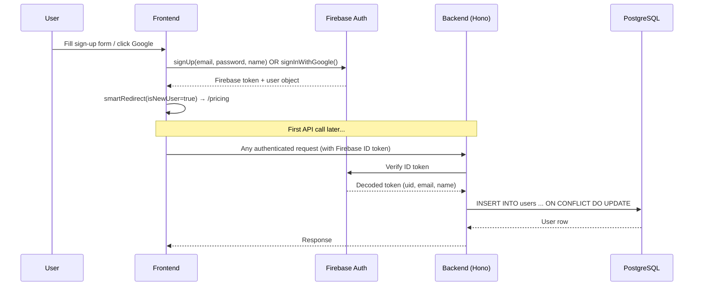
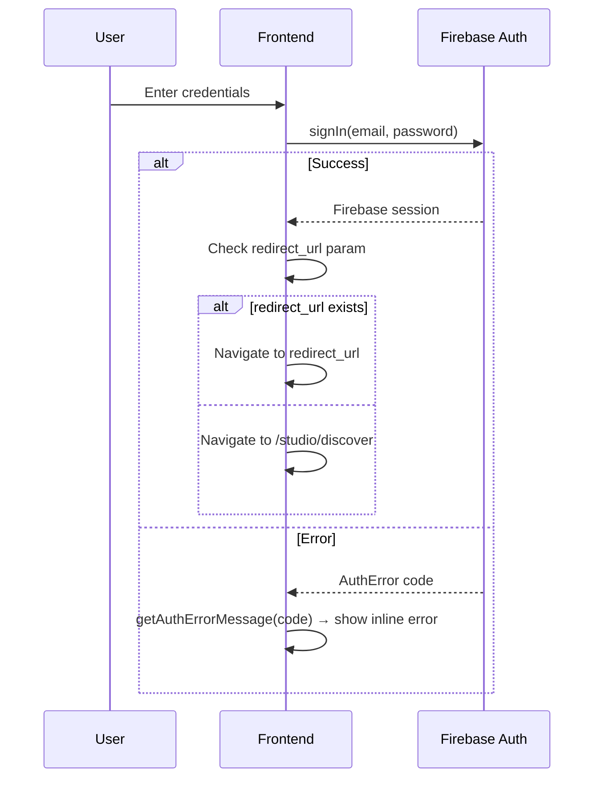
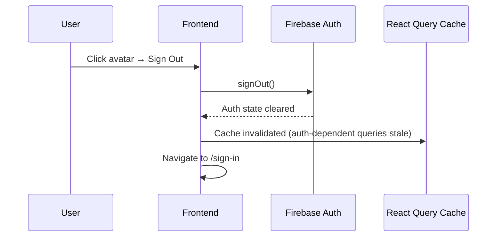
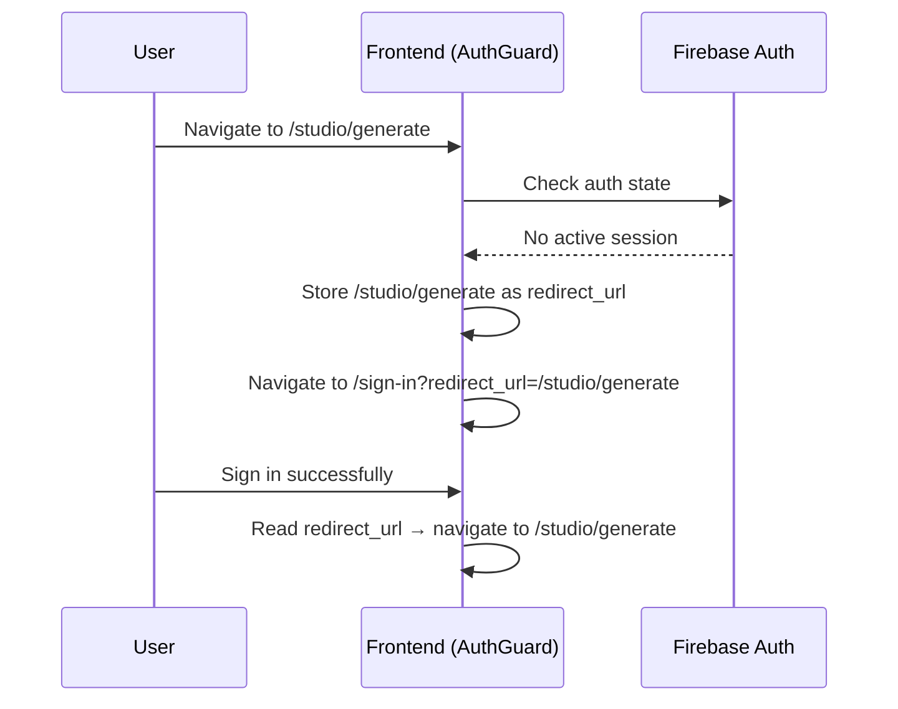
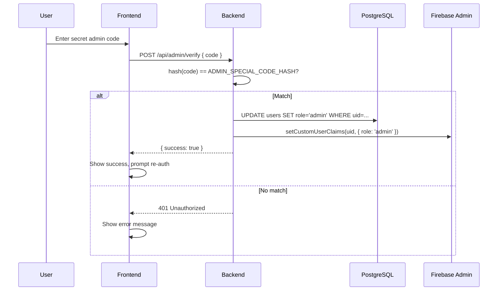

# Authentication Journeys

Covers: Sign Up, Sign In, Sign Out, Auth Guards, and role-based access.

---

## 1. Sign Up (New User Registration)

**Entry:** `/sign-up` or "Get Started" / "Start Free Trial" CTAs on `/` and `/pricing`

**What the user sees:**
- Card with four fields: Full Name, Email Address, Password (min 6 chars, show/hide toggle), Confirm Password
- Trust indicators: "14-day free trial" and "No credit card required"
- "Continue with Google" OAuth button
- Link to `/sign-in` for existing users

**What the user can do:**
- Register with email/password
- Register with Google OAuth

**Steps (email/password):**
1. Fill out the form
2. Frontend validates: passwords match, min length met
3. Firebase `signUp(email, password, name)` called
4. On success → `smartRedirect({ isNewUser: true })` → `/pricing`

**Steps (Google OAuth):**
1. Click "Continue with Google"
2. Firebase `signInWithGoogle()` called
3. On success → `smartRedirect({ isNewUser: true })` → `/pricing`

**Backend side-effect:**
- First authenticated API call triggers `authMiddleware` which upserts the user into PostgreSQL (`users` table) with `role: "user"`

---

## 2. Sign In (Returning User)

**Entry:** `/sign-in` or redirected from any auth-guarded route

**What the user sees:**
- Email and Password fields
- "Continue with Google" button
- Link to `/sign-up`
- Inline error messages for wrong credentials

**Steps:**
1. Enter credentials (or click Google)
2. Firebase `signIn(email, password)` or `signInWithGoogle()` called
3. On success → `smartRedirect({ isNewUser: false })`
   - If `redirect_url` query param exists → navigate to that URL
   - Otherwise → `/studio/discover`

---

## 3. Sign Out

**Entry:** User avatar dropdown in any authenticated page header, or Account sidebar

**Steps:**
1. Click avatar → dropdown → "Sign Out"
2. `logout()` from `useApp()` context calls Firebase `signOut()`
3. Firebase auth state clears
4. React Query cache becomes stale
5. User redirected to `/sign-in`

---

## 4. Auth Guard Behavior

The `AuthGuard` component wraps all protected routes.

| Guard Type | Requires | Redirect When Failed |
|---|---|---|
| `authType="user"` | Any authenticated user | `/sign-in?redirect_url=<original>` |
| `authType="admin"` | `role: "admin"` in user profile | `/` (home) |

**Flow for unauthenticated access to a protected route:**

---

## 5. Admin Role Elevation

**Entry:** `/admin/verify`

**What the user sees:**
- A single input for a secret admin code
- Submit button

**Steps:**
1. Enter secret code
2. `POST /api/admin/verify` — backend hashes input and compares to `ADMIN_SPECIAL_CODE_HASH`
3. On match: PostgreSQL `users.role` updated to `"admin"`, Firebase custom claims updated
4. User re-authenticates (or refreshes token) to pick up new role
5. Can now access all `/admin/*` routes

