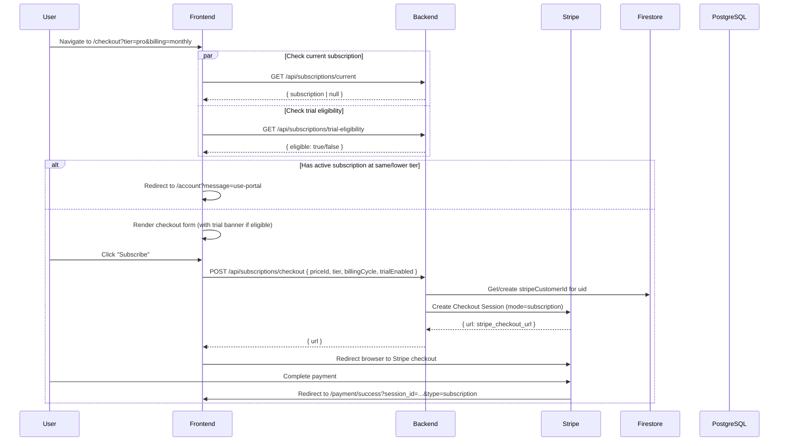
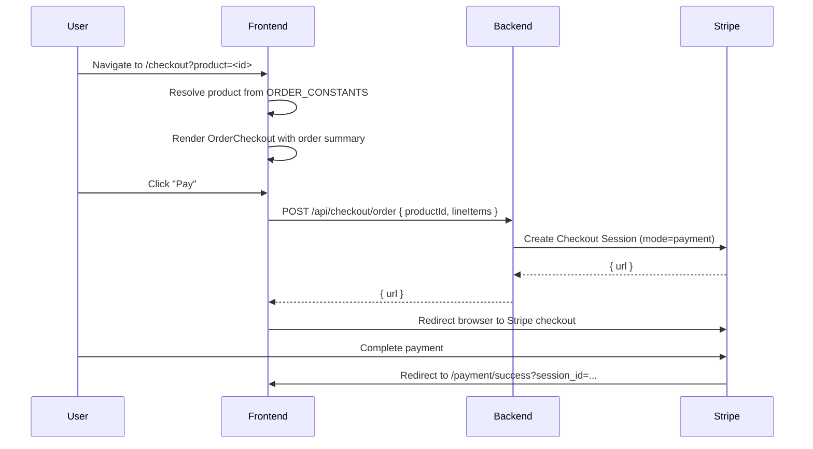
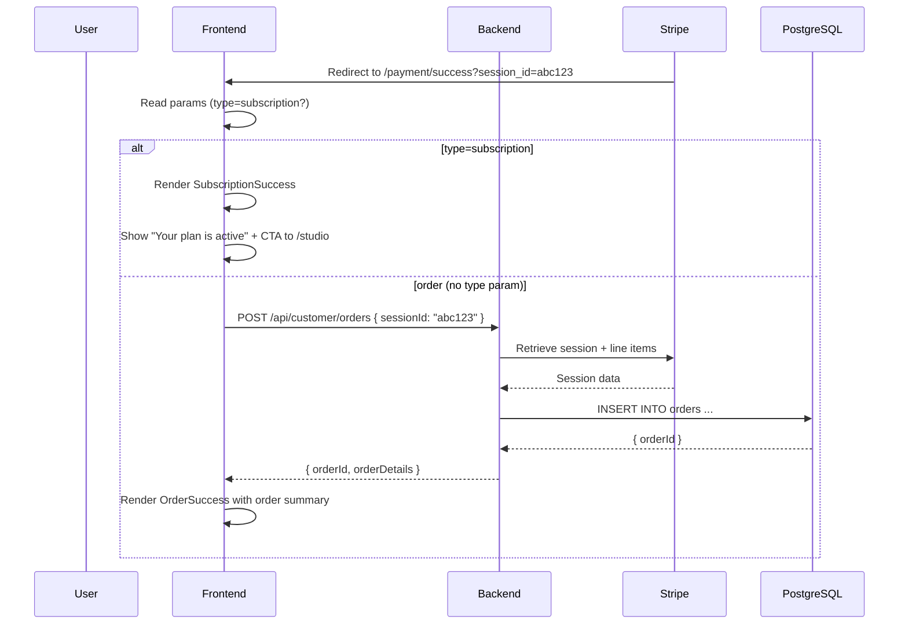
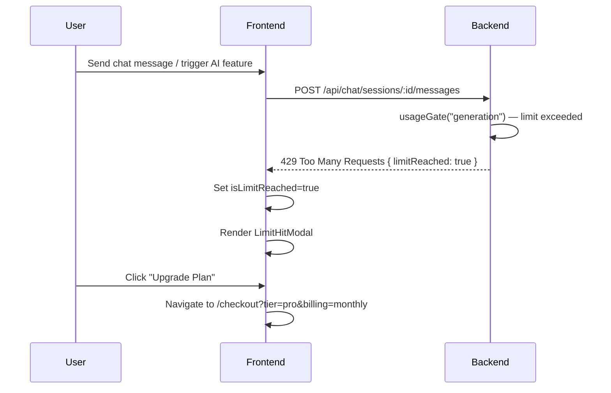
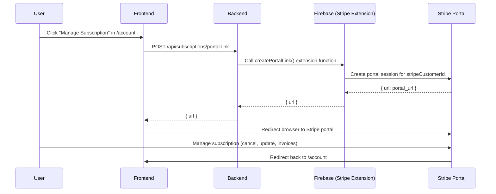

# Subscription & Billing Journeys

Covers: Pricing page, Subscription Checkout, Order Checkout, Payment Success/Cancel, Upgrade flow, Stripe Customer Portal.

---

## 1. Pricing Page

**Entry:** `/pricing` — linked from home hero, nav, sign-up redirect

**What the user sees:**
- Three plan tiers: Basic, Pro, Enterprise
- Monthly / Annual billing toggle (annual shows discount %)
- Feature comparison per tier
- "Get Started" CTA on each plan

**What the user can do:**
- Toggle billing cycle
- Click "Get Started" → goes to `/checkout?tier=<tier>&billing=<monthly|annual>`

---

## 2. Subscription Checkout

**Entry:** `/checkout?tier=pro&billing=monthly` (from pricing page or upgrade prompt)

**Auth:** Required. If unauthenticated, redirected to sign-up with `returnUrl` set, then back to checkout.

**What the user sees:**
- Plan name, price, billing cycle
- Billing cycle toggle to switch monthly/annual
- "14-Day Free Trial" green banner (if trial-eligible)
- "Subscribe" button

**Pre-flight API calls (parallel on page load):**
- `GET /api/subscriptions/current` — check for existing active subscription
- `GET /api/subscriptions/trial-eligibility` — check `hasUsedFreeTrial` flag

**Branching logic:**

| Scenario | Behavior |
|---|---|
| Active subscription at same or lower tier | Redirect to `/account?message=use-portal` |
| Active subscription at lower tier (upgrade) | Proceed with checkout |
| No active subscription, trial eligible | Show trial banner, proceed |
| No active subscription, trial used | Proceed, no trial |

**Steps:**
1. User clicks "Subscribe"
2. `POST /api/subscriptions/checkout` called with `{ priceId, tier, billingCycle, trialEnabled }`
3. Backend:
   - Re-checks trial eligibility
   - Looks up or creates Stripe Customer ID (stored in Firestore `customers/{uid}.stripeId`)
   - Creates Stripe Checkout Session (`mode: "subscription"`, optional `trial_period_days: 14`)
   - Returns `{ url: <stripe_checkout_url> }`
4. Frontend redirects browser to Stripe-hosted checkout
5. After payment → Stripe redirects to `/payment/success?session_id=<id>&type=subscription`

---

## 3. Order Checkout (One-Time Purchase)

**Entry:** `/checkout?product=<productId>` or `/checkout?type=order&item=<name>&price=<amount>`

**What the user sees:**
- Order summary (item name, price)
- Payment form

**Steps:**
1. Product resolved from `ORDER_CONSTANTS` map (or custom line item from params)
2. User clicks "Pay"
3. `POST` to backend creates Stripe Checkout Session with `mode: "payment"`
4. Browser redirected to Stripe-hosted checkout
5. After payment → `/payment/success?session_id=<id>` (no `type=subscription` param)

---

## 4. Payment Success Page

**Entry:** `/payment/success?session_id=<id>` (after Stripe redirect)

**What the user sees:**
- Subscription success: confirmation message, "Go to Studio" CTA
- Order success: order summary, "Go to Studio" CTA

**Logic:**
- If `type=subscription` in URL → render `SubscriptionSuccess`
- If no `type` but has `session_id` and no `order_id` → render `OrderCreator` then `OrderSuccess`

**Order creation flow:**
1. `OrderCreator` calls `POST /api/customer/orders` with `{ sessionId }`
2. Backend reads the Stripe session, extracts line items, creates order record in PostgreSQL
3. Returns `{ orderId }`
4. `OrderSuccess` renders with order details

---

## 5. Payment Cancel Page

**Entry:** `/payment/cancel` (Stripe redirects here if user clicks "back" or closes checkout)

**What the user sees:**
- Friendly cancellation message
- Options: "Return to Pricing", "Contact Support"

No API calls made.

---

## 6. Upgrade Flow (Limit Hit)

**Trigger:** User hits a usage limit during AI generation

**What the user sees:**
- `LimitHitModal` — current usage vs. plan limit
- "Upgrade Plan" CTA button
- Or `UpgradePrompt` wrapped around premium features (visible but locked)

**Steps:**
1. Backend `usageGate` middleware returns `429`
2. Frontend streaming hook sets `isLimitReached: true`
3. `LimitHitModal` renders
4. User clicks "Upgrade Plan" → navigated to `/checkout?tier=<next_tier>&billing=monthly`
5. Checkout detects upgrade scenario (requested level > current level) → proceeds normally

---

## 7. Stripe Customer Portal (Manage Subscription)

**Entry:** `/account` → Subscription tab → "Manage Subscription" button

**What the user can do (inside Stripe portal):**
- View and download invoices
- Update payment method
- Change plan (Stripe-managed)
- Cancel subscription

**Steps:**
1. User clicks "Manage Subscription"
2. `POST /api/subscriptions/portal-link` called
3. Backend calls Firebase Stripe Extension callable function to get a Customer Portal URL
4. Browser redirected to Stripe-hosted portal
5. After managing, user clicks "Return to app" and is sent back to `/account`

