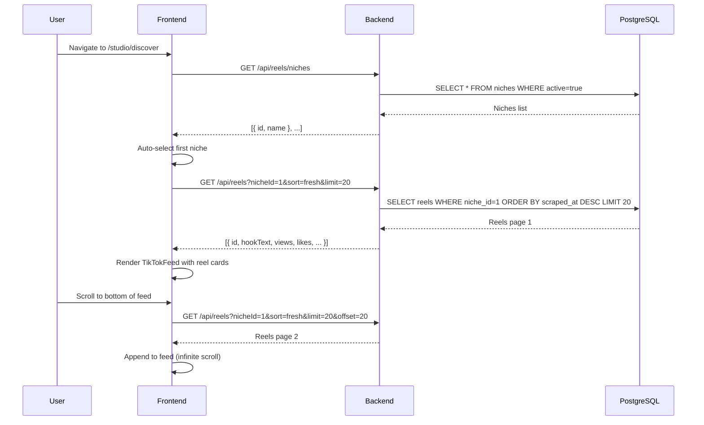
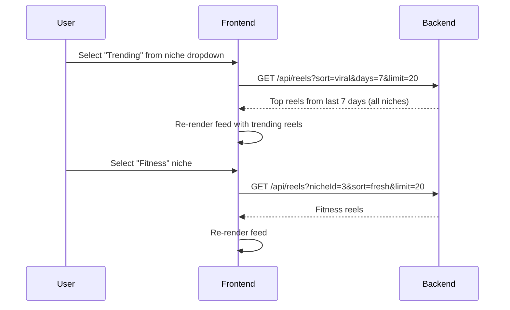
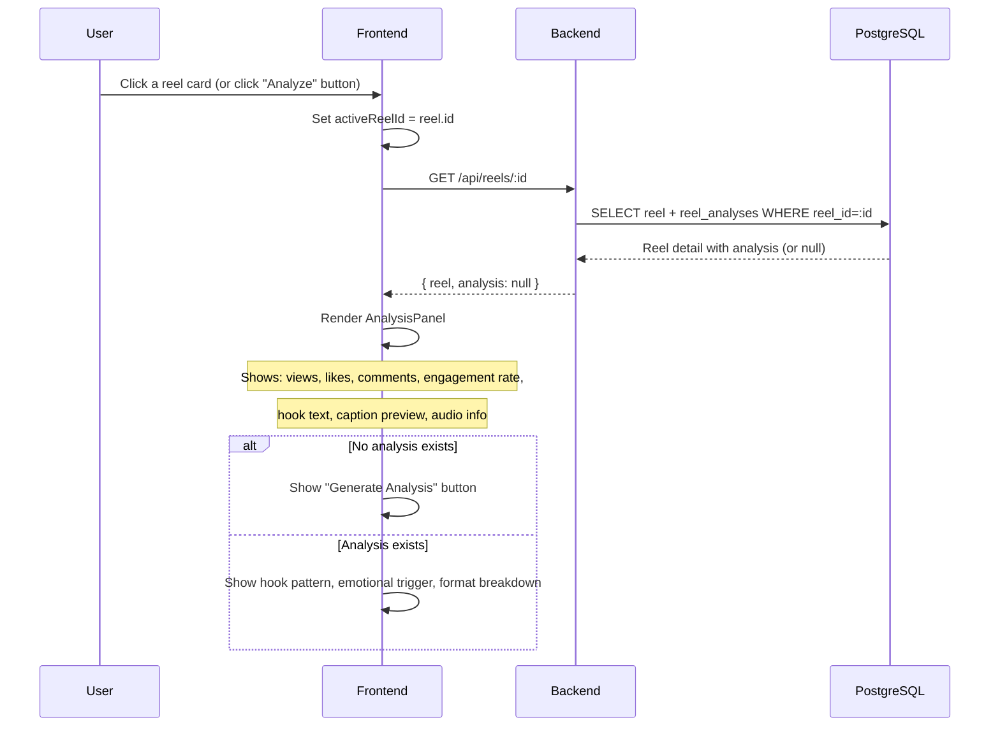
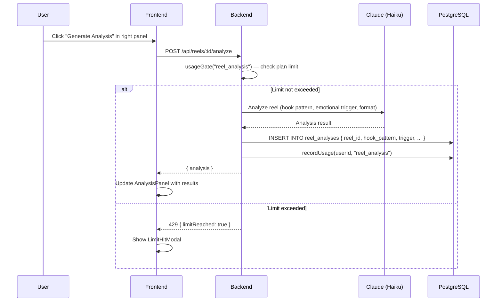
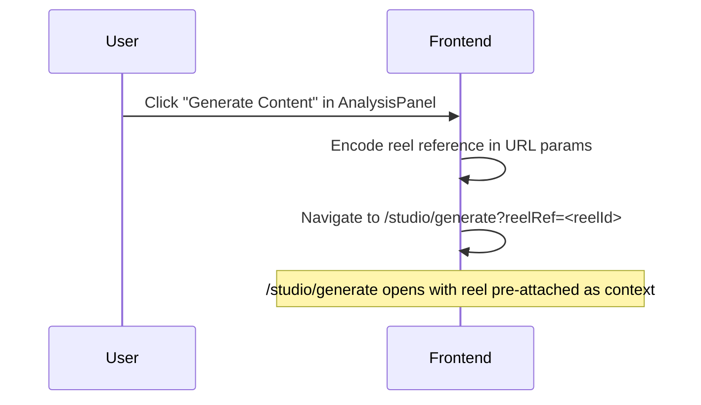

# Discover Journey

**Route:** `/studio/discover`
**Auth:** Required (`authType="user"`)
**Default landing** for returning authenticated users.

---

## Overview

The Discover page is a three-column layout:
- **Left sidebar:** Niche selector + reel list + Trending Audio panel (resizable with draggable divider)
- **Center:** TikTok-style vertical video feed
- **Right:** AI Analysis panel

---

## What the User Sees

**Left sidebar:**
- Dropdown to select a content niche (e.g., "Fitness", "Finance", "Food")
- "Trending" option showing top reels from the last 7 days across all niches
- Scrollable list of reel thumbnails/titles for the selected niche
- Trending Audio panel below (draggable resizer separates the two)

**Center feed:**
- Vertically scrollable TikTok-style video cards
- Each card shows: video preview, engagement stats (views, likes, comments), hook text preview
- "Analyze" button on each card
- Infinite scroll — loads more as user scrolls to bottom

**Right panel:**
- Empty state until a reel is selected: "Select a reel to view analysis"
- When a reel is selected: engagement metrics, hook text, caption preview, audio track info
- "Generate Analysis" button (if no AI analysis yet)
- "Generate Content" button (navigates to `/studio/generate` with reel pre-attached)

---

## Journey: Browse and Discover Reels

---

## Journey: Switch Niches

---

## Journey: View Reel Analysis

---

## Journey: Generate AI Analysis for a Reel

---

## Journey: Generate Content from a Reel

---

## Trending Audio Panel

Located at the bottom of the left sidebar, separated by a draggable resizer.

- Shows top trending audio tracks scraped from the niche
- Each track shows: track name, artist, usage count, preview play button
- Clicking a track filters the reel feed to show reels using that audio

---

## Key Components

| Component | Location | Purpose |
|---|---|---|
| `TikTokFeed` | `features/reels/components/` | Vertical scrollable reel feed |
| `AnalysisPanel` | `features/reels/components/AnalysisPanel.tsx` | Right-side analysis display |
| `GenerateFromReelButton` | `features/reels/components/` | "Generate Content" CTA |
| `NicheSelector` | `features/reels/components/` | Left sidebar niche dropdown |
