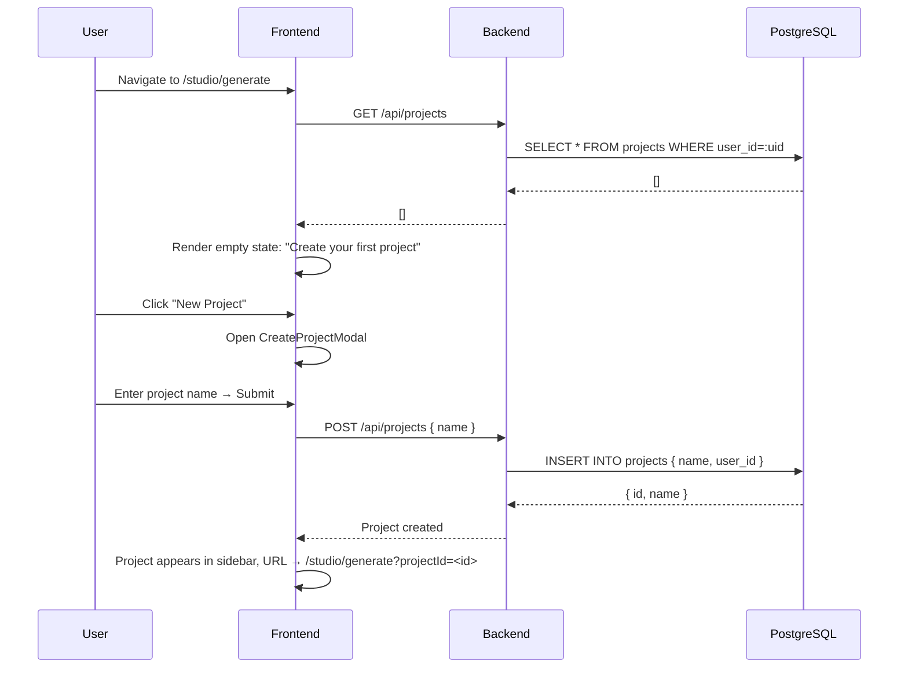
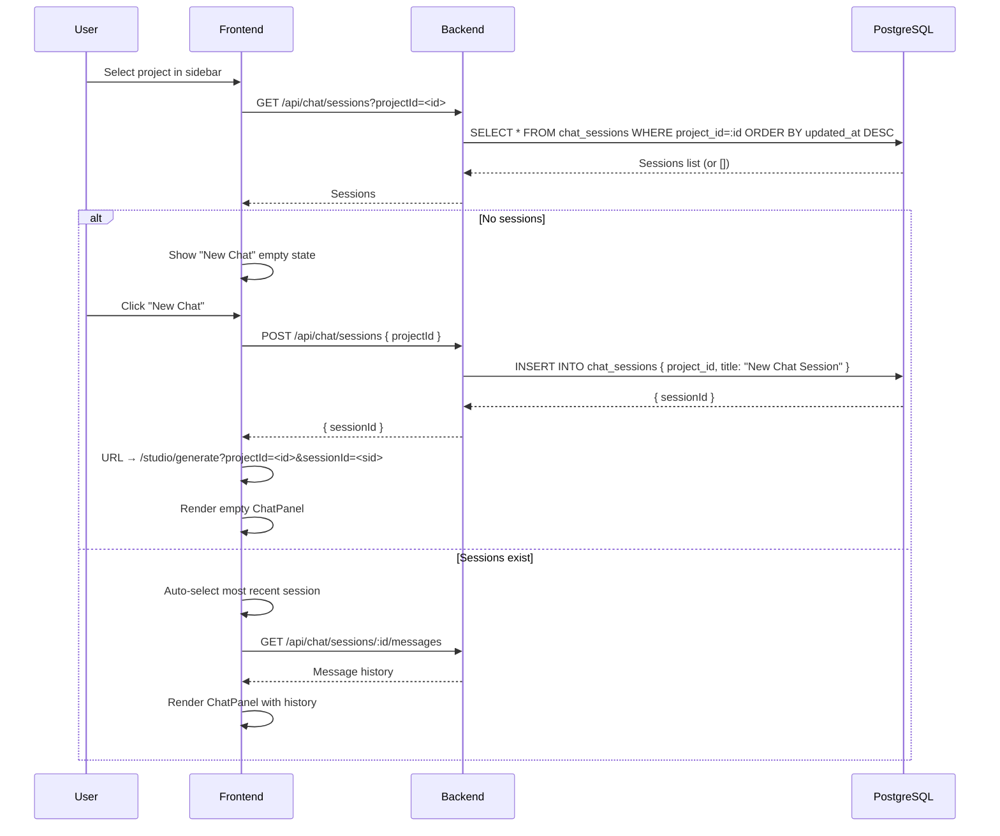
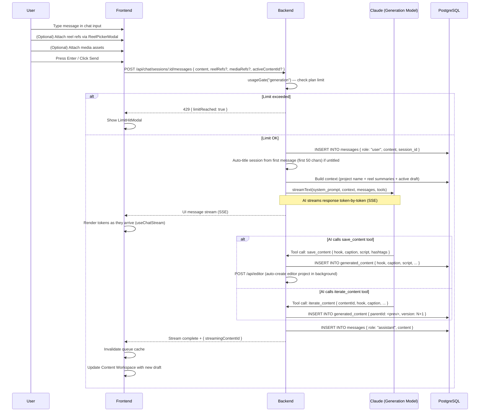
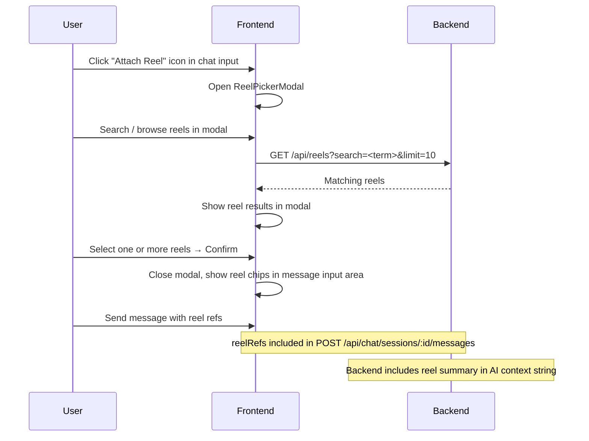
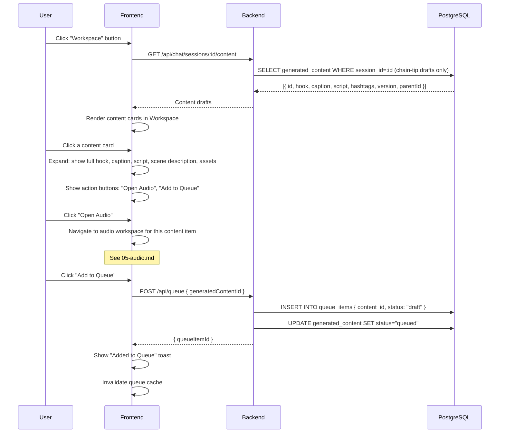
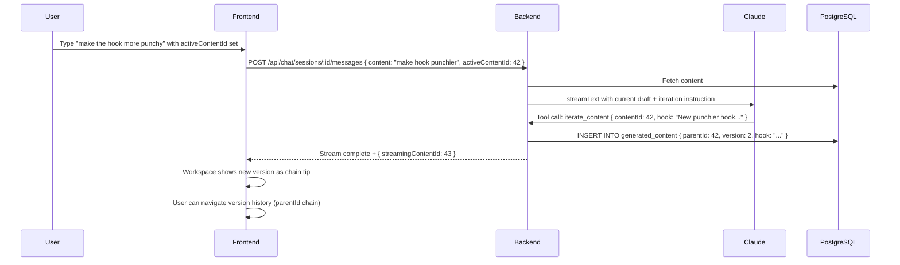

# Generate Journey (AI Content Creation)

**Route:** `/studio/generate`
**Auth:** Required (`authType="user"`)

---

## Overview

The Generate page is the AI chat workspace where users create content. It is a three-column layout:

- **Left sidebar:** Projects list + Chat sessions list per project
- **Center:** Chat panel (message history + input)
- **Right:** Content Workspace (toggleable) — shows generated content drafts

---

## What the User Can Do

- Create and manage **projects** (logical groupings of content)
- Create **chat sessions** within a project
- Chat with an AI assistant to generate social media content
- Attach **reel references** to messages for context
- Attach **media assets** to messages
- Iterate on generated content ("make the hook more punchy")
- View all generated content drafts in the Workspace panel
- Add content to the production queue

---

## Journey: First-Time User (No Projects)



---

## Journey: Create a Chat Session



---

## Journey: Send a Message and Generate Content



---

## Journey: Attach a Reel Reference



---

## Journey: Content Workspace (Right Panel)

The right panel shows all generated content drafts for the current session.

**Toggle:** Click "Workspace" button in session header to open/close.



---

## Journey: Iterate on Generated Content



---

## Content Version Chain

Generated content forms a **version chain** (linked list by `parentId`). The Workspace shows only the chain-tip (latest version) by default, but users can navigate the version history.

```
Content #1 (v1, parentId=null)
    └── Content #2 (v2, parentId=1)
            └── Content #3 (v3, parentId=2)  ← chain tip (shown in Workspace)
```

---

## Key Components

| Component | Location | Purpose |
|---|---|---|
| `ChatLayout` | `features/chat/components/ChatLayout.tsx` | Full three-column generate workspace |
| `ChatPanel` | `features/chat/components/` | Message history + input |
| `ContentWorkspace` | `features/chat/components/` | Right panel showing drafts |
| `ReelPickerModal` | `features/reels/components/` | Reel search + selection for chat context |
| `CreateProjectModal` | `features/projects/components/` | New project form |
