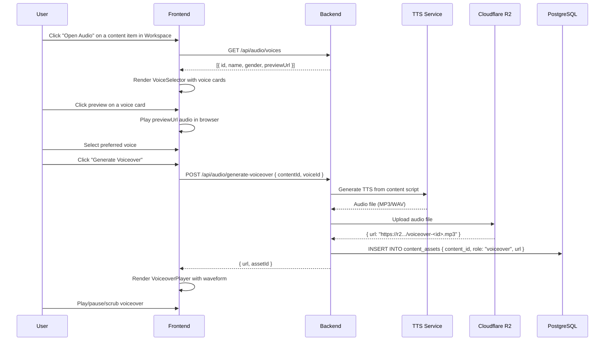
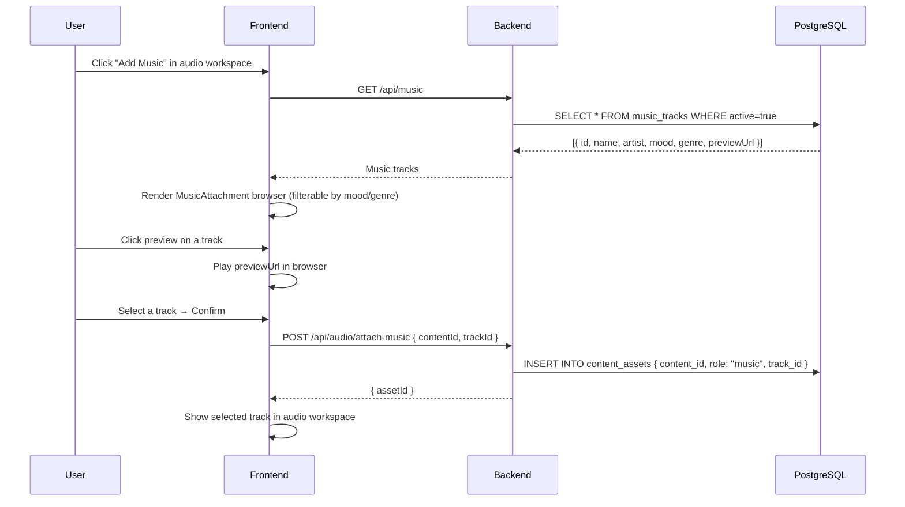
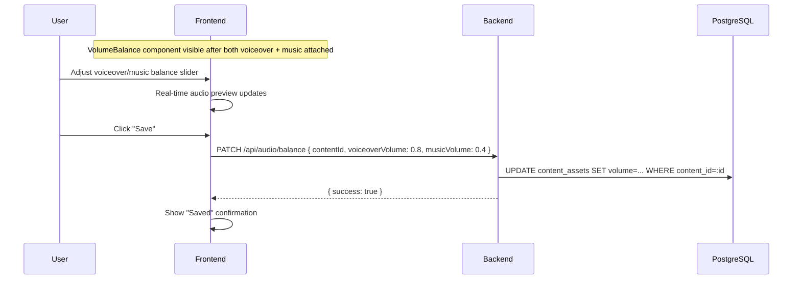
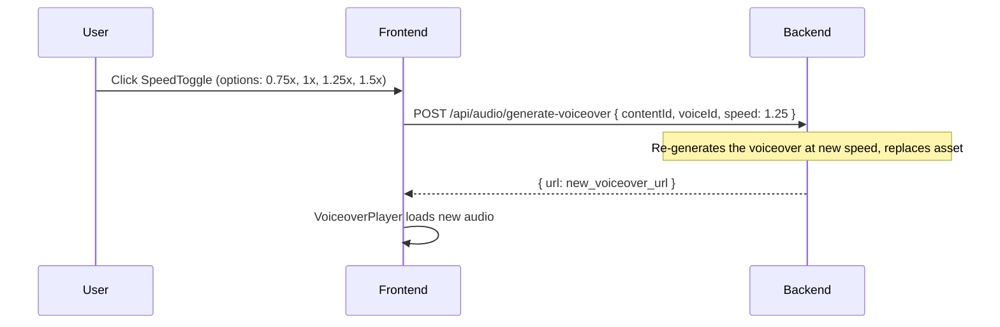

# Audio & Voiceover Journey

**Entry:** Content Workspace in `/studio/generate` → "Open Audio", or Queue detail panel
**Auth:** Required

---

## Overview

After content is generated, users can add audio to it:
1. **Voiceover** — AI-generated text-to-speech from the content script
2. **Background music** — selected from the curated music library
3. **Volume balancing** — adjust relative levels of voiceover vs music

---

## What the User Sees

- **VoiceSelector** — browse available TTS voices with name, gender, preview playback
- **VoiceoverPlayer** — waveform visualization + playback controls after generation
- **MusicAttachment** — music library browser with preview
- **VolumeBalance** — slider UI for voiceover vs music levels
- **SpeedToggle** — adjust TTS playback speed

---

## Journey: Generate a Voiceover

---

## Journey: Attach Background Music

---

## Journey: Balance Volume Levels

---

## Journey: Adjust TTS Speed

---

## Audio Asset Structure

Each content item can have multiple `content_asset` rows:

| Role | Description |
|---|---|
| `voiceover` | AI-generated TTS audio uploaded to R2 |
| `music` | Reference to a `music_track` row |
| `video_clip` | Video clips for the editor |

---

## Key Components

| Component | Purpose |
|---|---|
| `AudioPlayer` | Base audio playback component |
| `VoiceSelector` | Browse and preview TTS voices |
| `VoiceoverPlayer` | Waveform + controls for generated voiceover |
| `MusicAttachment` | Music library browser |
| `VolumeBalance` | Voiceover vs music level slider |
| `SpeedToggle` | TTS playback speed selector |
