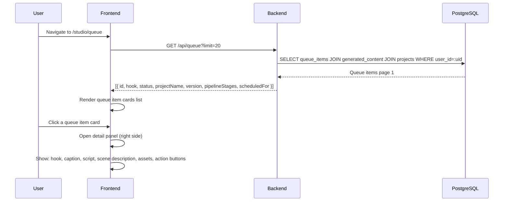
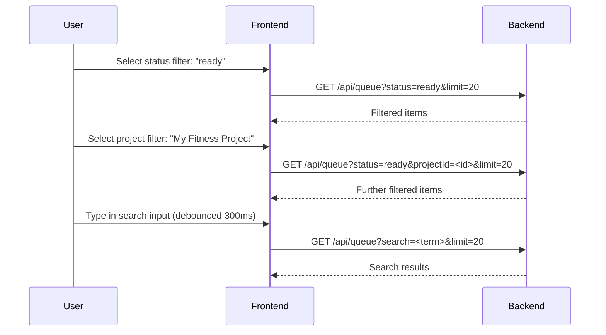
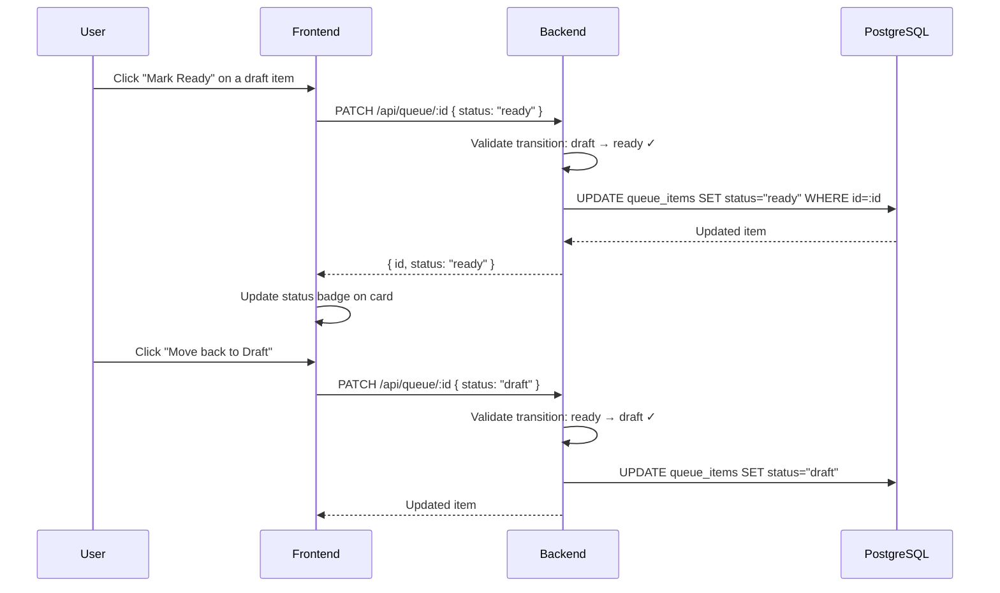
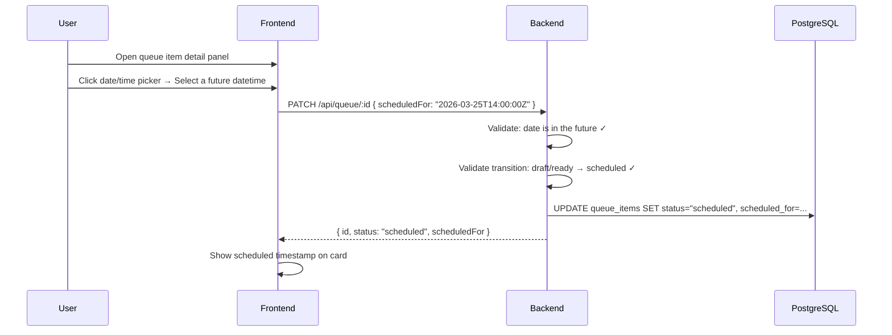
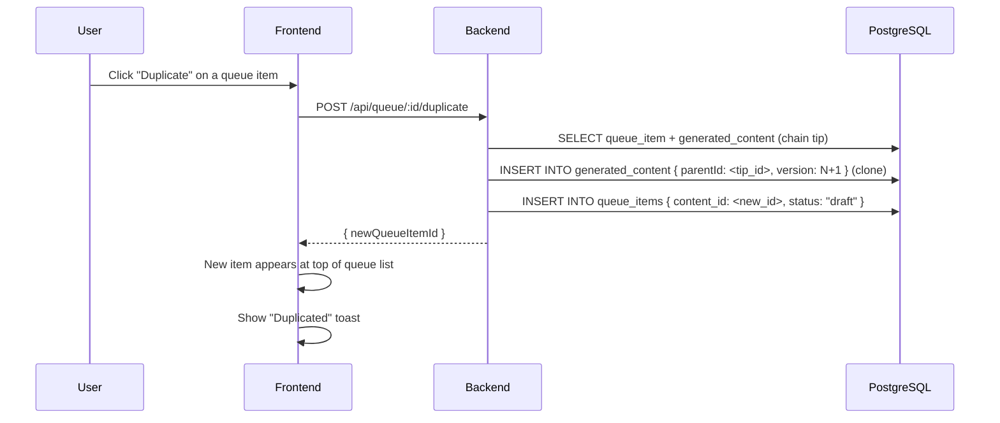
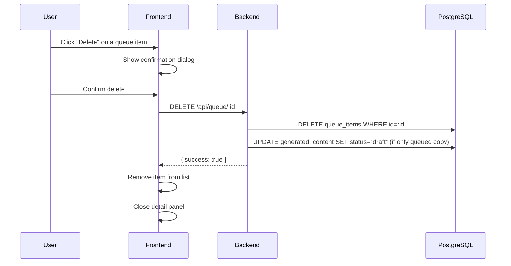
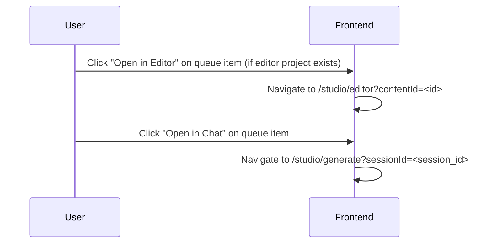
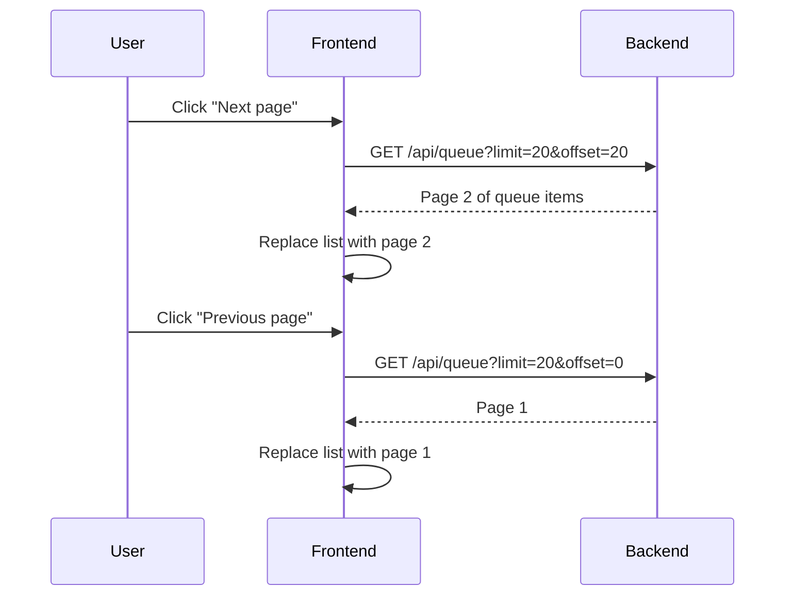

# Queue Management Journey

**Route:** `/studio/queue`
**Auth:** Required (`authType="user"`)

---

## Overview

The Queue is the content production pipeline. Content generated in the AI chat moves through a series of stages before it is posted to social media.

**Layout:** Filter bar at top, queue item list on the left, detail panel on the right.

---

## Pipeline Stages

Each queue item progresses through these stages (tracked via asset counts):

```
Copy → Voiceover → Video Clips → Assembly → Manual Edit → Export
```

Progress through stages is derived from the assets attached to the content item — it is not a separate state machine column; the backend computes stage completion from the `content_assets` table.

---

## Queue Item Statuses

| Status | Meaning | Valid Transitions |
|---|---|---|
| `draft` | Work in progress | → `ready`, `scheduled` |
| `ready` | Content finalized, ready to post | → `draft`, `scheduled` |
| `scheduled` | Has a future post date/time set | → `ready`, `posted` |
| `posted` | Published (terminal state) | — |
| `failed` | Something went wrong | → `draft` (retry) |

Status transitions are validated server-side. Invalid transitions return a `400` error.

---

## Journey: Browse the Queue



---

## Journey: Filter the Queue



---

## Journey: Update Queue Item Status



---

## Journey: Schedule a Queue Item



---

## Journey: Duplicate a Queue Item



---

## Journey: Delete a Queue Item



---

## Journey: Open Queue Item in Editor or Chat



---

## Journey: Pagination



---

## Key Components

| Component | Purpose |
|---|---|
| `QueueList` | Left-side scrollable list of queue items |
| `QueueItemCard` | Individual card showing hook, status badge, pipeline stages |
| `QueueDetailPanel` | Right-side full detail view + action buttons |
| `PipelineStages` | Visual stage progress tracker (Copy → Export) |
| `StatusBadge` | Color-coded status indicator |
