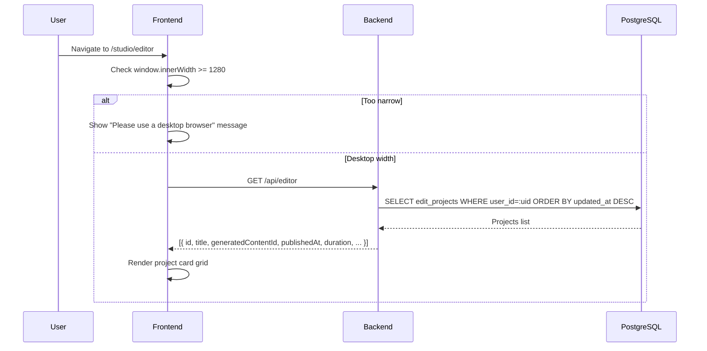
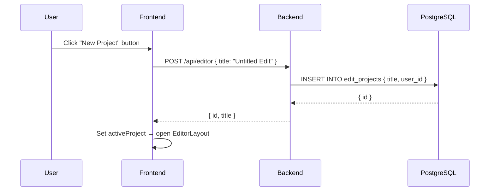
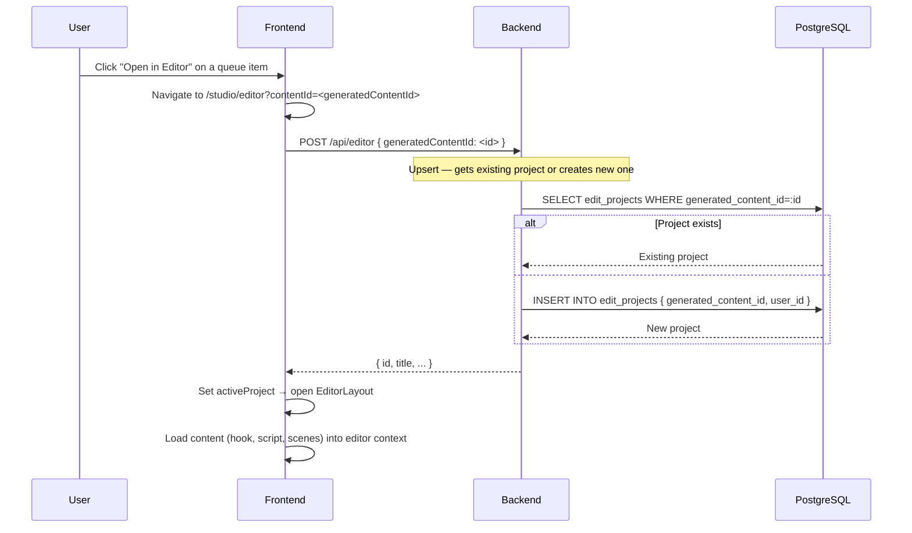
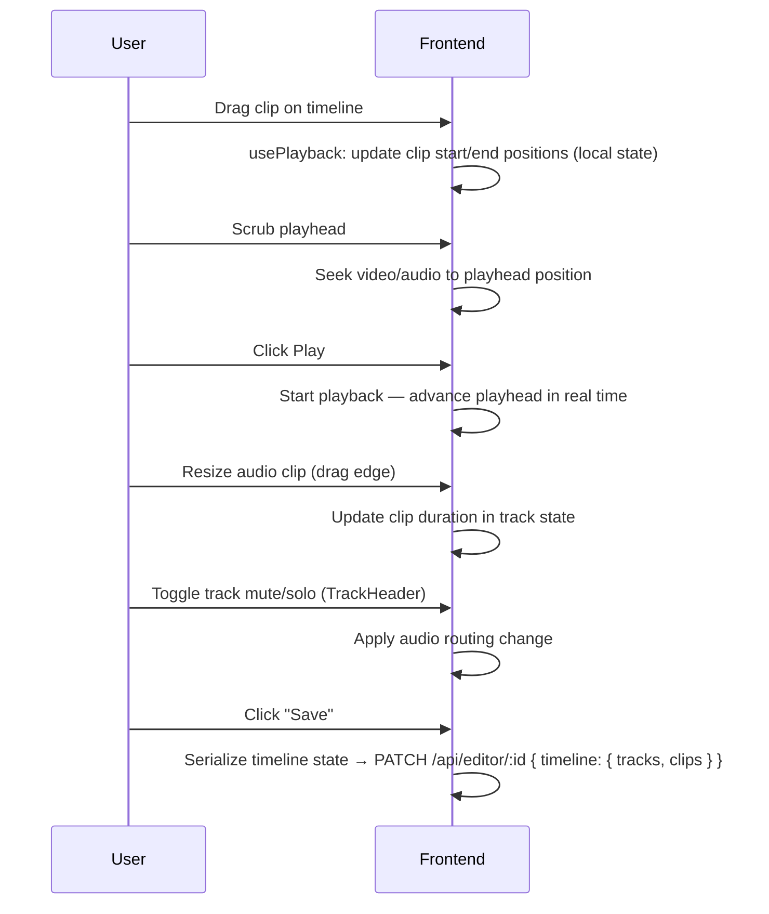
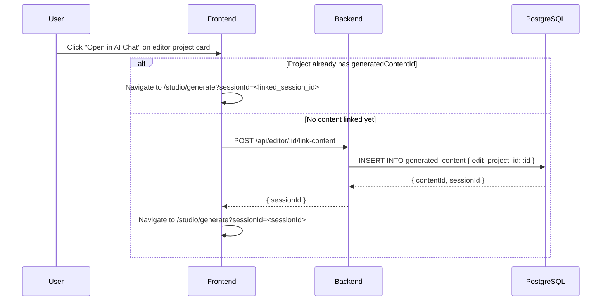
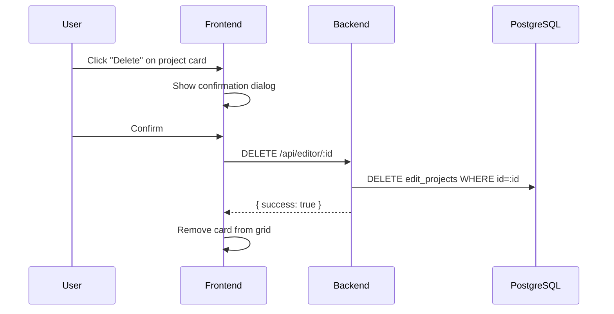

# Editor Journey (Timeline Editor)

**Route:** `/studio/editor`
**Auth:** Required (`authType="user"`)
**Desktop only:** Requires viewport width ≥ 1280px. Smaller screens see a message instead of the editor.

---

## Overview

The Editor is a timeline-based video editing workspace for assembling final content. Editor projects link to generated content items and can be opened from the Queue.

**Layout (Project List View):** Grid of project cards.
**Layout (Editor View):** Full-screen timeline editor with tracks, clips, and playback controls.

---

## What the User Sees (Project List)

- Grid of editor project cards
- Each card shows: thumbnail placeholder, title (or generated hook text), version badge, "published" badge if applicable, date, duration
- "New Project" button in header
- Actions per card: "Open", "Open in AI Chat", "Delete"

---

## What the User Sees (Timeline Editor)

- Playhead for scrubbing through the timeline
- Track headers with track labels and controls
- Timeline clips draggable on tracks
- Waveform visualization for audio tracks
- Playback controls (play/pause/stop, current time display)

---

## Journey: Open the Editor (from /studio/editor)

---

## Journey: Create a New Editor Project (Manual)

---

## Journey: Open Editor from Queue / Content ID

---

## Journey: Work in the Timeline Editor

---

## Journey: Link to AI Chat from Editor

---

## Journey: Delete an Editor Project

---

## Auto-Creation of Editor Projects

When the AI generates new content in `/studio/generate`, the backend automatically calls `POST /api/editor` in the background to create an editor project linked to that content. This means by the time the user navigates to `/studio/editor`, a project already exists for their new content.

---

## Key Components

| Component | Purpose |
|---|---|
| `EditorLayout` | Full-screen timeline editor container |
| `Playhead` | Scrubbing indicator on the timeline |
| `TrackHeader` | Track label, mute/solo controls |
| `TimelineClip` | Draggable/resizable clip block on a track |
| `useWaveform` | Hook for rendering audio waveform |
| `usePlayback` | Hook for playback state and controls |
