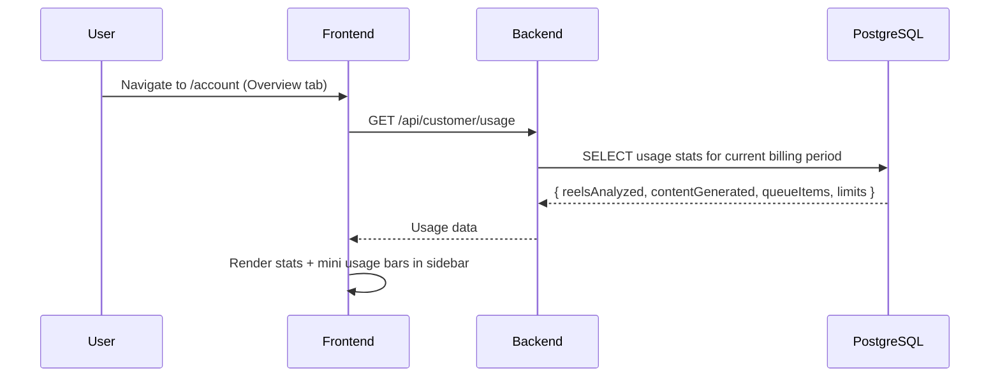
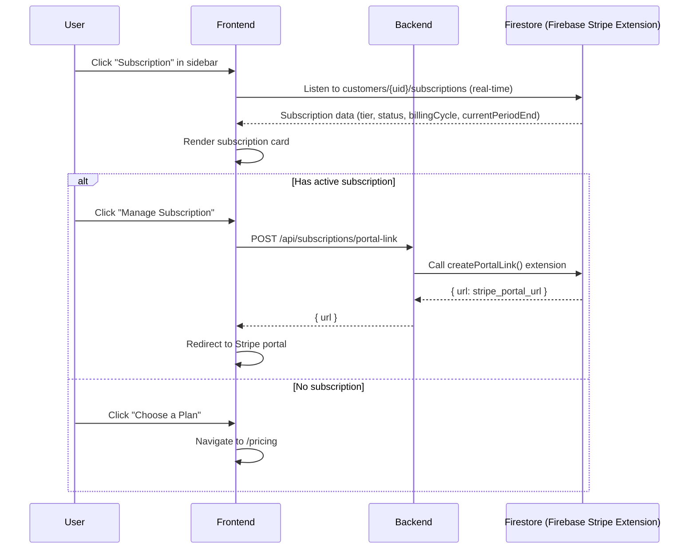
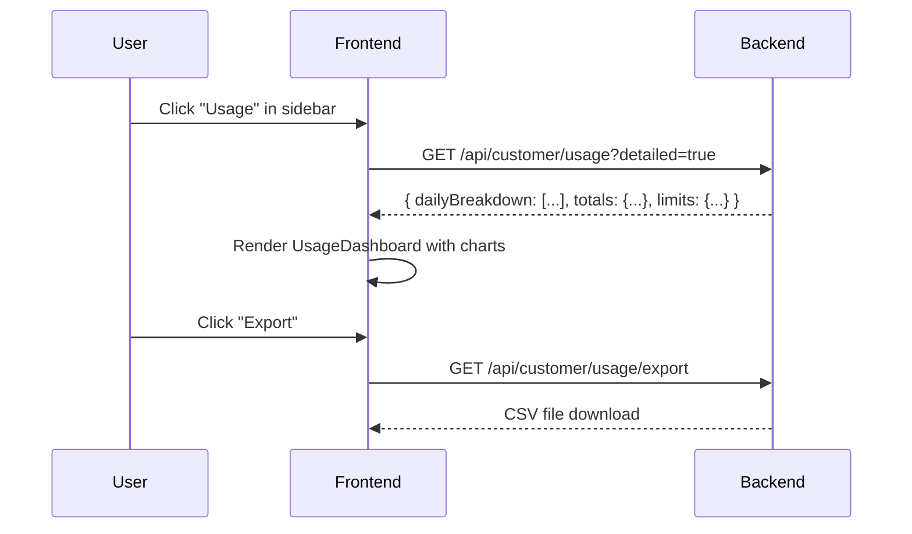
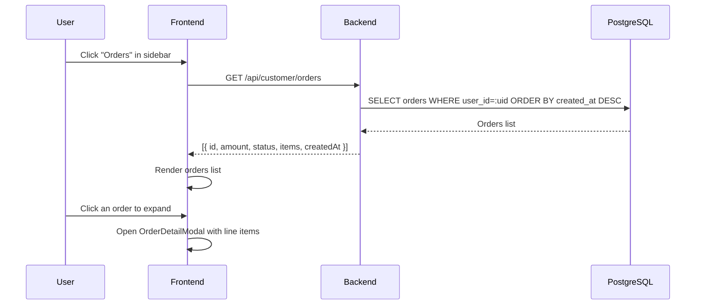
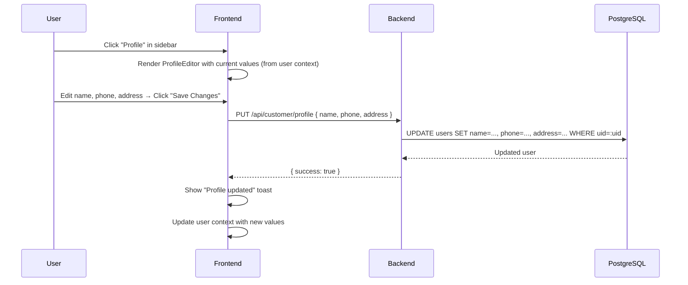
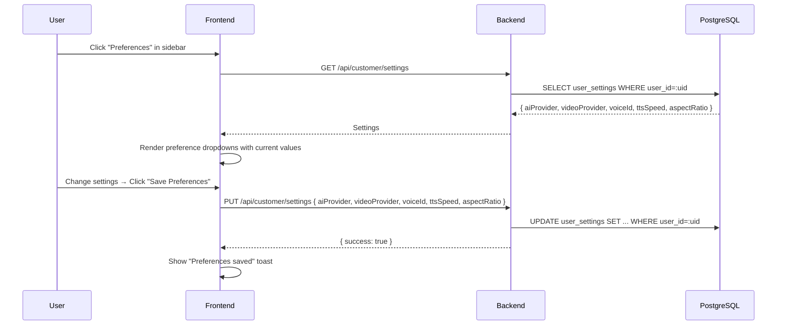
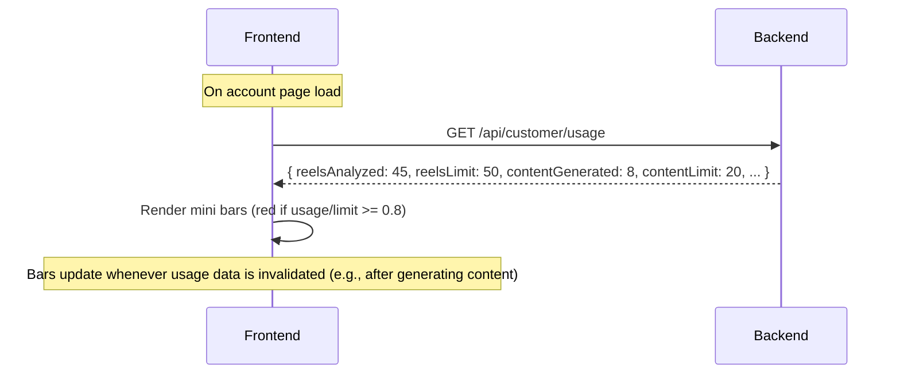

# Account Management Journey

**Route:** `/account`
**Auth:** Required (`authType="user"`)
**Entry:** User avatar → "Account" in header dropdown, or direct navigation

---

## Overview

The Account page is the user's self-service hub.

**Layout:** Left sidebar with navigation links + usage bars → right content area with the selected section.

---

## Sidebar (Always Visible)

- User name and email
- Navigation links: Overview, Subscription, Usage, Orders, Profile, Preferences
- Mini usage bars for:
  - Reels Analyzed (turns red at ≥80% of plan limit)
  - Content Generated (turns red at ≥80%)
  - Queue Items (turns red at ≥80%)
- "Open Studio" quick-link button

---

## Section: Overview

**What the user sees:**
- Studio stats: Content Generated, Queue Items, Reels Analyzed (counts from `GET /api/customer/usage`)
- Quick action: "Open Studio" → `/studio/discover`

---

## Section: Subscription

**What the user sees:**
- Current plan: tier name, billing cycle (monthly/annual), status (active/trialing/canceled), next billing date
- "Manage Subscription" button → opens Stripe Customer Portal
- If no active subscription: "Choose a Plan" CTA → `/pricing`
- Usage bar: monthly usage vs plan limit

**What the user can do:**
- Manage billing via Stripe portal (change payment method, view invoices, cancel, change plan)
- Navigate to pricing to subscribe

---

## Section: Usage

**What the user sees:**
- Detailed usage statistics for the current billing period
- Charts/graphs of usage over time
- Usage vs. plan limit for each resource type
- Export button to download usage data as CSV

---

## Section: Orders

**What the user sees:**
- List of past one-time purchases
- Each order: date, item name, amount, status (pending/completed/refunded)
- Expandable detail view per order

---

## Section: Profile

**What the user sees:**
- Full Name field (editable)
- Email (read-only for OAuth users; note explains why)
- Phone Number field
- Address fields
- "Save Changes" button

---

## Section: Preferences

**What the user sees:**
- AI provider preference (dropdown)
- Video provider preference (dropdown)
- Preferred TTS voice ID (dropdown, same voices as in audio workspace)
- Preferred TTS speed (dropdown)
- Preferred aspect ratio (dropdown: 9:16, 1:1, 16:9)
- "Save Preferences" button

---

## Sidebar Usage Bar Logic

The mini usage bars in the sidebar are always visible and update reactively:

