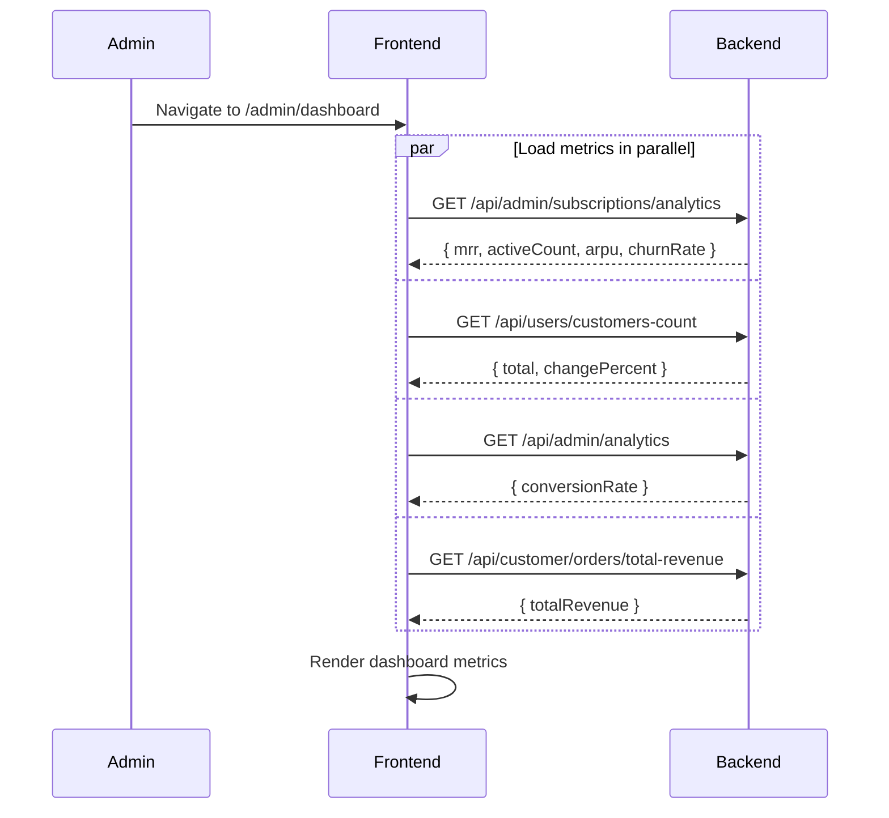
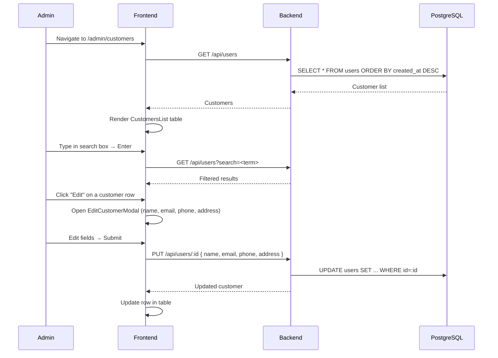
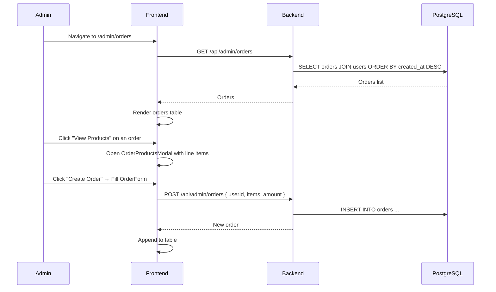
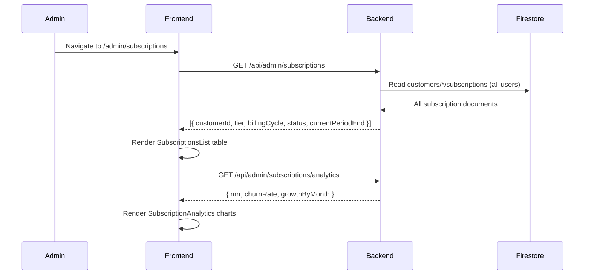
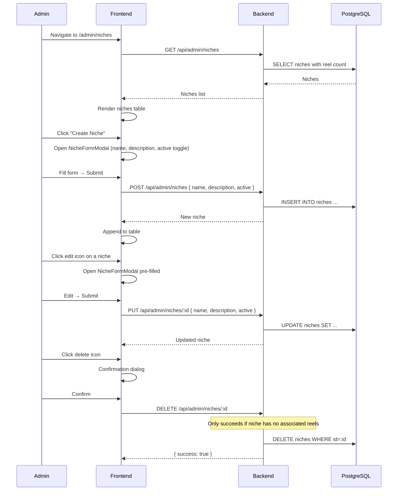
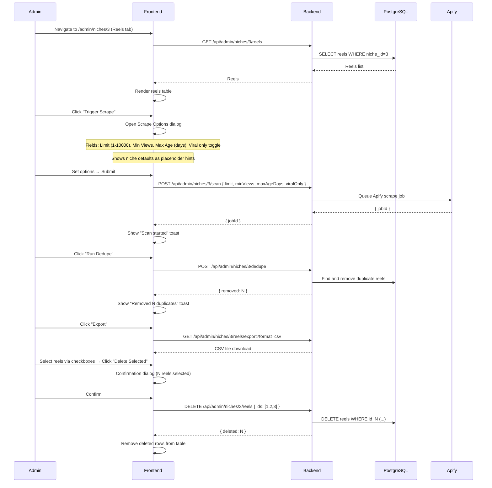
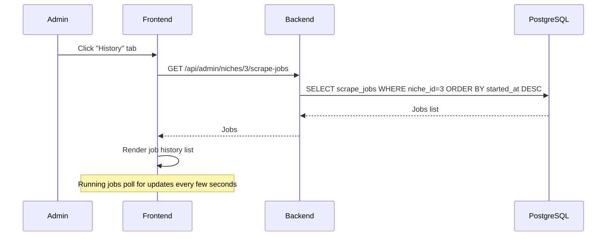
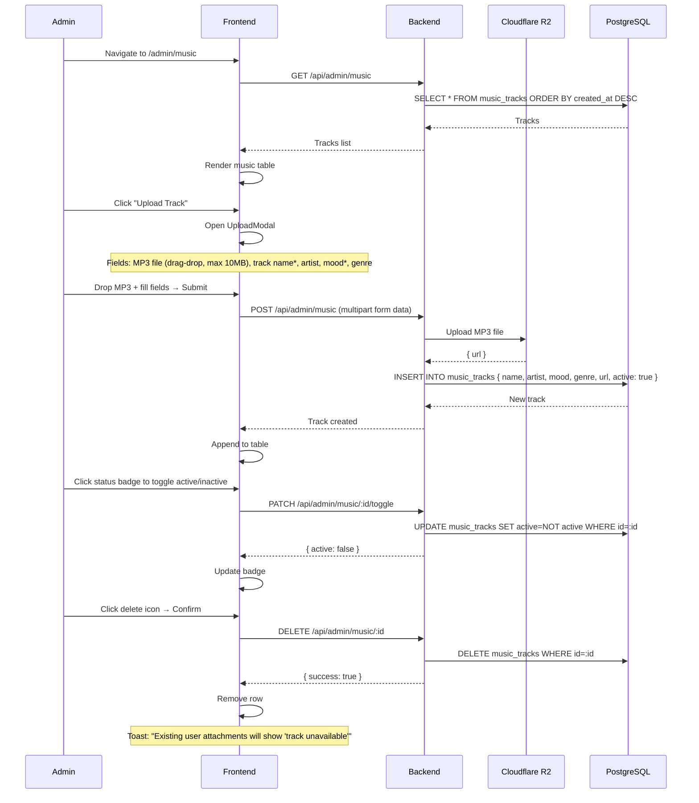
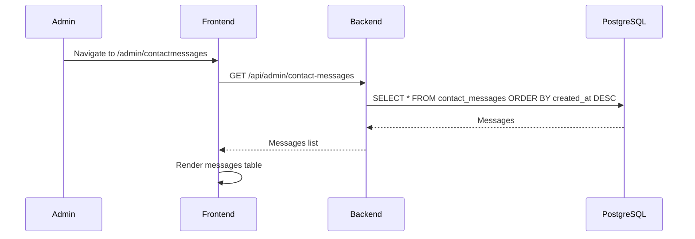
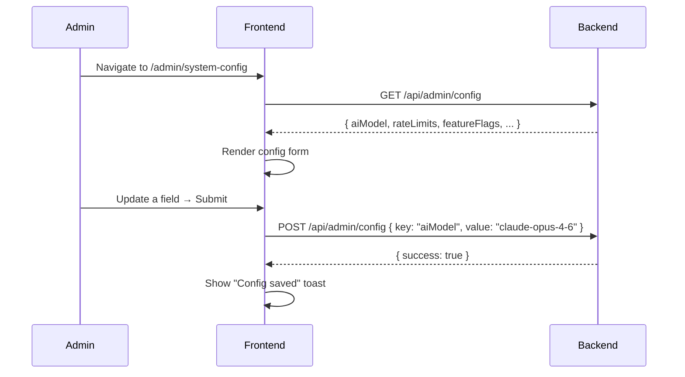

# Admin Journeys

**Routes:** `/admin/*`
**Auth:** Required (`authType="admin"` — users without `role: "admin"` are redirected to home)
**Role elevation:** See [01-authentication.md](./01-authentication.md) — Admin Role Elevation section

---

## Admin Route Map

```
/admin/verify              — Role elevation (enter secret code)
/admin/dashboard           — Metrics overview
/admin/customers           — Customer CRUD
/admin/orders              — Order management
/admin/subscriptions       — Subscription analytics
/admin/niches              — Niche CRUD
/admin/niches/$nicheId     — Niche detail (reels, scrape history, analytics)
/admin/music               — Music library management
/admin/settings            — Admin's own profile settings
/admin/developer           — Developer tools
/admin/contactmessages     — Inbound contact form messages
/admin/system-config       — System-level configuration
```

---

## 1. Dashboard

**Entry:** `/admin/dashboard` (default after `/admin/`)

**What the admin sees:**
- Monthly Recurring Revenue (MRR) with trend
- Active Subscriptions count
- Average Revenue Per User (ARPU)
- Churn Rate
- Total Customers count (with % change vs. last month)
- Conversion Rate
- Total Revenue
- AI Cost Dashboard (per-model cost breakdown)
- Recent Orders (last 5) with link to `/admin/orders`
- Subscription summary with link to `/admin/subscriptions`



---

## 2. Customer Management

**Entry:** `/admin/customers`

**What the admin sees:**
- Search input (search by name or email)
- Three tabs: All / Active / Inactive
- Customer table: name, email, role, status, created date
- "Edit" button per row

**What the admin can do:**
- Search customers
- Filter by active/inactive status
- Edit customer details



---

## 3. Order Management

**Entry:** `/admin/orders`

**What the admin sees:**
- Search + filter bar
- Paginated orders table: customer name, amount, status, date
- "Create Order" button
- "View Products" button per order



---

## 4. Subscription Management

**Entry:** `/admin/subscriptions`

**What the admin sees:**
- Top metrics: active count, MRR, churn rate
- Subscriptions list table: customer, tier, billing cycle, status, period end
- Analytics charts: subscription growth, revenue trends over time



---

## 5. Niche Management

### 5a. Niche List Page

**Entry:** `/admin/niches`

**What the admin sees:**
- Table of all niches: ID, name, status (active/inactive), reel count
- Search filter + "Active Only" toggle
- "Create Niche" button



### 5b. Niche Detail Page (Reels Tab)

**Entry:** `/admin/niches/$nicheId` → Reels tab

**What the admin sees:**
- Reels table: hook, views, likes, engagement rate, duration, viral flag, has analysis, audio, caption, job ID, saved date
- Filters: All / Viral only / Non-viral / Has Video
- Sort by: views, likes, engagement, posted date, scraped date (with direction toggle)
- Checkboxes for bulk select
- Action buttons: "Trigger Scrape", "Run Dedupe", "Export", "Delete Selected"
- Eye icon per row to expand full reel detail



### 5c. Niche Detail Page (History Tab)

**Entry:** `/admin/niches/$nicheId` → History tab

**What the admin sees:**
- List of all past scrape jobs: job ID, status (scanning/complete/failed), reels saved, reels skipped, duration, started time
- Running jobs show "Scanning…" spinner
- Completed jobs show "Scan complete — N saved, M skipped in Xs"



---

## 6. Music Library Management

**Entry:** `/admin/music`

**What the admin sees:**
- Table: name, artist, mood, genre, duration, active/inactive status badge
- Search by track name
- "Upload Track" button



---

## 7. Admin Settings (Profile)

**Entry:** `/admin/settings`

**What the admin sees:**
- Name field (editable)
- Email (read-only)
- Phone, Address fields
- Role (read-only display: "admin")
- Password change section: current, new, confirm

**Steps:**
1. Edit fields → Save → `PUT /api/customer/profile`
2. Password change flow (form-based; backend validates current password)

---

## 8. Contact Messages

**Entry:** `/admin/contactmessages`

**What the admin sees:**
- Table of all inbound contact form submissions
- Columns: name, phone, subject, message, received date
- Read-only; no reply/archive actions in UI



---

## 9. System Config

**Entry:** `/admin/system-config`

**What the admin sees:**
- System-wide configuration panel
- Fields for: AI models, rate limit values, feature flags, and other global settings



---

## 10. Developer Tools

**Entry:** `/admin/developer`

Admin-only developer tooling. Protected by `authType="admin"` guard. Contains API key management, debug information, and internal tooling for the engineering team.
