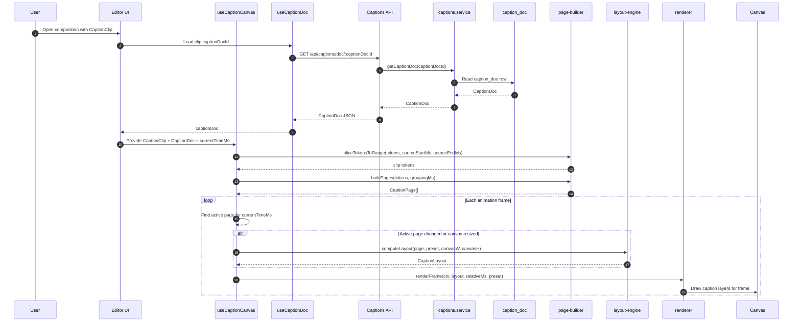

# Low-Level Design: Caption Engine v2

Complete type definitions, function signatures, API contracts, DB schema, and component specifications.

These definitions are normative. Example payloads later in the document sometimes omit incidental implementation detail for readability, but the contracts and field names in this file are the source of truth.

---

## TypeScript Type System

Codebase-aligned ownership:
- Timeline clip/project/action types stay in `frontend/src/features/editor/types/editor.ts`
- Backend timeline JSON types stay in `backend/src/types/timeline.types.ts`
- Caption renderer/layout/preset-only types live in `frontend/src/features/editor/caption/types.ts`
- Route validation schemas stay in `backend/src/domain/editor/editor.schemas.ts`

### Core Data Types

Terminology:
- `Token` is the canonical data-model term and should be used now.
- UI copy may still say "word" where that is more natural for users.
- `Token` is the persisted transcript unit in `CaptionDoc`.
- `PageToken` is a grouped, page-local projection of a `Token`.
- `PageToken` repeats `startMs` and `endMs` on purpose so `CaptionPage` is self-contained for preview and export.

```typescript
// ─── Transcription Data ──────────────────────────────────────────────────────

/**
 * A single timestamped display token from Whisper (or manual entry).
 * This is intentionally named `Token`, not `Word`.
 *
 * Even in English, transcript units stop being clean "words" once users can
 * split/merge punctuation, emojis, abbreviations, or names. The data model
 * should match what the renderer and editor manipulate: timed display tokens.
 */
export interface Token {
  text: string;
  startMs: number;
  endMs: number;
}

/**
 * A CaptionDoc is a persisted editable transcript owned by one CaptionClip.
 * `assetId` is provenance only and may be null for manual captions.
 */
export interface CaptionDoc {
  id: string;
  assetId: string | null;
  tokens: Token[];
  fullText: string;
  language: string; // v2 validation restricts this to "en"
  source: "whisper" | "manual" | "import";
  createdAt: string; // ISO 8601
  updatedAt: string; // ISO 8601
}

// ─── Grouping Layer ───────────────────────────────────────────────────────────

/**
 * A token after grouping into a specific page.
 *
 * Relationship to `Token`:
 * - `Token` is the source transcript unit persisted in `CaptionDoc`.
 * - `PageToken` is a page-local projection of that token.
 *
 * `startMs` / `endMs` are repeated here because rendering and export evaluate
 * token state from the page alone. Callers should not need to re-join against
 * `CaptionDoc.tokens` while animating or serializing a page.
 */
export interface PageToken {
  text: string;
  startMs: number;
  endMs: number;
  /** Index within the page's token list. */
  index: number;
  /** State at a given playback time. Computed by the renderer. */
  state: "upcoming" | "active" | "past";
}

/**
 * A CaptionPage is a group of tokens that appear together on screen.
 * Built by buildPages() from a CaptionDoc.
 */
export interface CaptionPage {
  /** Absolute start time (relative to the clip's startMs). */
  startMs: number;
  /** Absolute end time (relative to the clip's startMs). */
  endMs: number;
  tokens: Omit<PageToken, "state">[];
  /** Pre-joined display text of all tokens. */
  text: string;
}
```

---

### Style System Types

```typescript
// ─── Style Layers ─────────────────────────────────────────────────────────────

/**
 * Layers are rendered back-to-front. Define all visual properties as layers.
 * Background layers draw before text fill layers.
 */
export type StyleLayer =
  | FillLayer
  | StrokeLayer
  | ShadowLayer
  | BackgroundLayer
  | GlowLayer;

export interface FillLayer {
  id: string;
  type: "fill";
  color: string; // CSS color string
  /**
   * Optional per-state color overrides.
   * If defined, overrides `color` for the given token state.
   */
  stateColors?: {
    upcoming?: string;
    active?: string;
    past?: string;
  };
}

export interface StrokeLayer {
  id: string;
  type: "stroke";
  color: string;
  width: number; // px
  join: "round" | "miter" | "bevel";
}

export interface ShadowLayer {
  id: string;
  type: "shadow";
  color: string;
  offsetX: number;
  offsetY: number;
  blur: number; // px
}

/**
 * Background is applied per-token or per-line.
 * mode: "word" — a box is drawn behind each token individually (moves with active token)
 * mode: "line" — a single box covers all tokens in a line
 */
export interface BackgroundLayer {
  id: string;
  type: "background";
  color: string;
  padding: number;
  radius: number;
  mode: "word" | "line";
  /**
   * Optional per-state color overrides.
   * Useful for "highlight box on active token" effect.
   */
  stateColors?: {
    upcoming?: string;
    active?: string;
    past?: string;
  };
}

export interface GlowLayer {
  id: string;
  type: "glow";
  color: string;
  blur: number;
}

// ─── Animation System ─────────────────────────────────────────────────────────

export type EasingFunction =
  | { type: "linear" }
  | { type: "ease-in"; power: number }
  | { type: "ease-out"; power: number }
  | { type: "ease-in-out"; power: number }
  | { type: "cubic-bezier"; x1: number; y1: number; x2: number; y2: number }
  | { type: "spring"; stiffness: number; damping: number; mass: number };

export type AnimatableProperty =
  | "opacity"
  | "scale"
  | "translateX"
  | "translateY"
  | "rotation"
  | "letterSpacing";

export type AnimationScope = "page" | "word" | "char";

/**
 * A declarative animation definition.
 *
 * scope: what level the animation applies to
 * property: which CSS-analog property is animated
 * from/to: start and end values (unitless; interpreted by renderer per property)
 * durationMs: how long the animation runs
 * staggerMs: delay between each scope unit (e.g., stagger each word's entry)
 */
export interface AnimationDef {
  scope: AnimationScope;
  property: AnimatableProperty;
  from: number;
  to: number;
  durationMs: number;
  easing: EasingFunction;
  staggerMs?: number;
}

export interface LayerOverridePatch {
  layerId: string;
  color?: string;
  width?: number;
  join?: StrokeLayer["join"];
  offsetX?: number;
  offsetY?: number;
  blur?: number;
  padding?: number;
  radius?: number;
  mode?: BackgroundLayer["mode"];
  stateColors?: {
    upcoming?: string;
    active?: string;
    past?: string;
  };
}

/**
 * Controls the visual state of the active token during playback.
 * Applied while a token's state === "active".
 */
export interface WordActivationEffect {
  /**
   * Layer patches applied to the active token.
   * Each patch targets one base layer by stable `layerId`.
   * Merge rule: resolve the base layer by `id`, apply the patch, preserve
   * original layer order, and ignore unknown layer IDs.
   */
  layerOverrides?: LayerOverridePatch[];
  /**
   * Optional scale pulse on token activation.
   * The token scales from `from` to 1.0 over `durationMs`.
   */
  scalePulse?: {
    from: number;
    durationMs: number;
    easing: EasingFunction;
  };
}

// ─── Typography ──────────────────────────────────────────────────────────────

export interface Typography {
  fontFamily: string;
  /** Numeric weight: 400 | 500 | 600 | 700 | 800 | 900 */
  fontWeight: number;
  /** Base font size at 1080p (9:16). Scaled proportionally for other resolutions. */
  fontSize: number;
  textTransform: "none" | "uppercase" | "lowercase";
  letterSpacing: number; // em units
  lineHeight: number;    // multiplier, e.g., 1.2
  /** Optional Google Fonts URL for FontLoader. */
  fontUrl?: string;
}

// ─── Layout ──────────────────────────────────────────────────────────────────

export interface PresetLayout {
  alignment: "left" | "center" | "right";
  /** Max width as % of canvas width (e.g., 80 = 80%). */
  maxWidthPercent: number;
  /** Vertical position as % from top (e.g., 80 = 80% from top). */
  positionY: number;
}

// ─── Export ──────────────────────────────────────────────────────────────────

/**
 * How this preset is handled during ASS export.
 * "full"        — ASS can represent this style exactly.
 * "approximate" — ASS approximates with karaoke/color tags.
 * "static"      — Export produces static text (no animation).
 */
export type ExportMode = "full" | "approximate" | "static";

// ─── TextPreset ──────────────────────────────────────────────────────────────

/**
 * A TextPreset is the complete visual definition for a caption style.
 * All style, animation, and export behavior is declared here.
 * Presets are immutable — per-clip tweaks go in CaptionClip.styleOverrides.
 *
 * All on-text-track timed text is CaptionClip; there is no separate TitleClip.
 * Preset fields (typography, layers, layout, groupingMs, wordActivation,
 * exportMode) apply to every CaptionClip. Manual/title-like clips use the same
 * types; static appearance is achieved by doc shape + preset choice (e.g. no
 * word activation, static export mode, large groupingMs).
 */
export interface TextPreset {
  id: string;
  name: string;

  typography: Typography;

  /**
   * Visual layers, rendered in order (first = bottom, last = top).
   * For text: background layers should come before fill/stroke layers.
   */
  layers: StyleLayer[];

  layout: PresetLayout;

  /**
   * Entry animation: applied when the page first appears.
   * null = instant appearance.
   */
  entryAnimation: AnimationDef[] | null;

  /**
   * Exit animation: applied before the page disappears.
   * null = instant disappearance.
   */
  exitAnimation: AnimationDef[] | null;

  /**
   * Per-token activation effect: applied while state === "active".
   * null = no activation effect (all tokens render identically).
   */
  wordActivation: WordActivationEffect | null;

  /**
   * Default grouping window in milliseconds.
   * buildPages() groups words that fit within this window into one page.
   * Overridable per-clip via CaptionClip.groupingMs.
   */
  groupingMs: number;

  exportMode: ExportMode;
}

// ─── Style Overrides ─────────────────────────────────────────────────────────

/**
 * Per-clip overrides applied on top of the resolved preset.
 * All fields optional — only specified fields are overridden.
 * Color overrides are out of scope for v2. Users who need custom colors
 * should use a different preset rather than per-clip color mutation.
 */
export interface CaptionStyleOverrides {
  positionY?: number;
  fontSize?: number;
  textTransform?: Typography["textTransform"];
}

// ─── Timeline Clip Type ───────────────────────────────────────────────────────

/**
 * A CaptionClip is a first-class timeline clip type.
 * It references a CaptionDoc and a TextPreset.
 * It does NOT embed word data — that lives in CaptionDoc (DB).
 *
 * This belongs in the existing editor timeline type files:
 * - frontend/src/features/editor/types/editor.ts
 * - backend/src/types/timeline.types.ts
 */
export interface CaptionClip {
  // Base clip fields (shared with all timeline clips)
  id: string;
  type: "caption";           // discriminator — new, replaces loose caption* fields on Clip
  startMs: number;
  durationMs: number;

  // Caption-specific fields
  originVoiceoverClipId?: string; // when auto-generated from a voiceover clip
  captionDocId: string;      // FK → caption_doc.id
  sourceStartMs: number;     // inclusive time window start within the caption doc transcript
  sourceEndMs: number;       // exclusive time window end within the caption doc transcript
  stylePresetId: string;     // FK-like reference to caption_preset.id
  styleOverrides: CaptionStyleOverrides;
  groupingMs: number;        // overrides preset.groupingMs if > 0
}
```

---

### Rendering Types

```typescript
// frontend/src/features/editor/caption/types.ts (continued)

/**
 * A positioned token within a computed layout.
 * Produced by computeLayout(). Consumed by renderFrame().
 */
export interface PositionedToken {
  text: string;
  startMs: number;
  endMs: number;
  x: number;       // canvas px, center-anchor
  y: number;       // canvas px, baseline
  width: number;   // measured text width
  lineIndex: number;
}

/**
 * Pre-computed layout for a caption page.
 * Stable across frames while the page is active.
 * Recomputed only when the active page changes or the canvas resizes.
 */
export interface CaptionLayout {
  page: CaptionPage;
  preset: TextPreset;
  tokens: PositionedToken[];
  /** Total height of all lines. Used to position background box. */
  totalHeight: number;
  lineCount: number;
  canvasW: number;
  canvasH: number;
}
```

---

## Function Signatures

### Page Builder

```typescript
// frontend/src/features/editor/caption/page-builder.ts
// backend/src/domain/editor/captions/page-builder.ts  (identical copy)

/**
 * Groups transcript tokens into display pages.
 *
 * Algorithm:
 *   Start a new page when:
 *   (a) the time gap between the last token's endMs and the next token's startMs
 *       exceeds `gapThresholdMs` (natural pause), OR
 *   (b) the accumulated duration of the current page exceeds `groupingMs`
 *
 * Edge case:
 *   If a single token's own duration exceeds `groupingMs`, it still forms
 *   a valid one-token page. The algorithm must always advance by at least
 *   one token and must never loop waiting for a shorter token.
 *
 * The `groupingMs` window controls how many tokens appear together.
 * A value of ~1200ms yields ~3 tokens at normal speaking pace.
 * A value of ~400ms yields token-by-token animation.
 *
 * @param tokens   - Token-level timestamps from a CaptionDoc.
 * @param groupingMs - Max duration (ms) for one page. Default: 1400.
 * @param gapThresholdMs - Min gap (ms) between tokens to force a new page. Default: 800.
 */
export function buildPages(
  tokens: Token[],
  groupingMs?: number,
  gapThresholdMs?: number,
): CaptionPage[];

/**
 * Extract the subset of tokens that belong to a clip's source range.
 *
 * Contract:
 * - Tokens fully outside the range are dropped.
 * - Tokens fully inside the range are kept.
 * - Tokens partially overlapping the left/right boundary are clamped to the
 *   visible range and then rebased relative to `sourceStartMs`.
 * - Tokens that become zero- or negative-length after clamping are dropped.
 */
export function sliceTokensToRange(
  tokens: Token[],
  sourceStartMs: number,
  sourceEndMs: number,
): Token[];
```

### Export

```typescript
// backend/src/domain/editor/export/ass-exporter.ts

export interface ExportResolution {
  width: number;
  height: number;
}

export interface AssEvent {
  startMs: number; // absolute composition time
  endMs: number;   // absolute composition time
  text: string;    // ASS dialogue payload, including karaoke/style tags when needed
  styleName: string; // deterministic name for one fully resolved export style variant
}

export interface AssStyleDef {
  styleName: string;
  preset: TextPreset; // already resolved with export-relevant overrides applied
}

/**
 * Convert one CaptionClip's grouped pages into ASS dialogue events.
 *
 * clipStartMs rebases page-relative timing into absolute composition time.
 * The exporter returns events rather than a full file so multiple caption
 * clips can be merged into one shared .ass output for FFmpeg.
 */
export function generateASS(
  pages: CaptionPage[],
  preset: TextPreset,
  resolution: ExportResolution,
  clipStartMs: number,
  styleName: string,
): AssEvent[];

/**
 * Computes a deterministic ASS style identity from the fully resolved export
 * style. Two clips that differ in export-relevant overrides must not reuse the
 * same style name, even if they started from the same preset ID.
 */
export function deriveAssStyleName(preset: TextPreset): string;

/**
 * Combine ASS events from all caption clips in a composition into one file.
 * The implementation sorts by absolute start time, deduplicates style defs by
 * styleName, and emits a single ASS document with shared Script Info, Styles,
 * and Events sections.
 */
export function serializeASS(
  events: AssEvent[],
  styles: AssStyleDef[],
  resolution: ExportResolution,
): string;
```

### Layout Engine

```typescript
// frontend/src/features/editor/caption/layout-engine.ts

/**
 * Compute the canvas positions of all tokens in a page.
 *
 * Steps:
 *   1. Measure each token with ctx.measureText() at preset font settings.
 *   2. Wrap tokens into lines within maxWidthPercent * canvasW.
 *   3. Stack lines vertically with preset.typography.lineHeight spacing.
 *   4. Anchor the block at preset.layout.positionY (% from top),
 *      applying styleOverrides.positionY if present.
 *   5. Return CaptionLayout with all token positions.
 *
 * The returned layout is stable — cache it until the page changes or
 * the canvas dimensions change.
 *
 * @param ctx       - Canvas 2D context (used for text measurement only).
 * @param page      - The current caption page.
 * @param preset    - Resolved TextPreset (with overrides applied).
 * @param canvasW   - Canvas width in pixels.
 * @param canvasH   - Canvas height in pixels.
 */
export function computeLayout(
  ctx: CanvasRenderingContext2D,
  page: CaptionPage,
  preset: TextPreset,
  canvasW: number,
  canvasH: number,
): CaptionLayout;
```

### Renderer

```typescript
// frontend/src/features/editor/caption/renderer.ts

/**
 * Render a single frame of a caption page.
 *
 * Pure function. No state mutations. Call once per animation frame.
 *
 * Steps:
 *   1. Determine token states (upcoming/active/past) based on relativeMs.
 *   2. Evaluate page-scoped entry/exit animations from page timing.
 *   3. Evaluate token-scoped animations from token index + `staggerMs`.
 *   4. Compose transforms in this order:
 *      page transform -> token animation transform -> active-token pulse
 *   5. For each token in layout:
 *      a. Apply token-scoped transform if configured.
 *      b. Apply token activation scale pulse if state === "active".
 *      c. Draw layers in order (background, glow, shadow, stroke, fill).
 *      d. Apply stateColors from FillLayer and BackgroundLayer.
 *   6. Restore transforms.
 *
 * Does NOT clear the canvas — caller is responsible for clearRect().
 *
 * @param ctx        - Canvas 2D context.
 * @param layout     - Pre-computed CaptionLayout.
 * @param relativeMs - Playback time relative to clip startMs.
 * @param preset     - Resolved TextPreset (with overrides applied).
 */
export function renderFrame(
  ctx: CanvasRenderingContext2D,
  layout: CaptionLayout,
  relativeMs: number,
  preset: TextPreset,
): void;
```

### Easing

```typescript
// frontend/src/features/editor/caption/easing.ts

/**
 * Evaluate an easing function at time t ∈ [0, 1].
 * Returns a value typically in [0, 1] (spring may exceed 1 briefly).
 */
export function evaluate(fn: EasingFunction, t: number): number;

/**
 * Spring simulation using the damped harmonic oscillator.
 * Returns position at time t (seconds, not normalized).
 */
export function springValue(
  t: number,
  stiffness: number,
  damping: number,
  mass: number,
): number;
```

### Preset Resolution

```typescript
// backend/src/domain/editor/captions/preset-seed.ts
// Seeded into caption_preset during migration/bootstrap.

/**
 * Idempotently inserts/updates the built-in preset rows.
 * This is the only authored source for built-in preset definitions.
 */
export const SEEDED_CAPTION_PRESETS: readonly TextPreset[];

// frontend/src/features/editor/caption/hooks/useCaptionPresets.ts
export function useCaptionPresets(): UseQueryResult<TextPreset[]>;

// backend/src/domain/editor/captions/preset.repository.ts
export interface CaptionPresetRecord extends TextPreset {
  id: string;
  createdAt: string;
  updatedAt: string;
}

export function getCaptionPreset(id: string): Promise<CaptionPresetRecord | null>;
export function listCaptionPresets(): Promise<CaptionPresetRecord[]>;

/**
 * Apply per-clip style overrides to a resolved preset row.
 * Returns a new TextPreset object — does not mutate the original.
 */
export function applyOverrides(
  preset: TextPreset,
  overrides: CaptionStyleOverrides,
): TextPreset;
```

### Font Loading

```typescript
// frontend/src/features/editor/caption/font-loader.ts

export class FontLoader {
  readonly ready: Promise<void>;

  constructor();

  /**
   * Loads a font once by family/url pair. If the font is already registered,
   * returns the existing in-flight or resolved promise.
   *
   * If loading fails, the promise resolves after recording the failure and
   * the renderer falls back to the browser canvas fallback font stack.
   */
  load(fontFamily: string, url: string): Promise<void>;
}
```

---

## API Contracts

## Sequence Diagram



---

### POST /api/captions/transcribe

**Unchanged from current.** Only the response shape changes slightly.

Request:
```json
{ "assetId": "string" }
```

Response (200):
```json
{
  "captionDocId": "string",
  "tokens": [{ "text": "string", "startMs": 0, "endMs": 100 }],
  "fullText": "string"
}
```

**Breaking change:** `captionId` → `captionDocId` in the response. All call sites must update.

### GET /api/captions/doc/:captionDocId

Fetches the exact `CaptionDoc` referenced by a `CaptionClip`.

Response shape:

```json
{
  "captionDocId": "string",
  "tokens": [...],
  "fullText": "string",
  "language": "en",
  "source": "whisper"
}
```

This is the canonical read path for editor preview and export-related UI.

### GET /api/captions/:assetId

Convenience lookup for the latest caption doc associated with an asset. Used for idempotent auto-transcription and asset-level status, not clip rendering.

Response shape:

```json
{
  "captionDocId": "string",
  "tokens": [...],
  "fullText": "string",
  "source": "whisper"
}
```

**Breaking change:** `captionId` → `captionDocId`. Call sites must update.

### GET /api/captions/presets (new)

Fetches all seeded built-in caption presets from `caption_preset`.

Response shape:

```json
[
  {
    "id": "hormozi",
    "name": "Hormozi",
    "typography": { "...": "..." },
    "layers": [],
    "layout": { "...": "..." },
    "entryAnimation": null,
    "exitAnimation": null,
    "wordActivation": null,
    "groupingMs": 1400,
    "exportMode": "approximate"
  }
]
```

Rules:
- Only seeded built-in presets are returned in v2.
- No legacy preset IDs are resolved.
- The frontend preset picker and preview must use this endpoint rather than a local hardcoded preset file.

### PATCH /api/captions/doc/:captionDocId (new)

Updates an existing caption doc after transcription.

Request:
```json
{
  "tokens": [{ "text": "ContentAI", "startMs": 0, "endMs": 420 }],
  "fullText": "ContentAI launches today",
  "language": "en"
}
```

Response (200):
```json
{
  "captionDocId": "string",
  "updatedAt": "2026-03-30T12:00:00.000Z"
}
```

Validation:
- Same ordering/non-overlap rules as create
- Empty docs are rejected
- `language` must remain `"en"` in v2
- Updates are in-place for the referenced clip-owned `captionDocId`; preview and export both read the saved result

### POST /api/captions/manual (new)

Creates a `CaptionDoc` from manually entered word-timing data. Used for captions without an audio asset and for title-like static overlays (typically one logical line of tokens spanning the clip; then attach a `CaptionClip` on the text track).

Request:
```json
{
  "assetId": "string | null",
  "tokens": [{ "text": "Hello", "startMs": 0, "endMs": 400 }],
  "fullText": "string",
  "language": "en"
}
```

Response (201):
```json
{ "captionDocId": "string" }
```

Validation:
- Tokens must be sorted by `startMs`.
- Each token's `startMs` must be < `endMs`.
- Tokens must not overlap (token[n].endMs <= token[n+1].startMs).
- `fullText` must not be empty.
- `language` must be `"en"` in v2.
- Manual docs are clip-owned after creation; they are not shared editable docs across multiple caption clips.

---

## Database Schema Changes

### New `caption_preset` Table

```sql
CREATE TABLE "caption_preset" (
  "id" text PRIMARY KEY,
  "definition" jsonb NOT NULL,
  "created_at" timestamp NOT NULL DEFAULT now(),
  "updated_at" timestamp NOT NULL DEFAULT now()
);
```

Notes:
- `definition` stores the canonical `TextPreset` payload.
- Built-in presets are seeded idempotently from `preset-seed.ts`.
- v2 does not support user-authored presets; every row in `caption_preset` is system-seeded.
- TODO (post-v2): add an admin-only preset management surface for viewing seeded presets and editing preset definitions safely. This should include auditability, validation before publish, and a clear rule for whether edits update seeded rows in place or create versioned replacements.

### Rename `caption` → `caption_doc`

```sql
-- Migration: rename table
ALTER TABLE "caption" RENAME TO "caption_doc";

-- Add source column
ALTER TABLE "caption_doc"
  ADD COLUMN "source" text NOT NULL DEFAULT 'whisper'
  CHECK ("source" IN ('whisper', 'manual', 'import'));

-- Update indexes
ALTER INDEX "captions_asset_idx" RENAME TO "caption_doc_asset_idx";
ALTER INDEX "captions_user_idx" RENAME TO "caption_doc_user_idx";
ALTER INDEX "captions_user_asset_unique" RENAME TO "caption_doc_user_asset_unique";
```

### Drizzle Schema (new)

```typescript
// backend/src/infrastructure/database/drizzle/schema.ts

export const captionDocs = pgTable("caption_doc", {
  id:        text("id").primaryKey(),
  userId:    text("user_id").notNull().references(() => users.id, { onDelete: "cascade" }),
  assetId:   text("asset_id").references(() => assets.id, { onDelete: "cascade" }), // nullable for manual
  language:  text("language").notNull().default("en").$type<string>(),
  tokens:    jsonb("tokens").notNull().$type<Token[]>(),
  fullText:  text("full_text").notNull(),
  source:    text("source").notNull().default("whisper").$type<"whisper" | "manual" | "import">(),
  createdAt: timestamp("created_at").notNull().defaultNow(),
  updatedAt: timestamp("updated_at").notNull().defaultNow(),
});
```

```typescript
export const captionPresets = pgTable("caption_preset", {
  id:        text("id").primaryKey(),
  definition: jsonb("definition").notNull().$type<TextPreset>(),
  createdAt: timestamp("created_at").notNull().defaultNow(),
  updatedAt: timestamp("updated_at").notNull().defaultNow(),
});
```

Ownership rule:
- `caption_doc` is a clip-owned editable transcript.
- `assetId` records provenance for transcription and status lookup, but it is not the ownership key.
- Two caption clips must not share one editable `captionDocId`.
- Re-transcription and transcript editing mutate only the doc referenced by that one clip.

Note: `assetId` is now nullable (for manual captions without an audio asset). The unique index `(userId, assetId)` still applies — but only for rows where `assetId IS NOT NULL`. `language` is intentionally typed as `string` at the persistence boundary for forward compatibility, while the v2 API validation layer still restricts writes to `"en"`.

### Composition JSON: CaptionClip Shape

Clips stored in the `composition.timeline` JSONB column gain a new shape for caption clips:

```typescript
// Before (a text Clip with optional caption fields):
{
  id: "clip-123",
  assetId: "asset-abc",
  label: "Captions",
  startMs: 0,
  durationMs: 30000,
  captionId: "cap-xyz",
  captionWords: [...],     // 200+ words stored directly in composition!
  captionPresetId: "hormozi",
  captionGroupSize: 3,
  captionPositionY: 80,
}

// After (a CaptionClip, tokens live in caption_doc table):
{
  id: "clip-123",
  type: "caption",
  startMs: 0,
  durationMs: 30000,
  originVoiceoverClipId: "voiceover-123",
  captionDocId: "cap-xyz",   // FK → caption_doc.id
  sourceStartMs: 10000,
  sourceEndMs: 20000,
  stylePresetId: "hormozi",
  styleOverrides: { positionY: 80 },
  groupingMs: 1400,
}
```

**Critical improvement:** Tokens are no longer stored in the composition JSONB. The old `captionWords` array (potentially 200+ items for a 2-minute voiceover) was stored redundantly — once in `caption_doc.tokens` and once inside every clip. The new design stores transcript tokens once.

Terminology note: this section still shows legacy `captionWords` in the "before" example because it is describing the old shape. In the new design, timed transcript units are stored as `caption_doc.tokens`, not words.

**Related change:** We will also stop sending the raw AI-generated voiceover script through this flow. Instead, we will rely on auto-transcription to derive the caption text and create separate clips for each transcribed segment.

---

## Editor Reducer Changes

### New Action Types

```typescript
// frontend/src/features/editor/types/editor.ts

type EditorAction =
  // ... existing actions ...
  | {
      type: "ADD_CAPTION_CLIP";
      captionDocId: string;
      originVoiceoverClipId?: string;
      startMs: number;
      durationMs: number;
      sourceStartMs: number;
      sourceEndMs: number;
      presetId?: string;    // defaults to "hormozi"
      groupingMs?: number;  // defaults to preset.groupingMs
    }
  | {
      type: "UPDATE_CAPTION_STYLE";
      clipId: string;
      presetId?: string;
      overrides?: CaptionStyleOverrides;
      groupingMs?: number;
    }
  | {
      type: "MARK_CAPTION_STALE";
      clipId: string;
      reason: "voiceover-trim-changed" | "voiceover-asset-replaced" | "voiceover-deleted";
    };
```

`MARK_CAPTION_STALE` is dispatched when the linked voiceover clip identified by `originVoiceoverClipId` changes after transcription. Triggering editor events are:

- trim or duration edits that invalidate `sourceStartMs` / `sourceEndMs`
- asset replacement that changes the voiceover's `assetId`
- voiceover clip deletion that orphans the caption clip

`ADD_CAPTION_CLIP` is only dispatched after a real `captionDocId` exists. `build-initial-timeline.ts` does not create stub caption clips during editor init.

### Removed Action Types

`ADD_CAPTION_CLIP` currently sets `captionWords` on the clip. The new action does not. Tokens are loaded separately via `useCaptionDoc`.

---

## React Hook Contracts

```typescript
// features/editor/caption/hooks/useTranscription.ts
// Uses useAuthenticatedFetch() internally, matching existing mutation hooks.
export function useTranscription(): UseMutationResult<
  { captionDocId: string; tokens: Token[]; fullText: string },
  Error,
  { assetId: string }
>;

// features/editor/caption/hooks/useCaptionDoc.ts
// Uses useQueryFetcher() internally, matching existing query hooks.
// Query is disabled when captionDocId is null.
export function useCaptionDoc(captionDocId: string | null): UseQueryResult<CaptionDoc | null>;

// features/editor/caption/hooks/useCaptionPresets.ts
// Uses useQueryFetcher() internally. Reads seeded presets from the backend.
export function useCaptionPresets(): UseQueryResult<TextPreset[]>;

// features/editor/caption/hooks/useUpdateCaptionDoc.ts
// Uses useAuthenticatedFetch() internally, matching existing mutation hooks.
export function useUpdateCaptionDoc(): UseMutationResult<
  { captionDocId: string; updatedAt: string },
  Error,
  { captionDocId: string; tokens: Token[]; fullText: string; language: "en" }
>;

// features/editor/caption/hooks/useCaptionCanvas.ts
/**
 * Manages the canvas ref, font loading, page computation, layout caching,
 * and animation frame loop for caption rendering.
 * The hook owns the live CanvasRenderingContext2D reference used by
 * computeLayout(), and it invalidates the cached CaptionLayout whenever
 * the active page changes or canvasW/canvasH changes.
 *
 * Returns a ref to attach to the caption canvas element.
 */
export function useCaptionCanvas(
  captionClip: CaptionClip | null,
  captionDoc: CaptionDoc | null,
  currentTimeMs: number,
  canvasW: number,
  canvasH: number,
): React.RefObject<HTMLCanvasElement>;
```

---

## Query Key Changes

```typescript
// frontend/src/shared/lib/query-keys.ts
// Keep caption keys under queryKeys.api.* to match the existing codebase.

// Before:
captionsByAsset: (assetId: string) => ["captions", "asset", assetId] as const

// After:
captionPresets: () =>
  ["api", "captions", "presets"] as const
captionDoc: (captionDocId: string) =>
  ["api", "captions", "doc", captionDocId] as const
captionDocByAsset: (assetId: string) =>
  ["api", "captions", "asset", assetId] as const
```

---

## Translation Key Changes

Remove all existing `editor_captions_*` keys. Add:

| New Key | Value |
|---------|-------|
| `caption_style_label` | "Caption style" |
| `caption_position_y` | "Position Y" |
| `caption_font_size` | "Font size" |
| `caption_grouping` | "Caption pacing" |
| `caption_transcribing` | "Transcribing audio..." |
| `caption_transcription_failed` | "Transcription failed. Try again." |
| `caption_export_approximated` | "Some effects simplified in export" |
| `caption_edit_transcript` | "Edit transcript" |
| `caption_timing_label` | "Token timing" |
| `caption_sync_warning` | "This caption style changes on export" |
| `caption_language_scope` | "English only" |

---

## Component Specifications

### `CaptionPresetPicker`

Replaces `InspectorTextAndCaptionPanels.tsx` caption section.

Props:
```typescript
interface CaptionPresetPickerProps {
  selectedPresetId: string;
  onSelect: (presetId: string) => void;
}
```

Renders: 2-column grid of preset tiles. Each tile shows:
- Preset name
- Live miniature canvas preview (static snapshot at t=0 of the entry animation)

Implementation note:
- Use one shared offscreen canvas and shared `FontLoader` instance to render tile snapshots sequentially after fonts are ready
- Cache the resulting bitmap/data URL by preset ID so the picker does not recompute on every inspector render
- Preview tiles are static thumbnails, not continuously animating canvases

No longer renders sliders — those are in `CaptionStylePanel`.

### `CaptionStylePanel`

Inspector panel for per-clip overrides.

Props:
```typescript
interface CaptionStylePanelProps {
  clip: CaptionClip;
  onUpdateOverrides: (overrides: CaptionStyleOverrides) => void;
  onUpdateGroupingMs: (ms: number) => void;
}
```

Renders: three sliders — Position Y (0–100%), Font Size (24–96px), Caption pacing (400ms–2400ms), plus an export-fidelity badge derived from the preset's `exportMode`.

### `CaptionTranscriptEditor`

New inspector panel for correcting caption content after transcription.

Props:
```typescript
interface CaptionTranscriptEditorProps {
  clip: CaptionClip;
  captionDoc: CaptionDoc;
  onSave: (next: { tokens: Token[]; fullText: string; language: "en" }) => void;
}
```

Renders:
- Full transcript text area for quick copy edits
- Token list with editable `text`, `startMs`, and `endMs`
- Split/merge token actions
- Reset-to-transcription action for discarding unsaved local edits

Rules:
- Saves update the existing `captionDocId` rather than creating a second hidden doc
- Validation errors are inline and block save
- Preview re-renders from the saved doc response so editor and export stay aligned
- The UI must label this feature as English-only; non-English input is out of scope for v2

### `CaptionLanguageScopeNotice`

Reusable notice component that makes the v2 language constraint visible anywhere users can edit or generate captions.

Props:
```typescript
interface CaptionLanguageScopeNoticeProps {
  variant?: "inline" | "banner";
}
```

Renders:
- Translation key `caption_language_scope`
- Copy equivalent to "English only"

Usage:
- Inline in `CaptionTranscriptEditor`
- Near manual caption creation and transcription controls when caption language expectations need to be explicit
