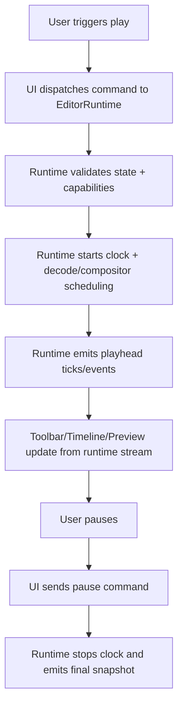
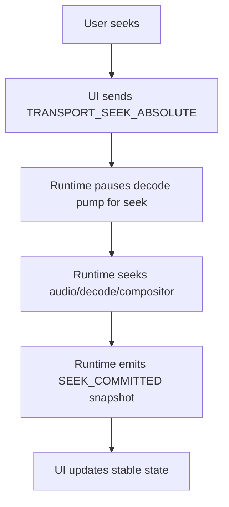

# Web-First Production Video Editor Runtime Decoupling — Feature Specification

> **Date:** 2026-04-13
> **Status:** Draft
> **Feature area:** Editor Runtime, Playback, Timeline, Performance
> **Depends on:** Existing editor domain model (`tracks`, `clips`, `transitions`), `PreviewEngine`, `CompositorWorker`, autosave/export backend, authentication/session model

---

## 1. Summary

This feature replaces React-managed live playback state with a dedicated real-time runtime layer so the web editor can scale to production-grade timeline editing. The runtime becomes the only owner of frame-accurate playback, transport, and render tick timing. React remains the product UI layer for editing controls, panels, and coarse document state.

The core objective is to eliminate frame-loop work from React render cycles and move heavy playback responsibilities to a worker-first engine path. The result should be smoother preview/timeline behavior, less timer/playhead jitter, better seek stability, and fewer main-thread stalls on medium-large projects.

---

## 2. User Story

> **As a** creator editing short-form videos in browser,  
> **I want to** scrub, play, seek, and trim without visible jitter or UI lag,  
> **So that** the editor feels reliable enough for production workflows.

Secondary stories:

> **As a** power user with long timelines and stacked clips,  
> **I want** playback and timeline interaction to stay responsive,  
> **So that** I can finish projects without switching tools.

> **As a** product team,  
> **I want** a runtime architecture with measurable performance budgets,  
> **So that** we can ship confidently across supported browsers.

---

## 3. Scope

**In scope:**
- Introduce a dedicated `EditorRuntime` layer that owns live playback clock and transport lifecycle.
- Remove frame-accurate playback dependency on React reducer state (`currentTimeMs` no longer hot-loop state).
- Introduce runtime command/query boundary: UI sends commands, runtime emits snapshots/events.
- Move timer/playhead/high-frequency UI updates to runtime-driven imperative or store-subscriber path.
- Keep heavy decode/compositing in worker/offscreen pipelines; React does not perform frame loop work.
- Introduce performance budgets and telemetry for playback quality.
- Define browser capability gating and fallback behavior.
- Maintain existing project model and autosave/export behavior compatibility.

**Out of scope:**
- Full timeline canvas rewrite.
- Advanced color grading/keyframes/effect graph redesign.
- Native desktop migration.
- New media formats beyond currently supported ingest/export constraints.
- Multi-user real-time collaboration.

---

## 4. Screens & Layout

### 4.1 Editor Route (modified)

**Route / location:** Existing editor page (`/studio/editor/:projectId` equivalent).

**When it appears:** User opens editable project.

**Layout intent (unchanged visually, changed ownership):**

```
Editor Layout
├── Toolbar (React UI; no frame clock ownership)
├── Preview Stage (runtime-driven render + overlays)
├── Timeline (runtime-fed playhead updates)
└── Side Panels/Inspector/Media (React UI)
```

**Key behavior changes:**
- Toolbar timecode display subscribes directly to runtime playhead stream (not reducer re-renders at frame cadence).
- Timeline playhead animation uses runtime event channel and direct position updates where needed.
- React reducer receives coarse synchronization snapshots only (for persistence and non-live interactions).

**Element inventory (modified controls):**

| Element | Type | Label / Content | State | Action on Interact |
|---------|------|-----------------|-------|--------------------|
| Play/Pause | Button | Existing icons | Enabled when project loaded | Sends `TRANSPORT_PLAY` / `TRANSPORT_PAUSE` command to runtime |
| Rewind/Fast-forward | Button | Existing icons | Enabled when project loaded | Sends `TRANSPORT_SEEK_RELATIVE` command |
| Timecode readout | Display | `HH:MM:SS:FF` | Always visible | Subscribes to runtime playhead stream |
| Timeline playhead | Visual indicator | Vertical line | Runtime-synced | Updated from runtime tick stream |

---

### 4.2 Runtime Health Banner (new)

**Route / location:** Editor toolbar area, right side status cluster.

**When it appears:** Runtime enters degraded mode or unsupported capabilities are detected.

**States:**

| State | Condition | What the User Sees |
|-------|-----------|-------------------|
| Hidden | Runtime healthy | No banner |
| Degraded | Runtime fallback active | Inline warning: "Playback in compatibility mode" |
| Critical | Runtime failure | Blocking error panel with retry + reload actions |

---

## 5. User Flows

### 5.1 Play/Pause flow

**Entry point:** User clicks play button or presses space.

**Exit point:** Playback running or paused at current frame.



Happy path:
1. User triggers play.
2. React command adapter sends `TRANSPORT_PLAY` to runtime.
3. Runtime starts audio-clock-backed session and worker schedule.
4. Runtime emits high-frequency playhead ticks and low-frequency state snapshots.
5. On pause, runtime freezes at audible time and publishes final stable snapshot.

Deviations:
- If runtime initialization fails, UI shows critical runtime error panel and disables transport until retry.
- If browser lacks required capability, runtime enters compatibility mode and exposes reduced performance warning.

---

### 5.2 Seek/Scrub flow

**Entry point:** User drags timeline playhead or enters timecode.

**Exit point:** Preview/timeline reflect requested target time.



Rules:
1. Runtime is authoritative on final committed seek target.
2. UI preview follows runtime output, not optimistic reducer interpolation.
3. During drag-scrub, runtime may throttle expensive decode while maintaining responsive cursor movement.

---

## 6. Functional Requirements

### 6.1 Runtime ownership

1. Runtime owns:
- Playback clock
- Live playhead position
- Transport session state (`idle`, `playing`, `paused`, `seeking`, `degraded`, `error`)
- Decode/compositor scheduling coordination

2. React owns:
- Project document model edits (track/clip changes)
- Panels, forms, dialogs, metadata
- Coarse persisted editor state

3. React must not be required to re-render per frame for playback to remain smooth.

### 6.2 Command bus contract

UI-to-runtime commands:
- `TRANSPORT_PLAY`
- `TRANSPORT_PAUSE`
- `TRANSPORT_TOGGLE`
- `TRANSPORT_SEEK_ABSOLUTE(ms)`
- `TRANSPORT_SEEK_RELATIVE(deltaMs)`
- `TRANSPORT_SET_RATE(rate)`
- `RUNTIME_RELOAD_PROJECT(payload)`
- `RUNTIME_APPLY_TIMELINE_PATCH(patch)`

Runtime-to-UI events:
- `PLAYHEAD_TICK(ms, frame, fps, sourceClock)`
- `TRANSPORT_STATE_CHANGED(state)`
- `SEEK_COMMITTED(ms)`
- `PLAYBACK_ENDED(ms)`
- `RUNTIME_WARNING(code, message)`
- `RUNTIME_ERROR(code, message)`
- `PERF_METRIC_SNAPSHOT(payload)`

### 6.3 Timecode behavior

1. Display format is `HH:MM:SS:FF` where `FF` is frame index at active timeline FPS.
2. Timer source is runtime playhead stream, not reducer `currentTimeMs`.
3. Timer update target cadence is >= 30Hz on healthy supported hardware.
4. Reduced cadence mode may be used under backpressure but must remain monotonic and accurate.

### 6.4 Sync model

1. Runtime emits:
- High-frequency ticks for visual sync.
- Low-frequency snapshot commits for React state sync and persistence.

2. React reducer `SET_CURRENT_TIME` is no longer used for per-frame updates.
3. Autosave/export read committed timeline state, not transient frame ticks.

### 6.5 Capability gating

1. On editor load, runtime runs capability checks for required APIs and codec path.
2. Runtime selects one of:
- `full` mode (preferred path)
- `compatibility` mode (degraded)
- `unsupported` mode (editor blocked with actionable message)

3. Mode decision is logged to runtime telemetry.

---

## 7. Data & Field Mapping

### 7.1 Runtime state entity

| UI Label / Element | Runtime Field | Type | Required | Validation Rules | Notes |
|-------------------|---------------|------|----------|------------------|-------|
| Transport state badge | `transport.state` | enum | Yes | Must be valid enum | Source of truth for play/pause UI |
| Toolbar timecode | `playhead.ms` + `fps` | number + number | Yes | `0 <= ms <= durationMs` | Formatted as timecode |
| Runtime mode banner | `runtime.mode` | enum | Yes | `full|compatibility|unsupported` | Controls warning/error UI |
| Playback warnings list | `runtime.warnings[]` | array | No | max 50 retained | For non-blocking issues |

### 7.2 Document-model mapping rules

| Document event | Runtime action | Expected result |
|---------------|----------------|-----------------|
| Clip trim/position edit | `RUNTIME_APPLY_TIMELINE_PATCH` | Runtime graph updates without full restart when possible |
| Track mute/lock toggle | `RUNTIME_APPLY_TIMELINE_PATCH` | Affects subsequent playback ticks |
| Project reload | `RUNTIME_RELOAD_PROJECT` | Runtime resets and rehydrates |

---

## 8. API Contract

### Existing APIs (unchanged)

- Existing project fetch/save/export APIs remain unchanged in this feature.
- Runtime decoupling must not require API schema changes for base editor CRUD.

### New endpoint: `POST /api/editor/runtime-metrics`

**Purpose:** Collect runtime session performance telemetry for production monitoring.

**When called:** End of playback session, explicit flush intervals, and critical runtime failures.

**Request:**

```typescript
{
  projectId: string;
  sessionId: string;
  mode: "full" | "compatibility" | "unsupported";
  browser: string;
  os: string;
  fpsTarget: number;
  tickRateHzP50: number;
  droppedFramePct: number;
  seekLatencyMsP95: number;
  inputToPreviewMsP95: number;
  warnings: Array<{ code: string; count: number }>;
  errors: Array<{ code: string; count: number }>;
  timestamp: string; // ISO-8601
}
```

**Response:**

```typescript
// 202 Accepted
{ accepted: true }

// 400 Bad Request
{ error: "Invalid runtime metrics payload" }
```

**Side effects:** Stores aggregated runtime performance signals for alerting and dashboarding.

---

## 9. Permissions & Access Control

| User Type / Role | Can Open Editor | Can Play/Scrub | Can Save | Can Export | Notes |
|------------------|-----------------|----------------|----------|-----------|-------|
| Owner/Editor | Yes | Yes | Yes | Yes | Full runtime features |
| Read-only viewer | Yes (if existing role allows) | Yes | No | No | Transport allowed, mutations disabled |
| Unauthenticated | No | No | No | No | Redirect to auth |

Rules:
- Runtime mode visibility (`full/compatibility`) is visible to all users with editor access.
- Metrics payload must avoid PII and include only technical telemetry.

---

## 10. Error States & Edge Cases

| Scenario | Trigger | What the User Sees | What the System Does |
|----------|---------|-------------------|----------------------|
| Runtime init failure | Worker/decoder boot failure | Blocking runtime error panel + Retry | Runtime enters `error`; no transport commands accepted |
| Capability unsupported | Browser lacks required API path | Unsupported message with browser guidance | Runtime mode set to `unsupported`; editing may remain read-only |
| Playback drift detected | Audio/playhead drift above threshold | Non-blocking warning badge | Runtime attempts resync and logs warning |
| Seek timeout | Decoder seek exceeds timeout budget | Toast: "Seek took longer than expected" | Runtime recovers to nearest stable frame |
| Runtime crash mid-session | Worker terminated unexpectedly | "Playback engine restarted" banner | Auto-restart once; if repeated, hard error |

---

## 11. Copy & Labels

| Location | String | Notes |
|----------|--------|-------|
| Runtime degraded banner | "Playback running in compatibility mode" | Warning severity |
| Runtime unsupported banner | "This browser cannot run the high-performance editor runtime" | Blocking severity |
| Runtime retry button | "Restart Playback Engine" | Triggers runtime re-init |
| Seek warning toast | "Seek took longer than expected" | Auto-dismiss |

---

## 12. Non-Functional Requirements

Performance budgets on supported hardware/browser matrix:

1. Playback smoothness
- Dropped frame rate under continuous play: `< 2%` p95
- Tick publish cadence for UI consumers: `>= 30Hz` p95

2. Interaction latency
- Play command to first visible frame: `< 150ms` p95
- Seek command to settled preview frame: `< 220ms` p95
- Pause command to stable frame: `< 80ms` p95

3. Stability
- Runtime fatal error rate: `< 0.5%` sessions
- Auto-recovery success after non-fatal runtime interruption: `> 95%`

4. Memory
- No unbounded growth in frame buffers across 20-minute continuous editing session.

---

## 13. Technical Implementation Notes

### 13.1 Required components

- `EditorRuntime` (main thread coordinator)
- `RuntimeCommandAdapter` (React-to-runtime command bridge)
- `RuntimeEventStore` or subscription interface for UI consumers
- Worker pipeline integrations for decode/composition already present, with runtime ownership consolidation

### 13.2 Migration rules

1. Introduce runtime alongside existing reducer path behind a feature flag.
2. Route only timer/playhead to runtime stream first.
3. Move transport ownership fully to runtime.
4. Remove frame-frequency `SET_CURRENT_TIME` from reducer.
5. Clean up deprecated playback hooks after parity sign-off.

### 13.3 Compatibility modes

- `full`: Offscreen/worker/decode optimized path.
- `compatibility`: reduced cadence and conservative scheduling.
- `unsupported`: block runtime playback and present requirements.

---

## 14. Milestones

1. M1: Runtime boundary and command bus
- Implement `EditorRuntime` shell, command/events, feature flag.
- Playback still partially mirrored to existing path for safety.

2. M2: Timer/playhead decoupling
- Toolbar and timeline playhead consume runtime stream.
- Remove user-visible timer bounce and playhead jump artifacts.

3. M3: Full transport ownership
- Runtime owns play/pause/seek/rate and lifecycle.
- React reducer receives coarse state snapshots only.

4. M4: Hardening and telemetry
- Metrics endpoint live.
- Browser matrix validated.
- Rollout gates defined and monitored.

---

## 15. Acceptance Criteria

1. During active playback, no frame-accurate state updates are required through React reducer for playback correctness.
2. Timecode and timeline playhead remain smooth under continuous play on supported environments.
3. Seeking and pausing are runtime-authoritative and remain stable under repeated user interactions.
4. Compatibility/unsupported states are surfaced with clear user messaging.
5. Existing save/export/project editing behavior remains functionally correct.
6. Runtime telemetry is emitted and visible in operational dashboards.
7. Feature can be toggled off without data model regressions.

---

## 16. Open Questions

1. Which exact browser/version matrix is committed for GA support?
2. Should compatibility mode permit export actions if preview quality is degraded?
3. What is the threshold policy for automatic runtime fallback versus hard error?
4. Do we need session replay sampling for runtime failures before GA?

---

## 17. Rollout Plan

1. Internal dogfood behind flag for editor team.
2. Canary release to 5% of eligible users with telemetry gate checks.
3. Increase to 25%, then 50%, then 100% if all p95 budgets remain within limits for 7 consecutive days per stage.
4. Keep one-click rollback to legacy playback path until 30-day stability target is met.

---

## 18. External Inspiration & Reference Implementations

The following sources are approved inspiration for architecture and implementation decisions in this spec:

1. CapCut Web case study (high-performance browser editing with modern web media APIs)
- https://web.dev/case-studies/capcut

2. Figma engineering architecture patterns (real-time runtime separation from UI app state)
- https://www.figma.com/blog/how-figmas-multiplayer-technology-works/
- https://www.figma.com/blog/how-figma-draws-inspiration-from-the-gaming-world/
- https://www.figma.com/blog/introducing-browserview-for-electron/

3. Rive runtime model (core rendering runtime with framework wrappers)
- https://rive.app/docs/runtimes/web
- https://rive.app/docs/runtimes/web/canvas-vs-webgl
- https://rive.app/docs/runtimes/features-support

4. Web platform APIs this runtime should be designed around
- WebCodecs API: https://developer.mozilla.org/en-US/docs/Web/API/WebCodecs_API
- OffscreenCanvas: https://developer.mozilla.org/en-US/docs/Web/API/OffscreenCanvas
- requestVideoFrameCallback: https://developer.mozilla.org/en-US/docs/Web/API/HTMLVideoElement/requestVideoFrameCallback
- WebCodecs specification: https://www.w3.org/TR/webcodecs/

5. Managed video infrastructure references for backend render/transcode strategy
- Cloudflare Stream docs: https://developers.cloudflare.com/stream/

6. Code-driven video tooling references for cloud render and preview workflow ideas
- Remotion docs: https://www.remotion.dev/

Reference usage rules:
- These links are architectural inspiration, not direct feature parity targets.
- Product behavior in this spec remains source-of-truth over third-party examples.
- Any borrowed behavior must pass our compatibility, performance, and UX acceptance criteria.
