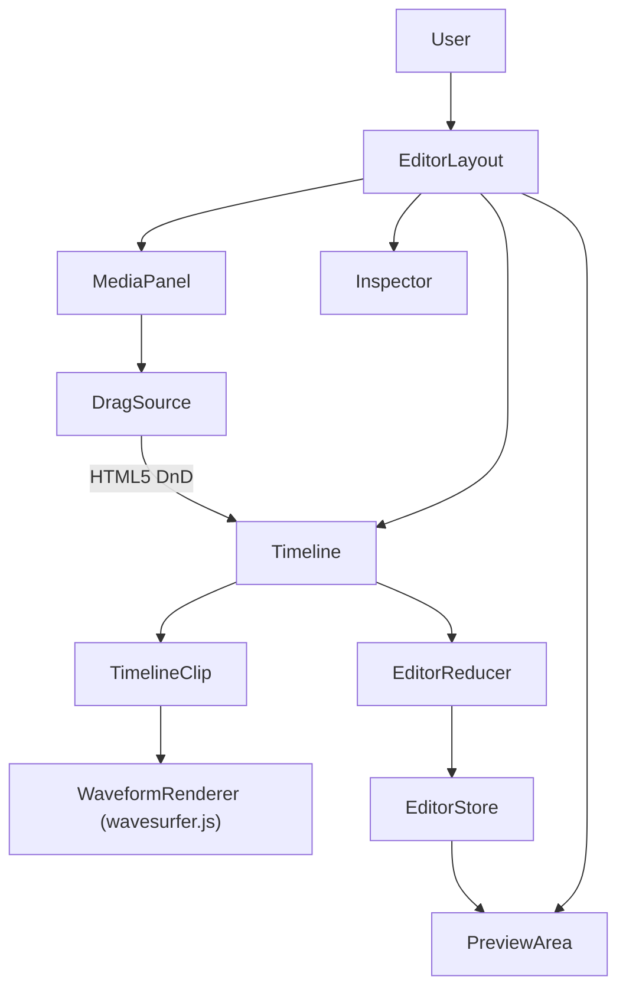
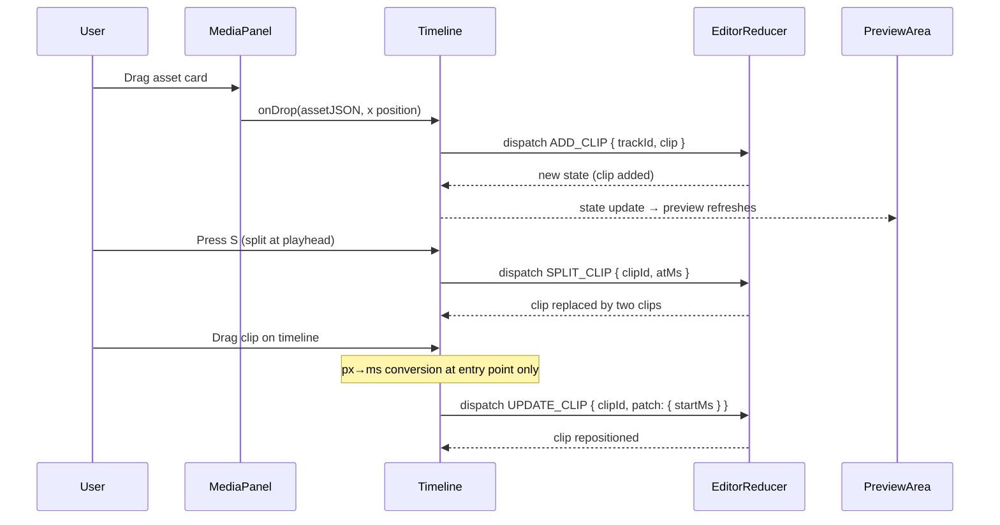

# HLD + LLD: Editor Core (Timeline, Clips, Tracks)

**Phase:** 2 | **Effort:** ~12 days | **Depends on:** Project Model (Phase 1)

---

# HLD: Editor Core

## Overview

The editor already exists as a functional skeleton — it has a timeline, a media panel, and an inspector — but it lacks the basic interactions creators expect: splitting clips, snapping, waveform visualization, drag-from-panel, and a correct 9:16 preview. This phase closes the gap between "technically an editor" and "usable editor." It is the foundation that every subsequent phase (captions, transitions, assembly) builds on top of.

## System Context Diagram



## Components

| Component | Responsibility | Technology |
|---|---|---|
| `EditorLayout` | Root shell, keyboard shortcuts, undo/redo | React, useReducer |
| `Timeline` | Track lanes, scroll, zoom, playhead | React, CSS |
| `TimelineClip` | Individual clip block, drag, trim handles | React, mouse events |
| `WaveformRenderer` | Waveform bar chart from decoded audio | wavesurfer.js v7, custom container |
| `PreviewArea` | Video/canvas preview, aspect ratio derived from `resolution` | HTML `<video>`, CSS |
| `MediaPanel` | Asset list, drag source | React, HTML5 DnD |
| `EditorReducer` | All timeline state transitions (immutable updates via spread) | Pure reducer |
| `snapTargets()` | Computes sorted snap point array from all clips (ms only) | Utility |

## Data Flow



## Key Design Decisions

- **9:16 default, not 16:9** — reels are vertical. The resolution format is `"WxH"` (e.g. `"1080x1920"`). Aspect ratio is derived at render time: `const [w, h] = resolution.split("x").map(Number)`.
- **Waveform via wavesurfer.js v7** — no DIY AudioContext/Web Worker decode. wavesurfer.js handles cross-browser AudioContext (including Firefox), provides waveform data extraction, and can render into a custom container. This eliminates the Firefox worker edge case entirely.
- **HTML5 DnD for media-panel to timeline, mouse events for timeline clip dragging** — these two drag systems must not conflict. Using `dataTransfer` type `application/x-contentai-asset` namespaces the media-panel drag. Timeline clip dragging uses raw `onMouseMove` handlers (see `TimelineClip.tsx`).
- **All snap logic operates in milliseconds** — the only px-to-ms conversion happens at the drag handler entry point. `collectSnapTargets` and `findNearestSnap` never see pixels. See the Snap Utility section below.
- **Overlapping clips on the same track are allowed** — no overlap detection is enforced. The later clip covers the earlier one in preview/export. This is intentional.
- **Drag performance** — the reducer uses immutable updates; `computeDuration` is O(clips) per dispatch. For reels (<20 clips) this is fine. During drag, use a mutable ref to track position, only dispatch `UPDATE_CLIP` on `mouseUp` (commit). This prevents 60 dispatches/sec during drag.
- **Clips store `assetId` only, not `r2Url` or `r2Key`** — the `assets` table is the single source of truth for R2 storage pointers and signed URLs. Clips reference assets by `assetId`. The frontend resolves URLs at render time via an `AssetUrlMap` (a `Map<string, string>` mapping `assetId → signedUrl`, provided via React context or prop). The backend export resolves URLs from the `assets` table when building the ffmpeg filtergraph. This avoids stale/expired URLs in the persisted JSONB and eliminates data duplication.

## Out of Scope

- Multi-track video compositing (picture-in-picture)
- Keyframe animation curves
- Audio ducking
- Clip grouping

---

# LLD: Editor Core

## Database Schema (Final Shape)

No new tables. The `editProjects` table in its final form after this phase. This is the complete Drizzle `pgTable` definition — run `bun db:reset` from scratch, no migrations needed.

```typescript
// backend/src/infrastructure/database/drizzle/schema.ts

export const editProjects = pgTable(
  "edit_project",
  {
    id: text("id")
      .primaryKey()
      .$defaultFn(() => crypto.randomUUID()),
    userId: text("user_id")
      .notNull()
      .references(() => users.id, { onDelete: "cascade" }),
    title: text("title").notNull().default("Untitled Edit"),
    generatedContentId: integer("generated_content_id").references(
      () => generatedContent.id,
      { onDelete: "set null" },
    ),
    tracks: jsonb("tracks").notNull().default([]),
    durationMs: integer("duration_ms").notNull().default(0),
    fps: integer("fps").notNull().default(30),
    resolution: text("resolution").notNull().default("1080x1920"),
    createdAt: timestamp("created_at").notNull().defaultNow(),
    updatedAt: timestamp("updated_at")
      .notNull()
      .defaultNow()
      .$onUpdateFn(() => new Date()),
  },
  (t) => [
    index("edit_projects_user_idx").on(t.userId),
    index("edit_projects_content_idx").on(t.generatedContentId),
  ],
);
```

**Key change:** `resolution` default changes from `"1080p"` to `"1080x1920"`. Valid values:

| Value | Aspect | Use |
|---|---|---|
| `"1080x1920"` | 9:16 | Portrait reel (default) |
| `"720x1280"` | 9:16 | Portrait SD |
| `"2160x3840"` | 9:16 | Portrait 4K |
| `"1920x1080"` | 16:9 | Landscape |
| `"1080x1080"` | 1:1 | Square |

---

## API Contracts

### Backend Zod Schemas — Required Changes

The existing backend schemas in `backend/src/routes/editor/index.ts` have gaps relative to the frontend `Clip` and `Track` types in `frontend/src/features/editor/types/editor.ts`. These are API contract changes that must be addressed.

#### `clipDataSchema` — COMPLETE updated schema

The current `clipDataSchema` is MISSING: `opacity`, `warmth`, `contrast`, `label`, `rotation`, `scale` (only partially present). Here is the full updated schema matching the frontend `Clip` type:

```typescript
const clipDataSchema = z.object({
  id: z.string().min(1),
  assetId: z.string().nullable(),
  label: z.string().max(200),
  startMs: z.number().int().min(0),
  durationMs: z.number().int().min(0),
  trimStartMs: z.number().int().min(0),
  trimEndMs: z.number().int().min(0),
  speed: z.number().min(0.1).max(10),
  // Look
  opacity: z.number().min(0).max(1),
  warmth: z.number().min(-1).max(1),
  contrast: z.number().min(-1).max(1),
  // Transform
  positionX: z.number(),
  positionY: z.number(),
  scale: z.number().min(0.01).max(10),
  rotation: z.number().min(-360).max(360),
  // Sound
  volume: z.number().min(0).max(2),
  muted: z.boolean(),
  // Text-only
  textContent: z.string().max(2000).optional(),
  textStyle: z.object({
    fontSize: z.number(),
    fontWeight: z.enum(["normal", "bold"]),
    color: z.string(),
    align: z.enum(["left", "center", "right"]),
  }).optional(),
});
```

**Fields added vs current backend schema:**
- `label` (required string) — display name shown on the timeline clip
- `opacity` (required number) — look adjustment
- `warmth` (required number) — look adjustment
- `contrast` (required number) — look adjustment
- `rotation` (required number) — transform
- `scale` changed from optional to required
- `trimStartMs`, `trimEndMs`, `speed`, `volume`, `muted` changed from optional to required (matching frontend type)
- `textStyle` object added (matching frontend `TextStyle` interface)

#### `trackDataSchema` — COMPLETE updated schema

The current `trackDataSchema` has `id` as optional (but the frontend `Track` type requires it), and is missing `name` (required) and `locked` (required). Here is the full updated schema:

```typescript
const trackDataSchema = z.object({
  id: z.string().min(1),
  type: z.enum(["video", "audio", "music", "text"]),
  name: z.string().min(1),
  muted: z.boolean(),
  locked: z.boolean(),
  clips: z.array(clipDataSchema),
});
```

**Fields changed vs current backend schema:**
- `id` changed from `z.string().min(1).optional()` to `z.string().min(1)` (required)
- `name` changed from `z.string().optional()` to `z.string().min(1)` (required)
- `locked` changed from `z.boolean().optional()` to `z.boolean()` (required)

#### `patchProjectSchema` — COMPLETE updated schema with new resolution enum

```typescript
const resolutionEnum = z.enum([
  "1080x1920",
  "720x1280",
  "2160x3840",
  "1920x1080",
  "1080x1080",
]);

const patchProjectSchema = z.object({
  title: z.string().min(1).max(200).optional(),
  tracks: z.array(trackDataSchema).optional(),
  durationMs: z.number().int().min(0).optional(),
  fps: z.number().int().min(1).max(120).optional(),
  resolution: resolutionEnum.optional(),
});
```

#### `exportSchema` — updated resolution enum

```typescript
const exportSchema = z.object({
  resolution: resolutionEnum.optional(),
  fps: z.union([z.literal(24), z.literal(30), z.literal(60)]).optional(),
});
```

#### `createProjectSchema` — unchanged

```typescript
const createProjectSchema = z.object({
  title: z.string().min(1).max(200).optional(),
  generatedContentId: z.number().int().optional(),
});
```

The default resolution in the `POST /api/editor` insert must also change:

```typescript
resolution: "1080x1920",
```

### Existing Endpoints (No New Endpoints)

| Method | Path | Change |
|---|---|---|
| `GET /api/editor` | List projects | No change |
| `POST /api/editor` | Create project | Default `resolution` changes to `"1080x1920"` |
| `GET /api/editor/:id` | Get project | No change |
| `PATCH /api/editor/:id` | Auto-save | `patchProjectSchema` updated (see above) |
| `DELETE /api/editor/:id` | Delete project | No change |
| `POST /api/editor/:id/export` | Enqueue export | `exportSchema` resolution enum updated |
| `GET /api/editor/:id/export/status` | Poll export | No change |

---

## Backend Implementation

### ffmpeg Resolution Map

Replace the inline `if/else` chain in `runExportJob` with a lookup map:

```typescript
// backend/src/routes/editor/index.ts — inside runExportJob

const resolutionMap: Record<string, [number, number]> = {
  "1080x1920": [1080, 1920],  // 9:16 portrait (default)
  "720x1280":  [720, 1280],   // 9:16 SD
  "2160x3840": [2160, 3840],  // 9:16 4K
  "1920x1080": [1920, 1080],  // 16:9 landscape
  "1080x1080": [1080, 1080],  // 1:1 square
};

const resolution = opts.resolution ?? project.resolution ?? "1080x1920";
const [outW, outH] = resolutionMap[resolution] ?? [1080, 1920];
```

This replaces the current code:

```typescript
// CURRENT (to be removed):
const [outW, outH] =
  resolution === "4k"
    ? [3840, 2160]
    : resolution === "720p"
      ? [1280, 720]
      : [1920, 1080];
```

---

## Frontend Implementation

**Feature dir:** `frontend/src/features/editor/`

### EditorAction Type — Full Updated Union

The existing `EditorAction` type in `frontend/src/features/editor/types/editor.ts` must be extended with `SPLIT_CLIP`, `DUPLICATE_CLIP`, and `MOVE_CLIP`. Here is the complete union:

```typescript
// frontend/src/features/editor/types/editor.ts

export type EditorAction =
  | { type: "LOAD_PROJECT"; project: EditProject }
  | { type: "SET_TITLE"; title: string }
  | { type: "SET_CURRENT_TIME"; ms: number }
  | { type: "SET_PLAYING"; playing: boolean }
  | { type: "SET_ZOOM"; zoom: number }
  | { type: "SELECT_CLIP"; clipId: string | null }
  | { type: "ADD_CLIP"; trackId: string; clip: Clip }
  | { type: "UPDATE_CLIP"; clipId: string; patch: Partial<Clip> }
  | { type: "REMOVE_CLIP"; clipId: string }
  | { type: "SPLIT_CLIP"; clipId: string; atMs: number }
  | { type: "DUPLICATE_CLIP"; clipId: string }
  | { type: "MOVE_CLIP"; clipId: string; startMs: number }
  | { type: "TOGGLE_TRACK_MUTE"; trackId: string }
  | { type: "TOGGLE_TRACK_LOCK"; trackId: string }
  | { type: "UNDO" }
  | { type: "REDO" }
  | { type: "SET_EXPORT_JOB"; jobId: string | null }
  | { type: "SET_EXPORT_STATUS"; status: ExportJobStatus | null };
```

**Note:** `MOVE_CLIP` is a convenience alias. It dispatches the same way as `UPDATE_CLIP` with `{ startMs }`, but having a distinct action type makes the intent explicit in devtools and undo history.

### New Files

| File | Purpose |
|---|---|
| `hooks/use-waveform.ts` | wavesurfer.js integration for waveform rendering |
| `utils/snap-targets.ts` | Collect snap points and find nearest (ms only) |
| `utils/split-clip.ts` | Pure split logic (testable in isolation) |

### Split Clip — Trim Model and Invariant

Every clip has a source media file with a fixed total duration. The trim model partitions that source into three regions:

```
sourceDuration = trimStartMs + durationMs + trimEndMs
```

- `trimStartMs` — how much source media is hidden from the left
- `durationMs` — visible duration on the timeline
- `trimEndMs` — how much source media is hidden from the right

**Invariant:** `trimStartMs + durationMs + trimEndMs` is constant for a given source file. Splitting a clip produces two clips that both reference the same source, and each must independently satisfy this invariant.

When splitting at `atMs` (a timeline position inside the clip):

**clipA** (left partition):
- `clipA.startMs = clip.startMs` — unchanged
- `clipA.durationMs = atMs - clip.startMs`
- `clipA.trimStartMs = clip.trimStartMs` — unchanged, same source start
- `clipA.trimEndMs = clip.trimEndMs + (clip.startMs + clip.durationMs - atMs)` — hides everything clipB would show, plus what was already hidden

**clipB** (right partition):
- `clipB.startMs = atMs`
- `clipB.durationMs = clip.startMs + clip.durationMs - atMs`
- `clipB.trimStartMs = clip.trimStartMs + (atMs - clip.startMs)` — starts deeper into the source
- `clipB.trimEndMs = clip.trimEndMs` — unchanged, same source end

#### Concrete Numerical Example

```
Original clip: startMs=1000, durationMs=4000, trimStartMs=500, trimEndMs=300
Source total: 500 + 4000 + 300 = 4800ms
Split at atMs=3000 (2000ms into the visible portion):

clipA: startMs=1000, durationMs=2000, trimStartMs=500, trimEndMs=2300
Verify: 500 + 2000 + 2300 = 4800  ✓

clipB: startMs=3000, durationMs=2000, trimStartMs=2500, trimEndMs=300
Verify: 2500 + 2000 + 300 = 4800  ✓
```

#### Implementation

**`utils/split-clip.ts`**

```typescript
import type { Clip } from "../types/editor";

/**
 * Split a clip at a timeline position. Returns [clipA, clipB] or null if
 * atMs is not strictly inside the clip's visible range.
 */
export function splitClip(clip: Clip, atMs: number): [Clip, Clip] | null {
  if (atMs <= clip.startMs || atMs >= clip.startMs + clip.durationMs) {
    return null;
  }

  const clipADuration = atMs - clip.startMs;
  const clipBDuration = clip.startMs + clip.durationMs - atMs;

  const clipA: Clip = {
    ...clip,
    id: crypto.randomUUID(),
    durationMs: clipADuration,
    trimEndMs: clip.trimEndMs + clipBDuration,
  };

  const clipB: Clip = {
    ...clip,
    id: crypto.randomUUID(),
    startMs: atMs,
    durationMs: clipBDuration,
    trimStartMs: clip.trimStartMs + clipADuration,
  };

  return [clipA, clipB];
}
```

#### Reducer Cases

Add to `editorReducer` in `frontend/src/features/editor/hooks/useEditorStore.ts`:

```typescript
case "SPLIT_CLIP": {
  const { clipId, atMs } = action;
  let newTracks = state.tracks;
  for (const track of state.tracks) {
    const idx = track.clips.findIndex((c) => c.id === clipId);
    if (idx === -1) continue;
    const result = splitClip(track.clips[idx], atMs);
    if (!result) return state; // atMs not inside clip — no-op
    const [clipA, clipB] = result;
    newTracks = state.tracks.map((t) =>
      t.id === track.id
        ? { ...t, clips: [...t.clips.slice(0, idx), clipA, clipB, ...t.clips.slice(idx + 1)] }
        : t
    );
    break;
  }
  return {
    ...state,
    past: [...state.past, state.tracks].slice(-50),
    future: [],
    tracks: newTracks,
    durationMs: computeDuration(newTracks),
  };
}

case "DUPLICATE_CLIP": {
  let newTracks = state.tracks;
  for (const track of state.tracks) {
    const clip = track.clips.find((c) => c.id === action.clipId);
    if (!clip) continue;
    const copy: Clip = {
      ...clip,
      id: crypto.randomUUID(),
      startMs: clip.startMs + clip.durationMs, // place immediately after
    };
    newTracks = state.tracks.map((t) =>
      t.id === track.id ? { ...t, clips: [...t.clips, copy] } : t
    );
    break;
  }
  return {
    ...state,
    past: [...state.past, state.tracks].slice(-50),
    future: [],
    tracks: newTracks,
    durationMs: computeDuration(newTracks),
  };
}

case "MOVE_CLIP": {
  const newTracks = updateClipInTracks(state.tracks, action.clipId, {
    startMs: action.startMs,
  });
  return {
    ...state,
    past: [...state.past, state.tracks].slice(-50),
    future: [],
    tracks: newTracks,
    durationMs: computeDuration(newTracks),
  };
}
```

### Clip Dragging

Users can drag clips to any position on the timeline. The current `TimelineClip.tsx` already handles this — `handleDragStart` converts pixel delta to ms and calls `onMove(newStart)`, which dispatches `UPDATE_CLIP` with `{ startMs: newMs }`.

**Current behavior (from `TimelineClip.tsx`):**
```typescript
const onMove_ = (ev: MouseEvent) => {
  const dx = ev.clientX - dragStartX.current;
  const deltaMs = (dx / zoom) * 1000;
  const newStart = Math.max(0, dragStartMs.current + deltaMs);
  onMove(newStart);
};
```

**Performance concern:** The current implementation calls `onMove` on every `mousemove`, which dispatches `UPDATE_CLIP` per frame (~60/sec). For drag performance, refactor to use a mutable ref during drag and only dispatch on `mouseUp`:

```typescript
const handleDragStart = (e: React.MouseEvent) => {
  if (isLocked) return;
  e.stopPropagation();
  isDragging.current = true;
  dragStartX.current = e.clientX;
  dragStartMs.current = clip.startMs;

  const onMouseMove = (ev: MouseEvent) => {
    const dx = ev.clientX - dragStartX.current;
    const deltaMs = (dx / zoom) * 1000;
    let newStartMs = Math.max(0, dragStartMs.current + deltaMs);

    // Snap (all in ms)
    if (!ev.shiftKey) {
      const targets = collectSnapTargets(tracks, clip.id, playheadMs);
      const snapThresholdMs = (SNAP_THRESHOLD_PX / zoom) * 1000;
      const snapped = findNearestSnap(newStartMs, targets, snapThresholdMs);
      if (snapped !== null) newStartMs = snapped;
    }

    // Store in ref — do NOT dispatch here
    dragCurrentMs.current = newStartMs;
    // Update visual position via CSS transform directly (bypass React)
    if (clipRef.current) {
      clipRef.current.style.left = `${(newStartMs / 1000) * zoom}px`;
    }
  };

  const onMouseUp = () => {
    isDragging.current = false;
    // Commit to state — single dispatch
    onMove(dragCurrentMs.current);
    window.removeEventListener("mousemove", onMouseMove);
    window.removeEventListener("mouseup", onMouseUp);
  };

  window.addEventListener("mousemove", onMouseMove);
  window.addEventListener("mouseup", onMouseUp);
};
```

**Overlap policy:** Overlapping clips on the same track is allowed. The later clip covers the earlier one in preview/export. No overlap detection or collision resolution is performed.

### Snap Utility — Milliseconds Only

All snap logic operates in milliseconds. There is zero pixel math inside snap functions. The only px-to-ms conversion happens at the drag handler entry point.

**`utils/snap-targets.ts`**

```typescript
import type { Track } from "../types/editor";

const SNAP_THRESHOLD_PX = 10; // exported for use by drag handlers

/**
 * Collect all snap targets from the timeline. Returns an array of
 * millisecond values sorted ascending. Excludes the clip being dragged.
 */
export function collectSnapTargets(
  tracks: Track[],
  excludeClipId: string,
  playheadMs: number,
): number[] {
  const targets = new Set<number>([0, playheadMs]);
  for (const track of tracks) {
    for (const clip of track.clips) {
      if (clip.id === excludeClipId) continue;
      targets.add(clip.startMs);
      targets.add(clip.startMs + clip.durationMs);
    }
  }
  return [...targets].sort((a, b) => a - b);
}

/**
 * Find the nearest snap target within the threshold.
 * @param ms - current position in milliseconds
 * @param targets - sorted array of snap targets in milliseconds
 * @param thresholdMs - max distance to snap (derived from SNAP_THRESHOLD_PX / zoom * 1000)
 * @returns the snapped ms value, or null if nothing is within threshold
 */
export function findNearestSnap(
  ms: number,
  targets: number[],
  thresholdMs: number,
): number | null {
  let nearest: number | null = null;
  let minDist = thresholdMs;
  for (const t of targets) {
    const dist = Math.abs(ms - t);
    if (dist < minDist) {
      minDist = dist;
      nearest = t;
    }
  }
  return nearest;
}

export { SNAP_THRESHOLD_PX };
```

**How the drag handler uses it (the only place px appears):**

```typescript
// Inside TimelineClip drag handler
const snapThresholdMs = (SNAP_THRESHOLD_PX / zoom) * 1000;
const snapped = findNearestSnap(newStartMs, targets, snapThresholdMs);
```

This is the single point of px-to-ms conversion. `collectSnapTargets` returns `number[]` in ms. `findNearestSnap` takes ms and a threshold in ms. No pixel math inside snap functions.

### Waveform — wavesurfer.js v7 Integration

Install dependency:

```bash
cd frontend && bun add wavesurfer.js
```

**`hooks/use-waveform.ts`**

```typescript
import { useEffect, useRef } from "react";
import WaveSurfer from "wavesurfer.js";

const waveformCache = new Map<string, WaveSurfer>();

interface UseWaveformOptions {
  audioUrl: string | undefined;
  container: HTMLElement | null;
  waveColor?: string;
  height?: number;
}

export function useWaveform({
  audioUrl,
  container,
  waveColor = "#34d399",
  height = 32,
}: UseWaveformOptions) {
  const wsRef = useRef<WaveSurfer | null>(null);

  useEffect(() => {
    if (!audioUrl || !container) return;

    // Reuse cached instance if same URL
    const cached = waveformCache.get(audioUrl);
    if (cached && cached.getWrapper()?.parentElement === container) {
      wsRef.current = cached;
      return;
    }

    const ws = WaveSurfer.create({
      container,
      url: audioUrl,
      waveColor,
      height,
      barWidth: 2,
      barGap: 1,
      barRadius: 1,
      interact: false,
      cursorWidth: 0,
      normalize: true,
    });

    wsRef.current = ws;
    waveformCache.set(audioUrl, ws);

    return () => {
      // Don't destroy — keep in cache for reuse
    };
  }, [audioUrl, container, waveColor, height]);

  return wsRef;
}
```

**Usage in `TimelineClip.tsx`:**

```typescript
import { useWaveform } from "../hooks/use-waveform";

// Inside TimelineClip component:
const waveformContainerRef = useRef<HTMLDivElement>(null);
const isAudioTrack = trackType === "audio" || trackType === "music";

useWaveform({
  audioUrl: isAudioTrack ? assetUrlMap.get(clip.assetId) : undefined,
  container: waveformContainerRef.current,
  waveColor: TRACK_COLORS[trackType],
  height: 32,
});

// In the JSX, replace the SVG waveform placeholder:
{isAudioTrack ? (
  <div
    ref={waveformContainerRef}
    className="absolute inset-0 opacity-30 pointer-events-none"
  />
) : (
  <svg /* existing dashed line placeholder for video/text */ />
)}
```

This replaces the current fake SVG waveform (sine-wave approximation) with real decoded audio data. wavesurfer.js handles AudioContext creation, cross-browser compatibility (including Firefox), and efficient rendering internally.

### Aspect Ratio Toolbar

Users can change the resolution via a toolbar dropdown. The resolution is stored on the project and synced via `PATCH /api/editor/:id`.

```typescript
// frontend/src/features/editor/components/ResolutionPicker.tsx

import { useTranslation } from "react-i18next";
import {
  Select,
  SelectContent,
  SelectItem,
  SelectTrigger,
  SelectValue,
} from "@/shared/components/ui/select";

const RESOLUTIONS = [
  { value: "1080x1920", label: "editor.aspectRatio.portrait" },
  { value: "1920x1080", label: "editor.aspectRatio.landscape" },
  { value: "1080x1080", label: "editor.aspectRatio.square" },
  { value: "720x1280", label: "editor.aspectRatio.portraitSd" },
  { value: "2160x3840", label: "editor.aspectRatio.portrait4k" },
] as const;

interface Props {
  resolution: string;
  onChange: (resolution: string) => void;
}

export function ResolutionPicker({ resolution, onChange }: Props) {
  const { t } = useTranslation();

  return (
    <Select value={resolution} onValueChange={onChange}>
      <SelectTrigger className="w-[160px]">
        <SelectValue />
      </SelectTrigger>
      <SelectContent>
        {RESOLUTIONS.map((r) => (
          <SelectItem key={r.value} value={r.value}>
            {t(r.label)}
          </SelectItem>
        ))}
      </SelectContent>
    </Select>
  );
}
```

**Deriving aspect ratio in `PreviewArea.tsx`:**

```typescript
const [w, h] = resolution.split("x").map(Number);
// Use in style:
style={{ aspectRatio: `${w}/${h}` }}
```

### Key Changes to Existing Files

**`components/PreviewArea.tsx`** — derive aspect ratio from resolution string:
```typescript
// Replace any hardcoded aspect ratio with:
const [w, h] = (state.resolution || "1080x1920").split("x").map(Number);
// ...
<div style={{ aspectRatio: `${w}/${h}` }}>
```

**`hooks/useEditorStore.ts`** — update `INITIAL_EDITOR_STATE`:
```typescript
export const INITIAL_EDITOR_STATE: EditorState = {
  // ...existing fields...
  resolution: "1080x1920", // was "1080p"
  // ...
};
```

**`hooks/useEditorStore.ts`** — add `SPLIT_CLIP`, `DUPLICATE_CLIP`, `MOVE_CLIP` cases to `editorReducer` (see Reducer Cases section above).

**`components/MediaPanel.tsx`** — make asset cards draggable:
```typescript
<div
  draggable
  onDragStart={(e) => {
    e.dataTransfer.setData(
      "application/x-contentai-asset",
      JSON.stringify({
        assetId: asset.id,
        type: asset.type,
        durationMs: asset.durationMs,
        label: asset.name,
      }),
    );
  }}
>
  {/* asset card content */}
</div>
```

**`components/TimelineLane.tsx`** — accept drops from media panel:
```typescript
onDragOver={(e) => {
  if (e.dataTransfer.types.includes("application/x-contentai-asset")) {
    e.preventDefault(); // allow drop
    setIsDropTarget(true);
  }
}}
onDrop={(e) => {
  const raw = e.dataTransfer.getData("application/x-contentai-asset");
  const asset = JSON.parse(raw);
  const rect = e.currentTarget.getBoundingClientRect();
  const startMs = ((e.clientX - rect.left + scrollLeft) / zoom) * 1000;
  dispatch({
    type: "ADD_CLIP",
    trackId: track.id,
    clip: {
      id: crypto.randomUUID(),
      assetId: asset.assetId,
      label: asset.label ?? "Untitled",
      startMs: Math.max(0, startMs),
      durationMs: asset.durationMs ?? 5000,
      trimStartMs: 0,
      trimEndMs: 0,
      speed: 1,
      opacity: 1,
      warmth: 0,
      contrast: 0,
      positionX: 0,
      positionY: 0,
      scale: 1,
      rotation: 0,
      volume: 1,
      muted: false,
    },
  });
  setIsDropTarget(false);
}}
```

### Keyboard Shortcuts (add to EditorLayout)

```typescript
useEffect(() => {
  const handler = (e: KeyboardEvent) => {
    // Ignore if user is typing in an input
    if (e.target instanceof HTMLInputElement || e.target instanceof HTMLTextAreaElement) return;

    if (e.key === "s" && !e.metaKey && !e.ctrlKey && selectedClipId) {
      dispatch({ type: "SPLIT_CLIP", clipId: selectedClipId, atMs: currentTimeMs });
    }
    if (e.key === "d" && (e.metaKey || e.ctrlKey) && selectedClipId) {
      e.preventDefault();
      dispatch({ type: "DUPLICATE_CLIP", clipId: selectedClipId });
    }
    if ((e.key === "Delete" || e.key === "Backspace") && selectedClipId) {
      dispatch({ type: "REMOVE_CLIP", clipId: selectedClipId });
    }
    if (e.key === "z" && (e.metaKey || e.ctrlKey) && !e.shiftKey) {
      e.preventDefault();
      dispatch({ type: "UNDO" });
    }
    if (e.key === "z" && (e.metaKey || e.ctrlKey) && e.shiftKey) {
      e.preventDefault();
      dispatch({ type: "REDO" });
    }
  };
  window.addEventListener("keydown", handler);
  return () => window.removeEventListener("keydown", handler);
}, [selectedClipId, currentTimeMs]);
```

### EditorReducer Performance

The reducer uses immutable updates (spread operator, `Array.map`, `Array.filter`). `computeDuration` iterates all clips across all tracks — O(clips) per dispatch. For short-form reels (<20 clips), this is negligible.

**Drag performance strategy:** During drag, do NOT dispatch on every `mousemove`. Instead:
1. Store the current position in a `useRef` during drag.
2. Update the clip's visual position via direct DOM manipulation (`element.style.left`).
3. Dispatch a single `UPDATE_CLIP` (or `MOVE_CLIP`) on `mouseUp`.

This reduces dispatches from ~60/sec during drag to exactly 1 on drop.

**Undo stack:** The `past` array is capped at 50 entries (`.slice(-50)`). Each entry is a full `Track[]` snapshot. For reels with <20 clips and 4 tracks, each snapshot is small.

### Query Keys

No new query keys — editor state is local (`useReducer`), not server-fetched per interaction. Auto-save uses `authenticatedFetch` to `PATCH /api/editor/:id` on a debounced interval.

### i18n Keys to Add

```json
{
  "editor": {
    "splitClip": "Split",
    "duplicateClip": "Duplicate",
    "waveformLoading": "Loading waveform...",
    "dropHere": "Drop here",
    "aspectRatio": {
      "label": "Aspect ratio",
      "portrait": "9:16 Portrait",
      "landscape": "16:9 Landscape",
      "square": "1:1 Square",
      "portraitSd": "9:16 SD",
      "portrait4k": "9:16 4K"
    }
  }
}
```

---

## Build Sequence

1. DB schema: change `resolution` default to `"1080x1920"`, run `bun db:generate && bun db:reset`
2. Backend: update `clipDataSchema`, `trackDataSchema`, `patchProjectSchema`, `exportSchema` with new zod schemas
3. Backend: replace ffmpeg resolution if/else with `resolutionMap` lookup
4. Backend: update `POST /api/editor` default resolution to `"1080x1920"`
5. Frontend: update `EditorAction` type with `SPLIT_CLIP`, `DUPLICATE_CLIP`, `MOVE_CLIP`
6. Frontend: update `INITIAL_EDITOR_STATE` resolution to `"1080x1920"`
7. Frontend: add `splitClip` utility and reducer cases
8. Frontend: `PreviewArea` aspect ratio fix (derive from resolution string)
9. Frontend: `ResolutionPicker` component
10. Frontend: snap utilities + drag handler update in `TimelineClip`
11. Frontend: `bun add wavesurfer.js`, `useWaveform` hook, update `TimelineClip` waveform rendering
12. Frontend: HTML5 DnD on `MediaPanel` + drop zones on `TimelineLane`
13. Frontend: keyboard shortcuts in `EditorLayout`
14. Tests

## Edge Cases and Error States

- **Split at exact clip boundary:** `atMs <= clip.startMs || atMs >= clip.startMs + clip.durationMs` — `splitClip` returns `null`, reducer is a no-op. Show toast: "Move playhead inside clip to split."
- **Drop incompatible asset type on track:** audio asset on video track — `e.preventDefault()` NOT called, drop is rejected, `isDropTarget` stays false.
- **Waveform decode fails:** wavesurfer.js handles errors internally. The container will be empty (no waveform bars) — no error shown to user.
- **Duplicate clip runs off timeline end:** Allowed. Clip exists beyond the current `durationMs`. `computeDuration` auto-extends the total duration to accommodate.
- **Drag clip to negative position:** `Math.max(0, ...)` clamps to zero.
- **Backend receives old `"1080p"` resolution from stale client:** Zod validation will reject it (not in the enum). Client must use the new format.

## Dependencies on Other Systems

- **Phase 1 (Project Model)** must be done first so `project.resolution` exists on the project object.
- **R2 signed URLs** must allow cross-origin fetch from browser (needed for wavesurfer.js audio decode). Already configured.
- Resolution format change affects both DB schema and ffmpeg export — both must ship together.
- `wavesurfer.js` is a new frontend dependency (`bun add wavesurfer.js`).
