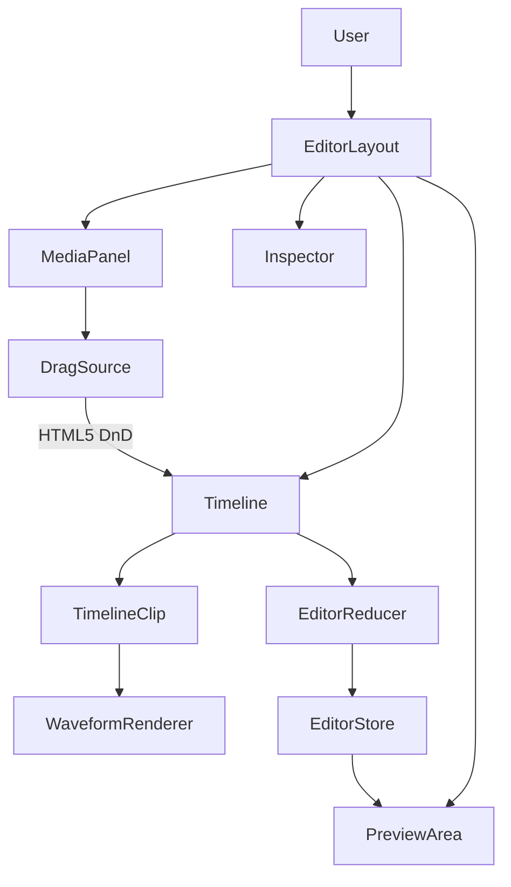
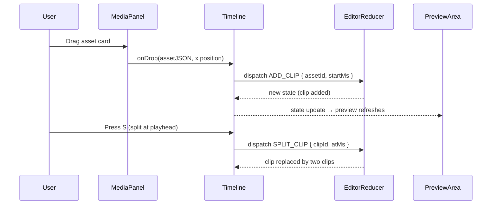

# HLD + LLD: Editor Core (Timeline, Clips, Tracks)

**Phase:** 2 | **Effort:** ~12 days | **Depends on:** Project Model (Phase 1)

---

# HLD: Editor Core

## Overview

The editor already exists as a functional skeleton — it has a timeline, a media panel, and an inspector — but it lacks the basic interactions creators expect: splitting clips, snapping, waveform visualization, drag-from-panel, and a correct 9:16 preview. This phase closes the gap between "technically an editor" and "usable editor." It is the foundation that every subsequent phase (captions, transitions, assembly) builds on top of.

## System Context Diagram



## Components

| Component | Responsibility | Technology |
|---|---|---|
| `EditorLayout` | Root shell, keyboard shortcuts, undo/redo | React, useReducer |
| `Timeline` | Track lanes, scroll, zoom, playhead | React, CSS |
| `TimelineClip` | Individual clip block, drag, trim handles | React, mouse events |
| `WaveformRenderer` | SVG bar chart from Web Audio decode | Web Audio API, SVG |
| `WaveformCache` | Per-asset decoded waveform cache (avoid re-decode) | React Context |
| `PreviewArea` | Video/canvas preview at 9:16 | HTML `<video>`, CSS |
| `MediaPanel` | Asset list, drag source | React, HTML5 DnD |
| `EditorReducer` | All timeline state transitions | Pure reducer |
| `snapTargets()` | Computes sorted snap point array from all clips | Utility |

## Data Flow



## Key Design Decisions

- **9:16 default, not 16:9** — reels are vertical. The current `aspectRatio: "16/9"` in PreviewArea is a bug. Fixing this first unblocks all future visual work.
- **Waveform decoded client-side** — no backend endpoint needed. Web Audio API decodes the R2-signed audio URL directly. Cached per asset ID so we never decode twice.
- **HTML5 DnD for media-panel → timeline, mouse events for timeline clip dragging** — these two drag systems must not conflict. Using `dataTransfer` type `application/x-contentai-asset` namespaces the media-panel drag. Timeline clip dragging uses raw `onMouseMove` handlers.
- **Snap threshold in pixels, converted to ms at drag time** — snap logic is zoom-aware. A 10px threshold at 100px/s zoom = 100ms snap zone.

## Out of Scope

- Multi-track video compositing (picture-in-picture)
- Keyframe animation curves
- Audio ducking
- Clip grouping

## Open Questions

- Should the aspect ratio toggle (9:16 / 16:9 / 1:1) be per-project or a global default? Currently leaning per-project, stored on `editProjects.resolution`.
- Web Worker for waveform decode: Firefox doesn't support `AudioContext` in workers. Is graceful fallback to main-thread decode acceptable?

---

# LLD: Editor Core

## Database Schema

No new tables. Schema change to `edit_project`:

```typescript
// backend/src/infrastructure/database/drizzle/schema.ts
// Change the resolution column default and enum

resolution: text("resolution").notNull().default("1080x1920"),
// Values: "1080x1920" (default, 9:16), "720x1280", "2160x3840", "1920x1080" (16:9), "1080x1080" (1:1)
```

**One-time migration for existing projects:**

```sql
UPDATE edit_project
SET resolution = CASE
  WHEN resolution = '1080p' THEN '1080x1920'
  WHEN resolution = '720p'  THEN '720x1280'
  WHEN resolution = '4k'    THEN '2160x3840'
  ELSE resolution
END;
```

## API Contracts

No new endpoints. All changes are frontend-only except:

### PATCH /api/editor/:id
Already exists. No change to contract — the `tracks` JSONB field absorbs all timeline state changes (split clips, new clips from DnD, duplicates).

## Backend Implementation

**File:** `backend/src/routes/editor/index.ts`

The ffmpeg export resolution mapping changes:

```typescript
// Old mapping
const resolutionMap: Record<string, [number, number]> = {
  "1080p": [1920, 1080],
  "720p":  [720, 1280],   // ← was wrong, now fixed
  "4k":    [3840, 2160],
};

// New mapping (WxH, vertical first)
const resolutionMap: Record<string, [number, number]> = {
  "1080x1920": [1080, 1920],  // 9:16 portrait (default)
  "720x1280":  [720, 1280],
  "2160x3840": [2160, 3840],
  "1920x1080": [1920, 1080],  // 16:9 landscape
  "1080x1080": [1080, 1080],  // 1:1 square
};
```

**Validation:** Zod schema update for resolution field:

```typescript
const resolutionEnum = z.enum([
  "1080x1920", "720x1280", "2160x3840", "1920x1080", "1080x1080"
]);
```

## Frontend Implementation

**Feature dir:** `frontend/src/features/editor/`

### New files

- `hooks/use-waveform.ts` — decode + cache waveform for an audio URL
- `components/WaveformRenderer.tsx` — SVG bar chart component
- `utils/snap-targets.ts` — collect and find nearest snap point
- `utils/split-clip.ts` — pure split logic (testable in isolation)

### Key changes to existing files

**`components/PreviewArea.tsx`**
```typescript
// Change aspect ratio
// Before:
style={{ aspectRatio: "16/9" }}
// After:
style={{ aspectRatio: project.resolution.includes("1080x1920") ? "9/16" : "16/9" }}
// Or cleaner — derive from resolution string:
const [w, h] = project.resolution.split("x").map(Number);
style={{ aspectRatio: `${w}/${h}` }}
```

**`components/TimelineClip.tsx`** — add snap logic to drag handler:
```typescript
const handleMouseMove = (e: MouseEvent) => {
  if (!isDragging) return;
  let newStartMs = pixelsToMs(e.clientX - dragOffsetPx + scrollLeft);

  if (!e.shiftKey) {  // Shift disables snapping
    const targets = collectSnapTargets(tracks, clip.id, playheadMs);
    const snapped = findNearestSnap(newStartMs, targets, snapThresholdMs);
    if (snapped !== null) newStartMs = snapped;
  }

  dispatch({ type: "MOVE_CLIP", clipId: clip.id, startMs: newStartMs });
};
```

**`store/editor-reducer.ts`** — new actions:
```typescript
type EditorAction =
  // existing actions...
  | { type: "SPLIT_CLIP"; clipId: string; atMs: number }
  | { type: "DUPLICATE_CLIP"; clipId: string }

case "SPLIT_CLIP": {
  const { clipId, atMs } = action;
  return produce(state, draft => {
    for (const track of draft.tracks) {
      const idx = track.clips.findIndex(c => c.id === clipId);
      if (idx === -1) continue;
      const clip = track.clips[idx];

      if (atMs <= clip.startMs || atMs >= clip.startMs + clip.durationMs) break;

      const clipA = {
        ...clip,
        id: crypto.randomUUID(),
        durationMs: atMs - clip.startMs,
        trimEndMs: clip.trimEndMs + ((clip.startMs + clip.durationMs) - atMs),
      };
      const clipB = {
        ...clip,
        id: crypto.randomUUID(),
        startMs: atMs,
        durationMs: (clip.startMs + clip.durationMs) - atMs,
        trimStartMs: clip.trimStartMs + (atMs - clip.startMs),
      };

      track.clips.splice(idx, 1, clipA, clipB);
      break;
    }
    draft.history.push(state); // undo
  });
}

case "DUPLICATE_CLIP": {
  return produce(state, draft => {
    for (const track of draft.tracks) {
      const clip = track.clips.find(c => c.id === action.clipId);
      if (!clip) continue;
      const copy = {
        ...clip,
        id: crypto.randomUUID(),
        startMs: clip.startMs + clip.durationMs, // place immediately after
      };
      track.clips.push(copy);
      break;
    }
  });
}
```

**`components/MediaPanel.tsx`** — make asset cards draggable:
```typescript
<div
  draggable
  onDragStart={(e) => {
    e.dataTransfer.setData(
      "application/x-contentai-asset",
      JSON.stringify({ assetId: asset.id, r2Url: asset.r2Url, type: asset.type, durationMs: asset.durationMs })
    );
  }}
>
  {/* asset card content */}
</div>
```

**`components/TimelineLane.tsx`** — accept drops from media panel:
```typescript
onDragOver={(e) => {
  const data = e.dataTransfer.types.includes("application/x-contentai-asset");
  if (data && isCompatibleTrackType(track.type, draggedAssetType)) {
    e.preventDefault(); // allow drop
    setIsDropTarget(true);
  }
}}
onDrop={(e) => {
  const asset = JSON.parse(e.dataTransfer.getData("application/x-contentai-asset"));
  const startMs = pixelsToMs(e.clientX - laneRect.left + scrollLeft);
  dispatch({ type: "ADD_CLIP", trackId: track.id, asset, startMs });
}}
```

### Waveform hook

**`hooks/use-waveform.ts`**
```typescript
const waveformCache = new Map<string, number[]>();

export function useWaveform(audioUrl: string | undefined, barCount: number) {
  const [bars, setBars] = useState<number[] | null>(null);

  useEffect(() => {
    if (!audioUrl) return;
    if (waveformCache.has(audioUrl)) {
      setBars(waveformCache.get(audioUrl)!);
      return;
    }
    let cancelled = false;
    (async () => {
      try {
        const res = await fetch(audioUrl);
        const buffer = await res.arrayBuffer();
        const ctx = new AudioContext();
        const decoded = await ctx.decodeAudioData(buffer);
        const channel = decoded.getChannelData(0);
        const blockSize = Math.floor(channel.length / barCount);
        const result: number[] = [];
        for (let i = 0; i < barCount; i++) {
          let sum = 0;
          for (let j = 0; j < blockSize; j++) sum += Math.abs(channel[i * blockSize + j]);
          result.push(sum / blockSize);
        }
        const max = Math.max(...result);
        const normalized = result.map(b => b / (max || 1));
        waveformCache.set(audioUrl, normalized);
        if (!cancelled) setBars(normalized);
      } catch {
        if (!cancelled) setBars([]); // flat line fallback
      }
    })();
    return () => { cancelled = true; };
  }, [audioUrl, barCount]);

  return bars;
}
```

### Snap utility

**`utils/snap-targets.ts`**
```typescript
export function collectSnapTargets(tracks: Track[], excludeClipId: string, playheadMs: number): number[] {
  const targets = new Set<number>([0, playheadMs]);
  for (const track of tracks) {
    for (const clip of track.clips) {
      if (clip.id === excludeClipId) continue;
      targets.add(clip.startMs);
      targets.add(clip.startMs + clip.durationMs);
    }
  }
  return [...targets].sort((a, b) => a - b);
}

export function findNearestSnap(ms: number, targets: number[], thresholdMs: number): number | null {
  let nearest: number | null = null;
  let minDist = thresholdMs;
  for (const t of targets) {
    const dist = Math.abs(ms - t);
    if (dist < minDist) { minDist = dist; nearest = t; }
  }
  return nearest;
}
```

### Keyboard shortcuts (add to EditorLayout)

```typescript
useEffect(() => {
  const handler = (e: KeyboardEvent) => {
    if (e.key === "s" && !e.metaKey && !e.ctrlKey && selectedClipId) {
      dispatch({ type: "SPLIT_CLIP", clipId: selectedClipId, atMs: playheadMs });
    }
    if (e.key === "d" && (e.metaKey || e.ctrlKey) && selectedClipId) {
      e.preventDefault();
      dispatch({ type: "DUPLICATE_CLIP", clipId: selectedClipId });
    }
  };
  window.addEventListener("keydown", handler);
  return () => window.removeEventListener("keydown", handler);
}, [selectedClipId, playheadMs]);
```

### Query keys

No new query keys — editor state is local (useReducer), not server-fetched per interaction.

### i18n keys to add

```json
{
  "editor": {
    "splitClip": "Split",
    "duplicateClip": "Duplicate",
    "waveformLoading": "Loading waveform...",
    "dropHere": "Drop here",
    "aspectRatio": {
      "label": "Aspect ratio",
      "portrait": "9:16 Portrait",
      "landscape": "16:9 Landscape",
      "square": "1:1 Square"
    }
  }
}
```

## Build Sequence

1. DB migration: resolution string format change
2. Backend: update ffmpeg resolution map
3. Frontend: `PreviewArea` aspect ratio fix (9:16)
4. Frontend: `SPLIT_CLIP` reducer action + `S` keyboard shortcut + toolbar button
5. Frontend: `DUPLICATE_CLIP` reducer action + `Cmd+D` shortcut
6. Frontend: snap utilities + drag handler update in `TimelineClip`
7. Frontend: HTML5 DnD on `MediaPanel` + drop zones on `TimelineLane`
8. Frontend: `useWaveform` hook + `WaveformRenderer` component
9. Tests

## Edge Cases & Error States

- **Split at exact clip boundary:** `atMs === clip.startMs || atMs >= clip.startMs + clip.durationMs` → no-op, show toast "Move playhead inside clip to split"
- **Drop incompatible asset type on track:** audio asset on video track → `e.preventDefault()` NOT called, drop rejected, `isDropTarget` stays false
- **Waveform decode fails (unsupported codec):** catch block sets `bars = []`, `WaveformRenderer` renders a flat center line — no error shown to user
- **Duplicate clip runs off timeline end:** allowed. Clip exists beyond the current `durationMs`. Timeline auto-extends to accommodate.

## Dependencies on Other Systems

- **Phase 1 (Project Model)** must be done first so `project.resolution` exists on the project object
- **R2 signed URLs** must allow cross-origin fetch from browser (needed for waveform decode). Already configured.
- Aspect ratio fix affects the ffmpeg export pipeline — both must ship together or exports will be mismatched
