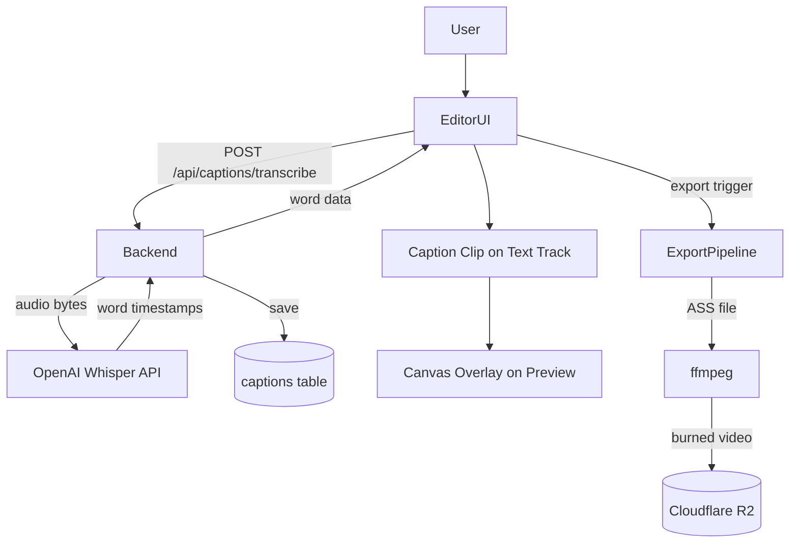
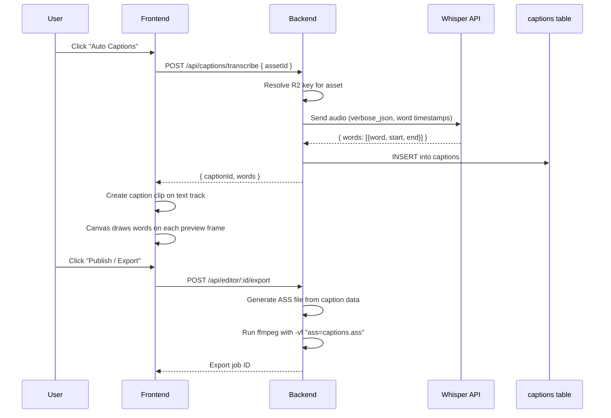

# HLD + LLD: Caption System

**Phase:** 3 | **Effort:** ~16 days | **Depends on:** Editor Core (Phase 2)

---

# HLD: Caption System

## Overview

Captions are the highest-value feature for short-form reel creators. ContentAI already has the script and the TTS-generated voiceover for every reel — all the raw material is there. This feature adds auto-transcription (via OpenAI Whisper), 6 CapCut-style preset styles, real-time canvas preview, and ASS-based burning into the final export. The end result: creators never have to leave ContentAI just to add captions.

## System Context Diagram



## Components

| Component | Responsibility | Technology |
|---|---|---|
| `POST /api/captions/transcribe` | Download audio from R2, send to Whisper, save to DB | Hono, OpenAI SDK |
| `captions` table | Store word-level timestamp data per asset | PostgreSQL, Drizzle |
| Caption clip (text track) | Timeline representation of caption data | Existing clip model, extended |
| `CaptionPresets` | 6 style definitions (font, color, animation) | TypeScript const |
| Canvas caption renderer | Draw active word group on preview each frame | Canvas 2D API |
| Caption Inspector section | Preset picker, word list, timing edits | React |
| ASS generator | Convert caption data → ASS subtitle file | Node.js string template |
| ffmpeg export | `ass` filter to burn captions into video | ffmpeg |

## Data Flow



## Key Design Decisions

- **One caption clip per voiceover span, not one clip per word** — simpler model, split clip feature handles section-level style changes
- **ASS for export, canvas for preview** — ASS gives rich styling in ffmpeg; canvas gives real-time preview without a server round-trip
- **Whisper over other STT providers** — most accurate for TTS-generated speech, already an OpenAI API dependency exists, $0.006/min is negligible
- **6 presets only for MVP** — enough to feel like CapCut, not so many that the UI becomes a style browser
- **Fonts bundled server-side** — only Inter, Montserrat, Poppins in v1 to guarantee ffmpeg font availability at export time

## Out of Scope

- Multi-language / translation captions
- Manual caption entry (no voiceover)
- SRT/VTT subtitle export
- Custom fonts in captions
- Real-time word editing during playback

## Open Questions

- Does the current TTS provider (ElevenLabs?) return word-level timestamps in its response? If yes, we skip the Whisper call entirely for generated voiceovers.
- Should caption generation count against a usage quota or be unlimited on all plans?

---

# LLD: Caption System

## Database Schema

```typescript
// backend/src/infrastructure/database/drizzle/schema.ts

export const captions = pgTable(
  "captions",
  {
    id: text("id")
      .primaryKey()
      .$defaultFn(() => crypto.randomUUID()),
    userId: text("user_id")
      .notNull()
      .references(() => users.id, { onDelete: "cascade" }),
    assetId: text("asset_id")
      .notNull()
      .references(() => assets.id, { onDelete: "cascade" }),
    language: text("language").notNull().default("en"),
    words: jsonb("words").notNull().$type<CaptionWord[]>(),
    // CaptionWord: { word: string; start: number; end: number }
    // start/end are seconds (Whisper format), convert to ms in the API response
    fullText: text("full_text").notNull(),
    createdAt: timestamp("created_at").notNull().defaultNow(),
  },
  (t) => [
    index("captions_asset_idx").on(t.assetId),
    index("captions_user_idx").on(t.userId),
    uniqueIndex("captions_user_asset_unique").on(t.userId, t.assetId),
    // One transcription per (user, asset). Re-transcribing overwrites via upsert.
  ],
);
```

Migration: `bun db:generate && bun db:migrate`

## API Contracts

### POST /api/captions/transcribe
**Auth:** `requireAuth`

**Request body:**
```typescript
{
  assetId: string;  // The voiceover asset to transcribe
}
```

**Response (200):**
```typescript
{
  captionId: string;
  words: Array<{
    word: string;
    startMs: number;  // converted from Whisper's seconds
    endMs: number;
  }>;
  fullText: string;
}
```

**Error cases:**
- `400` — assetId missing or asset is not an audio type
- `401` — unauthenticated
- `403` — asset does not belong to requesting user
- `422` — Whisper API returned error (audio too long, format unsupported)
- `409` — captions already exist for this asset (return existing, do not re-charge)

### GET /api/captions/:assetId
**Auth:** `requireAuth`

Fetches existing captions for an asset. Returns `404` if none exist.

## Backend Implementation

**File:** `backend/src/routes/editor/captions.ts` (new file, mounted in `backend/src/index.ts`)

```typescript
import { Hono } from "hono";
import { requireAuth } from "../middleware/protection";
import OpenAI from "openai";
import { db } from "../infrastructure/database";
import { assets, captions } from "../infrastructure/database/drizzle/schema";

const captionsRouter = new Hono();
const openai = new OpenAI({ apiKey: OPENAI_API_KEY });

captionsRouter.post("/transcribe", requireAuth, async (c) => {
  const auth = c.get("auth");
  const { assetId } = await c.req.json();

  // 1. Fetch asset, verify ownership and type
  const [asset] = await db.select().from(assets)
    .where(and(eq(assets.id, assetId), eq(assets.userId, auth.user.id)));
  if (!asset) return c.json({ error: "Asset not found" }, 404);
  if (!["voiceover", "audio"].includes(asset.type)) return c.json({ error: "Asset must be audio" }, 400);

  // 2. Check for existing captions (idempotent)
  const [existing] = await db.select().from(captions)
    .where(and(eq(captions.assetId, assetId), eq(captions.userId, auth.user.id)));
  if (existing) return c.json({ captionId: existing.id, words: existing.words, fullText: existing.fullText });

  // 3. Download audio from R2
  const audioBuffer = await downloadFromR2(asset.r2Key); // existing R2 utility

  // 4. Send to Whisper
  const transcription = await openai.audio.transcriptions.create({
    file: new File([audioBuffer], "audio.mp3", { type: "audio/mpeg" }),
    model: "whisper-1",
    response_format: "verbose_json",
    timestamp_granularities: ["word"],
  });

  // 5. Convert seconds → ms
  const words = transcription.words.map(w => ({
    word: w.word,
    startMs: Math.round(w.start * 1000),
    endMs: Math.round(w.end * 1000),
  }));

  // 6. Save to DB
  const [saved] = await db.insert(captions).values({
    userId: auth.user.id,
    assetId,
    language: "en",
    words,
    fullText: transcription.text,
  }).returning();

  return c.json({ captionId: saved.id, words, fullText: transcription.text });
});

export { captionsRouter };
```

**Route mounting in `backend/src/index.ts`:**
```typescript
app.route("/api/captions", captionsRouter);
```

**Validation (zod):**
```typescript
const transcribeSchema = z.object({
  assetId: z.string().min(1),
});
```

**Redis caching:** No Redis needed — `captions` table is the cache. The unique constraint on `(userId, assetId)` ensures we never transcribe twice.

## Frontend Implementation

**Feature dir:** `frontend/src/features/editor/`

### New files

- `hooks/use-captions.ts` — trigger transcription, poll for completion
- `hooks/use-caption-preview.ts` — canvas drawing on each preview frame
- `components/CaptionPresetPicker.tsx` — grid of 6 preset thumbnails
- `components/CaptionWordList.tsx` — scrollable word editor in Inspector
- `constants/caption-presets.ts` — preset definitions
- `utils/ass-types.ts` — TypeScript types for ASS generation (backend)

### Caption data model extension (frontend types)

**`types/index.ts`** — extend the `Clip` type:
```typescript
interface CaptionWord {
  word: string;
  startMs: number;
  endMs: number;
  edited?: boolean;
}

// Added to existing Clip interface:
captionId?: string;
captionWords?: CaptionWord[];
captionPresetId?: string;        // e.g., "bold-outline"
captionGroupSize?: number;       // default 3
captionPositionY?: number;       // 0-100, default 80 (bottom 20%)
captionFontSizeOverride?: number; // null = use preset default
```

### Caption presets constant

**`constants/caption-presets.ts`**
```typescript
export const CAPTION_PRESETS = [
  {
    id: "clean-white",
    name: "Clean White",
    fontFamily: "Inter",
    fontSize: 48,
    fontWeight: "700",
    color: "#FFFFFF",
    outlineColor: undefined,
    outlineWidth: 0,
    backgroundColor: undefined,
    positionY: 80,
    animation: "none" as const,
    groupSize: 3,
  },
  {
    id: "bold-outline",
    name: "Bold Outline",
    fontFamily: "Inter",
    fontSize: 56,
    fontWeight: "900",
    color: "#FFFFFF",
    outlineColor: "#000000",
    outlineWidth: 3,
    backgroundColor: undefined,
    positionY: 80,
    animation: "none" as const,
    groupSize: 3,
  },
  {
    id: "box-dark",
    name: "Dark Box",
    fontFamily: "Inter",
    fontSize: 44,
    fontWeight: "700",
    color: "#FFFFFF",
    backgroundColor: "rgba(0,0,0,0.6)",
    backgroundRadius: 8,
    backgroundPadding: 12,
    positionY: 80,
    animation: "none" as const,
    groupSize: 3,
  },
  {
    id: "box-accent",
    name: "Accent Box",
    fontFamily: "Inter",
    fontSize: 44,
    fontWeight: "700",
    color: "#111111",
    backgroundColor: "#FACC15", // yellow-400
    backgroundRadius: 8,
    backgroundPadding: 12,
    positionY: 80,
    animation: "none" as const,
    groupSize: 3,
  },
  {
    id: "highlight",
    name: "Word Highlight",
    fontFamily: "Inter",
    fontSize: 48,
    fontWeight: "700",
    color: "#FFFFFF",
    activeColor: "#FACC15",
    outlineColor: "#000000",
    outlineWidth: 2,
    positionY: 80,
    animation: "highlight" as const,
    groupSize: 3,
  },
  {
    id: "karaoke",
    name: "Karaoke",
    fontFamily: "Inter",
    fontSize: 48,
    fontWeight: "700",
    color: "rgba(255,255,255,0.4)",
    activeColor: "#FFFFFF",
    outlineColor: "#000000",
    outlineWidth: 2,
    positionY: 80,
    animation: "karaoke" as const,
    groupSize: 5,
  },
] as const;
```

### Auto-caption hook

**`hooks/use-captions.ts`**
```typescript
export function useAutoCaption() {
  const { authenticatedFetchJson } = useAuthenticatedFetch();

  return useMutation({
    mutationFn: async (assetId: string) => {
      return authenticatedFetchJson<CaptionResponse>("/api/captions/transcribe", {
        method: "POST",
        body: JSON.stringify({ assetId }),
      });
    },
  });
}
```

### Canvas preview renderer

**`hooks/use-caption-preview.ts`**

Called on each `requestAnimationFrame` tick from the preview playback loop:
```typescript
export function drawCaptionsOnCanvas(
  ctx: CanvasRenderingContext2D,
  clip: Clip,
  currentTimeMs: number,
  canvasW: number,
  canvasH: number,
) {
  if (!clip.captionWords?.length || !clip.captionPresetId) return;

  const preset = CAPTION_PRESETS.find(p => p.id === clip.captionPresetId);
  if (!preset) return;

  const relativeMs = currentTimeMs - clip.startMs;
  const groupSize = clip.captionGroupSize ?? preset.groupSize;
  const words = clip.captionWords;

  const activeIdx = words.findIndex(w => relativeMs >= w.startMs && relativeMs < w.endMs);
  if (activeIdx === -1) return;

  const groupStart = Math.floor(activeIdx / groupSize) * groupSize;
  const group = words.slice(groupStart, groupStart + groupSize);

  const fontSize = clip.captionFontSizeOverride ?? preset.fontSize;
  const y = canvasH * ((clip.captionPositionY ?? preset.positionY) / 100);

  ctx.font = `${preset.fontWeight} ${fontSize}px ${preset.fontFamily}`;
  ctx.textAlign = "center";
  ctx.textBaseline = "middle";

  const fullText = group.map(w => w.word).join(" ");

  // Draw background box if applicable
  if (preset.backgroundColor) {
    const metrics = ctx.measureText(fullText);
    const pad = (preset as any).backgroundPadding ?? 12;
    const radius = (preset as any).backgroundRadius ?? 8;
    const boxW = metrics.width + pad * 2;
    const boxH = fontSize + pad * 2;
    ctx.fillStyle = preset.backgroundColor;
    roundRect(ctx, canvasW / 2 - boxW / 2, y - boxH / 2, boxW, boxH, radius);
    ctx.fill();
  }

  if (preset.animation === "highlight" || preset.animation === "karaoke") {
    // Draw word by word with active color
    let totalWidth = 0;
    const wordWidths = group.map(w => {
      const m = ctx.measureText(w.word + " ");
      totalWidth += m.width;
      return m.width;
    });

    let xOffset = canvasW / 2 - totalWidth / 2;
    for (let i = 0; i < group.length; i++) {
      const word = group[i];
      const isActive = relativeMs >= word.startMs && relativeMs < word.endMs;
      ctx.fillStyle = isActive ? (preset.activeColor ?? preset.color) : preset.color;

      if (preset.outlineWidth) {
        ctx.strokeStyle = preset.outlineColor ?? "#000";
        ctx.lineWidth = preset.outlineWidth * 2;
        ctx.strokeText(word.word, xOffset + wordWidths[i] / 2, y);
      }
      ctx.fillText(word.word, xOffset + wordWidths[i] / 2, y);
      xOffset += wordWidths[i];
    }
  } else {
    // Simple centered text
    if (preset.outlineWidth) {
      ctx.strokeStyle = preset.outlineColor ?? "#000";
      ctx.lineWidth = preset.outlineWidth * 2;
      ctx.strokeText(fullText, canvasW / 2, y);
    }
    ctx.fillStyle = preset.color;
    ctx.fillText(fullText, canvasW / 2, y);
  }
}
```

**Add `<canvas>` to PreviewArea:**
```typescript
// In PreviewArea.tsx:
<div style={{ position: "relative" }}>
  <video ref={videoRef} ... />
  <canvas
    ref={captionCanvasRef}
    width={previewWidth}
    height={previewHeight}
    style={{ position: "absolute", top: 0, left: 0, pointerEvents: "none" }}
  />
</div>
```

### Query keys

```typescript
// src/shared/lib/query-keys.ts
captions: {
  byAsset: (assetId: string) => ["captions", "asset", assetId] as const,
},
```

### i18n keys

```json
{
  "editor": {
    "captions": {
      "autoGenerate": "Auto Captions",
      "generating": "Generating captions...",
      "style": "Caption style",
      "groupSize": "Words per group",
      "fontSize": "Font size",
      "position": "Position",
      "words": "Words",
      "editWord": "Edit word",
      "noVoiceover": "Add a voiceover clip to generate captions"
    }
  }
}
```

## Backend: ASS Subtitle Generation + Export

**File:** `backend/src/routes/editor/export/ass-generator.ts` (new)

```typescript
interface ASSWord {
  word: string;
  startMs: number;
  endMs: number;
}

interface ASSPresetConfig {
  fontFamily: string;
  fontSize: number;
  fontWeight: string;
  color: string;        // &HAABBGGRR format
  outlineColor: string;
  outlineWidth: number;
  positionY: number;    // percentage
}

export function generateASS(
  words: ASSWord[],
  preset: ASSPresetConfig,
  resolution: [number, number],
  groupSize: number,
): string {
  const [resW, resH] = resolution;
  const marginV = Math.round(resH * (1 - preset.positionY / 100));

  const header = `[Script Info]
ScriptType: v4.00+
PlayResX: ${resW}
PlayResY: ${resH}
WrapStyle: 0

[V4+ Styles]
Format: Name, Fontname, Fontsize, PrimaryColour, SecondaryColour, OutlineColour, BackColour, Bold, Italic, Underline, StrikeOut, ScaleX, ScaleY, Spacing, Angle, BorderStyle, Outline, Shadow, Alignment, MarginL, MarginR, MarginV, Encoding
Style: Default,${preset.fontFamily},${preset.fontSize},${preset.color},&H000000FF,${preset.outlineColor},&H80000000,${preset.fontWeight === "900" ? 1 : 0},0,0,0,100,100,0,0,1,${preset.outlineWidth},0,2,10,10,${marginV},1

[Events]
Format: Layer, Start, End, Style, Name, MarginL, MarginR, MarginV, Effect, Text
`;

  const events: string[] = [];
  for (let i = 0; i < words.length; i += groupSize) {
    const group = words.slice(i, i + groupSize);
    const start = msToASSTime(group[0].startMs);
    const end = msToASSTime(group[group.length - 1].endMs);
    const text = group.map(w => w.word).join(" ");
    events.push(`Dialogue: 0,${start},${end},Default,,0,0,0,,${text}`);
  }

  return header + events.join("\n");
}

function msToASSTime(ms: number): string {
  const h = Math.floor(ms / 3600000);
  const m = Math.floor((ms % 3600000) / 60000);
  const s = Math.floor((ms % 60000) / 1000);
  const cs = Math.floor((ms % 1000) / 10); // centiseconds
  return `${h}:${String(m).padStart(2, "0")}:${String(s).padStart(2, "0")}.${String(cs).padStart(2, "0")}`;
}
```

**Integration in export pipeline:**
```typescript
// In the export job handler, before running ffmpeg:
const captionClip = timeline.textTrack.clips.find(c => c.captionWords?.length);
if (captionClip) {
  const preset = CAPTION_PRESETS_CONFIG[captionClip.captionPresetId ?? "clean-white"];
  const assContent = generateASS(
    captionClip.captionWords,
    preset,
    [resW, resH],
    captionClip.captionGroupSize ?? 3,
  );
  const assPath = path.join(tmpDir, "captions.ass");
  await fs.writeFile(assPath, assContent, "utf-8");

  // Add to ffmpeg filtergraph:
  ffmpegArgs.push("-vf", `ass=${assPath}`);
}
```

## Build Sequence

1. DB: `captions` table + migration
2. Backend: `captionsRouter` with `/transcribe` endpoint
3. Backend: Mount captions router in `index.ts`
4. Frontend: `CaptionWord` type + extend `Clip` type
5. Frontend: `CAPTION_PRESETS` constant
6. Frontend: `useAutoCaption` mutation hook
7. Frontend: "Auto Captions" button in editor toolbar (calls hook, dispatches ADD_CAPTION_CLIP)
8. Frontend: `CaptionPresetPicker` in Inspector
9. Frontend: Canvas caption renderer in `PreviewArea`
10. Frontend: `CaptionWordList` word editor in Inspector
11. Backend: `generateASS` utility + integrate into export handler
12. Testing

## Edge Cases & Error States

- **No voiceover on timeline:** "Auto Captions" button disabled with tooltip "Add a voiceover to generate captions"
- **Whisper returns empty words array:** Save with empty words, show "No speech detected" in Inspector word list
- **Caption clip split (via Phase 2 split-clip):** Both halves inherit `captionWords`. Frontend filters words by relative time range. Each half is a valid caption clip.
- **Re-generate captions for same asset:** `POST /api/captions/transcribe` returns the existing record (idempotent). If user wants fresh transcription, they must first delete the clip (future feature).
- **Export with no bundled font:** ffmpeg fails silently if font not found, falls back to system default. Ship Inter and Montserrat in `backend/assets/fonts/` and reference by absolute path in ASS.

## Dependencies on Other Systems

- **OpenAI API key** must be set in `envUtil.ts` (already exists for other features)
- **Phase 2 (Editor Core)** must be done — specifically the text track and split-clip feature
- **R2 download utility** must support audio file formats (already does for video export)
- **Server fonts** — `backend/assets/fonts/Inter-Bold.ttf` etc. must be present at deploy time
