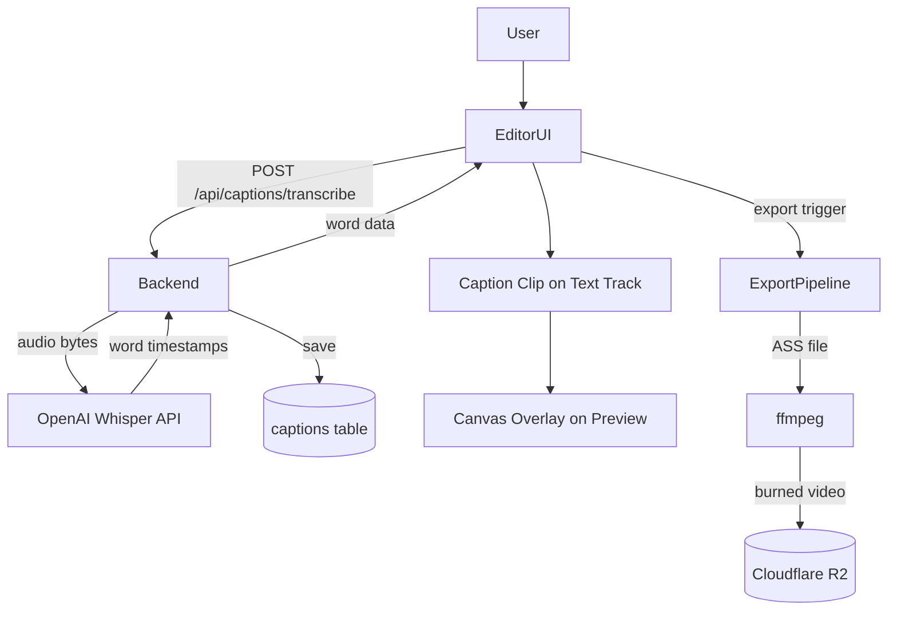
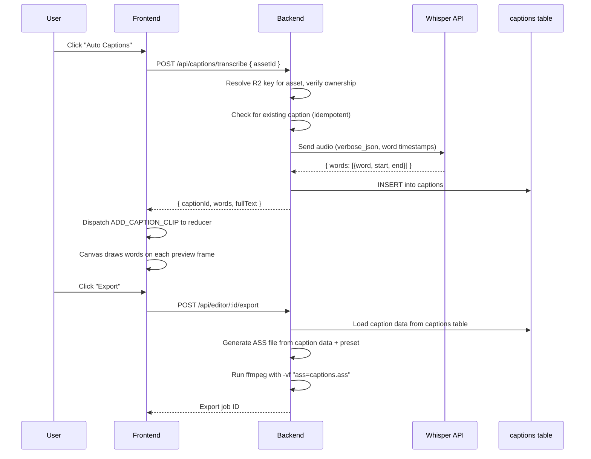

# HLD + LLD: Caption System

**Phase:** 3 | **Effort:** ~16 days | **Depends on:** Editor Core (Phase 2)

---

# HLD: Caption System

## Overview

Captions are the highest-value feature for short-form reel creators. ContentAI already has the script and the TTS-generated voiceover for every reel -- all the raw material is there. This feature adds auto-transcription (via OpenAI Whisper), 6 CapCut-style preset styles, real-time canvas preview, and ASS-based burning into the final export. The end result: creators never have to leave ContentAI just to add captions.

## System Context Diagram



## Components

| Component | Responsibility | Technology |
|---|---|---|
| `POST /api/captions/transcribe` | Download audio from R2, send to Whisper, save to DB | Hono, OpenAI SDK |
| `GET /api/captions/:assetId` | Retrieve existing caption data for an asset | Hono |
| `captions` table | Store word-level timestamp data per asset | PostgreSQL, Drizzle |
| Caption clip (text track) | Timeline representation of caption data | Existing Clip model, extended with caption fields |
| `CAPTION_PRESETS` | 6 style definitions (font, color, animation) | TypeScript const |
| Canvas caption renderer | Draw active word group on preview each frame | Canvas 2D API, `requestAnimationFrame` |
| Caption Inspector section | Preset picker, word list, timing edits | React |
| ASS generator | Convert caption data to ASS subtitle file | String template |
| ffmpeg export integration | `ass` filter to burn captions into video | ffmpeg |

## Data Flow



## Key Design Decisions

- **One caption clip per voiceover span, not one clip per word.** Simpler model. The split-clip feature from Phase 2 handles section-level style changes.
- **ASS for export, canvas for preview.** ASS gives rich styling in ffmpeg; canvas gives real-time preview without a server round-trip.
- **Whisper over other STT providers.** Most accurate for TTS-generated speech. OpenAI API dependency already exists (see `OPENAI_API_KEY` in `backend/src/utils/config/envUtil.ts`). Cost is $0.006/min, which is negligible -- a 60-second voiceover costs $0.006.
- **6 presets only for MVP.** Enough to feel like CapCut, not so many that the UI becomes a style browser.
- **Fonts bundled server-side.** Only Inter, Montserrat, Poppins in v1 to guarantee ffmpeg font availability at export time.

## Cost Analysis

OpenAI Whisper pricing: **$0.006 per minute** of audio.

| Voiceover Length | Cost per Transcription |
|---|---|
| 15 seconds | $0.0015 |
| 30 seconds | $0.003 |
| 60 seconds | $0.006 |
| 2 minutes | $0.012 |

At 1,000 caption generations per month (assuming 30s average): **$3.00/month**. The unique constraint on `(userId, assetId)` prevents duplicate charges -- re-requesting returns cached data.

## Performance Note

Caption preview draws on every frame via `requestAnimationFrame`. For a 3-word group, the renderer performs a linear scan of all words to find the active word index. For a 60-second voiceover at ~150 words, this is O(150) per frame at 60fps = ~9,000 comparisons per second. This is well within budget for a simple array scan with no allocations. Do not prematurely optimize this with binary search or interval trees.

## Out of Scope

- Multi-language / translation captions
- Manual caption entry (no voiceover)
- SRT/VTT subtitle export
- Custom fonts in captions
- Real-time word editing during playback

## Open Questions

- Does the current TTS provider (ElevenLabs) return word-level timestamps in its response? If yes, we skip the Whisper call entirely for generated voiceovers.
- Should caption generation count against a usage quota or be unlimited on all plans?

---

# LLD: Caption System

## 1. Database Schema

Add this table definition to `backend/src/infrastructure/database/drizzle/schema.ts`. No migration files -- run `bun db:generate && bun db:migrate` (or `bun db:reset` in development).

```typescript
// Add to backend/src/infrastructure/database/drizzle/schema.ts

// ─── Captions ──────────────────────────────────────────────────────────────────
// Word-level transcription data from Whisper, one row per (user, asset).

export interface CaptionWord {
  word: string;
  startMs: number;
  endMs: number;
}

export const captions = pgTable(
  "caption",
  {
    id: text("id")
      .primaryKey()
      .$defaultFn(() => crypto.randomUUID()),
    userId: text("user_id")
      .notNull()
      .references(() => users.id, { onDelete: "cascade" }),
    assetId: text("asset_id")
      .notNull()
      .references(() => assets.id, { onDelete: "cascade" }),
    language: text("language").notNull().default("en"),
    words: jsonb("words").notNull().$type<CaptionWord[]>(),
    fullText: text("full_text").notNull(),
    createdAt: timestamp("created_at").notNull().defaultNow(),
  },
  (t) => [
    index("captions_asset_idx").on(t.assetId),
    index("captions_user_idx").on(t.userId),
    uniqueIndex("captions_user_asset_unique").on(t.userId, t.assetId),
  ],
);

export type Caption = typeof captions.$inferSelect;
export type NewCaption = typeof captions.$inferInsert;
```

Add the relation:

```typescript
export const captionsRelations = relations(captions, ({ one }) => ({
  user: one(users, { fields: [captions.userId], references: [users.id] }),
  asset: one(assets, { fields: [captions.assetId], references: [assets.id] }),
}));
```

## 2. Backend API

### 2a. Updated `clipDataSchema` in `backend/src/routes/editor/index.ts`

The current `clipDataSchema` is missing caption fields. The frontend stores caption data on the Clip and auto-saves it via `PATCH /api/editor/:id`. The zod schema must accept these optional fields so they survive the round-trip through the `tracks` JSONB column.

```typescript
// backend/src/routes/editor/index.ts — replace the existing clipDataSchema

const clipDataSchema = z.object({
  id: z.string().min(1),
  assetId: z.string().nullable().optional(),
  startMs: z.number().int().min(0),
  durationMs: z.number().int().min(0),
  trimStartMs: z.number().int().min(0).optional(),
  trimEndMs: z.number().int().min(0).optional(),
  speed: z.number().min(0.1).max(10).optional(),
  volume: z.number().min(0).max(2).optional(),
  muted: z.boolean().optional(),
  textContent: z.string().max(2000).optional(),
  positionX: z.number().optional(),
  positionY: z.number().optional(),
  scale: z.number().optional(),
  // ── Caption fields (new) ──────────────────────────────────────────
  captionId: z.string().optional(),
  captionWords: z
    .array(
      z.object({
        word: z.string(),
        startMs: z.number().int().min(0),
        endMs: z.number().int().min(0),
      }),
    )
    .optional(),
  captionPresetId: z.string().max(50).optional(),
  captionGroupSize: z.number().int().min(1).max(10).optional(),
  captionPositionY: z.number().min(0).max(100).optional(),
  captionFontSizeOverride: z.number().int().min(8).max(200).optional(),
});
```

No changes needed to `trackDataSchema` or `patchProjectSchema` -- they reference `clipDataSchema` and will pick up the new fields automatically. The `PATCH /api/editor/:id` endpoint already writes `parsed.data.tracks` directly to the JSONB column, so caption data persists with no handler changes.

### 2b. Captions Router

**New file:** `backend/src/routes/editor/captions.ts`

```typescript
import { Hono } from "hono";
import { z } from "zod";
import {
  authMiddleware,
  rateLimiter,
  csrfMiddleware,
} from "../../middleware/protection";
import type { HonoEnv } from "../../middleware/protection";
import { db } from "../../services/db/db";
import { assets, captions } from "../../infrastructure/database/drizzle/schema";
import type { CaptionWord } from "../../infrastructure/database/drizzle/schema";
import { eq, and } from "drizzle-orm";
import { debugLog } from "../../utils/debug/debug";
import { getFileUrl } from "../../services/storage/r2";
import { OPENAI_API_KEY } from "../../utils/config/envUtil";
import OpenAI from "openai";

const app = new Hono<HonoEnv>();

const openai = new OpenAI({ apiKey: OPENAI_API_KEY });

const MAX_AUDIO_SIZE_BYTES = 25 * 1024 * 1024; // 25 MB (Whisper limit)

const transcribeSchema = z.object({
  assetId: z.string().min(1, "assetId is required"),
});

// ─── POST /api/captions/transcribe ──────────────────────────────────────────

app.post(
  "/transcribe",
  rateLimiter("customer"),
  csrfMiddleware(),
  authMiddleware("user"),
  async (c) => {
    try {
      const auth = c.get("auth");
      const body = await c.req.json().catch(() => null);
      const parsed = transcribeSchema.safeParse(body);
      if (!parsed.success) {
        return c.json(
          { error: "Invalid request body", details: parsed.error.flatten() },
          400,
        );
      }

      const { assetId } = parsed.data;

      // 1. Fetch asset, verify ownership
      const [asset] = await db
        .select()
        .from(assets)
        .where(and(eq(assets.id, assetId), eq(assets.userId, auth.user.id)))
        .limit(1);

      if (!asset) {
        return c.json({ error: "Asset not found" }, 404);
      }

      if (!["voiceover", "audio"].includes(asset.type)) {
        return c.json(
          {
            error: `Asset type "${asset.type}" is not supported. Must be "voiceover" or "audio".`,
          },
          400,
        );
      }

      if (!asset.r2Key) {
        return c.json({ error: "Asset has no associated file" }, 400);
      }

      // 2. Check for existing captions (idempotent -- do not re-charge)
      const [existing] = await db
        .select()
        .from(captions)
        .where(
          and(eq(captions.assetId, assetId), eq(captions.userId, auth.user.id)),
        )
        .limit(1);

      if (existing) {
        return c.json({
          captionId: existing.id,
          words: existing.words,
          fullText: existing.fullText,
        });
      }

      // 3. Download audio from R2
      let audioBuffer: Buffer;
      try {
        const signedUrl = await getFileUrl(asset.r2Key, 3600);
        const res = await fetch(signedUrl);
        if (!res.ok) {
          throw new Error(`R2 download failed: HTTP ${res.status}`);
        }
        audioBuffer = Buffer.from(await res.arrayBuffer());
      } catch (err) {
        debugLog.error("Failed to download audio from R2", {
          service: "captions-route",
          operation: "downloadAudio",
          assetId,
          r2Key: asset.r2Key,
          error: err instanceof Error ? err.message : "Unknown error",
        });
        return c.json({ error: "Failed to download audio file" }, 500);
      }

      // 4. Check file size
      if (audioBuffer.length > MAX_AUDIO_SIZE_BYTES) {
        return c.json(
          {
            error: `Audio file is ${(audioBuffer.length / 1024 / 1024).toFixed(1)} MB. Maximum is 25 MB.`,
          },
          413,
        );
      }

      // 5. Send to Whisper
      let transcription: OpenAI.Audio.Transcription & { words?: Array<{ word: string; start: number; end: number }> };
      try {
        const mimeType = asset.mimeType ?? "audio/mpeg";
        const ext = mimeType.includes("wav")
          ? "wav"
          : mimeType.includes("mp4") || mimeType.includes("m4a")
            ? "m4a"
            : "mp3";

        transcription = (await openai.audio.transcriptions.create({
          file: new File([audioBuffer], `audio.${ext}`, { type: mimeType }),
          model: "whisper-1",
          response_format: "verbose_json",
          timestamp_granularities: ["word"],
        })) as any;
      } catch (err) {
        debugLog.error("Whisper API call failed", {
          service: "captions-route",
          operation: "whisperTranscribe",
          assetId,
          error: err instanceof Error ? err.message : "Unknown error",
        });

        const message = err instanceof Error ? err.message : "Unknown error";
        if (message.includes("too short") || message.includes("too long")) {
          return c.json(
            { error: `Whisper rejected the audio: ${message}` },
            422,
          );
        }
        if (message.includes("format")) {
          return c.json(
            {
              error: `Unsupported audio format. Whisper supports mp3, mp4, m4a, wav, and webm.`,
            },
            422,
          );
        }
        return c.json({ error: "Transcription failed" }, 502);
      }

      // 6. Convert seconds to ms
      const whisperWords = transcription.words ?? [];
      const words: CaptionWord[] = whisperWords.map((w) => ({
        word: w.word,
        startMs: Math.round(w.start * 1000),
        endMs: Math.round(w.end * 1000),
      }));

      // 7. Save to DB
      const [saved] = await db
        .insert(captions)
        .values({
          userId: auth.user.id,
          assetId,
          language: "en",
          words,
          fullText: transcription.text ?? "",
        })
        .returning();

      debugLog.info("Caption transcription completed", {
        service: "captions-route",
        operation: "transcribe",
        assetId,
        wordCount: words.length,
      });

      return c.json({
        captionId: saved.id,
        words,
        fullText: saved.fullText,
      });
    } catch (error) {
      debugLog.error("Failed to transcribe captions", {
        service: "captions-route",
        operation: "transcribe",
        error: error instanceof Error ? error.message : "Unknown error",
      });
      return c.json({ error: "Failed to transcribe captions" }, 500);
    }
  },
);

// ─── GET /api/captions/:assetId ─────────────────────────────────────────────

app.get(
  "/:assetId",
  rateLimiter("customer"),
  authMiddleware("user"),
  async (c) => {
    try {
      const auth = c.get("auth");
      const { assetId } = c.req.param();

      const [caption] = await db
        .select()
        .from(captions)
        .where(
          and(
            eq(captions.assetId, assetId),
            eq(captions.userId, auth.user.id),
          ),
        )
        .limit(1);

      if (!caption) {
        return c.json({ error: "No captions found for this asset" }, 404);
      }

      return c.json({
        captionId: caption.id,
        words: caption.words,
        fullText: caption.fullText,
      });
    } catch (error) {
      debugLog.error("Failed to fetch captions", {
        service: "captions-route",
        operation: "getCaptions",
        error: error instanceof Error ? error.message : "Unknown error",
      });
      return c.json({ error: "Failed to fetch captions" }, 500);
    }
  },
);

export default app;
```

### 2c. Mount the Captions Router

In `backend/src/index.ts`, add the import and mount line:

```typescript
// Add to route imports section (after the editorRoutes import on line 35)
import captionsRoutes from "./routes/editor/captions";

// Add to route mounting section (after line 98: app.route("/api/editor", editorRoutes))
app.route("/api/captions", captionsRoutes);
```

### 2d. Complete API Contract

**POST /api/captions/transcribe**

| Field | Value |
|---|---|
| Auth | `authMiddleware("user")` |
| Rate limit | `rateLimiter("customer")` |
| CSRF | `csrfMiddleware()` |

Request:
```typescript
{
  assetId: string; // UUID of a voiceover or audio asset
}
```

Response (200) -- success or existing caption returned:
```typescript
{
  captionId: string;  // UUID from captions table
  words: Array<{
    word: string;     // e.g. "Hello"
    startMs: number;  // e.g. 0
    endMs: number;    // e.g. 450
  }>;
  fullText: string;   // e.g. "Hello world this is a test"
}
```

Error responses:

| Status | Condition | Body |
|---|---|---|
| 400 | Missing or invalid `assetId` | `{ error: "Invalid request body", details: {...} }` |
| 400 | Asset type is not `voiceover` or `audio` | `{ error: "Asset type \"video\" is not supported..." }` |
| 400 | Asset has no R2 file | `{ error: "Asset has no associated file" }` |
| 404 | Asset does not exist or not owned by user | `{ error: "Asset not found" }` |
| 413 | Audio file exceeds 25 MB | `{ error: "Audio file is 31.2 MB. Maximum is 25 MB." }` |
| 422 | Whisper rejected audio (too short, bad format) | `{ error: "Whisper rejected the audio: ..." }` |
| 502 | Whisper API returned an unexpected error | `{ error: "Transcription failed" }` |
| 500 | Internal server error | `{ error: "Failed to transcribe captions" }` |

**GET /api/captions/:assetId**

| Field | Value |
|---|---|
| Auth | `authMiddleware("user")` |
| Rate limit | `rateLimiter("customer")` |

Response (200):
```typescript
{
  captionId: string;
  words: Array<{ word: string; startMs: number; endMs: number }>;
  fullText: string;
}
```

Error responses:

| Status | Condition | Body |
|---|---|---|
| 404 | No captions for this asset | `{ error: "No captions found for this asset" }` |
| 500 | Internal server error | `{ error: "Failed to fetch captions" }` |

## 3. Frontend Types

### 3a. Full Updated Clip Interface

Replace the `Clip` interface in `frontend/src/features/editor/types/editor.ts`:

```typescript
export interface CaptionWord {
  word: string;
  startMs: number;
  endMs: number;
}

export interface TextStyle {
  fontSize: number;
  fontWeight: "normal" | "bold";
  color: string;
  align: "left" | "center" | "right";
}

export interface Clip {
  id: string;
  assetId: string | null; // assets.id — null for text clips
  label: string;
  startMs: number; // position on timeline
  durationMs: number;
  trimStartMs: number;
  trimEndMs: number;
  speed: number;
  // Look
  opacity: number;
  warmth: number;
  contrast: number;
  // Transform
  positionX: number;
  positionY: number;
  scale: number;
  rotation: number;
  // Sound
  volume: number;
  muted: boolean;
  // Text-only
  textContent?: string;
  textStyle?: TextStyle;
  // Caption-only
  captionId?: string;
  captionWords?: CaptionWord[];
  captionPresetId?: string;          // e.g. "bold-outline"
  captionGroupSize?: number;         // words per group, default 3
  captionPositionY?: number;         // 0-100 percentage, default 80
  captionFontSizeOverride?: number;  // null = use preset default
}
```

### 3b. Updated EditorAction Union

Add to the `EditorAction` type in `frontend/src/features/editor/types/editor.ts`:

```typescript
export type EditorAction =
  | { type: "LOAD_PROJECT"; project: EditProject }
  | { type: "SET_TITLE"; title: string }
  | { type: "SET_CURRENT_TIME"; ms: number }
  | { type: "SET_PLAYING"; playing: boolean }
  | { type: "SET_ZOOM"; zoom: number }
  | { type: "SELECT_CLIP"; clipId: string | null }
  | { type: "ADD_CLIP"; trackId: string; clip: Clip }
  | { type: "UPDATE_CLIP"; clipId: string; patch: Partial<Clip> }
  | { type: "REMOVE_CLIP"; clipId: string }
  | { type: "TOGGLE_TRACK_MUTE"; trackId: string }
  | { type: "TOGGLE_TRACK_LOCK"; trackId: string }
  | { type: "UNDO" }
  | { type: "REDO" }
  | { type: "SET_EXPORT_JOB"; jobId: string | null }
  | { type: "SET_EXPORT_STATUS"; status: ExportJobStatus | null }
  // ── Caption actions (new) ─────────────────────────────────────────
  | {
      type: "ADD_CAPTION_CLIP";
      captionId: string;
      captionWords: CaptionWord[];
      assetId: string;
      presetId: string;
      startMs: number;
      durationMs: number;
    };
```

### 3c. Reducer Case for ADD_CAPTION_CLIP

Add to the `editorReducer` switch in `frontend/src/features/editor/hooks/useEditorStore.ts`:

```typescript
case "ADD_CAPTION_CLIP": {
  // Create a caption clip on the "text" track.
  // The clip spans the same time range as the voiceover it was generated from.
  const captionClip: Clip = {
    id: crypto.randomUUID(),
    assetId: action.assetId,
    label: "Captions",
    startMs: action.startMs,
    durationMs: action.durationMs,
    trimStartMs: 0,
    trimEndMs: 0,
    speed: 1,
    opacity: 1,
    warmth: 0,
    contrast: 0,
    positionX: 0,
    positionY: 0,
    scale: 1,
    rotation: 0,
    volume: 0,
    muted: true,
    // Caption-specific fields
    captionId: action.captionId,
    captionWords: action.captionWords,
    captionPresetId: action.presetId,
    captionGroupSize: 3,
    captionPositionY: 80,
  };

  const newTracks = state.tracks.map((t) =>
    t.id === "text" ? { ...t, clips: [...t.clips, captionClip] } : t,
  );

  return {
    ...state,
    past: [...state.past, state.tracks].slice(-50),
    future: [],
    tracks: newTracks,
    durationMs: computeDuration(newTracks),
    selectedClipId: captionClip.id,
  };
}
```

Also add the convenience function to the `useEditorReducer` return value:

```typescript
const addCaptionClip = useCallback(
  (params: {
    captionId: string;
    captionWords: CaptionWord[];
    assetId: string;
    presetId: string;
    startMs: number;
    durationMs: number;
  }) => dispatch({ type: "ADD_CAPTION_CLIP", ...params }),
  [],
);
```

## 4. Caption Presets

**New file:** `frontend/src/features/editor/constants/caption-presets.ts`

```typescript
export interface CaptionPreset {
  id: string;
  name: string;
  fontFamily: string;
  fontSize: number;
  fontWeight: string;
  color: string;
  activeColor?: string;
  outlineColor?: string;
  outlineWidth: number;
  backgroundColor?: string;
  backgroundRadius?: number;
  backgroundPadding?: number;
  positionY: number;
  animation: "none" | "highlight" | "karaoke";
  groupSize: number;
}

export const CAPTION_PRESETS: readonly CaptionPreset[] = [
  {
    id: "clean-white",
    name: "Clean White",
    fontFamily: "Inter",
    fontSize: 48,
    fontWeight: "700",
    color: "#FFFFFF",
    outlineWidth: 0,
    positionY: 80,
    animation: "none",
    groupSize: 3,
  },
  {
    id: "bold-outline",
    name: "Bold Outline",
    fontFamily: "Inter",
    fontSize: 56,
    fontWeight: "900",
    color: "#FFFFFF",
    outlineColor: "#000000",
    outlineWidth: 3,
    positionY: 80,
    animation: "none",
    groupSize: 3,
  },
  {
    id: "box-dark",
    name: "Dark Box",
    fontFamily: "Inter",
    fontSize: 44,
    fontWeight: "700",
    color: "#FFFFFF",
    outlineWidth: 0,
    backgroundColor: "rgba(0,0,0,0.6)",
    backgroundRadius: 8,
    backgroundPadding: 12,
    positionY: 80,
    animation: "none",
    groupSize: 3,
  },
  {
    id: "box-accent",
    name: "Accent Box",
    fontFamily: "Inter",
    fontSize: 44,
    fontWeight: "700",
    color: "#111111",
    outlineWidth: 0,
    backgroundColor: "#FACC15",
    backgroundRadius: 8,
    backgroundPadding: 12,
    positionY: 80,
    animation: "none",
    groupSize: 3,
  },
  {
    id: "highlight",
    name: "Word Highlight",
    fontFamily: "Inter",
    fontSize: 48,
    fontWeight: "700",
    color: "#FFFFFF",
    activeColor: "#FACC15",
    outlineColor: "#000000",
    outlineWidth: 2,
    positionY: 80,
    animation: "highlight",
    groupSize: 3,
  },
  {
    id: "karaoke",
    name: "Karaoke",
    fontFamily: "Inter",
    fontSize: 48,
    fontWeight: "700",
    color: "rgba(255,255,255,0.4)",
    activeColor: "#FFFFFF",
    outlineColor: "#000000",
    outlineWidth: 2,
    positionY: 80,
    animation: "karaoke",
    groupSize: 5,
  },
] as const;

/** Lookup helper used by both frontend preview and backend ASS generator. */
export function getCaptionPreset(id: string): CaptionPreset {
  return (
    CAPTION_PRESETS.find((p) => p.id === id) ??
    CAPTION_PRESETS[0] // fallback to clean-white
  );
}
```

## 5. Auto-Caption Hook

**New file:** `frontend/src/features/editor/hooks/use-captions.ts`

```typescript
import { useMutation, useQuery } from "@tanstack/react-query";
import { useAuthenticatedFetch } from "@/shared/hooks/useAuthenticatedFetch";
import { useQueryFetcher } from "@/shared/hooks/useQueryFetcher";
import type { CaptionWord } from "../types/editor";

interface CaptionResponse {
  captionId: string;
  words: CaptionWord[];
  fullText: string;
}

export function useAutoCaption() {
  const { authenticatedFetchJson } = useAuthenticatedFetch();

  return useMutation({
    mutationFn: async (assetId: string): Promise<CaptionResponse> => {
      return authenticatedFetchJson<CaptionResponse>(
        "/api/captions/transcribe",
        {
          method: "POST",
          body: JSON.stringify({ assetId }),
        },
      );
    },
  });
}

export function useCaptionsByAsset(assetId: string | undefined) {
  const fetcher = useQueryFetcher();

  return useQuery({
    queryKey: ["captions", "asset", assetId] as const,
    queryFn: () => fetcher<CaptionResponse>(`/api/captions/${assetId}`),
    enabled: !!assetId,
  });
}
```

Add the query key to `frontend/src/shared/lib/query-keys.ts`:

```typescript
// Add inside queryKeys.api, after the editorExportStatus entry:
captionsByAsset: (assetId: string) =>
  ["captions", "asset", assetId] as const,
```

## 6. Canvas Preview Renderer

### 6a. Drawing Function

**New file:** `frontend/src/features/editor/hooks/use-caption-preview.ts`

```typescript
import type { Clip } from "../types/editor";
import { getCaptionPreset } from "../constants/caption-presets";

/**
 * Draw caption text for the current frame onto a canvas context.
 *
 * Performance: Linear scan of all words to find the active index.
 * For a 60s voiceover (~150 words) at 60fps, this is O(150) per frame
 * = ~9,000 comparisons/sec. No optimization needed.
 */
export function drawCaptionsOnCanvas(
  ctx: CanvasRenderingContext2D,
  clip: Clip,
  currentTimeMs: number,
  canvasW: number,
  canvasH: number,
): void {
  if (!clip.captionWords?.length || !clip.captionPresetId) return;

  const preset = getCaptionPreset(clip.captionPresetId);
  const relativeMs = currentTimeMs - clip.startMs;
  const groupSize = clip.captionGroupSize ?? preset.groupSize;
  const words = clip.captionWords;

  // Find the word whose time range contains the current playhead
  const activeIdx = words.findIndex(
    (w) => relativeMs >= w.startMs && relativeMs < w.endMs,
  );
  if (activeIdx === -1) return;

  // Determine which group the active word belongs to
  const groupStart = Math.floor(activeIdx / groupSize) * groupSize;
  const group = words.slice(groupStart, groupStart + groupSize);

  const fontSize = clip.captionFontSizeOverride ?? preset.fontSize;
  const y = canvasH * ((clip.captionPositionY ?? preset.positionY) / 100);

  ctx.font = `${preset.fontWeight} ${fontSize}px ${preset.fontFamily}`;
  ctx.textAlign = "center";
  ctx.textBaseline = "middle";

  const fullText = group.map((w) => w.word).join(" ");

  // Draw background box if preset has one
  if (preset.backgroundColor) {
    const metrics = ctx.measureText(fullText);
    const pad = preset.backgroundPadding ?? 12;
    const radius = preset.backgroundRadius ?? 8;
    const boxW = metrics.width + pad * 2;
    const boxH = fontSize + pad * 2;
    const boxX = canvasW / 2 - boxW / 2;
    const boxY = y - boxH / 2;

    ctx.fillStyle = preset.backgroundColor;
    ctx.beginPath();
    ctx.roundRect(boxX, boxY, boxW, boxH, radius);
    ctx.fill();
  }

  if (preset.animation === "highlight" || preset.animation === "karaoke") {
    drawWordByWord(ctx, group, relativeMs, preset, canvasW, y, fontSize);
  } else {
    drawSimpleText(ctx, fullText, preset, canvasW, y);
  }
}

function drawWordByWord(
  ctx: CanvasRenderingContext2D,
  group: Array<{ word: string; startMs: number; endMs: number }>,
  relativeMs: number,
  preset: ReturnType<typeof getCaptionPreset>,
  canvasW: number,
  y: number,
  _fontSize: number,
): void {
  // Measure each word to lay them out horizontally
  const spaceWidth = ctx.measureText(" ").width;
  const wordMeasurements = group.map((w) => ({
    ...w,
    width: ctx.measureText(w.word).width,
  }));

  let totalWidth = 0;
  for (let i = 0; i < wordMeasurements.length; i++) {
    totalWidth += wordMeasurements[i].width;
    if (i < wordMeasurements.length - 1) totalWidth += spaceWidth;
  }

  let xOffset = canvasW / 2 - totalWidth / 2;

  for (let i = 0; i < wordMeasurements.length; i++) {
    const wm = wordMeasurements[i];
    const isActive = relativeMs >= wm.startMs && relativeMs < wm.endMs;
    const wordCenterX = xOffset + wm.width / 2;

    // For "karaoke", inactive words are dim; active word is bright.
    // For "highlight", inactive words are normal color; active word is accent.
    const fillColor = isActive
      ? (preset.activeColor ?? preset.color)
      : preset.color;

    // Draw outline first (behind fill)
    if (preset.outlineWidth > 0) {
      ctx.strokeStyle = preset.outlineColor ?? "#000000";
      ctx.lineWidth = preset.outlineWidth * 2;
      ctx.lineJoin = "round";
      ctx.strokeText(wm.word, wordCenterX, y);
    }

    ctx.fillStyle = fillColor;
    ctx.fillText(wm.word, wordCenterX, y);

    xOffset += wm.width + spaceWidth;
  }
}

function drawSimpleText(
  ctx: CanvasRenderingContext2D,
  text: string,
  preset: ReturnType<typeof getCaptionPreset>,
  canvasW: number,
  y: number,
): void {
  if (preset.outlineWidth > 0) {
    ctx.strokeStyle = preset.outlineColor ?? "#000000";
    ctx.lineWidth = preset.outlineWidth * 2;
    ctx.lineJoin = "round";
    ctx.strokeText(text, canvasW / 2, y);
  }
  ctx.fillStyle = preset.color;
  ctx.fillText(text, canvasW / 2, y);
}
```

### 6b. Integration into PreviewArea.tsx

The current `PreviewArea` component at `frontend/src/features/editor/components/PreviewArea.tsx` renders `<video>` elements inside a container div (`ref={containerRef}`, line 104). The caption canvas must be layered on top as an absolutely-positioned overlay with `pointerEvents: "none"` so it does not intercept clicks.

The `usePlayback` hook (in `frontend/src/features/editor/hooks/usePlayback.ts`) drives the playhead via `requestAnimationFrame` and calls `onTick(ms)` every frame. The caption drawing must happen inside that same tick callback, not in a separate rAF loop. This avoids double-rAF overhead and keeps captions perfectly synced with the playhead.

Here is the integration pattern:

```typescript
// frontend/src/features/editor/components/PreviewArea.tsx

import { useRef, useEffect, useCallback } from "react";
import { Play } from "lucide-react";
import type { Track, Clip } from "../types/editor";
import { drawCaptionsOnCanvas } from "../hooks/use-caption-preview";

interface Props {
  tracks: Track[];
  currentTimeMs: number;
  isPlaying: boolean;
  durationMs: number;
  fps: number;
  resolution: string;
}

export function PreviewArea({
  tracks,
  currentTimeMs,
  isPlaying,
  durationMs,
  fps,
  resolution,
}: Props) {
  const containerRef = useRef<HTMLDivElement>(null);
  const videoRefs = useRef<Map<string, HTMLVideoElement>>(new Map());
  const captionCanvasRef = useRef<HTMLCanvasElement>(null);

  // ... existing video sync logic unchanged ...

  // ── Caption canvas rendering ──────────────────────────────────────
  // Runs on every currentTimeMs change (driven by usePlayback's onTick).
  useEffect(() => {
    const canvas = captionCanvasRef.current;
    if (!canvas) return;
    const ctx = canvas.getContext("2d");
    if (!ctx) return;

    ctx.clearRect(0, 0, canvas.width, canvas.height);

    // Find all caption clips on the text track that are active now
    const textTrack = tracks.find((t) => t.type === "text");
    if (!textTrack) return;

    for (const clip of textTrack.clips) {
      if (!clip.captionWords?.length) continue;
      const isActive =
        currentTimeMs >= clip.startMs &&
        currentTimeMs < clip.startMs + clip.durationMs;
      if (!isActive) continue;

      drawCaptionsOnCanvas(ctx, clip, currentTimeMs, canvas.width, canvas.height);
    }
  }, [currentTimeMs, tracks]);

  // ... existing hasContent, timecode, position, total logic unchanged ...

  return (
    <div className="flex-1 flex flex-col items-center justify-center bg-studio-bg overflow-hidden px-2 py-2 min-w-0">
      <p className="text-[10px] font-semibold text-dim-3 mb-2 tracking-widest uppercase">
        Preview
      </p>

      {/* 16:9 preview screen */}
      <div
        className="relative w-full"
        style={{ aspectRatio: "16/9", maxHeight: "calc(100% - 40px)" }}
      >
        {/* Film-strip edges */}
        <div className="absolute left-0 top-0 h-full w-3 bg-repeating-sprocket pointer-events-none z-10" />
        <div className="absolute right-0 top-0 h-full w-3 bg-repeating-sprocket pointer-events-none z-10" />

        {/* Preview screen */}
        <div
          ref={containerRef}
          className="absolute inset-x-3 inset-y-0 bg-black overflow-hidden flex items-center justify-center"
        >
          {/* Stacked video elements (existing) */}
          {(videoTrack?.clips ?? []).map((clip) => (
            <video
              key={clip.id}
              ref={(el) => {
                if (el) videoRefs.current.set(clip.id, el);
                else videoRefs.current.delete(clip.id);
              }}
              src={assetUrlMap.get(clip.assetId)}
              className="absolute inset-0 w-full h-full object-contain"
              style={{
                opacity: activeVideoClips.some((c) => c.id === clip.id)
                  ? (clip.opacity ?? 1)
                  : 0,
                filter:
                  [
                    clip.contrast !== undefined && clip.contrast !== 0
                      ? `contrast(${1 + clip.contrast / 100})`
                      : "",
                  ]
                    .filter(Boolean)
                    .join(" ") || undefined,
                transform: `scale(${clip.scale ?? 1}) translate(${clip.positionX ?? 0}px, ${clip.positionY ?? 0}px) rotate(${clip.rotation ?? 0}deg)`,
              }}
              muted={false}
              playsInline
              preload="auto"
            />
          ))}

          {/* Caption canvas overlay — layered above video, below UI elements */}
          <canvas
            ref={captionCanvasRef}
            width={1920}
            height={1080}
            className="absolute inset-0 w-full h-full"
            style={{ pointerEvents: "none" }}
          />

          {/* Empty state */}
          {!hasContent && (
            <div className="flex flex-col items-center gap-2">
              <Play size={32} className="text-white/40" />
              <span className="text-xs text-white/70">Add clips to the timeline</span>
            </div>
          )}

          {/* Timecode overlay */}
          <div className="absolute bottom-2 left-3 font-mono text-xs italic text-white/70 select-none">
            {timecode}
          </div>

          {/* Resolution badge */}
          <div className="absolute top-2 right-3 text-[10px] bg-black/60 text-white/60 px-1.5 py-0.5 rounded">
            {resolution}
          </div>
        </div>
      </div>

      {/* Meta row */}
      <div className="w-full flex justify-between mt-1 px-3">
        <span className="text-xs text-dim-3">
          {position} / {total}
        </span>
        <span className="text-xs text-dim-3">
          {resolution === "4k"
            ? "3840 x 2160"
            : resolution === "720p"
              ? "1280 x 720"
              : "1920 x 1080"}{" "}
          · {fps} fps
        </span>
      </div>
    </div>
  );
}
```

Key detail: the canvas is fixed at 1920x1080 logical pixels but CSS-scaled to fill the preview container via `w-full h-full`. This means `drawCaptionsOnCanvas` always works in 1080p coordinates, matching the export resolution. The browser scales the canvas rendering down for the preview. This avoids resolution-dependent font sizing math.

## 7. ASS Subtitle Generation (Backend)

**New file:** `backend/src/routes/editor/export/ass-generator.ts`

```typescript
import type { CaptionWord } from "../../../infrastructure/database/drizzle/schema";

/**
 * ASS preset config for server-side subtitle generation.
 * Maps from the frontend's CaptionPreset to ASS V4+ Style fields.
 */
interface ASSPresetConfig {
  fontFamily: string;
  fontSize: number;
  bold: boolean;
  primaryColor: string;   // ASS &HAABBGGRR format
  outlineColor: string;   // ASS &HAABBGGRR format
  outlineWidth: number;
  backColor: string;       // ASS &HAABBGGRR format
  borderStyle: number;     // 1 = outline+shadow, 3 = opaque box
  positionY: number;       // percentage (0-100)
  animation: "none" | "highlight" | "karaoke";
  activeColor?: string;    // ASS &HAABBGGRR for highlight/karaoke active word
}

/**
 * Convert CSS hex color to ASS &HAABBGGRR format.
 * ASS uses BGR order with alpha prefix.
 */
function cssToASS(hex: string, alpha = 0): string {
  // Handle rgba(...) by extracting alpha
  if (hex.startsWith("rgba")) {
    const match = hex.match(
      /rgba?\((\d+),\s*(\d+),\s*(\d+),?\s*([\d.]+)?\)/,
    );
    if (match) {
      const r = parseInt(match[1]).toString(16).padStart(2, "0");
      const g = parseInt(match[2]).toString(16).padStart(2, "0");
      const b = parseInt(match[3]).toString(16).padStart(2, "0");
      const a = match[4]
        ? Math.round((1 - parseFloat(match[4])) * 255)
            .toString(16)
            .padStart(2, "0")
        : "00";
      return `&H${a.toUpperCase()}${b.toUpperCase()}${g.toUpperCase()}${r.toUpperCase()}`;
    }
  }

  // Handle #RRGGBB
  const clean = hex.replace("#", "");
  const r = clean.substring(0, 2);
  const g = clean.substring(2, 4);
  const b = clean.substring(4, 6);
  const a = alpha.toString(16).padStart(2, "0");
  return `&H${a.toUpperCase()}${b.toUpperCase()}${g.toUpperCase()}${r.toUpperCase()}`;
}

/**
 * Map frontend preset IDs to ASS style configurations.
 */
const PRESET_TO_ASS: Record<string, ASSPresetConfig> = {
  "clean-white": {
    fontFamily: "Inter",
    fontSize: 48,
    bold: true,
    primaryColor: cssToASS("#FFFFFF"),
    outlineColor: cssToASS("#000000"),
    outlineWidth: 0,
    backColor: cssToASS("#000000", 128),
    borderStyle: 1,
    positionY: 80,
    animation: "none",
  },
  "bold-outline": {
    fontFamily: "Inter",
    fontSize: 56,
    bold: true,
    primaryColor: cssToASS("#FFFFFF"),
    outlineColor: cssToASS("#000000"),
    outlineWidth: 3,
    backColor: cssToASS("#000000", 128),
    borderStyle: 1,
    positionY: 80,
    animation: "none",
  },
  "box-dark": {
    fontFamily: "Inter",
    fontSize: 44,
    bold: true,
    primaryColor: cssToASS("#FFFFFF"),
    outlineColor: cssToASS("#000000"),
    outlineWidth: 0,
    backColor: cssToASS("#000000", 100),
    borderStyle: 3,
    positionY: 80,
    animation: "none",
  },
  "box-accent": {
    fontFamily: "Inter",
    fontSize: 44,
    bold: true,
    primaryColor: cssToASS("#111111"),
    outlineColor: cssToASS("#111111"),
    outlineWidth: 0,
    backColor: cssToASS("#FACC15"),
    borderStyle: 3,
    positionY: 80,
    animation: "none",
  },
  "highlight": {
    fontFamily: "Inter",
    fontSize: 48,
    bold: true,
    primaryColor: cssToASS("#FFFFFF"),
    outlineColor: cssToASS("#000000"),
    outlineWidth: 2,
    backColor: cssToASS("#000000", 128),
    borderStyle: 1,
    positionY: 80,
    animation: "highlight",
    activeColor: cssToASS("#FACC15"),
  },
  "karaoke": {
    fontFamily: "Inter",
    fontSize: 48,
    bold: true,
    primaryColor: cssToASS("#FFFFFF", 153), // 60% transparent for inactive
    outlineColor: cssToASS("#000000"),
    outlineWidth: 2,
    backColor: cssToASS("#000000", 128),
    borderStyle: 1,
    positionY: 80,
    animation: "karaoke",
    activeColor: cssToASS("#FFFFFF"),
  },
};

function getASSPreset(presetId: string): ASSPresetConfig {
  return PRESET_TO_ASS[presetId] ?? PRESET_TO_ASS["clean-white"];
}

function msToASSTime(ms: number): string {
  const h = Math.floor(ms / 3600000);
  const m = Math.floor((ms % 3600000) / 60000);
  const s = Math.floor((ms % 60000) / 1000);
  const cs = Math.floor((ms % 1000) / 10);
  return `${h}:${String(m).padStart(2, "0")}:${String(s).padStart(2, "0")}.${String(cs).padStart(2, "0")}`;
}

/**
 * Generate a complete ASS subtitle file from caption words and a preset.
 *
 * For "none" animation: groups of words appear/disappear as blocks.
 * For "highlight": each group is one Dialogue line; the active word uses
 *   ASS override tags {\c&HCOLOR&} to change its color inline.
 * For "karaoke": same as highlight but inactive words use the dim primary
 *   color and the active word uses the bright activeColor.
 */
export function generateASS(
  words: CaptionWord[],
  presetId: string,
  resolution: [number, number],
  groupSize: number,
  clipStartMs: number,
): string {
  const preset = getASSPreset(presetId);
  const [resW, resH] = resolution;
  const marginV = Math.round(resH * (1 - preset.positionY / 100));

  const header = `[Script Info]
ScriptType: v4.00+
PlayResX: ${resW}
PlayResY: ${resH}
WrapStyle: 0

[V4+ Styles]
Format: Name, Fontname, Fontsize, PrimaryColour, SecondaryColour, OutlineColour, BackColour, Bold, Italic, Underline, StrikeOut, ScaleX, ScaleY, Spacing, Angle, BorderStyle, Outline, Shadow, Alignment, MarginL, MarginR, MarginV, Encoding
Style: Default,${preset.fontFamily},${preset.fontSize},${preset.primaryColor},&H000000FF,${preset.outlineColor},${preset.backColor},${preset.bold ? 1 : 0},0,0,0,100,100,0,0,${preset.borderStyle},${preset.outlineWidth},0,2,10,10,${marginV},1
`;

  const events: string[] = [];
  events.push(
    "Format: Layer, Start, End, Style, Name, MarginL, MarginR, MarginV, Effect, Text",
  );

  for (let i = 0; i < words.length; i += groupSize) {
    const group = words.slice(i, i + groupSize);
    // Offset word times by clipStartMs so they align with the video timeline
    const start = msToASSTime(group[0].startMs + clipStartMs);
    const end = msToASSTime(group[group.length - 1].endMs + clipStartMs);

    let text: string;

    if (
      preset.animation === "highlight" ||
      preset.animation === "karaoke"
    ) {
      // For highlight/karaoke, each word in the group gets its own
      // time-scoped color override using ASS \kf (karaoke fill) tags.
      //
      // Strategy: emit one Dialogue line per group. Within that line,
      // use \t (transform) tags to change word color at the right time.
      // This is simpler and more compatible than splitting into per-word
      // Dialogue lines.
      //
      // For each word, calculate its duration in centiseconds for the \k tag.
      // \k<duration> keeps the secondary color for <duration> cs, then switches
      // to primary. For karaoke, we use \kf for a smooth fill effect.
      const activeColor = preset.activeColor ?? preset.primaryColor;
      const tag = preset.animation === "karaoke" ? "kf" : "k";

      const parts = group.map((w) => {
        const durationCs = Math.round((w.endMs - w.startMs) / 10);
        return `{\\${tag}${durationCs}}${w.word}`;
      });

      // Override the secondary color (karaoke fill target) to the active color
      text = `{\\1c${preset.primaryColor}\\2c${activeColor}}` + parts.join(" ");
    } else {
      text = group.map((w) => w.word).join(" ");
    }

    events.push(
      `Dialogue: 0,${start},${end},Default,,0,0,0,,${text}`,
    );
  }

  return header + "[Events]\n" + events.join("\n") + "\n";
}
```

### Export Pipeline Integration

In `backend/src/routes/editor/index.ts`, inside the `runExportJob` function, after the text overlay drawtext section (around line 644) and before the audio mixing section, add caption ASS handling:

```typescript
// After the text overlay section, before audio mixing:

// ── Burn captions via ASS subtitle file ──────────────────────────────
const captionClips = textClips.filter(
  (c: any) => c.captionWords?.length && c.captionPresetId,
);

if (captionClips.length > 0) {
  // Import at top of file:
  // import { generateASS } from "./export/ass-generator";

  for (const captionClip of captionClips) {
    const assContent = generateASS(
      captionClip.captionWords,
      captionClip.captionPresetId,
      [outW, outH],
      captionClip.captionGroupSize ?? 3,
      captionClip.startMs ?? 0,
    );

    const assPath = join(
      tmpdir(),
      `export-${jobId}-captions-${crypto.randomUUID()}.ass`,
    );
    writeFileSync(assPath, assContent, "utf-8");
    tmpFiles.push(assPath);

    // Append ASS filter to the filtergraph.
    // The ASS filter is applied to the latest video label.
    const assLabel = `vcap${captionClips.indexOf(captionClip)}`;
    filterParts.push(
      `[${latestVideoLabel}]ass='${assPath.replace(/'/g, "'\\''")}'[${assLabel}]`,
    );
    latestVideoLabel = assLabel;
  }
}
```

The `ass` ffmpeg filter requires `libass` to be installed on the server. The Dockerfile must include it:

```dockerfile
# In the production Dockerfile:
RUN apt-get update && apt-get install -y libass-dev
```

Fonts must be available at export time. Place them in `backend/assets/fonts/`:

```
backend/assets/fonts/Inter-Bold.ttf
backend/assets/fonts/Inter-Black.ttf
backend/assets/fonts/Montserrat-Bold.ttf
backend/assets/fonts/Poppins-Bold.ttf
```

Configure fontconfig or set the `FONTCONFIG_PATH` environment variable so ffmpeg/libass can find them.

## 8. i18n Keys

Add to `frontend/src/translations/en.json`:

```json
{
  "editor": {
    "captions": {
      "autoGenerate": "Auto Captions",
      "generating": "Generating captions...",
      "style": "Caption style",
      "groupSize": "Words per group",
      "fontSize": "Font size",
      "position": "Position",
      "words": "Words",
      "editWord": "Edit word",
      "noVoiceover": "Add a voiceover clip to generate captions",
      "noSpeechDetected": "No speech detected in audio",
      "transcriptionFailed": "Transcription failed. Please try again.",
      "removeCaption": "Remove captions",
      "presets": {
        "clean-white": "Clean White",
        "bold-outline": "Bold Outline",
        "box-dark": "Dark Box",
        "box-accent": "Accent Box",
        "highlight": "Word Highlight",
        "karaoke": "Karaoke"
      }
    }
  }
}
```

## 9. Query Keys

Add to `frontend/src/shared/lib/query-keys.ts`, inside `queryKeys.api`:

```typescript
// After editorExportStatus:
captionsByAsset: (assetId: string) =>
  ["captions", "asset", assetId] as const,
```

## 10. Edge Cases and Error Handling

| Scenario | Behavior |
|---|---|
| No voiceover on timeline | "Auto Captions" button is disabled. Tooltip shows `t("editor.captions.noVoiceover")`. |
| Whisper returns empty words array | Save to DB with empty `words: []`. Inspector shows `t("editor.captions.noSpeechDetected")`. |
| Audio file exceeds 25 MB | Backend returns 413. Frontend shows error toast with file size info. |
| Whisper API is down or returns 500 | Backend returns 502 with `"Transcription failed"`. Frontend shows error toast with retry option. |
| Whisper rejects audio format | Backend returns 422 with specific error. Frontend shows error toast. |
| Asset not found / not owned by user | Backend returns 404. Frontend shows "Asset not found" toast. |
| Asset is not audio type | Backend returns 400. Frontend should not reach this state (button only shows for audio clips). |
| Re-request captions for same asset | Backend returns existing caption data (idempotent). No Whisper charge. |
| Caption clip split (Phase 2 split-clip) | Both halves inherit `captionWords`. The canvas renderer filters by `relativeMs` naturally -- words outside the clip's `startMs..startMs+durationMs` range simply never match `activeIdx`. |
| Export with caption but missing font | ffmpeg/libass falls back to system default font. The visual result is degraded but the export does not fail. |
| Multiple caption clips on text track | Each is processed independently in both preview and export. ASS generator produces one file per caption clip. |

## 11. Build Sequence

1. Schema: Add `captions` table and `CaptionWord` type to `backend/src/infrastructure/database/drizzle/schema.ts`
2. Run `cd backend && bun db:generate && bun db:migrate`
3. Backend: Create `backend/src/routes/editor/captions.ts` with transcribe and get endpoints
4. Backend: Mount `app.route("/api/captions", captionsRoutes)` in `backend/src/index.ts`
5. Backend: Update `clipDataSchema` in `backend/src/routes/editor/index.ts` to accept caption fields
6. Frontend: Add `CaptionWord` interface and caption fields to `Clip` in `frontend/src/features/editor/types/editor.ts`
7. Frontend: Add `ADD_CAPTION_CLIP` to `EditorAction` union and reducer
8. Frontend: Create `frontend/src/features/editor/constants/caption-presets.ts`
9. Frontend: Create `frontend/src/features/editor/hooks/use-captions.ts`
10. Frontend: Create `frontend/src/features/editor/hooks/use-caption-preview.ts`
11. Frontend: Add canvas overlay and drawing effect to `PreviewArea.tsx`
12. Frontend: Build `CaptionPresetPicker.tsx` component (Inspector panel)
13. Frontend: Build `CaptionWordList.tsx` component (Inspector panel)
14. Frontend: Add "Auto Captions" button to editor toolbar
15. Frontend: Add i18n keys to `frontend/src/translations/en.json`
16. Frontend: Add query key to `frontend/src/shared/lib/query-keys.ts`
17. Backend: Create `backend/src/routes/editor/export/ass-generator.ts`
18. Backend: Integrate ASS generation into `runExportJob` in editor route
19. Deploy: Install `libass-dev` in Dockerfile, add font files to `backend/assets/fonts/`
20. Testing

## 12. Dependencies on Other Systems

| Dependency | Status | Notes |
|---|---|---|
| OpenAI API key | Exists | `OPENAI_API_KEY` in `backend/src/utils/config/envUtil.ts` (line 220) |
| Phase 2 Editor Core | Required | Text track, `ADD_CLIP` action, split-clip feature |
| R2 storage | Exists | `getFileUrl` in `backend/src/services/storage/r2.ts` handles audio files |
| `useAuthenticatedFetch` | Exists | Standard pattern for authenticated POST requests |
| `useQueryFetcher` | Exists | Standard pattern for cached GET requests |
| `queryKeys` | Exists | `frontend/src/shared/lib/query-keys.ts` |
| Server fonts | Required | `Inter-Bold.ttf`, `Inter-Black.ttf` must be deployed to `backend/assets/fonts/` |
| `libass` | Required | System dependency for ffmpeg `ass` filter, installed via Dockerfile |
