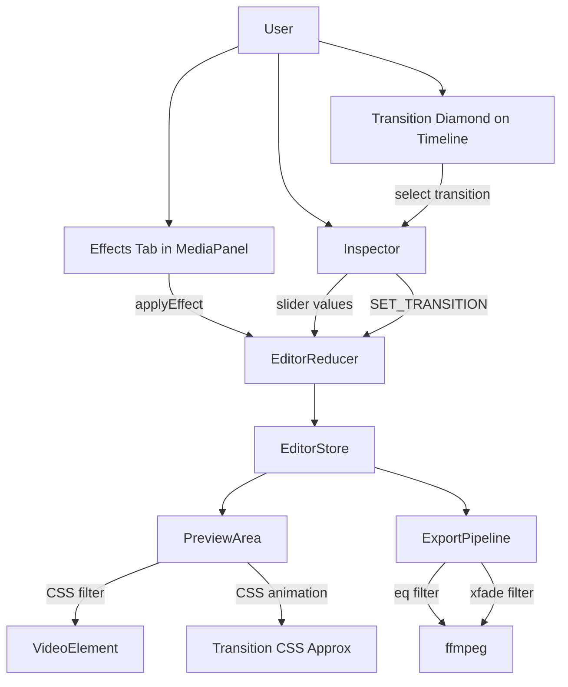
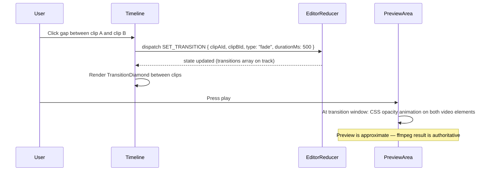

# HLD + LLD: Effects and Transitions

**Phase:** 5 (last) | **Effort:** ~12 days | **Depends on:** Editor Core (Phase 2), Assembly System (Phase 4)

---

# HLD: Effects and Transitions

## Overview

The editor supports hard cuts only. Effects tab presets exist in the UI but do nothing. This phase wires the existing no-op effects to actually modify clips, adds 5 transition types between clips (rendered via ffmpeg `xfade` on export, approximated via CSS on preview), and adds color filter controls. Speed ramps are explicitly deferred. This is Phase 5 because hard cuts and no effects still produce a postable reel — captions and assembly matter more.

## System Context Diagram



## Components

| Component | Responsibility | Technology |
|---|---|---|
| `EffectsTab` (existing) | List of color preset cards | React — currently no-op |
| `applyEffect()` | Wire effect presets to `UPDATE_CLIP` | Fix existing function |
| `TransitionDiamond` | Diamond icon between clips on timeline | React, SVG |
| Transition Inspector section | Type picker, duration slider | React |
| CSS transition preview | Approximate cross-fade/slide on preview | CSS animations |
| ffmpeg `xfade` filtergraph | Real transitions on export | ffmpeg |
| `buildXfadeFiltergraph()` | Compute cumulative offsets for xfade chain | TypeScript utility |

## Data Flow



## Key Design Decisions

- **Transitions live on the Track, keyed by clip pair** — not on clips. Deleting a clip auto-removes its transitions because the frontend filters `track.transitions` by active clip IDs.
- **CSS approximation for preview, xfade for export** — exact preview would require compositing two video elements frame-by-frame. CSS is close enough; users are warned "preview is approximate."
- **Color effects are clip properties (contrast, warmth, opacity)** — already modeled on the Clip type. The Effects tab just writes to those fields via `UPDATE_CLIP`.
- **No speed ramps** — deferred. Constant speed (existing `speed` property) is sufficient.

## Out of Scope

- Custom user-created transitions
- 3D transitions (cube, sphere)
- LUT color grading
- Green screen / chroma key
- Motion tracking
- Speed ramps
- Audio effects (reverb, pitch shift)

## Open Questions

- Does the current ffmpeg filtergraph handle `scale`/`pad` normalization before concat? It must, otherwise `xfade` will fail if source clips differ in resolution/framerate.
- Should transition duration overlap reduce total timeline duration, or keep it constant by extending clips? Decision: overlap reduces total duration (standard behavior, matches CapCut).

---

# LLD: Effects and Transitions

## Database Schema

No new tables. Transitions are stored in the existing `tracks` JSONB on `edit_project`.

**New shape of `Track` JSONB:**
```typescript
interface Transition {
  id: string;
  type: "fade" | "slide-left" | "slide-up" | "dissolve" | "wipe-right" | "none";
  durationMs: number;   // 200–2000ms
  clipAId: string;      // the clip that ends
  clipBId: string;      // the clip that starts
}

interface Track {
  // existing fields:
  id: string;
  type: "video" | "audio" | "music" | "text";
  name: string;
  muted: boolean;
  locked: boolean;
  clips: Clip[];
  // new field:
  transitions: Transition[];
}
```

No migration needed — JSONB is schema-free, existing rows just have no `transitions` key (treated as `[]`).

## API Contracts

No new endpoints. All transition/effect state is stored in the timeline `tracks` JSONB and persisted via the existing `PATCH /api/editor/:id`.

The export endpoint (`POST /api/editor/:id/export`) reads transitions from the tracks JSONB and applies them in the filtergraph — no contract change needed.

## Backend Implementation

**File:** `backend/src/routes/editor/export/filtergraph.ts` (new utility, or extend existing export logic)

### xfade filtergraph builder

```typescript
interface ClipExportData {
  inputIndex: number;    // ffmpeg input index [0], [1], [2]...
  durationSeconds: number;
  transition?: {
    type: string;
    durationSeconds: number;
  };
}

export function buildXfadeFiltergraph(clips: ClipExportData[]): string {
  if (clips.length === 1) {
    return `[0:v]copy[vout]`;
  }

  const filters: string[] = [];
  let currentOutput = `[${clips[0].inputIndex}:v]`;
  let accumulatedDuration = clips[0].durationSeconds;

  for (let i = 1; i < clips.length; i++) {
    const clip = clips[i];
    const prevClip = clips[i - 1];
    const transition = prevClip.transition;

    if (transition && transition.type !== "none") {
      const xfadeType = xfadeTypeMap[transition.type];
      const offset = accumulatedDuration - transition.durationSeconds;
      const nextOutput = i === clips.length - 1 ? "[vout]" : `[vx${i}]`;

      filters.push(
        `${currentOutput}[${clip.inputIndex}:v]xfade=transition=${xfadeType}:duration=${transition.durationSeconds}:offset=${offset}${nextOutput}`
      );
      accumulatedDuration += clip.durationSeconds - transition.durationSeconds;
      currentOutput = nextOutput;
    } else {
      // Hard cut: use concat
      // Collect all hard-cut clips and do one concat at the end
      // (complex when mixed with xfade — handle via segment grouping)
      // Simplified: for MVP, use xfade with transition=fade duration=0 for hard cuts
      const nextOutput = i === clips.length - 1 ? "[vout]" : `[vx${i}]`;
      filters.push(
        `${currentOutput}[${clip.inputIndex}:v]xfade=transition=fade:duration=0.001:offset=${accumulatedDuration}${nextOutput}`
      );
      accumulatedDuration += clip.durationSeconds;
      currentOutput = nextOutput;
    }
  }

  return filters.join(";\n");
}

const xfadeTypeMap: Record<string, string> = {
  "fade": "fade",
  "slide-left": "slideleft",
  "slide-up": "slideup",
  "dissolve": "dissolve",
  "wipe-right": "wiperight",
};
```

**Integration in export handler:**
```typescript
// Before: simple concat filtergraph
// After: call buildXfadeFiltergraph with clip data + transitions from tracks

const videoTrack = tracks.find(t => t.type === "video");
const transitions = videoTrack?.transitions ?? [];

const clipExportData = videoClips.map((clip, i) => {
  const nextTransition = transitions.find(t => t.clipAId === clip.id);
  return {
    inputIndex: i,
    durationSeconds: clip.durationMs / 1000,
    transition: nextTransition ? {
      type: nextTransition.type,
      durationSeconds: nextTransition.durationMs / 1000,
    } : undefined,
  };
});

const filtergraph = buildXfadeFiltergraph(clipExportData);
```

**Prerequisite:** All clips must be normalized to the same resolution and framerate before xfade. The existing export pipeline should already do this via `scale` and `fps` ffmpeg filters applied to each input. Verify this before implementing.

### Color filter mapping for export

```typescript
// Existing: opacity and contrast are already applied via CSS on preview
// For export, map clip color properties to ffmpeg eq filter:

function buildColorFilter(clip: Clip): string {
  const filters: string[] = [];

  if (clip.contrast && clip.contrast !== 0) {
    // contrast: -100 to 100 → ffmpeg contrast: -1000 to 1000 (roughly)
    filters.push(`eq=contrast=${1 + clip.contrast / 100}`);
  }
  if (clip.warmth && clip.warmth !== 0) {
    // warmth: shift color temperature via hue/saturation approximation
    // Simple: adjust colorbalance filter
    const warmShift = clip.warmth / 200;  // -0.5 to 0.5
    filters.push(`colorbalance=rs=${warmShift}:bs=${-warmShift}`);
  }
  if (clip.opacity && clip.opacity !== 1) {
    filters.push(`format=yuva420p,colorchannelmixer=aa=${clip.opacity}`);
  }

  return filters.join(",");
}
```

## Frontend Implementation

**Feature dir:** `frontend/src/features/editor/`

### Fix: Wire Effects Tab to actual clip update

**`components/MediaPanel.tsx`** (or wherever `applyEffect` lives):

The current `applyEffect` is a no-op. Fix:
```typescript
// The component needs access to selectedClipId and the dispatch function.
// Pass these down from EditorLayout:

const applyEffect = (effect: typeof EFFECTS[number]) => {
  if (!selectedClipId) return;
  dispatch({
    type: "UPDATE_CLIP",
    clipId: selectedClipId,
    changes: {
      contrast: effect.contrast ?? 0,
      warmth: effect.warmth ?? 0,
      opacity: effect.opacity ?? 1,
    },
  });
};
```

This is the smallest possible change — no new files needed.

### New: Transition data model in reducer

**`store/editor-reducer.ts`** — new actions:

```typescript
type EditorAction =
  // existing...
  | { type: "SET_TRANSITION"; trackId: string; clipAId: string; clipBId: string; transitionType: Transition["type"]; durationMs: number }
  | { type: "REMOVE_TRANSITION"; trackId: string; transitionId: string }

case "SET_TRANSITION": {
  return produce(state, draft => {
    const track = draft.tracks.find(t => t.id === action.trackId);
    if (!track) return;
    if (!track.transitions) track.transitions = [];
    const existing = track.transitions.find(
      t => t.clipAId === action.clipAId && t.clipBId === action.clipBId
    );
    if (existing) {
      existing.type = action.transitionType;
      existing.durationMs = action.durationMs;
    } else {
      track.transitions.push({
        id: crypto.randomUUID(),
        type: action.transitionType,
        durationMs: action.durationMs,
        clipAId: action.clipAId,
        clipBId: action.clipBId,
      });
    }
  });
}

case "REMOVE_TRANSITION": {
  return produce(state, draft => {
    const track = draft.tracks.find(t => t.id === action.trackId);
    if (!track) return;
    track.transitions = (track.transitions ?? []).filter(t => t.id !== action.transitionId);
  });
}
```

### New: TransitionDiamond component

**`components/TransitionDiamond.tsx`**

Renders between two adjacent clips on the timeline:
```typescript
interface Props {
  clipA: Clip;
  clipB: Clip;
  transition: Transition | undefined;
  track: Track;
  zoom: number;          // px per second
  onSelect: () => void;  // show in Inspector
}

export function TransitionDiamond({ clipA, clipB, transition, zoom, onSelect }: Props) {
  const gapStartPx = (clipA.startMs + clipA.durationMs) / 1000 * zoom;
  const gapEndPx = clipB.startMs / 1000 * zoom;
  const midPx = (gapStartPx + gapEndPx) / 2;

  const hasTransition = transition && transition.type !== "none";

  return (
    <div
      style={{ position: "absolute", left: midPx - 8, top: "50%", transform: "translateY(-50%)" }}
      onClick={onSelect}
      className={`cursor-pointer ${hasTransition ? "text-blue-400" : "text-gray-500 hover:text-gray-300"}`}
    >
      ◆
    </div>
  );
}
```

### Inspector: Transition section

When a transition diamond is selected, show in Inspector:
```typescript
// Transition type picker (radio or segmented control):
const TRANSITION_OPTIONS = [
  { value: "none", label: "Cut" },
  { value: "fade", label: "Fade" },
  { value: "slide-left", label: "Slide" },
  { value: "slide-up", label: "Slide Up" },
  { value: "dissolve", label: "Dissolve" },
  { value: "wipe-right", label: "Wipe" },
];

// Duration slider: 200ms to 2000ms, step 100ms
```

### CSS preview approximation

In `PreviewArea.tsx`, when playback time enters the transition window:
```typescript
// During transition window [clipA end - durationMs, clipA end]:
// Fade: animate opacity
// Slide-left: animate translateX on incoming clip

const getTransitionStyle = (clip: Clip, currentTimeMs: number): React.CSSProperties => {
  const transition = findTransitionForClip(transitions, clip.id);
  if (!transition || transition.type === "none") return {};

  const clipEnd = clip.startMs + clip.durationMs;
  const windowStart = clipEnd - transition.durationMs;
  if (currentTimeMs < windowStart || currentTimeMs > clipEnd) return {};

  const progress = (currentTimeMs - windowStart) / transition.durationMs;

  switch (transition.type) {
    case "fade":
      return { opacity: 1 - progress };
    case "slide-left":
      return { transform: `translateX(${-progress * 100}%)` };
    default:
      return {};
  }
};
```

### Query keys

No new query keys — transitions are part of the timeline JSONB.

### i18n keys

```json
{
  "editor": {
    "transitions": {
      "label": "Transition",
      "cut": "Cut",
      "fade": "Fade",
      "slideLeft": "Slide Left",
      "slideUp": "Slide Up",
      "dissolve": "Dissolve",
      "wipeRight": "Wipe Right",
      "duration": "Duration",
      "previewNote": "Preview is approximate — export to see the final result"
    },
    "effects": {
      "label": "Color preset",
      "noClipSelected": "Select a clip to apply effects"
    }
  }
}
```

## Build Sequence

1. Fix: Wire `applyEffect` in Effects Tab to `UPDATE_CLIP` dispatch — 0.5 day
2. Frontend: `Transition` type + `SET_TRANSITION` / `REMOVE_TRANSITION` reducer actions — 1 day
3. Frontend: `TransitionDiamond` rendered between adjacent clips on video track — 1.5 days
4. Frontend: Transition section in Inspector (type picker + duration slider) — 1 day
5. Frontend: CSS preview approximation for fade and slide transitions — 1.5 days
6. Backend: `buildXfadeFiltergraph` utility — 1.5 days
7. Backend: Integrate xfade into export handler — 1 day
8. Backend: Color filter (`eq`, `colorbalance`) mapped from clip properties in export — 1 day
9. Testing (transition timing, export quality, single-clip edge case) — 2 days

## Edge Cases & Error States

- **Transition when only one clip on track:** `TransitionDiamond` only renders when there are two adjacent clips. No diamond = no transition. `buildXfadeFiltergraph` with a single clip returns a simple `copy` filter.
- **Transition duration longer than the shorter clip:** Cap `transition.durationMs` to `min(clipA.durationMs, clipB.durationMs) - 100ms`. Enforce in reducer and in the Inspector duration slider max.
- **Clips with gap between them (not adjacent):** No transition diamond renders for a gap. Transitions only between clips with zero gap. If user adds a transition and then moves a clip to create a gap, remove the transition automatically.
- **ffmpeg xfade normalization failure:** If source clips have different resolutions, `xfade` will fail. The export handler must normalize all clip inputs to the target resolution before building the xfade filtergraph. Use `scale=W:H:force_original_aspect_ratio=decrease,pad=W:H:(ow-iw)/2:(oh-ih)/2` per input.
- **Color filter: warmth at 0, contrast at 0, opacity at 1** — skip the `eq`/`colorbalance` filters entirely for unchanged clips. Unnecessary filters add ffmpeg processing time.

## Dependencies on Other Systems

- **Phase 2 (Editor Core)** — clip dragging and snapping must be stable before adding transitions on top
- **Phase 4 (Assembly System)** — not a hard dependency, but transitions are most useful once shot assembly is working (you apply transitions between assembled shots)
- **ffmpeg xfade** — requires ffmpeg ≥ 4.3. Verify the server's ffmpeg version.
- **Existing export pipeline normalization** — clips must be scaled/padded to uniform resolution before xfade. Must verify this is already happening, or add it.
