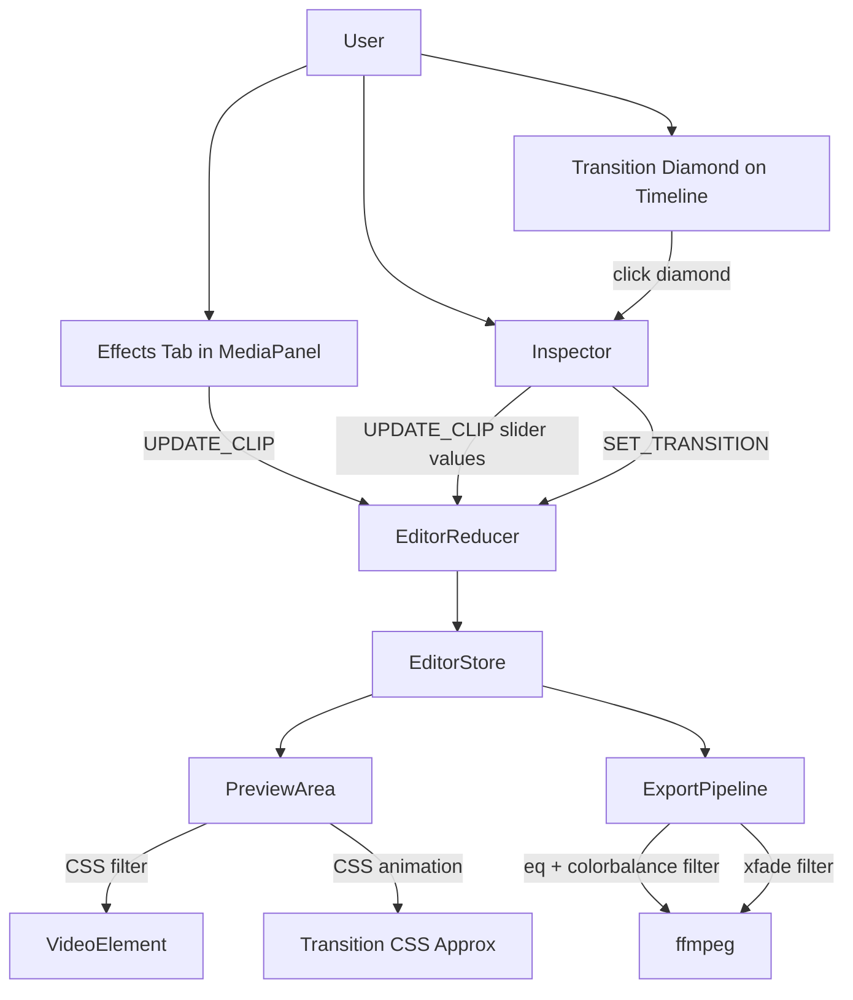
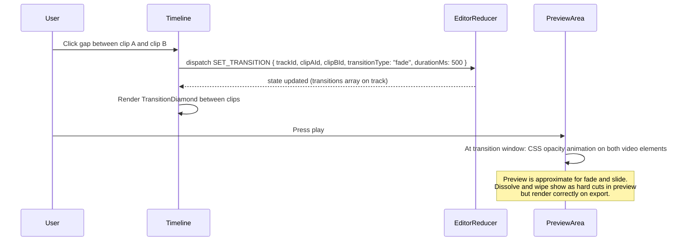

# HLD + LLD: Effects and Transitions

**Phase:** 5 (last) | **Effort:** ~12 days | **Depends on:** Editor Core (Phase 2), Assembly System (Phase 4)

---

# HLD: Effects and Transitions

## Overview

The editor supports hard cuts only. The Effects tab in `MediaPanel` lists five color presets but `applyEffect` is a no-op (line 148 of `MediaPanel.tsx`). This phase wires the existing no-op effects to actually modify clips, adds 5 transition types between clips (rendered via ffmpeg `xfade` on export, approximated via CSS on preview), and adds color filter controls. Speed ramps are explicitly deferred. This is Phase 5 because hard cuts and no effects still produce a postable reel.

## System Context Diagram



## Components

| Component | Responsibility | Technology |
|---|---|---|
| `EffectsTab` (existing in `MediaPanel.tsx`) | List of color preset cards — currently no-op | React |
| `applyEffect()` (existing, line 148) | Wire effect presets to `UPDATE_CLIP` dispatch | Needs fix: add `selectedClipId` + `dispatch` props |
| `TransitionDiamond` (new) | Diamond icon between adjacent clips on timeline | React, SVG |
| Transition Inspector section (new) | Type picker + duration slider when diamond selected | React |
| CSS transition preview | Approximate fade/slide on preview, hard-cut for dissolve/wipe | CSS animations |
| ffmpeg xfade filtergraph | Real transitions on export — replaces `concat` in `runExportJob` lines 616-624 | ffmpeg |

## Data Flow



## Key Design Decisions

- **Transitions live on the Track, keyed by clip pair** — not on clips. Deleting a clip auto-removes its transitions because the reducer filters `track.transitions` by active clip IDs.
- **CSS approximation for preview, xfade for export** — exact preview would require frame-by-frame compositing. CSS is close enough for fade and slide. Dissolve and wipe have no good CSS equivalent and show as hard cuts in preview. State this in the UI.
- **Color effects are clip properties (contrast, warmth, opacity)** — already modeled on the `Clip` type (lines 19-21 of `editor.ts`). The Effects tab just writes to those fields via `UPDATE_CLIP`.
- **Transition duration constraint** — enforce `durationMs <= min(clipA.durationMs, clipB.durationMs) - 100`. Validated in both the reducer (`SET_TRANSITION` case) and the Inspector duration slider `max` prop.
- **No speed ramps** — deferred. Constant speed (existing `speed` property) is sufficient.

## Out of Scope

- Custom user-created transitions
- 3D transitions (cube, sphere)
- LUT color grading
- Green screen / chroma key
- Motion tracking
- Speed ramps
- Audio effects (reverb, pitch shift)

## Performance

- **xfade filtergraph building** is O(clips) — trivial. A typical project has <20 video clips.
- **CSS transition preview** uses a simple time check per frame during playback — trivial. No per-pixel compositing.

---

# LLD: Effects and Transitions

## Database Schema

No new tables. No migrations. Transitions are stored inside the existing `tracks` JSONB column on `edit_project`.

**Final Drizzle schema shape** (no changes to `schema.ts` — the column is `jsonb("tracks")`):

```typescript
// backend/src/infrastructure/database/drizzle/schema.ts — line 492, unchanged
tracks: jsonb("tracks").notNull().default([]),
```

The JSONB structure gains a `transitions` array per track. Existing rows without `transitions` are treated as `[]` at read time.

**Full JSONB shape after this phase:**

```typescript
interface Transition {
  id: string;
  type: "fade" | "slide-left" | "slide-up" | "dissolve" | "wipe-right" | "none";
  durationMs: number;   // 200-2000, constrained to min(clipA, clipB) - 100
  clipAId: string;      // the clip that ends
  clipBId: string;      // the clip that starts
}

interface Track {
  id: string;
  type: "video" | "audio" | "music" | "text";
  name: string;
  muted: boolean;
  locked: boolean;
  clips: Clip[];
  transitions: Transition[];  // NEW — empty array for existing projects
}
```

## API Contracts

No new endpoints. All transition/effect state is stored in the timeline `tracks` JSONB and persisted via the existing `PATCH /api/editor/:id`. The export endpoint (`POST /api/editor/:id/export`) reads transitions from the tracks JSONB and applies them in the filtergraph — no contract change.

## Backend Implementation

### 1. Update `trackDataSchema` zod validation

**File:** `backend/src/routes/editor/index.ts`, lines 44-51

Current:

```typescript
const trackDataSchema = z.object({
  id: z.string().min(1).optional(),
  type: z.enum(["video", "audio", "music", "text"]),
  muted: z.boolean(),
  locked: z.boolean().optional(),
  name: z.string().optional(),
  clips: z.array(clipDataSchema),
});
```

Updated (add `transitions`):

```typescript
const transitionSchema = z.object({
  id: z.string().min(1),
  type: z.enum(["fade", "slide-left", "slide-up", "dissolve", "wipe-right", "none"]),
  durationMs: z.number().int().min(200).max(2000),
  clipAId: z.string().min(1),
  clipBId: z.string().min(1),
});

const trackDataSchema = z.object({
  id: z.string().min(1).optional(),
  type: z.enum(["video", "audio", "music", "text"]),
  muted: z.boolean(),
  locked: z.boolean().optional(),
  name: z.string().optional(),
  clips: z.array(clipDataSchema),
  transitions: z.array(transitionSchema).optional(), // defaults to [] at read time
});
```

### 2. Update `TrackData` interface

**File:** `backend/src/routes/editor/index.ts`, lines 456-460

Current:

```typescript
interface TrackData {
  type: "video" | "audio" | "music" | "text";
  muted: boolean;
  clips: ClipData[];
}
```

Updated:

```typescript
interface TransitionData {
  id: string;
  type: "fade" | "slide-left" | "slide-up" | "dissolve" | "wipe-right" | "none";
  durationMs: number;
  clipAId: string;
  clipBId: string;
}

interface TrackData {
  type: "video" | "audio" | "music" | "text";
  muted: boolean;
  clips: ClipData[];
  transitions?: TransitionData[];
}
```

### 3. Replace `concat` with `xfade` in `runExportJob`

The existing filtergraph code at lines 595-624 of `backend/src/routes/editor/index.ts` trims/scales each clip, then concatenates them:

```typescript
// CURRENT lines 616-624 — to be replaced:
if (videoInputCount > 1) {
  const concatInputs = videoClips.map((_, i) => `[v${i}]`).join("");
  filterParts.push(
    `${concatInputs}concat=n=${videoInputCount}:v=1:a=0[vconcat]`,
  );
  latestVideoLabel = "vconcat";
} else {
  latestVideoLabel = "v0";
}
```

Replace lines 616-624 with the following. This builds xfade filters inline (no separate utility file needed):

```typescript
// NEW: Replace concat with xfade-aware joining
const transitions = videoTrack?.transitions ?? [];

if (videoInputCount === 1) {
  latestVideoLabel = "v0";
} else {
  // Map from xfade type names to ffmpeg xfade transition names
  const xfadeTypeMap: Record<string, string> = {
    "fade": "fade",
    "slide-left": "slideleft",
    "slide-up": "slideup",
    "dissolve": "dissolve",
    "wipe-right": "wiperight",
  };

  let currentLabel = "[v0]";
  let accumulatedDuration = videoClips[0].durationMs / 1000;

  for (let i = 1; i < videoClips.length; i++) {
    const clipA = videoClips[i - 1];
    const clipB = videoClips[i];
    const trans = transitions.find(
      (t) => t.clipAId === clipA.id && t.clipBId === clipB.id,
    );

    const isLast = i === videoClips.length - 1;
    const outLabel = isLast ? "[vjoined]" : `[vx${i}]`;

    if (trans && trans.type !== "none" && xfadeTypeMap[trans.type]) {
      const xfadeType = xfadeTypeMap[trans.type];
      const transDurSec = trans.durationMs / 1000;
      const offset = accumulatedDuration - transDurSec;

      filterParts.push(
        `${currentLabel}[v${i}]xfade=transition=${xfadeType}:duration=${transDurSec}:offset=${offset.toFixed(4)}${outLabel}`,
      );
      accumulatedDuration += clipB.durationMs / 1000 - transDurSec;
    } else {
      // No transition — hard cut via xfade with near-zero duration
      const offset = accumulatedDuration;
      filterParts.push(
        `${currentLabel}[v${i}]xfade=transition=fade:duration=0.001:offset=${offset.toFixed(4)}${outLabel}`,
      );
      accumulatedDuration += clipB.durationMs / 1000;
    }
    currentLabel = outLabel;
  }
  latestVideoLabel = "vjoined";
}
```

Everything after line 624 (text overlays at line 627, audio mixing at line 647, ffmpeg invocation at line 669) stays the same. The only change is that `latestVideoLabel` is now `"vjoined"` instead of `"vconcat"` when there are multiple clips.

### Transition offset calculation — concrete example

```
Clip A: 0-5000ms (5s), Clip B: 5000-9000ms (4s), Clip C: 9000-12000ms (3s)
Transition A->B: fade 500ms, Transition B->C: slide-left 300ms

xfade offset for A->B:
  accumulatedDuration starts at 5.0 (clipA duration)
  offset = 5.0 - 0.5 = 4.5s
  accumulatedDuration = 5.0 + 4.0 - 0.5 = 8.5s

xfade offset for B->C:
  offset = 8.5 - 0.3 = 8.2s
  accumulatedDuration = 8.5 + 3.0 - 0.3 = 11.2s

Total output duration = 5.0 + 4.0 + 3.0 - 0.5 - 0.3 = 11.2s

Generated filtergraph:
  [v0][v1]xfade=transition=fade:duration=0.5:offset=4.5000[vx1];
  [vx1][v2]xfade=transition=slideleft:duration=0.3:offset=8.2000[vjoined]
```

### 4. Color filter mapping for export

Add per-clip color filters to the trim/scale step at lines 599-610. Currently each clip gets `trim -> speed -> scale -> pad -> setpts`. Insert `eq` and `colorbalance` between `pad` and `setpts`:

```typescript
// In the videoClips.forEach loop (line 599), after pad and before setpts:
videoClips.forEach((clip, i) => {
  const trimStart = (clip.trimStartMs ?? 0) / 1000;
  const pts =
    clip.speed && clip.speed !== 1
      ? `setpts=${(1 / clip.speed).toFixed(4)}*PTS,`
      : "";

  // Color filters (only if non-default)
  const colorFilters: string[] = [];
  if (clip.contrast && clip.contrast !== 0) {
    colorFilters.push(`eq=contrast=${1 + clip.contrast / 100}`);
  }
  if (clip.warmth && clip.warmth !== 0) {
    const warmShift = clip.warmth / 200; // -0.5 to 0.5
    colorFilters.push(`colorbalance=rs=${warmShift}:bs=${-warmShift}`);
  }
  if (clip.opacity !== undefined && clip.opacity !== 1) {
    colorFilters.push(`format=yuva420p,colorchannelmixer=aa=${clip.opacity}`);
  }
  const colorStr = colorFilters.length > 0 ? colorFilters.join(",") + "," : "";

  filterParts.push(
    `[${i}:v]trim=start=${trimStart}:duration=${clip.durationMs / 1000},` +
      `${pts}scale=${outW}:${outH}:force_original_aspect_ratio=decrease,` +
      `pad=${outW}:${outH}:(ow-iw)/2:(oh-ih)/2:black,${colorStr}setpts=PTS-STARTPTS[v${i}]`,
  );
});
```

Clips with default values (contrast=0, warmth=0, opacity=1) skip the color filters entirely — no unnecessary ffmpeg processing.

## Frontend Implementation

**Feature dir:** `frontend/src/features/editor/`

### 1. Update `Transition` type and `Track` interface

**File:** `frontend/src/features/editor/types/editor.ts`

Add `Transition` interface and update `Track`:

```typescript
// Add after TextStyle interface (line 6):

export interface Transition {
  id: string;
  type: "fade" | "slide-left" | "slide-up" | "dissolve" | "wipe-right" | "none";
  durationMs: number;
  clipAId: string;
  clipBId: string;
}
```

Update the `Track` interface (lines 37-44):

```typescript
export interface Track {
  id: string;
  type: TrackType;
  name: string;
  muted: boolean;
  locked: boolean;
  clips: Clip[];
  transitions: Transition[]; // NEW
}
```

### 2. Add `SET_TRANSITION` and `REMOVE_TRANSITION` to `EditorAction`

**File:** `frontend/src/features/editor/types/editor.ts`, lines 86-101

Add two new cases to the `EditorAction` union:

```typescript
export type EditorAction =
  | { type: "LOAD_PROJECT"; project: EditProject }
  | { type: "SET_TITLE"; title: string }
  | { type: "SET_CURRENT_TIME"; ms: number }
  | { type: "SET_PLAYING"; playing: boolean }
  | { type: "SET_ZOOM"; zoom: number }
  | { type: "SELECT_CLIP"; clipId: string | null }
  | { type: "ADD_CLIP"; trackId: string; clip: Clip }
  | { type: "UPDATE_CLIP"; clipId: string; patch: Partial<Clip> }
  | { type: "REMOVE_CLIP"; clipId: string }
  | { type: "TOGGLE_TRACK_MUTE"; trackId: string }
  | { type: "TOGGLE_TRACK_LOCK"; trackId: string }
  | { type: "UNDO" }
  | { type: "REDO" }
  | { type: "SET_EXPORT_JOB"; jobId: string | null }
  | { type: "SET_EXPORT_STATUS"; status: ExportJobStatus | null }
  // NEW:
  | { type: "SET_TRANSITION"; trackId: string; clipAId: string; clipBId: string; transitionType: Transition["type"]; durationMs: number }
  | { type: "REMOVE_TRANSITION"; trackId: string; transitionId: string };
```

### 3. Add reducer cases

**File:** `frontend/src/features/editor/hooks/useEditorStore.ts`

Add import for `Transition` type:

```typescript
import type {
  EditorState,
  EditorAction,
  Track,
  Clip,
  Transition,  // NEW
  EditProject,
  ExportJobStatus,
} from "../types/editor";
```

Update `DEFAULT_TRACKS` to include `transitions: []`:

```typescript
const DEFAULT_TRACKS: Track[] = [
  { id: "video", type: "video", name: "Video", muted: false, locked: false, clips: [], transitions: [] },
  { id: "audio", type: "audio", name: "Audio", muted: false, locked: false, clips: [], transitions: [] },
  { id: "music", type: "music", name: "Music", muted: false, locked: false, clips: [], transitions: [] },
  { id: "text",  type: "text",  name: "Text",  muted: false, locked: false, clips: [], transitions: [] },
];
```

Add these two cases to `editorReducer`, before the `default` case (line 216):

```typescript
case "SET_TRANSITION": {
  const track = state.tracks.find((t) => t.id === action.trackId);
  if (!track) return state;

  // Validate duration constraint: must be <= min(clipA, clipB) - 100
  const clipA = track.clips.find((c) => c.id === action.clipAId);
  const clipB = track.clips.find((c) => c.id === action.clipBId);
  if (!clipA || !clipB) return state;

  const maxDuration = Math.min(clipA.durationMs, clipB.durationMs) - 100;
  const clampedDuration = Math.max(200, Math.min(action.durationMs, maxDuration));

  const transitions = track.transitions ?? [];
  const existingIdx = transitions.findIndex(
    (t) => t.clipAId === action.clipAId && t.clipBId === action.clipBId,
  );

  let newTransitions: Transition[];
  if (existingIdx >= 0) {
    newTransitions = transitions.map((t, idx) =>
      idx === existingIdx
        ? { ...t, type: action.transitionType, durationMs: clampedDuration }
        : t,
    );
  } else {
    newTransitions = [
      ...transitions,
      {
        id: crypto.randomUUID(),
        type: action.transitionType,
        durationMs: clampedDuration,
        clipAId: action.clipAId,
        clipBId: action.clipBId,
      },
    ];
  }

  const newTracks = state.tracks.map((t) =>
    t.id === action.trackId ? { ...t, transitions: newTransitions } : t,
  );
  return {
    ...state,
    past: [...state.past, state.tracks].slice(-50),
    future: [],
    tracks: newTracks,
  };
}

case "REMOVE_TRANSITION": {
  const newTracks = state.tracks.map((t) =>
    t.id === action.trackId
      ? { ...t, transitions: (t.transitions ?? []).filter((tr) => tr.id !== action.transitionId) }
      : t,
  );
  return {
    ...state,
    past: [...state.past, state.tracks].slice(-50),
    future: [],
    tracks: newTracks,
  };
}
```

Add convenience functions in `useEditorReducer` return block:

```typescript
const setTransition = useCallback(
  (trackId: string, clipAId: string, clipBId: string, transitionType: Transition["type"], durationMs: number) =>
    dispatch({ type: "SET_TRANSITION", trackId, clipAId, clipBId, transitionType, durationMs }),
  [],
);
const removeTransition = useCallback(
  (trackId: string, transitionId: string) =>
    dispatch({ type: "REMOVE_TRANSITION", trackId, transitionId }),
  [],
);
```

### 4. Wire Effects Tab — fix `applyEffect` no-op

**Problem:** `MediaPanel.tsx` line 148 has a no-op `applyEffect`. It cannot dispatch because it has no access to `selectedClipId` or `dispatch`.

**Step 1 — Update `MediaPanel` props:**

**File:** `frontend/src/features/editor/components/MediaPanel.tsx`, lines 22-26

```typescript
interface Props {
  generatedContentId: number | null;
  currentTimeMs: number;
  onAddClip: (trackId: string, clip: Clip) => void;
  selectedClipId: string | null;                    // NEW
  onUpdateClip: (clipId: string, patch: Partial<Clip>) => void;  // NEW
}
```

**Step 2 — Update component signature (line 86-90):**

```typescript
export function MediaPanel({
  generatedContentId,
  currentTimeMs,
  onAddClip,
  selectedClipId,
  onUpdateClip,
}: Props) {
```

**Step 3 — Replace the no-op `applyEffect` (line 148-150):**

```typescript
const applyEffect = (effect: (typeof EFFECTS)[0]) => {
  if (!selectedClipId) return;
  onUpdateClip(selectedClipId, {
    contrast: effect.contrast ?? 0,
    warmth: effect.warmth ?? 0,
    opacity: effect.opacity ?? 1,
  });
};
```

**Step 4 — Update caller in `EditorLayout.tsx` (lines 331-335):**

```typescript
<MediaPanel
  generatedContentId={project.generatedContentId}
  currentTimeMs={state.currentTimeMs}
  onAddClip={handleAddClip}
  selectedClipId={state.selectedClipId}
  onUpdateClip={handleUpdateClip}
/>
```

### 5. TransitionDiamond component

**New file:** `frontend/src/features/editor/components/TransitionDiamond.tsx`

```typescript
import type { Clip, Transition } from "../types/editor";

interface Props {
  clipA: Clip;
  clipB: Clip;
  transition: Transition | undefined;
  zoom: number;
  onSelect: () => void;
}

export function TransitionDiamond({ clipA, clipB, transition, zoom, onSelect }: Props) {
  const gapStartPx = ((clipA.startMs + clipA.durationMs) / 1000) * zoom;
  const gapEndPx = (clipB.startMs / 1000) * zoom;
  const midPx = (gapStartPx + gapEndPx) / 2;

  const hasTransition = transition && transition.type !== "none";

  return (
    <button
      style={{
        position: "absolute",
        left: midPx - 8,
        top: "50%",
        transform: "translateY(-50%)",
      }}
      onClick={(e) => {
        e.stopPropagation();
        onSelect();
      }}
      className={`w-4 h-4 flex items-center justify-center border-0 bg-transparent cursor-pointer text-sm ${
        hasTransition ? "text-blue-400" : "text-gray-500 hover:text-gray-300"
      }`}
    >
      &#9670;
    </button>
  );
}
```

Rendered by `Timeline` between each pair of adjacent clips on the video track. When clicked, the Inspector shows the transition section (type picker + duration slider).

### 6. Inspector — transition section

When a transition diamond is selected, show in `Inspector.tsx`:

```typescript
const TRANSITION_OPTIONS: { value: Transition["type"]; label: string }[] = [
  { value: "none", label: t("editor.transitions.cut") },
  { value: "fade", label: t("editor.transitions.fade") },
  { value: "slide-left", label: t("editor.transitions.slideLeft") },
  { value: "slide-up", label: t("editor.transitions.slideUp") },
  { value: "dissolve", label: t("editor.transitions.dissolve") },
  { value: "wipe-right", label: t("editor.transitions.wipeRight") },
];

// Duration slider max is constrained:
const clipA = track.clips.find((c) => c.id === transition.clipAId);
const clipB = track.clips.find((c) => c.id === transition.clipBId);
const maxDuration = clipA && clipB
  ? Math.min(clipA.durationMs, clipB.durationMs) - 100
  : 2000;

<Slider
  min={200}
  max={maxDuration}
  step={100}
  value={transition.durationMs}
  onChange={(val) =>
    dispatch({
      type: "SET_TRANSITION",
      trackId: track.id,
      clipAId: transition.clipAId,
      clipBId: transition.clipBId,
      transitionType: transition.type,
      durationMs: val,
    })
  }
/>
```

The `maxDuration` constraint here mirrors the reducer validation. Both enforce `durationMs <= min(clipA.durationMs, clipB.durationMs) - 100`.

### 7. CSS preview approximation

**File:** `frontend/src/features/editor/components/PreviewArea.tsx`

During playback, when the current time enters a transition window, apply CSS styles to the outgoing clip's video element:

```typescript
function getTransitionStyle(
  clip: Clip,
  transitions: Transition[],
  currentTimeMs: number,
): React.CSSProperties {
  // Find transition where this clip is clipA (outgoing)
  const transition = transitions.find((t) => t.clipAId === clip.id);
  if (!transition || transition.type === "none") return {};

  const clipEnd = clip.startMs + clip.durationMs;
  const windowStart = clipEnd - transition.durationMs;
  if (currentTimeMs < windowStart || currentTimeMs > clipEnd) return {};

  const progress = (currentTimeMs - windowStart) / transition.durationMs;

  switch (transition.type) {
    case "fade":
      return { opacity: 1 - progress };
    case "slide-left":
      return { transform: `translateX(${-progress * 100}%)` };
    case "slide-up":
      return { transform: `translateY(${-progress * 100}%)` };
    case "dissolve":
      // No good CSS equivalent. Show as hard cut in preview.
      return {};
    case "wipe-right":
      // No good CSS equivalent. Show as hard cut in preview.
      return {};
    default:
      return {};
  }
}
```

**Preview fidelity by transition type:**

| Transition | Preview | Export |
|---|---|---|
| `fade` | CSS opacity animation | ffmpeg `xfade=transition=fade` |
| `slide-left` | CSS `translateX` | ffmpeg `xfade=transition=slideleft` |
| `slide-up` | CSS `translateY` | ffmpeg `xfade=transition=slideup` |
| `dissolve` | Hard cut (no CSS equivalent) | ffmpeg `xfade=transition=dissolve` |
| `wipe-right` | Hard cut (no CSS equivalent) | ffmpeg `xfade=transition=wiperight` |

Display in the UI: "Preview is approximate for fade and slide transitions. Dissolve and wipe show as hard cuts in preview but render correctly on export."

### 8. i18n keys

**File:** `frontend/src/translations/en.json` — add under `editor`:

```json
{
  "editor": {
    "transitions": {
      "label": "Transition",
      "cut": "Cut",
      "fade": "Fade",
      "slideLeft": "Slide Left",
      "slideUp": "Slide Up",
      "dissolve": "Dissolve",
      "wipeRight": "Wipe Right",
      "duration": "Duration",
      "previewNote": "Preview is approximate for fade and slide. Dissolve and wipe render on export only."
    },
    "effects": {
      "label": "Color preset",
      "noClipSelected": "Select a clip to apply effects"
    }
  }
}
```

## Build Sequence

1. Update types: `Transition` interface, `Track.transitions`, `EditorAction` union — 0.5 day
2. Reducer: `SET_TRANSITION` / `REMOVE_TRANSITION` cases with duration clamping — 1 day
3. Wire `applyEffect`: add props to `MediaPanel`, thread from `EditorLayout` — 0.5 day
4. `TransitionDiamond` rendered between adjacent clips on video track — 1.5 days
5. Transition section in Inspector (type picker + duration slider with max constraint) — 1 day
6. CSS preview approximation for fade and slide — 1.5 days
7. Backend: `transitionSchema` zod + `TransitionData` interface — 0.5 day
8. Backend: replace `concat` with xfade in `runExportJob` lines 616-624 — 1.5 days
9. Backend: color filters (`eq`, `colorbalance`) in per-clip trim/scale step — 1 day
10. Testing (transition timing, export quality, single-clip edge case) — 2 days

## Edge Cases & Error States

- **Single clip on track:** `TransitionDiamond` only renders between adjacent clips. No diamond = no transition. The xfade code path produces `latestVideoLabel = "v0"` with no filter.
- **Transition duration longer than shorter clip:** Clamped to `min(clipA.durationMs, clipB.durationMs) - 100` in both the reducer (`SET_TRANSITION`) and the Inspector slider `max` prop. The 100ms buffer prevents fully overlapping clips.
- **Clips with gap between them:** No transition diamond renders for a gap. Transitions are only valid between adjacent clips with zero gap. If a user adds a transition then drags a clip to create a gap, the `REMOVE_CLIP` or `UPDATE_CLIP` action should trigger a cleanup pass that removes orphaned transitions.
- **Existing projects without transitions:** The `transitions` field is optional in zod (`z.array(transitionSchema).optional()`). Read code uses `track.transitions ?? []` everywhere.
- **ffmpeg xfade resolution mismatch:** All clips are already normalized to target resolution via `scale` + `pad` in the per-clip filter step (line 607). This runs before the xfade chain, so inputs are guaranteed to match.
- **Color filters on unchanged clips:** Clips with `contrast=0`, `warmth=0`, `opacity=1` skip the `eq`/`colorbalance` filters entirely — no unnecessary ffmpeg processing.

## Dependencies on Other Systems

- **Phase 2 (Editor Core)** — clip dragging and snapping must be stable before adding transitions on top
- **Phase 4 (Assembly System)** — not a hard dependency, but transitions are most useful once shot assembly is working
- **ffmpeg xfade** — requires ffmpeg >= 4.3. Verify the server's ffmpeg version.
