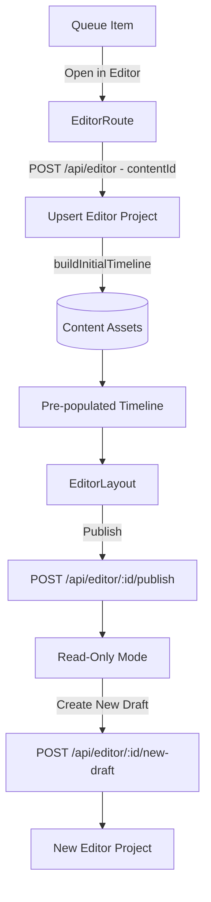
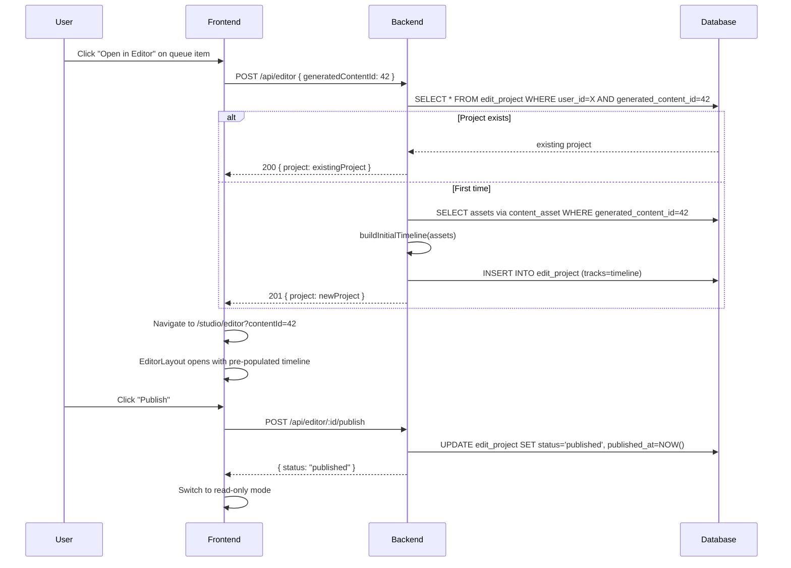

# HLD + LLD: Project Model (1:1 Binding, Publish/Draft, Locking)

**Phase:** 1 (build first) | **Effort:** ~11 days | **Depends on:** Nothing -- this is foundational

---

# HLD: Project Model

## Overview

The editor and the content pipeline are currently disconnected. Users generate content, see it in the queue, and then must manually create a blank editor project and add clips one by one. There is no 1:1 relationship between a piece of generated content and an editor project, no guard against editing conflicts, and no concept of "done." This phase makes the editor the natural continuation of the generation workflow: one click from the queue opens the editor with the timeline pre-populated, a unique constraint prevents conflicting edits, and a publish/lock model gives creators a definitive record of what they posted.

## System Context Diagram



## Components

| Component | Responsibility | Technology |
|---|---|---|
| `edit_project` schema | Add status, publishedAt, parentProjectId columns | PostgreSQL, Drizzle |
| Unique constraint | Enforce 1 editor project per (user, generatedContent) | Partial unique index |
| `POST /api/editor` | Upsert behavior: return existing if same contentId | Hono, Drizzle |
| `buildInitialTimeline()` | Auto-populate tracks from content assets | Backend service |
| `POST /api/editor/:id/publish` | Lock project, set status=published | Hono |
| `POST /api/editor/:id/new-draft` | Duplicate timeline into new draft project | Hono |
| Queue detail sheet | "Open in Editor" CTA | React |
| `EditorLayout` (read-only mode) | Disable all editing when project is published | React |
| Project list | Version grouping by `parentProjectId` chain | React |

## Data Flow



## Key Design Decisions

- **Upsert, not create** -- `POST /api/editor` with a `generatedContentId` returns an existing project rather than creating a duplicate. This is the 1:1 enforcement at the API level, complemented by a DB partial unique index as a safety net.
- **Auto-initialize timeline on first creation** -- shots land on the timeline in generation order with no user action. The editor feels integrated, not stapled-on.
- **Publish requires an export** -- you cannot publish without a final video. This ensures published projects always have an artifact.
- **New draft = standalone project with parentProjectId link** -- creating a draft from a published project sets `generatedContentId = null` and links back via `parentProjectId`. The 1:1 unique constraint is not violated.
- **Read-only enforced both in UI and backend** -- `PATCH /api/editor/:id` returns 403 if `status = 'published'`. Frontend is not the only gate.

## Out of Scope

- Branching (multiple drafts from one published version)
- Unpublish (reverting published to draft)
- Scheduled publishing
- Publishing to Instagram/TikTok
- Collaborative editing

## Open Questions

- When a "new draft" is created, should it copy the voiceover/music assets or just the timeline structure? Recommendation: copy the timeline structure with asset references -- don't duplicate R2 files, just the JSONB.
- What happens to the queue item's "Assemble" button after Phase 1? It should redirect to the editor instead of triggering a separate video assembly job.

---

# LLD: Project Model

## Database Schema

### edit_project table -- FINAL definition (bun db:reset)

This is the complete `editProjects` table definition. The three new columns (`status`, `publishedAt`, `parentProjectId`) are added inline alongside existing columns. The `resolution` default changes from `"1080p"` to `"1080x1920"`. Run `bun db:reset` to get the fresh schema -- no ALTER TABLE migration needed.

```typescript
// backend/src/infrastructure/database/drizzle/schema.ts

import {
  pgTable,
  text,
  boolean,
  timestamp,
  integer,
  numeric,
  jsonb,
  serial,
  index,
  uniqueIndex,
} from "drizzle-orm/pg-core";
import type { AnyPgColumn } from "drizzle-orm/pg-core";
import { sql } from "drizzle-orm";

export const editProjects = pgTable(
  "edit_project",
  {
    id: text("id")
      .primaryKey()
      .$defaultFn(() => crypto.randomUUID()),
    userId: text("user_id")
      .notNull()
      .references(() => users.id, { onDelete: "cascade" }),
    title: text("title").notNull().default("Untitled Edit"),
    generatedContentId: integer("generated_content_id").references(
      () => generatedContent.id,
      { onDelete: "set null" },
    ),
    tracks: jsonb("tracks").notNull().default([]),
    durationMs: integer("duration_ms").notNull().default(0),
    fps: integer("fps").notNull().default(30),
    resolution: text("resolution").notNull().default("1080x1920"),
    createdAt: timestamp("created_at").notNull().defaultNow(),
    updatedAt: timestamp("updated_at")
      .notNull()
      .defaultNow()
      .$onUpdateFn(() => new Date()),

    // ── NEW columns ──────────────────────────────────────────────────
    status: text("status").notNull().default("draft"),
    // "draft" | "published"
    publishedAt: timestamp("published_at"),
    parentProjectId: text("parent_project_id").references(
      (): AnyPgColumn => editProjects.id,
      { onDelete: "set null" },
    ),
  },
  (t) => [
    index("edit_projects_user_idx").on(t.userId),
    index("edit_projects_content_idx").on(t.generatedContentId),
    index("edit_projects_status_idx").on(t.userId, t.status),
    // 1:1 constraint: one editor project per (user, generatedContent).
    // Partial index -- only enforced when generatedContentId is non-null,
    // so standalone projects (generatedContentId = null) are unrestricted.
    uniqueIndex("edit_project_unique_content")
      .on(t.userId, t.generatedContentId)
      .where(sql`generated_content_id IS NOT NULL`),
  ],
);
```

Notes:
- `parentProjectId` uses `AnyPgColumn` for the self-referencing FK, same pattern used by `generatedContent.parentId` elsewhere in the schema.
- The `.where()` clause on `uniqueIndex` produces a Postgres partial unique index. Drizzle ORM supports this via the `sql` template tag.
- After editing `schema.ts`, run `bun db:generate` to produce the migration, then `bun db:reset` for a clean slate (dev only) or `bun db:migrate` for production.

## API Contracts

### POST /api/editor (modified -- upsert behavior)
**Auth:** `csrfMiddleware()`, `authMiddleware("user")`

**Request body:**
```typescript
{
  title?: string;              // default: "Untitled Edit"
  generatedContentId?: number; // if present, triggers upsert logic
}
```

**Response (200 -- existing project returned):**
```typescript
{ project: EditProject }
```

**Response (201 -- new project created):**
```typescript
{ project: EditProject }
```

**Error cases:**
- `400` -- invalid request body
- `403` -- generatedContentId not owned by user

### POST /api/editor/:id/publish
**Auth:** `csrfMiddleware()`, `authMiddleware("user")`

**Request body:** (none)

**Response (200):**
```typescript
{
  id: string;
  status: "published";
  publishedAt: string; // ISO timestamp
}
```

**Error cases:**
- `404` -- project not found or not owned by user
- `409` -- project is already published
- `422` -- no completed export job exists for this project

### POST /api/editor/:id/new-draft
**Auth:** `csrfMiddleware()`, `authMiddleware("user")`

**Request body:** (none)

**Response (201):**
```typescript
{ project: EditProject } // new draft project with parentProjectId set
```

**Error cases:**
- `404` -- source project not found or not owned by user
- `403` -- source project is not published

### PATCH /api/editor/:id (modified -- publish guard)
**Auth:** `csrfMiddleware()`, `authMiddleware("user")`

**New error case:**
- `403` -- project is published (read-only)

### createProjectSchema (unchanged)

The Zod schema for `POST /api/editor` does not change. It still accepts `title` and `generatedContentId`. The behavioral change is entirely in the handler logic (upsert instead of always-insert).

```typescript
// Current schema -- no changes needed:
const createProjectSchema = z.object({
  title: z.string().min(1).max(200).optional(),
  generatedContentId: z.number().int().optional(),
});
```

## Backend Implementation

**File:** `backend/src/routes/editor/index.ts`

### POST /api/editor -- complete replacement handler

The current handler (lines 96-151) always inserts a new row. It has no upsert logic. Replace the entire `app.post("/", ...)` block with:

```typescript
// ─── POST /api/editor ────────────────────────────────────────────────────────

app.post(
  "/",
  rateLimiter("customer"),
  csrfMiddleware(),
  authMiddleware("user"),
  async (c) => {
    try {
      const auth = c.get("auth");
      const body = await c.req.json().catch(() => ({}));
      const parsed = createProjectSchema.safeParse(body);
      if (!parsed.success) {
        return c.json({ error: "Invalid request body" }, 400);
      }

      const { generatedContentId, title } = parsed.data;

      // ── Upsert: if generatedContentId provided, return existing project ──
      if (generatedContentId) {
        // Verify the user owns this content
        const [ownedContent] = await db
          .select({ id: generatedContent.id })
          .from(generatedContent)
          .where(
            and(
              eq(generatedContent.id, generatedContentId),
              eq(generatedContent.userId, auth.user.id),
            ),
          )
          .limit(1);

        if (!ownedContent) {
          return c.json({ error: "Content not found" }, 403);
        }

        // Check for existing project for this (user, generatedContentId)
        const [existing] = await db
          .select()
          .from(editProjects)
          .where(
            and(
              eq(editProjects.userId, auth.user.id),
              eq(editProjects.generatedContentId, generatedContentId),
            ),
          )
          .limit(1);

        if (existing) {
          return c.json({ project: existing }, 200); // 200, not 201
        }
      }

      // ── Build initial timeline if generatedContentId is provided ──
      let tracks: unknown[] = [];
      let durationMs = 0;
      if (generatedContentId) {
        const result = await buildInitialTimeline(generatedContentId);
        tracks = result.tracks;
        durationMs = result.durationMs;
      }

      // ── Insert new project ──
      const [project] = await db
        .insert(editProjects)
        .values({
          userId: auth.user.id,
          title: title ?? "Untitled Edit",
          generatedContentId: generatedContentId ?? null,
          tracks,
          durationMs,
          fps: 30,
          resolution: "1080x1920",
          status: "draft",
        })
        .returning();

      return c.json({ project }, 201);
    } catch (error) {
      // Handle unique constraint violation (race condition: two concurrent
      // requests for the same generatedContentId). Postgres error code 23505.
      if (
        error instanceof Error &&
        "code" in error &&
        (error as any).code === "23505"
      ) {
        const auth = c.get("auth");
        const body = await c.req.json().catch(() => ({}));
        const parsed = createProjectSchema.safeParse(body);
        if (parsed.success && parsed.data.generatedContentId) {
          const [existing] = await db
            .select()
            .from(editProjects)
            .where(
              and(
                eq(editProjects.userId, auth.user.id),
                eq(
                  editProjects.generatedContentId,
                  parsed.data.generatedContentId,
                ),
              ),
            )
            .limit(1);
          if (existing) {
            return c.json({ project: existing }, 200);
          }
        }
      }

      debugLog.error("Failed to create edit project", {
        service: "editor-route",
        operation: "createProject",
        error: error instanceof Error ? error.message : "Unknown error",
      });
      return c.json({ error: "Failed to create edit project" }, 500);
    }
  },
);
```

### buildInitialTimeline() service

**New file:** `backend/src/routes/editor/services/build-initial-timeline.ts`

This function queries the `content_asset` join table to find all assets linked to a `generatedContentId`, then arranges them into tracks by role. It uses the actual table names and column names from the schema: `contentAssets.generatedContentId`, `contentAssets.assetId`, `contentAssets.role`, and asset columns `assets.id`, `assets.durationMs`, `assets.type`. Clips only store `assetId` — no `r2Key` or `r2Url`. The frontend resolves asset URLs at render time via `AssetUrlMap`, and the backend export resolves URLs from the `assets` table when building the ffmpeg filtergraph.

```typescript
import { eq } from "drizzle-orm";
import { db } from "../../../services/db/db";
import {
  assets,
  contentAssets,
} from "../../../infrastructure/database/drizzle/schema";

interface TimelineClip {
  id: string;
  assetId: string;
  label: string;
  startMs: number;
  durationMs: number;
  trimStartMs: number;
  trimEndMs: number;
  speed: number;
  opacity: number;
  warmth: number;
  contrast: number;
  positionX: number;
  positionY: number;
  scale: number;
  rotation: number;
  volume: number;
  muted: boolean;
}

interface TimelineTrack {
  id: string;
  type: "video" | "audio" | "music" | "text";
  name: string;
  muted: boolean;
  locked: boolean;
  clips: TimelineClip[];
}

export async function buildInitialTimeline(
  generatedContentId: number,
): Promise<{ tracks: TimelineTrack[]; durationMs: number }> {
  // Query the content_asset join table to get all assets for this content
  const linkedAssets = await db
    .select({
      role: contentAssets.role,
      assetId: assets.id,
      durationMs: assets.durationMs,
      type: assets.type,
      name: assets.name,
    })
    .from(contentAssets)
    .innerJoin(assets, eq(assets.id, contentAssets.assetId))
    .where(eq(contentAssets.generatedContentId, generatedContentId))
    .orderBy(assets.createdAt);

  // Partition by role
  const videoClipAssets = linkedAssets.filter(
    (a) => a.role === "video_clip" || a.role === "final_video",
  );
  const voiceoverAssets = linkedAssets.filter((a) => a.role === "voiceover");
  const musicAssets = linkedAssets.filter(
    (a) => a.role === "background_music",
  );
  const imageAssets = linkedAssets.filter((a) => a.role === "image");

  // Helper: build a clip from an asset row
  function makeClip(
    asset: (typeof linkedAssets)[number],
    startMs: number,
    overrides?: Partial<TimelineClip>,
  ): TimelineClip {
    return {
      id: crypto.randomUUID(),
      assetId: asset.assetId,
      label: asset.name ?? asset.type,
      startMs,
      durationMs: asset.durationMs ?? 5000,
      trimStartMs: 0,
      trimEndMs: 0,
      speed: 1,
      opacity: 1,
      warmth: 0,
      contrast: 0,
      positionX: 0,
      positionY: 0,
      scale: 1,
      rotation: 0,
      volume: 1,
      muted: false,
      ...overrides,
    };
  }

  // Build video track: clips placed sequentially
  let videoPosition = 0;
  const videoTrackClips: TimelineClip[] = [];
  for (const asset of videoClipAssets) {
    const duration = asset.durationMs ?? 5000;
    videoTrackClips.push(makeClip(asset, videoPosition));
    videoPosition += duration;
  }

  // Images also go on the video track, after video clips, 5s each
  for (const asset of imageAssets) {
    videoTrackClips.push(makeClip(asset, videoPosition, { durationMs: 5000 }));
    videoPosition += 5000;
  }

  const totalDuration = videoPosition;

  // Audio track: voiceovers placed at position 0, stretched to their own duration
  const audioTrackClips = voiceoverAssets.map((asset) =>
    makeClip(asset, 0, {
      durationMs: asset.durationMs ?? totalDuration,
    }),
  );

  // Music track: background music at position 0, volume 30%
  const musicTrackClips = musicAssets.map((asset) =>
    makeClip(asset, 0, {
      durationMs: asset.durationMs ?? totalDuration,
      volume: 0.3,
    }),
  );

  return {
    tracks: [
      {
        id: crypto.randomUUID(),
        type: "video",
        name: "Video",
        muted: false,
        locked: false,
        clips: videoTrackClips,
      },
      {
        id: crypto.randomUUID(),
        type: "audio",
        name: "Voiceover",
        muted: false,
        locked: false,
        clips: audioTrackClips,
      },
      {
        id: crypto.randomUUID(),
        type: "music",
        name: "Music",
        muted: false,
        locked: false,
        clips: musicTrackClips,
      },
      {
        id: crypto.randomUUID(),
        type: "text",
        name: "Text",
        muted: false,
        locked: false,
        clips: [],
      },
    ],
    durationMs: totalDuration,
  };
}
```

### PATCH /api/editor/:id -- publish guard addition

The current `PATCH /:id` handler (lines 185-240) fetches the project to verify ownership but does **not** check the `status` column. Add the guard immediately after the ownership check.

**Current code** (lines 200-209):
```typescript
const [existing] = await db
  .select({ id: editProjects.id })
  .from(editProjects)
  .where(
    and(eq(editProjects.id, id), eq(editProjects.userId, auth.user.id)),
  )
  .limit(1);

if (!existing) {
  return c.json({ error: "Edit project not found" }, 404);
}
```

**Change the select to also fetch `status`**, then add the guard:

```typescript
const [existing] = await db
  .select({ id: editProjects.id, status: editProjects.status })
  .from(editProjects)
  .where(
    and(eq(editProjects.id, id), eq(editProjects.userId, auth.user.id)),
  )
  .limit(1);

if (!existing) {
  return c.json({ error: "Edit project not found" }, 404);
}

// ── Publish guard ──
if (existing.status === "published") {
  return c.json({ error: "Published projects are read-only" }, 403);
}
```

Everything after this point in the handler stays the same.

### Publish endpoint

**Add to:** `backend/src/routes/editor/index.ts`

```typescript
// ─── POST /api/editor/:id/publish ────────────────────────────────────────────

app.post(
  "/:id/publish",
  rateLimiter("customer"),
  csrfMiddleware(),
  authMiddleware("user"),
  async (c) => {
    try {
      const auth = c.get("auth");
      const { id } = c.req.param();

      const [project] = await db
        .select()
        .from(editProjects)
        .where(
          and(
            eq(editProjects.id, id),
            eq(editProjects.userId, auth.user.id),
          ),
        )
        .limit(1);

      if (!project) {
        return c.json({ error: "Edit project not found" }, 404);
      }

      if (project.status === "published") {
        return c.json({ error: "Already published" }, 409);
      }

      // Verify a completed export exists
      const [completedExport] = await db
        .select({ id: exportJobs.id })
        .from(exportJobs)
        .where(
          and(
            eq(exportJobs.editProjectId, id),
            eq(exportJobs.status, "done"),
          ),
        )
        .limit(1);

      if (!completedExport) {
        return c.json(
          { error: "Export your reel before publishing" },
          422,
        );
      }

      const [updated] = await db
        .update(editProjects)
        .set({ status: "published", publishedAt: new Date() })
        .where(eq(editProjects.id, id))
        .returning();

      return c.json({
        id: updated.id,
        status: updated.status,
        publishedAt: updated.publishedAt,
      });
    } catch (error) {
      debugLog.error("Failed to publish edit project", {
        service: "editor-route",
        operation: "publishProject",
        error: error instanceof Error ? error.message : "Unknown error",
      });
      return c.json({ error: "Failed to publish edit project" }, 500);
    }
  },
);
```

### New-draft endpoint

**Add to:** `backend/src/routes/editor/index.ts`

```typescript
// ─── POST /api/editor/:id/new-draft ─────────────────────────────────────────

app.post(
  "/:id/new-draft",
  rateLimiter("customer"),
  csrfMiddleware(),
  authMiddleware("user"),
  async (c) => {
    try {
      const auth = c.get("auth");
      const { id } = c.req.param();

      const [source] = await db
        .select()
        .from(editProjects)
        .where(
          and(
            eq(editProjects.id, id),
            eq(editProjects.userId, auth.user.id),
          ),
        )
        .limit(1);

      if (!source) {
        return c.json({ error: "Edit project not found" }, 404);
      }

      if (source.status !== "published") {
        return c.json({ error: "Source must be published" }, 403);
      }

      // Create new draft -- no generatedContentId to avoid unique constraint conflict.
      // The new draft is standalone, linked to the source via parentProjectId.
      // Timeline JSONB is copied (asset IDs still reference the same R2 files).
      const [newDraft] = await db
        .insert(editProjects)
        .values({
          userId: auth.user.id,
          title: `${source.title} (v2)`,
          generatedContentId: null,
          tracks: source.tracks,
          durationMs: source.durationMs,
          fps: source.fps,
          resolution: source.resolution,
          status: "draft",
          parentProjectId: source.id,
        })
        .returning();

      return c.json({ project: newDraft }, 201);
    } catch (error) {
      debugLog.error("Failed to create new draft", {
        service: "editor-route",
        operation: "newDraft",
        error: error instanceof Error ? error.message : "Unknown error",
      });
      return c.json({ error: "Failed to create new draft" }, 500);
    }
  },
);
```

## Frontend Implementation

**Feature dir:** `frontend/src/features/editor/`

### EditProject type update

**File:** `frontend/src/features/editor/types/editor.ts`

The current `EditProject` interface has 10 fields. Add `status`, `publishedAt`, and `parentProjectId`. Full updated interface:

```typescript
export interface EditProject {
  id: string;
  userId: string;
  title: string;
  generatedContentId: number | null;
  tracks: Track[];
  durationMs: number;
  fps: number;
  resolution: string;
  createdAt: string;
  updatedAt: string;
  // ── NEW fields ──
  status: "draft" | "published";
  publishedAt: string | null;
  parentProjectId: string | null;
}
```

### EditorState update -- add isReadOnly

**File:** `frontend/src/features/editor/types/editor.ts`

Add `isReadOnly` to `EditorState`:

```typescript
export interface EditorState {
  editProjectId: string | null;
  title: string;
  durationMs: number;
  fps: number;
  resolution: string;
  currentTimeMs: number;
  isPlaying: boolean;
  zoom: number;
  tracks: Track[];
  selectedClipId: string | null;
  // Undo/redo
  past: Track[][];
  future: Track[][];
  // Export
  exportJobId: string | null;
  exportStatus: ExportJobStatus | null;
  // ── NEW ──
  isReadOnly: boolean;
}
```

### LOAD_PROJECT reducer -- compute isReadOnly

**File:** `frontend/src/features/editor/hooks/useEditorStore.ts`

In the `LOAD_PROJECT` case (currently lines 94-112), add `isReadOnly` computed from the project status:

```typescript
case "LOAD_PROJECT": {
  const { project } = action;
  const tracks =
    project.tracks && project.tracks.length > 0
      ? project.tracks
      : DEFAULT_TRACKS;
  return {
    ...state,
    editProjectId: project.id,
    title: project.title,
    durationMs: project.durationMs,
    fps: project.fps,
    resolution: project.resolution,
    tracks,
    selectedClipId: null,
    past: [],
    future: [],
    isReadOnly: project.status === "published", // ← NEW
  };
}
```

Also update `INITIAL_EDITOR_STATE` to include the default:

```typescript
export const INITIAL_EDITOR_STATE: EditorState = {
  editProjectId: null,
  title: "Untitled Edit",
  durationMs: 0,
  fps: 30,
  resolution: "1080p",
  currentTimeMs: 0,
  isPlaying: false,
  zoom: 40,
  tracks: DEFAULT_TRACKS,
  selectedClipId: null,
  past: [],
  future: [],
  exportJobId: null,
  exportStatus: null,
  isReadOnly: false, // ← NEW
};
```

### Editor route -- read contentId from search params

**File:** `frontend/src/routes/studio/editor.tsx`

The current route definition (line 186) has no `validateSearch`. Add search param validation so `contentId` can be passed from the queue:

```typescript
import { createFileRoute } from "@tanstack/react-router";
import { z } from "zod";

const editorSearchSchema = z.object({
  contentId: z.number().int().optional(),
});

export const Route = createFileRoute("/studio/editor")({
  validateSearch: (search: Record<string, unknown>) =>
    editorSearchSchema.parse(search),
  component: EditorPage,
});
```

Inside `EditorPage`, read the search param and trigger the upsert:

```typescript
function EditorPage() {
  const { t } = useTranslation();
  const { user } = useApp();
  const { contentId } = Route.useSearch();
  const fetcher = useQueryFetcher<{ projects: EditProject[] }>();
  const { authenticatedFetchJson } = useAuthenticatedFetch();
  const queryClient = useQueryClient();
  const [activeProject, setActiveProject] = useState<EditProject | null>(null);
  const [isSmallScreen] = useState(() => window.innerWidth < 1280);

  // ── If contentId is provided, get-or-create the project for it ──
  const { mutate: openByContentId, isPending: isOpeningContent } = useMutation({
    mutationFn: (cId: number) =>
      authenticatedFetchJson<{ project: EditProject }>("/api/editor", {
        method: "POST",
        body: JSON.stringify({ generatedContentId: cId }),
      }),
    onSuccess: (res) => {
      queryClient.invalidateQueries({
        queryKey: queryKeys.api.editorProjects(),
      });
      setActiveProject(res.project);
    },
  });

  // Auto-trigger upsert when contentId is in the URL
  useEffect(() => {
    if (contentId && !activeProject) {
      openByContentId(contentId);
    }
  }, [contentId]); // eslint-disable-line react-hooks/exhaustive-deps

  // ... rest of existing component (project list, create, delete, etc.)
}
```

### Queue detail sheet -- "Open in Editor" button

**File:** wherever the queue item detail is rendered (e.g. `frontend/src/features/reels/components/QueueDetailSheet.tsx`):

```typescript
import { Link } from "@tanstack/react-router";

// Inside the queue item detail:
<Link
  to="/studio/editor"
  search={{ contentId: item.generatedContentId }}
  className="btn btn-primary"
>
  {t("queue.openInEditor")}
</Link>
```

### Read-only mode in EditorLayout

```typescript
// In EditorLayout.tsx -- derive from store state:
const { state } = useEditorReducer(); // or however the store is accessed
const isReadOnly = state.isReadOnly;

// Pass down to all sub-components:
<Timeline readOnly={isReadOnly} ... />
<Inspector readOnly={isReadOnly} ... />
<MediaPanel readOnly={isReadOnly} ... />

// In toolbar:
{isReadOnly ? (
  <div className="flex items-center gap-2">
    <span className="badge badge-success">{t("editor.publish.badge")}</span>
    <Button onClick={handleCreateNewDraft}>{t("editor.newDraft")}</Button>
  </div>
) : (
  <>
    <Button onClick={handleExport}>{t("editor.export")}</Button>
    {hasCompletedExport && (
      <Button onClick={handlePublish} variant="primary">
        {t("editor.publish.button")}
      </Button>
    )}
  </>
)}
```

### Project list -- version grouping

Group projects by their `parentProjectId` chain. A project with no `parentProjectId` is a root. A project whose `parentProjectId` matches another project's `id` is a child of that root.

```typescript
interface ProjectGroup {
  root: EditProject;
  versions: EditProject[]; // ordered by createdAt, root first
}

function groupByVersion(projects: EditProject[]): ProjectGroup[] {
  const byId = new Map(projects.map((p) => [p.id, p]));
  const groups = new Map<string, EditProject[]>();

  for (const p of projects) {
    // Walk up the parentProjectId chain to find the root
    let rootId = p.id;
    let current = p;
    while (current.parentProjectId && byId.has(current.parentProjectId)) {
      rootId = current.parentProjectId;
      current = byId.get(current.parentProjectId)!;
    }

    const group = groups.get(rootId) ?? [];
    group.push(p);
    groups.set(rootId, group);
  }

  // Sort each group by createdAt ascending (oldest = v1 first)
  const result: ProjectGroup[] = [];
  for (const [rootId, versions] of groups) {
    versions.sort(
      (a, b) =>
        new Date(a.createdAt).getTime() - new Date(b.createdAt).getTime(),
    );
    result.push({
      root: byId.get(rootId) ?? versions[0],
      versions,
    });
  }

  // Sort groups by most recently updated (any version)
  result.sort((a, b) => {
    const latestA = Math.max(
      ...a.versions.map((v) => new Date(v.updatedAt).getTime()),
    );
    const latestB = Math.max(
      ...b.versions.map((v) => new Date(v.updatedAt).getTime()),
    );
    return latestB - latestA;
  });

  return result;
}
```

### Query keys

**File:** `frontend/src/shared/lib/query-keys.ts`

The existing editor keys are sufficient. One addition for content-based lookup:

```typescript
// Inside queryKeys.api:
// (existing)
editorProjects: () => ["api", "editor", "projects"] as const,
editorProject: (id: string) => ["api", "editor", "project", id] as const,
editorExportStatus: (projectId: string) =>
  ["api", "editor", "export-status", projectId] as const,

// (NEW)
editorByContent: (contentId?: number) =>
  ["api", "editor", "by-content", contentId] as const,
```

### i18n keys

**Add to:** `frontend/src/translations/en.json`

```json
{
  "queue": {
    "openInEditor": "Open in Editor",
    "editingInProgress": "Edit in progress"
  },
  "editor": {
    "publish": {
      "button": "Publish",
      "title": "Publish this reel?",
      "description": "Publishing locks this reel from further editing. To make changes, create a new draft version.",
      "confirm": "Publish",
      "badge": "Published"
    },
    "newDraft": "Create New Draft",
    "readOnly": "This reel is published and cannot be edited.",
    "exportFirst": "Export your reel before publishing.",
    "versions": {
      "v": "v{{number}}",
      "draft": "Draft",
      "published": "Published"
    }
  }
}
```

## Build Sequence

1. DB: Add `status`, `publishedAt`, `parentProjectId` columns + unique constraint to `editProjects` in `schema.ts`. Change `resolution` default to `"1080x1920"`. Run `bun db:generate`.
2. Backend: `buildInitialTimeline()` service (new file).
3. Backend: Replace `POST /api/editor` handler with upsert logic.
4. Backend: Add publish guard to `PATCH /api/editor/:id`.
5. Backend: Add `POST /api/editor/:id/publish` endpoint.
6. Backend: Add `POST /api/editor/:id/new-draft` endpoint.
7. Frontend: Update `EditProject` interface with new fields.
8. Frontend: Update `EditorState` with `isReadOnly`, update `LOAD_PROJECT` reducer and initial state.
9. Frontend: Add `validateSearch` to editor route, implement `contentId` flow.
10. Frontend: Query key addition (`editorByContent`).
11. Frontend: Queue detail sheet "Open in Editor" button.
12. Frontend: `EditorLayout` read-only mode (disable all interactions when `isReadOnly`).
13. Frontend: Publish button + confirmation modal.
14. Frontend: "Create New Draft" button and flow.
15. Frontend: Project list version grouping.
16. Tests.

## Edge Cases & Error States

- **Assets still generating when user opens editor:** `buildInitialTimeline` returns whatever assets exist. If 0 video clips, video track is empty. Show a toast: "Your shots are still generating -- the timeline will update when they're ready." Frontend polls `GET /api/editor/:id` and calls `loadProject` to refresh.
- **User opens same content from two browser tabs simultaneously:** The upsert returns the same project ID in both tabs. Both tabs edit the same project. Last write wins (existing behavior -- no concurrent editing protection in scope).
- **Publish without completed export:** Backend returns 422 with message. Frontend shows: "Export your reel first, then publish."
- **New draft creation:** `generatedContentId = null` on the new draft. It won't appear in the queue-linked flow. Show it in the project list under the parent's version group via `parentProjectId`.
- **Unique constraint violation at DB level (race condition):** If two requests for the same `(userId, generatedContentId)` arrive simultaneously, the insert on the slower request fails with Postgres error code `23505`. The catch block in the handler retries as a select and returns the existing project.
- **Delete a published project:** Currently allowed. No special guard. The frontend should confirm with a warning ("This published reel will be permanently deleted").

## Dependencies on Other Systems

- This is Phase 1 -- nothing depends on it yet, but everything else depends on it.
- The queue feature (`frontend/src/features/reels/`) needs the "Open in Editor" button added.
- The `contentAssets` join table (linking assets to generated content) must be populated by the generation pipeline for `buildInitialTimeline` to work -- verify this is already done.
- `exportJobs` table must exist and have a `status` field -- already confirmed in schema.
