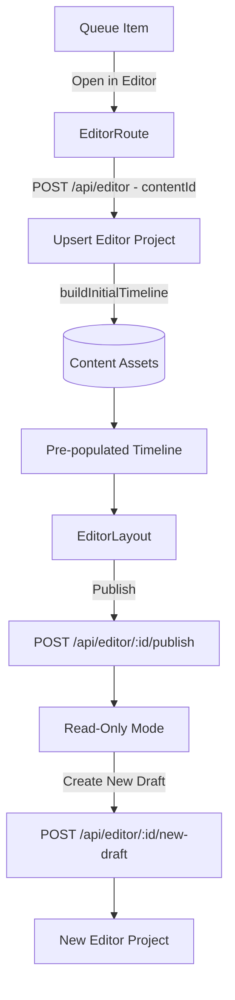
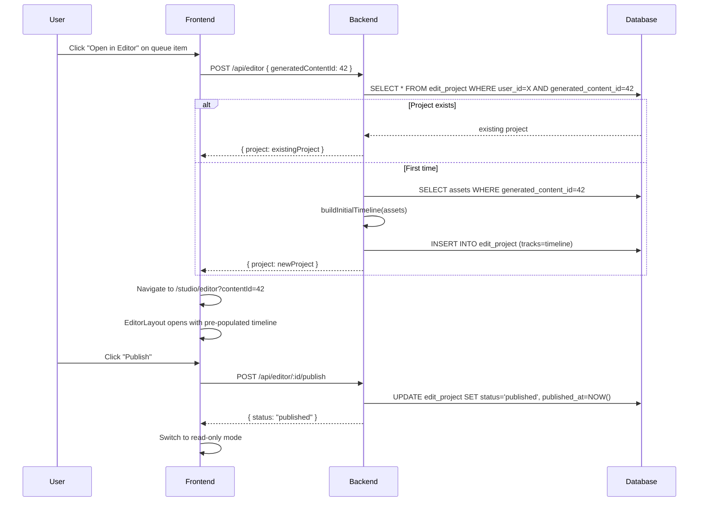

# HLD + LLD: Project Model (1:1 Binding, Publish/Draft, Locking)

**Phase:** 1 (build first) | **Effort:** ~11 days | **Depends on:** Nothing — this is foundational

---

# HLD: Project Model

## Overview

The editor and the content pipeline are currently disconnected. Users generate content, see it in the queue, and then must manually create a blank editor project and add clips one by one. There is no 1:1 relationship between a piece of generated content and an editor project, no guard against editing conflicts, and no concept of "done." This phase makes the editor the natural continuation of the generation workflow: one click from the queue opens the editor with the timeline pre-populated, a unique constraint prevents conflicting edits, and a publish/lock model gives creators a definitive record of what they posted.

## System Context Diagram



## Components

| Component | Responsibility | Technology |
|---|---|---|
| `edit_project` schema | Add status, publishedAt, parentProjectId columns | PostgreSQL, Drizzle |
| Unique constraint | Enforce 1 editor project per (user, generatedContent) | DB constraint |
| `POST /api/editor` | Upsert behavior: return existing if same contentId | Hono, Drizzle |
| `buildInitialTimeline()` | Auto-populate tracks from content assets | Backend service |
| `POST /api/editor/:id/publish` | Lock project, set status=published | Hono |
| `POST /api/editor/:id/new-draft` | Duplicate timeline into new draft project | Hono |
| Queue detail sheet | "Open in Editor" CTA | React |
| `EditorLayout` (read-only mode) | Disable all editing when project is published | React |
| Project list | Version grouping by generatedContentId | React |

## Data Flow



## Key Design Decisions

- **Upsert, not create** — `POST /api/editor` with a `generatedContentId` returns an existing project rather than creating a duplicate. This is the 1:1 enforcement at the API level, complemented by a DB unique constraint as a safety net.
- **Auto-initialize timeline on first creation** — shots land on the timeline in generation order with no user action. The editor feels integrated, not stapled-on.
- **Publish requires an export** — you cannot publish without a final video. This ensures published projects always have an artifact.
- **New draft = new generatedContent row** — creating a draft from a published project requires a new `generatedContent` row (via duplication) so the 1:1 constraint isn't violated. The new project links to the new content ID.
- **Read-only enforced both in UI and backend** — `PATCH /api/editor/:id` returns 403 if `status = 'published'`. Frontend is not the only gate.

## Out of Scope

- Branching (multiple drafts from one published version)
- Unpublish (reverting published to draft)
- Scheduled publishing
- Publishing to Instagram/TikTok
- Collaborative editing

## Open Questions

- When a "new draft" is created, should it copy the voiceover/music assets or just the timeline structure? Recommendation: copy the timeline structure with asset references — don't duplicate R2 files, just the JSONB.
- What happens to the queue item's "Assemble" button after Phase 1? It should redirect to the editor instead of triggering a separate video assembly job.

---

# LLD: Project Model

## Database Schema

### edit_project table additions

```typescript
// backend/src/infrastructure/database/drizzle/schema.ts

export const editProjects = pgTable(
  "edit_project",
  {
    // existing columns (unchanged):
    id: text("id").primaryKey().$defaultFn(() => crypto.randomUUID()),
    userId: text("user_id").notNull().references(() => users.id, { onDelete: "cascade" }),
    title: text("title").notNull().default("Untitled Edit"),
    generatedContentId: integer("generated_content_id").references(
      () => generatedContent.id, { onDelete: "set null" }
    ),
    tracks: jsonb("tracks").notNull().default([]),
    durationMs: integer("duration_ms").notNull().default(0),
    fps: integer("fps").notNull().default(30),
    resolution: text("resolution").notNull().default("1080x1920"),
    createdAt: timestamp("created_at").notNull().defaultNow(),
    updatedAt: timestamp("updated_at").notNull().defaultNow().$onUpdateFn(() => new Date()),

    // NEW columns:
    status: text("status").notNull().default("draft"),
    // "draft" | "published"
    publishedAt: timestamp("published_at"),
    parentProjectId: text("parent_project_id"),
    // FK added below via .references() — can't self-reference inline in Drizzle
  },
  (t) => [
    index("edit_projects_user_idx").on(t.userId),
    index("edit_projects_content_idx").on(t.generatedContentId),
    index("edit_projects_status_idx").on(t.userId, t.status),
    // 1:1 constraint:
    uniqueIndex("edit_project_unique_content")
      .on(t.userId, t.generatedContentId)
      .where(sql`${t.generatedContentId} IS NOT NULL`),
  ],
);
```

**Note:** Drizzle doesn't support self-referencing FK inline. Add it via raw SQL in the migration:

```sql
ALTER TABLE edit_project
  ADD COLUMN status TEXT NOT NULL DEFAULT 'draft',
  ADD COLUMN published_at TIMESTAMP,
  ADD COLUMN parent_project_id TEXT REFERENCES edit_project(id) ON DELETE SET NULL;

CREATE UNIQUE INDEX edit_project_unique_content
  ON edit_project (user_id, generated_content_id)
  WHERE generated_content_id IS NOT NULL;
```

Migration: `bun db:generate && bun db:migrate`

## API Contracts

### POST /api/editor (modified — upsert behavior)
**Auth:** `requireAuth`

**Request body:**
```typescript
{
  title?: string;
  generatedContentId?: number;   // if present, triggers upsert logic
}
```

**Response (200 — existing project returned):**
```typescript
{ project: EditProject }
```

**Response (201 — new project created):**
```typescript
{ project: EditProject }
```

**Error cases:**
- `401` — unauthenticated

### POST /api/editor/:id/publish
**Auth:** `requireAuth`

**Request body:** (none)

**Response (200):**
```typescript
{
  id: string;
  status: "published";
  publishedAt: string; // ISO timestamp
}
```

**Error cases:**
- `403` — project not owned by user
- `404` — project not found
- `409` — project is already published
- `422` — no completed export job exists for this project (cannot publish without a final video)

### POST /api/editor/:id/new-draft
**Auth:** `requireAuth`

**Request body:** (none)

**Response (201):**
```typescript
{ project: EditProject }  // new draft project
```

**Error cases:**
- `403` — project not owned by user, or source project is not published
- `404` — source project not found

### PATCH /api/editor/:id (modified — publish guard)
**Auth:** `requireAuth`

**New error case:**
- `403` — project is published (read-only)

## Backend Implementation

**File:** `backend/src/routes/editor/index.ts`

### Upsert logic for POST /api/editor

```typescript
app.post("/", requireAuth, async (c) => {
  const auth = c.get("auth");
  const body = await c.req.json();
  const parsed = createEditorSchema.safeParse(body);
  if (!parsed.success) return c.json({ error: "Invalid request" }, 400);

  const { generatedContentId, title } = parsed.data;

  // 1. If generatedContentId provided, check for existing project
  if (generatedContentId) {
    const [existing] = await db
      .select()
      .from(editProjects)
      .where(
        and(
          eq(editProjects.userId, auth.user.id),
          eq(editProjects.generatedContentId, generatedContentId),
        ),
      )
      .limit(1);

    if (existing) {
      return c.json({ project: existing }, 200);  // 200, not 201
    }
  }

  // 2. Build initial timeline if generatedContentId provided
  let tracks: TrackData[] = [];
  let durationMs = 0;
  if (generatedContentId) {
    const result = await buildInitialTimeline(generatedContentId, auth.user.id);
    tracks = result.tracks;
    durationMs = result.durationMs;
  }

  // 3. Create new project
  const [project] = await db.insert(editProjects).values({
    userId: auth.user.id,
    title: title ?? "Untitled Edit",
    generatedContentId: generatedContentId ?? null,
    tracks,
    durationMs,
    status: "draft",
  }).returning();

  return c.json({ project }, 201);
});
```

### buildInitialTimeline() service

**File:** `backend/src/routes/editor/services/build-initial-timeline.ts`

```typescript
import { db } from "../../infrastructure/database";
import { assets, contentAssets } from "../../infrastructure/database/drizzle/schema";

export async function buildInitialTimeline(
  generatedContentId: number,
  userId: string,
): Promise<{ tracks: TrackData[]; durationMs: number }> {
  // Fetch assets linked to this content
  const linkedAssets = await db
    .select({ asset: assets, role: contentAssets.role })
    .from(contentAssets)
    .innerJoin(assets, eq(assets.id, contentAssets.assetId))
    .where(eq(contentAssets.generatedContentId, generatedContentId))
    .orderBy(assets.createdAt);

  const videoClips = linkedAssets.filter(a => a.role === "video_clip");
  const voiceovers = linkedAssets.filter(a => a.role === "voiceover");
  const music = linkedAssets.filter(a => a.role === "background_music");

  // Build video track: clips placed sequentially
  let videoPosition = 0;
  const videoTrackClips = videoClips.map(({ asset }) => {
    const duration = asset.durationMs ?? 5000;
    const clip = {
      id: crypto.randomUUID(),
      assetId: asset.id,
      r2Key: asset.r2Key,
      r2Url: asset.r2Url ?? "",
      startMs: videoPosition,
      durationMs: duration,
      trimStartMs: 0,
      trimEndMs: 0,
      speed: 1,
      volume: 1,
      muted: false,
      opacity: 1,
      contrast: 0,
      warmth: 0,
    };
    videoPosition += duration;
    return clip;
  });

  const totalDuration = videoPosition;

  const audioTrackClips = voiceovers.map(({ asset }) => ({
    id: crypto.randomUUID(),
    assetId: asset.id,
    r2Key: asset.r2Key,
    r2Url: asset.r2Url ?? "",
    startMs: 0,
    durationMs: asset.durationMs ?? totalDuration,
    trimStartMs: 0, trimEndMs: 0,
    speed: 1, volume: 1, muted: false,
    opacity: 1, contrast: 0, warmth: 0,
  }));

  const musicTrackClips = music.map(({ asset }) => ({
    id: crypto.randomUUID(),
    assetId: asset.id,
    r2Key: asset.r2Key,
    r2Url: asset.r2Url ?? "",
    startMs: 0,
    durationMs: asset.durationMs ?? totalDuration,
    trimStartMs: 0, trimEndMs: 0,
    speed: 1, volume: 0.3, muted: false,   // music at 30% by default
    opacity: 1, contrast: 0, warmth: 0,
  }));

  return {
    tracks: [
      { id: crypto.randomUUID(), type: "video", name: "Video", muted: false, locked: false, clips: videoTrackClips, transitions: [] },
      { id: crypto.randomUUID(), type: "audio", name: "Voiceover", muted: false, locked: false, clips: audioTrackClips, transitions: [] },
      { id: crypto.randomUUID(), type: "music", name: "Music", muted: false, locked: false, clips: musicTrackClips, transitions: [] },
      { id: crypto.randomUUID(), type: "text", name: "Text", muted: false, locked: false, clips: [], transitions: [] },
    ],
    durationMs: totalDuration,
  };
}
```

### Publish endpoint

```typescript
app.post("/:id/publish", requireAuth, async (c) => {
  const auth = c.get("auth");
  const { id } = c.req.param();

  const [project] = await db.select().from(editProjects)
    .where(and(eq(editProjects.id, id), eq(editProjects.userId, auth.user.id)));

  if (!project) return c.json({ error: "Not found" }, 404);
  if (project.status === "published") return c.json({ error: "Already published" }, 409);

  // Verify completed export exists
  const [completedExport] = await db.select().from(exportJobs)
    .where(and(eq(exportJobs.editProjectId, id), eq(exportJobs.status, "done")));
  if (!completedExport) return c.json({ error: "Export your reel before publishing" }, 422);

  const [updated] = await db.update(editProjects)
    .set({ status: "published", publishedAt: new Date() })
    .where(eq(editProjects.id, id))
    .returning();

  return c.json({ id: updated.id, status: updated.status, publishedAt: updated.publishedAt });
});
```

### New-draft endpoint

```typescript
app.post("/:id/new-draft", requireAuth, async (c) => {
  const auth = c.get("auth");
  const { id } = c.req.param();

  const [source] = await db.select().from(editProjects)
    .where(and(eq(editProjects.id, id), eq(editProjects.userId, auth.user.id)));

  if (!source) return c.json({ error: "Not found" }, 404);
  if (source.status !== "published") return c.json({ error: "Source must be published" }, 403);

  // Create new draft — no generatedContentId to avoid unique constraint conflict
  // The new draft is standalone (linked to no content) OR we duplicate the generatedContent row.
  // MVP: create standalone draft copying the timeline. The editor can still reference asset IDs.
  const [newDraft] = await db.insert(editProjects).values({
    userId: auth.user.id,
    title: `${source.title} (v2)`,
    generatedContentId: null,   // standalone — avoids unique constraint
    tracks: source.tracks,      // copy timeline exactly
    durationMs: source.durationMs,
    fps: source.fps,
    resolution: source.resolution,
    status: "draft",
    parentProjectId: source.id,
  }).returning();

  return c.json({ project: newDraft }, 201);
});
```

### PATCH guard for published projects

```typescript
app.patch("/:id", requireAuth, async (c) => {
  const auth = c.get("auth");
  const { id } = c.req.param();

  const [project] = await db.select({ status: editProjects.status, userId: editProjects.userId })
    .from(editProjects).where(eq(editProjects.id, id));

  if (!project || project.userId !== auth.user.id) return c.json({ error: "Not found" }, 404);
  if (project.status === "published") return c.json({ error: "Published projects are read-only" }, 403);

  // ... existing update logic
});
```

## Frontend Implementation

**Feature dir:** `frontend/src/features/editor/`

### Queue detail sheet: "Open in Editor" button

**`frontend/src/features/reels/components/QueueDetailSheet.tsx`** (or equivalent):

```typescript
import { Link } from "@tanstack/react-router";

// Inside the queue item detail:
<Link
  to="/studio/editor"
  search={{ contentId: item.generatedContentId }}
  className="btn btn-primary"
>
  {t("queue.openInEditor")}
</Link>
```

### Editor route: read contentId from search params

**`frontend/src/routes/(customer)/studio/editor/index.tsx`**:

```typescript
export const Route = createFileRoute("/(customer)/studio/editor/")({
  validateSearch: (search: Record<string, unknown>) => ({
    contentId: typeof search.contentId === "number" ? search.contentId : undefined,
  }),
  component: EditorPage,
});

function EditorPage() {
  const { contentId } = Route.useSearch();
  const { authenticatedFetchJson } = useAuthenticatedFetch();
  const navigate = useNavigate();

  // On mount: get-or-create project for this contentId
  const { data: project, isLoading } = useQuery({
    queryKey: queryKeys.editor.byContent(contentId),
    queryFn: () => authenticatedFetchJson<{ project: EditProject }>(
      "/api/editor",
      { method: "POST", body: JSON.stringify({ generatedContentId: contentId }) }
    ),
    enabled: !!contentId,
    staleTime: Infinity, // don't refetch — project is stable
  });

  if (isLoading) return <EditorLoadingSkeleton />;
  if (!contentId) return <ProjectListView />; // existing project list
  if (project) return <EditorLayout project={project.project} />;
}
```

### Read-only mode in EditorLayout

```typescript
// In EditorLayout.tsx:
const isReadOnly = project.status === "published";

// Pass down to all sub-components:
<Timeline readOnly={isReadOnly} ... />
<Inspector readOnly={isReadOnly} ... />
<MediaPanel readOnly={isReadOnly} ... />

// In toolbar:
{isReadOnly ? (
  <div className="flex items-center gap-2">
    <span className="badge badge-success">Published</span>
    <Button onClick={handleCreateNewDraft}>Create New Draft</Button>
  </div>
) : (
  <>
    <Button onClick={handleExport}>Export</Button>
    {hasCompletedExport && (
      <Button onClick={handlePublish} variant="primary">Publish</Button>
    )}
  </>
)}
```

### Publish confirmation modal

```typescript
// Show before calling POST /api/editor/:id/publish:
<ConfirmModal
  title={t("editor.publish.title")}
  description={t("editor.publish.description")}
  confirmLabel={t("editor.publish.confirm")}
  onConfirm={handlePublish}
/>
// "Publishing locks this reel. Create a new draft to make changes."
```

### Project list: version grouping

```typescript
// Group projects by parentProjectId chain to show versions:
function groupByVersion(projects: EditProject[]): Map<string | null, EditProject[]> {
  const groups = new Map<string | null, EditProject[]>();
  for (const p of projects) {
    const root = p.parentProjectId ?? p.id;
    const group = groups.get(root) ?? [];
    group.push(p);
    groups.set(root, group);
  }
  return groups;
}
```

### Query keys

```typescript
// src/shared/lib/query-keys.ts
editor: {
  all: () => ["editor"] as const,
  byContent: (contentId?: number) => ["editor", "content", contentId] as const,
  byId: (id: string) => ["editor", id] as const,
  list: () => ["editor", "list"] as const,
},
```

### i18n keys

```json
{
  "queue": {
    "openInEditor": "Open in Editor",
    "editingInProgress": "Edit in progress"
  },
  "editor": {
    "publish": {
      "button": "Publish",
      "title": "Publish this reel?",
      "description": "Publishing locks this reel from further editing. To make changes, create a new draft version.",
      "confirm": "Publish",
      "badge": "Published"
    },
    "newDraft": "Create New Draft",
    "readOnly": "This reel is published and cannot be edited.",
    "exportFirst": "Export your reel before publishing.",
    "versions": {
      "v": "v{{number}}",
      "draft": "Draft",
      "published": "Published"
    }
  }
}
```

## Build Sequence

1. DB: Add `status`, `published_at`, `parent_project_id` columns + unique constraint migration
2. Backend: Update `POST /api/editor` with upsert behavior
3. Backend: `buildInitialTimeline()` service
4. Backend: `POST /api/editor/:id/publish` endpoint
5. Backend: `POST /api/editor/:id/new-draft` endpoint
6. Backend: Published guard on `PATCH /api/editor/:id`
7. Frontend: Query key additions
8. Frontend: Editor route reads `contentId` search param + calls upsert endpoint
9. Frontend: Queue detail sheet "Open in Editor" button
10. Frontend: `EditorLayout` read-only mode (disable all interactions)
11. Frontend: Publish button + confirmation modal
12. Frontend: "Create New Draft" button and flow
13. Frontend: Project list version grouping
14. Tests

## Edge Cases & Error States

- **Assets still generating when user opens editor:** `buildInitialTimeline` returns whatever assets exist. If 0 video clips, video track is empty. Show a toast: "Your shots are still generating — the timeline will update when they're ready." Frontend polls `GET /api/assets` and updates via `invalidateQueries`.
- **User opens same content from two browser tabs simultaneously:** The upsert returns the same project ID. Both tabs edit the same project. Last write wins (existing behavior — no concurrent editing protection in scope).
- **Publish without completed export:** Backend returns 422 with message. Frontend shows: "Export your reel first, then publish."
- **New draft creation:** `generatedContentId = null` on the new draft. It won't appear in the queue-linked flow. Show it in the project list under the parent's version group via `parentProjectId`.
- **Unique constraint violation at DB level:** If two requests for the same `(userId, generatedContentId)` arrive simultaneously, one will fail with a unique violation. Backend must catch the Postgres `23505` error code and retry as a select.

## Dependencies on Other Systems

- This is Phase 1 — nothing depends on it yet, but everything else depends on it
- The queue feature (`frontend/src/features/reels/`) needs the "Open in Editor" button added
- The `contentAssets` join table (linking assets to generated content) must be populated by the generation pipeline for `buildInitialTimeline` to work — verify this is already done
- `exportJobs` table must exist and have a `status` field — verify schema before implementing publish guard
