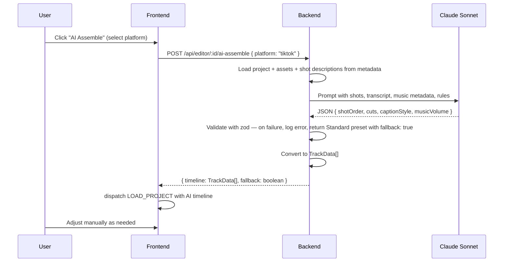

# HLD + LLD: Assembly System (Shot Assembly + AI Assembly)

**Phase:** 4 | **Effort:** ~24 days (Phase 4a: 13 days manual, Phase 4b: 11 days AI)
**Depends on:** Project Model (Phase 1), Editor Core (Phase 2)

---

# HLD: Assembly System

## Overview

ContentAI currently has two disconnected assembly paths: a backend pipeline (`POST /api/video/assemble`) that runs ffmpeg concatenation and produces an `assembled_video` asset, and a manual editor that starts from scratch. This feature unifies them. Phase 4a (manual assembly) redirects the "Assemble" action to open the editor with a pre-populated timeline, adds a Shot Order panel with drag-reordering via `@dnd-kit`, and adds single-shot regeneration from within the editor. Phase 4b (AI assembly, post-MVP) adds a Claude Sonnet endpoint that produces a structured timeline arrangement, with the editor as the review and correction layer.

## System Context Diagram

```mermaid
graph TD
    Queue[Queue Item] -->|Assemble button| EditorRoute[Editor Route]
    EditorRoute --> InitialTimeline[Auto-populated Timeline via Phase 1]

    EditorLayout --> ShotPanel[Shot Order Panel]
    ShotPanel -->|REORDER_SHOTS| EditorReducer

    EditorLayout -->|right-click clip| RegenerateShotUI
    RegenerateShotUI -->|POST /api/video/shots/regenerate| BE_Regen[Regenerate Shot Endpoint]
    BE_Regen -->|invalidate queries| NewAsset[New Video Asset in R2]
    NewAsset -->|UPDATE_CLIP| EditorReducer

    EditorLayout -->|AI Assemble btn| BE_AI[POST /api/editor/:id/ai-assemble]
    BE_AI -->|assets + script + transcript| Claude[Claude Sonnet]
    Claude -->|structured timeline JSON| BE_AI
    BE_AI -->|TrackData[]| EditorLayout
    EditorLayout -->|LOAD_PROJECT| EditorReducer
```

## Components

| Component | Responsibility | Technology |
|---|---|---|
| Modified `POST /api/video/assemble` | Create editor project + return redirect instead of running ffmpeg | Hono — behavior change |
| `ShotOrderPanel` | Vertical drag-reorder list of shots | React, `@dnd-kit/core` + `@dnd-kit/sortable` |
| Shot regeneration context menu | "Regenerate this shot" on right-click | React, existing `useRegenerateShot` hook |
| `REORDER_SHOTS` reducer action | Recalculate sequential `startMs` positions after drag | `useReducer` |
| Assembly presets | Standard / FastCut / Cinematic modifier functions | TypeScript |
| `POST /api/editor/:id/ai-assemble` | Claude Sonnet call to produce structured timeline | Hono, `@ai-sdk/anthropic` |
| AI timeline deserializer | Convert Claude JSON to `Track[]` format | Backend service |

## Data Flow (AI Assembly)



## Key Design Decisions

- **Pipeline assembly becomes editor redirect, not a separate video render** — one rendering system (editor export), not two. Eliminates the separate `assembled_video` asset type flow.
- **Shot Order panel is a high-level abstraction over the timeline** — simple reorder UI for users who don't want to use the timeline. Both coexist; they update the same reducer state.
- **AI assembly is a starting point, not a final product** — AI generates a timeline, user reviews in editor. AI is never the last step before publish.
- **Strict zod validation on AI output** — fallback to Standard preset if Claude returns invalid JSON. Never crash.
- **Phase 4b (AI) is gated on Phase 4a (manual) being perfect** — a good AI arrangement on a broken editor looks like an AI failure. Manual quality first.

## Codebase Findings (Verified)

### `useRegenerateShot` — EXISTS

Located at `frontend/src/features/video/hooks/use-regenerate-shot.ts`. It:
- Accepts `{ generatedContentId, shotIndex, prompt, durationSeconds?, aspectRatio? }`
- Calls `POST /api/video/shots/regenerate`
- On success, invalidates `queryKeys.api.contentAssets(generatedContentId)` and `queryKeys.api.videoJob(jobId)`
- Does NOT have built-in polling — it fires the mutation and relies on query invalidation. The caller must poll for job completion separately.

To integrate into the editor: wrap this hook to add polling for the video job, then dispatch `UPDATE_CLIP` when the new asset is ready. See frontend implementation below.

### `POST /api/video/assemble` — EXISTS

Located at `backend/src/routes/video/index.ts` (line ~1828). Currently:
- Validates with `assembleSchema` (requires `generatedContentId`, optional `includeCaptions`, optional `audioMix`)
- Creates a video job with `kind: "assemble"`
- Enqueues `runAssembleFromExistingClips` which downloads assets, runs ffmpeg, uploads result to R2 as `assembled_video`
- Returns `{ jobId, status }` with 202

This endpoint needs to be replaced with an editor project redirect. See backend implementation below.

### Shot Descriptions — ALREADY STORED

The generation pipeline stores `generationPrompt` (not `shotDescription`) in `assets.metadata` when creating video clips (line ~1448 of video route):
```typescript
metadata: {
  shotIndex: shot.shotIndex,
  sourceType: "ai_generated",
  provider: clip.provider,
  generationPrompt: shot.description,  // <-- this is the shot description
  hasEmbeddedAudio: false,
  useClipAudio: false,
}
```

No prerequisite code change needed. Use `metadata.generationPrompt` as the shot description for AI assembly prompts.

### `@dnd-kit` — NOT INSTALLED

Not found in `frontend/package.json`. Must install:
```bash
cd frontend && bun add @dnd-kit/core @dnd-kit/sortable @dnd-kit/utilities
```

### Anthropic SDK — Uses `@ai-sdk/anthropic`

The backend uses `@ai-sdk/anthropic` (Vercel AI SDK provider), not the raw `@anthropic-ai/sdk`. Already installed. `ANTHROPIC_API_KEY` is already in `backend/src/utils/config/envUtil.ts`.

## Performance

- **Shot reorder**: O(n) where n = number of clips on the video track. Iterates once to recalculate sequential `startMs` values. Trivial for any realistic clip count (<100).
- **AI assembly**: Single LLM call (~2s latency). No batching, no streaming needed. Response is small JSON (<2KB).

## Out of Scope

- Music beat detection and sync
- AI re-editing conversational interface
- A/B testing two AI assembly variants
- Template-based assembly
- Collaborative review before publish

---

# LLD: Assembly System

## Database Schema

No new tables or migrations. All tables already exist.

### `edit_project` table (final shape)

```typescript
// backend/src/infrastructure/database/drizzle/schema.ts
export const editProjects = pgTable("edit_project", {
  id: text("id").primaryKey().$defaultFn(() => crypto.randomUUID()),
  userId: text("user_id").notNull().references(() => users.id, { onDelete: "cascade" }),
  title: text("title").notNull().default("Untitled Edit"),
  generatedContentId: integer("generated_content_id").references(
    () => generatedContent.id, { onDelete: "set null" }
  ),
  tracks: jsonb("tracks").notNull().default([]),
  durationMs: integer("duration_ms").notNull().default(0),
  fps: integer("fps").notNull().default(30),
  resolution: text("resolution").notNull().default("1080p"),
  createdAt: timestamp("created_at").notNull().defaultNow(),
  updatedAt: timestamp("updated_at").notNull().defaultNow().$onUpdateFn(() => new Date()),
}, (t) => [
  index("edit_projects_user_idx").on(t.userId),
  index("edit_projects_content_idx").on(t.generatedContentId),
]);
```

### `export_job` table (final shape)

```typescript
export const exportJobs = pgTable("export_job", {
  id: text("id").primaryKey().$defaultFn(() => crypto.randomUUID()),
  editProjectId: text("edit_project_id").notNull()
    .references(() => editProjects.id, { onDelete: "cascade" }),
  userId: text("user_id").notNull()
    .references(() => users.id, { onDelete: "cascade" }),
  status: text("status").notNull().default("queued"),   // "queued" | "rendering" | "done" | "failed"
  progress: integer("progress").notNull().default(0),
  outputAssetId: text("output_asset_id").references(() => assets.id, { onDelete: "set null" }),
  error: text("error"),
  createdAt: timestamp("created_at").notNull().defaultNow(),
  updatedAt: timestamp("updated_at").notNull().defaultNow().$onUpdateFn(() => new Date()),
}, (t) => [
  index("export_jobs_project_idx").on(t.editProjectId),
  index("export_jobs_user_idx").on(t.userId),
]);
```

### `asset.metadata` JSONB shape for video clips (already populated by generation pipeline)

```typescript
{
  shotIndex: number;           // order within the generated content
  sourceType: "ai_generated";
  provider: string;            // e.g. "minimax"
  generationPrompt: string;    // shot description — used by AI assembly
  hasEmbeddedAudio: boolean;
  useClipAudio: boolean;
}
```

## API Contracts

### POST /api/video/assemble (behavior change — Phase 4a)

**Auth:** `authMiddleware("user")`

**Before (current):** Creates a video job, runs ffmpeg via `runAssembleFromExistingClips`, returns `{ jobId, status }`.

**After:** Creates or returns an editor project, returns a redirect target.

**Request body:** (unchanged — existing `assembleSchema`)
```typescript
{
  generatedContentId: number;
  includeCaptions?: boolean;   // ignored — captions now done in editor
  audioMix?: {
    includeClipAudio?: boolean;
    clipAudioVolume?: number;
    voiceoverVolume?: number;
    musicVolume?: number;
  };
}
```

**Response (changed):**
```typescript
// 200 — existing project found, or new one created
{
  editorProjectId: string;
  redirectUrl: string;  // "/studio/editor/<editorProjectId>"
}
```

**Migration note:** Keep the old behavior available for 30 days via query param: `POST /api/video/assemble?legacy=true` still runs ffmpeg. Remove after migration period.

---

### POST /api/editor/:id/ai-assemble (new — Phase 4b)

**Auth:** `authMiddleware("user")`

**Request body:**
```typescript
{
  platform: "instagram" | "tiktok" | "youtube-shorts";
}
```

**Response (200):**
```typescript
{
  timeline: TrackData[];
  assembledBy: "ai";
  fallback: boolean;  // true if AI parse failed and Standard preset was used
}
```

**Error cases:**
- `400` — invalid platform
- `403` — project not owned by user
- `404` — project not found or has no `generatedContentId`
- `503` — never returned; Claude failures produce a fallback Standard preset with `fallback: true`

---

## Backend Implementation

### Phase 4a: Replace POST /api/video/assemble

**File:** `backend/src/routes/video/index.ts`

Replace the current handler (lines ~1828-1867) with:

```typescript
// POST /api/video/assemble
app.post(
  "/assemble",
  rateLimiter("customer"),
  csrfMiddleware(),
  authMiddleware("user"),
  zValidator("json", assembleSchema),
  async (c) => {
    try {
      const auth = c.get("auth");
      const payload = c.req.valid("json");

      // Legacy mode — keep old ffmpeg path for 30-day migration
      if (c.req.query("legacy") === "true") {
        const content = await fetchOwnedContent(
          auth.user.id,
          payload.generatedContentId,
        );
        if (!content) {
          return c.json({ error: "Content not found" }, 404);
        }
        const job = await videoJobService.createJob({
          userId: auth.user.id,
          generatedContentId: payload.generatedContentId,
          kind: "assemble",
          request: payload,
        });
        enqueue("assemble", () => runAssembleFromExistingClips({ job }));
        return c.json({ jobId: job.id, status: job.status }, 202);
      }

      // New path — upsert editor project
      const content = await fetchOwnedContent(
        auth.user.id,
        payload.generatedContentId,
      );
      if (!content) {
        return c.json({ error: "Content not found" }, 404);
      }

      // Check if an editor project already exists for this content
      const [existing] = await db
        .select()
        .from(editProjects)
        .where(
          and(
            eq(editProjects.userId, auth.user.id),
            eq(editProjects.generatedContentId, payload.generatedContentId),
          ),
        )
        .limit(1);

      if (existing) {
        return c.json({
          editorProjectId: existing.id,
          redirectUrl: `/studio/editor/${existing.id}`,
        });
      }

      // Build initial timeline from generated assets
      const timeline = await _buildInitialTimeline({
        userId: auth.user.id,
        generatedContentId: payload.generatedContentId,
      });

      // Convert internal timeline format to editor Track[] format
      const tracks = convertTimelineToEditorTracks(timeline, payload.audioMix);

      const [project] = await db
        .insert(editProjects)
        .values({
          userId: auth.user.id,
          title: content.title ?? "Assembled Reel",
          generatedContentId: payload.generatedContentId,
          tracks,
          durationMs: timeline.durationMs,
          fps: timeline.fps,
          resolution: "1080p",
        })
        .returning();

      return c.json({
        editorProjectId: project.id,
        redirectUrl: `/studio/editor/${project.id}`,
      });
    } catch (error) {
      debugLog.error("Failed to create editor project from assembly", {
        service: "video-route",
        operation: "assemble",
        error: error instanceof Error ? error.message : "Unknown error",
      });
      return c.json({ error: "Failed to create editor project" }, 500);
    }
  },
);
```

**Helper — convert internal timeline to editor `Track[]` format:**

```typescript
// backend/src/routes/video/index.ts (or extract to a utility)

function convertTimelineToEditorTracks(
  timeline: TimelinePayload,
  audioMix?: { clipAudioVolume?: number; voiceoverVolume?: number; musicVolume?: number },
): Array<{ id: string; type: string; name: string; muted: boolean; locked: boolean; clips: unknown[] }> {
  const videoClips = timeline.tracks.video.map((item) => ({
    id: item.id,
    assetId: item.assetId ?? null,
    startMs: item.startMs,
    durationMs: item.endMs - item.startMs,
    trimStartMs: 0,
    trimEndMs: item.endMs - item.startMs,
    speed: 1,
    opacity: 1,
    warmth: 0,
    contrast: 0,
    positionX: 0,
    positionY: 0,
    scale: 1,
    rotation: 0,
    volume: audioMix?.clipAudioVolume ?? 1,
    muted: false,
  }));

  const audioClips = timeline.tracks.audio
    .filter((item) => (item as any).role === "voiceover")
    .map((item) => ({
      id: item.id,
      assetId: item.assetId ?? null,
      startMs: item.startMs,
      durationMs: item.endMs - item.startMs,
      trimStartMs: 0,
      trimEndMs: item.endMs - item.startMs,
      speed: 1,
      opacity: 1,
      warmth: 0,
      contrast: 0,
      positionX: 0,
      positionY: 0,
      scale: 1,
      rotation: 0,
      volume: audioMix?.voiceoverVolume ?? 1,
      muted: false,
    }));

  const musicClips = timeline.tracks.audio
    .filter((item) => (item as any).role === "music")
    .map((item) => ({
      id: item.id,
      assetId: item.assetId ?? null,
      startMs: item.startMs,
      durationMs: item.endMs - item.startMs,
      trimStartMs: 0,
      trimEndMs: item.endMs - item.startMs,
      speed: 1,
      opacity: 1,
      warmth: 0,
      contrast: 0,
      positionX: 0,
      positionY: 0,
      scale: 1,
      rotation: 0,
      volume: audioMix?.musicVolume ?? 0.25,
      muted: false,
    }));

  return [
    { id: "video", type: "video", name: "Video", muted: false, locked: false, clips: videoClips },
    { id: "audio", type: "audio", name: "Audio", muted: false, locked: false, clips: audioClips },
    { id: "music", type: "music", name: "Music", muted: false, locked: false, clips: musicClips },
    { id: "text", type: "text", name: "Text", muted: false, locked: false, clips: [] },
  ];
}
```

### Phase 4b: AI Assembly endpoint

**File:** `backend/src/routes/editor/index.ts` (add before `export default app`)

#### Complete zod schema for AI response validation

```typescript
import { z } from "zod";
import { generateText } from "ai";
import { createAnthropic } from "@ai-sdk/anthropic";
import { ANTHROPIC_API_KEY } from "../../utils/config/envUtil";

const anthropic = createAnthropic({ apiKey: ANTHROPIC_API_KEY });

const aiAssemblyResponseSchema = z.object({
  shotOrder: z.array(z.number().int().min(0)),
  cuts: z.array(
    z.object({
      shotIndex: z.number().int().min(0),
      trimStartMs: z.number().int().min(0),
      trimEndMs: z.number().int().min(0),
      transition: z.enum(["cut", "fade", "slide-left", "dissolve"]),
    }),
  ),
  captionStyle: z.enum(["bold-outline", "clean-white", "highlight"]).optional(),
  captionGroupSize: z.number().int().min(1).max(6).optional(),
  musicVolume: z.number().min(0).max(1),
  totalDuration: z.number().int().min(1000).max(120000),
});

const aiAssembleRequestSchema = z.object({
  platform: z.enum(["instagram", "tiktok", "youtube-shorts"]),
});
```

#### Endpoint handler with strict validation and fallback

```typescript
app.post(
  "/:id/ai-assemble",
  rateLimiter("customer"),
  csrfMiddleware(),
  authMiddleware("user"),
  async (c) => {
    try {
      const auth = c.get("auth");
      const { id } = c.req.param();
      const body = await c.req.json().catch(() => null);
      const parsed = aiAssembleRequestSchema.safeParse(body);
      if (!parsed.success) {
        return c.json({ error: "Invalid request body" }, 400);
      }
      const { platform } = parsed.data;

      // Verify project ownership
      const [project] = await db
        .select()
        .from(editProjects)
        .where(
          and(eq(editProjects.id, id), eq(editProjects.userId, auth.user.id)),
        )
        .limit(1);

      if (!project) {
        return c.json({ error: "Edit project not found" }, 404);
      }
      if (!project.generatedContentId) {
        return c.json(
          { error: "Project has no generated content — AI assembly requires generated shots" },
          404,
        );
      }

      // Load shot assets with metadata
      const shotAssets = await loadProjectShotAssets(
        auth.user.id,
        project.generatedContentId,
      );

      if (shotAssets.length === 0) {
        return c.json({ error: "No shot clips available" }, 400);
      }

      // Build shot context for prompt
      const shotsContext = shotAssets.map((asset, i) => ({
        index: i,
        description:
          (asset.metadata as Record<string, unknown>)?.generationPrompt as string
          ?? `Shot ${i + 1}`,
        durationMs: asset.durationMs ?? 5000,
      }));

      const targetDurationMs = platform === "tiktok" ? 15000
        : platform === "youtube-shorts" ? 60000
        : 30000;

      const prompt = buildAIAssemblyPrompt({
        shots: shotsContext,
        platform,
        targetDurationMs,
      });

      // Call Claude and validate response
      let aiResponse: z.infer<typeof aiAssemblyResponseSchema> | null = null;
      try {
        const result = await generateText({
          model: anthropic("claude-sonnet-4-6"),
          prompt,
          maxTokens: 1024,
        });

        const text = result.text;
        const jsonMatch = text.match(/```json\n?([\s\S]+?)\n?```/);
        const raw = JSON.parse(jsonMatch ? jsonMatch[1] : text);
        aiResponse = aiAssemblyResponseSchema.parse(raw);

        // Additional validation: all shot indices must be in range
        const maxIndex = shotsContext.length - 1;
        for (const cut of aiResponse.cuts) {
          if (cut.shotIndex > maxIndex) {
            throw new Error(`Shot index ${cut.shotIndex} out of range (max ${maxIndex})`);
          }
          const shotDuration = shotsContext[cut.shotIndex].durationMs;
          if (cut.trimEndMs > shotDuration) {
            throw new Error(
              `trimEndMs ${cut.trimEndMs} exceeds shot ${cut.shotIndex} duration ${shotDuration}`,
            );
          }
        }
      } catch (err) {
        // === FALLBACK PATH ===
        // AI failed to produce valid JSON. Log and return Standard preset.
        debugLog.error("AI assembly parse failed — returning Standard preset fallback", {
          service: "editor-route",
          operation: "aiAssemble",
          projectId: id,
          error: err instanceof Error ? err.message : "Unknown error",
        });

        const standardTimeline = buildStandardPresetTracks(shotAssets);
        return c.json({
          timeline: standardTimeline,
          assembledBy: "ai" as const,
          fallback: true,
        });
      }

      // Convert validated AI response to Track[] format
      const timeline = convertAIResponseToTracks(aiResponse, shotAssets);

      return c.json({
        timeline,
        assembledBy: "ai" as const,
        fallback: false,
      });
    } catch (error) {
      debugLog.error("AI assembly failed", {
        service: "editor-route",
        operation: "aiAssemble",
        error: error instanceof Error ? error.message : "Unknown error",
      });
      return c.json({ error: "Failed to run AI assembly" }, 500);
    }
  },
);
```

#### Helper: Load shot assets for AI assembly

```typescript
async function loadProjectShotAssets(userId: string, generatedContentId: number) {
  const rows = await db
    .select({
      id: assets.id,
      durationMs: assets.durationMs,
      metadata: assets.metadata,
    })
    .from(contentAssets)
    .innerJoin(assets, eq(contentAssets.assetId, assets.id))
    .where(
      and(
        eq(contentAssets.generatedContentId, generatedContentId),
        eq(assets.userId, userId),
        eq(contentAssets.role, "video_clip"),
      ),
    );

  return rows.sort((a, b) => {
    const ai = Number((a.metadata as Record<string, unknown>)?.shotIndex ?? 0);
    const bi = Number((b.metadata as Record<string, unknown>)?.shotIndex ?? 0);
    return ai - bi;
  });
}
```

#### Helper: Convert AI response to Track[]

```typescript
function convertAIResponseToTracks(
  aiResponse: z.infer<typeof aiAssemblyResponseSchema>,
  shotAssets: Array<{ id: string; durationMs: number | null; metadata: unknown }>,
) {
  let cursor = 0;
  const videoClips = aiResponse.cuts.map((cut, i) => {
    const asset = shotAssets[cut.shotIndex];
    const clipDuration = cut.trimEndMs - cut.trimStartMs;
    const clip = {
      id: `ai-clip-${i}`,
      assetId: asset.id,
      startMs: cursor,
      durationMs: clipDuration,
      trimStartMs: cut.trimStartMs,
      trimEndMs: cut.trimEndMs,
      speed: 1,
      opacity: 1,
      warmth: 0,
      contrast: 0,
      positionX: 0,
      positionY: 0,
      scale: 1,
      rotation: 0,
      volume: 1,
      muted: false,
    };
    cursor += clipDuration;
    return clip;
  });

  return [
    { id: "video", type: "video", name: "Video", muted: false, locked: false, clips: videoClips },
    { id: "audio", type: "audio", name: "Audio", muted: false, locked: false, clips: [] },
    {
      id: "music", type: "music", name: "Music", muted: false, locked: false,
      clips: [],  // Music clips remain from existing project — not touched by AI
    },
    { id: "text", type: "text", name: "Text", muted: false, locked: false, clips: [] },
  ];
}
```

#### Helper: Standard preset fallback

```typescript
function buildStandardPresetTracks(
  shotAssets: Array<{ id: string; durationMs: number | null; metadata: unknown }>,
) {
  let cursor = 0;
  const videoClips = shotAssets.map((asset, i) => {
    const durationMs = Math.max(1, asset.durationMs ?? 5000);
    const clip = {
      id: `std-clip-${i}`,
      assetId: asset.id,
      startMs: cursor,
      durationMs,
      trimStartMs: 0,
      trimEndMs: durationMs,
      speed: 1,
      opacity: 1,
      warmth: 0,
      contrast: 0,
      positionX: 0,
      positionY: 0,
      scale: 1,
      rotation: 0,
      volume: 1,
      muted: false,
    };
    cursor += durationMs;
    return clip;
  });

  return [
    { id: "video", type: "video", name: "Video", muted: false, locked: false, clips: videoClips },
    { id: "audio", type: "audio", name: "Audio", muted: false, locked: false, clips: [] },
    { id: "music", type: "music", name: "Music", muted: false, locked: false, clips: [] },
    { id: "text", type: "text", name: "Text", muted: false, locked: false, clips: [] },
  ];
}
```

### AI Prompt Builder

**File:** `backend/src/routes/editor/services/ai-assembly-prompt.ts`

```typescript
export function buildAIAssemblyPrompt({
  shots,
  platform,
  targetDurationMs,
}: {
  shots: Array<{ index: number; description: string; durationMs: number }>;
  platform: string;
  targetDurationMs: number;
}): string {
  return `You are a professional short-form video editor specializing in ${platform} content.

Given these video shots, create an optimal timeline arrangement.

SHOTS:
${shots.map((s) => `[${s.index}] "${s.description}" (${s.durationMs}ms available)`).join("\n")}

PLATFORM: ${platform}
TARGET DURATION: ${targetDurationMs}ms

RULES:
1. Hook the viewer in the first 1.5 seconds — use the most visually striking shot first.
2. Total duration should be ${targetDurationMs}ms +/- 20%.
3. Vary shot duration (2000-5000ms) to maintain visual interest.
4. Place call-to-action shots near the end.
5. Use transitions sparingly — prefer hard cuts, max 2 fades per video.
6. Shot indices must be valid (0 to ${shots.length - 1}).
7. trimStartMs must be >= 0. trimEndMs must be <= the shot's available duration.
8. trimEndMs must be > trimStartMs.
9. Every shot index should appear in cuts at least once unless the video needs to be shorter.

Respond ONLY with a JSON object in this exact structure, no explanation:
\`\`\`json
{
  "shotOrder": [array of shot indices in display order],
  "cuts": [
    {
      "shotIndex": number,
      "trimStartMs": number,
      "trimEndMs": number,
      "transition": "cut" | "fade" | "slide-left" | "dissolve"
    }
  ],
  "captionStyle": "bold-outline" | "clean-white" | "highlight",
  "captionGroupSize": 3,
  "musicVolume": 0.25,
  "totalDuration": number
}
\`\`\``;
}
```

### Assembly Presets (Phase 4a)

**File:** `backend/src/routes/editor/services/assembly-presets.ts`

These functions operate on editor `Track[]` format (the same shape stored in `editProjects.tracks`).

```typescript
type EditorClip = {
  id: string;
  assetId: string | null;
  startMs: number;
  durationMs: number;
  trimStartMs: number;
  trimEndMs: number;
  speed: number;
  opacity: number;
  warmth: number;
  contrast: number;
  positionX: number;
  positionY: number;
  scale: number;
  rotation: number;
  volume: number;
  muted: boolean;
};

type EditorTrack = {
  id: string;
  type: string;
  name: string;
  muted: boolean;
  locked: boolean;
  clips: EditorClip[];
};

// Standard: shots in original order, full duration, no modifications.
export function applyStandardPreset(tracks: EditorTrack[]): EditorTrack[] {
  return tracks; // no-op — default buildInitialTimeline output is the Standard preset
}

// FastCut: each clip trimmed to min(duration, 3000ms). Recalculates startMs and trimEndMs.
export function applyFastCutPreset(tracks: EditorTrack[]): EditorTrack[] {
  const MAX_CLIP_MS = 3000;
  return tracks.map((track) => {
    if (track.type !== "video") return track;

    let cursor = 0;
    const clips = track.clips.map((clip) => {
      const trimmedDuration = Math.min(clip.durationMs, MAX_CLIP_MS);
      // trimEndMs is clamped to the new shorter duration
      const newTrimEndMs = Math.min(clip.trimEndMs, clip.trimStartMs + trimmedDuration);
      const updated = {
        ...clip,
        startMs: cursor,
        durationMs: trimmedDuration,
        trimEndMs: newTrimEndMs,
      };
      cursor += trimmedDuration;
      return updated;
    });

    return { ...track, clips };
  });
}

// Cinematic: fade transitions between clips, music volume set to 50%.
// Note: the current Clip type does not have a transition field.
// Cinematic uses a gap-based approach: each clip's startMs is offset by -FADE_MS
// to create an overlap, which the frontend renders as a crossfade.
export function applyCinematicPreset(tracks: EditorTrack[]): EditorTrack[] {
  const FADE_MS = 500;

  return tracks.map((track) => {
    if (track.type === "video") {
      let cursor = 0;
      const clips = track.clips.map((clip, i) => {
        const updated = { ...clip, startMs: cursor };
        // Overlap: next clip starts FADE_MS before this one ends (except first)
        cursor += clip.durationMs - (i < track.clips.length - 1 ? FADE_MS : 0);
        return updated;
      });
      return { ...track, clips };
    }

    if (track.type === "music") {
      // Music at 50% for cinematic feel
      const clips = track.clips.map((clip) => ({ ...clip, volume: 0.5 }));
      return { ...track, clips };
    }

    return track;
  });
}
```

## Frontend Implementation

### EditorAction Type Additions

**File:** `frontend/src/features/editor/types/editor.ts`

Add to the `EditorAction` union type:

```typescript
export type EditorAction =
  // ... existing actions ...
  | { type: "LOAD_PROJECT"; project: EditProject }
  | { type: "SET_TITLE"; title: string }
  | { type: "SET_CURRENT_TIME"; ms: number }
  | { type: "SET_PLAYING"; playing: boolean }
  | { type: "SET_ZOOM"; zoom: number }
  | { type: "SELECT_CLIP"; clipId: string | null }
  | { type: "ADD_CLIP"; trackId: string; clip: Clip }
  | { type: "UPDATE_CLIP"; clipId: string; patch: Partial<Clip> }
  | { type: "REMOVE_CLIP"; clipId: string }
  | { type: "TOGGLE_TRACK_MUTE"; trackId: string }
  | { type: "TOGGLE_TRACK_LOCK"; trackId: string }
  | { type: "UNDO" }
  | { type: "REDO" }
  | { type: "SET_EXPORT_JOB"; jobId: string | null }
  | { type: "SET_EXPORT_STATUS"; status: ExportJobStatus | null }
  // ── NEW ──
  | { type: "REORDER_SHOTS"; clipIds: string[] };  // clip IDs in new visual order
```

### REORDER_SHOTS Reducer Case

**File:** `frontend/src/features/editor/hooks/useEditorStore.ts`

Add this case to `editorReducer` before the `default` case:

```typescript
case "REORDER_SHOTS": {
  const videoTrack = state.tracks.find((t) => t.type === "video");
  if (!videoTrack) return state;

  // Build a lookup of existing clips by ID
  const clipMap = new Map(videoTrack.clips.map((c) => [c.id, c]));

  // Reorder clips according to the new ID order, recalculating startMs sequentially
  let cursor = 0;
  const reorderedClips: Clip[] = [];
  for (const clipId of action.clipIds) {
    const clip = clipMap.get(clipId);
    if (!clip) continue;
    reorderedClips.push({ ...clip, startMs: cursor });
    cursor += clip.durationMs;
  }

  const newTracks = state.tracks.map((t) =>
    t.type === "video" ? { ...t, clips: reorderedClips } : t,
  );

  return {
    ...state,
    past: [...state.past, state.tracks].slice(-50),
    future: [],
    tracks: newTracks,
    durationMs: computeDuration(newTracks),
  };
}
```

Add the convenience function to the `useEditorReducer` return:

```typescript
const reorderShots = useCallback(
  (clipIds: string[]) => dispatch({ type: "REORDER_SHOTS", clipIds }),
  [],
);
```

### Dependency Install

```bash
cd frontend && bun add @dnd-kit/core @dnd-kit/sortable @dnd-kit/utilities
```

### Shot Order Panel

**File:** `frontend/src/features/editor/components/ShotOrderPanel.tsx`

```typescript
import { useTranslation } from "react-i18next";
import {
  DndContext,
  closestCenter,
  KeyboardSensor,
  PointerSensor,
  useSensor,
  useSensors,
  type DragEndEvent,
} from "@dnd-kit/core";
import {
  SortableContext,
  sortableKeyboardCoordinates,
  useSortable,
  verticalListSortingStrategy,
  arrayMove,
} from "@dnd-kit/sortable";
import { CSS } from "@dnd-kit/utilities";
import type { Track, Clip } from "../types/editor";

interface ShotOrderPanelProps {
  videoTrack: Track;
  onReorder: (clipIds: string[]) => void;
}

function SortableShotCard({ clip, index }: { clip: Clip; index: number }) {
  const {
    attributes,
    listeners,
    setNodeRef,
    transform,
    transition,
    isDragging,
  } = useSortable({ id: clip.id });

  const style = {
    transform: CSS.Transform.toString(transform),
    transition,
    opacity: isDragging ? 0.5 : 1,
  };

  return (
    <div
      ref={setNodeRef}
      style={style}
      {...attributes}
      {...listeners}
      className="flex items-center gap-3 rounded-lg border border-border bg-card p-3 cursor-grab active:cursor-grabbing"
    >
      <span className="text-xs font-mono text-muted-foreground w-5">
        {index}
      </span>
      <div className="flex-1 min-w-0">
        <p className="text-sm font-medium truncate">{clip.label}</p>
        <p className="text-xs text-muted-foreground">
          {(clip.durationMs / 1000).toFixed(1)}s
        </p>
      </div>
    </div>
  );
}

export function ShotOrderPanel({ videoTrack, onReorder }: ShotOrderPanelProps) {
  const { t } = useTranslation();
  const clips = [...videoTrack.clips].sort((a, b) => a.startMs - b.startMs);
  const clipIds = clips.map((c) => c.id);

  const sensors = useSensors(
    useSensor(PointerSensor),
    useSensor(KeyboardSensor, {
      coordinateGetter: sortableKeyboardCoordinates,
    }),
  );

  function handleDragEnd(event: DragEndEvent) {
    const { active, over } = event;
    if (!over || active.id === over.id) return;

    const oldIndex = clipIds.indexOf(active.id as string);
    const newIndex = clipIds.indexOf(over.id as string);
    const newOrder = arrayMove(clipIds, oldIndex, newIndex);
    onReorder(newOrder);
  }

  return (
    <div className="flex flex-col gap-2 p-4">
      <h3 className="text-sm font-semibold text-muted-foreground">
        {t("editor.shots.label")}
      </h3>
      <p className="text-xs text-muted-foreground">
        {t("editor.shots.reorderHint")}
      </p>
      <DndContext
        sensors={sensors}
        collisionDetection={closestCenter}
        onDragEnd={handleDragEnd}
      >
        <SortableContext items={clipIds} strategy={verticalListSortingStrategy}>
          {clips.map((clip, i) => (
            <SortableShotCard key={clip.id} clip={clip} index={i + 1} />
          ))}
        </SortableContext>
      </DndContext>
    </div>
  );
}
```

### Shot Regeneration from Editor

The existing `useRegenerateShot` hook (`frontend/src/features/video/hooks/use-regenerate-shot.ts`) fires the mutation and invalidates queries, but does not poll for completion. For the editor, we wrap it to add polling and dispatch `UPDATE_CLIP` when done.

**File:** `frontend/src/features/editor/hooks/useRegenerateShotInEditor.ts`

```typescript
import { useMutation, useQuery } from "@tanstack/react-query";
import { useAuthenticatedFetch } from "@/features/auth/hooks/use-authenticated-fetch";
import { queryKeys } from "@/shared/lib/query-keys";
import { useQueryFetcher } from "@/shared/hooks/use-query-fetcher";
import { useState } from "react";
import type { EditorStore } from "./useEditorStore";

interface RegenerateInEditorArgs {
  generatedContentId: number;
  shotIndex: number;
  prompt: string;
  clipId: string; // editor clip to update when done
}

export function useRegenerateShotInEditor(editorStore: EditorStore) {
  const { authenticatedFetchJson } = useAuthenticatedFetch();
  const fetcher = useQueryFetcher();
  const [activeJobId, setActiveJobId] = useState<string | null>(null);
  const [activeClipId, setActiveClipId] = useState<string | null>(null);

  // Poll for job completion
  useQuery({
    queryKey: queryKeys.api.videoJob(activeJobId ?? ""),
    queryFn: () => fetcher(`/api/video/jobs/${activeJobId}`),
    enabled: !!activeJobId,
    refetchInterval: 2000, // poll every 2s
    select: (data: any) => {
      if (data.status === "completed" && data.result?.clipAssetId && activeClipId) {
        editorStore.updateClip(activeClipId, {
          assetId: data.result.clipAssetId,
        });
        setActiveJobId(null);
        setActiveClipId(null);
      }
      if (data.status === "failed") {
        setActiveJobId(null);
        setActiveClipId(null);
      }
      return data;
    },
  });

  const mutation = useMutation({
    mutationFn: async ({ generatedContentId, shotIndex, prompt, clipId }: RegenerateInEditorArgs) => {
      const result = await authenticatedFetchJson<{ jobId: string }>(
        "/api/video/shots/regenerate",
        {
          method: "POST",
          body: JSON.stringify({ generatedContentId, shotIndex, prompt }),
        },
      );
      setActiveJobId(result.jobId);
      setActiveClipId(clipId);
      return result;
    },
  });

  return {
    regenerate: mutation.mutate,
    isRegenerating: mutation.isPending || !!activeJobId,
    activeClipId,
  };
}
```

### Modified Assemble Button — Queue Redirect

**File:** `frontend/src/features/reels/hooks/use-assemble-reel.ts` (or wherever assemble is triggered)

```typescript
// Before: polls a job until assembled_video asset exists
// After: receives editorProjectId, navigates to editor

import { useMutation } from "@tanstack/react-query";
import { useAuthenticatedFetch } from "@/features/auth/hooks/use-authenticated-fetch";
import { useNavigate } from "@tanstack/react-router";

export function useAssembleReel() {
  const { authenticatedFetchJson } = useAuthenticatedFetch();
  const navigate = useNavigate();

  return useMutation({
    mutationFn: async (params: { generatedContentId: number }) => {
      return authenticatedFetchJson<{
        editorProjectId: string;
        redirectUrl: string;
      }>("/api/video/assemble", {
        method: "POST",
        body: JSON.stringify(params),
      });
    },
    onSuccess: (data) => {
      navigate({ to: `/studio/editor/${data.editorProjectId}` });
    },
  });
}
```

### Phase 4b: AI Assembly Button

```typescript
// In editor toolbar — only shown when project has generatedContentId
import { useTranslation } from "react-i18next";
import { useAuthenticatedFetch } from "@/features/auth/hooks/use-authenticated-fetch";
import { useState } from "react";

// Inside editor toolbar component:
const { t } = useTranslation();
const { authenticatedFetchJson } = useAuthenticatedFetch();
const [isAIAssembling, setIsAIAssembling] = useState(false);

const handleAIAssemble = async (platform: "instagram" | "tiktok" | "youtube-shorts") => {
  if (!editProjectId) return;
  setIsAIAssembling(true);
  try {
    const { timeline, fallback } = await authenticatedFetchJson<{
      timeline: Track[];
      assembledBy: "ai";
      fallback: boolean;
    }>(`/api/editor/${editProjectId}/ai-assemble`, {
      method: "POST",
      body: JSON.stringify({ platform }),
    });

    // Reconstruct a minimal EditProject to dispatch LOAD_PROJECT
    loadProject({
      id: editProjectId,
      userId: "",   // not used by LOAD_PROJECT reducer
      title: state.title,
      generatedContentId: null,
      tracks: timeline,
      durationMs: computeDuration(timeline),
      fps: state.fps,
      resolution: state.resolution,
      createdAt: "",
      updatedAt: "",
    });

    if (fallback) {
      toast.warning(t("editor.aiAssembly.fallback"));
    } else {
      toast.success(t("editor.aiAssembly.success"));
    }
  } finally {
    setIsAIAssembling(false);
  }
};

// JSX:
{project.generatedContentId && (
  <DropdownMenu>
    <DropdownMenuTrigger asChild>
      <Button variant="outline" disabled={isAIAssembling}>
        {isAIAssembling ? t("editor.aiAssembly.loading") : t("editor.aiAssembly.button")}
      </Button>
    </DropdownMenuTrigger>
    <DropdownMenuContent>
      <DropdownMenuItem onClick={() => handleAIAssemble("tiktok")}>
        {t("editor.aiAssembly.forPlatform", { platform: "TikTok" })}
      </DropdownMenuItem>
      <DropdownMenuItem onClick={() => handleAIAssemble("instagram")}>
        {t("editor.aiAssembly.forPlatform", { platform: "Instagram Reels" })}
      </DropdownMenuItem>
      <DropdownMenuItem onClick={() => handleAIAssemble("youtube-shorts")}>
        {t("editor.aiAssembly.forPlatform", { platform: "YouTube Shorts" })}
      </DropdownMenuItem>
    </DropdownMenuContent>
  </DropdownMenu>
)}
```

### i18n Keys

Add to `frontend/src/translations/en.json`:

```json
{
  "editor": {
    "shots": {
      "label": "Shot Order",
      "regenerate": "Regenerate this shot",
      "regenerating": "Regenerating...",
      "reorderHint": "Drag to reorder shots"
    },
    "assembly": {
      "preset": {
        "title": "How do you want to start?",
        "standard": "Standard",
        "standardDesc": "Shots in order, balanced mix",
        "fastCut": "Fast Cut",
        "fastCutDesc": "Clips trimmed to 3s, high energy",
        "cinematic": "Cinematic",
        "cinematicDesc": "Fade transitions, music at 50%",
        "blank": "Blank timeline"
      }
    },
    "aiAssembly": {
      "button": "AI Assemble",
      "forPlatform": "For {{platform}}",
      "loading": "AI is arranging your shots...",
      "success": "AI assembled your timeline — review and adjust",
      "fallback": "AI couldn't produce a good arrangement — using Standard layout instead"
    }
  }
}
```

### Query Keys

Add to `frontend/src/shared/lib/query-keys.ts`:

```typescript
editor: {
  aiAssembly: (id: string) => ["editor", id, "ai-assemble"] as const,
}
```

## Build Sequence

### Phase 4a (Manual Assembly)

1. Install `@dnd-kit/core`, `@dnd-kit/sortable`, `@dnd-kit/utilities` in frontend
2. Backend: Add `convertTimelineToEditorTracks` helper to video route
3. Backend: Replace `POST /api/video/assemble` handler with editor-redirect version (keep `?legacy=true` fallback)
4. Frontend: Update `useAssembleReel` hook to navigate to editor on success
5. Frontend: Add `REORDER_SHOTS` to `EditorAction` type and `editorReducer`
6. Frontend: Build `ShotOrderPanel` component with `@dnd-kit/sortable`
7. Frontend: Wire `ShotOrderPanel` into editor layout as a tab in the left panel
8. Frontend: Build `useRegenerateShotInEditor` hook wrapping existing `useRegenerateShot`
9. Frontend: Add "Regenerate this shot" context menu item on video track clips
10. Backend: Build assembly preset functions (Standard, FastCut, Cinematic)
11. Frontend: Build assembly preset picker modal (shown on first editor open)
12. Add i18n keys
13. Tests

### Phase 4b (AI Assembly — post-MVP)

14. Backend: Build `buildAIAssemblyPrompt` service
15. Backend: Build `POST /api/editor/:id/ai-assemble` endpoint with zod validation + fallback
16. Backend: Build `convertAIResponseToTracks` and `buildStandardPresetTracks` helpers
17. Frontend: Add AI Assemble dropdown button to editor toolbar
18. Frontend: Loading state overlay during AI assembly call
19. Tests + prompt iteration

## Edge Cases and Error States

- **Assemble with 0 video clips (generation still running):** `_buildInitialTimeline` returns empty video track. Editor opens with empty timeline. Show banner: "Your shots are still generating."
- **Shot regeneration takes >60 seconds:** `useRegenerateShotInEditor` polls every 2s. If the video job status stays non-terminal for 5 minutes, the query will keep polling (React Query default). Consider adding a timeout toast after 5 minutes.
- **AI returns shot indices out of range:** The handler validates all `shotIndex` values against `shotsContext.length`. Invalid indices throw, triggering the fallback path (Standard preset, `fallback: true`).
- **AI assembly on project without `generatedContentId`:** The AI Assemble button is hidden when `project.generatedContentId` is null. The endpoint returns 404 if called directly.
- **Reorder shots while audio clip is playing:** `REORDER_SHOTS` only modifies the video track. Audio/music tracks are unaffected. Playback should be paused via `SET_PLAYING` before dispatch to avoid visual desync.
- **FastCut on a clip shorter than 3000ms:** `Math.min(clip.durationMs, 3000)` returns the clip's original duration. No trimming occurs. No error.
- **Cinematic preset with only 1 clip:** The overlap logic (`i < track.clips.length - 1`) skips the last clip. With 1 clip, no overlap is applied. No error.
- **`REORDER_SHOTS` with missing clip IDs:** The reducer skips any `clipId` not found in the video track's `clipMap`. Clips not in the provided `clipIds` array are dropped. The caller must always pass the complete set of clip IDs.

## Dependencies on Other Systems

- **Phase 1 (Project Model)** — `_buildInitialTimeline` and editor project creation are reused directly. Must be complete.
- **Phase 2 (Editor Core)** — `REORDER_SHOTS` integrates into the existing reducer. The `computeDuration` helper is reused.
- **`useRegenerateShot` hook** — EXISTS at `frontend/src/features/video/hooks/use-regenerate-shot.ts`. Calls `POST /api/video/shots/regenerate`. Does not poll. We wrap it with polling in `useRegenerateShotInEditor`.
- **`@ai-sdk/anthropic`** — Already installed (`"@ai-sdk/anthropic": "^3.0.58"` in backend). Uses `createAnthropic` and `generateText` from Vercel AI SDK.
- **`ANTHROPIC_API_KEY`** — Already in `backend/src/utils/config/envUtil.ts` (line 195).
- **`assets.metadata.generationPrompt`** — Already populated during shot generation (video route line ~1453). Contains the shot description text. No prerequisite change needed.
