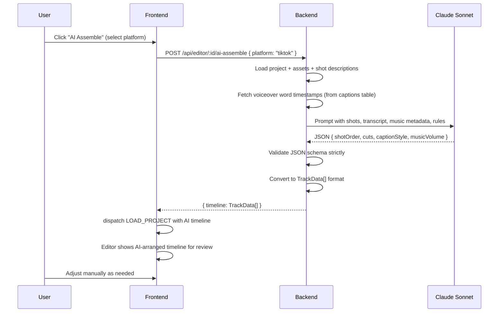

# HLD + LLD: Assembly System (Shot Assembly + AI Assembly)

**Phase:** 4 | **Effort:** ~24 days (Phase 4a: 13 days manual, Phase 4b: 11 days AI)
**Depends on:** Project Model (Phase 1), Editor Core (Phase 2)

---

# HLD: Assembly System

## Overview

ContentAI has two disconnected assembly paths: a backend pipeline that black-boxes ffmpeg concatenation, and a manual editor that starts from scratch. This feature unifies them. Phase 4a (manual assembly) redirects the "Assemble" queue action to open the editor with a pre-populated timeline, adds a Shot Order panel for drag-reordering, and adds single-shot regeneration from within the editor. Phase 4b (AI assembly, post-MVP) adds a Claude Sonnet endpoint that produces a structured timeline arrangement, with the editor as the review and correction layer.

## System Context Diagram

```mermaid
graph TD
    Queue[Queue Item] -->|Assemble button| EditorRoute[Editor Route]
    EditorRoute --> InitialTimeline[Auto-populated Timeline via Phase 1]

    EditorLayout --> ShotPanel[Shot Order Panel]
    ShotPanel -->|reorder| EditorReducer
    EditorLayout -->|right-click clip| RegenerateShotUI

    RegenerateShotUI -->|POST /api/video/shot/regenerate| BE_Regen[Regenerate Shot Endpoint]
    BE_Regen -->|poll| NewAsset[New Video Asset in R2]
    NewAsset -->|UPDATE_CLIP| EditorReducer

    EditorLayout -->|AI Assemble btn| BE_AI[POST /api/editor/:id/ai-assemble]
    BE_AI -->|assets + script + transcript| Claude[Claude Sonnet]
    Claude -->|structured timeline JSON| BE_AI
    BE_AI -->|TrackData[]| EditorLayout
    EditorLayout -->|LOAD_PROJECT| EditorReducer
```

## Components

| Component | Responsibility | Technology |
|---|---|---|
| Modified `POST /api/video/assemble` | Return editor project ID instead of running ffmpeg | Hono — behavior change |
| `ShotOrderPanel` | Vertical drag-reorder list of shots | React, DnD |
| Shot regeneration context menu | "Regenerate this shot" on right-click | React |
| Shot regeneration polling | Poll for new asset, swap clip | useQuery polling |
| Assembly presets | Standard/FastCut/Cinematic modifier functions | TypeScript |
| `POST /api/editor/:id/ai-assemble` | Claude Sonnet call → structured timeline | Hono, Anthropic SDK |
| AI timeline deserializer | Convert Claude JSON to `Track[]` format | Backend service |

## Data Flow (AI Assembly)



## Key Design Decisions

- **Pipeline assembly becomes editor redirect, not a separate video render** — one rendering system (editor export), not two. Eliminates the separate `assembled_video` asset type flow.
- **Shot Order panel is a high-level abstraction over the timeline** — simple reorder UI for users who don't want to use the timeline. Both coexist; they update the same state.
- **AI assembly is a starting point, not a final product** — AI generates a timeline, user reviews in editor. AI is never the last step before publish.
- **Strict JSON schema validation on AI output** — fallback to "Standard" preset if Claude returns invalid JSON. Never crash.
- **Phase 4b (AI) is gated on Phase 4a (manual) being perfect** — a good AI arrangement on a broken editor looks like an AI failure. Manual quality first.

## Out of Scope

- Music beat detection and sync
- AI re-editing conversational interface
- A/B testing two AI assembly variants
- Template-based assembly
- Collaborative review before publish

## Open Questions

- Does the existing `useRegenerateShot` hook in `frontend/src/features/video/hooks/` already have a polling mechanism? If yes, we reuse it directly — no new code needed.
- Are shot descriptions stored on the `assets` table (in `metadata` JSONB)? AI assembly quality depends on this. Must verify before starting Phase 4b.

---

# LLD: Assembly System

## Database Schema

### Phase 4a: No new tables

The assembly redirect behavior is purely a change to existing endpoints and frontend routing.

### Phase 4b: Shot description prerequisite

The `assets.metadata` JSONB should store shot description:
```typescript
// assets.metadata shape (extend existing, no migration needed for JSONB):
{
  shotDescription?: string;  // e.g., "Aerial shot of city skyline at golden hour"
  shotIndex?: number;        // order within the generated content
  prompt?: string;           // the prompt used to generate this shot
}
```

If `shotDescription` is not already stored by the generation pipeline, add it there before Phase 4b.

## API Contracts

### POST /api/video/assemble (behavior change — Phase 4a)
**Auth:** `requireAuth`

**Before:** Runs ffmpeg, returns `{ jobId }` pointing to an assembly video job.

**After:** Creates or returns an editor project for the content, then returns a redirect.

**Request body:** (unchanged)
```typescript
{
  generatedContentId: number;
  includeCaptions?: boolean;  // deprecated, ignored — captions now done in editor
  audioMix?: { clipVolume: number; voiceoverVolume: number; musicVolume: number };
}
```

**Response (changed):**
```typescript
{
  editorProjectId: string;
  redirectUrl: string;  // "/studio/editor?contentId=<id>"
}
```

**Migration note:** Keep the old response shape available for 30 days via a `legacyMode` query param: `POST /api/video/assemble?legacy=true` still runs ffmpeg. Remove after 30 days.

---

### POST /api/editor/:id/ai-assemble (new — Phase 4b)
**Auth:** `requireAuth`

**Request body:**
```typescript
{
  platform: "instagram" | "tiktok" | "youtube-shorts";
}
```

**Response (200):**
```typescript
{
  timeline: TrackData[];
  assembledBy: "ai";
  fallback?: boolean;  // true if AI failed and Standard preset was used
}
```

**Error cases:**
- `400` — invalid platform
- `401` — unauthenticated
- `403` — project not owned by user
- `404` — project not found
- `503` — Claude API unavailable (return fallback Standard preset instead of 503)

---

### GET /api/video/shot/:assetId/status (existing, verify it exists)
Polls regeneration job status. Returns `{ status: "pending"|"done"|"error", asset?: Asset }`.

## Backend Implementation

### Phase 4a: Modify POST /api/video/assemble

**File:** `backend/src/routes/video/index.ts` (or wherever `/api/video/assemble` lives)

```typescript
app.post("/assemble", requireAuth, async (c) => {
  const auth = c.get("auth");
  const { generatedContentId, audioMix } = await c.req.json();

  // Delegate to Phase 1's upsert logic:
  const [existing] = await db.select().from(editProjects)
    .where(and(
      eq(editProjects.userId, auth.user.id),
      eq(editProjects.generatedContentId, generatedContentId),
    ));

  if (existing) {
    return c.json({
      editorProjectId: existing.id,
      redirectUrl: `/studio/editor?contentId=${generatedContentId}`,
    });
  }

  // Apply audioMix to the initial timeline if provided
  const { tracks, durationMs } = await buildInitialTimeline(generatedContentId, auth.user.id);
  if (audioMix) {
    applyAudioMixToTracks(tracks, audioMix);
  }

  const [project] = await db.insert(editProjects).values({
    userId: auth.user.id,
    title: "Assembled Reel",
    generatedContentId,
    tracks,
    durationMs,
    status: "draft",
  }).returning();

  return c.json({
    editorProjectId: project.id,
    redirectUrl: `/studio/editor?contentId=${generatedContentId}`,
  });
});
```

### Phase 4b: AI Assembly endpoint

**File:** `backend/src/routes/editor/ai-assemble.ts`

```typescript
import Anthropic from "@anthropic-ai/sdk";
import { ANTHROPIC_API_KEY } from "../../utils/config/envUtil";

const anthropic = new Anthropic({ apiKey: ANTHROPIC_API_KEY });

const AI_ASSEMBLY_SCHEMA = z.object({
  shotOrder: z.array(z.number()),
  cuts: z.array(z.object({
    shotIndex: z.number(),
    trimStartMs: z.number().min(0),
    trimEndMs: z.number().min(0),
    transition: z.enum(["fade", "cut", "slide-left", "dissolve"]),
  })),
  captionStyle: z.string().optional(),
  captionGroupSize: z.number().min(1).max(6).optional(),
  musicVolume: z.number().min(0).max(1),
  totalDuration: z.number().min(1000).max(120000),
});

app.post("/:id/ai-assemble", requireAuth, async (c) => {
  const auth = c.get("auth");
  const { id } = c.req.param();
  const { platform } = await c.req.json();

  const [project] = await db.select().from(editProjects)
    .where(and(eq(editProjects.id, id), eq(editProjects.userId, auth.user.id)));
  if (!project) return c.json({ error: "Not found" }, 404);

  // Load assets and captions
  const projectAssets = await loadProjectAssets(project.generatedContentId!, auth.user.id);
  const voiceoverCaption = await loadVoiceoverCaption(projectAssets.voiceover?.id, auth.user.id);

  // Build prompt context
  const shotsContext = projectAssets.videoClips.map((a, i) => ({
    index: i,
    description: a.metadata?.shotDescription ?? `Shot ${i + 1}`,
    durationMs: a.durationMs ?? 5000,
  }));

  const prompt = buildAIAssemblyPrompt({
    shots: shotsContext,
    transcript: voiceoverCaption?.fullText ?? "",
    platform,
    targetDurationMs: platform === "tiktok" ? 15000 : 30000,
  });

  let aiResponse: z.infer<typeof AI_ASSEMBLY_SCHEMA> | null = null;
  try {
    const message = await anthropic.messages.create({
      model: "claude-sonnet-4-6",
      max_tokens: 1024,
      messages: [{ role: "user", content: prompt }],
    });
    const text = message.content[0].type === "text" ? message.content[0].text : "";
    const json = JSON.parse(text.match(/```json\n?([\s\S]+?)\n?```/)?.[1] ?? text);
    aiResponse = AI_ASSEMBLY_SCHEMA.parse(json);
  } catch (err) {
    // AI failed — fall back to Standard preset
    const standardTimeline = applyStandardPreset(
      await buildInitialTimeline(project.generatedContentId!, auth.user.id)
    );
    return c.json({ timeline: standardTimeline.tracks, assembledBy: "ai", fallback: true });
  }

  // Convert AI response to TrackData[]
  const timeline = convertAIResponseToTimeline(aiResponse, projectAssets);

  return c.json({ timeline, assembledBy: "ai", fallback: false });
});
```

### AI prompt builder

**File:** `backend/src/routes/editor/services/ai-assembly-prompt.ts`

```typescript
export function buildAIAssemblyPrompt({
  shots,
  transcript,
  platform,
  targetDurationMs,
}: {
  shots: Array<{ index: number; description: string; durationMs: number }>;
  transcript: string;
  platform: string;
  targetDurationMs: number;
}): string {
  return `You are a professional short-form video editor specializing in ${platform} content.

Given these video shots and voiceover transcript, create an optimal timeline arrangement.

SHOTS:
${shots.map(s => `[${s.index}] ${s.description} (${s.durationMs}ms)`).join("\n")}

VOICEOVER TRANSCRIPT:
"${transcript}"

PLATFORM: ${platform}
TARGET DURATION: ${targetDurationMs}ms

RULES:
1. Hook the viewer in the first 1.5 seconds — use the most visually striking shot first
2. Total duration should be ${targetDurationMs}ms ± 20%
3. Cut on voiceover sentence boundaries when possible
4. Vary shot duration (2000-5000ms) to maintain visual interest
5. Place call-to-action shots near the end
6. Use transitions sparingly — prefer hard cuts, max 2 fades
7. Shot indices must be valid (0 to ${shots.length - 1})
8. trimStartMs and trimEndMs must not exceed the shot's duration

Respond ONLY with a JSON object in this exact structure, no explanation:
\`\`\`json
{
  "shotOrder": [array of shot indices in display order],
  "cuts": [
    {
      "shotIndex": number,
      "trimStartMs": number,
      "trimEndMs": number,
      "transition": "cut" | "fade" | "slide-left" | "dissolve"
    }
  ],
  "captionStyle": "bold-outline" | "clean-white" | "highlight",
  "captionGroupSize": 3,
  "musicVolume": 0.25,
  "totalDuration": number
}
\`\`\``;
}
```

### Assembly presets (Phase 4a)

**File:** `backend/src/routes/editor/services/assembly-presets.ts`

```typescript
export function applyStandardPreset(result: { tracks: TrackData[]; durationMs: number }) {
  // No-op — standard is just the default buildInitialTimeline output
  return result;
}

export function applyFastCutPreset(result: { tracks: TrackData[]; durationMs: number }) {
  const MAX_CLIP_MS = 3000;
  const videoTrack = result.tracks.find(t => t.type === "video");
  if (!videoTrack) return result;

  let position = 0;
  videoTrack.clips = videoTrack.clips.map(clip => {
    const trimmedDuration = Math.min(clip.durationMs, MAX_CLIP_MS);
    const newClip = { ...clip, startMs: position, durationMs: trimmedDuration };
    position += trimmedDuration;
    return newClip;
  });

  return { tracks: result.tracks, durationMs: position };
}

export function applyCinematicPreset(result: { tracks: TrackData[]; durationMs: number }) {
  const FADE_MS = 500;
  const videoTrack = result.tracks.find(t => t.type === "video");
  if (!videoTrack || !videoTrack.transitions) videoTrack!.transitions = [];

  const clips = videoTrack!.clips;
  for (let i = 0; i < clips.length - 1; i++) {
    videoTrack!.transitions.push({
      id: crypto.randomUUID(),
      type: "fade",
      durationMs: FADE_MS,
      clipAId: clips[i].id,
      clipBId: clips[i + 1].id,
    });
  }

  // Music at 50% for cinematic feel
  const musicTrack = result.tracks.find(t => t.type === "music");
  if (musicTrack) {
    musicTrack.clips = musicTrack.clips.map(c => ({ ...c, volume: 0.5 }));
  }

  return result;
}
```

## Frontend Implementation

**Feature dir:** `frontend/src/features/editor/`

### Modified queue: Assemble button redirect

**`frontend/src/features/reels/hooks/use-assemble-reel.ts`** (existing hook):

```typescript
// Before: polls a job until assembled_video asset exists
// After: receives editorProjectId, navigates to editor

const assembleReel = useMutation({
  mutationFn: async (params: { generatedContentId: number }) => {
    const result = await authenticatedFetchJson<{
      editorProjectId: string;
      redirectUrl: string;
    }>("/api/video/assemble", {
      method: "POST",
      body: JSON.stringify(params),
    });
    return result;
  },
  onSuccess: (data) => {
    navigate({ to: "/studio/editor", search: { contentId: params.generatedContentId } });
  },
});
```

### New: Shot Order Panel

**`components/ShotOrderPanel.tsx`**

```typescript
import { useSortable } from "@dnd-kit/sortable";  // or native DnD

interface Props {
  videoTrack: Track;
  onReorder: (newOrder: string[]) => void;  // array of clip IDs in new order
}

export function ShotOrderPanel({ videoTrack, onReorder }: Props) {
  const clips = [...videoTrack.clips].sort((a, b) => a.startMs - b.startMs);

  return (
    <div className="flex flex-col gap-2 p-4">
      <h3 className="text-sm font-semibold text-gray-400">{t("editor.shots.label")}</h3>
      <DndContext onDragEnd={handleDragEnd}>
        <SortableContext items={clips.map(c => c.id)}>
          {clips.map((clip, i) => (
            <ShotCard
              key={clip.id}
              clip={clip}
              index={i + 1}
            />
          ))}
        </SortableContext>
      </DndContext>
    </div>
  );
}

function handleDragEnd(event: DragEndEvent) {
  const { active, over } = event;
  if (!over || active.id === over.id) return;

  // Reorder clips array, recalculate startMs values
  const oldIndex = clips.findIndex(c => c.id === active.id);
  const newIndex = clips.findIndex(c => c.id === over.id);
  const reordered = arrayMove(clips, oldIndex, newIndex);

  // Recalculate sequential positions
  let position = 0;
  const updates = reordered.map(clip => {
    const newClip = { ...clip, startMs: position };
    position += clip.durationMs;
    return newClip;
  });

  dispatch({ type: "REORDER_SHOTS", clips: updates });
}
```

**New reducer action:**
```typescript
| { type: "REORDER_SHOTS"; clips: Clip[] }

case "REORDER_SHOTS": {
  return produce(state, draft => {
    const videoTrack = draft.tracks.find(t => t.type === "video");
    if (videoTrack) videoTrack.clips = action.clips;
  });
}
```

### Shot regeneration from editor

**`hooks/use-regenerate-shot-in-editor.ts`**

```typescript
export function useRegenerateShotInEditor() {
  const { authenticatedFetchJson } = useAuthenticatedFetch();
  const queryClient = useQueryClient();

  return useMutation({
    mutationFn: async ({ assetId, clipId }: { assetId: string; clipId: string }) => {
      return authenticatedFetchJson<{ jobId: string }>("/api/video/shot/regenerate", {
        method: "POST",
        body: JSON.stringify({ assetId }),
      });
    },
    onSuccess: async ({ jobId }, { clipId }) => {
      // Poll for completion
      const newAsset = await pollUntilDone(`/api/video/shot/${jobId}/status`);
      dispatch({
        type: "UPDATE_CLIP",
        clipId,
        changes: {
          assetId: newAsset.id,
          r2Url: newAsset.r2Url,
          r2Key: newAsset.r2Key,
          durationMs: newAsset.durationMs ?? undefined,
        },
      });
    },
  });
}
```

**Context menu on `TimelineClip`:**
```typescript
// Right-click on a video track clip:
<ContextMenu>
  <ContextMenuItem onClick={() => regenerateShotInEditor({ assetId: clip.assetId, clipId: clip.id })}>
    {t("editor.shots.regenerate")}
  </ContextMenuItem>
  <ContextMenuItem onClick={() => dispatch({ type: "SPLIT_CLIP", clipId: clip.id, atMs: playheadMs })}>
    {t("editor.splitClip")}
  </ContextMenuItem>
  <ContextMenuItem onClick={() => dispatch({ type: "DUPLICATE_CLIP", clipId: clip.id })}>
    {t("editor.duplicateClip")}
  </ContextMenuItem>
</ContextMenu>
```

### Phase 4b: AI Assembly button

```typescript
// In editor toolbar:
{!isReadOnly && project.generatedContentId && (
  <DropdownMenu>
    <DropdownMenuTrigger asChild>
      <Button variant="outline">AI Assemble</Button>
    </DropdownMenuTrigger>
    <DropdownMenuContent>
      <DropdownMenuItem onClick={() => handleAIAssemble("tiktok")}>For TikTok</DropdownMenuItem>
      <DropdownMenuItem onClick={() => handleAIAssemble("instagram")}>For Instagram Reels</DropdownMenuItem>
      <DropdownMenuItem onClick={() => handleAIAssemble("youtube-shorts")}>For YouTube Shorts</DropdownMenuItem>
    </DropdownMenuContent>
  </DropdownMenu>
)}

const handleAIAssemble = async (platform: string) => {
  setIsAIAssembling(true);
  try {
    const { timeline, fallback } = await authenticatedFetchJson(
      `/api/editor/${project.id}/ai-assemble`,
      { method: "POST", body: JSON.stringify({ platform }) }
    );
    dispatch({ type: "LOAD_PROJECT", tracks: timeline });
    if (fallback) {
      toast.warning(t("editor.aiAssembly.fallback"));
    } else {
      toast.success(t("editor.aiAssembly.success"));
    }
  } finally {
    setIsAIAssembling(false);
  }
};
```

### Assembly preset picker (shown when editor first opens with new content)

```typescript
// In EditorLayout, when project was just created (tracks have clips but user hasn't made edits):
const isFirstOpen = project.updatedAt === project.createdAt;

{isFirstOpen && (
  <AssemblyPresetModal
    onSelect={async (preset) => {
      const tracks = await applyPresetToTracks(project.tracks, preset);
      dispatch({ type: "LOAD_PROJECT", tracks });
    }}
    onDismiss={() => {}} // just close
  />
)}
```

### Query keys

```typescript
editor: {
  aiAssembly: (id: string) => ["editor", id, "ai-assemble"] as const,
}
```

### i18n keys

```json
{
  "editor": {
    "shots": {
      "label": "Shot Order",
      "regenerate": "Regenerate this shot",
      "regenerating": "Regenerating...",
      "reorderHint": "Drag to reorder shots"
    },
    "assembly": {
      "preset": {
        "title": "How do you want to start?",
        "standard": "Standard",
        "standardDesc": "Shots in order, balanced mix",
        "fastCut": "Fast Cut",
        "fastCutDesc": "Clips trimmed to 3s, high energy",
        "cinematic": "Cinematic",
        "cinematicDesc": "Fade transitions, music at 50%",
        "blank": "Blank timeline"
      }
    },
    "aiAssembly": {
      "button": "AI Assemble",
      "forPlatform": "For {{platform}}",
      "loading": "AI is arranging your shots...",
      "success": "AI assembled your timeline — review and adjust",
      "fallback": "AI couldn't produce a good arrangement — using Standard layout instead"
    }
  }
}
```

## Build Sequence

### Phase 4a (Manual Assembly)

1. Backend: Modify `POST /api/video/assemble` to return `editorProjectId` + redirect
2. Frontend: Update `useAssembleReel` hook to navigate to editor
3. Frontend: Update queue detail sheet Assemble button behavior
4. Frontend: `ShotOrderPanel` component + "Shots" tab in left panel
5. Frontend: `REORDER_SHOTS` reducer action
6. Frontend: Shot regeneration context menu on `TimelineClip`
7. Frontend: `useRegenerateShotInEditor` hook with polling
8. Backend: Assembly presets (Standard, FastCut, Cinematic) service functions
9. Frontend: Assembly preset picker modal (shown on first editor open)
10. Tests

### Phase 4b (AI Assembly — post-MVP)

11. Backend: Verify/add `shotDescription` to `assets.metadata` in generation pipeline
12. Backend: `POST /api/editor/:id/ai-assemble` endpoint
13. Backend: `buildAIAssemblyPrompt` + `convertAIResponseToTimeline` service
14. Backend: Strict JSON schema validation + fallback logic
15. Frontend: AI Assemble button + platform picker dropdown
16. Frontend: Loading state during AI assembly (overlay with progress message)
17. Tests + prompt iteration

## Edge Cases & Error States

- **Assemble with 0 video clips (generation still running):** `buildInitialTimeline` returns empty video track. Editor opens with empty timeline. Show banner: "Your shots are still generating."
- **Shot regeneration takes >60 seconds:** Show loading state on the clip. If polling exceeds 5 minutes, show error: "Regeneration timed out — try again."
- **AI returns shot indices out of range:** JSON schema validation catches this. `shotIndex` must be between 0 and `shots.length - 1`. Invalid → fallback to Standard.
- **AI assembly on project without generatedContentId:** AI Assemble button is hidden (`project.generatedContentId` is null for standalone projects). No endpoint call possible.
- **Reorder shots while audio clip is playing:** Pause playback before dispatching `REORDER_SHOTS`. Resume after. This prevents the video element from playing the wrong segment.
- **Cinematic preset when only 1 clip:** `applyCinematicPreset` skips transition loop (length - 1 = 0). No transitions added. No error.

## Dependencies on Other Systems

- **Phase 1 (Project Model)** — `buildInitialTimeline` is reused directly. Must be done first.
- **Phase 2 (Editor Core)** — shot reordering uses the same clip drag infrastructure. Clip duplication reducer is reused for shot management.
- **Phase 3 (Captions)** — "Voiceover Focus" preset (AI assembly variant) uses caption word timestamps to align cuts to sentence boundaries. This preset is Phase 4b only.
- **`useRegenerateShot` hook** — verify it exists in `frontend/src/features/video/hooks/use-regenerate-shot.ts` and has a polling mechanism before writing a new hook.
- **Anthropic SDK** — `@anthropic-ai/sdk` must be installed in backend. Check `backend/package.json`. If not present: `bun add @anthropic-ai/sdk`.
- **`ANTHROPIC_API_KEY`** — must be in `backend/src/utils/config/envUtil.ts`. Likely already there (used for chat). Verify.
