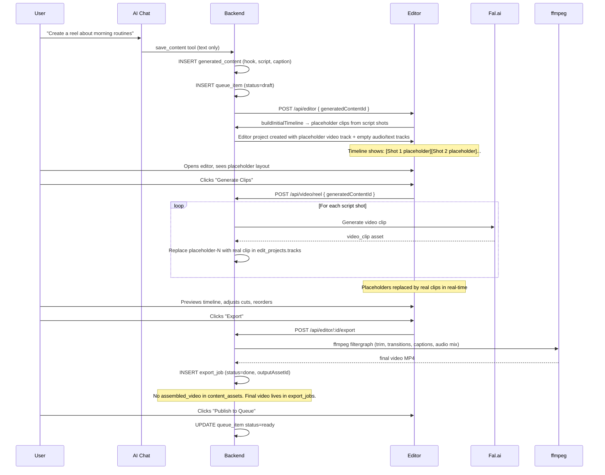

# Architecture: Editor as Production Core

**Status:** Design — not yet implemented
**Date:** 2026-03-22
**Scope:** Full redesign of the video production pipeline so the editor is the single source of truth for producing the final video.

---

## The Problem (Honest Assessment)

The current system was built with two separate pipelines that were never properly connected:

### Pipeline A — Chat / "Generate Reel" (the old path)
```
AI generates text content
    → user clicks "Generate Reel" in VideoWorkspacePanel
    → backend generates video clips (Fal.ai)
    → backend auto-assembles clips + voiceover + music → assembled_video
    → assembled_video sits in content_assets as a media attachment
```

### Pipeline B — Editor (the new path)
```
editor project is auto-created (empty timeline)
    → user must manually add clips in the editor MediaPanel
    → user clicks AI Assemble
    → user clicks Export
    → export_job runs ffmpeg
    → output goes into export_jobs.outputAssetId (NOT into content_assets)
```

**These two pipelines produce video in entirely different ways, store it in different places, and never talk to each other.**

---

## Specific Failures

### 1. The editor timeline is always empty on first open

`buildInitialTimeline` queries `content_assets WHERE role = 'video_clip'`. When the editor is auto-created after content generation (which only produces *text*), there are zero video_clip rows. The timeline opens to nothing.

**The voiceover and music ARE loaded** by `buildInitialTimeline` — they go on the audio track. But if no video clips have been generated yet, the whole timeline appears blank in the UI. Users see an empty editor and have no idea why.

### 2. `assembled_video` is shown as a media item in the editor

`runAssembleFromExistingClips` (the chat pipeline) creates an `assembled_video` in `content_assets`. This shows up in the editor's **MediaPanel** as a piece of source media — the same panel where raw clips and uploads live.

This is completely backwards. The assembled video is the *output* of the production process. It should never appear as an input. The MediaPanel should contain raw ingredients (clips, voiceover, music). The assembled result belongs in the export/preview area.

### 3. Two caption systems, two audio mixers, two R2 paths

| | Chat pipeline | Editor export |
|---|---|---|
| Caption generation | `createAssCaptions` (simple) | `generateASS` (full ASS, 6 presets, karaoke) |
| Audio mixing | `mixAssemblyAudio` | ffmpeg `amix` filtergraph |
| R2 path | `assembled/<userId>/<contentId>/` | `exports/<userId>/<projectId>/` |
| Stored in | `content_assets` (via content ID) | `export_jobs.outputAssetId` (via project ID) |
| Queue knows about it | Yes (detail API joins content_assets) | Only via latestExportUrl |

Two implementations of the same thing. The editor's version is far more capable (xfade transitions, color grading, karaoke captions, per-clip trim/speed) but it's bypassed entirely when the user clicks "Generate Reel."

### 4. "Generate Reel" produces a finished video without going through the editor

The user clicks "Generate Reel" → `POST /api/video/reel` → clips are generated → auto-assembled → done. The editor is never involved. The user has no way to adjust the cut order, trim clips, change transitions, or control caption style before the video is assembled.

### 5. The AI Assembly endpoint discards audio and captions

`POST /api/editor/:id/ai-assemble` returns a suggested timeline but `convertAIResponseToTracks` sets audio and text tracks to empty arrays. Even the AI returns `captionStyle` and `musicVolume` in its response — and both are thrown away.

### 6. Editor project names are always "Untitled Edit"

Auto-created editor projects default to `"Untitled Edit"` and are never updated with the content's hook text.

---

## The Vision: Editor as the Single Production Core

> **The editor produces the final product. Everything else feeds into it.**

```
AI generates text content (hook, script, caption, scene description)
         │
         ▼
Editor project auto-created, populated with:
  ├── Video track:   [empty slots matching script shots — placeholders]
  ├── Audio track:   [voiceover clip if generated, else placeholder]
  ├── Music track:   [background music if attached, else placeholder]
  └── Text track:    [caption words from clean script, pre-timed]
         │
         ▼
User/AI generates video clips → they land directly on the video track
         │
         ▼
User previews, adjusts cuts, trims, reorders in editor
         │
         ▼
User clicks Export → editor export job runs → final video produced
         │
         ▼
Final video is the assembled_video. It lives on the export_job.
The queue item links to the export for posting.
```

The chat pipeline's `runAssembleFromExistingClips` is **retired**. It no longer runs automatically. Clips are generated and placed on the editor timeline. Assembly only happens when the user explicitly exports from the editor.

---

## What Changes

### A. Editor project name

**Current:** Always `"Untitled Edit"`
**Fix:** On auto-create, set title from the content's `generatedHook` (truncated to 60 chars). Already fixable in the existing `POST /api/editor` upsert logic.

```typescript
title: content.generatedHook
  ? content.generatedHook.slice(0, 60)
  : "Untitled Edit"
```

---

### B. Timeline pre-population with placeholders

**Current:** Timeline is empty until video clips exist in content_assets.
**Fix:** `buildInitialTimeline` should produce **placeholder clips** on the video track based on the script's shot structure, even before real video exists.

Parse `generatedScript` to extract shots (same logic as `parseScriptShots` in the video route). For each shot, create a placeholder clip:

```typescript
{
  id: `placeholder-shot-${i}`,
  assetId: null,           // no real asset yet
  isPlaceholder: true,
  label: shot.description, // e.g. "Wide shot of kitchen counter"
  startMs: cumulativeDuration,
  durationMs: shot.estimatedDurationMs ?? 5000,
  trimStartMs: 0,
  trimEndMs: shot.estimatedDurationMs ?? 5000,
}
```

The editor UI renders placeholders as outlined empty slots with the shot description. When real clips arrive (after "Generate Clips"), the placeholder is replaced by the real asset.

This means: **the editor always has a meaningful layout from the moment content is generated**, not just after a multi-step manual process.

---

### C. Rename "Generate Reel" → "Generate Clips"

**Current:** `POST /api/video/reel` → generates clips → auto-assembles → assembled_video stored in content_assets.
**Fix:** `POST /api/video/reel` → generates clips → places them on the editor timeline. **Does not assemble.**

Changes to `runReelGeneration`:
1. After generating all `video_clip` assets, do NOT call `runAssembleFromExistingClips`.
2. Instead, call `refreshEditorTimeline(contentId, userId)` after each individual clip is generated to replace the matching placeholder on the timeline.
3. The frontend should show the editor (or a link to it) when clip generation completes, not a video preview of the assembled output.

`runAssembleFromExistingClips` has **two call sites** that must both be removed:
- `runReelGeneration` in `backend/src/routes/video/index.ts` (direct call)
- `chat-tools.ts` — the `assemble_video` AI tool calls `runAssembleFromExistingClips` via `setTimeout`. **This tool must be removed from the AI tool list or rewired to trigger an editor export.** If the function is deleted and the tool definition remains, any active chat session that invokes it will crash.

The `runAssembleFromExistingClips` function, `upsertAssembledAsset`, `mixAssemblyAudio`, and `createAssCaptions` are fully retired. Existing `assembled_video` rows in `content_assets` are excluded from all UI via filter (see D) and cleaned up by data migration (see Migration Path).

---

### D. `assembled_video` is removed from MediaPanel

**Current:** `assembled_video` content assets appear in the editor's MediaPanel source list.
**Fix:** `buildInitialTimeline` already excludes `assembled_video` from tracks (correct). The MediaPanel asset fetch (`GET /api/assets?generatedContentId=<id>`) should also filter out `assembled_video` and `final_video` roles — these are never source material.

The chat pipeline no longer creates `assembled_video` in `content_assets` (see C above), so this problem largely resolves itself. For any existing rows, the filter prevents them appearing as source media.

---

### E. Clip generation event → editor timeline refresh

When clip generation completes (individual shots finish), the editor needs to know. Currently the editor only loads tracks once on project open.

**New flow:**
1. `runReelGeneration` stores progress in the existing `video_render_jobs` Redis record (already does this).
2. When a shot finishes, in addition to inserting the `content_asset` row, call `refreshEditorTimeline(contentId, userId)`:
   - Replace the matching placeholder clip (`placeholder-shot-N`) with the real asset clip.
   - Update `edit_projects.tracks` in the DB.
3. The editor frontend polls `GET /api/editor/:id` (or listens via the existing job polling mechanism). When `project.tracks` changes, it reloads the tracks that have changed.

This gives the user a real-time experience: they open the editor, see placeholders, and watch clips appear on the timeline as they're generated.

---

### F. AI Assembly populates audio and text tracks

**Current:** `convertAIResponseToTracks` sets audio and text tracks to empty arrays even though the AI returns `captionStyle` and `musicVolume`.
**Fix:**
- After building the video track from AI suggestions, call the same logic as `buildInitialTimeline` to populate voiceover and music tracks.
- Map `captionStyle` from the AI response to the text track's `preset` property.
- Map `musicVolume` to the music clip's `volume` property.

---

### G. Export is the only way to produce the final video

**Current:** Two paths produce `assembled_video`. Chat pipeline creates one in `content_assets`. Editor export creates one in `export_jobs`.
**Fix:** Only the editor export path produces a final video. The queue item's "published video" is always the output of an export job.

The queue detail API currently shows `latestExportUrl` from `export_jobs`. This remains the correct source. The `content_assets` `assembled_video` row is no longer created.

The queue's pipeline stages should update to reflect this:
- `video_clips_ready` stage: all `video_clip` content assets exist
- `editor_ready` stage: editor timeline has no placeholder clips remaining
- `exported` stage: `export_jobs` has a `done` record
- `posted` stage: queue item status = `posted`

---

### H. Editor project title auto-update on content iteration

When content is iterated (v1 → v2), the editor project is already updated to point to the new tip (fixed previously). The title should also update if it was auto-generated (i.e., it matches the v1 hook). If the user manually renamed it, leave it alone.

A simple heuristic: store `autoTitle: boolean` on the edit project. If `true`, update title on each version update. If the user renames it in the UI, set `autoTitle: false`.

---

## New Data Flow (Happy Path)



---

## Migration Path

The canonical phase sequence is defined in the LLD build sequence. **All three documents (README, this file, LLD) use the same four phases:**

### Phase 1 — Schema + Core Backend Services

| # | Change | Files |
|---|---|---|
| 1 | Add `autoTitle` column to `edit_projects` + migration (set `false` for existing rows where title ≠ hook) | `schema.ts`, migration |
| 2 | Update `Clip` TypeScript type with `isPlaceholder`, `placeholderShotIndex`, `placeholderLabel` | `frontend/src/features/editor/types/editor.ts` |
| 3 | Write `refreshEditorTimeline` service (with transaction + row lock) | new `refresh-editor-timeline.ts` |
| 4 | Update `buildInitialTimeline`: placeholder clips from script + empty-result guard | `build-initial-timeline.ts` |
| 5 | Update `POST /api/editor`: title from hook + `autoTitle` flag | `backend/src/routes/editor/index.ts` |
| 6 | Update `PATCH /api/editor`: set `autoTitle=false` only when title actually changes | `backend/src/routes/editor/index.ts` |

### Phase 2 — Backend Decoupling (old assembly code stays alive as fallback)

**Do not delete `runAssembleFromExistingClips` yet.** The editor UI that replaces the assembled preview ships in Phase 3. Deleting the old path before the new UI is live leaves users with no visible output.

| # | Change | Files |
|---|---|---|
| 7 | `runReelGeneration` calls `refreshEditorTimeline` per clip instead of `runAssembleFromExistingClips` | `backend/src/routes/video/index.ts` |
| 8 | Voiceover + music generation handlers call `refreshEditorTimeline` after inserting asset | voiceover + music routes |
| 9 | Filter `assembled_video` out of MediaPanel asset fetch | `backend/src/routes/editor/index.ts` (assets endpoint) |
| 10 | AI Assembly (`convertAIResponseToTracks`) fills audio + text tracks | `backend/src/routes/editor/index.ts` |

### Phase 3 — Editor UI (ships atomically with final Phase 2 backend changes)

**Phase 2 and Phase 3 must deploy together.** Phase 3 is the UI that makes the new backend behaviour visible.

| # | Change | Files |
|---|---|---|
| 11 | `TimelineClip` renders placeholder slots with per-slot status states (Queued / Generating / Failed) | `TimelineClip.tsx` |
| 12 | Add `MERGE_TRACKS_FROM_SERVER` reducer (matches by `placeholderShotIndex`, never overwrites `locallyModified` clips) | `useEditorStore.ts` |
| 13 | Add exponential back-off polling in `EditorLayout` while placeholders exist | `EditorLayout.tsx` |
| 14 | Rename "Generate Reel" → "Generate Clips"; post-generation CTA links to editor | `VideoWorkspacePanel.tsx` |
| 15 | Add confirmation dialog before timeline rebuild on script iteration | `EditorLayout.tsx` / chat integration |

### Phase 4 — Delete Old Code + Queue Stages (only after Phase 3 is verified end-to-end)

| # | Change | Files |
|---|---|---|
| 16 | Run data migration: create synthetic `export_job` rows for all existing `assembled_video` content assets so in-progress queue items can publish | migration script |
| 17 | Remove `runAssembleFromExistingClips`, `upsertAssembledAsset`, `mixAssemblyAudio`, `createAssCaptions` | `backend/src/routes/video/index.ts` |
| 18 | Remove or rewire `assemble_video` AI chat tool in `chat-tools.ts` | `chat-tools.ts` |
| 19 | Remove `POST /api/video/assemble` endpoint | `backend/src/routes/video/index.ts` |
| 20 | Update `deriveStages` for editor-centric pipeline stages | `backend/src/routes/queue/index.ts` |

---

## What Does NOT Change

- The `export_job` table and `runExportJob` function — this is the correct final video production path. It stays.
- The `content_asset` table — still used for voiceover, music, and video clip assets. Only `assembled_video` in this table goes away.
- The queue's dependency on export for publish — correct, keeps the gate.
- The AI chat for generating text content — that stays text-only. Clips are always a separate step.
- The `PATCH /api/editor/:id` auto-save — stays exactly as is.

---

## Related Files (Quick Reference)

| File | Relevance |
|---|---|
| `backend/src/routes/editor/index.ts` | All editor endpoints, `runExportJob`, `convertAIResponseToTracks` |
| `backend/src/routes/editor/services/build-initial-timeline.ts` | **Phase 1 target** — add placeholder clips |
| `backend/src/routes/video/index.ts` | **Phase 2 target** — remove auto-assembly, add timeline refresh |
| `backend/src/routes/video/services/run-assemble.ts` (or inline) | To be deprecated in Phase 3 |
| `frontend/src/features/editor/components/EditorLayout.tsx` | MediaPanel filter (Phase 1), track reload on clip arrival (Phase 2) |
| `frontend/src/features/video/components/VideoWorkspacePanel.tsx` | Button rename, post-generation redirect (Phase 2) |
| `backend/src/infrastructure/database/drizzle/schema.ts` | `autoTitle` column on `editProjects` (Phase 3) |
