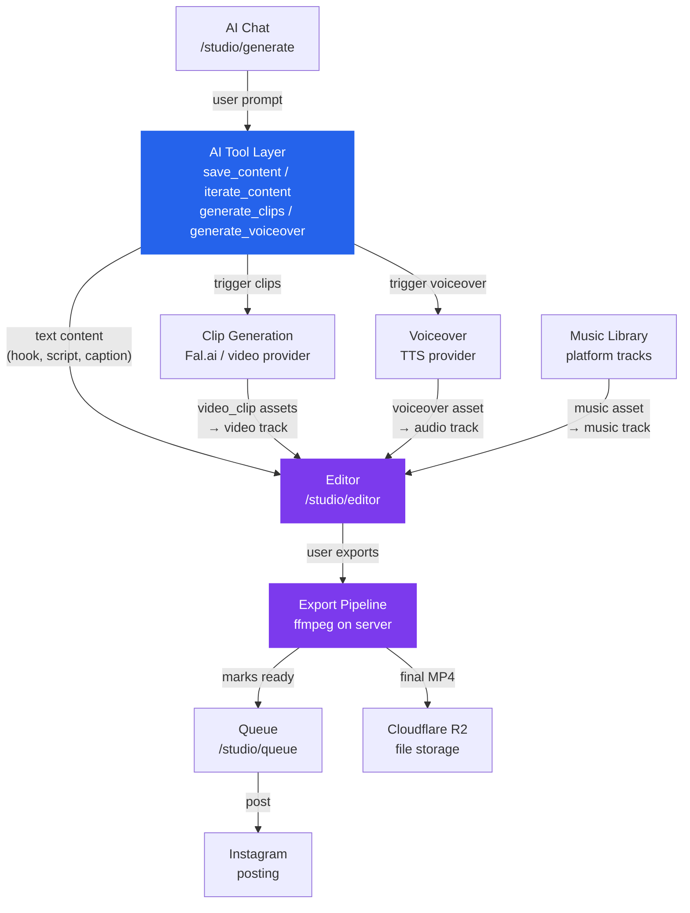
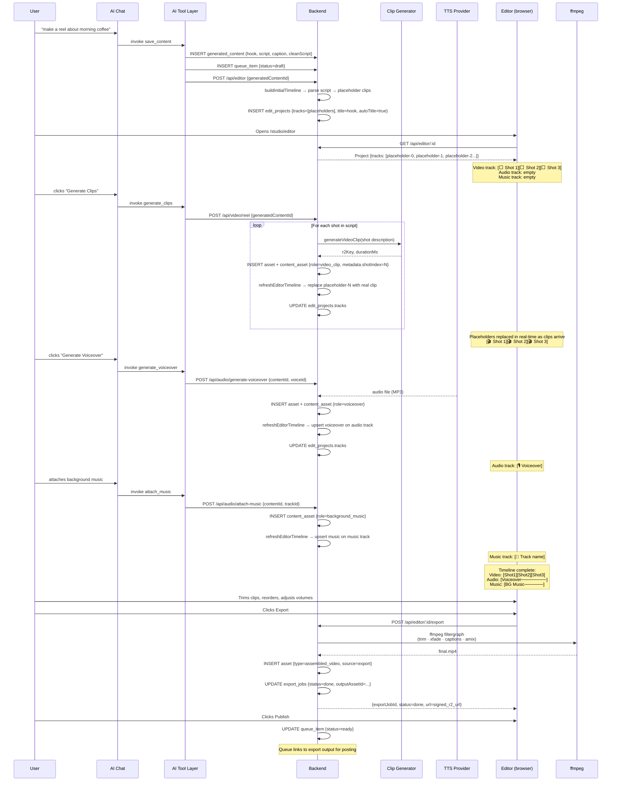
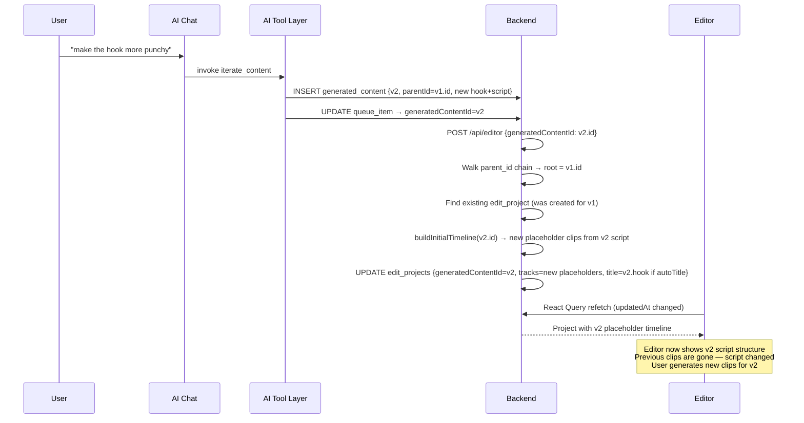
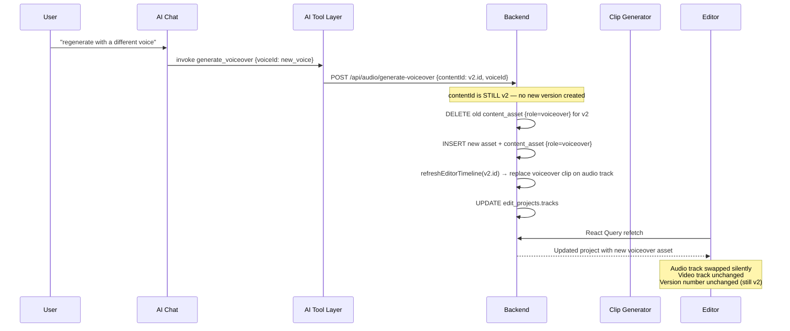

# HLD: Editor as Production Core

**Status:** Design — approved for implementation
**Date:** 2026-03-22
**Context:** [`00-context-and-problems.md`](./00-context-and-problems.md)

---

## Overview

The editor becomes the single production system for all video content. Every asset produced by the platform — video clips, voiceover, music, captions — flows into the editor timeline. The final video is produced exclusively by exporting from the editor. Nothing assembles a video outside of the editor export pipeline.

Today there are two disconnected assembly pipelines. After this rearchitecture there is one.

---

## System Context

- **AI Tool Layer (blue):** the AI's side-effects. Creates text content, triggers production jobs. Never produces a finished video.
- **Editor (purple):** receives everything, produces the final output. Nothing bypasses it.

---

## The AI Tool Layer

The AI in `/studio/generate` operates through a set of **tools** that have well-defined side-effects. Under this architecture, tools fall into two categories:

### Text tools — create/update `generated_content`
| Tool | What it does | Creates new version? |
|---|---|---|
| `save_content` | Creates a new `generated_content` row (v1) | Always (it's creation) |
| `iterate_content` | Creates a new `generated_content` row (v2+) from the current script | **Yes** — see versioning rules below |

### Production tools — create assets that land on the editor timeline
| Tool | What it does | Creates new version? |
|---|---|---|
| `generate_clips` | Calls `POST /api/video/reel` — generates video clips via Fal.ai, each lands on the **video track** | No |
| `generate_voiceover` | Calls `POST /api/audio/generate-voiceover` — synthesises TTS from `cleanScript`, lands on **audio track** | No |
| `attach_music` | Attaches a track from the music library to the **music track** | No |

> **Captions are not a tool yet.** They will be added to the AI layer in a future phase. When they are, the caption data will land on the **text track** of the editor timeline. For now, captions are generated as part of the editor export pipeline only.

**The production tools do not create new content versions.** They update the assets attached to the *current* version. If you regenerate the voiceover with a different voice, that replaces the existing voiceover asset for the current version — it doesn't create v3.

---

## Versioning Rules

A new content version (`iterate_content` → new `generated_content` row with `parentId`) is created **only when the creative brief changes** — i.e. the text content authored by the AI or user.

### Creates a new version ✅
| Trigger | Why |
|---|---|
| AI rewrites the hook | The hook is the core creative output — a new hook is a new creative direction |
| AI rewrites the script / shot descriptions | Script changes mean different shots, different edit — fundamentally new content |
| AI rewrites the caption or CTA | The caption is part of the deliverable; changing it is a new iteration |
| User explicitly asks AI to "try again" / "iterate" | Direct intent to create an alternative |

### Does NOT create a new version ❌
| Trigger | Why |
|---|---|
| Regenerating video clips (same script, new render) | Production re-run, not a creative change. Assets update in-place on the current version's timeline. |
| Regenerating voiceover (same script, different voice or speed) | A production choice, not a script change. Replaces the audio asset on the current version. |
| Swapping background music | Music is set dressing, not the creative brief. |
| Trimming or reordering clips in the editor | Pure editing — the script hasn't changed. |
| Changing caption style or look | Visual treatment, not content. |
| Exporting | Output action. No content change. |

### Why this boundary?

The `generated_content` version chain represents the **scriptwriting history** — what the AI produced and how it evolved. The editor and its assets represent **production history** — how that script was turned into video.

These are two separate histories. Mixing them (e.g. "regenerating voiceover creates v3") would create confusing version chains where most versions are identical scripts with only a different audio file. The queue's version navigator would show "v1 / v2 / v3" where v2 and v3 are the same words, just different voices.

### Consequence for the editor

When a new script version is created:
- A new `generated_content` row exists (v2)
- `POST /api/editor` is called with the new content ID
- The editor project is updated: `generatedContentId → v2`, timeline rebuilt with new placeholder clips from the v2 script, title updated (if `autoTitle`)
- Previous production assets (clips, voiceover) from v1 remain in `content_assets` but **are not automatically carried to v2** — they were produced for the old script. The user generates new clips for the new script.

When only assets change (no new version):
- The asset row is updated/replaced in `content_assets`
- `refreshEditorTimeline` is called
- The editor's existing timeline slot for that asset is updated in-place
- No new `generated_content` row, no queue item change

---

## Core Design Decisions

### Decision 1: Placeholder clips on the video track from day one

When AI generates text content, the editor project is immediately created with **placeholder clips** derived from the script's shot descriptions. These placeholders show what will be on the timeline before real clips exist, giving the user a meaningful layout the moment they open the editor.

When real clips arrive (after clip generation), placeholders are replaced in-place. The timeline structure does not change — only the asset backing each slot.

**Why:** Without this, the editor opens to a blank screen and users have no indication of what will happen. Placeholders make the pipeline visible and give users confidence.

### Decision 2: Clip generation writes to the editor timeline directly

`runReelGeneration` no longer auto-assembles. After each clip is generated, the backend calls `refreshEditorTimeline(contentId, userId)` which updates `edit_projects.tracks` in the database — replacing the matching placeholder with the real clip.

The frontend polls `GET /api/editor/:id` (already happens via React Query). When tracks change, the editor reloads the affected clips. The user sees placeholders replaced by real video in real-time.

**Why:** Decouples "I have raw clips" from "I have a finished video." The editor is where the user decides the cut order, timing, and transitions — not the backend.

### Decision 3: `assembled_video` in `content_assets` is retired

`runAssembleFromExistingClips` and `upsertAssembledAsset` are removed. No code path creates an `assembled_video` record in `content_assets` anymore.

The final video lives exclusively in `export_jobs.outputAssetId` → `assets` table, reached via the export pipeline.

**Why:** Having `assembled_video` in `content_assets` is what causes it to appear as source media in the editor's MediaPanel. It is structurally wrong — the assembled result is not a source ingredient.

### Decision 4: The editor project title tracks the content hook

Auto-created editor projects use the content's `generatedHook` as their title (truncated to 60 chars). A new `autoTitle` boolean column on `edit_projects` tracks whether the title was auto-assigned. If true, it updates when content is iterated. If the user manually renames the project, `autoTitle` is set to `false` and the title is never auto-updated again.

### Decision 5: Export is the only publish gate

The queue's publish path already requires a completed export job. This stays. There is no "assemble and post" shortcut that bypasses the editor.

---

## Components

| Component | Responsibility | Technology |
|---|---|---|
| AI Chat (`/studio/generate`) | Generates text content (hook, script, caption, scene). Triggers clip generation and TTS. Navigates to editor when ready. | React, Hono, Claude AI |
| `buildInitialTimeline` | Bootstraps editor timeline with placeholder clips from script + real assets if they exist | TypeScript, Drizzle |
| `refreshEditorTimeline` | Called after each clip/voiceover is generated. Replaces placeholders with real assets in `edit_projects.tracks` | TypeScript, Drizzle |
| Editor Timeline | Where the user arranges, trims, and orders clips. 4-track model: video, audio, music, text | React, `useReducer` |
| `runExportJob` | Renders the editor timeline to a final MP4 via ffmpeg. The only way to produce a finished video | Bun, ffmpeg |
| Queue | Manages post scheduling. Links to export output for the final video URL | React, Hono, Drizzle |

---

## New Data Flow: Content → Final Video

---

## Data Flow: Script Version Iteration (new content version)

Triggered when the AI rewrites the hook, script, or caption via `iterate_content`.

## Data Flow: Asset Replacement (same version, no new content row)

Triggered when the user regenerates clips, regenerates voiceover with a different voice, or swaps music.

---

## What Is Removed

| Removed | Replaced By |
|---|---|
| `runAssembleFromExistingClips` | Nothing — assembly only happens in `runExportJob` |
| `upsertAssembledAsset` (writes to `content_assets`) | `export_jobs.outputAssetId` is the final video pointer |
| Auto-assembly after clip generation | `refreshEditorTimeline` places clips on the editor timeline |
| `assembled_video` in `content_assets` | Never created. MediaPanel shows only real source assets |
| `VideoWorkspacePanel` "Assemble" / "Generate Reel" button producing a finished video | Button renamed "Generate Clips". Result is clips on timeline, not a finished video |
| Chat pipeline route `/api/video/assemble` (if it auto-assembles without editor) | Retired |

---

## Out of Scope

- Caption system redesign (covered in `02-captions.md`)
- Effects and transitions (covered in `03-effects-transitions.md`)
- Real-time multiplayer editing
- Mobile editor support
- Undo/redo across sessions

---

## Open Questions

| Question | Impact | Owner |
|---|---|---|
| When clip generation is slow (30s+ per shot), how does the user know which placeholders are "loading"? Need a loading state per placeholder slot. | UX | Frontend |
| Should the editor timeline auto-scroll / jump to a slot when its clip arrives? | UX | Frontend |
| If the user manually rearranges placeholders before clips arrive, does `refreshEditorTimeline` still know which placeholder to replace? Need stable placeholder IDs tied to shot index, not position. | Correctness | Backend |
