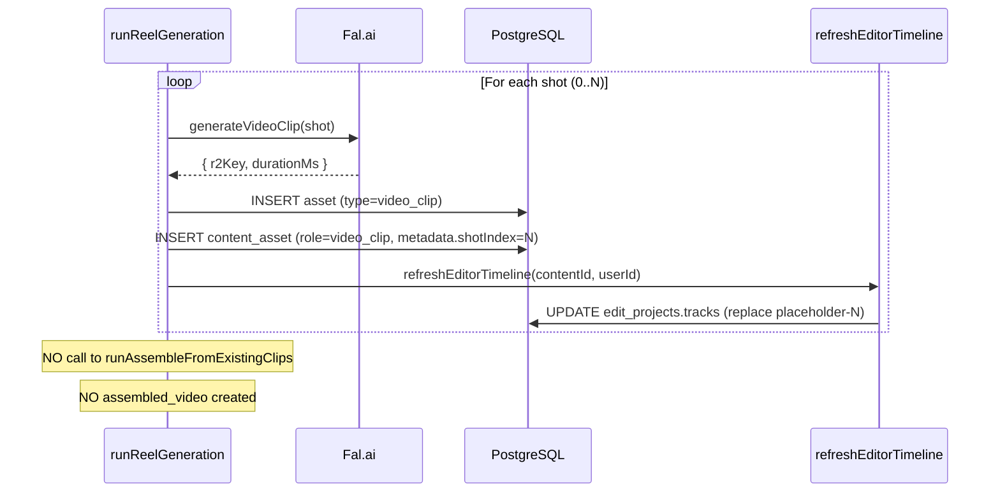

# LLD: Editor as Production Core

**Status:** Design — ready for implementation
**Date:** 2026-03-22
**Depends on:** [`HLD.md`](./HLD.md)

---

## 1. Database Schema Changes

### 1a. Add `auto_title` to `edit_projects`

```typescript
// backend/src/infrastructure/database/drizzle/schema.ts
export const editProjects = pgTable("edit_project", {
  // ... existing columns ...
  autoTitle: boolean("auto_title").notNull().default(true), // NEW
});
```

Migration: `bun db:generate && bun db:migrate`

**Behaviour:** Set to `true` on auto-created projects. Set to `false` when the user renames the project via `PATCH /api/editor/:id { title: "..." }`. When `autoTitle === true`, `buildInitialTimeline` and `refreshEditorTimeline` are allowed to update the title.

### 1b. Placeholder clip shape (no schema change — JSONB)

Placeholder clips are stored inside the existing `edit_projects.tracks` JSONB column. Add `isPlaceholder` and `placeholderShotIndex` fields to the existing `Clip` TypeScript type:

```typescript
// frontend/src/features/editor/types/editor.ts
export interface Clip {
  id: string;
  assetId: string | null;       // null for placeholders
  startMs: number;
  durationMs: number;
  trimStartMs: number;
  trimEndMs: number;
  // ... existing fields ...

  // NEW — placeholder fields (undefined on real clips)
  isPlaceholder?: true;
  placeholderShotIndex?: number;   // stable identifier — survives reordering
  placeholderLabel?: string;       // shot description shown in UI
}
```

No DB migration needed — JSONB accepts any shape.

---

## 2. New Backend Service: `refreshEditorTimeline`

**File:** `backend/src/routes/editor/services/refresh-editor-timeline.ts` (new file)

This function is called after any asset is created for a content item (clip generated, voiceover generated, music attached). It updates the editor project's tracks to replace placeholders with real assets and add/update audio tracks.

```typescript
export async function refreshEditorTimeline(
  contentId: number,
  userId: string,
): Promise<void> {
  // 1. Find the editor project for this content's chain root
  const chainRootId = await resolveChainRoot(contentId, userId);
  const [project] = await db
    .select()
    .from(editProjects)
    .where(
      and(
        eq(editProjects.userId, userId),
        eq(editProjects.generatedContentId, chainRootId),
        isNull(editProjects.parentProjectId),
      ),
    )
    .limit(1);

  if (!project) return; // no editor project yet — nothing to refresh

  // 2. Load all current assets for this content
  const assetRows = await db
    .select({
      id: assets.id,
      role: contentAssets.role,
      durationMs: assets.durationMs,
      r2Key: assets.r2Key,
      metadata: assets.metadata,
    })
    .from(contentAssets)
    .innerJoin(assets, eq(contentAssets.assetId, assets.id))
    .where(eq(contentAssets.generatedContentId, contentId));

  const clips = assetRows.filter((a) => a.role === "video_clip");
  const voiceover = assetRows.find((a) => a.role === "voiceover");
  const music = assetRows.find((a) => a.role === "background_music");

  // 3. Rebuild tracks from current state
  const currentTracks = project.tracks as Track[];
  const updatedTracks = mergePlaceholdersWithRealClips(currentTracks, clips, voiceover, music);

  // 4. Persist
  await db
    .update(editProjects)
    .set({ tracks: updatedTracks })
    .where(eq(editProjects.id, project.id));
}
```

### `mergePlaceholdersWithRealClips`

```typescript
function mergePlaceholdersWithRealClips(
  currentTracks: Track[],
  videoClips: AssetRow[],
  voiceover: AssetRow | undefined,
  music: AssetRow | undefined,
): Track[] {
  return currentTracks.map((track) => {
    // ── Video track: replace placeholders by shotIndex ──
    if (track.type === "video") {
      const updatedClips = track.clips.map((clip) => {
        if (!clip.isPlaceholder) return clip; // already real, keep as-is
        const shotIndex = clip.placeholderShotIndex ?? 0;
        const realAsset = videoClips.find(
          (a) => (a.metadata as { shotIndex?: number })?.shotIndex === shotIndex,
        );
        if (!realAsset) return clip; // not generated yet, keep placeholder
        return {
          ...clip,
          assetId: realAsset.id,
          durationMs: realAsset.durationMs ?? clip.durationMs,
          trimEndMs: realAsset.durationMs ?? clip.trimEndMs,
          isPlaceholder: undefined,       // remove placeholder flag
          placeholderShotIndex: undefined,
          placeholderLabel: undefined,
        };
      });
      return { ...track, clips: updatedClips };
    }

    // ── Audio track: upsert voiceover clip ──
    if (track.type === "audio" && voiceover) {
      const hasVoiceover = track.clips.some((c) => c.assetId === voiceover.id);
      if (hasVoiceover) return track;
      return {
        ...track,
        clips: [
          {
            id: `voiceover-${voiceover.id}`,
            assetId: voiceover.id,
            startMs: 0,
            durationMs: voiceover.durationMs ?? 0,
            trimStartMs: 0,
            trimEndMs: voiceover.durationMs ?? 0,
            volume: 1.0,
          },
        ],
      };
    }

    // ── Music track: upsert music clip ──
    if (track.type === "music" && music) {
      const hasMusic = track.clips.some((c) => c.assetId === music.id);
      if (hasMusic) return track;
      return {
        ...track,
        clips: [
          {
            id: `music-${music.id}`,
            assetId: music.id,
            startMs: 0,
            durationMs: music.durationMs ?? 0,
            trimStartMs: 0,
            trimEndMs: music.durationMs ?? 0,
            volume: 0.3,
          },
        ],
      };
    }

    return track;
  });
}
```

---

## 3. Updated `buildInitialTimeline`

**File:** `backend/src/routes/editor/services/build-initial-timeline.ts`

Add placeholder clip generation from the script. The function now has two phases:

**Phase 1 — parse script shots into placeholder clips:**
```typescript
import { parseScriptShots } from "../../video/services/parse-script-shots";

// After fetching content row:
const shots = content.generatedScript
  ? parseScriptShots(content.generatedScript)
  : [{ description: content.generatedHook ?? "Shot 1", estimatedDurationMs: 5000 }];

const placeholderClips: Clip[] = shots.map((shot, i) => ({
  id: `placeholder-shot-${i}`,
  assetId: null,
  isPlaceholder: true,
  placeholderShotIndex: i,
  placeholderLabel: shot.description,
  startMs: shots.slice(0, i).reduce((sum, s) => sum + (s.estimatedDurationMs ?? 5000), 0),
  durationMs: shot.estimatedDurationMs ?? 5000,
  trimStartMs: 0,
  trimEndMs: shot.estimatedDurationMs ?? 5000,
}));
```

**Phase 2 — overlay real assets (same logic as `mergePlaceholdersWithRealClips` above):**
- For any `video_clip` assets already in `content_assets`, replace the matching placeholder.
- Place voiceover on audio track if it exists.
- Place music on music track if it exists.

**Result:** The function always returns a meaningful timeline, even for brand-new content with no assets.

---

## 4. Updated `POST /api/editor` Handler

**File:** `backend/src/routes/editor/index.ts`

In the upsert path (existing project found), update title if `autoTitle === true`:

```typescript
if (existing) {
  const { tracks, durationMs } = await buildInitialTimeline(generatedContentId, auth.user.id);

  // Only update title if it was auto-assigned and we have a new hook
  const titleUpdate = existing.autoTitle && content?.generatedHook
    ? { title: content.generatedHook.slice(0, 60) }
    : {};

  const [updated] = await db
    .update(editProjects)
    .set({ generatedContentId, tracks, durationMs, ...titleUpdate })
    .where(eq(editProjects.id, existing.id))
    .returning();

  return c.json({ project: updated }, 200);
}
```

On INSERT (new project):

```typescript
const [project] = await db
  .insert(editProjects)
  .values({
    userId: auth.user.id,
    title: content?.generatedHook?.slice(0, 60) ?? title ?? "Untitled Edit",
    autoTitle: !title,   // auto-titled if no explicit title was passed
    generatedContentId: generatedContentId ?? null,
    tracks,
    durationMs,
    fps: 30,
    resolution: "1080x1920",
    status: "draft",
  })
  .returning();
```

---

## 5. Updated `PATCH /api/editor/:id`

When the user updates the title, set `autoTitle = false`:

```typescript
const updates: Partial<EditProject> = {};
if (body.title !== undefined) {
  updates.title = body.title;
  updates.autoTitle = false;  // user took ownership of the title
}
// ... rest of patch logic
```

---

## 6. Updated `runReelGeneration` — Remove Auto-Assembly

**File:** `backend/src/routes/video/index.ts`

**Remove** the call to `runAssembleFromExistingClips` at the end of `runReelGeneration`.

**Add** a call to `refreshEditorTimeline` after each clip is generated:

```typescript
// Inside the per-shot loop, after inserting the content_asset row:
await refreshEditorTimeline(generatedContentId, userId);
// Non-blocking — fire and forget with catch
// (if it fails, the clip still exists; editor just doesn't update immediately)
```

Also call `refreshEditorTimeline` after voiceover and music are attached (in their respective generation handlers).



---

## 7. Updated `runVoiceoverGeneration`

**File:** wherever voiceover is generated (TTS endpoint)

After the voiceover asset is inserted into `content_assets`, call:

```typescript
await refreshEditorTimeline(generatedContentId, userId).catch(() => {});
```

---

## 8. Remove `assembled_video` from MediaPanel

**File:** `backend/src/routes/editor/index.ts` — the `GET /api/assets` endpoint (used by MediaPanel)

Add a filter to exclude `assembled_video` and `final_video` roles:

```typescript
.where(
  and(
    eq(contentAssets.generatedContentId, generatedContentId),
    notInArray(contentAssets.role, ["assembled_video", "final_video"]),
  ),
)
```

---

## 9. Delete `runAssembleFromExistingClips` and `upsertAssembledAsset`

**File:** `backend/src/routes/video/index.ts`

Remove:
- `runAssembleFromExistingClips` function
- `upsertAssembledAsset` function
- `POST /api/video/assemble` endpoint (if it exclusively triggers auto-assembly)
- `mixAssemblyAudio` (used only by `runAssembleFromExistingClips`)
- `createAssCaptions` (simple version used only by `runAssembleFromExistingClips`)

The editor export's `generateASS` (in `export/ass-generator.ts`) is the canonical caption renderer and stays.

---

## 10. Frontend: Placeholder Clip Rendering in Timeline

**File:** `frontend/src/features/editor/components/TimelineClip.tsx` (or equivalent)

Render placeholder clips differently from real clips:

```tsx
if (clip.isPlaceholder) {
  return (
    <div
      className={cn(
        "absolute top-0 h-full rounded border-2 border-dashed border-overlay-lg",
        "bg-overlay-xs flex items-center justify-center overflow-hidden",
      )}
      style={{ left: leftPx, width: widthPx }}
    >
      <div className="flex items-center gap-1.5 px-2">
        <Loader2 className="h-3 w-3 animate-spin text-dim-3 shrink-0" />
        <span className="text-xs text-dim-3 truncate">{clip.placeholderLabel}</span>
      </div>
    </div>
  );
}
```

When `clip.isPlaceholder` is falsy, render the existing real clip UI unchanged.

---

## 11. Frontend: Editor Timeline Polling

**File:** `frontend/src/features/editor/components/EditorLayout.tsx`

The editor currently loads the project once on mount. Add a refetch interval **only while any placeholder clips remain** on the video track:

```typescript
const hasPlaceholders = store.state.tracks
  .find((t) => t.type === "video")
  ?.clips.some((c) => c.isPlaceholder) ?? false;

// In the project query:
const { data: projectData } = useQuery({
  queryKey: queryKeys.api.editorProject(project.id),
  queryFn: () => fetcher(`/api/editor/${project.id}`),
  refetchInterval: hasPlaceholders ? 3000 : false,  // poll every 3s while placeholders exist
});

// When fresh data arrives, merge tracks into local state (don't overwrite user edits):
useEffect(() => {
  if (!projectData) return;
  store.dispatch({ type: "MERGE_TRACKS_FROM_SERVER", tracks: projectData.tracks });
}, [projectData?.tracks]);
```

The `MERGE_TRACKS_FROM_SERVER` reducer action replaces placeholder clips where a real asset now exists but does not touch any clips the user has already manually edited or rearranged.

---

## 12. Frontend: Rename "Generate Reel" → "Generate Clips"

**File:** `frontend/src/features/video/components/VideoWorkspacePanel.tsx`

- Button label: "Generate Clips" (update i18n key)
- After generation completes, show: "Clips ready — open in Editor" with a link to `/studio/editor?contentId=<id>`
- Remove any "assembled video preview" component that showed the auto-assembled output

**i18n keys to add** (`frontend/src/translations/en.json`):
```json
{
  "video_workspace_generate_clips": "Generate Clips",
  "video_workspace_clips_ready": "Clips ready — open in Editor",
  "video_workspace_open_editor": "Open in Editor"
}
```

---

## 13. Queue Pipeline Stages Update

**File:** `backend/src/routes/queue/index.ts` — `deriveStages` function

Update stage definitions to reflect the editor-centric flow:

| Stage | Old condition | New condition |
|---|---|---|
| Copy | hook exists | hook exists (unchanged) |
| Voiceover | voiceover asset exists | voiceover asset exists (unchanged) |
| Video Clips | video_clip count > 0 | video_clip count > 0, no placeholders remaining |
| Editor Ready | edit project exists | edit project exists AND no placeholder clips in tracks |
| Export | latest export done | latest export done (unchanged) |
| Posted | queue status = posted | queue status = posted (unchanged) |

"No placeholders remaining" is determined by checking `edit_projects.tracks` for any clip with `isPlaceholder: true`.

---

## 14. AI Tool Contracts

Each AI tool has a defined contract for what it does and does not do.

### `save_content`
- **Writes:** `generated_content` (v1), `queue_item`
- **Side-effect:** calls `POST /api/editor` → creates editor project with placeholder clips
- **Does NOT:** generate any assets

### `iterate_content`
- **Writes:** `generated_content` (v2+, with `parentId`)
- **Side-effect:** calls `POST /api/editor` → rebuilds editor project with new placeholder clips from the new script
- **Does NOT:** carry over existing clips from the previous version. The new script defines new shots.
- **Condition to invoke:** the AI should only call `iterate_content` when the hook, script, or caption meaningfully changes. Tweaks to punctuation or minor wording do not warrant a version.

### `generate_clips`
- **Writes:** `asset` + `content_asset` rows (role=`video_clip`) for the CURRENT content version
- **Side-effect:** calls `refreshEditorTimeline` after each clip — replaces matching placeholder
- **Does NOT:** create a new `generated_content` row. Does NOT call `runAssembleFromExistingClips`.

### `generate_voiceover`
- **Writes:** `asset` + `content_asset` (role=`voiceover`) for the CURRENT content version
- **Replaces** any existing voiceover asset for this content ID before inserting
- **Side-effect:** calls `refreshEditorTimeline` → upserts voiceover on audio track
- **Does NOT:** create a new `generated_content` row

### `attach_music`
- **Writes:** `content_asset` (role=`background_music`) for the CURRENT content version
- **Replaces** any existing music attachment
- **Side-effect:** calls `refreshEditorTimeline` → upserts music clip on music track
- **Does NOT:** create a new `generated_content` row

### Future: `generate_captions`
- **Writes:** caption word timing data (TBD — likely a `content_captions` table)
- **Side-effect:** calls `refreshEditorTimeline` → populates text track with timed caption clips
- Not in scope for this phase

---

## 15. Versioning Implementation Rules

The versioning boundary is enforced at the backend. The rules are:

```typescript
// Conditions that MUST use iterate_content (creates a new generated_content row)
const shouldCreateNewVersion = (
  existingContent: GeneratedContent,
  proposedChanges: Partial<GeneratedContent>
): boolean => {
  const textFields: (keyof GeneratedContent)[] = [
    "generatedHook",
    "generatedScript",
    "generatedCaption",
    "cleanScriptForAudio",
    "sceneDescription",
  ];
  return textFields.some(
    (field) =>
      proposedChanges[field] !== undefined &&
      proposedChanges[field] !== existingContent[field],
  );
};

// Conditions that MUST use asset replacement (no new generated_content row)
// - regenerating video clips → update content_assets in-place, call refreshEditorTimeline
// - regenerating voiceover → delete old, insert new, call refreshEditorTimeline
// - swapping music → delete old, insert new, call refreshEditorTimeline
// - changing clip order/trim in editor → update edit_projects.tracks only (auto-save)
// - exporting → writes to export_jobs only
```

**Enforcement:** The AI `iterate_content` tool is the only code path that creates a new `generated_content` row during a chat session. Production tools (`generate_clips`, `generate_voiceover`, `attach_music`) do not call `iterate_content` and do not insert into `generated_content`.

---

## Build Sequence

```
Phase 1 — Schema & Core Services (no visible change to users)
  1. Add autoTitle column to edit_projects → db:generate → db:migrate
  2. Update Clip TypeScript type (add isPlaceholder fields)
  3. Write refreshEditorTimeline service
  4. Update buildInitialTimeline to generate placeholder clips
  5. Update POST /api/editor to set title from hook + autoTitle flag
  6. Update PATCH /api/editor to set autoTitle=false on title change

Phase 2 — Decouple Clip Generation from Assembly
  7. Update runReelGeneration: remove auto-assembly, add refreshEditorTimeline call
  8. Update voiceover generation handler: add refreshEditorTimeline call
  9. Remove runAssembleFromExistingClips, upsertAssembledAsset, mixAssemblyAudio, createAssCaptions
  10. Remove POST /api/video/assemble endpoint

Phase 3 — Editor UI
  11. Update TimelineClip to render placeholder slots
  12. Add MERGE_TRACKS_FROM_SERVER reducer action
  13. Add refetch polling in EditorLayout when placeholders exist
  14. Filter assembled_video from MediaPanel asset fetch
  15. Rename "Generate Reel" → "Generate Clips", update post-generation UI

Phase 4 — Queue
  16. Update deriveStages to use editor-centric stage conditions
```

---

## Edge Cases

| Scenario | Handling |
|---|---|
| User opens editor before clicking "Generate Clips" | Placeholder clips show with spinner. User sees the planned structure. |
| User manually reorders placeholder clips before real clips arrive | `refreshEditorTimeline` uses `placeholderShotIndex` (stable ID) to match by shot index, not by position in array. Reorder is preserved. |
| `refreshEditorTimeline` is called but no editor project exists yet | Function returns early (`if (!project) return`). No error. Editor project will be created on next `POST /api/editor`. |
| Clip generation fails for one shot | That placeholder remains. Other shots proceed. User sees a mix of real clips and remaining placeholders. They can manually add a clip to that slot. |
| User has already rearranged real clips in the editor when a new voiceover arrives | `MERGE_TRACKS_FROM_SERVER` only replaces placeholders and upserts voiceover/music if the track's `clips` array has no voiceover clip already. It does not move clips the user placed manually. |
| Existing content in DB has `assembled_video` in `content_assets` (migration) | MediaPanel filter excludes it. No UI impact. Can be cleaned up with a one-time data migration script later. |
| Two concurrent requests to `refreshEditorTimeline` for the same project | Both issue an `UPDATE edit_projects SET tracks=...`. Last write wins — acceptable since both are deterministic from the same `content_assets` rows. |

---

## Files Changed Summary

| File | Change |
|---|---|
| `backend/src/infrastructure/database/drizzle/schema.ts` | Add `autoTitle` boolean to `editProjects` |
| `backend/src/routes/editor/services/build-initial-timeline.ts` | Generate placeholder clips from script; overlay real assets |
| `backend/src/routes/editor/services/refresh-editor-timeline.ts` | **New file** — merge real assets into existing timeline |
| `backend/src/routes/editor/index.ts` | POST: title from hook + autoTitle; PATCH: set autoTitle=false on title; MediaPanel: filter assembled_video |
| `backend/src/routes/video/index.ts` | Remove auto-assembly; call refreshEditorTimeline per clip; delete runAssembleFromExistingClips + helpers |
| `frontend/src/features/editor/types/editor.ts` | Add `isPlaceholder`, `placeholderShotIndex`, `placeholderLabel` to `Clip` |
| `frontend/src/features/editor/components/EditorLayout.tsx` | Add polling when placeholders exist; dispatch MERGE_TRACKS_FROM_SERVER |
| `frontend/src/features/editor/hooks/useEditorStore.ts` | Add `MERGE_TRACKS_FROM_SERVER` reducer action |
| `frontend/src/features/editor/components/TimelineClip.tsx` | Render placeholder slot UI |
| `frontend/src/features/video/components/VideoWorkspacePanel.tsx` | Rename button; post-generation CTA points to editor |
| `backend/src/routes/queue/index.ts` | Update `deriveStages` for editor-centric pipeline stages |
| `frontend/src/translations/en.json` | Add generate_clips, clips_ready, open_editor keys |
