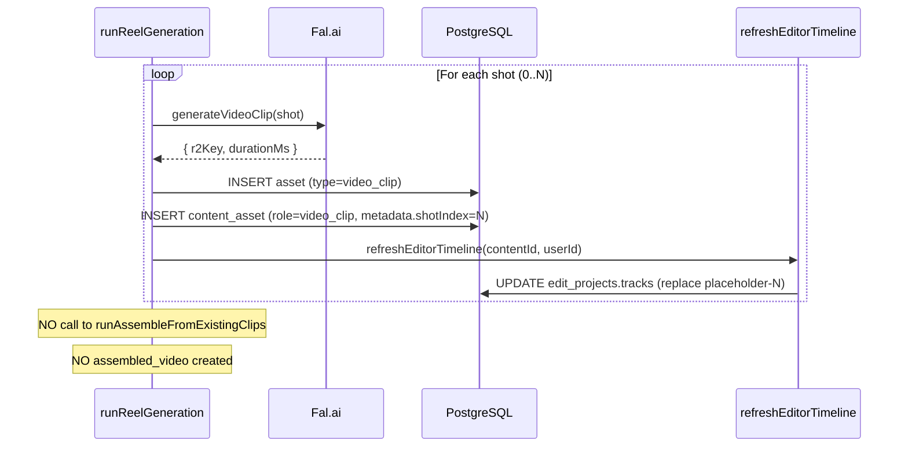

# LLD: Editor as Production Core

**Status:** Design — ready for implementation
**Date:** 2026-03-22
**Depends on:** [`HLD.md`](./HLD.md)

---

## 1. Database Schema Changes

### 1a. Add `auto_title` to `edit_projects`

```typescript
// backend/src/infrastructure/database/drizzle/schema.ts
export const editProjects = pgTable("edit_project", {
  // ... existing columns ...
  autoTitle: boolean("auto_title").notNull().default(true), // NEW
});
```

Migration: `bun db:generate && bun db:migrate`

**Behaviour:** Set to `true` on auto-created projects. Set to `false` when the user renames the project via `PATCH /api/editor/:id { title: "..." }`. When `autoTitle === true`, `buildInitialTimeline` and `refreshEditorTimeline` are allowed to update the title.

**Migration note for existing rows:** The `DEFAULT true` fills all existing rows with `true`. This is wrong for projects where the user has already manually set a title. The migration must set `autoTitle = false` for any `edit_project` row whose `title` does not match the `generatedHook` of its associated `generated_content`:

```sql
UPDATE edit_project ep
SET auto_title = false
FROM generated_content gc
WHERE ep.generated_content_id = gc.id
  AND ep.title IS DISTINCT FROM gc.generated_hook;
```

### 1b. Placeholder clip shape (no schema change — JSONB)

Placeholder clips are stored inside the existing `edit_projects.tracks` JSONB column. Add `isPlaceholder`, `placeholderShotIndex`, `placeholderLabel`, and `placeholderStatus` fields to the existing `Clip` TypeScript type:

```typescript
// frontend/src/features/editor/types/editor.ts
export interface Clip {
  id: string;
  assetId: string | null;       // null for placeholders
  startMs: number;
  durationMs: number;
  trimStartMs: number;
  trimEndMs: number;
  // ... existing fields ...

  // NEW — placeholder fields (undefined on real clips)
  isPlaceholder?: true;
  placeholderShotIndex?: number;   // stable identifier — survives reordering
  placeholderLabel?: string;       // shot description shown in UI
  placeholderStatus?: "pending" | "generating" | "failed"; // per-slot generation state

  // NEW — local-only edit tracking (never persisted to DB)
  locallyModified?: boolean;  // set to true by any user edit dispatch; prevents server merge from overwriting
}
```

`placeholderStatus` is persisted in the JSONB tracks so the backend can update it (e.g., mark a shot as `"generating"` when Fal.ai starts, `"failed"` if it errors). `locallyModified` is a frontend-only flag — it is stripped before any `PATCH /api/editor/:id` auto-save.

No DB migration needed — JSONB accepts any shape.

---

## 2. New Backend Service: `refreshEditorTimeline`

**File:** `backend/src/routes/editor/services/refresh-editor-timeline.ts` (new file)

This function is called after any asset is created for a content item (clip generated, voiceover generated, music attached). It updates the editor project's tracks to replace placeholders with real assets and add/update audio tracks.

**Important — race condition prevention:** Multiple clips can finish generating within milliseconds of each other. A naive read-modify-write (read tracks → merge → write) will corrupt data: two concurrent calls read the same stale tracks, each applies only its own change, and the later write overwrites the earlier one. The entire operation must run inside a transaction with a row-level lock.

**Important — chain root lookup:** When `iterate_content` creates v2, the editor project is updated to `generatedContentId = v2.id`. Querying by chain root (v1) will find nothing. The query must walk the content ID chain by querying across all IDs in the parent chain — or better, use a stable `chainRootContentId` column. For now, query by the content ID directly (not the chain root), matching the most-recent `generatedContentId` on the project.

```typescript
export async function refreshEditorTimeline(
  contentId: number,
  userId: string,
  options?: { placeholderStatus?: "pending" | "generating" | "failed"; shotIndex?: number },
): Promise<void> {
  await db.transaction(async (tx) => {
    // 1. Find the editor project for this content ID (or any ancestor in the chain).
    //    Use SELECT FOR UPDATE to prevent concurrent writes from corrupting tracks.
    //    Walk the parent chain: collect all content IDs from this version back to root.
    const chain = await resolveContentChain(contentId, userId); // returns [contentId, parentId, grandparentId, ...]
    const [project] = await tx
      .select()
      .from(editProjects)
      .where(
        and(
          eq(editProjects.userId, userId),
          inArray(editProjects.generatedContentId, chain),
        ),
      )
      .for("update")   // row-level lock — prevents concurrent refreshes from racing
      .limit(1);

    if (!project) return; // no editor project yet — nothing to refresh

    // 2. Load all current assets for this content version
    const assetRows = await tx
      .select({
        id: assets.id,
        role: contentAssets.role,
        durationMs: assets.durationMs,
        r2Key: assets.r2Key,
        metadata: assets.metadata,
      })
      .from(contentAssets)
      .innerJoin(assets, eq(contentAssets.assetId, assets.id))
      .where(eq(contentAssets.generatedContentId, contentId));

    const videoClips = assetRows.filter((a) => a.role === "video_clip");
    const voiceover = assetRows.find((a) => a.role === "voiceover");
    const music = assetRows.find((a) => a.role === "background_music");

    // 3. Merge real assets into current tracks
    const currentTracks = project.tracks as Track[];
    const updatedTracks = mergePlaceholdersWithRealClips(
      currentTracks,
      videoClips,
      voiceover,
      music,
      options,
    );

    // 4. Persist within the same transaction
    await tx
      .update(editProjects)
      .set({ tracks: updatedTracks })
      .where(eq(editProjects.id, project.id));
  });
}

/**
 * Resolves the full content ID chain for a given content version,
 * walking parent_id links back to the root. Returns [contentId, parentId, ...].
 */
async function resolveContentChain(contentId: number, userId: string): Promise<number[]> {
  const chain: number[] = [contentId];
  let currentId = contentId;
  while (true) {
    const [row] = await db
      .select({ parentId: generatedContent.parentId })
      .from(generatedContent)
      .where(and(eq(generatedContent.id, currentId), eq(generatedContent.userId, userId)))
      .limit(1);
    if (!row?.parentId) break;
    chain.push(row.parentId);
    currentId = row.parentId;
  }
  return chain;
}
```

### `mergePlaceholdersWithRealClips`

```typescript
function mergePlaceholdersWithRealClips(
  currentTracks: Track[],
  videoClips: AssetRow[],
  voiceover: AssetRow | undefined,
  music: AssetRow | undefined,
  options?: { placeholderStatus?: "pending" | "generating" | "failed"; shotIndex?: number },
): Track[] {
  return currentTracks.map((track) => {
    // ── Video track: replace placeholders by shotIndex ──
    if (track.type === "video") {
      const updatedClips = track.clips.map((clip) => {
        if (!clip.isPlaceholder) return clip; // already real, keep as-is

        // Apply status update if this call is for a specific shot (e.g., "generating")
        if (
          options?.placeholderStatus &&
          (options.shotIndex === undefined || options.shotIndex === clip.placeholderShotIndex)
        ) {
          clip = { ...clip, placeholderStatus: options.placeholderStatus };
        }

        const shotIndex = clip.placeholderShotIndex ?? 0;
        const realAsset = videoClips.find(
          (a) => (a.metadata as { shotIndex?: number })?.shotIndex === shotIndex,
        );
        if (!realAsset) return clip; // not generated yet, keep placeholder (with updated status)
        return {
          ...clip,
          assetId: realAsset.id,
          durationMs: realAsset.durationMs ?? clip.durationMs,
          trimEndMs: realAsset.durationMs ?? clip.trimEndMs,
          isPlaceholder: undefined,
          placeholderShotIndex: undefined,
          placeholderLabel: undefined,
          placeholderStatus: undefined,
        };
      });
      return { ...track, clips: updatedClips };
    }

    // ── Audio track: replace voiceover (wipe existing voiceover clips, insert current) ──
    // NOTE: Do not check by ID — a regenerated voiceover has a new ID and must replace the old one.
    // Filter out any clips that are not backed by a current content_asset before inserting.
    if (track.type === "audio") {
      if (!voiceover) return track;
      // Remove any existing voiceover clips (any clip on the audio track whose role was voiceover),
      // then insert the current voiceover. This prevents duplicate clips on regeneration.
      const nonVoiceoverClips = track.clips.filter((c) => !c.id.startsWith("voiceover-"));
      return {
        ...track,
        clips: [
          ...nonVoiceoverClips,
          {
            id: `voiceover-${voiceover.id}`,
            assetId: voiceover.id,
            startMs: 0,
            durationMs: voiceover.durationMs ?? 0,
            trimStartMs: 0,
            trimEndMs: voiceover.durationMs ?? 0,
            volume: 1.0,
          },
        ],
      };
    }

    // ── Music track: replace music clip (same wipe-and-replace pattern as voiceover) ──
    if (track.type === "music") {
      if (!music) return track;
      const nonMusicClips = track.clips.filter((c) => !c.id.startsWith("music-"));
      return {
        ...track,
        clips: [
          ...nonMusicClips,
          {
            id: `music-${music.id}`,
            assetId: music.id,
            startMs: 0,
            durationMs: music.durationMs ?? 0,
            trimStartMs: 0,
            trimEndMs: music.durationMs ?? 0,
            volume: 0.3,
          },
        ],
      };
    }

    return track;
  });
}
```

---

## 3. Updated `buildInitialTimeline`

**File:** `backend/src/routes/editor/services/build-initial-timeline.ts`

Add placeholder clip generation from the script. The function now has two phases:

**Phase 1 — parse script shots into placeholder clips:**

`parseScriptShots` must be moved to `src/shared/services/parse-script-shots.ts` — it is now used by both the editor and video routes. Importing across route directories creates a fragile cross-route dependency.

```typescript
import { parseScriptShots } from "../../shared/services/parse-script-shots";

// After fetching content row:
let shots = content.generatedScript
  ? parseScriptShots(content.generatedScript)
  : [];

// Guard: if the script exists but parseScriptShots returns empty (malformed AI output),
// fall back to a single placeholder using the hook text so the timeline is never blank.
if (shots.length === 0) {
  if (content.generatedScript) {
    // Log the failure so the format mismatch is visible and can be fixed
    console.warn(`[buildInitialTimeline] parseScriptShots returned 0 shots for contentId=${content.id}. Falling back to hook placeholder.`);
  }
  shots = [{ description: content.generatedHook ?? "Shot 1", estimatedDurationMs: 5000 }];
}

const placeholderClips: Clip[] = shots.map((shot, i) => ({
  id: `placeholder-shot-${i}`,
  assetId: null,
  isPlaceholder: true,
  placeholderShotIndex: i,
  placeholderLabel: shot.description,
  placeholderStatus: "pending" as const,
  startMs: shots.slice(0, i).reduce((sum, s) => sum + (s.estimatedDurationMs ?? 5000), 0),
  durationMs: shot.estimatedDurationMs ?? 5000,
  trimStartMs: 0,
  trimEndMs: shot.estimatedDurationMs ?? 5000,
}));
```

**Phase 2 — overlay real assets (same logic as `mergePlaceholdersWithRealClips` above):**
- For any `video_clip` assets already in `content_assets`, replace the matching placeholder.
- Place voiceover on audio track if it exists.
- Place music on music track if it exists.

**Result:** The function always returns a meaningful timeline, even for brand-new content with no assets.

---

## 4. Updated `POST /api/editor` Handler

**File:** `backend/src/routes/editor/index.ts`

In the upsert path (existing project found), update title if `autoTitle === true`:

```typescript
if (existing) {
  const { tracks, durationMs } = await buildInitialTimeline(generatedContentId, auth.user.id);

  // Only update title if it was auto-assigned and we have a new hook
  const titleUpdate = existing.autoTitle && content?.generatedHook
    ? { title: content.generatedHook.slice(0, 60) }
    : {};

  const [updated] = await db
    .update(editProjects)
    .set({ generatedContentId, tracks, durationMs, ...titleUpdate })
    .where(eq(editProjects.id, existing.id))
    .returning();

  return c.json({ project: updated }, 200);
}
```

On INSERT (new project):

```typescript
const [project] = await db
  .insert(editProjects)
  .values({
    userId: auth.user.id,
    title: content?.generatedHook?.slice(0, 60) ?? title ?? "Untitled Edit",
    autoTitle: !title,   // auto-titled if no explicit title was passed
    generatedContentId: generatedContentId ?? null,
    tracks,
    durationMs,
    fps: 30,
    resolution: "1080x1920",
    status: "draft",
  })
  .returning();
```

---

## 5. Updated `PATCH /api/editor/:id`

When the user updates the title, set `autoTitle = false` — but **only if the title actually changed**. Setting it unconditionally locks out auto-update even when the user confirms without changing anything (e.g., clicked rename, pressed Enter immediately):

```typescript
const updates: Partial<EditProject> = {};
if (body.title !== undefined) {
  updates.title = body.title;
  // Only disable auto-title if the user genuinely changed it
  if (body.title !== existing.title) {
    updates.autoTitle = false;
  }
}
// ... rest of patch logic
```

---

## 6. Updated `runReelGeneration` — Remove Auto-Assembly

**File:** `backend/src/routes/video/index.ts`

**Remove** the call to `runAssembleFromExistingClips` at the end of `runReelGeneration`.

**Add** a call to `refreshEditorTimeline` after each clip is generated:

```typescript
// Inside the per-shot loop:

// 1. Mark the placeholder as "generating" before the Fal.ai call
await refreshEditorTimeline(generatedContentId, userId, {
  placeholderStatus: "generating",
  shotIndex: shotIndex,
}).catch((err) => logger.warn("refreshEditorTimeline (pre-generate) failed", { err, contentId: generatedContentId, shotIndex }));

// 2. Generate the clip
const result = await generateVideoClip(shot);

if (!result.ok) {
  // Mark the placeholder as "failed" so the user sees it and can act
  await refreshEditorTimeline(generatedContentId, userId, {
    placeholderStatus: "failed",
    shotIndex: shotIndex,
  }).catch((err) => logger.warn("refreshEditorTimeline (on-failure) failed", { err }));
  continue; // move to next shot
}

// 3. Insert asset + content_asset rows
await insertClipAsset(result, generatedContentId, userId, shotIndex);

// 4. Replace placeholder with real clip
await refreshEditorTimeline(generatedContentId, userId).catch((err) =>
  logger.warn("refreshEditorTimeline (post-generate) failed", { err, contentId: generatedContentId, shotIndex }),
);
```

**Error handling:** `refreshEditorTimeline` failures are **logged, not silently swallowed**. The `placeholderStatus: "failed"` update ensures the user sees a visible failure state in the editor (the slot shows "Failed" with an option to manually replace). If the timeline refresh itself fails (DB issue), the clip still exists in `content_assets` — the user can trigger a manual refresh via a "Sync timeline" button.

Also call `refreshEditorTimeline` after voiceover and music are attached (in their respective generation handlers), using the same `.catch(logger.warn)` pattern.



---

## 7. Updated `runVoiceoverGeneration`

**File:** wherever voiceover is generated (TTS endpoint)

After the voiceover asset is inserted into `content_assets`, call:

```typescript
await refreshEditorTimeline(generatedContentId, userId).catch(() => {});
```

---

## 8. Remove `assembled_video` from MediaPanel

**File:** `backend/src/routes/editor/index.ts` — the `GET /api/assets` endpoint (used by MediaPanel)

Add a filter to exclude `assembled_video` and `final_video` roles:

```typescript
.where(
  and(
    eq(contentAssets.generatedContentId, generatedContentId),
    notInArray(contentAssets.role, ["assembled_video", "final_video"]),
  ),
)
```

---

## 9. Delete `runAssembleFromExistingClips` and `upsertAssembledAsset`

**File:** `backend/src/routes/video/index.ts`

Remove:
- `runAssembleFromExistingClips` function
- `upsertAssembledAsset` function
- `POST /api/video/assemble` endpoint (if it exclusively triggers auto-assembly)
- `mixAssemblyAudio` (used only by `runAssembleFromExistingClips`)
- `createAssCaptions` (simple version used only by `runAssembleFromExistingClips`)

The editor export's `generateASS` (in `export/ass-generator.ts`) is the canonical caption renderer and stays.

---

## 10. Frontend: Placeholder Clip Rendering in Timeline

**File:** `frontend/src/features/editor/components/TimelineClip.tsx` (or equivalent)

Render placeholder clips differently from real clips:

```tsx
if (clip.isPlaceholder) {
  return (
    <div
      className={cn(
        "absolute top-0 h-full rounded border-2 border-dashed border-overlay-lg",
        "bg-overlay-xs flex items-center justify-center overflow-hidden",
      )}
      style={{ left: leftPx, width: widthPx }}
    >
      <div className="flex items-center gap-1.5 px-2">
        <Loader2 className="h-3 w-3 animate-spin text-dim-3 shrink-0" />
        <span className="text-xs text-dim-3 truncate">{clip.placeholderLabel}</span>
      </div>
    </div>
  );
}
```

When `clip.isPlaceholder` is falsy, render the existing real clip UI unchanged.

---

## 11. Frontend: Editor Timeline Polling

**File:** `frontend/src/features/editor/components/EditorLayout.tsx`

The editor currently loads the project once on mount. Add exponential back-off polling **only while any placeholder clips remain** on the video track. A flat 3-second interval produces 60–180 requests over a typical generation session with no back-off under failures; exponential back-off avoids hammering the server.

```typescript
const hasPlaceholders = store.state.tracks
  .find((t) => t.type === "video")
  ?.clips.some((c) => c.isPlaceholder) ?? false;

// Exponential back-off: 2s → 4s → 8s → cap at 15s
const [pollInterval, setPollInterval] = useState(2000);
useEffect(() => {
  if (!hasPlaceholders) {
    setPollInterval(2000); // reset for next time
  }
}, [hasPlaceholders]);

const { data: projectData } = useQuery({
  queryKey: queryKeys.api.editorProject(project.id),
  queryFn: () => fetcher(`/api/editor/${project.id}`),
  refetchInterval: hasPlaceholders ? pollInterval : false,
  onSuccess: () => setPollInterval((prev) => Math.min(prev * 2, 15000)),
});

// When fresh data arrives, merge tracks into local state:
useEffect(() => {
  if (!projectData) return;
  store.dispatch({ type: "MERGE_TRACKS_FROM_SERVER", tracks: projectData.tracks });
}, [projectData?.tracks]);
```

**Alternative preferred:** Wire the existing per-shot progress data from `use-video-job.ts` (which already polls at 2-second intervals) into the placeholder status display, and use it to trigger targeted track refreshes. This avoids a separate polling loop entirely.

### `MERGE_TRACKS_FROM_SERVER` reducer — exact algorithm

The reducer must be specified precisely to avoid overwriting user edits:

```typescript
case "MERGE_TRACKS_FROM_SERVER": {
  const serverTracks = action.tracks as Track[];
  return {
    ...state,
    tracks: state.tracks.map((localTrack) => {
      const serverTrack = serverTracks.find((t) => t.type === localTrack.type);
      if (!serverTrack) return localTrack;

      if (localTrack.type === "video") {
        // For video track: replace placeholder clips with real clips from server,
        // matching by placeholderShotIndex. NEVER touch clips where locallyModified=true.
        const updatedClips = localTrack.clips.map((localClip) => {
          if (localClip.locallyModified) return localClip; // user edited this — don't overwrite

          if (localClip.isPlaceholder) {
            // Find the matching server clip for this shot
            const serverClip = serverTrack.clips.find(
              (sc) => sc.placeholderShotIndex === localClip.placeholderShotIndex,
            );
            // If server has a real clip for this slot, use it
            if (serverClip && !serverClip.isPlaceholder) return serverClip;
            // If server has an updated placeholder status, apply just the status
            if (serverClip?.placeholderStatus !== localClip.placeholderStatus) {
              return { ...localClip, placeholderStatus: serverClip?.placeholderStatus };
            }
          }
          return localClip;
        });
        return { ...localTrack, clips: updatedClips };
      }

      if (localTrack.type === "audio" || localTrack.type === "music") {
        // For audio/music: only update if the user hasn't locally modified the track's clips.
        // If any clip in the track is locallyModified, leave the entire track alone.
        const hasLocalEdits = localTrack.clips.some((c) => c.locallyModified);
        if (hasLocalEdits) return localTrack;
        return serverTrack; // replace with server version (handles voiceover/music swaps)
      }

      return localTrack;
    }),
  };
}
```

Any reducer action that changes a clip's `trimStartMs`, `trimEndMs`, `volume`, `startMs`, or `durationMs` must set `locallyModified: true` on that clip. The `locallyModified` flag is stripped from the payload before `PATCH /api/editor/:id` auto-saves (it is never persisted to the DB).

---

## 12. Frontend: Rename "Generate Reel" → "Generate Clips"

**File:** `frontend/src/features/video/components/VideoWorkspacePanel.tsx`

- Button label: "Generate Clips" (update i18n key)
- After generation completes, show: "Clips ready — open in Editor" with a link to `/studio/editor?contentId=<id>`
- Remove any "assembled video preview" component that showed the auto-assembled output

**i18n keys to add** (`frontend/src/translations/en.json`):
```json
{
  "video_workspace_generate_clips": "Generate Clips",
  "video_workspace_clips_ready": "Clips ready — open in Editor",
  "video_workspace_open_editor": "Open in Editor"
}
```

---

## 13. Queue Pipeline Stages Update

**File:** `backend/src/routes/queue/index.ts` — `deriveStages` function

Update stage definitions to reflect the editor-centric flow:

| Stage | Old condition | New condition |
|---|---|---|
| Copy | hook exists | hook exists (unchanged) |
| Voiceover | voiceover asset exists | voiceover asset exists (unchanged) |
| Video Clips | video_clip count > 0 | video_clip count > 0 |
| Editor Ready | edit project exists | edit project exists AND no `pending`/`generating` placeholders remain (see below) |
| Export | latest export done | latest export done (unchanged) |
| Posted | queue status = posted | queue status = posted (unchanged) |

### "Editor Ready" definition

A placeholder clip blocks "Editor Ready" only if its `placeholderStatus` is `"pending"` or `"generating"`. A `"failed"` placeholder does **not** block the stage — the user has been shown the failure and can proceed by manually replacing the slot or exporting without it.

```typescript
// In deriveStages:
const hasBlockingPlaceholders = editProject.tracks
  .flatMap((t: Track) => t.clips)
  .some((c: Clip) =>
    c.isPlaceholder &&
    (c.placeholderStatus === "pending" || c.placeholderStatus === "generating"),
  );

stages.editorReady = editProject !== null && !hasBlockingPlaceholders;
```

This prevents the "Editor Ready" stage from being permanently blocked when one shot in a six-shot generation fails. The user sees the failed slot, can decide to skip it, and the queue continues to the export stage.

---

## 14. AI Tool Contracts

Each AI tool has a defined contract for what it does and does not do.

### `save_content`
- **Writes:** `generated_content` (v1), `queue_item`
- **Side-effect:** calls `POST /api/editor` → creates editor project with placeholder clips
- **Does NOT:** generate any assets

### `iterate_content`
- **Writes:** `generated_content` (v2+, with `parentId`)
- **Side-effect:** calls `POST /api/editor` → rebuilds editor project with new placeholder clips from the new script
- **Does NOT:** carry over existing clips from the previous version. The new script defines new shots.
- **Condition to invoke:** the AI should only call `iterate_content` when the hook, script, or caption meaningfully changes. Tweaks to punctuation or minor wording do not warrant a version.

### `generate_clips`
- **Writes:** `asset` + `content_asset` rows (role=`video_clip`) for the CURRENT content version
- **Side-effect:** calls `refreshEditorTimeline` after each clip — replaces matching placeholder
- **Does NOT:** create a new `generated_content` row. Does NOT call `runAssembleFromExistingClips`.

### `generate_voiceover`
- **Writes:** `asset` + `content_asset` (role=`voiceover`) for the CURRENT content version
- **Replaces** any existing voiceover asset for this content ID before inserting
- **Side-effect:** calls `refreshEditorTimeline` → upserts voiceover on audio track
- **Does NOT:** create a new `generated_content` row

### `attach_music`
- **Writes:** `content_asset` (role=`background_music`) for the CURRENT content version
- **Replaces** any existing music attachment
- **Side-effect:** calls `refreshEditorTimeline` → upserts music clip on music track
- **Does NOT:** create a new `generated_content` row

### Future: `generate_captions`
- **Writes:** caption word timing data (TBD — likely a `content_captions` table)
- **Side-effect:** calls `refreshEditorTimeline` → populates text track with timed caption clips
- Not in scope for this phase

---

## 15. Versioning Implementation Rules

The versioning boundary is enforced at the backend. The rules are:

```typescript
// Conditions that MUST use iterate_content (creates a new generated_content row)
const shouldCreateNewVersion = (
  existingContent: GeneratedContent,
  proposedChanges: Partial<GeneratedContent>
): boolean => {
  const textFields: (keyof GeneratedContent)[] = [
    "generatedHook",
    "generatedScript",
    "generatedCaption",
    "cleanScriptForAudio",
    "sceneDescription",
  ];
  return textFields.some(
    (field) =>
      proposedChanges[field] !== undefined &&
      proposedChanges[field] !== existingContent[field],
  );
};

// Conditions that MUST use asset replacement (no new generated_content row)
// - regenerating video clips → update content_assets in-place, call refreshEditorTimeline
// - regenerating voiceover → delete old, insert new, call refreshEditorTimeline
// - swapping music → delete old, insert new, call refreshEditorTimeline
// - changing clip order/trim in editor → update edit_projects.tracks only (auto-save)
// - exporting → writes to export_jobs only
```

**Enforcement:** The AI `iterate_content` tool is the only code path that creates a new `generated_content` row during a chat session. Production tools (`generate_clips`, `generate_voiceover`, `attach_music`) do not call `iterate_content` and do not insert into `generated_content`.

---

## Build Sequence

```
Phase 1 — Schema & Core Services (no visible change to users)
  1. Move parseScriptShots to src/shared/services/parse-script-shots.ts
  2. Add autoTitle column to edit_projects → db:generate → db:migrate
     (migration sets autoTitle=false for existing rows where title ≠ hook)
  3. Update Clip TypeScript type (add isPlaceholder, placeholderShotIndex,
     placeholderLabel, placeholderStatus, locallyModified fields)
  4. Write refreshEditorTimeline service (with transaction + SELECT FOR UPDATE,
     resolveContentChain, wipe-and-replace for voiceover/music)
  5. Update buildInitialTimeline: placeholder clips from script + empty-result guard
     + placeholderStatus="pending" on each placeholder
  6. Update POST /api/editor: title from hook + autoTitle flag
  7. Update PATCH /api/editor: set autoTitle=false only when title actually changes

Phase 2 — Backend Decoupling (OLD ASSEMBLY CODE STAYS ALIVE)
  8. Update runReelGeneration: call refreshEditorTimeline per shot (pre=generating,
     post=replaced, error=failed) instead of runAssembleFromExistingClips
  9. Update voiceover + music generation handlers: call refreshEditorTimeline after insert
  10. Filter assembled_video from MediaPanel asset fetch
  11. Update convertAIResponseToTracks (AI Assembly fills audio + text tracks)

Phase 3 — Editor UI (ships atomically with Phase 2 backend deploy)
  12. Update TimelineClip to render placeholder slots with Queued/Generating/Failed states
  13. Add MERGE_TRACKS_FROM_SERVER reducer (matches by placeholderShotIndex,
      respects locallyModified flag, strips locallyModified before auto-save)
  14. Add exponential back-off polling in EditorLayout while placeholders exist
  15. Rename "Generate Reel" → "Generate Clips", update post-generation UI
  16. Add confirmation dialog before timeline rebuild on script iteration

Phase 4 — Delete Old Code + Queue (only after Phase 3 verified end-to-end)
  17. Run data migration: create synthetic export_job rows for all existing
      assembled_video content_assets so existing queue items can still publish
  18. Remove runAssembleFromExistingClips, upsertAssembledAsset,
      mixAssemblyAudio, createAssCaptions
  19. Remove or rewire assemble_video AI chat tool in chat-tools.ts
      (MUST be done atomically with step 18 — tool crashes if function is gone)
  20. Remove POST /api/video/assemble endpoint
  21. Update deriveStages: Editor Ready = no pending/generating placeholders
      (failed placeholders are non-blocking)
```

**Critical ordering constraint:** Steps 18 and 19 must deploy in the same release. Deleting `runAssembleFromExistingClips` while the `assemble_video` chat tool definition still exists causes a runtime crash for any active chat session that invokes the tool.

---

## Edge Cases

| Scenario | Handling |
|---|---|
| User opens editor before clicking "Generate Clips" | Placeholder clips show with `placeholderStatus="pending"` → rendered as "Queued" in the UI. User sees the planned structure. |
| User manually reorders placeholder clips before real clips arrive | `refreshEditorTimeline` uses `placeholderShotIndex` (stable ID) to match by shot index, not by position in array. Reorder is preserved. |
| `refreshEditorTimeline` is called but no editor project exists yet | Function returns early inside the transaction. No error. Editor project will be created on next `POST /api/editor`. |
| Clip generation fails for one shot | Placeholder's `placeholderStatus` is updated to `"failed"`. Other shots proceed. The `"failed"` placeholder does NOT block the "Editor Ready" queue stage. User sees a visible "Failed" slot and can manually replace it. |
| User has rearranged real clips in the editor when a new voiceover arrives | `MERGE_TRACKS_FROM_SERVER` checks `locallyModified` flag on audio track clips. If any clip in the audio track is `locallyModified`, the track is left untouched. The server-side refresh still updates `edit_projects.tracks` in the DB, but the frontend's local state is protected. |
| User regenerates voiceover (new asset ID) | Old voiceover clip in tracks is replaced by filtering on `id.startsWith("voiceover-")` and reinserting the new one. No duplicate clips. |
| User swaps background music (new asset ID) | Same wipe-and-replace pattern as voiceover. No duplicate music clips. |
| Two concurrent requests to `refreshEditorTimeline` for the same project | Handled by `SELECT FOR UPDATE` inside a transaction. The second call blocks until the first commits, then reads the already-updated tracks. Correctly serialized — no stale overwrite. |
| `refreshEditorTimeline` fails (DB connection error) | Error is logged with context (not swallowed). Placeholder shows most recent status. Clip still exists in `content_assets`. User can trigger re-sync via a "Sync timeline" button that calls `GET /api/editor/:id` and triggers `MERGE_TRACKS_FROM_SERVER`. |
| `iterate_content` creates v2; `refreshEditorTimeline(v2.id)` is called | `resolveContentChain` returns `[v2.id, v1.id]`. Query uses `inArray(editProjects.generatedContentId, [v2.id, v1.id])` and finds the project regardless of which version ID it currently stores. |
| `parseScriptShots` returns empty array (malformed script) | Guard in `buildInitialTimeline` falls back to a single placeholder using the hook text. Warning logged. Timeline is never blank. |
| User renames project to same title, then script iterates | `autoTitle` is only set to `false` when `body.title !== existing.title`. If the user confirmed without changing, `autoTitle` stays `true` and the next iteration still updates the title correctly. |
| Existing users' content has `assembled_video` in `content_assets` but no `export_job` | Phase 4 data migration creates synthetic `export_job` rows so their queue items can pass the publish gate. MediaPanel filter already excludes these from source media (ships in Phase 2). |
| `assemble_video` chat tool invoked after Phase 4 (function deleted) | Not possible — the tool definition is removed in the same Phase 4 deployment as the function deletion. Both must be atomic. |

---

## Files Changed Summary

| File | Change |
|---|---|
| `backend/src/infrastructure/database/drizzle/schema.ts` | Add `autoTitle` boolean to `editProjects` |
| `backend/src/infrastructure/database/drizzle/migrations/` | Migration: add `auto_title` column; set `false` for existing rows where title ≠ hook |
| `backend/src/shared/services/parse-script-shots.ts` | **Moved from** `routes/video/services/` — now shared across editor and video routes |
| `backend/src/routes/editor/services/build-initial-timeline.ts` | Generate placeholder clips from script; empty-result guard; `placeholderStatus="pending"` |
| `backend/src/routes/editor/services/refresh-editor-timeline.ts` | **New file** — transaction + SELECT FOR UPDATE; resolveContentChain; wipe-and-replace audio/music |
| `backend/src/routes/editor/index.ts` | POST: title from hook + autoTitle; PATCH: autoTitle=false only when title changes; MediaPanel: filter assembled_video |
| `backend/src/routes/video/index.ts` | Remove auto-assembly call; call refreshEditorTimeline per shot (pre/post/error); delete runAssembleFromExistingClips + helpers (Phase 4) |
| `backend/src/routes/queue/index.ts` | Update `deriveStages`: Editor Ready = no pending/generating placeholders; failed = non-blocking |
| `backend/src/chat-tools.ts` | Remove `assemble_video` tool definition (Phase 4, atomic with function deletion) |
| `frontend/src/features/editor/types/editor.ts` | Add `isPlaceholder`, `placeholderShotIndex`, `placeholderLabel`, `placeholderStatus`, `locallyModified` to `Clip` |
| `frontend/src/features/editor/components/EditorLayout.tsx` | Exponential back-off polling; dispatch MERGE_TRACKS_FROM_SERVER; script-iteration confirmation dialog |
| `frontend/src/features/editor/hooks/useEditorStore.ts` | `MERGE_TRACKS_FROM_SERVER` reducer (placeholderShotIndex matching, locallyModified protection, strip locallyModified before save) |
| `frontend/src/features/editor/components/TimelineClip.tsx` | Render placeholder slot UI with Queued/Generating/Failed states |
| `frontend/src/features/video/components/VideoWorkspacePanel.tsx` | Rename button; post-generation CTA points to editor |
| `frontend/src/translations/en.json` | Add generate_clips, clips_ready, open_editor, placeholder_queued, placeholder_generating, placeholder_failed, iteration_confirm keys |
