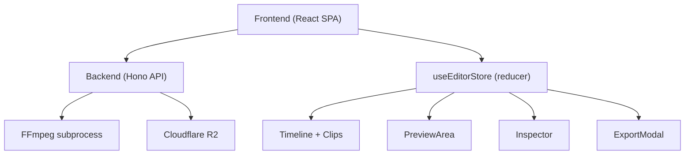

# HLD + LLD: Editor Audit Fix Plan

*Date: 2026-03-28*
*Scope: All 23 items in `docs/research/editor-preview-audit.md`*
*Source audit: BUG-001–005, UX-001/002/004–010, MISSING-001–005, DATA-001–003*

---

## Status Snapshot (Updated 2026-04-04)

This document predates the current editor refactor and should now be read as a **historical backlog plus remaining gap list**, not a file-by-file implementation script.

Several items originally planned here have already landed in the current codebase:

- `BUG-002` is fixed in `frontend/src/features/editor/hooks/useEditorLayoutMutations.ts` via `aiAssemble.onError`.
- `BUG-004` and `BUG-005` are fixed in `frontend/src/features/editor/components/ExportModal.tsx`.
- `UX-006` and most of `UX-007` are covered by the refactored inspector structure in `frontend/src/features/editor/components/Inspector.tsx` and `frontend/src/features/editor/components/inspector/*`.
- `UX-008` is landed via `formatHHMMSSd()` and its usage in `frontend/src/features/editor/components/PreviewArea.tsx`.
- `MISSING-001` and `MISSING-002` are largely landed through `Timeline.tsx`, `TimelineClip.tsx`, and `use-timeline-asset-drop.ts`.

Because of that, the current ownership map is different from the one assumed below:

| Old ownership assumption | Current ownership area |
|---|---|
| `EditorLayout.tsx` monolith | `EditorToolbar.tsx`, `EditorDialogs.tsx`, `useEditorLayoutRuntime.ts`, `useEditorLayoutMutations.ts` |
| `Inspector.tsx` only | `Inspector.tsx` plus `components/inspector/*` |
| Timeline drag/drop logic inline | `Timeline.tsx`, `TimelineClip.tsx`, `use-timeline-asset-drop.ts` |

Use this updated ownership map when executing any unfinished items from the rest of the plan.

## Overview

The editor has 23 confirmed defects across four categories: critical bugs that lose user data, UX regressions that produce silent failures, missing spec features, and state management inconsistencies. This document describes a phased fix plan. Each phase is independently shippable with no cross-phase dependencies, so they can be parallelized if needed.

No new abstractions are introduced. Every fix extends existing patterns: mutations gain `onError`, reducers gain proper pushes to the undo stack, components get `t()` calls that already exist in other parts of the file.

---

## System Context



---

## Phase Summary

| Phase | Issues | Description | Files touched |
|---|---|---|---|
| 1 | BUG-001–005 | Critical bugs: export data loss, silent failures, disconnected state | `backend/src/routes/editor/index.ts`, `ExportModal.tsx`, `EditorLayout.tsx` |
| 2 | UX-001/002/004/005/009/010 | Preview & export UX polish | `PreviewArea.tsx`, `ExportModal.tsx`, `ResolutionPicker.tsx`, `EditorLayout.tsx` |
| 3 | UX-006/007/008 | Inspector correctness & i18n | `Inspector.tsx`, `timecode.ts`, `en.json` |
| 4 | MISSING-001/002/003/004/005 | Missing spec features | `Timeline.tsx`, `TimelineClip.tsx`, `MediaPanel.tsx`, `ResolutionPicker.tsx`, `EditorLayout.tsx` |
| 5 | DATA-001–003 | State management fixes | `useEditorStore.ts` |

---

## Phase 1: Critical Bugs

### BUG-001: Export ignores all video tracks beyond the first

**Root cause (exact location):** `backend/src/routes/editor/index.ts:1113`
```typescript
// WRONG — drops every clip on Video 2, Video 3, etc.
const videoTrack = tracks.find((t) => t.type === "video");
```
The entire filtergraph downstream — trim/scale per clip (line 1183), xfade join (line 1231–1262), transition lookup (line 1218) — is built from `videoTrack.clips` and `videoTrack.transitions`. Any clips on secondary video tracks are silently excluded.

**Fix design:**

The correct semantic is: all video tracks are composited in z-order (track 0 = bottom). Clips within each track play at their absolute `startMs` positions; tracks are then overlaid on top of each other. However, the current xfade pipeline sequences clips with accumulated duration rather than placing them at absolute time positions.

**Practical v1 approach (no overlay compositing):**
Collect all video tracks sorted by their index in the tracks array. Merge all their clips into a single sorted-by-`startMs` flat list and feed that through the existing single-track pipeline. Merge their transitions similarly. This preserves the existing sequential model and eliminates the data loss while avoiding a full rewrite of the FFmpeg filtergraph.

**Filtergraph approach for true multi-track compositing (v2 — future):**
Build one joined stream per track (per existing xfade logic), then chain `overlay` filters bottom-up. Not required for the bug fix, but described here so future work doesn't invent a new approach.

**LLD — backend changes:**

File: `backend/src/routes/editor/index.ts`

```typescript
// Replace lines 1113–1126 with:

// Collect ALL video tracks in array order (index 0 = bottom z-layer)
const videoTracks = tracks.filter((t) => t.type === "video");
const audioTrack = tracks.find((t) => t.type === "audio" && !t.muted);
const musicTrack = tracks.find((t) => t.type === "music" && !t.muted);
const textTrack = tracks.find((t) => t.type === "text");

// Merge all video clips from all tracks, sorted by startMs (timeline order)
const allVideoClips = videoTracks
  .flatMap((t) => t.clips)
  .filter((c) => c.assetId && assetsMap[c.assetId])
  .sort((a, b) => a.startMs - b.startMs);

// Merge all transitions from all video tracks
const allVideoTransitions = videoTracks.flatMap((t) => t.transitions ?? []);

// Replace videoClips usages with allVideoClips
const videoClips = allVideoClips;
const videoTransitions = allVideoTransitions;  // replaces videoTrack?.transitions at line 1218
```

- Remove the `const videoTrack = ...` single-track reference.
- Replace `videoTrack?.transitions` at line 1218 with `videoTransitions`.
- The existing loop at lines 1183–1211 (trim/scale per clip) and join logic at lines 1220–1263 (xfade) work unmodified since they operate on `videoClips` and `videoTransitions` arrays.
- The check at line 1128 (`videoClips.length === 0`) remains correct.

**No schema changes. No migration needed.**

---

### BUG-002: AI Assemble fails silently on error

**Root cause:** `frontend/src/features/editor/components/EditorLayout.tsx:237–265`

The `aiAssemble` mutation has `onSuccess` but no `onError`. API errors (400 "No shot clips available", validation failures) are swallowed silently.

**LLD — EditorLayout.tsx:**

Find the `useMutation` call that drives `aiAssemble`. Add an `onError` handler immediately after the `onSuccess` block:

```typescript
onError: (err: unknown) => {
  const msg =
    err instanceof Error ? err.message : t("editor_ai_assemble_error");
  toast.error(msg);
},
```

Add i18n key to `en.json`:
```json
"editor_ai_assemble_error": "AI Assemble failed. Please try again."
```

The `toast` import already exists in EditorLayout (used in other mutations). No new dependencies.

---

### BUG-003: AI Assemble dropdown does not close on click-outside

**Root cause:** `frontend/src/features/editor/components/EditorLayout.tsx:964–996`

Custom dropdown using `showAiMenu` state + `onMouseLeave` instead of Radix `DropdownMenu`. `onMouseLeave` does not handle: clicking outside the menu, keyboard navigation, or touch devices.

**LLD — EditorLayout.tsx:**

Replace the custom `showAiMenu` state and the hand-rolled dropdown JSX with a Radix `DropdownMenu`. The `DropdownMenu` component is already imported in the file (used elsewhere in the toolbar).

```typescript
// Remove: const [showAiMenu, setShowAiMenu] = useState(false);
// Remove: the button + conditional div with onMouseLeave

// Replace with:
<DropdownMenu>
  <DropdownMenuTrigger asChild>
    <button
      disabled={isAiAssembling}
      className="flex items-center gap-1.5 bg-overlay-sm border border-overlay-md text-dim-1 text-sm font-semibold px-3 py-1.5 rounded-lg cursor-pointer hover:bg-overlay-md transition-colors disabled:opacity-60"
    >
      <Sparkles size={13} />
      {t("editor_ai_assemble")}
      <ChevronDown size={11} />
    </button>
  </DropdownMenuTrigger>
  <DropdownMenuContent align="end" className="min-w-[168px]">
    {[
      { platform: "tiktok", label: t("editor_ai_assemble_tiktok") },
      { platform: "youtube-shorts", label: t("editor_ai_assemble_youtube") },
      { platform: "instagram", label: t("editor_ai_assemble_instagram") },
    ].map(({ platform, label }) => (
      <DropdownMenuItem key={platform} onClick={() => aiAssemble(platform)}>
        {label}
      </DropdownMenuItem>
    ))}
  </DropdownMenuContent>
</DropdownMenu>
```

Radix `DropdownMenu` handles: focus management, keyboard navigation, click-outside dismissal, and touch events. No additional dependencies — these components are already in the project.

---

### BUG-004: Export modal swallows enqueue errors

**Root cause:** `frontend/src/features/editor/components/ExportModal.tsx:25–35`

The `enqueue` mutation has no `onError`. HTTP 429, 404, 500 from the backend are silently swallowed after the button returns to its default state.

**LLD — ExportModal.tsx:**

Add `onError` and local error state to the `enqueue` mutation:

```typescript
const [enqueueError, setEnqueueError] = useState<string | null>(null);

const { mutate: enqueue, isPending } = useMutation({
  mutationFn: () =>
    authenticatedFetchJson<{ exportJobId: string }>(
      `/api/editor/${projectId}/export`,
      { method: "POST", body: JSON.stringify({ resolution, fps }) }
    ),
  onSuccess: (data) => {
    setEnqueueError(null);
    setJobId(data.exportJobId);
  },
  onError: (err: unknown) => {
    const msg = err instanceof Error ? err.message : t("editor_export_enqueue_error");
    setEnqueueError(msg);
  },
});
```

Render the error below the Export button in the `!jobId` branch:
```tsx
{enqueueError && (
  <p className="text-xs text-error mt-2">{enqueueError}</p>
)}
```

Clear `enqueueError` when the user changes resolution or fps (call `setEnqueueError(null)` in both onChange handlers).

Add to `en.json`:
```json
"editor_export_enqueue_error": "Export request failed. Please try again."
```

---

### BUG-005: Export modal ignores current editor resolution and fps

**Root cause:** `frontend/src/features/editor/components/ExportModal.tsx:20–21`

```typescript
const [resolution, setResolution] = useState("1080x1920");  // hardcoded
const [fps, setFps] = useState<24 | 30 | 60>(30);           // hardcoded
```

The component only receives `projectId`, not the current `resolution` and `fps` from the editor store.

**LLD — two-file change:**

**ExportModal.tsx** — extend Props and use initializer pattern:
```typescript
interface Props {
  projectId: string;
  initialResolution: string;
  initialFps: 24 | 30 | 60;
  onClose: () => void;
}

export function ExportModal({ projectId, initialResolution, initialFps, onClose }: Props) {
  const [resolution, setResolution] = useState(initialResolution);
  const [fps, setFps] = useState<24 | 30 | 60>(initialFps);
  // ...
```

Note: `useState` with an initial value is not reactive — changes to `initialResolution` after mount don't update the state, which is the correct behavior (user may intentionally override the export resolution without changing the editor resolution).

**EditorLayout.tsx** — pass store values when rendering the modal:
```tsx
{showExportModal && (
  <ExportModal
    projectId={project.id}
    initialResolution={state.resolution}
    initialFps={state.fps as 24 | 30 | 60}
    onClose={() => setShowExportModal(false)}
  />
)}
```

The ExportModal's resolution picker options (`720x1280`, `1080x1920`, `1920x1080`) do not cover all possible editor resolutions (e.g., `2160x3840` 4K or `1080x1080` square). Add a fallback: if `initialResolution` is not in the button list, pre-select the closest match or add a "Custom" display.

**Resolution button list update in ExportModal.tsx** — add the missing options to match ResolutionPicker:
```typescript
const EXPORT_RESOLUTIONS = [
  { value: "720x1280", labelKey: "editor_export_resolution_720_portrait" },
  { value: "1080x1920", labelKey: "editor_export_resolution_1080_portrait" },
  { value: "2160x3840", labelKey: "editor_export_resolution_4k_portrait" },
  { value: "1920x1080", labelKey: "editor_export_resolution_1080_landscape" },
  { value: "1080x1080", labelKey: "editor_export_resolution_square" },
] as const;
```

Add to `en.json`:
```json
"editor_export_resolution_4k_portrait": "4K (2160×3840)",
"editor_export_resolution_square": "1:1 (1080×1080)"
```

---

## Phase 2: UX Fixes (Preview & Export Polish)

### UX-001: Remove misleading fps badge from preview footer

**Root cause:** `frontend/src/features/editor/components/PreviewArea.tsx:401`
```tsx
<span className="text-xs text-dim-3">
  {resW} × {resH} · {fps} fps   // ← fps here is always 30, not meaningful
</span>
```

**Fix:** Remove the `· {fps} fps` segment. Only display dimensions:
```tsx
<span className="text-xs text-dim-3">
  {resW} × {resH}
</span>
```

The timecode display at line 386 uses `formatHHMMSSFF(currentTimeMs, fps)` which is a separate concern and handled in Phase 3 (UX-008).

---

### UX-002: No visual feedback when changing resolution

**Root cause:** The `SET_RESOLUTION` dispatch in EditorLayout produces no visible acknowledgement. When switching between same-aspect-ratio options (e.g., 1080p → 4K), the preview looks identical.

**Fix:** In EditorLayout, in the `onChange` prop passed to `ResolutionPicker`, fire a toast after dispatching:

```typescript
const handleResolutionChange = (newResolution: string) => {
  store.setResolution(newResolution);
  const label = RESOLUTION_LABEL_MAP[newResolution] ?? newResolution;
  toast.success(t("editor_resolution_changed", { resolution: label }));
};
```

Define `RESOLUTION_LABEL_MAP` as a plain const object in EditorLayout (not a shared module — it's only used here):
```typescript
const RESOLUTION_LABEL_MAP: Record<string, string> = {
  "720x1280": "9:16 SD (720p)",
  "1080x1920": "9:16 HD (1080p)",
  "2160x3840": "9:16 4K",
  "1920x1080": "16:9 Landscape",
  "1080x1080": "1:1 Square",
};
```

Add to `en.json`:
```json
"editor_resolution_changed": "Resolution set to {{resolution}}"
```

---

### UX-004: Preview blank rectangle for unresolved asset URLs

**Root cause:** `frontend/src/features/editor/components/PreviewArea.tsx` — when `assetUrlMap` doesn't have a clip's `assetId`, the video element receives `src=""`, which triggers a failed network request to the current page URL.

**Fix:** Omit the `src` attribute when the URL is absent; show a skeleton overlay instead.

In the video clip rendering section of PreviewArea:

```tsx
const resolvedSrc = assetUrlMap.get(clip.assetId ?? "");

// Only set src when we have a real URL
<video
  ref={...}
  {...(resolvedSrc ? { src: resolvedSrc } : {})}
  // rest of props
/>

// Overlay skeleton when src is not yet resolved
{!resolvedSrc && (
  <div className="absolute inset-0 bg-overlay-sm animate-pulse rounded" />
)}
```

The `animate-pulse` class is a Tailwind utility already available in the project (used in other loading states).

---

### UX-005: Stale entries in videoRefs/audioRefs map

**Root cause:** `frontend/src/features/editor/components/PreviewArea.tsx` — `videoRefs` is a `Map<string, HTMLVideoElement>` that can accumulate stale entries if clip IDs change during `MERGE_TRACKS_FROM_SERVER`.

**Fix:** Add a single `useEffect` that prunes the map after every render pass:

```typescript
// After all clip rendering, prune stale ref entries
const currentClipIds = new Set(videoClips.flatMap(t => t.clips.map(c => c.id)));
useEffect(() => {
  for (const id of videoRefs.current.keys()) {
    if (!currentClipIds.has(id)) videoRefs.current.delete(id);
  }
});  // No dependency array — runs every render, O(n) map walk, negligible cost
```

Same pattern for `audioRefs`. This is a memory hygiene fix — no user-visible behavior change.

---

### UX-009: Export button has no spinner and "Starting…" is not translated

**Root cause:** `frontend/src/features/editor/components/ExportModal.tsx:155`
```tsx
{isPending ? "Starting…" : t("editor_export_button")}
```

**Fix:**

```tsx
{isPending ? (
  <span className="flex items-center justify-center gap-2">
    <Loader2 size={14} className="animate-spin" />
    {t("editor_export_starting")}
  </span>
) : (
  t("editor_export_button")
)}
```

`Loader2` is already imported in the project (used in Inspector). Add to `en.json`:
```json
"editor_export_starting": "Starting…"
```

Also: the "Try again" text at line 211 is hardcoded English. Replace with `t("editor_export_try_again")` and add the key.

---

### UX-010: Remove decorative film-strip sprockets

**Root cause:** `frontend/src/features/editor/components/PreviewArea.tsx:322–323`

The 3px-wide sprocket strips eat into preview real estate without adding usability.

**Fix:** Delete the two sprocket `div` elements. The preview container itself handles the border/background. No style compensation needed — the preview content will simply use the freed 6px.

---

## Phase 3: Inspector Correctness & i18n

### UX-006: Sound section visible for text clips

**Root cause:** `frontend/src/features/editor/components/Inspector.tsx:344`

The Sound section renders unconditionally for every clip type. Text clips have no audio; showing Volume/Mute controls for them is misleading and non-functional.

**Fix:** Determine the track type of the selected clip and use it to gate sections:

In Inspector, the component already receives `tracks` or can derive the containing track. Find the selected clip's track type:

```typescript
const selectedTrack = tracks.find((t) =>
  t.clips.some((c) => c.id === selectedClipId)
);
const isTextClip = selectedTrack?.type === "text";
const isMediaClip = !isTextClip; // video, audio, or music
```

Then gate the Sound section:
```tsx
{/* 4. Sound — not applicable to text clips */}
{isMediaClip && (
  <Section title={t("inspector_section_sound")}>
    {/* ... volume/mute controls ... */}
  </Section>
)}
```

The text content textarea (currently inside Sound, lines 378–390) must be moved out of Sound into its own section:
```tsx
{/* 5. Text — only for text clips */}
{isTextClip && selectedClip.textContent !== undefined && (
  <Section title={t("inspector_section_text")}>
    <textarea
      className="w-full text-xs bg-overlay-sm text-dim-1 px-2 py-1.5 rounded border border-overlay-md resize-none"
      rows={3}
      value={selectedClip.textContent}
      onChange={(e) => onUpdateClip(selectedClip.id, { textContent: e.target.value })}
    />
  </Section>
)}
```

This requires Inspector to receive `tracks` as a prop (or derive it from a shared context). Check current Inspector props and add `tracks: Track[]` if not already present.

---

### UX-007: Inspector hardcoded English strings

**Root cause:** `frontend/src/features/editor/components/Inspector.tsx` — every section header and property label is a hardcoded string literal.

**Complete list of strings to replace:**

| Hardcoded string | Location | i18n key |
|---|---|---|
| `"Inspector"` | line 175 | `inspector_title` |
| `"Clip"` | line 192 | `inspector_section_clip` |
| `"Name"` | line 193 | `inspector_prop_name` |
| `"Start"` | line 196 | `inspector_prop_start` |
| `"Duration"` | line 199 | `inspector_prop_duration` |
| `"Speed"` | line 202 | `inspector_prop_speed` |
| `"Enabled"` | line 221 | `inspector_prop_enabled` |
| `"Look"` | line 277 | `inspector_section_look` |
| `"Opacity"` | line 279 | `inspector_prop_opacity` |
| `"Warmth"` | line 288 | `inspector_prop_warmth` |
| `"Contrast"` | line 296 | `inspector_prop_contrast` |
| `"Transform"` | line 305 | `inspector_section_transform` |
| `"X"` | line 306 | `inspector_prop_x` |
| `"Y"` | line 316 | `inspector_prop_y` |
| `"Scale"` | line 328 | `inspector_prop_scale` |
| `"Rotation"` | line 336 | `inspector_prop_rotation` |
| `"Sound"` | line 345 | `inspector_section_sound` |
| `"Volume"` | line 348 | `inspector_prop_volume` |
| `"Mute"` | line 354 | `inspector_prop_mute` |
| `"Text"` | line 380 | `inspector_section_text` |

The `Section` component renders its `title` prop as-is. Change all call sites to pass `t("key")` instead of a string literal. The `useTranslation` hook is already imported in Inspector.tsx.

**en.json additions:**
```json
"inspector_title": "Inspector",
"inspector_section_clip": "Clip",
"inspector_prop_name": "Name",
"inspector_prop_start": "Start",
"inspector_prop_duration": "Duration",
"inspector_prop_speed": "Speed",
"inspector_prop_enabled": "Enabled",
"inspector_section_look": "Look",
"inspector_prop_opacity": "Opacity",
"inspector_prop_warmth": "Warmth",
"inspector_prop_contrast": "Contrast",
"inspector_section_transform": "Transform",
"inspector_prop_x": "X",
"inspector_prop_y": "Y",
"inspector_prop_scale": "Scale",
"inspector_prop_rotation": "Rotation",
"inspector_section_sound": "Sound",
"inspector_prop_volume": "Volume",
"inspector_prop_mute": "Mute",
"inspector_section_text": "Text"
```

---

### UX-008: Timecode frame counter is cosmetically misleading

**Root cause:** `frontend/src/features/editor/utils/timecode.ts` — `formatHHMMSSFF` computes frame numbers from milliseconds at a fixed fps. Since the browser preview runs via `requestAnimationFrame` (not at exactly 30fps), the frame counter can skip or stutter, and implies frame-accurate positioning that doesn't exist.

**Fix design:** Change the in-preview timecode display to `HH:MM:SS.d` (deciseconds / tenths of a second). This is accurate (derived from real milliseconds), unambiguous, and familiar to web users. The `formatHHMMSSFF` function must remain because `parseTimecode` in the jump-input flow consumes it — but the *display call* in PreviewArea changes.

Add a new display formatter to `timecode.ts`:
```typescript
/**
 * Display-only formatter: HH:MM:SS.d (tenths of a second).
 * Used in the preview overlay where frame numbers would be misleading.
 */
export function formatHHMMSSd(ms: number): string {
  const totalDs = Math.floor(ms / 100); // deciseconds
  const d = totalDs % 10;
  const totalSec = Math.floor(totalDs / 10);
  const ss = totalSec % 60;
  const totalMin = Math.floor(totalSec / 60);
  const mm = totalMin % 60;
  const hh = Math.floor(totalMin / 60);
  return [
    String(hh).padStart(2, "0"),
    String(mm).padStart(2, "0"),
    String(ss).padStart(2, "0"),
  ].join(":") + "." + d;
}
```

In PreviewArea.tsx, replace:
```typescript
const timecode = formatHHMMSSFF(currentTimeMs, fps);
```
with:
```typescript
const timecode = formatHHMMSSd(currentTimeMs);
```

`formatHHMMSSFF` and `parseTimecode` are untouched — the jump-input timecode entry remains compatible. Only the display changes.

---

## Phase 4: Missing Spec Features

### MISSING-001: No visual snap-line during clip drag

**Root cause:** Snap logic fires correctly in `TimelineClip.tsx` (line 102–108), but no visual feedback is rendered on the timeline. The user feels snapping happen but cannot see the snap point.

**Fix design:** During drag, broadcast the active snap target to the parent Timeline via a callback prop. Timeline renders a positioned vertical line at that x coordinate.

**LLD:**

**TimelineClip.tsx** — add `onSnapChange?: (snapMs: number | null) => void` to props. Call it inside `onMove_` when a snap is found or released:

```typescript
// Inside onMove_ handler:
const snapped = findNearestSnap(newStart, snapTargets, thresholdMs);
if (snapped !== null) {
  newStart = snapped;
  onSnapChange?.(snapped);
} else {
  onSnapChange?.(null);
}

// Inside onUp handler:
onSnapChange?.(null);  // clear on drop
```

**Timeline.tsx** — add `activeSnapMs` state; pass `onSnapChange` to each `TimelineClip`; render the snap line:

```typescript
const [activeSnapMs, setActiveSnapMs] = useState<number | null>(null);

// In JSX, inside the scrollable timeline area, after all track rows:
{activeSnapMs !== null && (
  <div
    className="absolute top-0 bottom-0 w-px bg-studio-accent/80 pointer-events-none z-20"
    style={{ left: (activeSnapMs / 1000) * zoom }}
  />
)}
```

The line sits in the same absolutely-positioned layer as the playhead. No new component needed.

---

### MISSING-002: No drop-target rejection visual when dragging incompatible asset type

**Root cause:** `frontend/src/features/editor/components/Timeline.tsx:156–211` — `handleDragOver` silently ignores drops onto wrong-type tracks (no `e.preventDefault()` = no drop highlight = no rejection cue).

**Fix design:** Track both `dropTargetTrackId` (valid target) and `rejectTargetTrackId` (invalid target) separately.

**Timeline.tsx changes:**

```typescript
const [dropTargetTrackId, setDropTargetTrackId] = useState<string | null>(null);
const [rejectTargetTrackId, setRejectTargetTrackId] = useState<string | null>(null);

const handleDragOver = (e: React.DragEvent, track: Track) => {
  if (!e.dataTransfer.types.includes("application/x-contentai-asset")) return;
  if (track.locked) return;

  const raw = e.dataTransfer.getData("application/x-contentai-asset");
  // Note: getData may return "" during dragover in some browsers; use type check only
  const expectedTrack = ASSET_TYPE_TO_TRACK[/* derived from drag type */];

  const isValid = !expectedTrack || expectedTrack === track.type;
  if (isValid) {
    e.preventDefault();
    e.dataTransfer.dropEffect = "copy";
    setDropTargetTrackId(track.id);
    setRejectTargetTrackId(null);
  } else {
    e.dataTransfer.dropEffect = "none";
    setDropTargetTrackId(null);
    setRejectTargetTrackId(track.id);
  }
};

const handleDragLeave = () => {
  setDropTargetTrackId(null);
  setRejectTargetTrackId(null);
};
```

**Track row highlight classes:**
```tsx
className={cn(
  "track-row",
  dropTargetTrackId === track.id && "bg-studio-accent/15 ring-1 ring-studio-accent/40",
  rejectTargetTrackId === track.id && "bg-red-500/10 ring-1 ring-red-500/30"
)}
```

The valid highlight is already a subtle purple (~8% opacity). The rejection highlight is a distinct red at the same opacity. Both are readable without being alarming.

**Implementation note:** `e.dataTransfer.getData()` returns an empty string during `dragover` events in most browsers (for security). To determine asset type during dragover, encode the asset type into the drag types list when the drag starts:

```typescript
// In drag start (MediaPanel.tsx or wherever drag is initiated):
e.dataTransfer.setData("application/x-contentai-asset", JSON.stringify(payload));
e.dataTransfer.setData(`application/x-contentai-type-${payload.type}`, "1");
```

Then in `handleDragOver`:
```typescript
const assetType = ["video", "audio", "music", "image"].find(
  (t) => e.dataTransfer.types.includes(`application/x-contentai-type-${t}`)
);
```

This is the standard cross-browser workaround for the dragover getData limitation.

---

### MISSING-003: Effect presets have no visual thumbnail

**Root cause:** `frontend/src/features/editor/components/MediaPanel.tsx:377–411` — effect tiles show parameter strings instead of a color swatch or preview image.

**Fix design:** Replace the parameter description text with a CSS gradient swatch that approximates the color grade. This is purely visual — no new data or API calls.

Add a `swatchStyle` property to each entry in `EFFECT_DEFINITIONS`:

```typescript
// In the EFFECT_DEFINITIONS array (wherever it's defined):
{
  id: "vivid",
  labelKey: "editor_effect_vivid",
  contrast: 20,
  warmth: 10,
  opacity: 1,
  swatchStyle: "linear-gradient(135deg, #ff7e5f 0%, #feb47b 100%)",
},
{
  id: "cool",
  labelKey: "editor_effect_cool",
  contrast: 10,
  warmth: -20,
  opacity: 1,
  swatchStyle: "linear-gradient(135deg, #4facfe 0%, #00f2fe 100%)",
},
// etc.
```

Update the tile component in MediaPanel to render the swatch:

```tsx
<button key={effect.id} onClick={() => applyEffect(effect)} /* ... */>
  <div
    className="w-full h-10 rounded mb-1.5"
    style={{ background: effect.swatchStyle }}
  />
  <p className="text-xs font-medium text-dim-1">{t(effect.labelKey)}</p>
</button>
```

The parameter description row (`contrast: 20 · warmth: 10`) is removed. Users learn what the preset does by hovering (hover preview already works) rather than reading numbers.

---

### MISSING-004: Resolution picker is a dropdown, not a prominent aspect ratio toggle

**Root cause:** `frontend/src/features/editor/components/ResolutionPicker.tsx` — a `<Select>` dropdown that combines aspect ratio and resolution in one control, labeled by resolution numbers (not aspect ratio names).

**Fix design:** Split into two controls without introducing a new component file: an aspect ratio button group (9:16 / 16:9 / 1:1) and a quality dropdown (SD / HD / 4K) whose options are filtered by the selected aspect ratio. Both controls update `resolution` using the existing `onChange` prop.

**ResolutionPicker.tsx — full rewrite (same file, same interface):**

```typescript
const ASPECT_RATIO_OPTIONS = [
  { label: "9:16", ratios: ["1080x1920", "720x1280", "2160x3840"] },
  { label: "16:9", ratios: ["1920x1080"] },
  { label: "1:1",  ratios: ["1080x1080"] },
] as const;

const QUALITY_OPTIONS: Record<string, { value: string; labelKey: string }[]> = {
  "9:16": [
    { value: "720x1280",  labelKey: "editor_resolution_portrait_sd" },
    { value: "1080x1920", labelKey: "editor_resolution_portrait_hd" },
    { value: "2160x3840", labelKey: "editor_resolution_portrait_4k" },
  ],
  "16:9": [
    { value: "1920x1080", labelKey: "editor_resolution_landscape" },
  ],
  "1:1": [
    { value: "1080x1080", labelKey: "editor_resolution_square" },
  ],
};

function inferAspectRatio(resolution: string): string {
  if (["1080x1920", "720x1280", "2160x3840"].includes(resolution)) return "9:16";
  if (resolution === "1920x1080") return "16:9";
  return "1:1";
}

export function ResolutionPicker({ resolution, onChange }: Props) {
  const { t } = useTranslation();
  const activeRatio = inferAspectRatio(resolution);
  const qualityOptions = QUALITY_OPTIONS[activeRatio];

  return (
    <div className="flex items-center gap-1.5">
      {/* Aspect ratio toggle */}
      <div className="flex rounded border border-overlay-md overflow-hidden">
        {ASPECT_RATIO_OPTIONS.map(({ label, ratios }) => (
          <button
            key={label}
            onClick={() => onChange(ratios[1] ?? ratios[0])}  // default to HD/first
            className={cn(
              "px-2 py-1 text-xs transition-colors cursor-pointer",
              activeRatio === label
                ? "bg-studio-accent/20 text-studio-accent"
                : "bg-overlay-sm text-dim-3 hover:text-dim-1"
            )}
          >
            {label}
          </button>
        ))}
      </div>

      {/* Quality picker — only shown when multiple options exist for the ratio */}
      {qualityOptions.length > 1 && (
        <Select value={resolution} onValueChange={onChange}>
          <SelectTrigger className="h-7 text-xs bg-overlay-sm border-overlay-md text-dim-2 w-[90px]">
            <SelectValue />
          </SelectTrigger>
          <SelectContent>
            {qualityOptions.map((opt) => (
              <SelectItem key={opt.value} value={opt.value} className="text-xs">
                {t(opt.labelKey)}
              </SelectItem>
            ))}
          </SelectContent>
        </Select>
      )}
    </div>
  );
}
```

Props interface and usage in EditorLayout remain unchanged — only the rendered output changes.

---

### MISSING-005: ShotOrderPanel never rendered

**Root cause:** `frontend/src/features/editor/components/ShotOrderPanel.tsx` exists and is fully functional but is never imported or rendered anywhere.

**Fix:** Integrate it into the MediaPanel's "Shots" tab, which already exists (`editor_shots_tab` i18n key is present). The MediaPanel already has a tab system — the Shots tab renders nothing currently.

**MediaPanel.tsx changes:**

```typescript
import { ShotOrderPanel } from "./ShotOrderPanel";

// Find the video track to pass to ShotOrderPanel
const videoTrack = tracks.find((t) => t.type === "video");

// In the tab content area, add:
{activeTab === "shots" && videoTrack && (
  <ShotOrderPanel
    videoTrack={videoTrack}
    onReorder={onReorderClips}
    readOnly={isReadOnly}
  />
)}
{activeTab === "shots" && !videoTrack && (
  <p className="text-xs italic text-dim-3 text-center mt-4 px-3">
    {t("editor_shots_empty")}
  </p>
)}
```

MediaPanel needs `tracks`, `onReorderClips`, and `isReadOnly` props. Verify these are already passed from EditorLayout — if not, add them. The `onReorderClips` callback dispatches `REORDER_CLIPS` or equivalent action in the store.

Check if a `REORDER_CLIPS` action exists in `useEditorStore.ts`. If not, add it:

```typescript
case "REORDER_CLIPS": {
  // Reorder clips in a track by a new clip ID order
  const newTracks = state.tracks.map((t) =>
    t.id !== action.trackId ? t : {
      ...t,
      clips: action.clipIds.map(
        (id) => t.clips.find((c) => c.id === id)!
      ).filter(Boolean),
    }
  );
  return {
    ...state,
    past: [...state.past, state.tracks].slice(-50),
    future: [],
    tracks: newTracks,
  };
}
```

---

## Phase 5: State Management Fixes

### DATA-001: Undo/redo skips resolution and fps changes

**Root cause:** `frontend/src/features/editor/hooks/useEditorStore.ts:153–154`

```typescript
case "SET_RESOLUTION":
  return { ...state, resolution: action.resolution };
```

No push to `past`. Same for `SET_TITLE` (line 150) and `SET_PLAYBACK_RATE` (line 163).

**Fix design:** The existing undo stack stores `state.tracks` snapshots. To also undo resolution/title changes, the undo stack must store broader state snapshots. However, changing the stack type to store full state snapshots would significantly increase memory use for common clip edits.

**Targeted fix:** Add a separate `resolutionHistory: string[]` stack alongside the track history, or add a `editorSettingsPast` stack that stores `{ resolution, title }` tuples. Given that resolution and title changes are infrequent compared to clip edits, the simpler approach is:

Store `{ tracks, resolution }` in `past` instead of just `tracks`:

```typescript
// Undo stack type changes
past: Array<{ tracks: Track[]; resolution: string; title: string }>;

// In actions that push to past (ADD_CLIP, REMOVE_CLIP, MOVE_CLIP, etc.):
past: [...state.past, { tracks: state.tracks, resolution: state.resolution, title: state.title }].slice(-50),

// In SET_RESOLUTION and SET_TITLE:
case "SET_RESOLUTION":
  return {
    ...state,
    resolution: action.resolution,
    past: [...state.past, { tracks: state.tracks, resolution: state.resolution, title: state.title }].slice(-50),
    future: [],
  };

// In UNDO:
case "UNDO": {
  if (state.past.length === 0) return state;
  const prev = state.past[state.past.length - 1];
  return {
    ...state,
    tracks: prev.tracks,
    resolution: prev.resolution,
    title: prev.title,
    past: state.past.slice(0, -1),
    future: [{ tracks: state.tracks, resolution: state.resolution, title: state.title }, ...state.future].slice(0, 50),
    durationMs: computeDuration(prev.tracks),
  };
}
// Mirror REDO similarly
```

This is a breaking change to the `past` array type. Audit every place in the store that reads `state.past` and `state.future` and update the destructuring accordingly.

---

### DATA-002: addVideoTrack name collision on rapid calls

**Root cause:** `frontend/src/features/editor/hooks/useEditorStore.ts:943–955`

`addVideoTrack` is a `useCallback` that captures `state.tracks` at creation time. If called twice before the first state update propagates, both generate "Video N+1".

**Fix:** Move the name-generation logic into the reducer so it always runs against the latest committed state:

```typescript
// useCallback becomes trivial:
const addVideoTrack = useCallback((afterTrackId: string) => {
  dispatch({ type: "ADD_VIDEO_TRACK", afterTrackId });
}, [dispatch]);  // stable — dispatch never changes

// In reducer:
case "ADD_VIDEO_TRACK": {
  const videoCount = state.tracks.filter((t) => t.type === "video").length;
  const track: Track = {
    id: crypto.randomUUID(),
    type: "video",
    name: `Video ${videoCount + 1}`,
    muted: false,
    locked: false,
    clips: [],
    transitions: [],
  };
  const afterIdx = state.tracks.findIndex((t) => t.id === action.afterTrackId);
  const newTracks = afterIdx >= 0
    ? [...state.tracks.slice(0, afterIdx + 1), track, ...state.tracks.slice(afterIdx + 1)]
    : [...state.tracks, track];
  return {
    ...state,
    past: [...state.past, { tracks: state.tracks, resolution: state.resolution, title: state.title }].slice(-50),
    future: [],
    tracks: newTracks,
  };
}
```

---

### DATA-003: LOAD_PROJECT does not reset currentTimeMs

**Root cause:** `frontend/src/features/editor/hooks/useEditorStore.ts:119–148`

`LOAD_PROJECT` resets `past`, `future`, and `selectedClipId` but not `currentTimeMs`. If the playhead is at 45s in project A and the user loads project B (which is 10s long), the playhead starts past the end of the timeline.

**Fix:** Add `currentTimeMs: 0` to the LOAD_PROJECT return:

```typescript
case "LOAD_PROJECT": {
  // ... existing logic ...
  return {
    ...state,
    editProjectId: project.id,
    title: project.title ?? "Untitled Edit",
    durationMs: Math.max(project.durationMs ?? 0, computedDuration),
    fps: project.fps,
    resolution: project.resolution,
    tracks,
    currentTimeMs: 0,       // ← ADD THIS
    selectedClipId: null,
    clipboardClip: null,
    clipboardSourceTrackId: null,
    past: [],
    future: [],
    isReadOnly: project.status === "published",
  };
}
```

Also fix `SET_CURRENT_TIME` to clamp to `durationMs`:

```typescript
case "SET_CURRENT_TIME":
  return {
    ...state,
    currentTimeMs: Math.min(Math.max(0, action.ms), state.durationMs),
  };
```

---

## Build Sequence

Each phase can be implemented independently. Within a phase, follow this order:

### Phase 1
1. Backend: replace `tracks.find` with `tracks.filter` for video tracks + merge clips + merge transitions
2. Frontend: add `onError` to `aiAssemble` mutation + toast
3. Frontend: replace AI Assemble custom dropdown with Radix `DropdownMenu`
4. Frontend: add `onError` + `enqueueError` state to ExportModal enqueue mutation
5. Frontend: add `initialResolution`/`initialFps` props to ExportModal; pass from EditorLayout

### Phase 2
1. Remove fps display from PreviewArea footer (1 line)
2. Add toast to resolution change handler in EditorLayout
3. Conditionally omit `src=""` in PreviewArea video elements; add skeleton
4. Add videoRefs/audioRefs pruning effect in PreviewArea
5. Add Loader2 spinner + translate "Starting…" in ExportModal

### Phase 3
1. Add `formatHHMMSSd` to timecode.ts; update PreviewArea display call
2. Determine track type in Inspector; gate Sound section on `isMediaClip`
3. Move text textarea out of Sound section into dedicated Text section
4. Replace all hardcoded strings in Inspector with `t()` calls
5. Add all new i18n keys to en.json

### Phase 4
1. Encode asset type in drag start (MediaPanel); update handleDragOver in Timeline
2. Add `rejectTargetTrackId` state in Timeline; update track row class
3. Add `activeSnapMs` state in Timeline; pass `onSnapChange` to TimelineClip; render snap line
4. Add `swatchStyle` to EFFECT_DEFINITIONS; update effect tile in MediaPanel
5. Rewrite ResolutionPicker to aspect ratio button group + quality dropdown
6. Import ShotOrderPanel in MediaPanel; add to Shots tab; add REORDER_CLIPS action if missing

### Phase 5
1. Change `past` stack type from `Track[][]` to `{ tracks, resolution, title }[]`
2. Update all reducer cases that push/pop from past/future
3. Add `currentTimeMs: 0` to LOAD_PROJECT
4. Fix `SET_CURRENT_TIME` to clamp at `durationMs`
5. Move `addVideoTrack` name logic into reducer as `ADD_VIDEO_TRACK` action

---

## Edge Cases & Risk Notes

| Issue | Risk | Mitigation |
|---|---|---|
| BUG-001 backend multi-track merge | Clips from different tracks with the same startMs will be interleaved non-deterministically. | Sort by `(startMs, trackIndex)` to make ordering deterministic. |
| BUG-001 transitions | Transitions reference `clipAId`/`clipBId` by ID. After merging clips from multiple tracks, transitions between clips on different tracks will still be found by the merged `videoTransitions` array but may produce unexpected xfade behavior (clips from different layers are not adjacent). | For v1, only apply transitions where both clip IDs exist in the same original track. Add a guard: `if (clipA && clipB && sameOriginalTrack(clipA, clipB, videoTracks)) { ... }`. |
| DATA-001 past stack type change | All 50 existing reducer cases that reference `state.past` and `state.future` need updating. | A TypeScript type error will catch every missed callsite at compile time. Run `bun lint` after the change. |
| MISSING-002 drag type detection | `e.dataTransfer.getData()` during dragover is empty in Chrome/Firefox/Safari. The custom type encoding workaround (`application/x-contentai-type-video`) is required. | Test drag rejection across Chrome, Firefox, and Safari. |
| MISSING-004 ResolutionPicker rewrite | The existing `130px` width in EditorLayout toolbar may not fit the new two-control layout. | Measure and adjust the toolbar container width, or make the quality dropdown optional (only show for 9:16). |
| Phase 5 DATA-001 | Changing the undo stack snapshot shape is a breaking change to in-memory state only (not persisted). Any in-progress editor session will have its undo history cleared on hot-reload during development. | Document in PR description. No production impact. |

---

## Files Changed Summary

| File | Phases | Type of change |
|---|---|---|
| `backend/src/routes/editor/index.ts` | 1 | Replace `find` with `filter`, merge clips/transitions |
| `frontend/src/features/editor/components/EditorLayout.tsx` | 1, 2 | onError handlers, Radix dropdown, toast on resolution change, ExportModal props |
| `frontend/src/features/editor/components/ExportModal.tsx` | 1, 2 | onError, spinner, i18n, props for initial state |
| `frontend/src/features/editor/components/PreviewArea.tsx` | 2, 3 | Remove fps badge, fix src="", ref pruning, switch timecode formatter |
| `frontend/src/features/editor/components/Inspector.tsx` | 3 | Gate Sound section, move Text section, replace all hardcoded strings |
| `frontend/src/features/editor/utils/timecode.ts` | 3 | Add `formatHHMMSSd` |
| `frontend/src/features/editor/components/Timeline.tsx` | 4 | snap line, drag rejection visual |
| `frontend/src/features/editor/components/TimelineClip.tsx` | 4 | onSnapChange callback |
| `frontend/src/features/editor/components/MediaPanel.tsx` | 4 | Render ShotOrderPanel, effect swatches, drag type encoding |
| `frontend/src/features/editor/components/ResolutionPicker.tsx` | 4 | Rewrite to button group + dropdown |
| `frontend/src/features/editor/hooks/useEditorStore.ts` | 5 | past stack type, LOAD_PROJECT reset, SET_CURRENT_TIME clamp, ADD_VIDEO_TRACK action |
| `frontend/src/translations/en.json` | 1–4 | ~30 new keys |

No new files. No schema changes. No new npm/bun dependencies (all components already in project).
