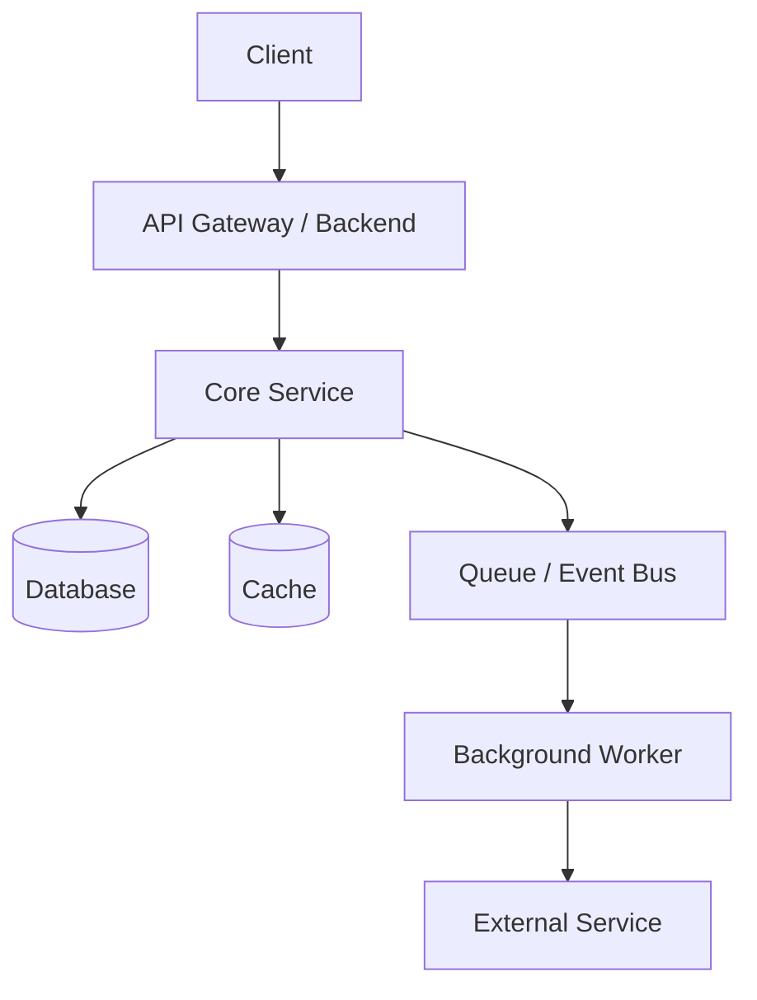

# High-Level Design: Video Editor

## 1. Overview

### Problem

What problem are we solving?

Our current implementation of video editor was so bad that we had to delete everything to make sure we can start from scratch. Right now we are starting a new video editor. This new video editor will use frontend/packages/editor-core repo to exclusively run its editting. 

The problems with our old editor are exposed here: /Users/ken/Documents/workspace/ContentAI/docs/research/[openreel-vs-contentai-why-slow.md](http://openreel-vs-contentai-why-slow.md)

Instead of trying to patch this old editor, we decided to create a new one. We want new signatures, backend model, and a shared type system between backend and frontend. 

### Goals

- Review the current state of the editor, the frontend and backend. Rewrite their contracts to match the contracts found in editor-core, since it will be the new editor surface and everything will follow there pattern.
- Once the current architecture is review, devised a clear and straightforward plan on how everything should look like and the end result. This plan should include like what contracts from editor-core will we be using, the database schema, what the backend will be responsible for (imo this should just be exporting and having a job queue for long exports). The database should also hold like user configured editor runtime stuff (evaluate what we currently have, I plan to rewrite them to be more compatible with editor-core). This will be the most important part, laying out exactly how everything should function and the layout. We can create a folder for this and separate it into sub topic markdown files explaining the problems with the current signature, how to combine with editor-core and where to store the types
- The last goal was long, but after planning, all that is needed is to put it all together and write the code.

### Non-Goals

- N/A

---

## 2. Requirements

### Functional Requirements

- User can...
- User can use the editor like any other editor. All buttons should work and have testing against them. The runtime is fast and updates quickly, isn't tied to react, and doesn't rerender on every frame.
- System should meet the performance specifications

### Non-Functional Requirements

- Latency:

The average start up latency for a browser video editor under 500 ms to 2 seconds. This means when the user navigates to editor studio page on first load, it should take <= 2 seconds to:

Render first frame

Render all components

render complete timeline snapshot from the user

render the images of the thumbnail for each asset

lazy load things that aren't immediately on the screen

other things

- Availability:

This is not too much of a concern but build the infrastructure to make sure it is available and up. The problem with the current infrastructure is that things "just dont work", buttons weren't connected to anything for some reason, editor save functionality wasnt working (which is pretty easy to implement, just have 5 seconds save a snapshot of everything and upload to db). I know availability means *infrastructure* not code level but my points still stand. We will be deploying this on railway, massive availability isn't too big of a concern/

- Scalability:

This is out of scope, scability in the traditional sense means - if there were 1000 more users, will your application handle the load? The answer is, no but because I'm not designing for at-scale. This is a small project at the moment. Theres no need to have server with multiple EC2 instances, read replicas, etc. And also every user is self contained, so at most the scaling will just be horizontal, most of the compute happens client side with video rendering. The rest of the project: reels are generated to show the user what they could make, chat message might be an issue in terms of scaling - I think right now we are using a long lived HTTP connection, might need to revisit this but agian, not in scope. I'm just yapping at this point/

- Durability:

N/A

- Security:

N/A

- Cost:

N/A

- Observability:

debug logs for the most part ~ wont have serious observability until time to release to prod

---

## 3. System Context

### Users / Clients

- Web app - just a web app

### External Dependencies

- Auth provider
- Payment provider
- Email/SMS provider
- Third-party API

---

## 4. Architecture

### High-Level Diagram

