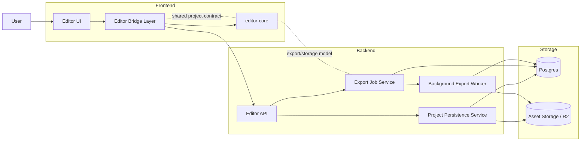
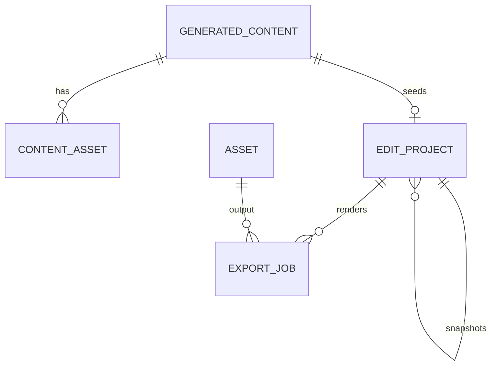
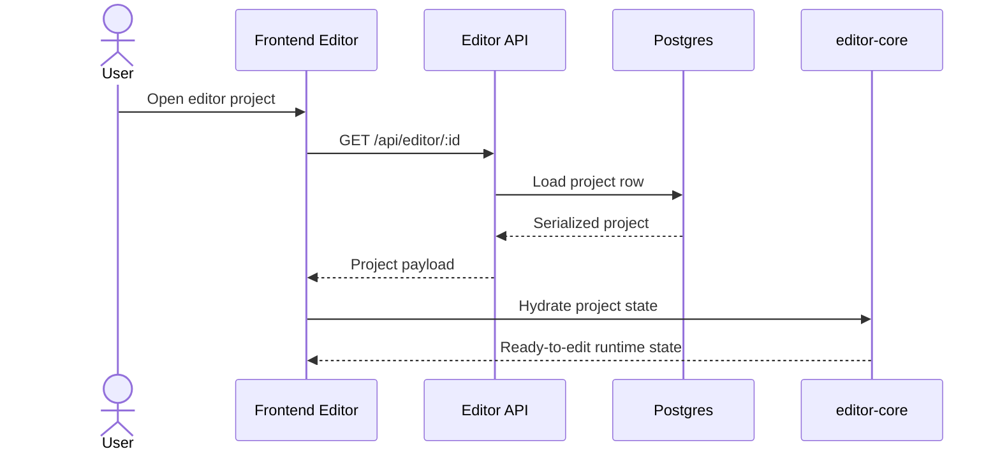
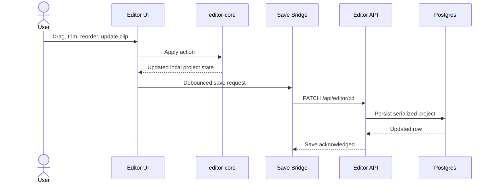
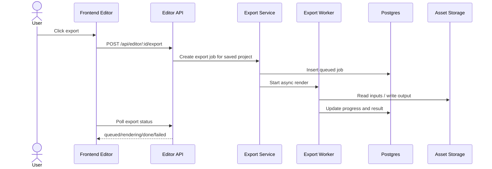

# High-Level Design: Editor Rebuild

> **Last updated:** 2026-04-25
> **Scope:** Rebuild the ContentAI manual editor around `packages/editor-core`, align frontend/backend contracts, and define the persistence and export architecture.
> **Audience:** Engineers implementing the new editor stack and reviewers validating the architecture.

## 1. Overview

The previous editor implementation was difficult to maintain, slow, and inconsistent enough that we chose to reset rather than continue patching it. The new direction is to make `packages/editor-core` the source of truth for editor behavior, timeline rules, playback vocabulary, serialization boundaries, and export orchestration. The application-specific frontend and backend should become thin integration layers around that core, not parallel editing systems with their own drifting models.

The main architecture shift is simple: editing happens client-side through `editor-core`, persistence happens through a thin backend project API, and final renders happen through asynchronous export jobs. We also need one shared contract model across frontend, backend, and storage so that project data is not reinterpreted differently at each layer.

Related background:
- `docs/research/openreel-vs-contentai-why-slow.md`
- `docs/architecture/domain/manual-editor-system.md`

## 2. Problem Statement

We are solving four linked problems:

1. The editor contract is fragmented. The frontend currently has app-local editor models in `frontend/src/domains/creation/editor/model`, while `packages/editor-core` already defines a broader editing vocabulary and storage boundary.
2. The backend stores and exports editor projects, but the contracts are still shaped around the current app implementation instead of the new core package.
3. Save, export, and runtime behavior are not clearly separated in the design. That makes it easy for UI behavior, persistence logic, and render logic to drift.
4. The current architecture makes basic editor reliability feel fragile. Buttons not being wired, saves not feeling trustworthy, and unclear ownership between layers are all symptoms of the same design issue: too many partially-overlapping editor systems.

## 3. Goals

- Make `packages/editor-core` the canonical editor engine and contract source.
- Rewrite frontend and backend editor contracts to match the `editor-core` data model, with a thin bridge layer handling app integration.
- Keep editing local-first in the browser so timeline changes are fast and not tied to React re-renders on every frame.
- Reduce backend responsibilities to the parts that require a server:
  - project persistence
  - asset lookup/linking
  - export job orchestration
  - long-running background rendering
- Define where shared types live and how they are versioned.
- Define the database model for persisted editor projects, snapshots, export jobs, and user-configured editor runtime settings.
- Produce a structure that can be split into follow-up docs for contracts, migration, and implementation phases.

## 4. Non-Goals

- Designing for large-scale multi-region infrastructure.
- Rebuilding the broader chat, reel discovery, or payment systems.
- Solving every future AI-assisted editing workflow in this document.
- Making the backend responsible for interactive timeline playback.

## 5. Requirements

### Functional Requirements

- Users can open an editor project and resume from previously saved state.
- Users can edit timeline content with responsive local interactions.
- Users can autosave project state without manually exporting.
- Users can export a saved project through an asynchronous render job.
- Users can work with project versions/snapshots when needed.
- The frontend, backend, and persisted storage all use one coherent editor contract.

### Non-Functional Requirements

- **Startup performance:** first meaningful editor load should feel fast enough for an interactive product. The target is roughly 0.5 to 2 seconds for initial editor shell render plus first previewable state on a normal browser session.
- **Playback/edit responsiveness:** timeline edits should be immediate and should not depend on React component rerendering for every frame tick.
- **Reliability:** autosave and export paths should be explicit, testable, and observable enough that failures are diagnosable.
- **Availability:** this system does not require hyperscale infrastructure, but the core flows should work consistently in the deployed Railway environment.
- **Scalability:** not a primary design driver. Most edit/playback cost stays client-side; server cost is concentrated in persistence and export jobs.
- **Observability:** basic structured logs and job status visibility are required; full production-grade observability can come later.

## 6. Current State In The Repo

The existing codebase already contains the main pieces we want, but they are not yet cleanly centered around `editor-core`.

- `packages/editor-core` already defines the reusable engine surface:
  - project and timeline types in `src/types`
  - mutation logic in `src/actions` and `src/timeline`
  - playback in `src/playback`
  - storage serialization boundary in `src/storage`
  - export orchestration in `src/export`
- The frontend editor lives under `frontend/src/domains/creation/editor/` and currently uses app-local types such as `EditProject`, `Track`, and `Clip`.
- The backend editor API is already split into sensible route groups under `backend/src/routes/editor/`:
  - projects CRUD
  - asset listing
  - export
  - AI/linking routes
  - fork/version routes
- The database already has core persistence tables:
  - `edit_projects`
  - `export_jobs`
  - linked `generated_content` and `content_assets`

This HLD keeps those existing responsibilities, but changes the contract ownership: `editor-core` becomes primary, and the app should integrate with it through a bridge layer rather than ad hoc domain-specific models.

## 7. Proposed Architecture

### Component Responsibilities

- **Editor UI**
  - Renders timeline, inspector, preview, and project controls.
  - Should be a presentation layer over editor state, not the owner of editing rules.

- **Editor Bridge Layer**
  - Acts as the explicit boundary between app UI/state and `editor-core`.
  - Translates API payloads, persistent project documents, and UI commands into core-native objects and operations.
  - Owns bridge concerns such as initialization, engine lifecycle, app-specific store integration, and save/export wiring.

- **`editor-core`**
  - Owns the canonical editor vocabulary, timeline rules, playback semantics, storage serialization shape, and export primitives.
  - Must become the only place where clip/track semantics are defined long-term.

- **Editor API**
  - Authenticates users and exposes project, asset, export, and snapshot endpoints.
  - Should validate payloads against shared contracts rather than maintaining a second independent editor schema.

- **Project Persistence Service**
  - Saves and loads serialized editor projects.
  - Links projects to generated content and source assets.
  - Stores lightweight project metadata such as title, resolution, fps, and persisted editor preferences when those are user-owned.

- **Export Job Service / Worker**
  - Accepts export requests for saved projects.
  - Runs long-lived render work asynchronously and records progress/results in `export_jobs`.

## 8. Core Design Decisions

### 8.1 `editor-core` Becomes The Source Of Truth

The new editor should not maintain an app-only clip/track model if `editor-core` already defines that concept. If the app needs extra fields, they should be added in one of two ways:

1. add them to `editor-core` because they are true editor concepts, or
2. keep them in a thin wrapper/metadata layer outside the core project document.

The backend should persist either the `editor-core` project document directly or a narrowly-defined serialized form derived from it.

### 8.1.1 Use A Bridge Layer, Not A Generic Adapter

The frontend should follow a bridge pattern similar to the OpenReel web app under `/Users/ken/Documents/workspace/openreel/openreel-video/apps/web/src/bridges`, not a vague catch-all "adapter" layer.

In practice, that means:

- the UI talks to bridge modules or bridge-backed stores
- bridge modules own integration with `editor-core` engines and services
- bridges expose app-friendly operations while keeping `editor-core` semantics intact
- bridges are thin seams, not alternate business logic implementations

For ContentAI, this likely means an `editor bridge` area that sits between:

- React UI in `frontend/src/domains/creation/editor/ui`
- local app state/store code
- `packages/editor-core`
- backend editor APIs for save/load/export

This is a better fit than "adapter" because the layer is not just reshaping types. It also manages lifecycle, engine initialization, synchronization, and app integration, which is exactly how OpenReel uses bridge modules such as `text-bridge`, `media-bridge`, `playback-bridge`, and `render-bridge`.

### 8.2 Local-First Editing, Server-Backed Durability

Interactive editing stays in the browser. Saves are debounced and persist the serialized project document. The backend does not participate in per-frame playback or per-edit recomputation.

This preserves the intent already described in `docs/architecture/domain/manual-editor-system.md`: the editor should feel immediate, and the server should only be responsible for durability and long-running work.

### 8.3 Backend Responsibility Is Narrow

The backend should not become a second editor runtime. Its editor responsibilities should be limited to:

- validating project documents
- saving/loading projects
- linking projects to generated content and assets
- snapshot/fork operations
- scheduling and tracking export jobs

That matches the current route layout and keeps the client runtime fast.

### 8.4 Shared Types Need A Clear Home

The shared contract should live with `editor-core` or in a package directly derived from it, not duplicated separately in frontend and backend domains. The current local frontend model in `frontend/src/domains/creation/editor/model/editor-domain.ts` and backend Zod schemas in `backend/src/domain/editor/editor.schemas.ts` should converge on a single canonical shape, with the bridge layer handling any temporary migration mapping.

## 9. Data Model

### Primary Entities

- **`edit_projects`**
  - Persistent editor project record.
  - Already stores `generatedContentId`, `tracks`, `durationMs`, `fps`, `resolution`, publish state, and `parentProjectId`.
  - In the rebuilt model, this should store the canonical serialized editor project plus app-level metadata needed for listing and lifecycle management.

- **`export_jobs`**
  - Tracks asynchronous render requests and their progress.
  - Should remain the system of record for queued, rendering, done, and failed exports.

- **`generated_content`**
  - Represents the broader content generation lifecycle the editor may attach to.
  - Used to seed initial timelines and preserve linkage between generated material and manual editing.

- **`content_assets` / asset storage**
  - Source media and output artifacts used by the editor and export worker.

### Snapshot Model

The existing `parentProjectId` field already supports project snapshots/version branches. That is a good fit for HLD-level versioning because it keeps autosave on the root project while allowing explicit forks/restores for larger checkpoints.

### Persisted Runtime Preferences

User-configured editor runtime preferences should be persisted only if they matter across sessions, for example:

- preferred resolution/fps defaults
- preferred editing mode
- layout/tooling preferences

These settings should not be mixed into transient playback state unless they are required to restore the editing session.

## 10. Key Flows

### 10.1 Open Project

Outcome: the editor opens from saved server state and is hydrated into a local `editor-core` project/runtime model.

### 10.2 Edit And Autosave

Outcome: editing remains immediate in the browser, while the backend provides durability on a debounced path.

### 10.3 Export

Outcome: export is explicitly asynchronous and uses the saved project state, not unsaved browser-only edits.

### 10.4 Fork Or Restore Snapshot

The current fork/version routes are worth keeping. Snapshot operations should remain explicit lifecycle actions rather than a side effect of autosave. That gives users a stable restore point without turning every save into a new branch.

## 11. Contract Strategy

The current app has two competing representations:

- app-local editor types in the frontend
- backend validation schemas tied to the current project row format

The target state is:

1. `editor-core` defines the canonical project/timeline contract.
2. Shared validation schemas are generated from or manually kept beside that canonical contract.
3. Frontend bridge modules and backend route validation consume the same shared shapes.
4. Database serialization happens through a single serializer boundary.

If a migration period is needed, we should introduce explicit bridge/mapping functions rather than silently reshaping data throughout the app.

## 12. Implementation Plan

### Phase 1: Contract Alignment

- Define the canonical persisted project document based on `editor-core`.
- Map current frontend editor models onto that contract.
- Update backend validation and persistence layers to accept the new shape.

### Phase 2: Frontend Runtime Refactor

- Route editor interactions through `editor-core` actions/timeline rules.
- Reduce local duplicated editing logic where possible.
- Keep React responsible for UI composition, not editor rule ownership.

### Phase 3: Persistence And Export Cleanup

- Standardize autosave serialization.
- Make export consume the same canonical saved document.
- Persist editor preferences intentionally rather than ad hoc.

### Phase 4: Follow-Up Docs

- Contract mapping doc: current app types vs `editor-core` types
- Database/storage doc: serialized shape and migration rules
- Export doc: worker lifecycle and failure handling

## 13. Risks

- **Type migration risk:** current frontend/backend code depends on app-local editor types, so contract convergence will touch many files.
- **Schema drift risk:** if backend Zod schemas and `editor-core` types continue evolving separately, the rewrite will fail its main goal.
- **Export parity risk:** if preview logic and export logic interpret timeline data differently, the new editor will still feel unreliable.
- **Scope risk:** trying to solve AI editing, manual editing, and export redesign all at once could slow delivery.

## 14. Recommended Outcome

The end state should be an editor where:

- `editor-core` owns editing semantics
- the frontend is a fast UI shell over core state
- the backend is a thin persistence/export layer
- the database stores one canonical serialized project document
- export jobs operate from saved project state with clear status tracking

That gives us a simpler mental model, cleaner contracts, and a much better base than continuing to patch the old editor.
