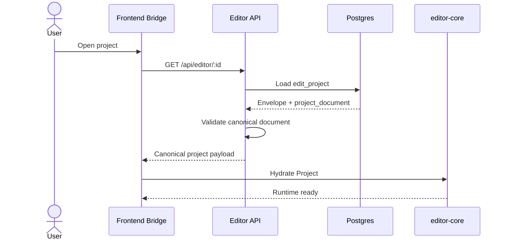
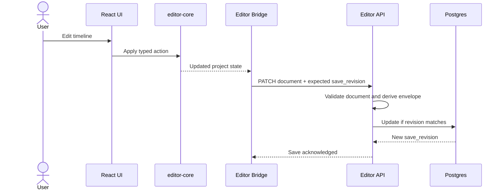
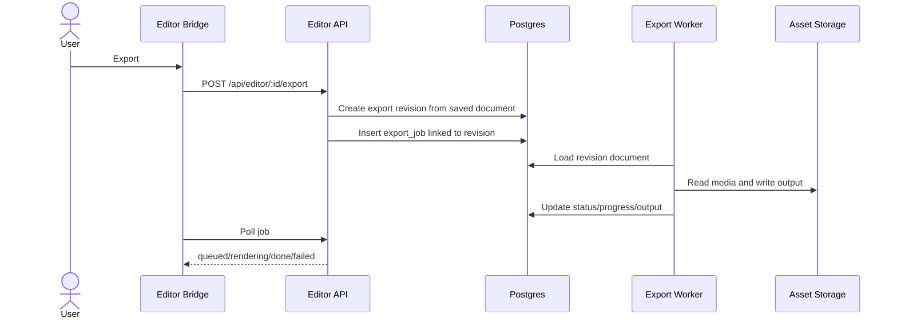

# High-Level Design: Editor Rearchitecture

> **Last updated:** 2026-04-26
> **Status:** Draft for review
> **Scope:** Rebuild the manual editor around `packages/editor-core`, including the frontend bridge, backend contracts, clean database migration, autosave, snapshots, assets, and export provenance.
> **Audience:** Engineers and reviewers deciding the editor architecture before implementation starts.

> **Phase LLDs:** [hld-editor/README.md](./hld-editor/README.md)

## 1. Executive Summary

The editor rebuild is not just a UI integration project. It is a rearchitecture of the editor domain model across frontend state, backend validation, database persistence, asset linkage, snapshots, and export jobs.

The recommended direction is to make `packages/editor-core` the canonical project document and persist that document in Postgres behind a relational envelope. The relational envelope keeps fields we query, join, authorize, and display frequently, while the canonical project document stores timeline/media/editor state in the same shape the editor runtime hydrates. Export jobs should render from an immutable saved revision, not from whatever the latest browser state happens to be when a worker starts.

This plan assumes a clean cutover. We do not need backwards compatibility for the old editor persistence shape after migration; the old model is migration input, not a supported runtime contract.

This gives us one editor contract without pretending the database is irrelevant. Postgres still owns identity, ownership, generated-content linkage, listing metadata, publish state, export status, and revision history. `editor-core` owns timeline semantics, serialization, playback vocabulary, and renderable project shape.

## 2. Problem Statement

The current design has three competing editor models. The frontend uses app-local editor types under `frontend/src/domains/creation/editor/model`, the backend validates and persists a separate track-shaped JSON structure in `backend/src/domain/editor/editor.schemas.ts`, and `packages/editor-core` defines a richer project/timeline/storage model that is supposed to become the source of truth. Because these models overlap without a single ownership boundary, every save, export, timeline sync, and AI assembly feature risks interpreting the same project differently.

The database schema reflects that old split. `edit_project.tracks` stores only the current app-local track array, while separate columns such as `duration_ms`, `fps`, and `resolution` duplicate pieces that belong inside the core project document. That was workable while the manual editor was small. It is not enough for a major editor runtime with media libraries, timeline tracks, text/graphics, effects, storage schema versions, asset relinking, snapshots, and deterministic exports.

If we start implementation from the current concise plan, we will likely wire `editor-core` into the UI while leaving persistence and backend contracts shaped around the old editor. That would create a fourth layer of translation instead of removing drift.

## 3. Goals

| #   | Goal                                          | Success Looks Like                                                                                                                                                                  |
| --- | --------------------------------------------- | ----------------------------------------------------------------------------------------------------------------------------------------------------------------------------------- |
| G1  | Make `editor-core` the canonical editor model | Frontend, backend validation, persisted project documents, and export workers all agree on the same project shape and schema version.                                               |
| G2  | Redesign persistence deliberately             | The database stores a canonical project document plus relational fields for ownership, listing, generated-content linkage, publish state, export provenance, and query performance. |
| G3  | Preserve responsive editing                   | Timeline edits run locally through `editor-core`; save/export do not block interactive operations.                                                                                  |
| G4  | Make exports deterministic                    | Every export job references the exact saved project revision it renders.                                                                                                            |
| G5  | Execute a clean migration                     | Existing `edit_project.tracks` rows are converted once into the new canonical document shape; after cutover, runtime code no longer reads or writes the old shape.                  |
| G6  | Keep app-specific data out of core semantics  | Generated content, queue state, billing, and user preferences remain app/backend concepts unless they are true editor concepts.                                                     |

## 4. Non-Goals

| #   | Non-Goal                                               | Reason                                                                                                           |
| --- | ------------------------------------------------------ | ---------------------------------------------------------------------------------------------------------------- |
| N1  | Full collaborative editing                             | The design should not block collaboration later, but real-time multi-user CRDT/OT work is out of scope.          |
| N2  | Rebuilding chat, queue, billing, or content generation | These systems are dependencies and integration points, not part of the editor runtime rewrite.                   |
| N3  | Making the backend a playback engine                   | Preview/playback remains browser-local.                                                                          |
| N4  | Fully normalized timeline SQL tables on day one        | Querying individual clips is not currently a product requirement worth the added write and migration complexity. |
| N5  | Long-term offline-first sync                           | We want local-feeling edits and resilient autosave, but not full offline ownership/sync in this phase.           |

## 5. Current State In This Repo

### 5.1 `editor-core`

`packages/editor-core` already defines the reusable editor surface:

- `src/types/project.ts` defines `Project`, `ProjectSettings`, `MediaLibrary`, and media metadata.
- `src/types/timeline.ts` defines `Timeline`, `Track`, `Clip`, transitions, effects, transforms, markers, subtitles, and time fields.
- `src/actions` owns typed, validated, reversible mutations.
- `src/timeline` owns track and clip rules.
- `src/playback` owns preview timebase.
- `src/storage/project-serializer.ts` defines a versioned project file boundary with `SCHEMA_VERSION`.
- `src/export` owns export orchestration.

The important gap: `editor-core` has TypeScript types and a serializer, but the backend does not yet validate or persist that project document as the primary shape.

### 5.2 Frontend Editor

The current frontend editor under `frontend/src/domains/creation/editor/` has an app-local model:

- `EditProject`
- `Track`
- `Clip`
- `Transition`
- local fields such as `locallyModified`, `source`, `generatedContentId`, `status`, and `thumbnailUrl`

Those fields mix editor semantics, persistence metadata, generated-content linkage, and UI/session state. The rearchitecture needs a bridge layer that maps app concerns into core runtime state without inventing another timeline model.

### 5.3 Backend Contracts

`backend/src/domain/editor/editor.schemas.ts` validates the old app-local track model. It accepts `tracks`, `durationMs`, `fps`, and `resolution` directly on autosave. This is currently separate from both `packages/editor-core` and `packages/contracts`.

### 5.4 Database Schema

The current Drizzle schema defines:

- `edit_project`
  - `id`, `user_id`, `title`, `auto_title`
  - `generated_content_id`
  - `tracks jsonb`
  - `duration_ms`, `fps`, `resolution`
  - `status`, `published_at`, `user_has_edited`, `thumbnail_url`
  - `parent_project_id`
- `export_job`
  - `edit_project_id`, `user_id`, `status`, `progress`, `output_asset_id`, `error`
- `generated_content`, `content_assets`, and `assets`
  - content lifecycle and asset linkage used by chat/video generation and editor seeding

The current schema has useful foundations: project ownership, content linkage, export jobs, snapshots through `parent_project_id`, and indexes for listing. The weak part is that `tracks jsonb` is too narrow to represent a full core project document and too ambiguous to serve as a durable versioned contract.

## 6. Research Summary

### 6.1 Postgres JSONB Is A Good Fit For Flexible Documents, Not For Everything

Postgres supports `jsonb` for decomposed binary JSON that can be indexed and queried, which makes it a practical storage option for a versioned project document. The caution is that frequently queried or constrained fields should stay as relational columns; putting user IDs, statuses, timestamps, and join keys inside JSON would weaken constraints and predictable query planning.

Key insight: store the editor project document as JSONB, but keep ownership, listing, publish state, generated-content linkage, revision pointers, and export status relational.

Sources:

- [https://www.postgresql.org/docs/current/datatype-json.html](https://www.postgresql.org/docs/current/datatype-json.html)
- [https://www.postgresql.org/docs/current/indexes-expressional.html](https://www.postgresql.org/docs/current/indexes-expressional.html)

### 6.2 Generated Columns And Expression Indexes Are Escape Hatches, Not The First Design

Postgres expression indexes and generated columns can pull hot values out of JSON when access patterns become clear. That means we do not need to normalize every clip/effect/text field up front, but we should avoid whole-document GIN indexes unless we know we need containment-style JSON search.

Key insight: start with a relational envelope and targeted columns. Add expression indexes or generated columns only for measured hot paths, such as duration, dimensions, or media count if listing/search later needs them.

Sources:

- [https://www.postgresql.org/docs/current/indexes-expressional.html](https://www.postgresql.org/docs/current/indexes-expressional.html)
- [https://www.postgresql.org/docs/current/ddl-generated-columns.html](https://www.postgresql.org/docs/current/ddl-generated-columns.html)

### 6.3 Local-First Editing Supports The Frontend Runtime Direction, But Not Necessarily Full Offline Sync

Local-first software literature argues that creative tools feel responsive when user actions do not wait for a server round trip. That matches our editor requirement: timeline edits should be applied locally through `editor-core`, with server persistence happening asynchronously. However, full local-first collaboration introduces conflict resolution and sync complexity that is not required for this rebuild.

Key insight: use local-first interaction principles for responsiveness, but keep the persistence model server-backed and revision-based for now.

Source:

- [https://martin.kleppmann.com/papers/local-first.pdf](https://martin.kleppmann.com/papers/local-first.pdf)

## 7. Architecture Options Considered

### Option A: Keep Current Schema And Add Translators

Keep `edit_project.tracks`, `duration_ms`, `fps`, and `resolution` as the durable shape. Add frontend/backend adapters that convert this old shape into `editor-core` on load and back into tracks on save.

| Dimension      | Assessment                                                                         |
| -------------- | ---------------------------------------------------------------------------------- |
| Complexity     | Low initial implementation, high long-term translation complexity.                 |
| Performance    | Similar to current system.                                                         |
| Reliability    | Poor, because preview/export/backend would still depend on conversion correctness. |
| Cost           | Low now, expensive later.                                                          |
| Reversibility  | Easy to avoid schema migration, hard to undo accumulated adapter logic.            |
| Stack fit      | Weak fit with `editor-core` as source of truth.                                    |
| Team readiness | Easy to start but likely to mislead implementation.                                |

Risks:

- The app keeps two timeline models permanently.
- Export parity remains fragile.
- New core features like media library, effects, graphics, and schema versions have no natural persistence home.

### Option B: Store Only The Core Project Document In `edit_project`

Replace the current editor fields with a single `project_document jsonb` column that contains the serialized `editor-core` project and remove most denormalized editor columns.

| Dimension      | Assessment                                                                              |
| -------------- | --------------------------------------------------------------------------------------- |
| Complexity     | Simple conceptual model, but pushes too much app behavior into JSON.                    |
| Performance    | Fine for direct load/save; weaker for listing, filtering, joins, and publish workflows. |
| Reliability    | Strong core contract, weaker database constraints.                                      |
| Cost           | Moderate migration cost.                                                                |
| Reversibility  | Moderate before cutover through backups; low after removing old fields.                 |
| Stack fit      | Good for `editor-core`, weaker for existing backend/query patterns.                     |
| Team readiness | Easy for editor code, less clear for queue/export/admin integrations.                   |

Risks:

- Listing pages need to parse documents or duplicate values later.
- Ownership, generated-content linkage, publish state, and export summaries become less explicit.
- Database constraints cannot protect important app invariants inside the document.

### Option C: Canonical Core Document Plus Relational Envelope

Store the current saved `editor-core` document in `edit_project.project_document jsonb`, and keep relational columns for identity, ownership, generated-content linkage, title, dimensions, duration, status, thumbnail, revision, timestamps, and parentage. Add a revision table for explicit snapshots and export provenance.

| Dimension      | Assessment                                                                                                 |
| -------------- | ---------------------------------------------------------------------------------------------------------- |
| Complexity     | Moderate. Requires a real migration and clear document/envelope boundaries.                                |
| Performance    | Strong for app queries; direct project load remains simple.                                                |
| Reliability    | Strong, because core document is canonical and export can reference immutable revisions.                   |
| Cost           | Highest near-term cost among practical options.                                                            |
| Reversibility  | Good before cutover through backups and dry-run validation; intentionally low after old paths are removed. |
| Stack fit      | Best fit with existing Postgres/Drizzle, backend services, and `editor-core`.                              |
| Team readiness | Requires careful planning, but matches the shape of the current system.                                    |

Risks:

- Envelope fields can drift from the document unless writes go through one serializer.
- Migration must prove old projects convert into valid core documents before cutover.
- Autosave needs revision/conflict semantics rather than blind overwrite.

### Option D: Fully Normalize Timeline Into SQL Tables

Create relational tables for tracks, clips, transitions, effects, media items, subtitles, and keyframes.

| Dimension      | Assessment                                                                                 |
| -------------- | ------------------------------------------------------------------------------------------ |
| Complexity     | Very high. Every core type change becomes a database migration.                            |
| Performance    | Strong for clip-level queries; worse for whole-project save/load unless carefully batched. |
| Reliability    | Strong constraints possible, but high chance of mismatching core semantics.                |
| Cost           | High engineering and migration cost.                                                       |
| Reversibility  | Low once downstream code depends on normalized tables.                                     |
| Stack fit      | Poor fit for rapidly evolving editor-core document semantics.                              |
| Team readiness | Too much surface area for this phase.                                                      |

Risks:

- Prematurely freezes the editor model.
- Makes autosave a multi-table write problem.
- Adds SQL schema work for features that do not need clip-level querying yet.

### Option E: Event Log As Source Of Truth

Persist every editor action as an append-only event stream, rebuild project state from events, and use snapshots for faster load.

| Dimension      | Assessment                                                                           |
| -------------- | ------------------------------------------------------------------------------------ |
| Complexity     | High. Requires action compatibility, replay, compaction, and conflict rules.         |
| Performance    | Good with snapshots; poor without compaction.                                        |
| Reliability    | Excellent auditability, but only if all mutations are evented correctly.             |
| Cost           | High.                                                                                |
| Reversibility  | Moderate if implemented alongside snapshots, but not worth the first rearchitecture. |
| Stack fit      | Good future fit with `editor-core/src/actions`, premature for current needs.         |
| Team readiness | Better after core integration is stable.                                             |

Risks:

- Turns the rebuild into event-sourcing infrastructure.
- Requires strict action versioning before the runtime contract is settled.
- More machinery than needed for single-user autosave and explicit snapshots.

## 8. Recommendation

We recommend **Option C: Canonical Core Document Plus Relational Envelope**.

This option gives `editor-core` real ownership of the editor document without throwing away the parts of Postgres that are doing useful app work. The migration should be clean: validate conversion ahead of time, run a one-time cutover, and remove old runtime paths instead of maintaining dual-read or dual-write compatibility.

We are not recommending Option A because it preserves the exact drift we are trying to eliminate. We are not recommending Option B because it treats Postgres like a document store and would make normal product workflows harder. We are not recommending fully normalized SQL tables because the editor model is still evolving and whole-project load/save matters more than clip-level SQL queries. We are not recommending event sourcing yet because it is a future enhancement, not the first stable persistence layer.

The recommendation depends on one assumption: the serialized `editor-core` project document can be made safe for backend validation and durable storage before cutover. If `editor-core` cannot provide a stable serializable shape soon, pause the cutover and define the persisted schema first; do not ship a compatibility layer around an unstable contract.

## 9. Proposed Database Model

### 9.1 `edit_project`: Current Project Envelope

Keep `edit_project` as the root project table, but evolve it from "tracks plus metadata" into "relational envelope plus current canonical document."

Recommended columns:

| Column                                      | Purpose                                                                                                              |
| ------------------------------------------- | -------------------------------------------------------------------------------------------------------------------- |
| `id`                                        | Stable project identity.                                                                                             |
| `user_id`                                   | Ownership and authorization.                                                                                         |
| `title`, `auto_title`, `thumbnail_url`      | Listing and user-facing metadata.                                                                                    |
| `generated_content_id`                      | Link to the generated content chain that seeded or currently drives the project. Nullable for blank/manual projects. |
| `project_document jsonb`                    | Current canonical serialized `editor-core` project document, without browser-only blobs or file handles.             |
| `project_document_version text`             | Serializer/schema version, initially from `editor-core` storage schema.                                              |
| `contract_version text`                     | App/backend contract version when it differs from core serializer version.                                           |
| `document_hash text`                        | Hash of the canonical document for idempotency/debugging/export provenance.                                          |
| `save_revision integer`                     | Monotonic revision used for optimistic autosave conflict detection.                                                  |
| `duration_ms`, `fps`, `resolution`          | Denormalized listing/export summary derived from `project_document.settings` and `project_document.timeline`.        |
| `status`, `published_at`, `user_has_edited` | App lifecycle fields.                                                                                                |
| `parent_project_id`                         | Existing project family/snapshot lineage to migrate or intentionally replace with revision rows.                     |
| `created_at`, `updated_at`                  | App row lifecycle.                                                                                                   |

Cutover should replace `tracks` as the runtime persistence shape. Keep the old data only long enough for one-time conversion verification and rollback backup; new application code should not read or write `tracks`.

### 9.2 `edit_project_revision`: Immutable Saved Documents

Add a revision table so snapshots and exports render exact documents.

Recommended columns:

| Column                                                          | Purpose                                                               |
| --------------------------------------------------------------- | --------------------------------------------------------------------- |
| `id`                                                            | Revision identity.                                                    |
| `project_id`, `user_id`                                         | Ownership and lookup.                                                 |
| `revision_number`                                               | Monotonic per project.                                                |
| `kind`                                                          | `autosave`, `manual_snapshot`, `publish`, `export`, `cutover_import`. |
| `project_document jsonb`                                        | Immutable canonical document at that revision.                        |
| `project_document_version`, `contract_version`, `document_hash` | Validation/provenance metadata.                                       |
| `source_revision_id`                                            | Optional parent revision for restore/fork lineage.                    |
| `created_at`                                                    | Revision timestamp.                                                   |

Policy decision: do not store every keystroke forever. Store the current document on `edit_project`; create revision rows for explicit snapshots, publish, export, the one-time cutover import, and optionally periodic autosave checkpoints if product wants recovery history.

### 9.3 `export_job`: Render From A Revision

Update export jobs so a job points at the immutable revision it is rendering.

Recommended additions:

| Column                       | Purpose                                           |
| ---------------------------- | ------------------------------------------------- |
| `project_revision_id`        | Exact project revision rendered by the job.       |
| `export_settings jsonb`      | Resolution/fps/format settings used for this job. |
| `started_at`, `completed_at` | Operational visibility.                           |
| `progress_phase`             | More useful UI/debug status than percent alone.   |

Export flow should create or reuse an `export` revision, insert `export_job(project_revision_id)`, and pass that revision document to the worker. This prevents "exported the wrong unsaved state" bugs and makes failed jobs reproducible.

### 9.4 `edit_project_asset`: Project-Level Asset References

The current `content_assets` table links generated content to assets. That is useful, but the rebuilt editor also needs project-level media references for imported user assets, reused generated assets, thumbnails, waveforms, proxies, and output artifacts.

Recommended table:

| Column                              | Purpose                                                                                    |
| ----------------------------------- | ------------------------------------------------------------------------------------------ |
| `project_id`, `asset_id`, `user_id` | Ownership and linkage.                                                                     |
| `media_id`                          | The `editor-core` media library ID that references the asset.                              |
| `role`                              | `source_video`, `voiceover`, `music`, `image`, `thumbnail`, `proxy`, `export_output`, etc. |
| `source`                            | `generated_content`, `user_upload`, `system`, `export`.                                    |
| `generated_content_id`              | Optional source content relationship.                                                      |
| `metadata jsonb`                    | Waveform/proxy/thumbnail hints not worth first-class columns yet.                          |

This table should not replace `content_assets` immediately. It should bridge editor projects to assets independently of generated content, while existing content-generation flows keep using `content_assets`.

### 9.5 User Preferences

Do not store user layout/runtime preferences inside `project_document` unless they are required to reproduce the project. Persist them separately, either in an editor preferences table or in an existing user settings/profile structure:

- default resolution/fps
- default export preset
- layout/tool visibility
- last-used inspector tab

Project document state should answer "what is this editable video?" Preferences should answer "how does this user like the editor UI configured?"

## 10. Contract And Ownership Boundaries

### 10.1 Canonical Project Document

`editor-core` should own:

- project settings
- media library entries
- timeline tracks/clips/transitions/effects
- text/graphics/sticker data
- playback/renderable state
- storage schema version
- action semantics and migration helpers

The app/backend should own:

- project ownership and auth
- generated-content linkage
- queue/publish lifecycle
- title/thumbnail/list metadata
- export job records
- asset storage records
- user preferences

### 10.2 Validation Strategy

The backend needs runtime validation, not just imported TypeScript types. There are two acceptable paths:

1. Add a real Zod/schema validation boundary to `packages/editor-core` or `packages/contracts` and consume it from backend/frontend.
2. Generate JSON Schema/Zod from the core types and treat generated output as the backend validation artifact.

Do not keep handwritten backend schemas that independently define clips/tracks once the new contract is adopted.

### 10.3 Bridge Layer

The frontend should introduce an editor bridge rather than letting React components directly manage core project state. The bridge owns:

- hydrating `editor-core` from canonical backend payloads after cutover
- exposing app-friendly commands to UI components
- debounced autosave
- optimistic save revision handling
- export requests
- asset relinking/upload integration

React owns rendering and user interactions. `editor-core` owns editor rules. The bridge owns lifecycle and integration.

## 11. Clean Migration Strategy

This is a clean migration, not a backwards-compatible rollout. The old `tracks` persistence shape is allowed to exist as input to the migration, but it should not remain a runtime read/write path after cutover. The migration plan should optimize for correctness, validation, backups, and a clear go/no-go decision rather than for indefinite compatibility.

### Phase 0: Inventory And Contract Freeze

Done criteria:

- Document every current frontend field in `EditProject`, `Track`, `Clip`, and `Transition`.
- Document every backend field in `editor.schemas.ts`.
- Document every core field required by `Project`, `Timeline`, `Track`, `Clip`, and `MediaLibrary`.
- Decide exact canonical persisted document shape and schema version.
- Decide which old fields are migrated, which are dropped, and which become envelope fields.

Rollback: no production changes.

### Phase 1: Target Schema Migration

Deliverables:

- Update `edit_project` to the target envelope schema with `project_document`, version fields, `document_hash`, and `save_revision`.
- Add `edit_project_revision`.
- Add `project_revision_id` and export settings/progress fields to `export_job`.
- Add `edit_project_asset` if project-level asset references are part of the cutover scope.
- Decide whether `tracks` is dropped in this migration or retained only as a non-runtime backup column until the next cleanup migration.

Rollback: restore the pre-migration database backup. There is no application-level fallback to old `tracks` once the cutover deploy is live.

### Phase 2: One-Time Data Conversion — **Skipped**

The database was reset before the cutover. No legacy `edit_project.tracks` data exists to convert. New projects write canonical `project_document` directly. Proceed to Phase 3.

### Phase 3: Runtime Cutover

Deliverables:

- Backend `GET` returns only the canonical document.
- Backend `PATCH` accepts canonical project document and updates envelope fields through a single serializer.
- Frontend bridge hydrates from canonical document.
- Autosave uses `save_revision` for optimistic concurrency.
- Remove old backend route schemas that accept `tracks` as the autosave body.
- Remove old frontend model usage from editor runtime paths.

Rollback: redeploy the previous app version and restore the pre-cutover database backup. Do not keep mixed runtime compatibility in the new architecture.

### Phase 4: Export From Revisions

Deliverables:

- Export request creates an immutable `edit_project_revision` row.
- `export_job` references that revision.
- Worker reads the revision document, not live `edit_project.project_document`.
- Job status includes enough progress/error metadata for UI and debugging.

Rollback: restore to the previous cutover checkpoint if export validation fails before release. After release, fix forward against the revision-based export path.

### Phase 5: Frontend Runtime Completion

Deliverables:

- Timeline, inspector, playback, and project settings flow through the bridge and `editor-core` actions.
- Remove duplicated frontend timeline mutation logic as each surface moves to core.
- React state stores UI state, selection, panels, and pending network state, not canonical timeline rules.

Rollback: restore the pre-cutover app/database pair if validation fails before release. After release, do not reintroduce the old editor model.

### Phase 6: Cleanup

Deliverables:

- Drop `tracks` if it was retained as a temporary backup column.
- Remove backend schemas that define the old clip/track model.
- Remove frontend app-local editor model fields that are now core or envelope fields.
- Decide whether `parent_project_id` remains as project-family lineage or whether revisions fully replace snapshot usage.

Rollback: destructive cleanup requires restoring from backup. Do it only after the clean cutover has been validated.

## 12. Key Flows

### 12.1 Open Project

### 12.2 Autosave

### 12.3 Export

## 13. Risks

| #   | Risk                                                             | Likelihood | Impact | Mitigation                                                                                                                   |
| --- | ---------------------------------------------------------------- | ---------- | ------ | ---------------------------------------------------------------------------------------------------------------------------- |
| R1  | Core project types are not yet stable enough for durable storage | Medium     | High   | Freeze a persisted subset and add schema versioning/migration helpers before backend cutover.                                |
| R2  | Envelope fields drift from document fields                       | Medium     | High   | Only update documents through one backend serializer that derives envelope fields from the document.                         |
| R3  | Existing rows cannot all convert cleanly                         | Medium     | Medium | Dry-run conversion report before cutover; failed conversion blocks release until fixed or intentionally excluded.            |
| R4  | Export preview parity still diverges                             | Medium     | High   | Export workers render from the same core document and add golden fixture tests for preview/export interpretation.            |
| R5  | Asset linkage is underspecified                                  | High       | High   | Explicitly design `edit_project_asset` before supporting arbitrary user-imported media.                                      |
| R6  | Autosave overwrites newer work                                   | Medium     | High   | Add `save_revision` optimistic concurrency and clear conflict UX in the bridge.                                              |
| R7  | Cutover happens before migration confidence                      | Low        | High   | Require conversion metrics, representative fixture tests, backup verification, and explicit go/no-go signoff before release. |

## 14. Open Questions

| #   | Question                                                                                                                | Owner               | Needed By | Status |
| --- | ----------------------------------------------------------------------------------------------------------------------- | ------------------- | --------- | ------ |
| Q1  | Should `editor-core` provide runtime Zod/JSON schema directly, or should `packages/contracts` own the persisted schema? | Engineering         | Phase 0   | Open   |
| Q2  | What exact fields belong in the persisted core document versus the app envelope?                                        | Engineering         | Phase 0   | Open   |
| Q3  | Do snapshots remain child `edit_project` rows, or move fully to `edit_project_revision`?                                | Engineering/Product | Phase 1   | Open   |
| Q4  | Should export create a revision from latest saved state only, or force-save dirty browser state first?                  | Product/Engineering | Phase 4   | Open   |
| Q5  | What project-level asset roles are required for v1: source, voiceover, music, proxy, thumbnail, export output?          | Engineering         | Phase 1   | Open   |
| Q6  | What is the retention policy for autosave revisions and export revisions?                                               | Product/Engineering | Phase 1   | Open   |

## 15. Success Criteria

| Goal                 | Metric                                    | Baseline             | Target                                                 | How Measured                           |
| -------------------- | ----------------------------------------- | -------------------- | ------------------------------------------------------ | -------------------------------------- |
| Contract convergence | Number of independent clip/track schemas  | 3                    | 1 canonical persisted schema plus app envelope         | Code review and schema inventory       |
| Migration safety     | Existing project conversion success       | N/A                  | N/A — DB reset; Phase 2 skipped                        | —                                      |
| Autosave reliability | Save conflict handling                    | Blind overwrite risk | Optimistic revision conflicts detected                 | Backend tests and UI integration tests |
| Export determinism   | Export references immutable project state | Live project row     | 100% of new jobs reference `project_revision_id`       | DB query and integration test          |
| Runtime ownership    | UI mutation logic outside core            | Significant          | Timeline mutations route through `editor-core` actions | Frontend code review                   |

## 16. Immediate Next Steps

1. Freeze the persisted project document contract before touching UI implementation.
2. ~~Write a field-by-field one-time migration map from current `EditProject`/backend `tracks` into `editor-core` `Project`.~~ **Skipped** — DB reset.
3. Decide whether validation lives in `editor-core` or `packages/contracts`.
4. Draft the target Drizzle migration for the envelope/revision/export changes.
5. Build the dry-run converter and migration report before scheduling the clean cutover.

The key architectural decision is not "use `editor-core` in the frontend." It is "make the serialized core project document the durable editor contract, and make every app layer integrate around that contract intentionally."