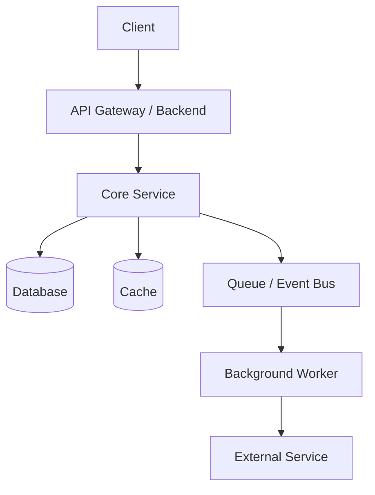

# High-Level Design: Video Editor

## 1. Overview

### Problem

What problem are we solving?

Our current implementation of video editor was so bad that we had to delete everything to make sure we can start from scratch. Right now we are starting a new video editor. This new video editor will use frontend/packages/editor-core repo to exclusively run its editting. 

The problems with our old editor are exposed here: /Users/ken/Documents/workspace/ContentAI/docs/research/[openreel-vs-contentai-why-slow.md](http://openreel-vs-contentai-why-slow.md)

Instead of trying to patch this old editor, we decided to create a new one. We want new signatures, backend model, and a shared type system between backend and frontend. 

### Goals

- Goal 1
- Goal 2
- Goal 3

### Non-Goals

- What this design will not solve
- Future work not included

---

## 2. Requirements

### Functional Requirements

- User can...
- System should...
- Admin/service should...

### Non-Functional Requirements

- Latency:
- Availability:
- Scalability:
- Durability:
- Security:
- Cost:
- Observability:

---

## 3. System Context

### Users / Clients

- Web app
- Mobile app
- Internal service
- Admin tool

### External Dependencies

- Auth provider
- Payment provider
- Email/SMS provider
- Third-party API

---

## 4. Architecture

### High-Level Diagram

