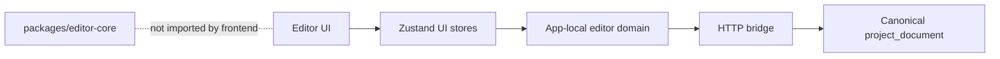

# Phase 7: Editor-Core Package And Frontend Engine Integration — Plan

> **Date:** 2026-04-26
> **Status:** Draft
> **Deciders:** Frontend lead, backend lead, editor architecture reviewer
> **Parent HLD:** [../hld-editor.md](../hld-editor.md)

## 1. Problem Statement

The current editor frontend is still not running on `packages/editor-core` as its engine. A repo search shows zero frontend imports from `editor-core`, `frontend/package.json` has no `editor-core` dependency, `packages/editor-core` has no `package.json`, and `frontend/src/domains/creation/editor/ui/preview/PreviewCanvas.tsx` is still a visual stub with `tick`, `receiveFrame`, and `clearFrames` all returning `undefined`. Phase 5 completed useful UI/store wiring, but it explicitly left `editor-core` integration out of scope. That means the browser now has real Zustand state and autosave/export plumbing, but it still does not hydrate a canonical `Project`, dispatch core actions, or render frames through the core playback/render stack. If nothing changes, the team will keep adding editor features on top of a UI-only runtime, maintain app-local editor shapes beside the canonical project document, and delay the point where preview, save, and export actually share one engine.

## 2. Goals & Non-Goals

**Goals**

| # | Goal | Success Looks Like |
|---|------|--------------------|
| G1 | Make `editor-core` consumable as a real package | Frontend and backend import `@contentai/editor-core` subpaths by name instead of reaching into `../packages/editor-core/src`. |
| G2 | Make the frontend runtime use `editor-core` directly | The editor hydrates a core `Project`, mutations go through core actions/managers, and `PreviewCanvas` renders through the core runtime instead of a stub. |
| G3 | Remove duplicate timeline/domain ownership | Frontend app-local `Track`, `Clip`, and `Transition` runtime types are eliminated or reduced to thin API-envelope adapters. |
| G4 | Keep package boundaries explicit and safe | Browser-heavy modules are not imported accidentally by backend code; package subpaths make the public surface intentional. |
| G5 | Preserve shippability while integrating | Packaging, type cutover, runtime bootstrap, and cleanup can land in phases without breaking autosave/export already completed in prior phases. |

**Non-Goals**

| # | Non-Goal | Reason |
|---|----------|--------|
| N1 | Publishing `editor-core` to a public registry | We only need an internal package boundary in this repo. |
| N2 | Full repo package-manager migration beyond what this effort needs | We should not block engine integration on converting every internal module to a workspace package. |
| N3 | Solving every editor feature gap | Trim/move/duplicate/paste/history depth, advanced preview, and collaboration remain separate workstreams. |
| N4 | Replacing backend persistence planning from Phases 1-6 | This plan complements the existing HLD/LLDs; it does not supersede their persistence decisions. |
| N5 | Converting `@contentai/contracts` to the same package model right now | That can follow later; this plan focuses on `editor-core` because it is the runtime engine. |

## 3. Background & Context

Current repo state:

- `packages/editor-core/src/index.ts` already exposes a large public barrel over types, actions, storage, playback, video, media, export, and more.
- `packages/editor-core` does **not** currently have a `package.json` or `tsconfig.json`.
- `frontend/tsconfig.json` and `frontend/vite.config.ts` use direct source aliases for `@contracts`, but there is no equivalent alias or dependency for `editor-core`.
- `frontend/src/domains/creation/editor/ui/preview/PreviewCanvas.tsx` is a stub shell, not a real core-backed renderer.
- `frontend/src/domains/creation/editor/store/*` now owns UI/runtime plumbing, but those stores still use app-local editor shapes instead of a canonical core `Project`.
- `packages/editor-core/src/types/timeline.ts` and the app-local editor model do not match exactly. For example, the local editor currently has a `music` track kind, while core timeline types expose `audio`, `image`, `text`, and `graphics` track categories.
- `packages/editor-core` depends on external runtime libraries such as `mediabunny`, `uuid`, and `gsap`, but there is no package manifest declaring that ownership today.

The current state looks like this:



This matters because the backend HLD already decided that `editor-core` should be the canonical project document and export vocabulary. Right now the frontend can load and save that world, but it is not actually running it.

The target state is:

```mermaid
flowchart LR
  UI[Editor UI] --> UIStore[Zustand UI-only state]
  UIStore --> Runtime[Frontend editor runtime facade]
  Runtime --> Core[@contentai/editor-core subpaths]
  Core --> Bridge[Autosave/export bridge]
  Bridge --> Backend[Canonical ProjectFile envelope]
```

In the target state, React owns presentation state, the runtime facade owns lifecycle/orchestration, and `editor-core` owns the actual editor semantics.

## 4. Research Summary

**TypeScript project references and composite packages**
- TypeScript project references are designed to split large programs into smaller logical units with explicit boundaries, faster type-checking, and declaration-based consumption across project edges. Referenced projects need `composite` and `declaration` enabled, and consumers load their declaration output rather than freely walking the source tree. That is a strong fit for `editor-core`, because it is supposed to be a reusable package boundary rather than a folder the frontend reaches into ad hoc.
- Key insight: even if we start with source-exported package subpaths, `editor-core` should still have its own `tsconfig` so the repo has a path to composite builds instead of remaining a loose source folder forever.
- Sources:
  - https://www.typescriptlang.org/docs/handbook/project-references.html

**Vite linked dependencies in monorepos**
- Vite treats linked monorepo dependencies as source code instead of prebundling them from `node_modules`, as long as they are valid ESM. That is useful here because we want fast iteration while importing internal package code directly into the frontend. Vite also warns that linked dependencies may require a dev-server restart or `--force` if dependency discovery changes.
- Key insight: we do not need a dist build step on day one to consume `editor-core` from the frontend; a linked ESM package is a normal Vite path, provided the package exports are clean and the dependency graph is explicit.
- Sources:
  - https://vite.dev/guide/dep-pre-bundling.html#monorepos-and-linked-dependencies

**Node package `exports` and subpath encapsulation**
- Node’s package guidance recommends explicit `exports` for entry points and subpaths rather than relying on an unrestricted package root. Explicit exports are especially valuable when a package contains both browser-heavy modules and server-safe modules, because they make the public interface intentional and prevent accidental deep imports. The docs also note that adding `exports` changes what consumers can import, so the map should be deliberate rather than a catch-all.
- Key insight: `editor-core` should not initially expose one giant root barrel as its only contract. It should expose targeted subpaths such as `types`, `storage`, `actions`, `timeline`, `playback`, `video`, and `media`, so frontend and backend can import only the safe surface they need.
- Sources:
  - https://nodejs.org/api/packages.html

**Bun workspaces and local package consumption**
- Bun supports root-level workspaces with `workspace:*` dependencies and treats packages under a monorepo as first-class local packages. That is the clean long-term shape if the repo wants a unified package-manager graph. However, it assumes a root `package.json` and install workflow that this repo does not currently have.
- Key insight: a full workspace root is a viable future direction, but it should be evaluated against repo-wide install/build churn. We can get a real package boundary sooner with a local package manifest and local dependency wiring, then graduate to root workspaces later if the repo wants the broader monorepo benefits.
- Sources:
  - https://bun.com/docs/pm/workspaces

## 5. Options Considered

**Option A: Keep the current state and stop at Phase 5**

This keeps the frontend on Zustand stores and bridge wiring without importing `editor-core` in runtime code. The browser would continue to use app-local timeline/domain structures, and `PreviewCanvas` would remain a UI placeholder until some future phase.

| Dimension | Assessment |
|-----------|------------|
| Complexity | Lowest immediate effort. |
| Performance | No change from today; still no real core-backed rendering path. |
| Reliability | Weak, because save/export/backend semantics diverge from browser runtime semantics. |
| Cost | Low now, high future rework cost. |
| Reversibility | Trivially reversible because nothing changes. |
| Stack fit | Poor fit with the HLD’s stated direction. |
| Team readiness | Easy to continue, but misleading. |

Risks:
- The UI runtime continues to drift from the canonical document.
- Preview/export parity remains theoretical instead of enforced by architecture.
- More app-local helpers accrete around a model we intend to delete.

Open questions:
- None that help this option; its main weakness is that it avoids the problem rather than solving it.

**Option B: Import `packages/editor-core/src` through tsconfig/Vite aliases only**

This mirrors the current `@contracts` pattern: add `@editor-core` aliases in `frontend/tsconfig.json`, `backend/tsconfig.json`, and `frontend/vite.config.ts`, then import source files directly by alias without creating an actual package manifest.

| Dimension | Assessment |
|-----------|------------|
| Complexity | Smallest real integration step. |
| Performance | Good during local development; Vite can treat the linked source as part of the app graph. |
| Reliability | Better than status quo, but weak boundary discipline. |
| Cost | Low. |
| Reversibility | Easy. |
| Stack fit | Medium; matches `@contracts`, but keeps package ownership informal. |
| Team readiness | High. |

Risks:
- `editor-core` still has no dependency manifest of its own.
- Consumers can deep-import any internal file, so the package boundary stays blurry.
- Backend and frontend stay coupled to repo layout rather than a named package contract.

Open questions:
- Do we really want the engine package to be another alias-only pseudo-package like `@contracts`?
- How will we own `editor-core`’s external dependencies without a manifest?

**Option C: Create a real internal package and consume it via local package dependencies**

This option adds `packages/editor-core/package.json` and `packages/editor-core/tsconfig.json`, declares runtime dependencies there, defines explicit subpath exports, and adds `@contentai/editor-core` as a local dependency from consumers. The package is consumed by name, but we do not require a repo-wide root workspace migration on day one.

| Dimension | Assessment |
|-----------|------------|
| Complexity | Moderate and contained to the editor effort. |
| Performance | Good; linked ESM package remains Vite-friendly in development. |
| Reliability | Strong, because dependency ownership and public entry points become explicit. |
| Cost | Moderate. |
| Reversibility | Good; package wiring can be reverted without schema changes. |
| Stack fit | Best near-term fit for the current repo shape. |
| Team readiness | High. |

Risks:
- We must define a disciplined export surface instead of exposing the current all-in barrel everywhere.
- Linked-package behavior may need dev-server `--force` restarts when changing package edges.
- Type drift between app-local editor shapes and core types still needs a dedicated cutover plan after packaging.

Open questions:
- Should we omit the top-level `.` export initially and force subpath imports only?
- Which app-local concepts should become true core semantics versus adapter metadata?

**Option D: Introduce a root Bun workspace and convert editor-core as part of a broader monorepo package-manager migration**

This option adds a root `package.json` with `workspaces`, converts local dependencies to `workspace:*`, and uses Bun’s workspace graph to manage `frontend`, `backend`, `e2e`, `automation`, and `packages/*` consistently.

| Dimension | Assessment |
|-----------|------------|
| Complexity | Highest operational change because it touches repo-wide install and script workflows. |
| Performance | Potentially best long-term dependency dedupe and install ergonomics. |
| Reliability | Strong once complete. |
| Cost | Higher upfront engineering coordination cost. |
| Reversibility | Medium; repo-wide install changes are broader than this one feature. |
| Stack fit | Good long-term, but broader than the immediate need. |
| Team readiness | Medium; this effort would spill beyond the editor team. |

Risks:
- The package-manager migration becomes the critical path for editor runtime work.
- Existing scripts and local developer flows may need adjustment across non-editor packages.
- The editor effort gets delayed by repo-wide monorepo cleanup questions.

Open questions:
- Is there appetite to standardize the whole repo’s package-manager story now?
- Would this force us to also migrate `@contracts` and other internal modules immediately?

## 6. Recommendation

We recommend **Option C: Create a real internal package and consume it via local package dependencies**.

This is the smallest change that actually satisfies the requirement “set up `editor-core` as a package” while also unblocking frontend engine integration. It is better than the status quo because it turns `editor-core` into something the frontend and backend can import by name instead of treating it as a disconnected code island. It is better than the alias-only option because it gives `editor-core` its own manifest, dependency ownership, and explicit exported surface. It is better than the full Bun-workspace migration because it does not make repo-wide package-manager rebootstrap the critical path for getting the editor onto the core engine.

The recommendation depends on three assumptions: first, that `editor-core` can be consumed as linked ESM source without requiring a mandatory dist build; second, that we can keep the initial export surface explicit enough to prevent backend/browser cross-contamination; and third, that app-local concepts like `music` can be expressed either as core extensions or adapter metadata without preserving a duplicate timeline model. If Vite/Bun linked-package behavior proves unstable in this repo, or if `editor-core` needs a prebuilt declaration/dist workflow for acceptable editor performance, then the recommendation should change toward Option D’s stronger workspace/build graph.

## 7. Implementation Plan

**Phase 1: Create the `editor-core` package boundary**

Goal: make `packages/editor-core` consumable by name without changing frontend runtime behavior yet.

Done criteria:
- `packages/editor-core/package.json` exists with `name`, `type`, version, explicit dependencies, and `exports`.
- `packages/editor-core/tsconfig.json` exists with `composite`, `declaration`, and `declarationMap` enabled.
- `frontend` and `backend` can import `@contentai/editor-core/...` subpaths successfully.

Deliverables:
- [ ] Add `packages/editor-core/package.json`.
- [ ] Add `packages/editor-core/tsconfig.json`.
- [ ] Declare runtime dependencies owned by the package (`mediabunny`, `uuid`, `gsap`, and any other direct imports discovered during audit).
- [ ] Export subpaths explicitly. Initial recommended surface:
  - `@contentai/editor-core/types`
  - `@contentai/editor-core/storage`
  - `@contentai/editor-core/actions`
  - `@contentai/editor-core/timeline`
  - `@contentai/editor-core/playback`
  - `@contentai/editor-core/video`
  - `@contentai/editor-core/media`
- [ ] Add local dependency entries from consumers. Recommended initial form: local package dependency rather than source alias.
- [ ] Keep `@contracts` untouched in this phase.

Dependencies:
- No backend schema changes required.

Risks and detection:
- Risk: missing runtime dependencies in the new manifest. Detect via fresh install + type-check/build.
- Risk: too-broad exports. Detect by trying to import only the intended subpaths and rejecting deep relative imports in review.

Rollback plan:
- Remove the new package manifest and revert consumer dependency entries. No persisted data changes are involved.

**Phase 2: Define the public core-facing adapter boundary**

Goal: eliminate runtime ownership ambiguity between app-local editor types and core editor types.

Done criteria:
- The frontend editor runtime no longer depends on app-local `Track`/`Clip`/`Transition` runtime models.
- Only API-envelope metadata remains app-local.

Deliverables:
- [ ] Replace `frontend/src/domains/creation/editor/model/editor-domain.ts` timeline/runtime ownership with core imports.
- [ ] Keep only thin app-local DTOs for envelope concepts such as `saveRevision`, `generatedContentId`, `status`, `publishedAt`, and `ExportJobStatus`.
- [ ] Add `frontend/src/domains/creation/editor/bridge/project-adapter.ts` (or equivalent) to map API envelopes into a core `ProjectFile`/`Project` plus UI metadata.
- [ ] Decide how current app-specific distinctions map into core semantics:
  - `music` vs `audio`
  - local visual adjustment fields vs core transform/effects vocabulary
  - any generated-content or placeholder metadata that is UI-only

Dependencies:
- Phase 1 package wiring complete.

Risks and detection:
- Risk: preserving a second timeline enum under a different name. Detect via code review and grep for duplicated `TrackType` definitions.
- Risk: overloading core with app-specific fields that should stay envelope/UI metadata. Detect by reviewing any proposed edits to core type files.

Rollback plan:
- Revert adapter imports and keep the package boundary in place while returning to app-local types temporarily.

**Phase 3: Bootstrap a frontend runtime facade around `editor-core`**

Goal: make the browser editor run a core `Project` and core playback/render lifecycle, while Zustand retains only UI/session state.

Done criteria:
- Project load hydrates a core `Project`.
- Mutations go through core actions/managers.
- `PreviewCanvas` is no longer a stub and renders from core-managed playback/render state.

Deliverables:
- [ ] Add a frontend runtime facade such as `frontend/src/domains/creation/editor/runtime/editor-runtime.ts`.
- [ ] Make `EditorRoutePage` create/dispose the runtime facade on project open/close.
- [ ] Keep Zustand for UI-only concerns: selected IDs, modal open state, save/export status, viewport controls.
- [ ] Remove timeline arrays as the authoritative mutation surface from stores.
- [ ] Replace `PreviewCanvas` no-op methods with real engine/canvas integration.
- [ ] Feed current time and playback status from core playback state rather than local/timeline-store stubs.

Dependencies:
- Phase 2 adapter/model cutover complete.

Risks and detection:
- Risk: React rerender churn if core runtime state is mirrored wholesale into React. Detect with React profiler and guard with narrow selectors / external-store subscriptions.
- Risk: accidental direct store mutation paths surviving beside core actions. Detect by grepping for legacy clip/track mutator helpers still called from UI components.

Rollback plan:
- Revert runtime facade wiring while leaving package and type cutover intact.

**Phase 4: Cut autosave and export fully over to the core document path**

Goal: make bridge serialization and export settings flow from the same core project that preview is using.

Done criteria:
- Autosave serializes the core project document via core serializer utilities.
- Export starts from current core-backed settings rather than app-local duplicates.

Deliverables:
- [ ] Replace any frontend-local project-document builders with `ProjectSerializer` usage from the package.
- [ ] Strip blobs/file handles through the shared serializer path before PATCH/export.
- [ ] Ensure save-revision tracking remains envelope metadata, not embedded as timeline state.
- [ ] Validate that reopening a project round-trips through the same core document shape used by preview.

Dependencies:
- Phase 3 runtime facade complete.

Risks and detection:
- Risk: frontend keeps a shadow serializer even after package cutover. Detect by grepping for duplicate `ProjectFile` builders in the editor domain.
- Risk: backend imports browser-only package surfaces. Detect by constraining backend imports to `types` and `storage` subpaths.

Rollback plan:
- Restore the previous bridge serializer path while keeping package/runtime wiring intact.

**Phase 5: Cleanup and hardening**

Goal: remove the remaining transitional paths and lock the package boundary down.

Done criteria:
- Editor frontend has one runtime model.
- Package import surface is explicit.
- Transitional docs and TODOs are updated.

Deliverables:
- [ ] Remove obsolete app-local editor model files.
- [ ] Remove any temporary compatibility adapters no longer needed.
- [ ] Add lint/check guidance banning deep relative imports into `packages/editor-core/src/**` from app code.
- [ ] Update Phase 5 and Phase 6 docs if implementation reality changed.

Dependencies:
- Phases 1-4 complete.

Risks and detection:
- Risk: hidden deep imports survive. Detect with grep and ESLint rules if feasible.

Rollback plan:
- Cleanup is mostly additive deletion; rollback is file restoration from version control.

## 8. Risk Register

| # | Risk | Likelihood | Impact | Mitigation |
|---|------|-----------|--------|------------|
| R1 | `editor-core` public API is too broad and backend/browser imports cross the wrong boundary | Medium | High | Use explicit subpath exports and prefer subpath imports over a giant root barrel. |
| R2 | Linked-package development requires cache busting or restart friction | Medium | Medium | Keep package ESM, document Vite `--force` behavior, and avoid hidden dynamic imports for first pass. |
| R3 | App-local editor semantics like `music` remain duplicated forever | High | High | Decide mapping/extension policy in Phase 2 before runtime bootstrap. |
| R4 | Frontend mirrors too much core runtime state into React and reintroduces rerender churn | Medium | High | Keep core state external; React subscribes narrowly via facade/store selectors. |
| R5 | `editor-core` dependencies are declared incorrectly or incompletely | Medium | Medium | Audit direct non-relative imports during package setup and validate with fresh installs. |
| R6 | A repo-wide workspace migration sneaks into scope | Medium | Medium | Treat root workspaces as a future option, not a prerequisite for this plan. |

## 9. Success Criteria

| Goal | Metric | Baseline | Target | How Measured |
|------|--------|----------|--------|--------------|
| G1 | `packages/editor-core/package.json` exists and consumers import by package name | 0 package manifests; 0 package-name imports in frontend editor | 1 manifest; all new editor-core imports use `@contentai/editor-core/...` | File existence + grep of editor frontend/backend imports |
| G2 | Stub preview methods remaining in `PreviewCanvas` | 3 no-op methods | 0 no-op engine methods | File review and type-check |
| G3 | App-local timeline runtime type definitions used by editor UI/runtime | 1 local editor-domain runtime model file | 0 runtime ownership duplicates; only envelope DTOs remain local | Grep for local `Track`/`Clip`/`Transition` definitions/imports |
| G4 | Backend/browser package imports stay on approved subpaths | No package boundary today | 100% of backend imports use safe subpaths only | Grep import specifiers |
| G5 | Core-backed editor open path | Frontend runtime hydrates no core project today | Opening a project creates a core runtime and renders a real preview frame | Manual validation with dev tools and runtime logs |

Leading indicators:
- Package-name imports compile before runtime cutover starts.
- A thin adapter file replaces direct app-local timeline shapes.
- `PreviewCanvas` begins receiving a real runtime facade before advanced features are complete.

Lagging indicators:
- Save, preview, and export all round-trip the same canonical core document.
- No editor feature work needs to add new app-local timeline types.

## 10. Open Questions

| # | Question | Owner | Needed By | Status |
|---|----------|-------|-----------|--------|
| Q1 | Should `music` remain a first-class core track concept, or should it become `audio` plus UI metadata? | Frontend + editor architecture | Phase 2 | Open |
| Q2 | Should `@contentai/editor-core` export a root `.` entry at all, or should we force subpath-only imports initially? | Editor architecture reviewer | Phase 1 | Open |
| Q3 | Do we want a root Bun workspace in the same change, or keep package consumption local to this package effort? | Repo/platform owner | Phase 1 | Open |
| Q4 | Does backend need a narrower server-safe barrel (`storage`/`types`) to avoid accidental import of browser-heavy modules? | Backend lead | Phase 1 | Open |

## 11. Alternatives Rejected

| Option | Why Rejected |
|--------|-------------|
| Option A: Stop at Phase 5 | Leaves the editor frontend disconnected from the canonical engine and extends the life of the duplicate runtime model. |
| Option B: Alias-only source imports | Better than nothing, but still not a real package boundary and still leaves dependency ownership informal. |
| Option D: Full Bun workspace migration now | Valuable later, but too broad to make the critical path for getting the editor onto `editor-core` as an engine. |
