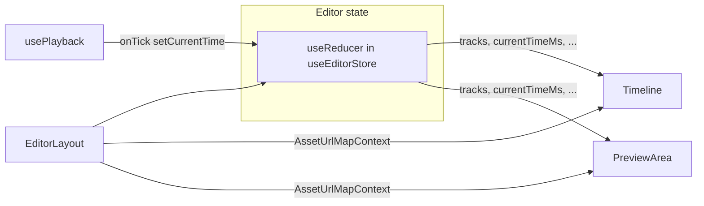

# Red Team Report: Editor / Timeline / Preview Architecture

**Artifact type:** Mixed (React feature architecture + implementation review)  
**Scope reviewed:** `frontend/src/features/editor/` — state (`useEditorStore` / reducer), shell (`EditorLayout`), timeline (`Timeline`, `TimelineClip`, ruler, playhead), preview (`PreviewArea`, caption preview), playback (`usePlayback`), asset URL context, supporting hooks/utils/services  
**Total findings:** 12 (🔴 0 critical · 🟠 4 high · 🟡 5 medium · 🔵 2 low · ⚪ 1 info)

---

## Architecture overview (how the code is organized)

### Layering

| Layer | Responsibility | Primary files |
|--------|-----------------|-------------|
| **Shell / orchestration** | Route-level project load, autosave, polling, mutations (publish, AI assemble), keyboard shortcuts, wiring children | `EditorLayout.tsx` (~1200 lines) |
| **Document state** | Single source of truth for tracks, clips, transitions, playhead, zoom, undo stacks | `useEditorStore.ts` (reducer + hooks, ~1000 lines), `types/editor.ts` |
| **Timeline UI** | Ruler, track headers, DnD reorder, clip rendering, media drop, playhead scroll-follow | `Timeline.tsx`, `TimelineClip.tsx`, `TrackHeader.tsx`, `Playhead.tsx`, `TimelineRuler.tsx` |
| **Preview** | Stack video layers per track, sync `<video>` / `<audio>` `currentTime` to timeline, transitions (CSS), text overlays, caption canvas | `PreviewArea.tsx` |
| **Playback clock** | `requestAnimationFrame` loop advancing `currentTimeMs` when `isPlaying` | `usePlayback.ts` |
| **Media resolution** | `assetId` → URL map from parent | `contexts/asset-url-map-context.ts` |
| **Domain utilities** | Trim/split, collisions, snapping, waveform trim, timecode | `utils/*` |

### Data flow (simplified)



**What works well**

- **Clear document model** — `Clip`, `Track`, `Transition`, and `EditorState` in one types module keeps the mental model coherent.
- **Reducer-centric mutations** — clip moves, trims, undo/redo, and track ops funnel through actions instead of ad hoc scattered `setState`.
- **Timeline as a controlled component** — `Timeline` receives props and callbacks; easier to test and reason about than reaching into a global store from deep children.
- **Isolated playback hook** — `usePlayback` is small and documents its contract (tick + end).
- **Explicit stripping of client-only fields** — `stripLocallyModifiedFromTracks` before PATCH aligns with a clean server contract.

---

## Findings

### 🟠 HIGH — `PreviewArea` video sync effect depends on unstable object identity — `PreviewArea.tsx` (~163–177, 188–243)

**What:** `activeVideoClipIdsByTrack` is a **new `Map` instance every render**. It is listed in the `useEffect` dependency array for the main video sync effect. React compares deps by reference, so the effect runs **on every render**, not only when time or clip membership meaningfully changes.

**Why it matters:** During playback, `currentTimeMs` already updates every frame → frequent re-renders. This pattern **amplifies work**: the effect repeatedly iterates all clips and touches every mounted `<video>`, increasing main-thread cost and risking jank or battery drain on long timelines. The same structural issue applies to **`audioClips`** (new array each render) driving the audio sync effect (~246–272).

**Proof / Example:** Any `isPlaying === true` session with multiple video clips; profile React commit + effect phase.

**Fix direction:** Derive a **stable** dependency: e.g. memoize the map with `useMemo` keyed by `currentTimeMs` (quantized if needed), `videoTracks` reference, and a hash/version of clip timings; or move “active clip ids” into a small selector hook; or depend on primitive values (serialized active ids + `currentTimeMs`) instead of fresh collections.

---

### 🟠 HIGH — God-component concentration — `EditorLayout.tsx` (~1207 lines)

**What:** One component owns queries, mutations, autosave debouncing, server reconciliation, media panel state, export modal, transition selection, keyboard shortcuts, playback wiring, and layout.

**Why it matters:** **High change risk** — any edit risks unrelated regressions (save loop, keyboard handler, polling). **Hard onboarding** — new contributors cannot safely change “just the toolbar” without reading most of the file. **Testing gap** — behavior is not unit-testable without mounting the entire shell.

**Fix direction:** Extract cohesive hooks: `useEditorAutosave`, `useEditorKeyboard`, `useEditorServerSync` (poll + merge), `useEditorToolbarActions`; keep `EditorLayout` as composition + JSX. Align with existing pattern of `usePlayback` as a separate unit.

---

### 🟠 HIGH — God-reducer concentration — `useEditorStore.ts` (~1027 lines)

**What:** A single `editorReducer` switch handles load, clip CRUD, transitions, captions, track reorder, undo stacks, duration recompute, and trim invariants.

**Why it matters:** **Merge conflicts** and **cognitive overload** scale with file size. Cross-cutting concerns (e.g. “every mutation must update `durationMs` and undo”) are easy to miss in new action branches. **No modular testing** of individual action groups.

**Fix direction:** Split reducer by domain (`tracksReducer`, `playbackReducer`, `exportReducer`) and combine with `useReducer` + `useMemo` reducer merge, **or** adopt a small state machine / slice pattern (even manual) with one file per concern and a thin facade hook.

---

### 🟠 HIGH — Preview vs timeline: duplicated time/transition logic — `PreviewArea.tsx` vs `Timeline` / export pipeline

**What:** Transition windows, active-clip detection, and source-time mapping (`trimStartMs`, `speed`) are implemented **inside `PreviewArea`** (pure functions + effects) rather than shared with the timeline or a single “composition engine.”

**Why it matters:** **Behavioral drift** — export/render on the server (or future WASM preview) can disagree with on-screen preview. Bugs fixed in preview may not apply to timeline thumbnails or final output. This is an architectural **single-source-of-truth** risk.

**Fix direction:** Extract a **`editor-composition` (or `timeline-engine`) module**: functions like `getActiveClipsAtTime`, `getClipSourceTimeAtTimelineTime`, `getTransitionStyleAtTime` used by preview, tests, and any future renderer; keep React as a thin consumer.

---

### 🟡 MEDIUM — Global JKL `playbackRate` vs per-clip `speed` — `usePlayback.ts` + `PreviewArea.tsx`

**What:** Timeline advancement uses `playbackRate` (including negative values for reverse). Preview sets `HTMLMediaElement.playbackRate` to **`clip.speed` only** and drives position from `currentTimeMs`. Forward fast-forward may work via frequent seeks; **reverse and very high rates** depend on codec, browser, and seek granularity.

**Why it matters:** Users can hit **inconsistent preview** (audio/video stutter, A/V drift, or reverse not matching professional NLE expectations) under JKL stress. Comment in `usePlayback` mentions “per-clip speed display” but the interaction with global rate is not encapsulated or tested.

**Fix direction:** Document the intended model (seek-based vs rate-based). Add **integration tests** or manual test matrix for JKL × clip speed. Optionally apply a single effective rate: `effectiveRate = playbackRate * clip.speed` where the platform allows, with a seek-based fallback.

---

### 🟡 MEDIUM — `durationMs` in state vs `computeDuration(tracks)` — `useEditorStore.ts` (`LOAD_PROJECT`, clip mutations)

**What:** On `LOAD_PROJECT`, `durationMs` comes from `project.durationMs` while reducer actions often recompute from clips via `computeDuration`. If server `durationMs` is stale vs clip extents, **UI end boundary** (playback end, ruler extent) can disagree with actual clips until the next mutation.

**Why it matters:** Rare but confusing: playhead cap, export modal duration, or “end of timeline” feel wrong after load or merge.

**Fix direction:** On load, set `durationMs` to `max(project.durationMs, computeDuration(tracks))` or always derive from tracks client-side and PATCH `durationMs` back.

---

### 🟡 MEDIUM — Timeline horizontal extent is capped/heuristic — `Timeline.tsx` (~139)

**What:** `totalWidthPx = Math.max((durationMs / 1000) * zoom + 4000, 4000)` — a large fixed padding exists; very long timelines at low zoom still have a floor. Scroll vs playhead math assumes this model.

**Why it matters:** Edge-case **UX** (excessive empty scroll, or confusing minimum width) for short vs very long projects; magic numbers are unexplained in code.

**Fix direction:** Named constants + comment (why 4000), or derive padding from viewport width; consider dynamic minimum based on `clientWidth`.

---

### 🟡 MEDIUM — Drag/drop payload trust boundary — `Timeline.tsx` (~166–180)

**What:** `application/x-contentai-asset` JSON is parsed from `dataTransfer` without schema validation (beyond try/catch). Type is a loose inline shape.

**Why it matters:** Low risk if only same-origin UI can initiate drag; higher if extended. **Malformed or hostile strings** could cause odd clip creation (NaN `startMs`, absurd `durationMs`).

**Fix direction:** Zod (or similar) validate `assetId`, `type`, `durationMs` before `onAddClip`; clamp `durationMs` and `startMs`.

---

### 🟡 MEDIUM — Caption preview redraw path — `PreviewArea.tsx` (~274–300)

**What:** Canvas caption drawing runs in `useEffect` on `currentTimeMs` and `tracks` / `textTrack`. Every playhead step clears and redraws.

**Why it matters:** Acceptable for moderate complexity; with many caption words and high refresh rate, **canvas work competes** with video sync effects (see HIGH unstable deps).

**Fix direction:** If profiling shows pain: throttle to rAF, use `OffscreenCanvas`, or render captions as DOM (like text clips) for simpler invalidation.

---

### 🔵 LOW — `Toast` error not i18n — `EditorLayout.tsx` (~319–320)

**What:** `toast.error("There's already a clip at that position")` is hardcoded English.

**Why it matters:** Violates project i18n convention; inconsistent UX for non-English users.

**Fix direction:** Add key to `en.json` and use `t(...)`.

---

### 🔵 LOW — File naming inconsistency — `hooks/use-caption-preview.ts` vs `useEditorStore.ts`

**What:** Mix of `use-kebab-case.ts` and `usePascalCase.ts` in the same folder.

**Why it matters:** Navigation friction only; no runtime impact.

**Fix direction:** Align with dominant frontend convention in repo (pick one and rename in a dedicated chore PR).

---

### ⚪ INFO — Transition selection lives outside reducer — `EditorLayout.tsx` (`selectedTransitionKey`)

**What:** Transition UI selection is React `useState` in the shell, not `EditorState`.

**Why it matters:** Not a defect — can be intentional to avoid persisting UI-only selection. Worth documenting so future devs do not “fix” it into the reducer without reason.

**Fix direction:** One-line comment near state: “ephemeral UI selection; not serialized.”

---

## Possible improvements and reorganization

### Short term (high leverage)

1. **Stabilize `PreviewArea` effect dependencies** (see HIGH finding) — likely the cheapest perf win.
2. **Extract `useEditorKeyboard` and `useEditorAutosave`** from `EditorLayout` — reduces regression surface without changing behavior.
3. **Add a shared `timelineMath` / `composition` module** — start by moving pure functions out of `PreviewArea` first; add unit tests.

### Medium term

4. **Introduce `EditorStateProvider`** (context) if deep children need dispatch without prop drilling — only if inspector/media panels grow further; avoid premature context.
5. **Snapshot tests or golden tests** for reducer: given `LOAD_PROJECT` + sequence of actions, expected `tracks` and `durationMs`.
6. **Document playback model** (JKL + clip speed + seek strategy) in a short ADR next to this file.

### Structural target (north star)

```
features/editor/
  model/           # types, pure reducers or slices, selectors
  playback/        # usePlayback, clock utilities
  preview/         # PreviewArea, video/audio sync hooks
  timeline/        # Timeline, TimelineClip, ruler, playhead
  shell/           # EditorLayout (thin), modals
  services/        # editor-api (existing)
  utils/           # keep shared pure helpers
```

This matches **separation by user-visible subsystem** and makes “preview vs export parity” a single module’s responsibility.

---

## Summary

**Top 3 risks to address immediately**

1. **Unstable React dependencies in `PreviewArea`** causing video/audio sync effects to run every render — performance and jank risk during playback.  
2. **Splitting `EditorLayout` and `useEditorStore`** — maintainability and safe iteration are constrained by file size.  
3. **Duplicated time/transition logic** between preview and the rest of the stack — long-term correctness risk vs export/server render.

**Patterns observed**

- Good separation between **reducer (data)** and **Timeline (presentation)**, but **shell and preview** have grown large, inlined logic.
- **Magic numbers** (timeline width padding, seek thresholds 0.1 / 0.15 s) scattered without central tuning.

**What is actually solid**

- Typed `Clip` / `Track` model and reducer-disciplined updates.  
- `usePlayback` as a focused side effect.  
- Controlled timeline with explicit callbacks.  
- Client-only field stripping before API persistence.

---

*Generated as an adversarial architecture review; items are prioritized by severity. Verify each finding against current `main` before large refactors.*
